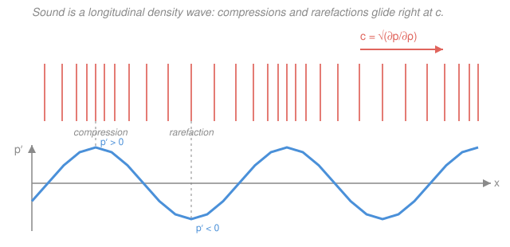

# Fluid Dynamics · Lesson 4.2: Sound waves

> ⏱ ~15 min · Module 4: Waves, instability, and turbulence · Builds on: [4.1 Surface gravity and capillary waves](04-01-surface-waves.md), [1.3 Conservation of mass and the continuity equation](01-03-continuity-equation.md) · Unlocks: [4.3 Hydrodynamic instability: Kelvin–Helmholtz and Rayleigh–Bénard](04-03-instability-kh-rb.md)

## Why this matters

Every wave in [4.1](04-01-surface-waves.md) rode on a free surface and needed gravity or surface tension to exist. Sound needs neither — it lives *inside* the fluid, and it exists for one reason we have been suppressing since [1.3](01-03-continuity-equation.md): fluids are slightly **compressible**. Squeeze a parcel and it pushes back; let go and the push overshoots. That elastic recoil, propagating from parcel to parcel, is sound. This lesson does the one thing the incompressible assumption forbids — it keeps the density change — and out falls the **wave equation**, the speed of sound $c=\sqrt{\partial p/\partial\rho}$, the **Mach number** $M=U/c$, and a precise statement of what "incompressible" ($M\ll1$) has been buying us all along.

## The idea

Picture a long tube of still air. Nudge the gas at one end: you crowd molecules into a thin slab, so its **density and pressure rise slightly above ambient**. High pressure pushes on the next slab, compressing *it* while the first slab, now over-pressurized, springs back and rarefies. The compression hands itself down the tube like a whispered rumor — each parcel barely moves, but the *pattern of compression* travels far and fast. That travelling pattern is a sound wave.

Two features fall straight out of this picture and separate sound from water waves. First, the fluid motion is **along** the direction the wave travels (you shove the next slab forward) — sound is **longitudinal**, unlike the transverse-ish orbital motion of surface waves. Second, the restoring "stiffness" is a bulk property of the gas — how hard it pushes back per unit squeeze — and it is *the same for every wavelength*. So all frequencies travel at one speed: sound is **non-dispersive**. A chord and a shout reach you in the same shape they left, which is why music survives the trip across a concert hall — a sharp contrast with dispersive water waves.

How stiff is the gas? Here is the subtlety that fooled Newton. When you compress a parcel of gas it *heats up*, and the compressions in a sound wave happen far too fast for that heat to leak away. So the right stiffness is the **adiabatic** one (no heat exchanged), not the isothermal one (constant temperature). That single correction — Laplace's — is the difference between the wrong sound speed and the right one.

## The formal version

Start from the full compressible equations and **linearize** about a fluid at rest. Write every field as a uniform background plus a small perturbation:

$$\rho = \rho_0 + \rho', \qquad p = p_0 + p', \qquad \mathbf{u} = \mathbf{0} + \mathbf{u}',$$

where $\rho_0,p_0$ are the constant ambient density and pressure, and $\rho',p',\mathbf{u}'$ are small ("small" = we drop any product of two primed quantities). *In words: sound is a tiny ripple on a still, uniform fluid.*

**Linearized continuity.** The exact law from [1.3](01-03-continuity-equation.md) is $\partial_t\rho + \nabla\cdot(\rho\mathbf{u})=0$. Substitute and keep only first-order terms — $\rho\mathbf{u}=(\rho_0+\rho')\mathbf{u}' \approx \rho_0\mathbf{u}'$, and $\partial_t\rho=\partial_t\rho'$:

$$\partial_t\rho' + \rho_0\,\nabla\cdot\mathbf{u}' = 0. \tag{1}$$

*In words: the local density rises exactly as fast as the velocity field converges — this is [1.3](01-03-continuity-equation.md) with the compressible term $\partial_t\rho'$ **kept**, not thrown away.*

**Linearized Euler.** The inviscid momentum equation ([1.5](01-05-euler-equation.md)) is $\rho\,\tfrac{D\mathbf{u}}{Dt}=-\nabla p$ (drop gravity — it sets the background, not the wave). The advective part $\mathbf{u}'\cdot\nabla\mathbf{u}'$ is second-order, so $\tfrac{D\mathbf{u}}{Dt}\approx\partial_t\mathbf{u}'$, and $\rho\approx\rho_0$:

$$\rho_0\,\partial_t\mathbf{u}' = -\nabla p'. \tag{2}$$

*In words: the pressure-gradient of the disturbance is what accelerates the fluid.*

**The closure — a barotropic relation.** Equations (1)–(2) are three scalar equations for the five unknowns $\rho',p',\mathbf{u}'$; we need a link between $p'$ and $\rho'$. Because the compressions are fast and lossless (adiabatic), pressure is a definite function of density, $p=p(\rho)$, and Taylor-expanding about ambient gives

$$p' = c^2\,\rho', \qquad c^2 \equiv \left(\frac{\partial p}{\partial\rho}\right)_{\!s}. \tag{3}$$

*In words: $c^2$ is the gas's stiffness — how much its pressure jumps per unit squeeze in density.* The subscript $s$ means "at constant entropy" — the adiabatic derivative, the whole point of the last section.

**Combine into the wave equation.** Take $\partial_t$ of (1) and subtract the divergence of (2):

$$\partial_t^2\rho' = -\rho_0\,\nabla\cdot(\partial_t\mathbf{u}') = \nabla\cdot(\nabla p') = \nabla^2 p' = c^2\nabla^2\rho',$$

using (3) at the last step. So

$$\boxed{\;\partial_t^2\rho' = c^2\,\nabla^2\rho'\;}\tag{4}$$

and, since $p'=c^2\rho'$ (and $\mathbf{u}'$ derives from $p'$), the **identical** equation governs $p'$ and the velocity potential $\phi$ where $\mathbf{u}'=\nabla\phi$. *In words: every acoustic quantity obeys the wave equation — the same $\partial_t^2 f=c^2\nabla^2 f$ you met in [`pdes`](../../pdes/syllabus.md).* A plane wave $\rho'=A\cos(kx-\omega t)$ solves (4) provided $\omega^2=c^2k^2$, i.e. the **dispersion relation**

$$\omega = c\,k \quad\Longrightarrow\quad c_{\text{phase}}=\frac{\omega}{k}=c,\qquad c_{\text{group}}=\frac{d\omega}{dk}=c.$$

Phase and group speed are equal and $k$-independent: **non-dispersive**, exactly as promised, and the flat opposite of the $\omega\propto\sqrt{k}$ (gravity) / $\omega\propto k^{3/2}$ (capillary) curves of [4.1](04-01-surface-waves.md).

**The sound speed of an ideal gas.** For an ideal gas an adiabatic (isentropic) process obeys $p\propto\rho^\gamma$, where $\gamma=c_p/c_v$ is the ratio of specific heats ($\gamma=\tfrac75=1.4$ for diatomic air). Then

$$c^2=\left(\frac{\partial p}{\partial\rho}\right)_{\!s}=\gamma\frac{p}{\rho}, \qquad\text{and with } p=\frac{\rho R T}{M},\qquad \boxed{\,c=\sqrt{\frac{\gamma p}{\rho}}=\sqrt{\frac{\gamma R T}{M}}\,}\tag{5}$$

with $R=8.314\ \mathrm{J\,mol^{-1}K^{-1}}$ the gas constant, $T$ the absolute temperature (K), and $M$ the molar mass (kg/mol). *In words: sound speed depends only on the gas and its temperature — not on pressure or wavelength.* Check air at $20^\circ$C ($T=293$ K, $M=0.0290\ \mathrm{kg/mol}$): $c=\sqrt{1.4\times8.314\times293/0.0290}\approx\sqrt{1.18\times10^5}\approx 343\ \mathrm{m/s}$ — the textbook value. ✓

**Mach number and impedance.** For a flow of characteristic speed $U$, the **Mach number**

$$M=\frac{U}{c}$$

measures speed against sound speed: $M<1$ **subsonic**, $M>1$ **supersonic** (where compressions pile into **shock waves** — nonlinear, beyond this course). Crucially, the incompressible limit $\nabla\cdot\mathbf{u}=0$ of [1.3](01-03-continuity-equation.md) is *exactly* $M\to0$: from (1), $\nabla\cdot\mathbf{u}'\sim(U/L)$ while $\rho'/\rho_0\sim M^2$, so density changes are negligible precisely when $M\ll1$ (the familiar rule of thumb $M\lesssim0.3$). Two more one-liners you will see again: the acoustic (specific) **impedance** $Z=\rho_0 c$ relates pressure to velocity in a plane wave, $p'=\rho_0 c\,u'$, and the **intensity** (power per area) is $I=\overline{p'^2}/(\rho_0 c)$.

## Picture

## Worked examples

**Example 1 (mechanical — sound speed from temperature).** Find the speed of sound in air on a cold day, $T=0^\circ$C $=273$ K. Using (5) with $\gamma=1.4$, $M=0.0290\ \mathrm{kg/mol}$:

$$c=\sqrt{\frac{1.4\times8.314\times273}{0.0290}}=\sqrt{1.096\times10^{5}}\approx 331\ \mathrm{m/s}.$$

Colder air is slower sound — the molecules are more sluggish, so the elastic recoil is lazier. Note the *scaling*: $c\propto\sqrt T$, so a $20^\circ$C rise from 273 K to 293 K multiplies $c$ by $\sqrt{293/273}\approx1.036$, taking 331 to 343 m/s — matches the anchor value.

**Example 2 (why you'd care — the incompressible boundary).** A commercial jet cruises at $U=250\ \mathrm{m/s}$ at altitude where $T=-50^\circ$C $=223$ K. Local sound speed:

$$c=\sqrt{\frac{1.4\times8.314\times223}{0.0290}}\approx\sqrt{8.95\times10^4}\approx 299\ \mathrm{m/s},\qquad M=\frac{250}{299}\approx0.84.$$

Subsonic — but only just, and the cold thin air has *lowered* $c$, pushing $M$ up. The same 250 m/s at sea-level $20^\circ$C ($c=343$) would be $M=0.73$. At $M=0.84$ the density variations are of order $M^2\approx0.7$, i.e. tens of percent — you may **not** treat this flow as incompressible; the whole point of transonic aerodynamics. Below $M\approx0.3$ ($\rho'/\rho_0\lesssim9\%$) the incompressible model of [1.3](01-03-continuity-equation.md) is safe.

## Watch out

- **You might use the isothermal stiffness $c^2=p/\rho$ (Newton's value) — it is wrong by $\sqrt\gamma$.** Compressions in sound are too fast to exchange heat, so the process is adiabatic, $p\propto\rho^\gamma$, giving $c^2=\gamma p/\rho$. Newton got $\approx290$ m/s for air; Laplace's factor $\sqrt{1.4}\approx1.18$ fixes it to $343$. (Problem 3.)
- **"Incompressible" is not a property of the fluid — it is the statement $M\ll1$.** Air carries sound (it is compressible), yet the flow around a cyclist is incompressible because $M\approx0.04$. Same molecules, different $U/c$ — exactly the caution from [1.3](01-03-continuity-equation.md).
- **Sound is longitudinal; surface waves are not.** In [4.1](04-01-surface-waves.md) parcels traced orbits transverse-ish to propagation and different wavelengths ran at different speeds (dispersion). Here $\mathbf{u}'\parallel$ propagation and *all* wavelengths share one speed $c$. Don't import the dispersion relation of one into the other.

## One-liner

> Keep the density term that incompressibility discards, close with the adiabatic stiffness $c^2=(\partial p/\partial\rho)_s=\gamma p/\rho$, and compressible flow linearizes to the wave equation $\partial_t^2 p'=c^2\nabla^2 p'$ — longitudinal, non-dispersive sound at $c=\sqrt{\gamma RT/M}\approx343$ m/s in air.

## Problems

**P1 (🟢)** Find the speed of sound in helium at room temperature, $T=293$ K. Helium is monatomic, so $\gamma=\tfrac53$, and its molar mass is $M=4.00\times10^{-3}\ \mathrm{kg/mol}$. Why does inhaling it raise your voice's pitch?

**P2 (🟡)** A fighter aircraft flies at $U=340\ \mathrm{m/s}$ at high altitude where $T=223$ K. Compute the local sound speed and the Mach number; is it supersonic? Would the same airspeed be supersonic at sea level ($20^\circ$C)? What one physical thing changed?

**P3 (🔴, optional)** Newton assumed sound compressions were *isothermal*, giving $c_{\text{Newton}}=\sqrt{p/\rho}$. Compute this for air at $20^\circ$C ($p=1.013\times10^5$ Pa, $\rho=1.20\ \mathrm{kg/m^3}$) and compare to the measured 343 m/s. By exactly what factor is Newton off, and why is the adiabatic value larger?

Solutions

**P1** By (5), $c=\sqrt{\gamma RT/M}=\sqrt{(5/3)\times8.314\times293/(4.00\times10^{-3})}$. Numerator: $(1.667)(8.314)(293)=4060$; divide by $4.00\times10^{-3}$ to get $1.015\times10^{6}$; square root:

$$c\approx 1.0\times10^{3}\ \mathrm{m/s}\ (\approx 1007\ \mathrm{m/s}).$$

Almost **three times** the speed in air. Your vocal-tract resonances sit at frequencies $f\propto c/L$ (fixed cavity length $L$), so tripling $c$ triples those resonant frequencies — the "Donald Duck" squeak. Pitch tracks sound speed, and sound speed is high in helium because it is so light ($c\propto1/\sqrt M$).

*Check.* Dimensions: $\sqrt{(\mathrm{J\,mol^{-1}K^{-1}})(\mathrm{K})/(\mathrm{kg\,mol^{-1}})}=\sqrt{\mathrm{J/kg}}=\sqrt{\mathrm{m^2/s^2}}=\mathrm{m/s}$ ✓. Ratio to air: $c_{\text{He}}/c_{\text{air}}=\sqrt{(\gamma_{\text{He}}/\gamma_{\text{air}})(M_{\text{air}}/M_{\text{He}})}=\sqrt{(1.667/1.4)(29.0/4.00)}=\sqrt{8.63}\approx2.9$ ✓.

**P2** Local sound speed at $T=223$ K (same computation as Example 2):

$$c=\sqrt{\frac{1.4\times8.314\times223}{0.0290}}\approx299\ \mathrm{m/s},\qquad M=\frac{340}{299}\approx1.14.$$

**Supersonic** ($M>1.14$) — the aircraft outruns the pressure signals it emits, so they pile into a shock (the sonic boom; nonlinear, beyond scope). At sea level, $c=343$ m/s, so the same 340 m/s gives $M=340/343\approx0.99$ — **subsonic**. The only thing that changed is the temperature: cold high-altitude air has a lower $c\propto\sqrt T$, so an unchanged airspeed crosses from subsonic to supersonic just by climbing.

*Check.* $c\propto\sqrt T$: $c(223)/c(293)=\sqrt{223/293}=0.872$, and $343\times0.872=299$ ✓. Mach is dimensionless (m/s over m/s) ✓.

**P3** Isothermal: $c_{\text{Newton}}=\sqrt{p/\rho}=\sqrt{1.013\times10^{5}/1.20}=\sqrt{8.44\times10^{4}}\approx 291\ \mathrm{m/s}$. Measured is 343 m/s, so Newton is low by

$$\frac{343}{291}\approx1.18=\sqrt{1.4}=\sqrt\gamma.$$

Exactly the factor $\sqrt\gamma$, because the true (adiabatic) stiffness is $c^2=\gamma p/\rho$ while Newton used $c^2=p/\rho$. Physically: in a real sound wave the compressed gas has no time to shed its heat, so it also *warms*, and a warmer squeezed gas pushes back harder than an isothermal one would — the gas is stiffer by the factor $\gamma$, hence faster by $\sqrt\gamma$.

*Check.* $c_{\text{Newton}}^2/c^2=(p/\rho)/(\gamma p/\rho)=1/\gamma=1/1.4=0.714$, so $c_{\text{Newton}}/c=\sqrt{0.714}=0.845$, and $343\times0.845=290$ m/s ✓.

## Flashback

**From Lesson 1.3 (continuity):** A gas flows steadily in one dimension along a duct, $\mathbf{u}=(u(x),0,0)$, with a measured steady density profile $\rho(x)=\rho_0\,(1+x/L)$ ($L>0$). Given the inlet speed $u(0)=U_0$, find $u(x)$, and say in one sentence whether the gas speeds up or slows down.

Solution

Steady flow means $\partial_t\rho=0$, so continuity $\partial_t\rho+\partial_x(\rho u)=0$ reduces to $\partial_x(\rho u)=0$: the mass flux $\rho u$ is constant along the duct. Fixing it at the inlet, $\rho u=\rho_0 U_0$, so

$$u(x)=\frac{\rho_0 U_0}{\rho(x)}=\frac{U_0}{1+x/L}.$$

The gas **slows down** as it moves into denser fluid downstream — the same mass per second is carried by a thicker gas, so it needn't move as fast.

*Check.* At $x=0$, $u=U_0$ ✓; product $\rho u=\rho_0(1+x/L)\cdot U_0/(1+x/L)=\rho_0 U_0$, constant ✓. Dimensions of $\rho u$: $\mathrm{kg\,m^{-2}s^{-1}}$, a mass flux ✓. (Opposite sign to [1.3](01-03-continuity-equation.md)'s thinning-duct example, where the gas *sped up* — because there density fell downstream.)

## Connections

- **Backward:** sound is the compressible flow that [1.3](01-03-continuity-equation.md) deliberately excluded — we kept the density term $\partial_t\rho'$ that incompressibility ($\nabla\cdot\mathbf{u}=0$) drops, and the linearized momentum balance is the inviscid [Euler equation](01-05-euler-equation.md) stripped to first order. The result quantifies exactly when incompressibility is legal: $M=U/c\ll1$.
- **Forward:** [4.3](04-03-instability-kh-rb.md) also linearizes a background state and hunts for wave-like disturbances — but there the disturbances *grow* (instability) rather than merely propagate. The Mach number introduced here is the gateway to compressible gas dynamics and shocks (past this course's scope, noted in the syllabus).
- **Sideways:** the governing equation $\partial_t^2 f=c^2\nabla^2 f$ is *the* wave equation of [`pdes`](../../pdes/syllabus.md) — the same object whether $f$ is a plucked string, an EM field, or acoustic pressure. And the adiabatic closure $p\propto\rho^\gamma$ with $\gamma=c_p/c_v$ that fixes the sound speed is pure [`thermodynamics-physics`](../../thermodynamics-physics/syllabus.md) — Laplace's correction is where thermodynamics quietly sets the speed of a mechanical wave.
