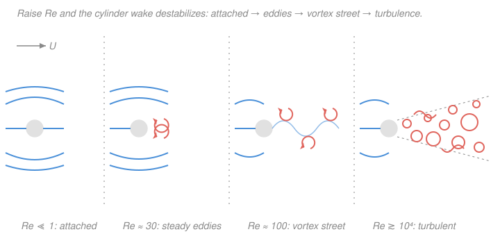

# Fluid Dynamics · Lesson 4.4: The transition to turbulence

> ⏱ ~15 min · Module 4: Waves, instability, and turbulence · Builds on: [4.3 Hydrodynamic instability: Kelvin–Helmholtz and Rayleigh–Bénard](04-03-instability-kh-rb.md), [3.1 The Reynolds number and dynamical similarity](03-01-reynolds-number.md) · Unlocks: [4.5 Turbulence: the energy cascade and Kolmogorov scaling](04-05-turbulence-kolmogorov.md)

## Why this matters

Open a faucet a crack and the stream is glassy and still — you can see through it. Open it more and at some point it shatters into a churning, opaque rope. Nothing changed but the flow rate, yet the fluid crossed a line between two utterly different worlds: **laminar** (ordered, layered, predictable) and **turbulent** (irregular, three-dimensional, mixing). This lesson is about *how* that crossing happens — not as a single switch but as a **staged loss of stability**, and about the deep reclassification it forced on physics: turbulence is not randomness but **deterministic chaos**. That reframing is the bridge from fluids to the whole subject of [`dynamical-systems`](../../dynamical-systems/syllabus.md).

## The idea

In [4.3](04-03-instability-kh-rb.md) you saw a smooth flow lose stability *once* — a shear layer rolls up, a still fluid layer starts convecting. Transition to turbulence is what happens when you keep pushing: the flow loses stability *again and again*, each new instability switching on at its own critical Reynolds number, each one adding structure until the motion looks hopelessly complicated.

Picture the wake behind a cylinder as you crank up the speed (the Reynolds number $Re$ from [3.1](03-01-reynolds-number.md)):

- **Very slow** ($Re \ll 1$): the flow glides around and closes up behind, fore–aft almost symmetric. **Steady.**
- **Faster** ($Re \sim 40$): two fixed eddies sit pinned behind the cylinder. Still **steady** — a picture that doesn't change in time.
- **Faster still** ($Re \sim 50$–$100$): those eddies can no longer stay put. They peel off alternately, left–right–left, into the famous **von Kármán vortex street**. The flow is now **periodic** — it ticks at a single clean frequency. This first jump from steady to oscillating is a **bifurcation**: a qualitative change in the flow's behavior triggered by a parameter crossing a threshold.
- **Higher** $Re$: a second frequency appears (the street itself wobbles), then the two beat against each other — **quasi-periodic**.
- **Higher still**: the clean tones smear into a continuous broadband roar. **Chaotic — turbulent.**

So the route is a *cascade of instabilities*: **steady → periodic → quasi-periodic → chaos**. Each arrow is a mode going unstable. That is the whole story in one line.

## The formal version

**Two competing pictures of the endpoint.** For decades the accepted account was **Landau's** (1944): turbulence is a superposition of *infinitely many* independent oscillations, each switching on at its own $Re$, piling up incommensurate frequencies until the motion looks random.

*In words: turbulence as an orchestra with endlessly many instruments, each added one at a time.*

The modern view is **Ruelle–Takens** (1971): you need only a *handful* of bifurcations. After just a few, the system's trajectory in state space settles onto a **strange attractor** — a bounded set on which nearby trajectories separate exponentially. That exponential separation is **sensitive dependence on initial conditions**: two flows that start almost identically diverge until they are uncorrelated.

*In words: turbulence is a few steps to chaos, not infinitely many — and the chaos is generated by the deterministic equations themselves.*

This is the crucial reframing. The Navier–Stokes equations are perfectly deterministic — no dice, no noise term. Yet their solutions can be chaotic: unpredictable in practice because any uncertainty $\delta_0$ in the initial state grows like

$$\delta(t) \sim \delta_0\, e^{\lambda t}, \qquad \lambda > 0,$$

with $\lambda$ the (largest) **Lyapunov exponent** — the growth rate of tiny errors. *In words: a microscopic difference now becomes a macroscopic difference soon, so long-range prediction is impossible even though the physics is exact.* This is the **butterfly effect**; turbulence is its home turf. Turbulence is **chaotic, not random** — a distinction we will make quantitative in [`dynamical-systems`](../../dynamical-systems/syllabus.md).

**The critical Reynolds number.** The controlling parameter is $Re = UL/\nu$ (speed $U$, size $L$, kinematic viscosity $\nu$, from [3.1](03-01-reynolds-number.md)) — the ratio of destabilizing inertia to stabilizing viscosity. Roughly:

$$Re < Re_{\text{crit}} \Rightarrow \text{laminar}, \qquad Re > Re_{\text{crit}} \Rightarrow \text{turbulent},$$

but $Re_{\text{crit}}$ depends on the geometry, and — importantly — the transition is **not sharp**. For flow in a circular pipe the textbook figure is

$$Re_{\text{crit}} \approx 2300 \qquad (Re = \bar U D / \nu,\ \ D = \text{diameter},\ \bar U = \text{mean speed}).$$

This is **Osborne Reynolds' 1883 experiment**: he injected a thin filament of dye into pipe flow and slowly raised the speed. Below threshold the dye rode along as a straight, undisturbed thread — laminar. Above it the thread began to wobble, then abruptly burst into swirling eddies that filled the pipe — turbulent.

**A subtlety worth flagging.** Pipe flow (Hagen–Poiseuille, [3.2](03-02-couette-poiseuille.md)) is, remarkably, **linearly stable at all $Re$** — the eigenvalue analysis of a small disturbance predicts *no* instability, ever. Yet real pipes transition near $2300$. The resolution: transition here is driven by *finite-amplitude* disturbances and **transient (non-normal) growth** — perturbations that decay eventually but amplify enormously first, enough to trip the flow into turbulence before they die. That is why the observed threshold depends on inlet roughness and vibration: in an exquisitely quiet pipe, laminar flow has been sustained past $Re \sim 10^5$.

*In words: linear stability is not the whole story — a flow can be "stable to whispers but unstable to shouts."*

**Hallmarks of turbulence.** Once transitioned, a turbulent flow is:

- **irregular** in space and time (chaotic, not periodic);
- **three-dimensional and rotational** — full of vorticity $\boldsymbol\omega = \nabla\times\mathbf{u}$ ([2.2](02-02-vorticity-circulation.md)), a tangle of eddies over a **broad range of scales**;
- **strongly mixing and diffusive** — the **turbulent (eddy) diffusivity** vastly exceeds the molecular one, $\nu_T \gg \nu$, because eddies transport momentum, heat and dye bodily rather than by slow molecular jitter (that is why cream stirred into coffee homogenizes in a second, not a week);
- **strongly dissipative** — those small eddies convert kinetic energy to heat, so turbulence sharply **raises drag** and demands continuous energy input to sustain.

That broad range of scales and enhanced dissipation is exactly the raw material of the energy cascade in [4.5](04-05-turbulence-kolmogorov.md).

## Picture

## Worked examples

**Example 1 (which regime? — the vortex street).** Air ($\nu \approx 1.5\times10^{-5}\ \mathrm{m^2/s}$) blows at $U = 6\ \mathrm{m/s}$ past a thin wire of diameter $D = 3\ \mathrm{mm} = 3\times10^{-3}\ \mathrm{m}$. First the regime:

$$Re = \frac{UD}{\nu} = \frac{6 \times 3\times10^{-3}}{1.5\times10^{-5}} = \frac{1.8\times10^{-2}}{1.5\times10^{-5}} = 1200.$$

That sits squarely in the vortex-shedding range ($Re \sim 50$–$10^5$), so the wire sheds a periodic von Kármán street. The shedding frequency follows from the **Strouhal number** $St \equiv fD/U \approx 0.2$ (a near-universal constant over that range):

$$f = St\,\frac{U}{D} = 0.2 \times \frac{6}{3\times10^{-3}} = 0.2 \times 2000 = 400\ \mathrm{Hz}.$$

A 400 Hz tone — this is why wind makes wires and fences *sing* (aeolian tones), and why the same physics once tore apart the Tacoma Narrows-style structures when shedding matched a natural frequency.

**Example 2 (the transition flow rate — tie to Boss 3).** At what volumetric flow rate does water ($\nu = 1.0\times10^{-6}\ \mathrm{m^2/s}$) in a pipe of radius $a = 1\ \mathrm{cm}$ (so $D = 2a = 0.02\ \mathrm{m}$) cross into turbulence? Set $Re = \bar U D/\nu = 2300$ and solve for the mean speed:

$$\bar U_{\text{crit}} = \frac{Re_{\text{crit}}\,\nu}{D} = \frac{2300 \times 10^{-6}}{0.02} = 0.115\ \mathrm{m/s}.$$

The flow rate is speed times cross-sectional area, $Q = \bar U\,\pi a^2$:

$$Q_{\text{crit}} = 0.115 \times \pi (0.01)^2 \approx 0.115 \times 3.14\times10^{-4} \approx 3.6\times10^{-5}\ \mathrm{m^3/s} \approx 36\ \mathrm{mL/s}.$$

Below about 36 mL/s the pipe runs laminar with the parabolic Poiseuille profile of Boss problem 3; above it, expect transition. (Modest — a briskly running kitchen tap already exceeds this, which is why household plumbing is essentially always turbulent.)

## Watch out

- **You might think turbulence is random.** It is not — it is **deterministic chaos**. The same $Re$ and geometry give the same *statistics* every time; what is unpredictable is the *detailed* trajectory, because errors grow like $e^{\lambda t}$. Randomness has no equation; turbulence has Navier–Stokes.
- **You might think $Re_{\text{crit}}$ is a sharp, universal number.** It is neither. It depends on geometry (pipe $\sim 2300$, a flat-plate boundary layer transitions at a very different value) and on the disturbance environment — a quiet pipe stays laminar far past $2300$. Treat $2300$ as a rule of thumb, not a law.
- **You might think "linearly stable" means "stays laminar."** Pipe flow is the counterexample: linearly stable at every $Re$, yet it transitions, via finite-amplitude and transient growth. Linear stability rules out infinitesimal disturbances only.
- **You might expect the vortex-street frequency to grow with cylinder size.** The opposite — $f = St\,U/D$ falls as $D$ grows. Big slow structures shed slowly (a bridge pier), thin fast ones sing high (a wire).

## One-liner

> As $Re$ climbs, a laminar flow does not snap but *cascades* — steady → periodic → quasi-periodic → chaotic — through a few bifurcations onto a strange attractor, making turbulence deterministic chaos with sensitive dependence on initial conditions, not randomness.

## Problems

**P1 (🟢)** Water ($\nu = 1.0\times10^{-6}\ \mathrm{m^2/s}$) flows through a pipe of diameter $D = 2.5\ \mathrm{cm}$ at a mean speed $\bar U = 0.05\ \mathrm{m/s}$. Compute $Re$ and state the regime. Then find the mean speed at which this pipe would be expected to transition to turbulence.

**P2 (🟡)** A cylindrical chimney of diameter $D = 0.8\ \mathrm{m}$ stands in a $U = 10\ \mathrm{m/s}$ wind (air, $\nu = 1.5\times10^{-5}\ \mathrm{m^2/s}$). (a) Confirm the wake is in the vortex-shedding range. (b) Using $St \approx 0.2$, find the vortex-shedding frequency and the corresponding period. Why might an engineer care about this number?

**P3 (🔴, optional)** Two nominally identical turbulent flows are set up with initial conditions differing by $\delta_0 = 10^{-6}$ (in some normalized state variable). The largest Lyapunov exponent is $\lambda = 2\ \mathrm{s^{-1}}$. Estimate the time for the difference to grow to order unity ($\delta \sim 1$), and explain in one sentence what this implies for predicting the flow.

Solutions

**P1** With $D = 0.025\ \mathrm{m}$, $\bar U = 0.05\ \mathrm{m/s}$, $\nu = 10^{-6}\ \mathrm{m^2/s}$:

$$Re = \frac{\bar U D}{\nu} = \frac{0.05 \times 0.025}{10^{-6}} = \frac{1.25\times10^{-3}}{10^{-6}} = 1250.$$

Since $1250 < 2300$, the flow is **laminar**. The transition speed comes from setting $Re = 2300$:

$$\bar U_{\text{crit}} = \frac{2300 \times 10^{-6}}{0.025} = 0.092\ \mathrm{m/s}.$$

So it would transition somewhere above roughly $0.09\ \mathrm{m/s}$ — a little under twice the current speed.

*Check.* Dimensions: $[\bar U D/\nu] = (\mathrm{m/s})(\mathrm{m})/(\mathrm{m^2/s}) = 1$, dimensionless ✓. Sanity: the current $Re$ is below $2300$ and the current speed ($0.05$) is below $\bar U_{\text{crit}}$ ($0.092$) — the two statements agree ✓.

**P2** (a) Regime:

$$Re = \frac{UD}{\nu} = \frac{10 \times 0.8}{1.5\times10^{-5}} = \frac{8}{1.5\times10^{-5}} \approx 5.3\times10^{5}.$$

This is at the upper edge of the classical vortex-street range; a coherent (if turbulent-cored) periodic shedding still occurs and $St \approx 0.2$ remains a reasonable estimate. (b) Frequency and period:

$$f = St\,\frac{U}{D} = 0.2 \times \frac{10}{0.8} = 0.2 \times 12.5 = 2.5\ \mathrm{Hz}, \qquad T = \frac{1}{f} = 0.4\ \mathrm{s}.$$

An engineer cares because the shedding applies a periodic side-to-side force at $2.5\ \mathrm{Hz}$; if that matches a structural natural frequency, **resonance** (vortex-induced vibration) can build dangerous oscillations — the reason tall chimneys and cables carry helical strakes or dampers.

*Check.* Dimensions: $[St\,U/D] = (\mathrm{m/s})/\mathrm{m} = \mathrm{s^{-1}} = \mathrm{Hz}$ ✓. Sanity: a big slow structure sheds slowly (a few Hz), consistent with the "big → low frequency" rule; contrast the 400 Hz singing wire of Example 1 ✓.

**P3** Set $\delta(t) = \delta_0 e^{\lambda t} \sim 1$ and solve for $t$:

$$e^{\lambda t} \sim \frac{1}{\delta_0} = 10^{6} \;\Longrightarrow\; t \sim \frac{\ln(10^6)}{\lambda} = \frac{6\ln 10}{2} = \frac{6 \times 2.303}{2} \approx 6.9\ \mathrm{s}.$$

In under about 7 seconds a millionth-scale initial difference has grown to order one: the two flows are then completely decorrelated, so **detailed prediction beyond a few multiples of $1/\lambda$ is impossible** no matter how precisely you measure the start — the equations are deterministic, but the flow is not predictable.

*Check.* Dimensions: $[\ln(1/\delta_0)/\lambda] = 1/\mathrm{s^{-1}} = \mathrm{s}$ ✓ (the log is dimensionless). Sanity: halving $\lambda$ would double the prediction horizon — slower error growth buys more predictability, as expected ✓.

## Flashback

**From Lesson 3.1 (The Reynolds number and dynamical similarity):** A full-scale submarine hull of diameter $L = 5\ \mathrm{m}$ cruises at $U = 3\ \mathrm{m/s}$ in seawater. To reproduce the *same flow regime* on a $1/25$ scale model ($L_m = 0.2\ \mathrm{m}$) tested in the **same fluid**, what model speed $U_m$ gives dynamical similarity? (Fresh variant — a similarity match, not a transition threshold.)

Solution

Dynamical similarity means equal Reynolds numbers. With the same fluid, $\nu$ cancels:

$$Re_m = Re \;\Longrightarrow\; \frac{U_m L_m}{\nu} = \frac{U L}{\nu} \;\Longrightarrow\; U_m = U\,\frac{L}{L_m} = 3 \times \frac{5}{0.2} = 3 \times 25 = 75\ \mathrm{m/s}.$$

The model must be run **25 times faster** than the real hull. This is exactly why matching $Re$ on small models is so hard: the required speeds are impractical (or would introduce compressibility), which pushes engineers toward larger tanks, faster or denser test fluids (lower $\nu$), or accepting a mismatch.

*Check.* Dimensions: $U(L/L_m)$ is $(\mathrm{m/s})\cdot(\text{dimensionless})$ ✓. Limiting sense: a smaller model needs a proportionally higher speed to keep $Re$ fixed — shrink the length by $25$, grow the speed by $25$ ✓.

## Connections

- **Backward:** this is [4.3](04-03-instability-kh-rb.md)'s single instability, *iterated* — each new mode going unstable at its own critical $Re$ — and it is organized entirely by the Reynolds number of [3.1](03-01-reynolds-number.md), the one dimensionless group that says whether inertia or viscosity wins. The eddies are the vorticity of [2.2](02-02-vorticity-circulation.md).
- **Forward:** [4.5 Turbulence: the energy cascade and Kolmogorov scaling](04-05-turbulence-kolmogorov.md) takes the fully turbulent state — its broad range of scales and strong dissipation — and extracts the statistical law (the $-5/3$ spectrum) that survives the chaos, since individual trajectories cannot be predicted but their statistics can.
- **Sideways (dynamical systems):** every idea here is core [`dynamical-systems`](../../dynamical-systems/syllabus.md) — a **bifurcation** (steady → periodic is a Hopf bifurcation), a **strange attractor** (Ruelle–Takens), **sensitive dependence** and the **Lyapunov exponent** (the butterfly effect). Turbulence is that abstract theory wearing a fluid costume; the faucet and the Lorenz equations are the same phenomenon.
