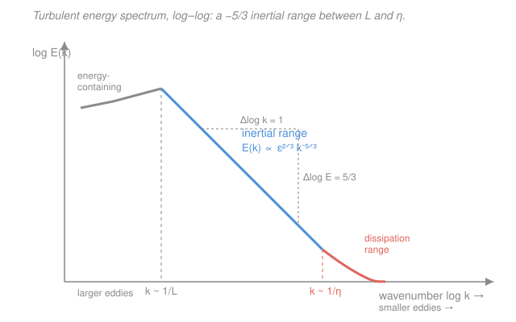

# Fluid Dynamics · Lesson 4.5: Turbulence: the energy cascade and Kolmogorov scaling

> ⏱ ~15 min · Module 4: Waves, instability, and turbulence · Builds on: [4.4 The transition to turbulence](04-04-transition-to-turbulence.md), [1.5 The Euler equation](01-05-euler-equation.md) · Unlocks: **course finale** — bridges forward to the [`astrophysics` syllabus](../../astrophysics/syllabus.md) (turbulent accretion, stellar convection)

## Why this matters

Turbulence is the last great unsolved problem of classical physics: no closed-form solution of the Navier–Stokes equations for a fully turbulent flow exists, and the equations themselves ([1.6](01-06-navier-stokes.md)) are as exact as ever. Yet a turbulent flow — smoke plume, river rapid, jet wake, the churning surface of the Sun — is not random noise. It has *structure*, and one piece of that structure is so robust it holds across nearly every high-Reynolds flow ever measured: the **Kolmogorov $-5/3$ spectrum**. This lesson is the payoff of the whole course. We can't solve turbulence, but with nothing more than a physical picture and dimensional analysis we can predict its most famous law — and see exactly where it comes from and where it breaks.

## The idea

Picture stirring cream into coffee. Your spoon injects energy at one big scale — the width of the cup. That big swirl is unstable ([4.3](04-03-instability-kh-rb.md), [4.4](04-04-transition-to-turbulence.md)): it buckles and sheds smaller swirls, which shed smaller ones still, a hierarchy of **eddies** spanning every size from the cup down to the near-invisible. This is Lewis Fry Richardson's 1922 **energy cascade**, and he put it in verse:

> *Big whorls have little whorls that feed on their velocity, and little whorls have lesser whorls, and so on to viscosity.*

Here is the crucial physics. At the **large scales**, inertia dominates viscosity ([3.1](03-01-reynolds-number.md): high Reynolds number), so the big eddies barely feel friction — they don't *dissipate* energy, they merely *hand it down* to smaller eddies. That handoff repeats, scale after scale, moving energy to ever-smaller eddies **without loss**, like a bucket brigade. Only at the very bottom — the tiniest eddies — do velocity gradients get so steep that viscosity finally bites, converting the kinetic energy to heat.

So there are three regimes: energy **injected** at the large **integral scale** $L$ (set by the geometry — the cup, the pipe, the wing); energy **transferred** through a wide **inertial range** of intermediate eddies; energy **dissipated** at the tiny **Kolmogorov scale** $\eta$. In statistical steady state, whatever flux of energy enters the top must exit the bottom — so the energy flux through *every* scale in between equals the dissipation rate $\varepsilon$. That single conserved flux is the key to everything.

## The formal version

**The dissipation rate.** Let $\varepsilon$ be the **energy dissipated per unit mass per unit time**. Energy-per-mass has units of $\mathrm{m^2/s^2}$ (a velocity squared), so

$$[\varepsilon] = \frac{\mathrm{m^2/s^2}}{\mathrm{s}} = \frac{\mathrm{m^2}}{\mathrm{s^3}}.$$

*In words: $\varepsilon$ is the rate at which the cascade grinds motion into heat — and, in steady state, also the rate energy is fed in at the top and the flux passing through every scale between.*

**Kolmogorov's 1941 hypothesis (K41).** Deep inside the inertial range ($\eta \ll \ell \ll L$), an eddy of size $\ell$ has forgotten *how* it was stirred and is far from *where* viscosity acts. So its statistics can depend on only two things: the flux $\varepsilon$ passing through, and the scale $\ell$ itself. *In words: in the inertial range, $\varepsilon$ and the scale are the only players — geometry and viscosity have both dropped out.* That single assumption, plus dimensional analysis, fixes the rest.

**Velocity of an eddy of size $\ell$.** We want a velocity $u_\ell$ (units $\mathrm{m/s}$) built from $\varepsilon$ ($\mathrm{m^2/s^3}$) and $\ell$ ($\mathrm{m}$). Only one combination works:

$$[\varepsilon\,\ell] = \frac{\mathrm{m^2}}{\mathrm{s^3}}\cdot \mathrm{m} = \frac{\mathrm{m^3}}{\mathrm{s^3}} \;\Longrightarrow\; (\varepsilon\ell)^{1/3} \text{ has units } \frac{\mathrm{m}}{\mathrm{s}}, \qquad \boxed{u_\ell \sim (\varepsilon\,\ell)^{1/3}.}$$

*In words: bigger eddies swirl faster, but only as the cube root of their size.* Their **turnover time** $\tau_\ell \sim \ell/u_\ell \sim \varepsilon^{-1/3}\ell^{2/3}$ shrinks toward small scales — little whorls spin fast.

**The energy spectrum and the $-5/3$ law.** Turbulent kinetic energy per unit mass is spread across scales; the **energy spectrum** $E(k)$ measures how much sits near wavenumber $k \sim 1/\ell$ (units $\mathrm{1/m}$), defined so that $\int_0^\infty E(k)\,dk$ is the kinetic energy per mass ($\mathrm{m^2/s^2}$). Hence

$$[E(k)] = \frac{\mathrm{m^2/s^2}}{\mathrm{1/m}} = \frac{\mathrm{m^3}}{\mathrm{s^2}}.$$

By K41, $E(k)$ can depend only on $\varepsilon$ and $k$. Write $E = C\,\varepsilon^{a} k^{b}$ and match units:

$$\frac{\mathrm{m^3}}{\mathrm{s^2}} = \left(\frac{\mathrm{m^2}}{\mathrm{s^3}}\right)^{a}\left(\frac{1}{\mathrm{m}}\right)^{b} = \mathrm{m}^{2a-b}\,\mathrm{s}^{-3a}.$$

Time: $-3a = -2 \Rightarrow a = \tfrac23$. Length: $2a - b = 3 \Rightarrow b = 2(\tfrac23) - 3 = -\tfrac53$. Therefore

$$\boxed{E(k) = C\,\varepsilon^{2/3}\,k^{-5/3},}$$

with $C \approx 1.5$ a dimensionless universal constant (measured, not derived). *In words: plot energy against wavenumber on log–log axes and the inertial range is a straight line of slope $-5/3$* — the single most confirmed prediction in turbulence, seen in tidal channels, wind tunnels, jets, and the solar wind alike.

**The Kolmogorov microscale.** Where does the cascade stop? At the scale where an eddy's own Reynolds number falls to $\sim 1$ — inertia and viscosity finally comparable, so viscosity ($\nu$, units $\mathrm{m^2/s}$, from [1.6](01-06-navier-stokes.md)) can dissipate it. The only length built from $\nu$ and $\varepsilon$ is

$$\eta = \left(\frac{\nu^3}{\varepsilon}\right)^{1/4}, \qquad \left[\frac{\nu^3}{\varepsilon}\right] = \frac{(\mathrm{m^2/s})^3}{\mathrm{m^2/s^3}} = \mathrm{m^4} \;\Longrightarrow\; [\eta] = \mathrm{m}. \;\checkmark$$

*In words: $\eta$ is the smallest eddy in the flow, the size at which motion turns to heat.* Check the Reynolds number there: $Re_\eta = u_\eta\,\eta/\nu = (\varepsilon\eta)^{1/3}\eta/\nu = \varepsilon^{1/3}\eta^{4/3}/\nu$; substituting $\eta=(\nu^3/\varepsilon)^{1/4}$ gives $Re_\eta = 1$ exactly, as intended.

**Scale separation and the CFD wall.** At the top, the big eddies carry the flow's own scale $U$ and $L$, dissipating energy $\sim U^2$ over a turnover time $\sim L/U$, so $\varepsilon \sim U^3/L$. Feed that into $\eta$:

$$\frac{L}{\eta} = L\left(\frac{\varepsilon}{\nu^3}\right)^{1/4} \sim L\left(\frac{U^3/L}{\nu^3}\right)^{1/4} = \left(\frac{UL}{\nu}\right)^{3/4} = \boxed{Re^{3/4}.}$$

*In words: the more turbulent the flow, the wider the range of eddy sizes — and it widens as $Re^{3/4}$.* This is why simulating turbulence is brutal. To resolve every eddy in 3-D you need a grid spacing $\sim \eta$ across a box $\sim L$ in each of three directions: $N \sim (L/\eta)^3 \sim Re^{9/4}$ grid points. A jet engine at $Re \sim 10^7$ needs $\sim 10^{16}$ points — beyond any computer. That $Re^{9/4}$ scaling *is* the wall that direct simulation of high-Reynolds turbulence keeps hitting.

## Picture

The straight blue segment is the inertial range; the slope triangle reads off exactly $-5/3$ (one decade across in $k$, five-thirds of a decade down in $E$). Left of it, the flat grey **energy-containing** range near $k\sim 1/L$ holds most of the energy; right of it, past $k\sim 1/\eta$, the coral **dissipation** range plunges as viscosity kills the smallest eddies.

## Worked examples

**Example 1 (the $-5/3$ law from scratch).** Suppose you'd never seen the spectrum. You know only that (i) $E(k)$ has units $\mathrm{m^3/s^2}$, (ii) in the inertial range it depends only on $\varepsilon$ ($\mathrm{m^2/s^3}$) and $k$ ($\mathrm{1/m}$). Posit $E = C\varepsilon^a k^b$. Matching the exponent of seconds forces $-3a=-2$, so $a=\tfrac23$; matching metres forces $2a-b=3$, so $b=-\tfrac53$. No calculus, no PDE — just the demand that units balance yields $E(k)\propto \varepsilon^{2/3}k^{-5/3}$. This is dimensional analysis at its most powerful: **two unknown exponents, two unit dimensions, one unique answer.** It is the same move as nondimensionalizing Navier–Stokes to extract $Re$ in [3.1](03-01-reynolds-number.md) — let the units do the physics.

**Example 2 (how small is the smallest eddy?).** Take a stirred tank: $U \approx 0.5\ \mathrm{m/s}$, $L \approx 0.3\ \mathrm{m}$, water $\nu \approx 10^{-6}\ \mathrm{m^2/s}$. Then

$$Re = \frac{UL}{\nu} = \frac{0.5\times 0.3}{10^{-6}} = 1.5\times 10^{5}, \qquad \frac{L}{\eta}\sim Re^{3/4} = (1.5\times10^5)^{3/4}\approx 7.6\times 10^{3}.$$

So $\eta \approx 0.3/7600 \approx 40\ \mathrm{\mu m}$ — the whole cascade, from a 30-cm stir down to a 40-micron eddy, spans nearly four decades. A faithful 3-D simulation would need $\sim (7.6\times10^3)^3 \approx 4\times 10^{11}$ grid points for this modest tank. Now imagine the atmosphere.

## Watch out

- **You might read K41 as an exact theorem.** It's a *scaling* theory resting on a hypothesis (statistics depend only on $\varepsilon$ and the scale). Real turbulence is **intermittent** — dissipation is patchy, concentrated in thin sheets and filaments, not uniform. This steepens the measured exponent slightly, to roughly $-1.71$ instead of $-5/3$ (the "anomalous scaling" corrections). K41 is right to about 2%, and understanding *why* it's off by that 2% is still open research.
- **You might think as $\nu \to 0$ the dissipation vanishes.** It does not. Lower the viscosity and the cascade simply pushes $\eta$ smaller (steeper gradients) until dissipation keeps pace — $\varepsilon \to U^3/L$ stays *finite*, set by the large scales, independent of $\nu$. This "dissipative anomaly" is why a hurricane dissipates enormous power even though air is nearly inviscid.
- **You might picture eddies as literal spinning objects.** The "eddy of size $\ell$" is shorthand for the velocity *fluctuations* at that scale — a Fourier component, not a physical wheel. The cascade is a statistical flow of energy through wavenumbers, not a conveyor belt of little tornadoes.

## One-liner

> Energy pours in at the integral scale $L$, cascades loss-free through the inertial range at a fixed flux $\varepsilon$, and dies to heat at the Kolmogorov scale $\eta=(\nu^3/\varepsilon)^{1/4}$ — and dimensional analysis alone forces $u_\ell\sim(\varepsilon\ell)^{1/3}$ and $E(k)\sim\varepsilon^{2/3}k^{-5/3}$.

## Problems

**P1 (🟢)** Derive the Kolmogorov $-5/3$ law yourself. Given that the energy spectrum $E(k)$ has units $\mathrm{m^3/s^2}$ and in the inertial range depends only on $\varepsilon$ ($\mathrm{m^2/s^3}$) and $k$ ($\mathrm{1/m}$), write $E = C\varepsilon^a k^b$ and solve for $a$ and $b$ by matching units.

**P2 (🟡)** In the inertial range, eddy A has size $\ell_A = 8\ \mathrm{mm}$ and eddy B has size $\ell_B = 1\ \mathrm{mm}$, in the same flow (same $\varepsilon$). Using $u_\ell\sim(\varepsilon\ell)^{1/3}$, find the ratio of their swirl speeds $u_A/u_B$ and the ratio of their turnover times $\tau_A/\tau_B$ (with $\tau_\ell\sim\ell/u_\ell$). Which eddies spin faster?

**P3 (🔴)** The atmospheric boundary layer has $Re\sim 10^{8}$. (a) Estimate the scale separation $L/\eta$. (b) How many grid points $N\sim(L/\eta)^3$ would a direct 3-D simulation need? (c) In one sentence, say why weather models cannot resolve every eddy.

Solutions

**P1** Match $\dfrac{\mathrm{m^3}}{\mathrm{s^2}} = \left(\dfrac{\mathrm{m^2}}{\mathrm{s^3}}\right)^a\left(\dfrac{1}{\mathrm{m}}\right)^b = \mathrm{m}^{2a-b}\,\mathrm{s}^{-3a}$.
Seconds: $-3a = -2 \Rightarrow a = \tfrac23$. Metres: $2a - b = 3 \Rightarrow b = \tfrac43 - 3 = -\tfrac53$. Hence

$$E(k) = C\,\varepsilon^{2/3}k^{-5/3}.$$

*Check.* Reassemble the units: $\varepsilon^{2/3}$ gives $\mathrm{m}^{4/3}\mathrm{s}^{-2}$ and $k^{-5/3}$ gives $\mathrm{m}^{5/3}$; product $\mathrm{m}^{4/3+5/3}\mathrm{s}^{-2} = \mathrm{m^3/s^2}$ ✓. The exponents are the unique solution of two linear equations in two unknowns, so the answer is forced.

**P2** Speeds scale as $u_\ell\propto\ell^{1/3}$, so

$$\frac{u_A}{u_B} = \left(\frac{\ell_A}{\ell_B}\right)^{1/3} = 8^{1/3} = 2.$$

Turnover times scale as $\tau_\ell\propto \ell/u_\ell \propto \ell/\ell^{1/3} = \ell^{2/3}$, so

$$\frac{\tau_A}{\tau_B} = \left(\frac{\ell_A}{\ell_B}\right)^{2/3} = 8^{2/3} = 4.$$

The bigger eddy A swirls twice as fast in absolute speed, but takes four times as long to turn over; **the smaller eddies spin faster** in the sense that matters — they complete a rotation more quickly ($\tau_B = \tau_A/4$). That accelerating clock toward small scales is the cascade speeding up as it descends.

*Check.* Cube-root scaling means an 8× size change gives a $2\times$ speed change ($2^3=8$) ✓, consistent with $u_\ell\sim(\varepsilon\ell)^{1/3}$. Limiting sense: as $\ell\to$ small, $\tau_\ell\to 0$ — the smallest eddies turn over almost instantly, which is why viscosity can finally act there.

**P3** (a) $L/\eta \sim Re^{3/4} = (10^8)^{3/4} = 10^{6}$. (b) $N \sim (L/\eta)^3 = (10^6)^3 = 10^{18}$ grid points (equivalently $Re^{9/4}=(10^8)^{9/4}=10^{18}$). (c) No computer can store or update $10^{18}$ points, so weather models resolve only the large eddies and *model* (parametrize) everything below the grid scale.

*Check.* $Re^{9/4}$: since $N\sim(L/\eta)^3\sim(Re^{3/4})^3 = Re^{9/4}$, and $(10^8)^{9/4} = 10^{8\times2.25}=10^{18}$ ✓. Sanity: even at a laughably coarse $Re=10^4$, $N\sim10^9$ — already the reason turbulence simulation is a supercomputer sport.

## Flashback

**From Lesson 4.1 (Surface gravity waves):** For deep-water gravity waves the dispersion relation is $\omega = \sqrt{gk}$. Find the phase speed $c = \omega/k$ and the group speed $c_g = d\omega/dk$, and state their ratio. (Fresh variant — a numerical wavelength is not needed.)

Solution

Phase speed:

$$c = \frac{\omega}{k} = \frac{\sqrt{gk}}{k} = \sqrt{\frac{g}{k}}.$$

Group speed: differentiate $\omega = g^{1/2}k^{1/2}$:

$$c_g = \frac{d\omega}{dk} = \tfrac12 g^{1/2}k^{-1/2} = \tfrac12\sqrt{\frac{g}{k}} = \tfrac12 c.$$

So $c_g/c = \tfrac12$: **deep-water wave energy travels at half the phase speed** — crests appear to outrun the group, sliding forward through it and vanishing at the front. This dispersive spreading of *linear* waves is the opposite of turbulence's *nonlinear* cascade: there, energy moves not through space at a group velocity but through *scale*, from large eddies to small.

*Check.* Units of $\sqrt{g/k} = \sqrt{(\mathrm{m/s^2})/(1/\mathrm{m})} = \sqrt{\mathrm{m^2/s^2}} = \mathrm{m/s}$ ✓. For any power law $\omega\propto k^{n}$, $c_g/c = n$; here $n=\tfrac12$, giving $\tfrac12$ ✓.

## Connections

- **Backward:** the cascade exists *because* Navier–Stokes is nonlinear. The advective term $(\mathbf{u}\cdot\nabla)\mathbf{u}$ — the one buried in the material derivative back in [1.2](01-02-lagrangian-eulerian-material-derivative.md) and carried into the [Euler](01-05-euler-equation.md) and [Navier–Stokes](01-06-navier-stokes.md) equations — is quadratic in $\mathbf{u}$, so in Fourier space it couples different wavenumbers: it *takes* two eddies and *makes* a third at a new scale. That term is the engine of the whole cascade. And whether the cascade even starts is set by the Reynolds number of [3.1](03-01-reynolds-number.md): only at high $Re$ is the inertial range wide.
- **Forward (course finale → astrophysics):** this closes Fluid Dynamics, but the cascade reappears everywhere in the [`astrophysics` syllabus](../../astrophysics/syllabus.md) — turbulent viscosity is how accretion disks shed angular momentum and let matter fall onto a star or black hole; convective turbulence transports heat through stellar interiors; and the interstellar medium shows a near-perfect $-5/3$ spectrum across parsecs. The dimensional-analysis toolkit you just used is the standard first move in all of it.
- **Sideways:** the "let units fix the exponents" method is exactly the nondimensionalization of [3.1](03-01-reynolds-number.md) run in reverse, and the sensitive-dependence and route-to-chaos framing of [4.4](04-04-transition-to-turbulence.md) connects to bifurcation theory in [`dynamical-systems`](../../dynamical-systems/syllabus.md) — turbulence is deterministic chaos in a field of infinitely many degrees of freedom.
