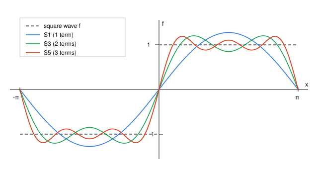

# Fourier & Harmonic Analysis · Lesson 1.1: Periodic functions and Fourier coefficients

> ⏱ ~15 min · Module 1: Fourier series and convergence · Builds on: nothing (course start) · Unlocks: [Lesson 1.2](01-02-orthogonal-systems-projection.md) (orthogonal systems and projection)

## Why this matters

The whole course rests on one audacious claim: any reasonable periodic function — a square voltage pulse, a plucked string, a seasonal economic cycle — is a *sum of pure sine and cosine waves*, each with its own frequency and amplitude. Once you believe that, hard operations become easy: differentiating a wave just multiplies its amplitude, and solving the heat equation becomes bookkeeping on a list of numbers. This lesson answers the first question you must ask before any of that: given the function, **how do you find the amplitudes?** The answer is a single trick — orthogonality — that turns "find infinitely many unknown coefficients" into "compute one integral each."

## The idea

Think of the pure waves $1, \cos x, \sin x, \cos 2x, \sin 2x, \dots$ as *directions* — like the $x$, $y$, $z$ axes, but infinitely many of them. Writing $f$ as a Fourier series is writing it in coordinates along these directions: the coefficient $a_n$ says "how much $\cos nx$ is in $f$."

How do you extract one coordinate of an ordinary vector? You take a dot product with that axis, because the axes are perpendicular — dotting with $\hat x$ annihilates the $y$ and $z$ parts and leaves the $x$-component alone. The miracle that makes Fourier series work is that **the sines and cosines are perpendicular in exactly the same sense**, where the "dot product" of two functions is the integral of their product over one period. Multiply $f$ by $\cos nx$, integrate, and every other wave integrates to zero — leaving a clean formula for $a_n$. That's the entire mechanism. Everything below is making "perpendicular" precise and cashing it out.

## The formal version

**Periodicity and frequency.** A function is **periodic with period $T$** if $f(x+T)=f(x)$ for all $x$; the smallest such $T>0$ is the *fundamental period*, and $\omega = 2\pi/T$ is the *fundamental (angular) frequency*. We work on period $T=2\pi$, so $\omega = 1$ and the natural interval is $[-\pi,\pi]$; the building waves are $\cos nx$ and $\sin nx$ for integer $n\ge 0$, whose frequencies are the integer multiples ("harmonics") of the fundamental. (Rescaling to a general period $T$ is just $x \mapsto 2\pi x/T$; we'll do it when transforms arrive in Module 2.)

**The orthogonality relations.** Define the inner product of two functions on $[-\pi,\pi]$ as $\langle f,g\rangle = \int_{-\pi}^{\pi} f(x)g(x)\,dx$. Then for integers $m,n\ge 1$,
$$\int_{-\pi}^{\pi}\cos mx\,\cos nx\,dx = \pi\,\delta_{mn},\quad \int_{-\pi}^{\pi}\sin mx\,\sin nx\,dx = \pi\,\delta_{mn},\quad \int_{-\pi}^{\pi}\sin mx\,\cos nx\,dx = 0,$$
where $\delta_{mn}=1$ if $m=n$ and $0$ otherwise. Also $\int_{-\pi}^{\pi}1\,dx = 2\pi$ and $\int_{-\pi}^{\pi}\cos nx\,dx=\int_{-\pi}^{\pi}\sin nx\,dx = 0$ for $n\ge 1$.

*In words:* distinct harmonics are perpendicular; a harmonic against itself has "length-squared" $\pi$.

*Proof of the first one.* Use the product-to-sum identity $\cos mx\cos nx = \tfrac12\big[\cos(m-n)x + \cos(m+n)x\big]$. Every $\int_{-\pi}^{\pi}\cos kx\,dx$ is $0$ when the integer $k\neq 0$ (a whole number of periods) and $2\pi$ when $k=0$. If $m\neq n$, both $m-n$ and $m+n$ are nonzero, so the integral is $0$. If $m=n$, the first term is $\cos 0 = 1$ (integral $2\pi$) and the second is $\cos 2mx$ (integral $0$), giving $\tfrac12\cdot 2\pi = \pi$. $\blacksquare$ The sine and mixed relations follow the same way from $\sin mx\sin nx=\tfrac12[\cos(m-n)x-\cos(m+n)x]$ and $\sin mx\cos nx=\tfrac12[\sin(m+n)x+\sin(m-n)x]$ (the last is an *odd* function, so it integrates to $0$ over the symmetric interval outright).

**The real Fourier series.** For a $2\pi$-periodic $f$ (integrable on a period),
$$f(x) = \frac{a_0}{2} + \sum_{n=1}^{\infty}\big(a_n\cos nx + b_n\sin nx\big),\qquad a_n = \frac1\pi\int_{-\pi}^{\pi} f(x)\cos nx\,dx,\quad b_n = \frac1\pi\int_{-\pi}^{\pi} f(x)\sin nx\,dx.$$

*In words:* $f$ is its average value $a_0/2$ plus a stack of harmonics, and each amplitude is $f$ dotted with that harmonic, normalized by $\pi$.

*Where the formulas come from.* Assume the series holds, multiply both sides by $\cos mx$, and integrate over $[-\pi,\pi]$. On the right, orthogonality kills every term except $a_m\int\cos^2 mx = a_m\pi$; the constant and all sines vanish. So $\int f\cos mx = a_m\pi$, which is the formula. The lone constant is why we write $\tfrac{a_0}{2}$ rather than $a_0$: with that convention, setting $n=0$ in the $a_n$ formula gives $a_0=\tfrac1\pi\int f\,dx$, and $\tfrac{a_0}{2}=\tfrac1{2\pi}\int f\,dx$ is exactly the mean of $f$ — one uniform formula for all $n\ge 0$. (Whether the reconstructed series actually equals $f$, and in what sense, is the subject of Lessons 1.3–1.4; here we only *compute* the coefficients.)

**Even/odd shortcut.** If $f$ is **even** ($f(-x)=f(x)$), every $b_n=0$ and $f$ is a pure cosine series. If $f$ is **odd** ($f(-x)=-f(x)$), every $a_n=0$ and $f$ is a pure sine series. Reason: $f(x)\sin nx$ is odd when $f$ is even, and any odd function integrates to $0$ over $[-\pi,\pi]$ — so check symmetry *first* and halve your work.

**The complex-exponential form.** Euler's formula $e^{inx}=\cos nx + i\sin nx$ repackages a cosine and sine of the same frequency into one term:
$$f(x) = \sum_{n=-\infty}^{\infty} c_n\,e^{inx},\qquad c_n = \frac1{2\pi}\int_{-\pi}^{\pi} f(x)\,e^{-inx}\,dx.$$

*In words:* the same series with the two real amplitudes at frequency $n$ fused into a single complex amplitude $c_n$; the sum now runs over *all* integers, positive and negative.

The coefficient formula again comes from orthogonality, now of the exponentials: $\int_{-\pi}^{\pi} e^{imx}\overline{e^{inx}}\,dx = \int_{-\pi}^{\pi} e^{i(m-n)x}\,dx = 2\pi\,\delta_{mn}$ (note the conjugate, hence the $e^{-inx}$ in the formula). The **dictionary** between the two forms, from matching $c_n e^{inx}+c_{-n}e^{-inx}$ against $a_n\cos nx+b_n\sin nx$:
$$c_n = \frac{a_n - i\,b_n}{2},\quad c_{-n}=\frac{a_n + i\,b_n}{2}\ (n\ge 1),\quad c_0=\frac{a_0}{2};\qquad a_n = c_n + c_{-n},\quad b_n = i\,(c_n - c_{-n}).$$
For a **real** $f$ this says $c_{-n}=\overline{c_n}$, so $a_n = 2\,\Re c_n$ and $b_n = -2\,\Im c_n$. Use whichever form is easier: exponentials for $e^x$-like integrands and for the transform theory ahead; sines/cosines when symmetry hands you a pure series.

## Picture

The square wave $f(x)=\operatorname{sgn}(x)$ (equal to $-1$ on $(-\pi,0)$ and $+1$ on $(0,\pi)$) has the pure sine series $\tfrac4\pi\sum_{k\ge 0}\tfrac{\sin((2k+1)x)}{2k+1}$. Below, the partial sums $S_1$ (one term), $S_3$ (two terms), and $S_5$ (three terms) climb toward the target: adding harmonics sharpens the jump and flattens the plateaus. Notice the stubborn overshoot near $x=0$ that refuses to shrink — that's the Gibbs phenomenon, which we'll dissect in [Lesson 1.3](01-03-convergence-pointwise-uniform-gibbs.md).

## Worked examples

**Example 1 (mechanical — real coefficients of $f(x)=x$).** Take $f(x)=x$ on $(-\pi,\pi)$, extended $2\pi$-periodically (a sawtooth). It is **odd**, so immediately every $a_n=0$ — no cosine content. For the sines,
$$b_n = \frac1\pi\int_{-\pi}^{\pi} x\sin nx\,dx = \frac2\pi\int_{0}^{\pi} x\sin nx\,dx$$
(the integrand $x\sin nx$ is even). Integrate by parts with $u=x$, $dv=\sin nx\,dx$, so $v=-\tfrac1n\cos nx$:
$$\int_0^\pi x\sin nx\,dx = \Big[-\frac{x}{n}\cos nx\Big]_0^\pi + \frac1n\int_0^\pi\cos nx\,dx = -\frac{\pi}{n}\cos n\pi + \frac1{n^2}\underbrace{\big[\sin nx\big]_0^\pi}_{=\,0} = -\frac{\pi(-1)^n}{n}.$$
Thus $b_n = \tfrac2\pi\cdot\big(-\tfrac{\pi(-1)^n}{n}\big) = \dfrac{2(-1)^{n+1}}{n}$, and
$$x = \sum_{n=1}^{\infty}\frac{2(-1)^{n+1}}{n}\sin nx = 2\Big(\sin x - \frac{\sin 2x}{2} + \frac{\sin 3x}{3} - \cdots\Big).$$
Sanity check: at $x=\pi/2$ the right side is $2(1 - 0 - \tfrac13 + 0 + \tfrac15-\cdots)=2\cdot\tfrac\pi4=\tfrac\pi2$, matching $f(\pi/2)=\pi/2$. ✓

**Example 2 (the same function, complex form — and the dictionary).** Now compute $c_n$ for $f(x)=x$ directly and confirm it agrees. For $n\neq 0$, integrate by parts:
$$c_n = \frac1{2\pi}\int_{-\pi}^{\pi} x\,e^{-inx}\,dx = \frac1{2\pi}\Big[-\frac{x\,e^{-inx}}{in} + \frac{e^{-inx}}{n^2}\Big]_{-\pi}^{\pi}.$$
The $1/n^2$ term is even in $x$ (equal at $\pm\pi$) and cancels; the first term gives $-\tfrac{1}{in}\big(\pi e^{-in\pi}+\pi e^{in\pi}\big) = -\tfrac{2\pi(-1)^n}{in}$ (using $e^{\pm in\pi}=(-1)^n$). Hence
$$c_n = \frac1{2\pi}\cdot\Big(-\frac{2\pi(-1)^n}{in}\Big) = \frac{i(-1)^n}{n},\qquad c_0 = \frac1{2\pi}\int_{-\pi}^{\pi} x\,dx = 0.$$
Check against Example 1 through the dictionary: for real $f$, $b_n=-2\,\Im c_n = -2\cdot\tfrac{(-1)^n}{n} = \tfrac{2(-1)^{n+1}}{n}$ ✓, and $a_n = 2\,\Re c_n = 0$ ✓. Same series, two languages. For a function like $e^x$ the complex route is *far* less painful (Problem 2) — that's when you reach for it.

## Watch out

- **You might think** you should always grind through the integral — **but** check even/odd symmetry *first*. Half of your coefficients may be zero for free, and skipping that check is the most common way people double their work (and their sign errors).
- **You might think** $\int_{-\pi}^{\pi}\cos^2 nx\,dx = 2\pi$ like the flat $\int 1\,dx$ — **but** it's $\pi$: a cosine spends half its "energy" at each sign, so its self-inner-product is *half* the interval length. That factor of $\pi$ (not $2\pi$) is exactly the normalizer in the $a_n$ formula; get it wrong and every amplitude is off by $2\times$.
- **You might think** the complex sum $\sum c_n e^{inx}$ describes a complex-valued function — **but** for real $f$ the constraint $c_{-n}=\overline{c_n}$ makes the terms at $\pm n$ conjugate, and they add to something real. The negative-frequency terms aren't physical extras; they're the bookkeeping that keeps the result real.

## One-liner

> Every Fourier coefficient is $f$ dotted with a single harmonic — orthogonality guarantees each integral sees only its own wave and nothing else.

## Problems

**P1 (🟢)** Let $f(x)=|x|$ on $(-\pi,\pi)$, extended $2\pi$-periodically (a triangle wave). (a) Use symmetry to say which of $a_n,b_n$ vanish before computing anything. (b) Compute $a_0$ and $a_n$ for $n\ge 1$, and write the series. (c) Evaluate the series at $x=0$ and check it gives $|0|=0$.

**P2 (🟡)** Compute the complex Fourier coefficients $c_n$ of $f(x)=e^{x}$ on $(-\pi,\pi)$ (extended $2\pi$-periodically). This is the case where the complex form earns its keep: one clean exponential integral instead of two integration-by-parts loops. Then use the dictionary to write $a_n$.

**P3 (🔴, optional)** Prove the even/odd shortcut directly from the coefficient formulas: if $f$ is even then $b_n=0$ for all $n$, and if $f$ is odd then $a_n=0$ for all $n$. (Use that the integrand is odd over a symmetric interval; state the one fact about odd functions you rely on.)

Solutions

**P1** (a) $|x|$ is **even**, so all $b_n=0$; only cosines survive.

(b) The mean: $a_0 = \tfrac1\pi\int_{-\pi}^{\pi}|x|\,dx = \tfrac1\pi\cdot 2\int_0^\pi x\,dx = \tfrac1\pi\cdot 2\cdot\tfrac{\pi^2}{2} = \pi$, so $\tfrac{a_0}{2}=\tfrac\pi2$ (the average height of the triangle). For $n\ge 1$, using evenness of $|x|\cos nx$,
$$a_n = \frac1\pi\int_{-\pi}^{\pi}|x|\cos nx\,dx = \frac2\pi\int_0^\pi x\cos nx\,dx.$$
By parts ($u=x$, $dv=\cos nx\,dx$, $v=\tfrac1n\sin nx$): $\int_0^\pi x\cos nx\,dx = \big[\tfrac{x}{n}\sin nx\big]_0^\pi - \tfrac1n\int_0^\pi\sin nx\,dx = 0 + \tfrac1{n^2}\big[\cos nx\big]_0^\pi = \tfrac{(-1)^n-1}{n^2}$. So
$$a_n = \frac2\pi\cdot\frac{(-1)^n-1}{n^2} = \begin{cases} 0, & n\text{ even},\\[2pt] -\dfrac{4}{\pi n^2}, & n\text{ odd}.\end{cases}$$
Series: $\displaystyle |x| = \frac\pi2 - \frac4\pi\sum_{k=0}^{\infty}\frac{\cos((2k+1)x)}{(2k+1)^2} = \frac\pi2 - \frac4\pi\Big(\cos x + \frac{\cos 3x}{9} + \frac{\cos 5x}{25} + \cdots\Big).$

(c) At $x=0$: $\tfrac\pi2 - \tfrac4\pi\sum_{k\ge0}\tfrac1{(2k+1)^2}$. Using $\sum_{k\ge0}\tfrac1{(2k+1)^2}=\tfrac{\pi^2}{8}$ (proved via Parseval in [Lesson 1.4](01-04-mean-square-parseval.md)), this is $\tfrac\pi2 - \tfrac4\pi\cdot\tfrac{\pi^2}{8} = \tfrac\pi2 - \tfrac\pi2 = 0 = |0|$. ✓ (The series converges *at* the corner because $|x|$ is continuous there — contrast the square wave, which jumps.)

**P2** $c_n = \tfrac1{2\pi}\int_{-\pi}^{\pi} e^{x}e^{-inx}\,dx = \tfrac1{2\pi}\int_{-\pi}^{\pi} e^{(1-in)x}\,dx = \tfrac1{2\pi}\Big[\dfrac{e^{(1-in)x}}{1-in}\Big]_{-\pi}^{\pi}$. Since $e^{(1-in)(\pm\pi)} = e^{\pm\pi}e^{\mp in\pi} = e^{\pm\pi}(-1)^n$, the bracket is $(-1)^n\big(e^{\pi}-e^{-\pi}\big) = 2(-1)^n\sinh\pi$. Thus
$$c_n = \frac{(-1)^n\sinh\pi}{\pi\,(1-in)}.$$
For $a_n$ (real $f$, so $a_n=2\,\Re c_n$): rationalize, $\tfrac{1}{1-in}=\tfrac{1+in}{1+n^2}$, giving $c_n = \tfrac{(-1)^n\sinh\pi}{\pi}\cdot\tfrac{1+in}{1+n^2}$, so
$$a_n = 2\,\Re c_n = \frac{2(-1)^n\sinh\pi}{\pi\,(1+n^2)},\qquad b_n = -2\,\Im c_n = \frac{2(-1)^{n+1}\,n\,\sinh\pi}{\pi\,(1+n^2)}.$$
(Check $a_0 = 2\,\Re c_0 = 2\cdot\tfrac{\sinh\pi}{\pi} = \tfrac{e^\pi-e^{-\pi}}{\pi}$, and indeed $\tfrac{a_0}{2}=\tfrac1{2\pi}\int_{-\pi}^\pi e^x dx = \tfrac{e^\pi-e^{-\pi}}{2\pi}$ ✓.) Getting $a_n,b_n$ from the definitions would take two by-parts computations each; the exponential did it in one line.

**P3** Recall the fact: for any odd function $h$ (meaning $h(-x)=-h(x)$), $\int_{-\pi}^{\pi} h(x)\,dx = 0$, because the contribution from $[-\pi,0]$ exactly cancels that from $[0,\pi]$ (substitute $x\mapsto -x$). Now:

If $f$ is **even**, then $f(x)\sin nx$ is (even)$\times$(odd) $=$ odd, so $b_n = \tfrac1\pi\int_{-\pi}^{\pi} f(x)\sin nx\,dx = 0$ for every $n\ge 1$.

If $f$ is **odd**, then $f(x)\cos nx$ is (odd)$\times$(even) $=$ odd, so $a_n = \tfrac1\pi\int_{-\pi}^{\pi} f(x)\cos nx\,dx = 0$ for every $n\ge 0$ (including $n=0$, where $\cos 0x = 1$ is even, so $f\cdot 1$ is odd and the mean vanishes). $\blacksquare$

## Connections

- **Forward:** [Lesson 1.2](01-02-orthogonal-systems-projection.md) names what we just used — the sines and cosines form an *orthogonal system* — and reinterprets the partial sum as the *best mean-square approximation* to $f$ (an orthogonal projection). The "coefficient $=$ $f$ dotted with a harmonic" idea becomes a theorem.
- **Forward:** the square wave in the Picture and the corner of $|x|$ in P1 preview [Lesson 1.3](01-03-convergence-pointwise-uniform-gibbs.md) (does the series equal $f$? at jumps?) and the $\sum 1/(2k+1)^2 = \pi^2/8$ we borrowed lands honestly in [Lesson 1.4](01-04-mean-square-parseval.md) via Parseval.
- **Sideways (functional analysis):** the "functions have an inner product $\langle f,g\rangle=\int f\bar g$ and perpendicular directions" picture is the entry point to Hilbert spaces — the abstract completeness and projection theorems live in [functional-analysis](../../functional-analysis/syllabus.md); here we use the concrete, hands-on version.
- **Sideways (physics/PDEs):** these harmonics are the standing-wave modes of a string and the decaying modes of a heated rod; in [Lesson 4.3](04-03-heat-wave-equations.md) the coefficients you compute here become the initial amplitudes that each evolve independently, the bridge to [pdes](../../pdes/syllabus.md).
