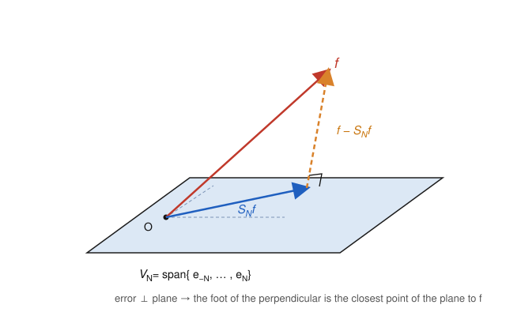

# Fourier & Harmonic Analysis · Lesson 1.2: Orthogonal systems and the projection picture

> ⏱ ~15 min · Module 1: Fourier series and convergence · Builds on: [Lesson 1.1](01-01-periodic-functions-fourier-coefficients.md) · Unlocks: [Lesson 1.3](01-03-convergence-pointwise-uniform-gibbs.md)

## Why this matters

In Lesson 1.1 the coefficient formula $c_n=\frac{1}{2\pi}\int_{-\pi}^{\pi}f(x)e^{-inx}\,dx$ probably looked like a recipe pulled from a hat: multiply by the right exponential, integrate, done. This lesson reveals what that integral *is* — the projection of $f$ onto a coordinate axis, exactly like reading off the $x$-component of a vector. Once you see it, three things become obvious that were mysterious: why those formulas are the coefficients (not some other numbers), why the partial sum $S_N f$ is the *best possible* $N$-mode approximation to $f$ and not merely *an* approximation, and why the coefficients can never carry more energy than $f$ has (Bessel's inequality). This is the geometric skeleton under all of Fourier analysis, and it is the same skeleton under least-squares regression and the quantum state's expansion in energy eigenstates.

## The idea

Think of a plain vector $\mathbf v$ in 3D. To find its component along a unit direction $\mathbf u$, you dot: $\mathbf v\cdot\mathbf u$. To approximate $\mathbf v$ using only the $xy$-plane, you drop a perpendicular — the shadow on the plane is the closest point in the plane, and the leftover (the vertical part) is *perpendicular* to the plane. Nothing in that picture used "three dimensions." It used only two ingredients: a way to measure the **length** of a vector, and a way to measure the **angle** between two vectors — i.e. an inner product.

The leap: **functions are vectors too.** If we can define an inner product between two functions — one number saying "how aligned are they" — then every geometric word transfers. "Perpendicular" becomes *orthogonal functions*. "Unit vector" becomes a *normalized function*. "Component along an axis" becomes a *Fourier coefficient*. "Shadow on a plane" becomes the *partial sum* $S_N f$. The trig/exponential functions turn out to be a set of mutually perpendicular unit axes, and computing a Fourier coefficient is just dropping $f$'s shadow onto one of them.

## The formal version

Work with functions on $[-\pi,\pi]$ (equivalently, $2\pi$-periodic functions) that are square-integrable, $\int_{-\pi}^{\pi}|f|^2\,dx<\infty$. Call this space $L^2([-\pi,\pi])$.

**Definition (inner product and norm).** For (possibly complex-valued) $f,g$,
$$\langle f,g\rangle=\int_{-\pi}^{\pi}f(x)\,\overline{g(x)}\,dx,\qquad \lVert f\rVert=\sqrt{\langle f,f\rangle}=\left(\int_{-\pi}^{\pi}|f(x)|^2\,dx\right)^{1/2}.$$
Here $\overline{g}$ is the complex conjugate; $\lVert f\rVert$ is the **$L^2$ norm**, and $\lVert f-g\rVert$ measures the *root-mean-square distance* between two functions.

*In words:* $\langle f,g\rangle$ is a continuous "dot product" — instead of summing $v_ig_i$ over coordinates $i$, you integrate $f(x)\overline{g(x)}$ over the continuum of points $x$. It is linear in the first slot, conjugate-linear in the second, and $\langle f,f\rangle=\int|f|^2\ge 0$.

**Orthogonality and orthonormality.** Two functions are **orthogonal** if $\langle f,g\rangle=0$. A family $\{e_n\}$ is **orthonormal** if
$$\langle e_n,e_m\rangle=\delta_{nm}=\begin{cases}1 & n=m\\ 0 & n\ne m.\end{cases}$$

The trig system is orthogonal (that was the engine of Lesson 1.1's coefficient formulas); normalizing it gives an orthonormal system. Since $\int_{-\pi}^{\pi}|e^{inx}|^2\,dx=\int_{-\pi}^{\pi}1\,dx=2\pi$, the normalized complex exponentials are
$$e_n(x)=\frac{1}{\sqrt{2\pi}}\,e^{inx},\qquad n\in\mathbb Z,\qquad\text{and indeed}\qquad \langle e_n,e_m\rangle=\frac{1}{2\pi}\int_{-\pi}^{\pi}e^{i(n-m)x}\,dx=\delta_{nm}.$$

**Fourier coefficient = inner product = projection.** Define
$$c_n=\langle f,e_n\rangle=\frac{1}{\sqrt{2\pi}}\int_{-\pi}^{\pi}f(x)\,e^{-inx}\,dx.$$

*In words:* the $n$-th coefficient is the component of $f$ along the axis $e_n$ — literally the shadow $f$ casts on that one pure frequency. (This is Lesson 1.1's coefficient up to the normalization $\sqrt{2\pi}$; see *Watch out*. The reconstructed piece $c_n e_n$ is identical either way.)

**The partial sum is a projection.** Let $V_N=\operatorname{span}\{e_{-N},\dots,e_N\}$, the space of trigonometric polynomials of degree $\le N$. Define
$$S_N f=\sum_{n=-N}^{N}c_n\,e_n=\sum_{n=-N}^{N}\langle f,e_n\rangle\,e_n.$$

**Projection / best-approximation theorem.** $S_N f$ is the **unique** closest element of $V_N$ to $f$ in $L^2$ norm:
$$\lVert f-S_N f\rVert\;\le\;\lVert f-g\rVert\quad\text{for every }g\in V_N,\qquad\text{with equality only if }g=S_N f.$$

*In words:* among all ways to build $f$ out of the frequencies $-N,\dots,N$, the Fourier partial sum is the best mean-square fit — and it is the *only* best fit.

*Proof (error orthogonal to the subspace → Pythagoras).* First, the error $f-S_N f$ is orthogonal to every basis axis in $V_N$: for $|m|\le N$,
$$\langle S_N f,e_m\rangle=\sum_{n=-N}^{N}c_n\langle e_n,e_m\rangle=c_m=\langle f,e_m\rangle,\qquad\text{so}\qquad \langle f-S_N f,\,e_m\rangle=0.$$
By linearity, $f-S_N f$ is orthogonal to all of $V_N$. Now take any $g\in V_N$ and split $f-g=(f-S_N f)+(S_N f-g)$. The second piece lies in $V_N$, so it is orthogonal to the first, and Pythagoras gives
$$\lVert f-g\rVert^2=\lVert f-S_N f\rVert^2+\lVert S_N f-g\rVert^2\;\ge\;\lVert f-S_N f\rVert^2,$$
with equality exactly when $\lVert S_N f-g\rVert=0$, i.e. $g=S_N f$. $\blacksquare$

**Bessel's inequality.** For every $N$, and hence in the limit,
$$\sum_{n=-N}^{N}|c_n|^2\;\le\;\lVert f\rVert^2\qquad\Longrightarrow\qquad \sum_{n=-\infty}^{\infty}|c_n|^2\;\le\;\lVert f\rVert^2.$$

*In words:* the total energy stored in the coefficients can never exceed the energy of $f$ itself.

*Proof.* Take $g=0$ in the Pythagorean identity above (equivalently split $f=(f-S_N f)+S_N f$): since $S_N f\in V_N$ and $\lVert S_N f\rVert^2=\sum_{n=-N}^N|c_n|^2$,
$$\lVert f\rVert^2=\lVert f-S_N f\rVert^2+\sum_{n=-N}^{N}|c_n|^2\;\ge\;\sum_{n=-N}^{N}|c_n|^2,$$
because $\lVert f-S_N f\rVert^2\ge 0$. Let $N\to\infty$. $\blacksquare$

The gap $\lVert f\rVert^2-\sum|c_n|^2$ is exactly the *leftover error* $\lVert f-S_N f\rVert^2$. Bessel is an inequality; whether it becomes the *equality* $\sum|c_n|^2=\lVert f\rVert^2$ (Parseval) depends on whether $\{e_n\}$ is rich enough that the error shrinks to zero — that is **completeness**, proved for the trig system in [Lesson 1.4](01-04-mean-square-parseval.md).

**The light Hilbert-space view.** $L^2$ with $\langle\cdot,\cdot\rangle$ is an infinite-dimensional inner-product space, and $\{e_n\}$ plays the role of an orthonormal basis. Everything above is finite-dimensional projection onto $V_N$ — geometry you already trust. The genuinely infinite-dimensional facts — that $L^2$ is *complete* (Cauchy sequences converge) and that the trig system is a *basis* for all of it, so the projection theorem holds against the whole space and not just each $V_N$ — are the subject of [functional-analysis](../../functional-analysis/syllabus.md). Here we borrow only the finite picture, which is all the classical theory needs.

## Picture

Drop $f$ perpendicularly onto the subspace $V_N$. The foot of the perpendicular is the best approximation $S_N f$; the leftover error points straight out of the plane, orthogonal to every direction in it.

## Worked examples

**Example 1 (mechanical — a coefficient is a projection).** Approximate $f(x)=x$ on $[-\pi,\pi]$ by a single mode $a\sin x$ as well as possible in $L^2$: find the real number $a$ minimizing $\int_{-\pi}^{\pi}(x-a\sin x)^2\,dx$.

Because $\sin x$ is one axis, the best coefficient is the projection of $f$ onto it, normalized by that axis's own length:
$$a=\frac{\langle f,\sin x\rangle}{\langle \sin x,\sin x\rangle}=\frac{\int_{-\pi}^{\pi}x\sin x\,dx}{\int_{-\pi}^{\pi}\sin^2 x\,dx}.$$
Numerator, by parts ($\int x\sin x\,dx=\sin x-x\cos x$): $\big[\sin x-x\cos x\big]_{-\pi}^{\pi}=(0+\pi)-(0-\pi)=2\pi$. Denominator: $\int_{-\pi}^{\pi}\sin^2 x\,dx=\pi$. So $a=2$, and the best single-mode fit is $2\sin x$.

Notice $a=2$ is exactly the Fourier coefficient $b_1$ of $x$ from Lesson 1.1. That is not a coincidence: because the modes are mutually orthogonal, the best coefficient on one axis doesn't care which *other* axes you include — projecting onto $\sin x$ alone gives the same number as projecting onto the full basis. Orthogonality is what lets you compute coefficients one at a time.

**Example 2 (why you'd care — Bessel squeezes out $\sum 1/n^2$).** Same $f(x)=x$. Its total energy is
$$\lVert f\rVert^2=\int_{-\pi}^{\pi}x^2\,dx=\frac{2\pi^3}{3}.$$
The sine coefficients are $b_n=\frac{2(-1)^{n+1}}{n}$ (from $\int_{-\pi}^{\pi}x\sin nx\,dx=\frac{2\pi(-1)^{n+1}}{n}$, then divide by $\lVert\sin nx\rVert^2=\pi$). The energy the partial sum captures is
$$\lVert S_N f\rVert^2=\sum_{n=1}^{N}b_n^2\,\lVert\sin nx\rVert^2=\pi\sum_{n=1}^{N}\frac{4}{n^2}=4\pi\sum_{n=1}^{N}\frac{1}{n^2}.$$
Bessel says this can't exceed $\lVert f\rVert^2$:
$$4\pi\sum_{n=1}^{N}\frac1{n^2}\le\frac{2\pi^3}{3}\qquad\Longrightarrow\qquad \sum_{n=1}^{N}\frac{1}{n^2}\le\frac{\pi^2}{6}\ \text{ for every }N.$$
So the partial sums of $\sum 1/n^2$ are bounded by $\pi^2/6$. Completeness of the trig system (Lesson 1.4) forces the error to zero, upgrading "$\le$" to "$=$" and delivering the famous $\sum_{n=1}^{\infty}1/n^2=\pi^2/6$. You just watched a geometric inequality about function-vectors pin down a pure-number series — the whole reason Parseval is worth waiting for.

## Watch out

- **Normalization vs. Lesson 1.1.** With the *normalized* axis $e_n=\frac{1}{\sqrt{2\pi}}e^{inx}$, the coefficient is $c_n=\langle f,e_n\rangle=\sqrt{2\pi}\,c_n^{\text{(1.1)}}$, larger by $\sqrt{2\pi}$ than the classical coefficient. You might think this changes the series — it doesn't: the reconstructed term $c_n e_n=c_n^{\text{(1.1)}}e^{inx}$ is identical, because the two $\sqrt{2\pi}$'s cancel. Pick a convention and keep the axis and the coefficient consistent with it.
- **"Orthogonal" means the integral vanishes, not that the graphs look perpendicular.** $\langle\sin x,\cos x\rangle=\int_{-\pi}^{\pi}\sin x\cos x\,dx=0$ says these two functions are orthogonal *as vectors* — a statement about an integral, nothing about the pointwise angle of two curves.
- **Bessel is not Parseval.** You might think $\sum|c_n|^2=\lVert f\rVert^2$ always. Bessel only gives "$\le$", valid for *any* orthonormal system — even a deficient one missing some axes. Equality needs the system to be **complete**; for the trig system it holds, but that is a theorem (Lesson 1.4), not a definition.

## One-liner

> A Fourier coefficient is the shadow $f$ casts on one frequency axis, and the partial sum $S_N f$ is the foot of the perpendicular — the one closest function you can build from those frequencies.

## Problems

**P1 (🟢)** Let $f(x)=x$ on $[-\pi,\pi]$. Find the real number $a$ that minimizes $\int_{-\pi}^{\pi}(x-a\sin 2x)^2\,dx$, by computing the projection $a=\langle f,\sin 2x\rangle/\lVert\sin 2x\rVert^2$. Confirm your answer equals the Fourier coefficient $b_2$.

**P2 (🟡)** Let $\{e_n\}$ be orthonormal and $c_n=\langle f,e_n\rangle$. For *arbitrary* scalars $b_n$, prove the "completing-the-square" identity
$$\Big\lVert f-\sum_{n=-N}^{N}b_n e_n\Big\rVert^2=\lVert f\rVert^2-\sum_{n=-N}^{N}|c_n|^2+\sum_{n=-N}^{N}|b_n-c_n|^2.$$
Then read off both main results in one line each: (i) which choice of the $b_n$ minimizes the left side (best approximation + uniqueness), and (ii) what the minimum value being $\ge 0$ says (Bessel).

**P3 (🔴, optional)** Deduce from Bessel's inequality that the Fourier coefficients of any $f\in L^2$ must satisfy $c_n\to 0$ as $|n|\to\infty$. In one sentence, interpret this geometrically (what happens to $f$'s shadow on very high-frequency axes?) and name the smoothness↔decay theme it previews for [Lesson 2.2](02-02-properties-derivative-rule.md).

Solutions

**P1** Numerator $\langle x,\sin 2x\rangle=\int_{-\pi}^{\pi}x\sin 2x\,dx$. Using $\int_{-\pi}^{\pi}x\sin nx\,dx=\frac{2\pi(-1)^{n+1}}{n}$ with $n=2$: $\frac{2\pi(-1)^{3}}{2}=-\pi$. Denominator $\lVert\sin 2x\rVert^2=\int_{-\pi}^{\pi}\sin^2 2x\,dx=\pi$. Hence $a=-\pi/\pi=-1$, so the best fit is $-\sin 2x$. The Fourier coefficient is $b_2=\frac{2(-1)^{2+1}}{2}=-1$ — same number, as orthogonality guarantees. ✓

**P2** Expand using linearity in the first slot and conjugate-linearity in the second. Write $g=\sum b_n e_n$. Then
$$\lVert f-g\rVert^2=\langle f-g,\,f-g\rangle=\lVert f\rVert^2-\langle f,g\rangle-\langle g,f\rangle+\lVert g\rVert^2.$$
Since $\{e_n\}$ is orthonormal: $\langle f,g\rangle=\sum_n \overline{b_n}\langle f,e_n\rangle=\sum_n \overline{b_n}c_n$, likewise $\langle g,f\rangle=\sum_n b_n\overline{c_n}$, and $\lVert g\rVert^2=\sum_n|b_n|^2$. So
$$\lVert f-g\rVert^2=\lVert f\rVert^2+\sum_n\big(|b_n|^2-\overline{b_n}c_n-b_n\overline{c_n}\big).$$
Now complete the square termwise: $|b_n-c_n|^2=|b_n|^2-\overline{b_n}c_n-b_n\overline{c_n}+|c_n|^2$, so $|b_n|^2-\overline{b_n}c_n-b_n\overline{c_n}=|b_n-c_n|^2-|c_n|^2$. Substituting gives
$$\lVert f-g\rVert^2=\lVert f\rVert^2-\sum_{n=-N}^{N}|c_n|^2+\sum_{n=-N}^{N}|b_n-c_n|^2.\qquad\blacksquare$$
(i) Only the last sum depends on the $b_n$, and it is $\ge 0$ with equality iff every $b_n=c_n$. So $b_n=c_n$ is the unique minimizer — the best approximation is $S_N f$, and it's unique. (ii) At that minimum the left side is $\ge 0$, i.e. $\lVert f\rVert^2-\sum_{n=-N}^N|c_n|^2\ge 0$, which is Bessel's inequality.

**P3** Bessel gives $\sum_{n=-\infty}^{\infty}|c_n|^2\le\lVert f\rVert^2<\infty$: the series of nonnegative terms $|c_n|^2$ converges. A convergent series must have terms tending to $0$, so $|c_n|^2\to 0$, hence $c_n\to 0$ as $|n|\to\infty$. Geometrically: $f$ casts a vanishingly small shadow on high-frequency axes — a fixed-energy function simply can't keep pouring energy into ever-faster oscillations. This is the seed of the smoothness↔decay duality: the smoother $f$ is, the *faster* $c_n\to 0$, made quantitative in Lesson 2.2 (and it is the qualitative half of the Riemann–Lebesgue lemma).

## Connections

- **Backward (Lesson 1.1):** the orthogonality relations $\int\sin\cos=0$, etc., that justified the coefficient formulas were secretly the statement $\langle e_n,e_m\rangle=\delta_{nm}$. This lesson repackages them as geometry, so "compute a coefficient" now reads as "project onto an axis."
- **Forward (Lessons 1.4, 1.3):** Bessel's "$\le$" becomes Parseval's "$=$" once the trig system is shown complete (1.4) — that upgrade is what turns coefficient bounds into exact energy accounting and evaluates series like $\sum 1/n^2$. The best-approximation viewpoint also frames *how* $S_N f$ can fail to converge pointwise, e.g. the Gibbs overshoot (1.3): mean-square-best does not mean pointwise-good.
- **Sideways (functional-analysis, and least squares):** the "error orthogonal to the subspace" argument is the projection theorem in any inner-product space; the full $L^2$ completeness and the projection onto infinite-dimensional subspaces live in [functional-analysis](../../functional-analysis/syllabus.md). The exact same normal-equations logic — minimize $\lVert f-\text{(combination of basis vectors)}\rVert$ by forcing the residual orthogonal to the model space — is ordinary least-squares regression; Fourier fitting is least squares with sinusoids as regressors.
