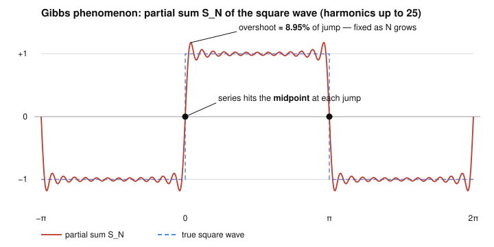

# Fourier & Harmonic Analysis · Lesson 1.3: Convergence I — pointwise, uniform, and Gibbs

> ⏱ ~15 min · Module 1: Fourier series and convergence · Builds on: [1.2 Orthogonal systems and projection](01-02-orthogonal-systems-projection.md) · Unlocks: [1.4 Mean-square and Parseval](01-04-mean-square-parseval.md)

## Why this matters

You can write down the Fourier coefficients of any reasonable function — but does the series actually *equal* the function? The honest answer is "it depends what you mean by equal," and getting this right is the difference between a formula that works and one that quietly lies to you. Engineers who filter a square pulse and see mysterious ringing at the edges are meeting the Gibbs phenomenon; physicists who expand a discontinuous potential need to know their series reports the *midpoint* at the jump, not either side. This lesson gives you a picture — the Dirichlet kernel — that predicts all three behaviors at once.

## The idea

A partial sum $S_N f$ doesn't sample $f$ at a point; it takes a **weighted local average** of $f$. The weight is a fixed bump called the Dirichlet kernel $D_N$: tall and narrow at the center, with wiggling side-ripples that fan out. As you keep more terms ($N$ grows), the central bump gets taller and thinner, so the average tightens onto the value at $x$ — that's convergence.

Two things spoil the clean story, and both are visible in the bump:

- **At a jump**, the narrowing average straddles both sides equally, so it can only report the *average of the two sides* — the midpoint. It literally cannot pick one.
- **The side-ripples never lose their total strength.** No matter how tall the central spike gets, the ripples reaching across a jump always inject the same fixed overshoot. That is the Gibbs phenomenon: a bump of fixed height that slides toward the jump but never shrinks.

When $f$ is smooth with no jumps, there's nothing for the ripples to catch on, and the convergence is not just pointwise but *uniform* — good everywhere at once.

## The formal version

Work with $2\pi$-periodic $f$ and its complex coefficients $c_n=\frac{1}{2\pi}\int_{-\pi}^{\pi}f(t)e^{-int}\,dt$, so the degree-$N$ partial sum is $S_N f(x)=\sum_{n=-N}^{N}c_n e^{inx}$ (Lesson [1.1](01-01-periodic-functions-fourier-coefficients.md)).

**Partial sum = convolution with the Dirichlet kernel.** Substitute the coefficient integral and swap sum and integral:
$$S_N f(x)=\frac{1}{2\pi}\int_{-\pi}^{\pi}f(t)\underbrace{\sum_{n=-N}^{N}e^{in(x-t)}}_{D_N(x-t)}\,dt=(f*D_N)(x),$$
using the periodic convolution $(f*g)(x)=\frac{1}{2\pi}\int_{-\pi}^{\pi}f(t)\,g(x-t)\,dt$. The **Dirichlet kernel** is
$$D_N(u)=\sum_{n=-N}^{N}e^{inu}=\frac{\sin\!\big((N+\tfrac12)u\big)}{\sin(u/2)}.$$

*In words:* every partial sum is $f$ smeared against one universal bump $D_N$; changing $f$ changes nothing but the thing being smeared.

*Why the closed form:* multiply the sum by $2\sin(u/2)$ and use $2\sin(u/2)\,e^{inu}=-i\big(e^{i(n+\frac12)u}-e^{i(n-\frac12)u}\big)$. The right side telescopes across $n=-N,\dots,N$ to $2\sin\!\big((N+\tfrac12)u\big)$; divide back. Note $D_N(0)=2N+1$ (its peak height) and $\frac{1}{2\pi}\int_{-\pi}^{\pi}D_N(u)\,du=1$ (only the $n=0$ term survives) — so $S_N f$ is a genuine weighted average.

**Dirichlet's pointwise theorem.** If $f$ is $2\pi$-periodic and **piecewise $C^1$** (finitely many jumps; at each point the one-sided limits $f(x^\pm)$ and one-sided derivatives exist and are finite), then for *every* $x$,
$$S_N f(x)\ \xrightarrow{\ N\to\infty\ }\ \frac{f(x^+)+f(x^-)}{2}.$$

*In words:* the series converges everywhere to the average of the left and right values. At a continuity point $f(x^+)=f(x^-)=f(x)$, so you get $f(x)$; at a jump you get the **midpoint**, regardless of how $f$ was defined *at* the jump.

*Why (sketch):* since $\frac{1}{2\pi}\int D_N=1$ splits into $\tfrac12$ over each of $(-\pi,0)$ and $(0,\pi)$, the error $S_N f(x)-\tfrac12\big(f(x^+)+f(x^-)\big)$ equals $\frac{1}{2\pi}\int_{-\pi}^{\pi}\big[f(x-u)-f(x^{\mp})\big]D_N(u)\,du$. The one-sided derivative makes the quotient $\frac{f(x-u)-f(x^\mp)}{\sin(u/2)}$ bounded, and the Riemann–Lebesgue lemma kills its integral against $\sin\!\big((N+\tfrac12)u\big)$ as $N\to\infty$.

**Uniform convergence.** Two clean statements:

- *(Coefficient test.)* If $\sum_{n}|c_n|<\infty$ (absolutely summable coefficients), then $S_N f\to f$ **uniformly**, and the limit is continuous. Reason: $|c_n e^{inx}|=|c_n|$, so the Weierstrass $M$-test applies.
- *(Smoothness test.)* If $f$ is **continuous** and piecewise $C^1$, then its coefficients *are* absolutely summable — because $c_n=\widehat{f'}(n)/(in)$ and Cauchy–Schwarz gives $\sum|c_n|=\sum\frac{|\widehat{f'}(n)|}{|n|}\le\big(\sum\tfrac1{n^2}\big)^{1/2}\big(\sum|\widehat{f'}(n)|^2\big)^{1/2}<\infty$ — so $S_N f\to f$ uniformly.

*In words:* continuous plus a bit of smoothness ⟹ the series matches $f$ *everywhere at once*, with a single error bar that shrinks. One integration by parts buys one power of $1/n$ in decay; enough decay buys uniformity.

**The Gibbs phenomenon.** Near a jump of height $J=f(x_0^+)-f(x_0^-)$, the partial sum overshoots by a fixed fraction that does *not* vanish. As $N\to\infty$ the maximum of $S_N f$ just past the jump approaches
$$f(x_0^+)+\alpha\,J,\qquad \alpha=\frac{1}{\pi}\int_0^{\pi}\frac{\sin t}{t}\,dt-\frac12=\frac{1}{\pi}\operatorname{Si}(\pi)-\frac12\approx 0.0895 .$$

*In words:* the series always shoots past the true value by about **8.95% of the jump height** — roughly 9% — on each side, then rings. The overshoot's *location* slides toward the jump (peak at $|x-x_0|\approx \pi/(N+1)$) and its *width* shrinks, but its *height* is locked. It comes straight from the sine integral $\operatorname{Si}(\pi)=\int_0^\pi\operatorname{sinc}\approx1.852$ overshooting its eventual limit $\pi/2$: that is literally the fixed area in the Dirichlet kernel's first ripple, and no amount of $N$ removes it.

## Picture

The crimson curve is $S_N$ of the square wave with harmonics through the 25th. At each jump it passes *through the midpoint* ($0$, black dots), spikes to about $1.179$ — an $8.95\%$ overshoot of the jump of height $2$ — then rings. Adding terms narrows the spike and packs the ripples tighter, but the spike height stays put.

## Worked examples

**Example 1 (the square wave at its jump → the midpoint).** Take the odd square wave $f(x)=+1$ on $(0,\pi)$, $-1$ on $(-\pi,0)$, extended $2\pi$-periodically. Its series (from Lesson [1.1](01-01-periodic-functions-fourier-coefficients.md)) is
$$f(x)=\frac{4}{\pi}\sum_{k=0}^{\infty}\frac{\sin\!\big((2k+1)x\big)}{2k+1}.$$
What does it give at the jump $x=0$? Every term has $\sin\!\big((2k+1)\cdot 0\big)=0$, so *every* partial sum is exactly $0$ there — the series equals $0$ at $x=0$. Dirichlet predicts $\tfrac12\big(f(0^+)+f(0^-)\big)=\tfrac12(1+(-1))=0$. They agree: the series can't choose $+1$ or $-1$, so it splits the difference.

Now the Gibbs bump. Differentiating the degree-$N$ partial sum (odd harmonics through $2N+1$) gives $S_N'(x)=\frac{4}{\pi}\sum_{k=0}^{N}\cos\!\big((2k+1)x\big)=\frac{2}{\pi}\,\frac{\sin\!\big(2(N+1)x\big)}{\sin x}$, whose first positive zero is at $x_{\max}=\frac{\pi}{2(N+1)}$. Plugging back turns the sum into a Riemann sum for $\frac{2}{\pi}\int_0^{\pi}\frac{\sin t}{t}\,dt$, so
$$S_N(x_{\max})\ \to\ \frac{2}{\pi}\operatorname{Si}(\pi)\approx 1.1790.$$
The peak overshoots the true value $+1$ by $\approx 0.179$; against the jump height $J=2$ that is $0.179/2\approx 0.0895$, the promised $8.95\%$. As $N$ grows, $x_{\max}\to 0$ (the spike hugs the jump) but the height $1.179$ is frozen.

**Example 2 (continuous ⟹ uniform, no Gibbs).** Take the triangle wave $f(x)=|x|$ on $[-\pi,\pi]$, extended $2\pi$-periodically. It is *continuous* (the tents meet at $\pm\pi$) and piecewise $C^1$. Its cosine series is
$$|x|=\frac{\pi}{2}-\frac{4}{\pi}\sum_{k=0}^{\infty}\frac{\cos\!\big((2k+1)x\big)}{(2k+1)^2}.$$
The coefficients decay like $1/n^2$, and $\sum 1/(2k+1)^2<\infty$, so by the coefficient test the series converges **uniformly** — one error bar shrinks over the whole line, and there is *no* overshoot. Contrast the square wave, whose coefficients decay only like $1/n$ (not summable): the extra $1/n$ here is exactly the integration that turns the square wave's jump into the triangle's continuous corner. (As a bonus, evaluating at $x=0$ gives $0=\frac{\pi}{2}-\frac{4}{\pi}\sum\frac{1}{(2k+1)^2}$, i.e. $\sum_{k\ge0}\frac{1}{(2k+1)^2}=\frac{\pi^2}{8}$ — a preview of the coefficient/energy accounting in Lesson [1.4](01-04-mean-square-parseval.md).)

## Watch out

- **You might think the series reports the function's value at a jump — actually it reports the midpoint.** Redefining $f$ *at* the jump point changes nothing: the coefficients are integrals, blind to a single point, so the series lands at $\tfrac12(f(x^+)+f(x^-))$ every time.
- **You might think more terms eventually kill the overshoot — they don't.** The Gibbs bump narrows and migrates toward the jump but keeps its $\approx 8.95\%$ height forever. What *does* shrink is its width, so its energy $\to 0$; that's why mean-square convergence (Lesson [1.4](01-04-mean-square-parseval.md)) still holds even though pointwise the overshoot never quits.
- **You might expect uniform convergence whenever the series converges pointwise — but a jump forbids it.** Each $S_N$ is continuous, and a *uniform* limit of continuous functions is continuous; so if $f$ jumps, convergence cannot be uniform near the jump. Continuity of $f$ is the price of admission for uniformity.
- **Don't confuse "$D_N$ concentrates" with "$D_N$ is a nice bump."** Unlike a Gaussian, $D_N$ has ripples whose *total* size $\frac{1}{2\pi}\int|D_N|$ grows like $\log N$. That un-tameable tail is the source of Gibbs; it's why the Dirichlet kernel is not an approximate identity.

## One-liner

> A partial sum is $f$ averaged against the Dirichlet bump: the bump narrows so you converge to the midpoint at jumps, but its ripples never fade, so every jump keeps a fixed ~9% overshoot.

## Problems

**P1 (🟢)** Let $f(x)=x$ on $(-\pi,\pi)$, extended $2\pi$-periodically (the sawtooth). Using Dirichlet's theorem, state the value the Fourier series converges to at (a) $x=0$, (b) $x=\pi/2$, and (c) $x=\pi$.

**P2 (🟡)** For the same sawtooth: (a) find the jump height $J$ at $x=\pi$; (b) using the Gibbs fraction $\approx 0.0895$, give the approximate value the partial sums overshoot *to* just inside the jump (i.e. just left of $x=\pi$) for large $N$, and say roughly where that peak sits as a function of $N$; (c) explain in one sentence why this overshoot does not contradict the series converging in mean-square.

**P3 (🔴, optional)** Prove the coefficient test: if $\sum_{n=-\infty}^{\infty}|c_n|<\infty$, then $S_N f$ converges uniformly on $\mathbb{R}$ to a continuous limit. (Name the two theorems you use.)

Solutions

**P1** The sawtooth is continuous on $(-\pi,\pi)$ with a jump only where the periodic copies meet, at odd multiples of $\pi$.
(a) $x=0$: a continuity point, $f(0)=0$, so the series $\to 0$.
(b) $x=\pi/2$: a continuity point, so the series $\to \pi/2$.
(c) $x=\pi$: a jump. Approaching from the left, $f(\pi^-)=\pi$; from the right the next period gives $f(\pi^+)=f(-\pi^+)=-\pi$. The series converges to the midpoint $\tfrac12(\pi+(-\pi))=0$.

**P2** (a) $J=f(\pi^+)-f(\pi^-)=-\pi-\pi=-2\pi$; the jump has magnitude $2\pi$ (a downward jump). 
(b) The overshoot on the high (left) side sits above $f(\pi^-)=\pi$ by $0.0895\times 2\pi\approx 0.562$, so the partial sums peak at about $\pi+0.562\approx 3.70$ just to the *left* of $x=\pi$. That peak sits at $x\approx\pi-\dfrac{\pi}{N+1}$, sliding toward $\pi$ as $N$ grows while its height stays $\approx 3.70$. (Symmetrically, just to the right it undershoots to $\approx -3.70$.)
(c) The overshoot spike keeps a fixed height but its *width* shrinks like $1/N$, so the squared error it contributes, $\int (\text{bump})^2\,dx$, tends to $0$; mean-square convergence only cares about area-under-the-square, not the pointwise peak. So a fixed-height, vanishing-width spike is invisible to the $L^2$ norm.

**P3** Let $M_n=|c_n|$. For every $x$, $|c_n e^{inx}|=|c_n|=M_n$, and by hypothesis $\sum_n M_n<\infty$. By the **Weierstrass $M$-test**, the series $\sum_n c_n e^{inx}$ converges *uniformly* on $\mathbb{R}$; call the limit $S(x)$, so $S_N f\to S$ uniformly. Each partial sum $S_N f$ is a finite sum of continuous functions, hence continuous, and a **uniform limit of continuous functions is continuous**, so $S$ is continuous. (That the uniform limit $S$ equals $f$ where $f$ is continuous then follows from Dirichlet's pointwise theorem, since uniform convergence forces the same limit as pointwise convergence.) $\blacksquare$

## Flashback

**From Lesson [1.2](01-02-orthogonal-systems-projection.md) (orthogonal systems and projection):** Recall that the degree-$N$ partial sum $S_N f$ is the *orthogonal projection* of $f$ onto $\operatorname{span}\{\sin nx,\cos nx:1\le n\le N\}$, so $\lVert S_N f\rVert^2\le\lVert f\rVert^2$ (Bessel's inequality), using $\langle g,h\rangle=\int_{-\pi}^{\pi}g\,h\,dx$. For the sawtooth $f(x)=x$ on $(-\pi,\pi)$, whose sine coefficients are $b_n=\frac{2(-1)^{n+1}}{n}$: compute $\lVert S_2 f\rVert^2$ (the projection onto the first two sine modes) and check it against Bessel's inequality using $\lVert f\rVert^2=\int_{-\pi}^{\pi}x^2\,dx$.

Solution

The first two coefficients are $b_1=\frac{2(-1)^2}{1}=2$ and $b_2=\frac{2(-1)^3}{2}=-1$, so $S_2 f(x)=2\sin x-\sin 2x$. The modes are orthogonal with $\lVert\sin nx\rVert^2=\int_{-\pi}^{\pi}\sin^2(nx)\,dx=\pi$, so by the Pythagorean theorem
$$\lVert S_2 f\rVert^2=b_1^2\lVert\sin x\rVert^2+b_2^2\lVert\sin 2x\rVert^2=(2^2+1^2)\pi=5\pi\approx 15.71.$$
And $\lVert f\rVert^2=\int_{-\pi}^{\pi}x^2\,dx=\frac{2\pi^3}{3}\approx 20.67$. Bessel's inequality $\lVert S_2 f\rVert^2\le\lVert f\rVert^2$ reads $5\pi\le\frac{2\pi^3}{3}$, i.e. $15.71\le 20.67$ — satisfied, with the gap $\lVert f-S_2 f\rVert^2\approx 4.96$ measuring what the higher modes still have to supply. (Letting $N\to\infty$ turns this inequality into Parseval's *equality* $\frac{2\pi^3}{3}=\sum_{n\ge1}b_n^2\,\pi=4\pi\sum\frac1{n^2}$, i.e. $\sum\frac1{n^2}=\frac{\pi^2}{6}$ — the subject of Lesson [1.4](01-04-mean-square-parseval.md).)

## Connections

- **Backward:** this is the projection picture of Lesson [1.2](01-02-orthogonal-systems-projection.md) made dynamic — Bessel's inequality says $\lVert S_N f\rVert$ is bounded; here we ask *whether and how* $S_N f$ reaches $f$, and in which of the three senses.
- **Forward:** Lesson [1.4](01-04-mean-square-parseval.md) settles the third mode of convergence, mean-square, where the Gibbs spike is invisible and Parseval's identity turns coefficient decay into exact energy accounting. The Dirichlet kernel's failure to be an approximate identity motivates the *Fejér* kernel (Cesàro averaging), the standard cure for Gibbs.
- **Sideways (real-analysis):** the pointwise-vs-uniform distinction, the Weierstrass $M$-test, and "uniform limit of continuous is continuous" are exactly the machinery from [real-analysis](../../real-analysis/syllabus.md); Fourier series are their headline application. The projection/best-approximation and $L^2$-completeness viewpoint behind all of this is developed in full in [functional-analysis](../../functional-analysis/syllabus.md).
- **Sideways (signals/engineering):** the Gibbs overshoot is the "ringing" you see when a signal is passed through an ideal low-pass filter — truncating the spectrum at $\pm N$ *is* convolving with a Dirichlet kernel — a theme that returns with sampling and the DFT in Module 4 (future [signals-systems](../../signals-systems/syllabus.md)).
