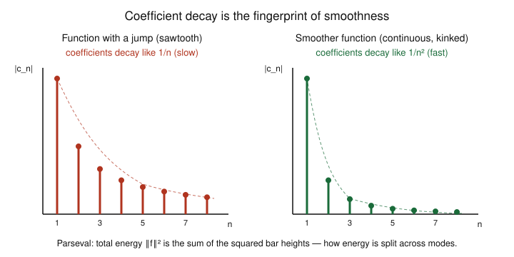

# Fourier & Harmonic Analysis · Lesson 1.4: Convergence II — mean-square and Parseval

> ⏱ ~15 min · Module 1: Fourier series and convergence · Builds on: [Lesson 1.2](01-02-orthogonal-systems-projection.md), [Lesson 1.3](01-03-convergence-pointwise-uniform-gibbs.md) · Unlocks: [Lesson 2.1](02-01-series-to-fourier-transform.md)

## Why this matters

Last lesson delivered bad news: near a jump, the partial sums overshoot by ~9% forever, so the series does **not** converge uniformly. That could make you distrust Fourier series for exactly the discontinuous signals — square waves, on/off switches, edges in an image — where you most want them. This lesson delivers the good news. Switch from "does the series match $f$ at every point?" to "does the series match $f$ *on average, in energy?*" and the answer becomes a clean **yes**, jumps and all. That energy bookkeeping is Parseval's identity, and it does two jobs at once: it lets you sum infinite numerical series that have nothing obviously to do with waves (you'll get $\sum 1/n^2=\pi^2/6$ for free), and it's the exact statement that a signal's energy is the sum of the energies of its frequency components — the accounting every spectrum analyzer, every audio codec, and all of `quantum-mechanics` runs on.

## The idea

There are three genuinely different ways a series can "equal" a function. Pointwise and uniform we met in 1.3. The third is **mean-square** (or **$L^2$**) convergence, and it measures error the way a physicist measures signal strength: by total squared size.

Think of $f$ as a signal and its energy as $\int|f|^2$. The partial sum $S_N f$ (the first $N$ harmonics) is an approximation; the leftover $f - S_N f$ is the error signal. Mean-square convergence asks: **does the energy of the error go to zero?** A single narrow spike of overshoot near a jump — the Gibbs villain — is tall but *thin*, so it carries almost no energy. As $N$ grows the overshoot doesn't shrink in height, but it gets squeezed into a vanishing sliver of width. Its energy $\to 0$. So in the energy sense the series wins even though pointwise it never stops overshooting.

The magic fact behind all of this: the sine/cosine system is **complete** — rich enough that *nothing is left over*. Every bit of a function's energy is captured by its Fourier coefficients, with none hiding in some direction the trig functions can't see. Write that as an equation and it's Parseval: energy of $f$ = sum of energies of its modes.

## The formal version

Recall from [Lesson 1.2](01-02-orthogonal-systems-projection.md) the function **inner product** and **norm** on $2\pi$-periodic functions,
$$\langle f,g\rangle=\frac{1}{2\pi}\int_{-\pi}^{\pi}f(x)\,\overline{g(x)}\,dx,\qquad \lVert f\rVert^2=\langle f,f\rangle=\frac{1}{2\pi}\int_{-\pi}^{\pi}|f(x)|^2\,dx,$$
and the partial sum $S_N f(x)=\sum_{n=-N}^{N}c_n e^{inx}$, where $c_n=\langle f,e^{inx}\rangle=\frac{1}{2\pi}\int_{-\pi}^{\pi}f(x)e^{-inx}\,dx$. The number $\lVert f\rVert^2$ is the (average) **energy** of $f$.

**Mean-square convergence.** We say $S_N f\to f$ in $L^2$ if
$$\lVert f-S_N f\rVert\;=\;\left(\frac{1}{2\pi}\int_{-\pi}^{\pi}\bigl|f(x)-S_N f(x)\bigr|^2\,dx\right)^{1/2}\;\longrightarrow\;0\quad\text{as }N\to\infty.$$
*In words:* the total squared error, averaged over a period, dies out — even if the pointwise error at some individual spot does not.

From 1.2 you already have half the story. Because $S_N f$ is the orthogonal projection of $f$ onto the span of $\{e^{inx}\}_{|n|\le N}$ (the *best* approximation in this norm), the Pythagorean theorem gives $\lVert f\rVert^2=\lVert S_Nf\rVert^2+\lVert f-S_Nf\rVert^2$, hence
$$\sum_{|n|\le N}|c_n|^2 \;\le\; \lVert f\rVert^2 \qquad\text{(Bessel's inequality).}$$
*In words:* the captured energy never exceeds the total — you can't extract more signal than is there.

The deep input this lesson **states** (its full proof is measure-theoretic and lives in [functional-analysis](../../functional-analysis/syllabus.md)) is that for the trig system Bessel is never *strictly* less: nothing is missed.

**Completeness of the trig system.** For every square-integrable $2\pi$-periodic $f$, $\lVert f-S_N f\rVert\to 0$. Equivalently, Bessel's inequality is an **equality**.

**Parseval's identity.** Consequently,
$$\boxed{\;\frac{1}{2\pi}\int_{-\pi}^{\pi}|f(x)|^2\,dx=\sum_{n=-\infty}^{\infty}|c_n|^2\;}$$
and, translating to the real sine/cosine coefficients ($a_n=\tfrac1\pi\int_{-\pi}^{\pi}f\cos nx\,dx$, $b_n=\tfrac1\pi\int_{-\pi}^{\pi}f\sin nx\,dx$, with $f=\tfrac{a_0}{2}+\sum_{n\ge1}(a_n\cos nx+b_n\sin nx)$),
$$\frac{1}{\pi}\int_{-\pi}^{\pi}|f(x)|^2\,dx=\frac{a_0^2}{2}+\sum_{n=1}^{\infty}\bigl(a_n^2+b_n^2\bigr).$$
*In words:* the energy of $f$ equals the sum of the energies of its Fourier modes — Pythagoras in infinitely many dimensions. No cross-terms survive, precisely because distinct harmonics are orthogonal.

One immediate corollary, free of charge: since the left side is finite, the coefficients are **square-summable**, so in particular $c_n\to 0$. Even for a wild jump function, the modes must eventually fade.

## Picture: decay vs smoothness

Parseval says the energy is parceled out among the modes as $|c_n|^2$. *How fast* those coefficients shrink is dictated by *how smooth* $f$ is — the single most useful rule of thumb in the whole subject.

- A **jump** (finite discontinuity) forces slow $|c_n|\sim 1/n$ decay — the sawtooth $f(x)=x$ below has exactly $|b_n|=2/n$. Slow decay means high harmonics carry real energy; that stubborn high-frequency content is *why* the Gibbs overshoot never dies.
- A **continuous** function with corners (a kink in $f$, i.e. a jump in $f'$) decays faster, $|c_n|\sim 1/n^2$ — fast enough that $\sum|c_n|<\infty$ and (by the Weierstrass $M$-test) the series now converges *uniformly*.
- Each extra derivative of smoothness buys another factor of $1/n$. A $C^\infty$ function (like a Gaussian bump) has coefficients decaying faster than any power of $1/n$.

The **dictionary**, memorize it: *smoothness of $f$ in the $x$-domain ⟺ decay of $c_n$ in the frequency domain.* Rough signal ⇒ fat tail of high frequencies; smooth signal ⇒ the spectrum collapses toward the origin. In Module 2 this exact duality reappears for the Fourier transform ([Lesson 2.2](02-02-properties-derivative-rule.md)).

## Worked examples

**Example 1 (mechanical — energy of a finite signal).** Let $f(x)=3\cos x-\sin 2x+\tfrac12\cos 4x$. This *is* its own Fourier series, so read the coefficients straight off: $a_1=3,\ b_2=-1,\ a_4=\tfrac12$, all others $0$, and $a_0=0$. Parseval (real form) gives the average energy without integrating anything:
$$\frac{1}{\pi}\int_{-\pi}^{\pi}f^2\,dx=\frac{a_0^2}{2}+\sum(a_n^2+b_n^2)=3^2+(-1)^2+\left(\tfrac12\right)^2=9+1+\tfrac14=\frac{41}{4}.$$
The fundamental at $n=1$ holds $9/(41/4)=36/41\approx 88\%$ of the energy; the rest lives in the $2\times$ and $4\times$ harmonics. That "fraction of energy per band" is exactly what a spectrum display shows you.

**Example 2 (why you'd care — summing $\sum 1/n^2$).** Take the sawtooth $f(x)=x$ on $(-\pi,\pi)$, extended $2\pi$-periodically. It's odd, so $a_n=0$, and integrating by parts,
$$b_n=\frac{1}{\pi}\int_{-\pi}^{\pi}x\sin nx\,dx=\frac{2}{\pi}\int_0^{\pi}x\sin nx\,dx=\frac{2}{\pi}\left[\frac{-x\cos nx}{n}+\frac{\sin nx}{n^2}\right]_0^{\pi}=\frac{2(-1)^{n+1}}{n},$$
using $\cos n\pi=(-1)^n$ and $\sin n\pi=0$. So the series is $x=2\bigl(\sin x-\tfrac12\sin 2x+\tfrac13\sin 3x-\cdots\bigr)$, and $|b_n|=2/n$ — the slow $1/n$ decay a jump must have.

Now feed it to Parseval. The left side is a one-line integral:
$$\frac{1}{\pi}\int_{-\pi}^{\pi}x^2\,dx=\frac{1}{\pi}\cdot\frac{2\pi^3}{3}=\frac{2\pi^2}{3}.$$
The right side is $\sum b_n^2=\sum_{n=1}^{\infty}\left(\frac{2(-1)^{n+1}}{n}\right)^2=4\sum_{n=1}^{\infty}\frac{1}{n^2}.$ Setting them equal,
$$\frac{2\pi^2}{3}=4\sum_{n=1}^{\infty}\frac{1}{n^2}\quad\Longrightarrow\quad \boxed{\ \sum_{n=1}^{\infty}\frac{1}{n^2}=\frac{\pi^2}{6}\ }.$$
The Basel problem — which stumped everyone until Euler — falls out of an *energy balance* on a straight line. That is the trick worth remembering: pick a function you can both (i) find coefficients for and (ii) integrate the square of, and Parseval hands you a numerical series for free.

## Watch out

- **You might think** mean-square convergence means $S_N f(x)\to f(x)$ at every $x$ — but it does not. $L^2$ convergence controls a *total* average, and says nothing about any single point: two functions differing at one spot (or on any zero-width set) have the *same* energy and are indistinguishable in $L^2$. Pointwise, uniform, and mean-square are three separate claims; uniform is the strongest, and at a jump you get $L^2$ and pointwise-to-the-midpoint but never uniform.
- **You might think** Parseval needs the series to converge nicely first — but its power is that it holds for *every* square-integrable $f$, no smoothness required, precisely because completeness (not pointwise convergence) is doing the work. That's why it's safe on a square wave.
- **Mind the constant.** With the $\frac{1}{2\pi}$-normalized inner product, the complex form is $\sum|c_n|^2$ with **no** extra factor; the real form carries the $\frac1\pi$ and the lone $\frac{a_0^2}{2}$ (the constant term $\tfrac{a_0}{2}$ has "half-weight" because $\cos 0x=1$ has twice the norm of the other cosines). Drop the $\tfrac12$ on $a_0^2$ and every sum you compute will be off.

## One-liner

> A function's total energy is the sum of the energies of its harmonics ($\lVert f\rVert^2=\sum|c_n|^2$) — Pythagoras in infinite dimensions — and the price of a jump is a slow $1/n$ tail that carries that energy off to high frequencies.

## Problems

**P1 (🟢)** A periodic voltage is $f(x)=2+4\cos x+3\sin x-\cos 3x$. (a) Using Parseval, find its average energy $\frac1\pi\int_{-\pi}^{\pi}f^2\,dx$ **without** integrating. (b) What fraction of the energy is carried by the DC (constant) term? *(Careful with the $a_0$ weighting.)*

**P2 (🟡)** The function $g(x)=x^2$ on $(-\pi,\pi)$, extended $2\pi$-periodically, has Fourier series
$$x^2=\frac{\pi^2}{3}+4\sum_{n=1}^{\infty}\frac{(-1)^n}{n^2}\cos nx.$$
Apply Parseval and the value $\int_{-\pi}^{\pi}x^4\,dx=\tfrac{2\pi^5}{5}$ to prove $\displaystyle\sum_{n=1}^{\infty}\frac{1}{n^4}=\frac{\pi^4}{90}$.

**P3 (🔴, optional)** Show there is **no** square-integrable $2\pi$-periodic function whose complex Fourier coefficients are $c_n=\dfrac{1}{\sqrt{|n|}}$ for $n\neq 0$ (and $c_0=0$). Which theorem forbids it, and what does this say a valid spectrum must satisfy? *(This is the bridge to the $L^2\cong\ell^2$ isometry of [functional-analysis](../../functional-analysis/syllabus.md).)*

Solutions

**P1** Read coefficients off directly: $a_0/2=2$ so $a_0=4$; $a_1=4$, $b_1=3$, $a_3=-1$; all others $0$.
(a) Real-form Parseval: $\dfrac1\pi\int_{-\pi}^{\pi}f^2=\dfrac{a_0^2}{2}+\sum(a_n^2+b_n^2)=\dfrac{4^2}{2}+\bigl(4^2+3^2\bigr)+(-1)^2=8+25+1=34.$
(b) The DC term contributes $\tfrac{a_0^2}{2}=8$ of that total, i.e. $8/34=4/17\approx 23.5\%$. (Note the half-weight: the constant $2$ contributes $\tfrac{a_0^2}{2}=8$, not $2^2=4$. This is the standard trap — the constant mode $\cos 0x=1$ carries the $\tfrac{a_0^2}{2}$ term.)

**P2** Here $g$ is even, $b_n=0$, $a_n=\dfrac{4(-1)^n}{n^2}$, and the constant is $\tfrac{a_0}{2}=\tfrac{\pi^2}{3}$, i.e. $a_0=\tfrac{2\pi^2}{3}$.
Left side of Parseval: $\dfrac1\pi\int_{-\pi}^{\pi}x^4\,dx=\dfrac1\pi\cdot\dfrac{2\pi^5}{5}=\dfrac{2\pi^4}{5}.$
Right side: $\dfrac{a_0^2}{2}+\sum a_n^2=\dfrac12\left(\dfrac{2\pi^2}{3}\right)^2+\sum_{n=1}^{\infty}\dfrac{16}{n^4}=\dfrac{2\pi^4}{9}+16\sum_{n=1}^{\infty}\dfrac{1}{n^4}.$
Equate: $\dfrac{2\pi^4}{5}=\dfrac{2\pi^4}{9}+16\sum\dfrac{1}{n^4}$, so
$$16\sum\frac{1}{n^4}=2\pi^4\left(\frac15-\frac19\right)=2\pi^4\cdot\frac{4}{45}=\frac{8\pi^4}{45}\ \Longrightarrow\ \sum_{n=1}^{\infty}\frac1{n^4}=\frac{\pi^4}{90}.\ \blacksquare$$

**P3** By Parseval, any square-integrable $f$ has $\displaystyle\sum_{n=-\infty}^{\infty}|c_n|^2=\frac{1}{2\pi}\int_{-\pi}^{\pi}|f|^2<\infty$; the coefficients of a genuine signal must be **square-summable**. But for the proposed sequence,
$$\sum_{n\neq 0}|c_n|^2=\sum_{n\neq 0}\frac{1}{|n|}=2\sum_{n=1}^{\infty}\frac1n=\infty$$
(the harmonic series diverges). No finite-energy function can have these coefficients — completeness/Parseval forbids it. The moral: a valid spectrum is exactly a square-summable ($\ell^2$) sequence, and Fourier coefficients set up a perfect energy-preserving dictionary between finite-energy periodic functions and $\ell^2$ sequences. That correspondence, $L^2\cong\ell^2$, is the **basis theorem** made concrete — the heart of [functional-analysis](../../functional-analysis/syllabus.md). (Note $c_n\sim 1/\sqrt{|n|}$ decays *slower* than the $1/n$ of a jump, so it's even rougher than any bounded jump function — consistent with it not being a legal signal at all.)

## Flashback

**From [Lesson 1.3](01-03-convergence-pointwise-uniform-gibbs.md) (pointwise convergence and jumps):** Use the sawtooth series derived above, $x=2\sum_{n=1}^{\infty}\dfrac{(-1)^{n+1}}{n}\sin nx$.
(a) What value does the right-hand side converge to at $x=\pi$, and why does it *not* equal $f(\pi^-)=\pi$? (b) Evaluate the series at $x=\tfrac{\pi}{2}$ to derive Leibniz's formula $1-\tfrac13+\tfrac15-\tfrac17+\cdots=\tfrac\pi4$.

Solution

(a) At $x=\pi$ every term has $\sin n\pi=0$, so the series sums to $0$. The periodic extension of $f(x)=x$ jumps there: from $f(\pi^-)=\pi$ down to $f(-\pi^+)=-\pi$. By Dirichlet's pointwise theorem (1.3) the series converges at a jump to the **midpoint** of the one-sided limits, $\tfrac{\pi+(-\pi)}{2}=0$ — exactly the $0$ we got. It does *not* equal $\pi$ because $\pi$ is only the left limit, not the average.

(b) $x=\tfrac\pi2$ is a point of continuity, so the series equals $\tfrac\pi2$. Since $\sin(n\pi/2)=0$ for even $n$ and $=+1,-1,+1,\dots$ for $n=1,3,5,\dots$:
$$\frac\pi2=2\left(\sin\tfrac\pi2-\tfrac12\sin\pi+\tfrac13\sin\tfrac{3\pi}2-\cdots\right)=2\left(1-\frac13+\frac15-\frac17+\cdots\right).$$
Divide by $2$: $\ 1-\tfrac13+\tfrac15-\tfrac17+\cdots=\tfrac\pi4.\ \blacksquare$ (Two different evaluations of one series — a jump midpoint and a continuity point — give two different classical facts.)

## Connections

- **Backward:** this is [Lesson 1.2](01-02-orthogonal-systems-projection.md)'s projection picture cashed out. Bessel's inequality was projection + Pythagoras; completeness upgrades "$\le$" to "$=$," and that equality *is* Parseval. It also rehabilitates [Lesson 1.3](01-03-convergence-pointwise-uniform-gibbs.md)'s Gibbs overshoot: tall-but-thin means zero energy, so $L^2$ convergence survives the jump.
- **Forward:** [Lesson 2.1](02-01-series-to-fourier-transform.md) lets the period $\to\infty$; the discrete energy sum $\sum|c_n|^2$ becomes an energy *integral* $\int|\hat f(\xi)|^2\,d\xi$, and Parseval becomes **Plancherel** ([Lesson 2.4](02-04-plancherel-uncertainty.md)). The decay↔smoothness dictionary carries over verbatim to the transform in [Lesson 2.2](02-02-properties-derivative-rule.md).
- **Sideways (functional analysis):** completeness of the trig system is the statement that $\{e^{inx}\}$ is an **orthonormal basis** of $L^2$, and Parseval is the resulting isometry $L^2\cong\ell^2$ — every finite-energy signal *is* its square-summable coefficient sequence, losslessly. The full theorem is the L² basis theorem of [functional-analysis](../../functional-analysis/syllabus.md).
- **Sideways (physics):** in [quantum-mechanics](../../quantum-mechanics/syllabus.md), $|c_n|^2$ is the probability of measuring the $n$-th energy eigenstate, and Parseval is the normalization $\sum|c_n|^2=1$ — total probability is conserved. Same Pythagoras, physical clothing.
