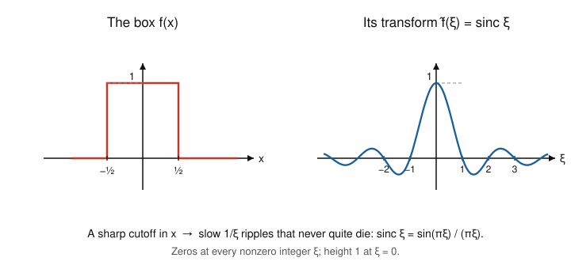

# Fourier & Harmonic Analysis · Lesson 2.1: From series to the Fourier transform

> ⏱ ~15 min · Module 2: The Fourier transform and convolution · Builds on: [Lesson 1.4](01-04-mean-square-parseval.md) (and all of Module 1) · Unlocks: [Lesson 2.2](02-02-properties-derivative-rule.md) (properties and the derivative rule)

## Why this matters

Fourier *series* only speak about periodic functions — a signal that repeats every $T$. But almost nothing you actually care about repeats: a single pulse, a decaying transient, a lone Gaussian bump. The Fourier *transform* is what you get when you let the period run off to infinity. The discrete list of overtones $c_1, c_2, \dots$ melts into a continuous *spectrum* $\hat f(\xi)$ defined at every frequency $\xi$, and the reconstruction sum becomes an integral. Every downstream tool — the derivative rule, convolution, sampling, the heat equation — lives on this transform. Get the limit in your bones now and the rest is algebra.

## The idea

A $T$-periodic function is a sum over a **discrete grid of frequencies**: it can only contain the harmonics $\xi_n = n/T$ — one cycle per period, two per period, three, and so on. Those grid points are spaced $\Delta\xi = 1/T$ apart.

Now stretch the period. Double $T$ and the grid spacing halves; the allowed frequencies pack twice as densely. Push $T \to \infty$ and the spacing $\Delta\xi \to 0$: the frequencies stop being a discrete list and fill up a *continuum*. A single non-repeating pulse is "periodic with infinite period," so it needs *every* frequency, each contributing an infinitesimal amount. The bookkeeping device that survives this limit is a **Riemann sum turning into an integral** — the sum $\sum_n (\cdots)\,\Delta\xi$ over grid points becomes $\int (\cdots)\,d\xi$. That single move, $\sum \to \int$, *is* the Fourier transform.

## The formal version

Start from the complex Fourier series of a $T$-periodic $f$ (Lesson 1.1), written on frequencies $\xi_n = n/T$:
$$f(x) = \sum_{n=-\infty}^{\infty} c_n\, e^{2\pi i \xi_n x}, \qquad c_n = \frac{1}{T}\int_{-T/2}^{T/2} f(x)\, e^{-2\pi i \xi_n x}\,dx.$$
Here $c_n$ is the (complex) amount of the pure wave $e^{2\pi i\xi_n x}$ present in $f$. The factor $1/T$ is awkward in the limit, so give it a name. Define
$$\hat f(\xi_n) := T c_n = \int_{-T/2}^{T/2} f(x)\, e^{-2\pi i \xi_n x}\,dx.$$
Substitute $c_n = \hat f(\xi_n)/T$ back into the series and recall $\Delta\xi = 1/T$:
$$f(x) = \sum_{n} \frac{\hat f(\xi_n)}{T}\, e^{2\pi i \xi_n x} = \sum_{n} \hat f(\xi_n)\, e^{2\pi i \xi_n x}\,\underbrace{\Delta\xi}_{=1/T}.$$
The right-hand side is a Riemann sum over the frequency grid $\{\xi_n\}$ with mesh $\Delta\xi$. Let $T \to \infty$: the grid fills the line, the integration window $[-T/2, T/2]$ opens to all of $\mathbb{R}$, and both expressions become integrals.

**The Fourier transform (ordinary-frequency convention).** For a suitable $f:\mathbb{R}\to\mathbb{C}$,
$$\boxed{\ \hat f(\xi) = \int_{-\infty}^{\infty} f(x)\, e^{-2\pi i x\xi}\,dx\ } \qquad\text{(analysis / forward)}$$
$$\boxed{\ f(x) = \int_{-\infty}^{\infty} \hat f(\xi)\, e^{+2\pi i x\xi}\,d\xi\ } \qquad\text{(synthesis / inverse)}$$

*In words:* $\hat f(\xi)$ measures how much of the pure wave at frequency $\xi$ is hiding inside $f$ (correlate $f$ against that wave and integrate); the inverse rebuilds $f$ by adding all those waves back up, now a continuous "sum" over frequency.

**Conventions — read this once and commit.** The variable $\xi$ is **ordinary frequency** (cycles per unit $x$). Many physics texts instead use **angular frequency** $\omega = 2\pi\xi$ and write $\hat f(\omega) = \int f(x)e^{-i\omega x}dx$, which forces a stray $\tfrac{1}{2\pi}$ into the inverse: $f(x) = \tfrac{1}{2\pi}\int \hat f(\omega)e^{i\omega x}d\omega$. The ordinary-frequency form above is the tidy one — the $2\pi$ sits inside the exponent, so forward and inverse are near-mirror images with no loose constants and Parseval (Lesson 2.4) has no prefactor. **This course uses $\xi$ throughout.** When you open Bracewell or a QM text, translate with $\omega = 2\pi\xi$.

**Where this is clean: the Schwartz class (light).** The integrals above need $f$ to decay. The gold-standard playground is the **Schwartz class** $\mathcal{S}$: functions that are infinitely differentiable *and* whose every derivative decays faster than any power of $x$ (formally, $\sup_x |x|^m |f^{(k)}(x)| < \infty$ for all $m,k$). The Gaussian $e^{-\pi x^2}$ is the poster child. On $\mathcal{S}$ everything works perfectly: $\hat f$ exists, is itself Schwartz, and the inverse recovers $f$ exactly. We treat $\mathcal{S}$ as the "clean room" where the algebra is rigorous, then extend by continuity — the full $L^2$-completeness story is [functional-analysis](../../functional-analysis/syllabus.md).

## Picture

The box and its transform — the single most important transform pair in the subject.

A hard edge in $x$ costs you a spectrum that reaches out to all frequencies and dies only slowly ($\sim 1/\xi$), rippling through zero at every nonzero integer. This inverse relationship — **sharp in one domain forces spread-out in the other** — is the seed of the uncertainty principle in Lesson 2.4.

## Worked examples

**Example 1 (the box → sinc).** Let $f$ be the unit box: $f(x) = 1$ for $|x| < \tfrac12$ and $0$ otherwise. Then
$$\hat f(\xi) = \int_{-1/2}^{1/2} e^{-2\pi i x\xi}\,dx = \left[\frac{e^{-2\pi i x\xi}}{-2\pi i\xi}\right]_{-1/2}^{1/2} = \frac{e^{-\pi i\xi} - e^{\pi i\xi}}{-2\pi i\xi} = \frac{\sin(\pi\xi)}{\pi\xi} =: \operatorname{sinc}(\xi).$$
The middle step uses $e^{i\theta} - e^{-i\theta} = 2i\sin\theta$ with $\theta = \pi\xi$. At $\xi = 0$ the formula is $0/0$; the honest value is $\hat f(0) = \int_{-1/2}^{1/2} 1\,dx = 1$, matching $\lim_{\xi\to 0}\operatorname{sinc}(\xi) = 1$. Note $\hat f(0) = \int f$ always — the zero-frequency component is just the total area. And $\operatorname{sinc}(\xi) = 0$ exactly when $\sin(\pi\xi) = 0$ with $\xi \neq 0$, i.e. at every nonzero integer.

**Example 2 (the one-sided exponential — a transform that isn't real).** Let $f(x) = e^{-ax}$ for $x > 0$ and $0$ for $x < 0$, with decay rate $a > 0$ (this is the impulse response of a first-order system — an $RC$ circuit relaxing, a population decaying). Then
$$\hat f(\xi) = \int_0^{\infty} e^{-ax} e^{-2\pi i x\xi}\,dx = \int_0^{\infty} e^{-(a + 2\pi i\xi)x}\,dx = \left[\frac{e^{-(a+2\pi i\xi)x}}{-(a+2\pi i\xi)}\right]_0^{\infty} = \frac{1}{a + 2\pi i\xi}.$$
The upper limit vanishes because $|e^{-(a+2\pi i\xi)x}| = e^{-ax} \to 0$ (this is where $a > 0$ earns its keep). The spectrum is **complex** — the function isn't symmetric, so no reason for $\hat f$ to be real. Its size,
$$|\hat f(\xi)| = \frac{1}{\sqrt{a^2 + 4\pi^2\xi^2}},$$
is a **Lorentzian**: a bump peaked at $\xi = 0$ whose width grows with $a$. Fast decay in $x$ (large $a$) ⇒ broad spectrum. Same trade-off as the box, seen again.

**And the triangle (stated).** The triangle $\Lambda(x) = 1 - |x|$ for $|x| < 1$, else $0$, transforms to $\hat\Lambda(\xi) = \operatorname{sinc}^2(\xi) = \left(\tfrac{\sin\pi\xi}{\pi\xi}\right)^2$. That the *square* of the box's transform appears is not luck: the triangle is the box convolved with itself, and — jumping ahead — the transform turns convolution into multiplication (the convolution theorem, [Lesson 2.3](02-03-convolution-theorem.md)). The extra factor of $\operatorname{sinc}$ is exactly why the triangle's smoother profile (a corner, not a jump) decays faster, like $1/\xi^2$.

## Watch out

- **You might think** the $2\pi$ placement is cosmetic — **but** mixing conventions is the number-one source of wrong constants in this subject. A formula lifted from an $\omega$-convention text will be off by factors of $2\pi$ against ours. Always check whether a source puts the $2\pi$ in the exponent (ordinary $\xi$) or out front (angular $\omega$).
- **You might think** every real function has a real transform — **but** Example 2 is real and its transform is complex. The clean rule: $f$ real *and even* ⇒ $\hat f$ real and even; $f$ real *and odd* ⇒ $\hat f$ purely imaginary and odd. Symmetry, not reality, controls the transform's reality.
- **You might think** $\hat f$ always decays quickly — **but** the box is not Schwartz (it has jumps), and its sinc decays only like $1/\xi$, slowly enough that $\int|\operatorname{sinc}|\,d\xi = \infty$. Roughness in $x$ buys you a heavy-tailed spectrum. Smoothness ↔ decay is the theme of Lesson 2.2.

## One-liner

> The Fourier transform is a Fourier series with the period cranked to infinity: the discrete overtones spaced $1/T$ blur into a continuum, and $\sum_n c_n\,e^{2\pi i\xi_n x}$ becomes $\int \hat f(\xi)\,e^{2\pi i\xi x}\,d\xi$.

## Problems

**P1 (🟢)** Compute the transform of the **wide box** $f(x) = 1$ for $|x| < T$ and $0$ otherwise (height $1$, half-width $T > 0$). Express the answer using $\operatorname{sinc}$, and check the $\xi = 0$ value against $\int f$.

**P2 (🟡)** Using the one-sided result $\widehat{e^{-ax}\mathbf{1}_{\{x>0\}}}(\xi) = \dfrac{1}{a + 2\pi i\xi}$ from Example 2, find the transform of the **two-sided** exponential $g(x) = e^{-a|x|}$ ($a > 0$) by splitting the integral at $0$. Confirm your answer is real and even, and identify the general symmetry principle that guaranteed this in advance.

**P3 (🔴, optional)** Apply the *inverse* transform to the Example 1 pair (box ↔ $\operatorname{sinc}$) at the single point $x = 0$ to evaluate the improper integral $\displaystyle\int_{-\infty}^{\infty} \operatorname{sinc}(\xi)\,d\xi$. (You may use that the box equals $1$ at $x=0$.)

Solutions

**P1.** Directly,
$$\hat f(\xi) = \int_{-T}^{T} e^{-2\pi i x\xi}\,dx = \left[\frac{e^{-2\pi i x\xi}}{-2\pi i\xi}\right]_{-T}^{T} = \frac{e^{-2\pi i T\xi} - e^{2\pi i T\xi}}{-2\pi i\xi} = \frac{\sin(2\pi T\xi)}{\pi\xi}.$$
To put it in $\operatorname{sinc}$ form, multiply and divide by $2T$:
$$\hat f(\xi) = 2T\,\frac{\sin(2\pi T\xi)}{2\pi T\xi} = 2T\,\operatorname{sinc}(2T\xi).$$
Check: $\hat f(0) = 2T = \int_{-T}^{T} 1\,dx$, the total area. ✓ Note the width trade-off: a wider box (larger $T$) gives a *narrower* central lobe (first zero at $\xi = 1/(2T)$) and a taller peak $2T$ — spread out in $x$ ⇒ concentrated in $\xi$.

**P2.** Split at the origin and use $|x| = -x$ for $x<0$, $|x| = x$ for $x>0$:
$$\hat g(\xi) = \int_{-\infty}^{0} e^{ax}e^{-2\pi i x\xi}\,dx + \int_{0}^{\infty} e^{-ax}e^{-2\pi i x\xi}\,dx.$$
The second integral is exactly Example 2: $\dfrac{1}{a + 2\pi i\xi}$. For the first, substitute $x \mapsto -x$ (so $dx \mapsto -dx$ and the limits flip to $0 \to \infty$):
$$\int_{-\infty}^{0} e^{ax}e^{-2\pi i x\xi}\,dx = \int_{0}^{\infty} e^{-ax}e^{+2\pi i x\xi}\,dx = \frac{1}{a - 2\pi i\xi}.$$
Add the two (common denominator $(a+2\pi i\xi)(a-2\pi i\xi) = a^2 + 4\pi^2\xi^2$):
$$\hat g(\xi) = \frac{1}{a + 2\pi i\xi} + \frac{1}{a - 2\pi i\xi} = \frac{(a - 2\pi i\xi) + (a + 2\pi i\xi)}{a^2 + 4\pi^2\xi^2} = \frac{2a}{a^2 + 4\pi^2\xi^2}.$$
This is real and even in $\xi$. That was forced in advance: $g(x) = e^{-a|x|}$ is real **and even**, and (from Watch out) real+even ⇒ transform real+even. The two one-sided pieces are complex conjugates of each other precisely because reflecting $x \mapsto -x$ conjugates the exponential, and their imaginary parts cancel.

**P3.** The inverse transform of the pair says $f(x) = \int_{-\infty}^{\infty} \operatorname{sinc}(\xi)\,e^{2\pi i x\xi}\,d\xi$, where $f$ is the unit box of Example 1. Evaluate at $x = 0$, where $e^{0} = 1$ and $f(0) = 1$:
$$1 = f(0) = \int_{-\infty}^{\infty} \operatorname{sinc}(\xi)\,d\xi.$$
So $\int_{-\infty}^{\infty} \operatorname{sinc}(\xi)\,d\xi = 1$. (Sanity check the classical way: with $u = \pi\xi$, $\int_{-\infty}^{\infty}\frac{\sin\pi\xi}{\pi\xi}\,d\xi = \frac{1}{\pi}\int_{-\infty}^{\infty}\frac{\sin u}{u}\,du = \frac{1}{\pi}\cdot\pi = 1$, using the Dirichlet integral $\int_{-\infty}^{\infty}\frac{\sin u}{u}\,du = \pi$.) The integral converges only conditionally — a reminder that the box, having a jump, sits *outside* the Schwartz clean room, so inversion here is a limiting statement, not an absolutely-convergent one.

## Flashback

**From [Lesson 1.4](01-04-mean-square-parseval.md) (mean-square convergence and Parseval):** The function $f(x) = x$ on $(-\pi, \pi)$, extended $2\pi$-periodically, has the sine series $f(x) = \sum_{n\ge 1} \frac{2(-1)^{n+1}}{n}\sin(nx)$. Apply Parseval's identity to evaluate $\sum_{n\ge 1} \frac{1}{n^2}$.

Solution

Parseval's identity for the real series $f = \tfrac{a_0}{2} + \sum(a_n\cos nx + b_n\sin nx)$ on $(-\pi,\pi)$ reads
$$\frac{1}{\pi}\int_{-\pi}^{\pi} |f(x)|^2\,dx = \frac{a_0^2}{2} + \sum_{n\ge 1}\left(a_n^2 + b_n^2\right).$$
Here $f(x) = x$ is odd, so all $a_n = 0$ and $b_n = \frac{2(-1)^{n+1}}{n}$, giving $b_n^2 = \frac{4}{n^2}$. The left side is
$$\frac{1}{\pi}\int_{-\pi}^{\pi} x^2\,dx = \frac{1}{\pi}\cdot\frac{2\pi^3}{3} = \frac{2\pi^2}{3}.$$
Therefore $\dfrac{2\pi^2}{3} = \sum_{n\ge 1}\dfrac{4}{n^2}$, and dividing by $4$,
$$\sum_{n\ge 1}\frac{1}{n^2} = \frac{\pi^2}{6}.$$
This is the Basel sum — the same "energy in $x$ = energy in the spectrum" accounting that will reappear for the transform as Plancherel's theorem in [Lesson 2.4](02-04-plancherel-uncertainty.md).

## Connections

- **Backward:** This *is* Module 1's series machinery in a limit. The coefficient integral $c_n = \frac1T\int f\,e^{-2\pi i\xi_n x}dx$ becomes $\hat f(\xi) = \int f\,e^{-2\pi i x\xi}dx$; the reconstruction sum becomes the inversion integral. Parseval (Lesson 1.4) becomes Plancherel (Lesson 2.4) under the same $\sum \to \int$.
- **Forward:** [Lesson 2.2](02-02-properties-derivative-rule.md) trades integration for algebra — shift, scaling, modulation, and the derivative rule $\widehat{f'}(\xi) = 2\pi i\xi\,\hat f(\xi)$ — so you never recompute a transform you can get from a known one. The box/one-sided results here are the seeds those rules propagate.
- **Sideways (functional analysis):** the Schwartz class is where the transform is a clean bijection; extending it to all finite-energy signals is the $L^2$-completeness theorem of [functional-analysis](../../functional-analysis/syllabus.md). The Gaussian — the Schwartz exemplar noted above — is the eigenfunction that anchors the uncertainty principle in Lesson 2.4 and reappears in [quantum-mechanics](../../quantum-mechanics/syllabus.md).
