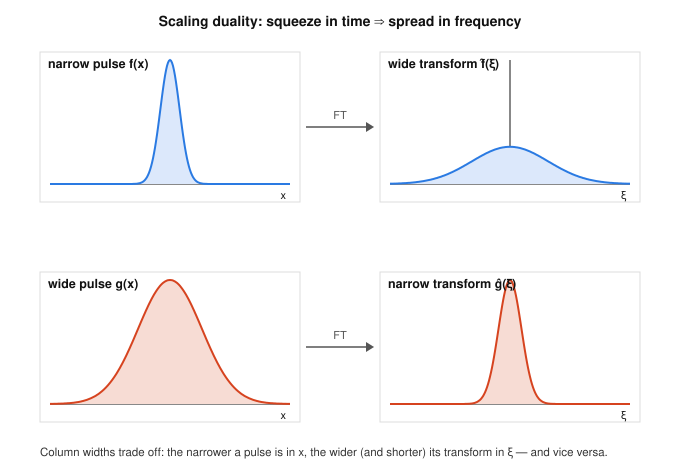

# Fourier & Harmonic Analysis · Lesson 2.2: Properties and the derivative rule

> ⏱ ~15 min · Module 2: The Fourier transform and convolution · Builds on: [Lesson 2.1](02-01-series-to-fourier-transform.md) · Unlocks: [Lesson 2.3](02-03-convolution-theorem.md) (the convolution theorem)

## Why this matters

You will almost never compute a Fourier transform from its integral twice. Once you know a handful of transforms (the box, the Gaussian, the exponential from [Lesson 2.1](02-01-series-to-fourier-transform.md)) and five *structural rules*, every shifted, stretched, modulated, or differentiated cousin of those functions falls out by algebra. The crown jewel is the **derivative rule**: differentiating a function multiplies its transform by $2\pi i\xi$. That single fact is why the Fourier transform turns differential equations — the language of every physical law — into ordinary algebra, and it's the engine behind the heat and wave equations in Module 4.

## The idea

Think of the transform as a translator between two rooms: the **time room** (a function $f(x)$) and the **frequency room** (its transform $\hat f(\xi)$, the recipe of pure waves $e^{2\pi i x\xi}$ that build $f$). Every simple thing you can do to $f$ in the time room has a clean echo in the frequency room:

- **Delay** the signal (slide it right) — the frequencies are all still there, just re-phased. Nothing changes in *how much* of each frequency you have, only its clock offset.
- **Squeeze** the signal in time — the waves that build it must oscillate faster, so the spectrum spreads out. Squeeze in time = spread in frequency. This is the seed of the uncertainty principle (Lesson 2.4).
- **Multiply by a wave** $e^{2\pi i b x}$ — you *shift* the whole spectrum up by $b$. This is literally how AM radio lifts a voice up to a carrier frequency.
- **Differentiate** — you *emphasize high frequencies*, because fast wiggles have big slopes. Precisely: each derivative multiplies the $\xi$-component by $2\pi i\xi$.

The last one is the payoff. Differentiation, a calculus operation, becomes multiplication by a number in the frequency room. Hard operation in, easy operation out.

## The formal version

Throughout, the convention from [Lesson 2.1](02-01-series-to-fourier-transform.md):
$$\hat f(\xi)=\int_{-\infty}^{\infty} f(x)\,e^{-2\pi i x\xi}\,dx.$$
*In words:* $\hat f(\xi)$ measures how much of the pure frequency $\xi$ is present in $f$. (The angular-frequency convention $\omega=2\pi\xi$ moves the $2\pi$'s around; ours keeps them tidiest.)

Assume $f$ is nice enough that every integral below converges and $f(x)\to 0$ as $|x|\to\infty$ (e.g. $f$ in the Schwartz class from 2.1). Here are the five rules.

**1. Linearity.** $\widehat{af+bg}(\xi)=a\,\hat f(\xi)+b\,\hat g(\xi)$ — immediate, the integral is linear.

**2. Time shift (delay = linear phase).** For a real constant $a$,
$$f(x-a)\ \longmapsto\ e^{-2\pi i a\xi}\,\hat f(\xi).$$
*In words:* delaying a signal by $a$ multiplies its transform by a unit-modulus phase $e^{-2\pi i a\xi}$ — the *magnitude* spectrum $|\hat f|$ is untouched, only the phase turns. *Proof.* Substitute $u=x-a$ in $\int f(x-a)e^{-2\pi i x\xi}dx=\int f(u)e^{-2\pi i(u+a)\xi}du=e^{-2\pi i a\xi}\hat f(\xi).$

**3. Frequency shift / modulation.** For a real constant $b$,
$$e^{2\pi i b x}f(x)\ \longmapsto\ \hat f(\xi-b).$$
*In words:* multiplying by a wave in time slides the entire spectrum over by $b$. This is the mirror image of Rule 2 (shift there, phase here) — the transform's symmetry between the two rooms.

**4. Dilation / scaling.** For a real $a\neq 0$,
$$f(ax)\ \longmapsto\ \frac{1}{|a|}\,\hat f\!\left(\frac{\xi}{a}\right).$$
*In words:* compress in time by a factor $a$ and the spectrum stretches by $a$ (and shrinks in height by $1/|a|$, conserving area). *Proof.* For $a>0$, sub $u=ax$: $\int f(ax)e^{-2\pi i x\xi}dx=\frac1a\int f(u)e^{-2\pi i (u/a)\xi}du=\frac1a\hat f(\xi/a)$; for $a<0$ the limits flip and produce $\frac{1}{|a|}$.

**5. The derivative rule.**
$$\widehat{f'}(\xi)=2\pi i\xi\,\hat f(\xi).$$
*In words:* differentiating in time = multiplying by $2\pi i\xi$ in frequency. *Proof (integration by parts).*
$$\widehat{f'}(\xi)=\int_{-\infty}^{\infty} f'(x)\,e^{-2\pi i x\xi}\,dx=\Big[f(x)e^{-2\pi i x\xi}\Big]_{-\infty}^{\infty}-\int_{-\infty}^{\infty} f(x)\,\frac{d}{dx}\!\left(e^{-2\pi i x\xi}\right)dx.$$
The boundary term vanishes because $f(x)\to 0$ at $\pm\infty$ (and $|e^{-2\pi i x\xi}|=1$). The remaining derivative is $\frac{d}{dx}e^{-2\pi i x\xi}=-2\pi i\xi\,e^{-2\pi i x\xi}$, so
$$\widehat{f'}(\xi)=0-\int f(x)(-2\pi i\xi)e^{-2\pi i x\xi}\,dx=2\pi i\xi\,\hat f(\xi).\qquad\blacksquare$$
Apply it $k$ times: $\widehat{f^{(k)}}(\xi)=(2\pi i\xi)^k\hat f(\xi)$.

**5′. The dual rule (multiply by $x$ ↔ differentiate the transform).** Differentiating $\hat f(\xi)=\int f(x)e^{-2\pi i x\xi}dx$ under the integral in $\xi$ pulls down a factor $-2\pi i x$, giving $\hat f{}'(\xi)=-2\pi i\,\widehat{xf}(\xi)$, i.e.
$$\widehat{x f(x)}(\xi)=-\frac{1}{2\pi i}\,\frac{d}{d\xi}\hat f(\xi).$$
*In words:* multiplying by $x$ in time = (up to a constant) differentiating in frequency. Rules 5 and 5′ are the same statement viewed from each room. (Note $-\frac{1}{2\pi i}=\frac{i}{2\pi}$, since $-1/i=i$.)

**The decay ↔ smoothness duality.** Rule 5 has a big consequence. Because any integrable $h$ has a *bounded* transform — $|\hat h(\xi)|\le\int|h(x)|\,dx$ (the integrand has modulus $\le|h|$) — applying it to $h=f^{(k)}$ gives $|(2\pi\xi)^k\hat f(\xi)|\le\int|f^{(k)}|<\infty$, so
$$|\hat f(\xi)|\le \frac{C_k}{|\xi|^{k}}.$$
*In words:* **the smoother $f$ is (more integrable derivatives), the faster $\hat f$ decays.** Dually (via Rule 5′), the faster $f$ decays, the smoother $\hat f$ is. Smoothness in one room = decay in the other. A jump in $f$ ⇒ a $\sim 1/\xi$ tail; a $C^\infty$ Gaussian ⇒ a spectrum that dies faster than any power.

## Picture

Top row: a narrow pulse in time (left) has a **wide, low** transform (right). Bottom row: a wide pulse has a **narrow, tall** transform. Compressing in $x$ forces the constituent waves to oscillate faster, spreading the spectrum in $\xi$ — Rule 4 made visible.

## Worked examples

**Example 1 (mechanical — no integral).** Let $\Pi$ be the unit box, $\Pi(x)=1$ for $|x|\le\tfrac12$ and $0$ otherwise; from [Lesson 2.1](02-01-series-to-fourier-transform.md), $\hat\Pi(\xi)=\operatorname{sinc}(\xi):=\dfrac{\sin(\pi\xi)}{\pi\xi}$. Find the transform of the box of **width 2 centred at 3**, i.e. $f(x)=1$ on $[2,4]$, without integrating.

Build $f$ from $\Pi$ by scaling then shifting. Width-2 box at the origin is $p(x)=\Pi(x/2)$ (its argument is in $[-\tfrac12,\tfrac12]$ exactly when $|x|\le 1$). By the scaling rule with $a=\tfrac12$:
$$\hat p(\xi)=\frac{1}{|1/2|}\hat\Pi\!\left(\frac{\xi}{1/2}\right)=2\,\operatorname{sinc}(2\xi).$$
Now recenter: $f(x)=p(x-3)$, so by the shift rule,
$$\boxed{\ \hat f(\xi)=e^{-2\pi i (3)\xi}\cdot 2\,\operatorname{sinc}(2\xi)=2e^{-6\pi i\xi}\,\frac{\sin(2\pi\xi)}{2\pi\xi}\ }$$
Sanity check: $\hat f(0)=2\cdot 1=2$, and indeed $\hat f(0)=\int f=\text{(area)}=2\times 1=2$. ✓ The phase $e^{-6\pi i\xi}$ carries the "centred at 3" information; the magnitude $|\hat f|=2|\operatorname{sinc}(2\xi)|$ is the same as for the centred box, as the shift rule promised.

**Example 2 (why you'd care — an ODE becomes algebra).** Solve, in the frequency room, the differential equation
$$-f''(x)+f(x)=g(x),$$
where $g$ is a given forcing. Transform both sides. By linearity and the derivative rule (applied twice, $\widehat{f''}=(2\pi i\xi)^2\hat f=-4\pi^2\xi^2\hat f$):
$$-(-4\pi^2\xi^2)\hat f(\xi)+\hat f(\xi)=\hat g(\xi)\quad\Longrightarrow\quad (1+4\pi^2\xi^2)\,\hat f(\xi)=\hat g(\xi).$$
The derivatives are *gone* — replaced by a polynomial in $\xi$. Divide:
$$\hat f(\xi)=\frac{\hat g(\xi)}{1+4\pi^2\xi^2}.$$
A differential equation collapsed to one division. To get $f(x)$ itself you invert this product of transforms, which is a *convolution* — exactly the tool built in [Lesson 2.3](02-03-convolution-theorem.md). This "differentiate → multiply → divide → invert" pipeline is the whole reason transforms tame ODEs and PDEs.

## Watch out

- You might think a time delay changes the spectrum's shape, but it only rotates the **phase**: $|\widehat{f(\cdot-a)}(\xi)|=|\hat f(\xi)|$. Two recordings of the same sound, one started a beat late, have identical magnitude spectra.
- You might drop the $|a|$ in the scaling rule, but the absolute value is essential — for $a<0$ (a time-reversal-and-stretch) the flipped integration limits supply it. With $a=-1$: $f(-x)\mapsto\hat f(-\xi)$, no stray minus sign on the amplitude.
- You might write the derivative factor as $i\xi$ or $2\pi\xi$. In *this* (ordinary-frequency) convention it is exactly $2\pi i\xi$. The angular convention $\hat f(\omega)=\int f e^{-i\omega x}dx$ makes it $i\omega$ — same physics, the $2\pi$ just lives in a different place. Pin your convention before you compute.

## One-liner

> Shift is phase, squeeze is spread, and differentiation is multiplication by $2\pi i\xi$ — so you translate a problem into the frequency room, where calculus turns into arithmetic.

## Problems

**P1 (🟢)** With $\Pi$ the unit box and $\hat\Pi(\xi)=\operatorname{sinc}(\xi)$, use the rules (no integrals) to transform:
(a) $\Pi(x-2)$;  (b) $\Pi(3x)$;  (c) $e^{2\pi i (5) x}\,\Pi(x)$. State which rule you used each time.

**P2 (🟡)** In [Lesson 2.1](02-01-series-to-fourier-transform.md) you meet the Gaussian $g(x)=e^{-\pi x^2}$, which is its own transform: $\hat g(\xi)=e^{-\pi\xi^2}$. Using only the dual rule 5′ (no integral), find the transform of $x\,e^{-\pi x^2}$. Then explain, from the symmetry of the input, why your answer *had* to come out purely imaginary and odd.

**P3 (🔴, optional)** Prove the smoothness ⇒ decay half of the duality quantitatively: if $f$ is $k$ times differentiable and $f,f',\dots,f^{(k)}$ are all integrable, then there is a constant $M$ with
$$|\hat f(\xi)|\le \frac{M}{(2\pi|\xi|)^{k}}\qquad(\xi\neq 0).$$
(Hint: apply the derivative rule $k$ times, then use $|\hat h(\xi)|\le\int|h|$.)

Solutions

**P1**
(a) **Shift rule** (Rule 2) with $a=2$: $\widehat{\Pi(\cdot-2)}(\xi)=e^{-2\pi i(2)\xi}\hat\Pi(\xi)=e^{-4\pi i\xi}\operatorname{sinc}(\xi).$

(b) **Scaling rule** (Rule 4) with $a=3$: $\widehat{\Pi(3\,\cdot)}(\xi)=\frac{1}{|3|}\hat\Pi(\xi/3)=\frac13\operatorname{sinc}(\xi/3).$ (Squeezing the box to a third its width tripled the spectral width and cut its height to $\tfrac13$.)

(c) **Modulation rule** (Rule 3) with $b=5$: $\widehat{e^{2\pi i 5 x}\Pi}(\xi)=\hat\Pi(\xi-5)=\operatorname{sinc}(\xi-5).$ The box's spectrum has been slid up to sit around $\xi=5$.

**P2** By Rule 5′, $\widehat{x g}(\xi)=-\dfrac{1}{2\pi i}\dfrac{d}{d\xi}\hat g(\xi)$. Here $\hat g(\xi)=e^{-\pi\xi^2}$, so $\hat g{}'(\xi)=-2\pi\xi\,e^{-\pi\xi^2}$. Then
$$\widehat{xg}(\xi)=-\frac{1}{2\pi i}\left(-2\pi\xi\,e^{-\pi\xi^2}\right)=\frac{\xi}{i}\,e^{-\pi\xi^2}=-\,i\,\xi\,e^{-\pi\xi^2}.$$
Why imaginary and odd: $xg(x)=x e^{-\pi x^2}$ is a **real, odd** function. For real $f$, $\hat f(-\xi)=\overline{\hat f(\xi)}$; for odd $f$, $\hat f(-\xi)=-\hat f(\xi)$. Together these force $\overline{\hat f(\xi)}=-\hat f(\xi)$, i.e. $\hat f$ is purely imaginary — and odd — which $-i\xi e^{-\pi\xi^2}$ is. (Numerically at $\xi=0.5$: $-i(0.5)e^{-\pi/4}\approx -0.228\,i$.)

**P3** Apply the derivative rule $k$ times: $\widehat{f^{(k)}}(\xi)=(2\pi i\xi)^k\hat f(\xi)$, so $|\hat f(\xi)|=\dfrac{|\widehat{f^{(k)}}(\xi)|}{|2\pi\xi|^{k}}$. Since $f^{(k)}$ is integrable, its transform is bounded:
$$|\widehat{f^{(k)}}(\xi)|=\left|\int f^{(k)}(x)e^{-2\pi i x\xi}dx\right|\le\int|f^{(k)}(x)|\,dx=:M<\infty.$$
Therefore $|\hat f(\xi)|\le \dfrac{M}{(2\pi|\xi|)^{k}}$. $\blacksquare$ Reading it back: $k$ integrable derivatives buy you decay of order $|\xi|^{-k}$ — smoothness in time is decay in frequency.

## Flashback

**From [Lesson 2.1](02-01-series-to-fourier-transform.md) (computing a transform from the definition):** Let $a>0$ and let $f(x)=e^{-a|x|}$ (the two-sided decaying exponential). Compute $\hat f(\xi)$ directly from the integral, and check the value at $\xi=0$.

Solution

Split at the kink in $|x|$:
$$\hat f(\xi)=\int_{-\infty}^{0} e^{ax}e^{-2\pi i x\xi}\,dx+\int_{0}^{\infty} e^{-ax}e^{-2\pi i x\xi}\,dx.$$
First integral, exponent $(a-2\pi i\xi)x$ with positive real part $a$ as $x\to-\infty$:
$$\int_{-\infty}^0 e^{(a-2\pi i\xi)x}dx=\frac{1}{a-2\pi i\xi}.$$
Second, exponent $-(a+2\pi i\xi)x$:
$$\int_0^\infty e^{-(a+2\pi i\xi)x}dx=\frac{1}{a+2\pi i\xi}.$$
Add over the common denominator $(a-2\pi i\xi)(a+2\pi i\xi)=a^2+4\pi^2\xi^2$:
$$\hat f(\xi)=\frac{(a+2\pi i\xi)+(a-2\pi i\xi)}{a^2+4\pi^2\xi^2}=\frac{2a}{a^2+4\pi^2\xi^2}.$$
This is a **Lorentzian** — real and even, as it must be since $f$ is real and even. Check: $\hat f(0)=\dfrac{2a}{a^2}=\dfrac{2}{a}$, matching $\int_{-\infty}^\infty e^{-a|x|}dx=2\int_0^\infty e^{-ax}dx=\dfrac{2}{a}$. ✓

(Notice the $1/\xi^2$ tail: $f$ has a corner — continuous but not differentiable at $0$ — so by the duality it decays like $\xi^{-2}$, one power better than a jump would give.)

## Connections

- **Backward:** these rules run on the transforms you computed by hand in [Lesson 2.1](02-01-series-to-fourier-transform.md) (box, Gaussian, exponential) — now you never redo those integrals.
- **Forward:** [Lesson 2.3](02-03-convolution-theorem.md) adds the last algebraic rule, $\widehat{f*g}=\hat f\,\hat g$, which is what inverts the "divide in frequency" step of Example 2. The derivative rule then powers the heat and wave equations in [Lesson 4.3](04-03-heat-wave-equations.md), where $\partial_x^2\mapsto -4\pi^2\xi^2$ turns a PDE into a family of decoupled ODEs.
- **Sideways (quantum mechanics):** the dual rule 5′ says multiplication by $x$ and differentiation in $\xi$ are Fourier-conjugate operations — exactly the position/momentum relationship. Pushing the decay↔smoothness duality to its sharpest form gives the [uncertainty principle](02-04-plancherel-uncertainty.md), the mathematical heart of [quantum-mechanics](../../quantum-mechanics/syllabus.md).
- **Sideways (signals):** the modulation rule (Rule 3) is AM radio — lifting a baseband spectrum up to a carrier — and the shift rule's "delay = phase" is the basis of filter and delay-line design in the future [signals-systems](../../signals-systems/syllabus.md) course.
</content>
</invoke>
