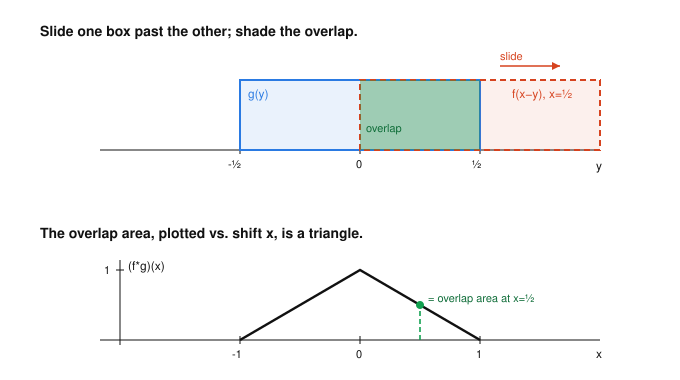

# Fourier & Harmonic Analysis · Lesson 2.3: Convolution and the convolution theorem

> ⏱ ~15 min · Module 2: The Fourier transform and convolution · Builds on: [Lesson 2.2](02-02-properties-derivative-rule.md) · Unlocks: [Lesson 2.4](02-04-plancherel-uncertainty.md)

## Why this matters

Convolution is the operation hiding inside every blur, every echo, every moving average, and every linear filter you've ever used — a camera's out-of-focus lens, a graphic equalizer, the smoothing you do to a noisy signal. Computed head-on it's an integral for *every* output point, which is expensive and unenlightening. The convolution theorem says: transform both inputs, **multiply**, transform back. That single swap — a hard integral becomes ordinary multiplication — is why the Fourier transform is the native language of signal processing and, later, why it dissolves the differential operators in the heat and wave equations ([Lesson 4.3](04-03-heat-wave-equations.md)).

## The idea

Convolution is *sliding-and-averaging*. To form $(f*g)$ at a point $x$, you flip one function, slide it to position $x$, and record how much it overlaps the other. Where they overlap a lot, the output is large; where they barely meet, it's small. Slide across all $x$ and you trace out a new function.

The everyday face of this is **smoothing**. Convolving a spiky signal with a little bump replaces each value by a weighted average of its neighbors — exactly a blur. A wide bump blurs hard; a narrow bump barely touches it; an infinitely narrow spike (the Dirac delta, [Lesson 3.1](03-01-dirac-delta-sifting.md)) does nothing at all — it's the identity.

Now the punchline. Blurring in the space domain is *complicated* (an integral at every point). But a pure wave $e^{2\pi i x\xi_0}$ that goes into a blur comes out as the *same* wave, only rescaled — a smoothing operation can't create or move frequencies, it can only dial each one up or down. So in the frequency domain, convolution stops being an integral and becomes plain multiplication: each frequency of $f$ is simply scaled by the corresponding frequency of $g$. That is the whole theorem, and it recasts "filtering" as "reach into the spectrum and turn some knobs."

## The formal version

Throughout we use the ordinary-frequency convention from [Lesson 2.1](02-01-series-to-fourier-transform.md): $\hat f(\xi)=\int_{-\infty}^{\infty} f(x)\,e^{-2\pi i x\xi}\,dx$, with $\xi$ the frequency.

**Definition (convolution).** For functions $f,g$ on $\mathbb{R}$,
$$(f*g)(x)=\int_{-\infty}^{\infty} f(y)\,g(x-y)\,dy .$$

*In words:* the value at $x$ is the overlap of $f$ with a flipped, shifted copy of $g$ — a sliding weighted average.

Straight from the definition (each is a one-line change of variables you should do once):

- **Commutative:** $f*g=g*f$. *(Sub $u=x-y$.)*
- **Associative:** $(f*g)*h=f*(g*h)$, and **bilinear** (linear in each slot).
- **Delta is the identity:** $f*\delta=f$, where $\delta$ is the Dirac delta — the do-nothing "infinitely narrow bump" made rigorous in [Lesson 3.1](03-01-dirac-delta-sifting.md).

**The Convolution Theorem.**
$$\boxed{\ \widehat{f*g}=\hat f\cdot\hat g\ }\qquad\text{and dually}\qquad \widehat{f\,g}=\hat f*\hat g .$$

*In words:* convolution in one domain is ordinary multiplication in the other. The awkward integral becomes a product.

*Proof of the first identity* (swap the order of integration, then use the shift rule from [Lesson 2.2](02-02-properties-derivative-rule.md)):
$$
\widehat{f*g}(\xi)=\int\!\Big(\!\int f(y)\,g(x-y)\,dy\Big)e^{-2\pi i x\xi}\,dx
=\int f(y)\underbrace{\Big(\!\int g(x-y)\,e^{-2\pi i x\xi}\,dx\Big)}_{\text{shift by }y}\,dy .
$$
The inner integral is the transform of a *shifted* $g$; substituting $u=x-y$ gives $e^{-2\pi i y\xi}\hat g(\xi)$. Hence
$$
\widehat{f*g}(\xi)=\int f(y)\,e^{-2\pi i y\xi}\,dy\;\hat g(\xi)=\hat f(\xi)\,\hat g(\xi). \qquad\blacksquare
$$
The dual $\widehat{fg}=\hat f*\hat g$ follows by running the same argument through the inversion formula. (Our $2\pi$-in-the-exponent convention is what keeps *both* forms free of stray constants — the angular-frequency convention puts a $1/2\pi$ on the dual.)

**LTI filters and spectral shaping.** A *linear, time-invariant* filter — linear, and commuting with time shifts — is completely described by its **impulse response** $h$ (its output when fed a unit spike). For any input,
$$\text{output}=\text{input}*h,\qquad\text{so}\qquad \widehat{\text{output}}=\widehat{\text{input}}\cdot\hat h .$$
*In words:* in the frequency domain the filter does nothing but **multiply the spectrum by $\hat h$**. The multiplier $\hat h(\xi)$ is the **transfer function**. Filtering *is* spectral shaping: a **low-pass** filter has $\hat h(\xi)\approx1$ for small $|\xi|$ and $\approx 0$ for large $|\xi|$, so it keeps the slow (low-frequency) content and kills the fast — a blur.

**Approximate identity.** Take a fixed bump $\phi$ with $\int\phi=1$ and narrow it: $\phi_\varepsilon(x)=\tfrac1\varepsilon\,\phi\!\big(\tfrac x\varepsilon\big)$ (unit area, width $\sim\varepsilon$). Then $f*\phi_\varepsilon\to f$ as $\varepsilon\to0$. *In words:* averaging over a shrinking window returns the function itself — the smooth, honest stand-in for "$f*\delta=f$" before we've built $\delta$.

## Picture

Convolving two identical boxes: slide one past the other and the overlap area, plotted against the shift, is a triangle.

## Worked examples

**Example 1 (box $*$ box $=$ triangle).** Let $B$ be the unit box, $B(x)=1$ for $|x|<\tfrac12$ and $0$ otherwise. Then
$$(B*B)(x)=\int_{-\infty}^{\infty} B(y)\,B(x-y)\,dy=\big|\{\,y:\ |y|<\tfrac12\ \text{and}\ |x-y|<\tfrac12\,\}\big|,$$
the length of the overlap of $[-\tfrac12,\tfrac12]$ with its shift $[x-\tfrac12,x+\tfrac12]$. For $0\le x\le1$ the overlap is $[\,x-\tfrac12,\ \tfrac12\,]$, of length $1-x$; by symmetry the general answer is
$$(B*B)(x)=\begin{cases}1-|x|,&|x|\le1,\\[2pt]0,&|x|>1,\end{cases}$$
the **triangle** $\Lambda$. Two flat, discontinuous boxes convolve into a continuous, peaked tent — convolution *smooths*, and it *widens* (supports add: width $1$ plus width $1$ gives width $2$).

**Example 2 (verify $\widehat{B*B}=\operatorname{sinc}^2$).** From [Lesson 2.1](02-01-series-to-fourier-transform.md), $\hat B(\xi)=\operatorname{sinc}(\xi)=\dfrac{\sin(\pi\xi)}{\pi\xi}$. The convolution theorem gives the transform of the triangle for *free*:
$$\hat\Lambda(\xi)=\widehat{B*B}(\xi)=\hat B(\xi)^2=\operatorname{sinc}^2(\xi).$$
Cross-check by brute force — $\Lambda$ is even, so
$$\hat\Lambda(\xi)=2\int_0^1(1-x)\cos(2\pi\xi x)\,dx=2\cdot\frac{1-\cos(2\pi\xi)}{(2\pi\xi)^2}=\frac{2\sin^2(\pi\xi)}{(\pi\xi)^2\cdot 2}=\operatorname{sinc}^2(\xi),$$
using $1-\cos\theta=2\sin^2(\theta/2)$. It matches — and squaring $\operatorname{sinc}$ makes the side-lobes decay like $1/\xi^2$ instead of $1/\xi$: the triangle is smoother than the box, and smoother functions have faster-decaying spectra (the decay $\leftrightarrow$ smoothness duality of [Lesson 2.2](02-02-properties-derivative-rule.md)).

## Watch out

- **Flip, don't just shift.** The integrand is $g(x-y)$, not $g(y-x)$ or $g(x+y)$ — you reflect $g$ *and* slide it. (For even $g$ the flip is invisible, which is why box and Gaussian examples feel forgiving; it bites the moment $g$ is asymmetric, like a one-sided exponential.)
- **You might think multiplying spectra means multiplying the functions.** No: $\widehat{f*g}=\hat f\hat g$, but $\widehat{f\cdot g}=\hat f*\hat g$. Pointwise product on one side is convolution on the other — never the same side.
- **A filter can't invent frequencies.** Since the output spectrum is $\hat h\cdot\widehat{\text{input}}$, any $\xi$ where the input has no energy stays empty, and any $\xi$ where $\hat h(\xi)=0$ is killed forever. An LTI filter only reweights the frequencies already present — it can attenuate, never synthesize.

## One-liner

> Convolution is sliding-overlap smoothing in space, and in frequency it is nothing but multiplying the two spectra — so every filter is just a set of per-frequency volume knobs $\hat h(\xi)$.

## Problems

**P1 (🟢)** An RC low-pass filter has causal impulse response $h(x)=e^{-x}$ for $x\ge0$ and $h(x)=0$ for $x<0$. (a) Compute its transfer function $\hat h(\xi)$. (b) Find $|\hat h(\xi)|$ and explain in one sentence why this filter is "low-pass."

**P2 (🟡)** Let $B$ be the unit box. Without computing a single convolution integral, find the Fourier transform of the triple convolution $B*B*B$, and state its decay rate as $|\xi|\to\infty$. What does that decay say about how smooth $B*B*B$ is compared with the triangle $B*B$?

**P3 (🔴, optional)** *(Approximate identity, seen in frequency.)* Let $\phi$ satisfy $\int_{-\infty}^{\infty}\phi=1$ and set $\phi_\varepsilon(x)=\tfrac1\varepsilon\phi(x/\varepsilon)$. Using the scaling rule and the convolution theorem, show that $\widehat{\,f*\phi_\varepsilon\,}(\xi)\to\hat f(\xi)$ for each fixed $\xi$ as $\varepsilon\to0^+$. Interpret the result as "$f*\phi_\varepsilon\to f$" and as a preview of $f*\delta=f$.

Solutions

**P1** (a) With the causal support, $\hat h(\xi)=\int_0^\infty e^{-x}e^{-2\pi i x\xi}\,dx=\int_0^\infty e^{-(1+2\pi i\xi)x}\,dx$. Since $\Re(1+2\pi i\xi)=1>0$, the integral converges to
$$\hat h(\xi)=\left[\frac{-1}{1+2\pi i\xi}e^{-(1+2\pi i\xi)x}\right]_0^\infty=\frac{1}{1+2\pi i\xi}.$$
(b) $|\hat h(\xi)|=\dfrac{1}{\sqrt{1+4\pi^2\xi^2}}$. This equals $1$ at $\xi=0$ and decreases monotonically toward $0$ as $|\xi|\to\infty$, so the filter passes low frequencies near full strength and progressively attenuates high ones — a low-pass. (The half-power point $|\hat h|^2=\tfrac12$ sits at $\xi=1/2\pi$, the cutoff.)

**P2** By associativity and the convolution theorem, $\widehat{B*B*B}=\hat B^{\,3}=\operatorname{sinc}^3(\xi)=\dfrac{\sin^3(\pi\xi)}{(\pi\xi)^3}$. As $|\xi|\to\infty$ the numerator is bounded by $1$, so $|\operatorname{sinc}^3(\xi)|\le \dfrac{1}{|\pi\xi|^3}$ — decay like $1/|\xi|^3$. Compared with the triangle's $\operatorname{sinc}^2$ (decay $1/\xi^2$), the spectrum falls off one power faster, so $B*B*B$ is *smoother*: each extra convolution with the box integrates once more, upgrading continuity (box: discontinuous; triangle: continuous with corners; $B*B*B$: continuously differentiable — a quadratic B-spline). Faster spectral decay $\Leftrightarrow$ more derivatives, exactly the duality from Lesson 2.2.

**P3** The scaling rule (Lesson 2.2): for $\phi_\varepsilon(x)=\tfrac1\varepsilon\phi(x/\varepsilon)$, $\ \widehat{\phi_\varepsilon}(\xi)=\hat\phi(\varepsilon\xi)$. (The $\tfrac1\varepsilon$ prefactor exactly cancels the $\varepsilon$ from dilating the argument, so the height of the transform is preserved — a narrowing bump has a *widening*, flattening spectrum.) By the convolution theorem,
$$\widehat{\,f*\phi_\varepsilon\,}(\xi)=\hat f(\xi)\,\widehat{\phi_\varepsilon}(\xi)=\hat f(\xi)\,\hat\phi(\varepsilon\xi).$$
Because $\int\phi=1$, we have $\hat\phi(0)=\int\phi(x)e^{0}\,dx=1$, and $\hat\phi$ is continuous, so $\hat\phi(\varepsilon\xi)\to\hat\phi(0)=1$ as $\varepsilon\to0^+$ for each fixed $\xi$. Therefore $\widehat{\,f*\phi_\varepsilon\,}(\xi)\to\hat f(\xi)$. Since the transforms converge to $\hat f$, the functions converge back to $f$: $f*\phi_\varepsilon\to f$. In the limit the bump becomes an infinitely narrow unit spike whose transfer function is the constant $1$ — it multiplies every frequency by $1$, i.e. changes nothing. That "multiply-by-1 for all $\xi$" filter is precisely the Dirac delta, and $f*\delta=f$ (Lesson 3.1).

## Flashback

**From [Lesson 2.2](02-02-properties-derivative-rule.md) (properties and the derivative rule):** The unit box $B$ (equal to $1$ on $[-\tfrac12,\tfrac12]$) has $\hat B(\xi)=\operatorname{sinc}(\xi)$. Using only the scaling and shift rules — no integration — find the Fourier transform of the box $R$ that equals $1$ on $[1,3]$ and $0$ elsewhere.

Solution

Build $R$ from $B$ in two moves. First widen: $R$ has width $2$, so it is a shift of the width-$2$ centered box $R_0(x)=B(x/2)$ (which is $1$ for $|x/2|<\tfrac12$, i.e. on $[-1,1]$). The scaling rule $\widehat{f(x/a)}(\xi)=|a|\,\hat f(a\xi)$ with $a=2$ gives
$$\widehat{R_0}(\xi)=2\,\hat B(2\xi)=2\operatorname{sinc}(2\xi)=\frac{\sin(2\pi\xi)}{\pi\xi}.$$
Then shift: $R(x)=R_0(x-2)$ (center $[-1,1]$ moves to $[1,3]$). The shift rule $\widehat{f(x-c)}(\xi)=e^{-2\pi i c\xi}\hat f(\xi)$ with $c=2$ gives
$$\hat R(\xi)=e^{-4\pi i\xi}\cdot 2\operatorname{sinc}(2\xi)=e^{-4\pi i\xi}\,\frac{\sin(2\pi\xi)}{\pi\xi}.$$
Sanity check by the definition: $\int_1^3 e^{-2\pi i x\xi}\,dx=\dfrac{e^{-6\pi i\xi}-e^{-2\pi i\xi}}{-2\pi i\xi}=e^{-4\pi i\xi}\dfrac{e^{2\pi i\xi}-e^{-2\pi i\xi}}{2\pi i\xi}=e^{-4\pi i\xi}\dfrac{\sin(2\pi\xi)}{\pi\xi}.$ ✓ The magnitude $2|\operatorname{sinc}(2\xi)|$ is set by the width; the phase $e^{-4\pi i\xi}$ records the center.

## Connections

- **Backward:** the proof is the shift rule of [Lesson 2.2](02-02-properties-derivative-rule.md) applied under an integral sign; the transforms $\hat B=\operatorname{sinc}$ come from [Lesson 2.1](02-01-series-to-fourier-transform.md). The "smoother $\Rightarrow$ faster spectral decay" reading is the decay $\leftrightarrow$ smoothness duality made concrete.
- **Forward:** [Lesson 2.4](02-04-plancherel-uncertainty.md) uses the convolution theorem to show two Gaussians convolve to a Gaussian with *added variances*. The identity $f*\delta=f$ is settled in [Lesson 3.1](03-01-dirac-delta-sifting.md); sampling as multiplication-by-a-comb ([Lesson 4.1](04-01-sampling-nyquist.md)) turns, via the dual $\widehat{fg}=\hat f*\hat g$, into spectral replication — the engine of aliasing.
- **Sideways (signals & systems):** "output $=$ input $*$ impulse response, so multiply by the transfer function $\hat h$" is the founding equation of linear filtering — the through-line to the future `signals-systems` course (Module 4). The RC filter of P1 is a first taste.
- **Sideways (PDEs):** the heat equation's solution is the initial data *convolved* with a spreading Gaussian heat kernel; the convolution theorem is exactly why transforming turns that PDE into an algebra problem in [Lesson 4.3](04-03-heat-wave-equations.md), bridging to `pdes`.
