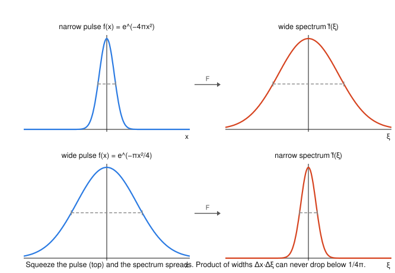

# Fourier & Harmonic Analysis · Lesson 2.4: Plancherel, energy, and the uncertainty principle

> ⏱ ~15 min · Module 2: The Fourier transform and convolution · Builds on: [Lesson 2.2](02-02-properties-derivative-rule.md), [Lesson 2.3](02-03-convolution-theorem.md) · Unlocks: Module 3 — [Lesson 3.1](03-01-dirac-delta-sifting.md)

## Why this matters

Two facts anchor everything downstream. First, the Fourier transform **conserves energy**: whatever "size" a signal has in time, it has the exact same size in frequency — the transform just relabels the same content. That single sentence is why physicists read a signal's power off its spectrum and why the transform is called *unitary*. Second, there is a hard floor on how concentrated a function and its transform can be *simultaneously*: a spike in time is a smear in frequency, always. This is the **uncertainty principle**, and it is not a physics postulate bolted onto Fourier analysis — it *is* a theorem about Fourier transforms. Heisenberg's $\Delta x\,\Delta p\ge \hbar/2$ is this lesson's $\Delta x\,\Delta\xi\ge\frac{1}{4\pi}$ wearing a physicist's hat.

Throughout we use the ordinary-frequency convention fixed in [Lesson 2.1](02-01-series-to-fourier-transform.md): $\hat f(\xi)=\int_{-\infty}^{\infty} f(x)\,e^{-2\pi i x\xi}\,dx$. (The angular-frequency convention $\omega=2\pi\xi$ scatters $2\pi$'s through these formulas; ours keeps them clean — the transform is exactly unitary with no stray constants.)

## The idea

Back in [Lesson 1.4](01-04-mean-square-parseval.md), Parseval's identity said a periodic function's energy equals the sum of the squared magnitudes of its Fourier coefficients — energy is just redistributed among the discrete modes. Push the period to infinity and the sum becomes an integral: **Plancherel's theorem** says the energy in time, $\int |f(x)|^2\,dx$, equals the energy in frequency, $\int |\hat f(\xi)|^2\,d\xi$. The transform is an energy-preserving change of coordinates on the space of finite-energy functions.

Now the tradeoff. Recall the scaling rule from [Lesson 2.2](02-02-properties-derivative-rule.md): squeezing a function in time (making it a sharp pulse) stretches its transform in frequency (a broad spectrum), and vice versa. Plancherel says the *total* energy is fixed, so you can't cheat — shove the time-energy into a narrow window and the frequency-energy has nowhere to go but wide. The uncertainty principle makes this quantitative: the product of the two spreads has a positive lower bound you can never beat. And one function sits exactly at the floor — the **Gaussian**, which (astonishingly) is its own Fourier transform.

## The formal version

**Plancherel's theorem.** For a finite-energy function $f$ (i.e. $\int|f|^2<\infty$),
$$\int_{-\infty}^{\infty} |f(x)|^2\,dx \;=\; \int_{-\infty}^{\infty} |\hat f(\xi)|^2\,d\xi .$$
*In words:* the total energy is the same whether you measure it in time or in frequency — the transform is a **unitary** map, a rotation of the infinite-dimensional space of finite-energy functions.

There is a more general **polarized (Parseval) form** for two functions:
$$\int_{-\infty}^{\infty} f(x)\,\overline{g(x)}\,dx \;=\; \int_{-\infty}^{\infty} \hat f(\xi)\,\overline{\hat g(\xi)}\,d\xi ,$$
i.e. $\langle f,g\rangle=\langle \hat f,\hat g\rangle$: the transform preserves inner products, not just norms. Setting $g=f$ recovers Plancherel. This is the continuous echo of the orthogonality/projection picture from [Lesson 1.2](01-02-orthogonal-systems-projection.md); the full statement — that $L^2$ is a Hilbert space and the transform a unitary operator on it — is the province of `functional-analysis`.

**Energy spectral density.** The quantity $|\hat f(\xi)|^2$ is the **energy per unit frequency**: integrate it over a band $[\xi_1,\xi_2]$ and you get the energy the signal carries in that band. This is exactly how a spectrum analyzer reports "how much of the signal lives near 440 Hz."

**Uncertainty principle.** Normalize $f$ to unit energy, $\int|f|^2\,dx=1$, and assume it's centered at the origin in both domains (means zero). Define the **spreads** as normalized second moments — the standard deviations of the energy distributions $|f|^2$ and $|\hat f|^2$:
$$(\Delta x)^2=\int_{-\infty}^{\infty} x^2\,|f(x)|^2\,dx,\qquad (\Delta \xi)^2=\int_{-\infty}^{\infty} \xi^2\,|\hat f(\xi)|^2\,d\xi .$$
Then
$$\boxed{\;\Delta x\,\Delta\xi\;\ge\;\dfrac{1}{4\pi}\;}$$
with **equality if and only if $f$ is a Gaussian** $f(x)=A\,e^{-\pi a x^2}$ (any width $a>0$, any amplitude $A$ fixing the normalization).

*In words:* you cannot make a signal narrow in time and narrow in frequency at once; the product of the two widths is bounded below, and the Gaussian is the unique shape that hits the wall.

## Picture

Top row: a narrow time pulse has a wide spectrum. Bottom row: a wide time pulse has a narrow spectrum. The dashed bars mark each curve's half-maximum width. Squeeze the left column and the right column swells by exactly the reciprocal factor — the product of widths is *scale-invariant* (you'll prove this in P2), so it can never be pushed below the floor $\frac{1}{4\pi}$.

## Worked examples

**Example 1 — the Gaussian is its own transform.** Let $g(x)=e^{-\pi x^2}$. We find $\hat g$ *without* computing a single integral, using only the two rules from [Lesson 2.2](02-02-properties-derivative-rule.md).

Start from the differential equation $g$ satisfies. Differentiating,
$$g'(x)=-2\pi x\,g(x).$$
Now Fourier-transform both sides and use two rules:

- **Derivative rule:** $\widehat{g'}(\xi)=2\pi i\,\xi\,\hat g(\xi)$.
- **Multiplication rule:** differentiating $\hat g(\xi)=\int g(x)e^{-2\pi i x\xi}dx$ under the integral in $\xi$ gives $\hat g{}'(\xi)=\int g(x)(-2\pi i x)e^{-2\pi i x\xi}dx=-2\pi i\,\widehat{x g}(\xi)$, so $\widehat{x g}(\xi)=\dfrac{i}{2\pi}\,\hat g{}'(\xi)$.

Transform $g'=-2\pi x\,g$:
$$\underbrace{2\pi i\,\xi\,\hat g}_{\widehat{g'}}=-2\pi\,\widehat{xg}=-2\pi\cdot\frac{i}{2\pi}\,\hat g{}'=-i\,\hat g{}'.$$
Divide by $-i$: $\;\hat g{}'(\xi)=-2\pi\,\xi\,\hat g(\xi)$. **The transform obeys the same ODE as $g$ itself.** Solving this separable first-order ODE (an [ode-refresher](../../ode-refresher/syllabus.md) staple),
$$\hat g(\xi)=\hat g(0)\,e^{-\pi \xi^2},\qquad \hat g(0)=\int_{-\infty}^{\infty} e^{-\pi x^2}\,dx=1.$$
(The normalizing $\pi$ in the exponent is chosen precisely so this integral is $1$.) Therefore
$$\hat g(\xi)=e^{-\pi\xi^2}=g(\xi).$$
The Gaussian $e^{-\pi x^2}$ is a **fixed point** of the Fourier transform — an eigenfunction with eigenvalue $1$. This is the object that returns as the minimum-uncertainty wavepacket in `quantum-mechanics`.

**Example 2 — reading energy off the spectrum with Plancherel.** Take the unit box $\Pi(x)=1$ for $|x|<\tfrac12$ and $0$ otherwise. Its transform (from [Lesson 2.1](02-01-series-to-fourier-transform.md)) is the sinc:
$$\hat\Pi(\xi)=\frac{\sin(\pi\xi)}{\pi\xi}=\operatorname{sinc}(\xi).$$
The box's energy is trivial: $\int|\Pi|^2\,dx=\int_{-1/2}^{1/2}1\,dx=1$. Plancherel then *hands us* an integral that would be painful head-on:
$$\int_{-\infty}^{\infty}\operatorname{sinc}^2(\xi)\,d\xi=\int_{-\infty}^{\infty}\left(\frac{\sin\pi\xi}{\pi\xi}\right)^2 d\xi=\int_{-\infty}^{\infty}|\Pi|^2\,dx=1.$$
No contour integral, no clever substitution — energy conservation did the work. This is the transform-domain analogue of using Parseval to sum $\sum 1/n^2$ back in [Lesson 1.4](01-04-mean-square-parseval.md).

**Sketch of the uncertainty proof (Cauchy–Schwarz + parts).** Assume $f$ real-normalized as above and decaying (Schwartz-class, so all boundary terms vanish). Integrate $1=\int 1\cdot|f|^2\,dx$ by parts, differentiating $x$ off the "$1$":
$$1=\int_{-\infty}^{\infty}|f|^2\,dx=\Big[x|f|^2\Big]_{-\infty}^{\infty}-\int_{-\infty}^{\infty} x\,\big(|f|^2\big)'\,dx=-\int_{-\infty}^{\infty} x\cdot 2\,\Re\!\big(\overline f\,f'\big)\,dx.$$
Bound and apply the Cauchy–Schwarz inequality (from [Lesson 1.2](01-02-orthogonal-systems-projection.md)):
$$1\le 2\int |x|\,|f|\,|f'|\,dx\le 2\left(\int x^2|f|^2\,dx\right)^{1/2}\!\left(\int |f'|^2\,dx\right)^{1/2}.$$
The second factor is a frequency quantity in disguise: by the derivative rule $\widehat{f'}=2\pi i\xi\hat f$ and **Plancherel**,
$$\int |f'|^2\,dx=\int|\widehat{f'}|^2\,d\xi=\int |2\pi i\xi\,\hat f|^2\,d\xi=4\pi^2\int \xi^2|\hat f|^2\,d\xi=(2\pi\,\Delta\xi)^2.$$
Substituting, $1\le 2\cdot\Delta x\cdot 2\pi\,\Delta\xi=4\pi\,\Delta x\,\Delta\xi$, i.e. $\Delta x\,\Delta\xi\ge\frac{1}{4\pi}$. Equality forces Cauchy–Schwarz equality, $f'(x)=c\,x\,f(x)$ for a constant $c$; solving gives $f(x)=A\,e^{cx^2/2}$, which is in $L^2$ only when $c<0$ — a **Gaussian**. $\blacksquare$

## Watch out

- **The bound depends on the convention.** The floor $\frac{1}{4\pi}$ is for the ordinary-frequency transform $\hat f(\xi)=\int f e^{-2\pi i x\xi}dx$. Switch to angular frequency $\omega=2\pi\xi$ and the same theorem reads $\Delta x\,\Delta\omega\ge\frac12$. In quantum mechanics one uses $p=\hbar\omega=h\xi$, turning the $\frac12$ into $\hbar/2$. Same theorem, three costumes — always state your convention.
- **"Its own transform" is convention-locked too.** $e^{-\pi x^2}=\hat{\;}$ of itself holds *only* with the $2\pi$-in-the-exponent convention. Under other conventions the self-transform Gaussian is $e^{-x^2/2}$ (angular) with an extra constant out front. The eigenfunction property survives; the exact formula doesn't.
- **Plancherel needs finite energy, not just a convergent transform.** $\int|f|^2<\infty$ ($f\in L^2$) is the natural home. A function like a pure constant or a single sinusoid has infinite energy — Plancherel doesn't apply to it as an ordinary integral; those objects need the distributions of Module 3.
- **Spreads are second moments of $|f|^2$, not of $f$.** You weight by the *energy density* $|f(x)|^2$, not by $f$ itself. Forgetting the square (or forgetting to normalize $\int|f|^2=1$) is the usual slip.

## One-liner

> The Fourier transform is a rotation that never loses energy, and the price of a sharp pulse is a broad spectrum — with the Gaussian, its own transform, sitting exactly on the $\Delta x\,\Delta\xi=\frac{1}{4\pi}$ floor.

## Problems

**P1 (🟢)** The two-sided exponential $f(x)=e^{-|x|}$ has Fourier transform $\hat f(\xi)=\dfrac{2}{1+4\pi^2\xi^2}$ (from [Lesson 2.1](02-01-series-to-fourier-transform.md)). Compute the time-domain energy $\int_{-\infty}^{\infty}|f(x)|^2\,dx$ directly, and use Plancherel to state the value of the frequency-domain integral $\displaystyle\int_{-\infty}^{\infty}\frac{4}{(1+4\pi^2\xi^2)^2}\,d\xi$ without evaluating it head-on.

**P2 (🟡)** *(Why the width product is a genuine constant.)* For $s>0$ let $f_s(x)=f(x/s)$ be the time-stretched signal, with spreads defined as **normalized** second moments, $(\Delta x)^2=\dfrac{\int x^2|f|^2\,dx}{\int|f|^2\,dx}$ and likewise for $\Delta\xi$. Using the scaling rule $\widehat{f_s}(\xi)=s\,\hat f(s\xi)$ from [Lesson 2.2](02-02-properties-derivative-rule.md), show that $\Delta x_s=s\,\Delta x$ and $\Delta\xi_s=\Delta\xi/s$, so the product $\Delta x_s\,\Delta\xi_s=\Delta x\,\Delta\xi$ is **scale-invariant**. (This is the algebra behind the picture: squeezing time by $s$ swells frequency by exactly $1/s$.)

**P3 (🔴, optional — the quantum bridge)** The energy-normalized Gaussian wavepacket is $\psi(x)=(2a)^{1/4}e^{-\pi a x^2}$ (so $\int|\psi|^2\,dx=1$). (a) Verify the normalization. (b) Compute $\Delta x$ and $\Delta\xi$ and confirm $\Delta x\,\Delta\xi=\frac{1}{4\pi}$ for *every* width $a>0$ — the Gaussian is always exactly at the floor. (c) In quantum mechanics momentum is $p=h\xi$ with $h=2\pi\hbar$. Show your result becomes Heisenberg's $\Delta x\,\Delta p=\hbar/2$. Useful: $\int_{-\infty}^{\infty}e^{-\alpha x^2}dx=\sqrt{\pi/\alpha}$ and $\int_{-\infty}^{\infty}x^2e^{-\alpha x^2}dx=\tfrac12\sqrt{\pi/\alpha^3}$.

Solutions

**P1** Time energy:
$$\int_{-\infty}^{\infty}e^{-2|x|}\,dx=2\int_0^{\infty}e^{-2x}\,dx=2\cdot\frac12=1.$$
By Plancherel, $\int|\hat f(\xi)|^2\,d\xi$ equals this same value. Since $|\hat f(\xi)|^2=\dfrac{4}{(1+4\pi^2\xi^2)^2}$,
$$\int_{-\infty}^{\infty}\frac{4}{(1+4\pi^2\xi^2)^2}\,d\xi=\int_{-\infty}^{\infty}|f|^2\,dx=1.$$
(Direct evaluation would need a trig substitution and a reduction formula; Plancherel gives it in one line.)

**P2** *Time spread.* With $u=x/s$ (so $x=su$, $dx=s\,du$):
$$\int x^2|f_s|^2dx=\int (su)^2|f(u)|^2\,s\,du=s^3\!\int u^2|f|^2du,\qquad \int|f_s|^2dx=s\!\int|f|^2du.$$
Dividing, $(\Delta x_s)^2=\dfrac{s^3\int u^2|f|^2}{s\int|f|^2}=s^2(\Delta x)^2$, so $\Delta x_s=s\,\Delta x$. ✓

*Frequency spread.* Here $|\widehat{f_s}(\xi)|^2=s^2|\hat f(s\xi)|^2$. Substitute $v=s\xi$ ($\xi=v/s$, $d\xi=dv/s$):
$$\int \xi^2|\widehat{f_s}|^2d\xi=\int \frac{v^2}{s^2}\,s^2|\hat f(v)|^2\frac{dv}{s}=\frac1s\!\int v^2|\hat f|^2dv,\qquad \int|\widehat{f_s}|^2d\xi=\int s^2|\hat f(s\xi)|^2d\xi=s\!\int|\hat f|^2dv.$$
Dividing, $(\Delta\xi_s)^2=\dfrac{(1/s)\int v^2|\hat f|^2}{s\int|\hat f|^2}=\dfrac{(\Delta\xi)^2}{s^2}$, so $\Delta\xi_s=\Delta\xi/s$. ✓

Therefore $\Delta x_s\,\Delta\xi_s=(s\,\Delta x)(\Delta\xi/s)=\Delta x\,\Delta\xi$: stretching or squeezing in time leaves the width product untouched. It can approach the floor $\frac1{4\pi}$ but never depends on $s$.

**P3** (a) $\int|\psi|^2dx=\sqrt{2a}\int e^{-2\pi a x^2}dx=\sqrt{2a}\cdot\sqrt{\pi/(2\pi a)}=\sqrt{2a}\cdot\dfrac{1}{\sqrt{2a}}=1.$ ✓

(b) *Position.* Using $\int x^2 e^{-\alpha x^2}dx=\tfrac12\sqrt{\pi/\alpha^3}$ with $\alpha=2\pi a$,
$$(\Delta x)^2=\int x^2|\psi|^2dx=\sqrt{2a}\int x^2 e^{-2\pi a x^2}dx=\sqrt{2a}\cdot\frac12\sqrt{\frac{\pi}{(2\pi a)^3}}.$$
Now $\tfrac12\sqrt{\pi/(2\pi a)^3}=\tfrac12\cdot\tfrac{1}{2\pi a}\sqrt{\pi/(2\pi a)}=\tfrac{1}{4\pi a}\cdot\tfrac{1}{\sqrt{2a}}$, and multiplying by $\sqrt{2a}$ leaves $(\Delta x)^2=\dfrac{1}{4\pi a}$. So $\Delta x=\dfrac{1}{2\sqrt{\pi a}}$.

*Frequency.* Since $\widehat{e^{-\pi a x^2}}=\tfrac1{\sqrt a}e^{-\pi\xi^2/a}$ (the scaling of Example 1's Gaussian), $\hat\psi(\xi)=(2a)^{1/4}a^{-1/2}e^{-\pi\xi^2/a}=(2/a)^{1/4}e^{-\pi\xi^2/a}$, so $|\hat\psi|^2=\sqrt{2/a}\,e^{-2\pi\xi^2/a}$. With $\alpha=2\pi/a$,
$$(\Delta\xi)^2=\sqrt{\tfrac2a}\int \xi^2 e^{-2\pi\xi^2/a}d\xi=\sqrt{\tfrac2a}\cdot\frac12\sqrt{\frac{\pi}{(2\pi/a)^3}}=\frac{a}{4\pi}.$$
So $\Delta\xi=\dfrac{\sqrt a}{2\sqrt\pi}$, and
$$\Delta x\,\Delta\xi=\frac{1}{2\sqrt{\pi a}}\cdot\frac{\sqrt a}{2\sqrt\pi}=\frac{1}{4\pi}\quad\text{for all }a>0.\ \checkmark$$
The width $a$ cancels — trade position sharpness for momentum sharpness however you like, the product is pinned to the minimum.

(c) With $p=h\xi$, the momentum spread is $\Delta p=h\,\Delta\xi$, so
$$\Delta x\,\Delta p=h\,(\Delta x\,\Delta\xi)=h\cdot\frac{1}{4\pi}=\frac{2\pi\hbar}{4\pi}=\frac{\hbar}{2}.$$
This is exactly Heisenberg's uncertainty relation, and the Gaussian $\psi$ is the **minimum-uncertainty wavepacket**. The pure Fourier theorem and the quantum principle are the same statement.

## Flashback

**From Lesson 2.3 (Convolution and the convolution theorem):** An ideal **low-pass filter** has impulse response $h$ with transfer function $\hat h(\xi)=1$ for $|\xi|\le 1$ and $\hat h(\xi)=0$ for $|\xi|>1$. A finite-energy input $f$ has a spectrum $\hat f$ supported on $|\xi|\le 2$. The filtered output is the convolution $y=f*h$. Describe the output spectrum $\hat y(\xi)$, and say in one plain sentence what the filter did to the signal.

Solution

By the convolution theorem, $\widehat{f*g}=\hat f\,\hat g$, so
$$\hat y(\xi)=\hat f(\xi)\,\hat h(\xi)=\begin{cases}\hat f(\xi), & |\xi|\le 1,\\[2pt] 0, & |\xi|>1.\end{cases}$$
The filter keeps the input's frequency content on $|\xi|\le 1$ untouched and deletes everything on $1<|\xi|\le 2$. *In words:* it stripped out the high-frequency part of the signal, leaving a smoother, slowly-varying version — convolution in time is spectral shaping in frequency.

## Connections

- **Backward:** this is the transform-domain sequel to Parseval for Fourier *series* ([Lesson 1.4](01-04-mean-square-parseval.md)) — sums of $|c_n|^2$ become the integral $\int|\hat f|^2$ — and it leans on Cauchy–Schwarz and the inner-product/projection viewpoint of [Lesson 1.2](01-02-orthogonal-systems-projection.md). The self-transforming Gaussian was built entirely from the derivative and scaling rules of [Lesson 2.2](02-02-properties-derivative-rule.md).
- **Forward:** the "constants and sinusoids have infinite energy, so Plancherel needs help" caveat is precisely what [Lesson 3.1](03-01-dirac-delta-sifting.md) and the rest of Module 3 fix — the Dirac delta and tempered distributions extend the transform (and energy accounting) to objects ordinary integrals can't reach.
- **Sideways — `quantum-mechanics`:** $\Delta x\,\Delta\xi\ge\frac1{4\pi}$ **is** Heisenberg's $\Delta x\,\Delta p\ge\hbar/2$ under $p=h\xi$ (P3), and the Gaussian is the minimum-uncertainty wavepacket. Position- and momentum-space wavefunctions are a Fourier transform pair, so "you can't localize both" is a theorem you just proved, not a mystery of the quantum world.
- **Sideways — `functional-analysis`:** "the transform preserves inner products" ($\langle f,g\rangle=\langle\hat f,\hat g\rangle$) is the statement that the Fourier transform is a **unitary operator** on the Hilbert space $L^2$ — the rigorous frame for everything this lesson treated by hand.
