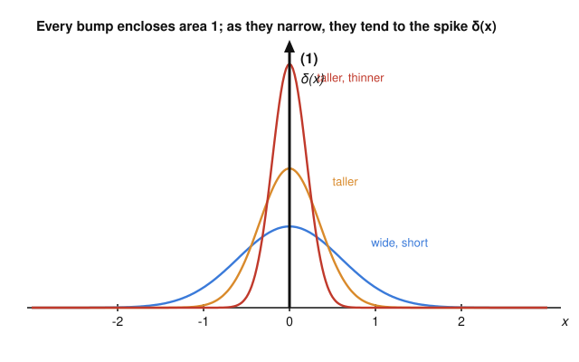

# Fourier & Harmonic Analysis · Lesson 3.1: The Dirac delta and the sifting property

> ⏱ ~15 min · Module 3: The Dirac delta and distributions · Builds on: [Lesson 2.3](02-03-convolution-theorem.md), [Lesson 2.4](02-04-plancherel-uncertainty.md) · Unlocks: [Lesson 3.2](03-02-distributions-weak-derivatives.md)

## Why this matters

Every physical model that involves a *point* — a point charge, a hammer-blow impulse on a string, a single sampled instant of a signal, a particle localized at a position — needs an object that is "all concentrated at one spot yet still has unit total effect." No ordinary function does this: a function that is zero everywhere except one point integrates to zero. The Dirac delta $\delta$ is the tool physicists and engineers reach for anyway, and it works flawlessly — provided you treat it as a *limiting process* and a *rule for what happens inside an integral*, not as a function you can plug numbers into. Get the sifting property $\int f(x)\delta(x-a)\,dx=f(a)$ under your fingers and you can sample, model impulses, and (next lesson) differentiate discontinuous things.

## The idea

Picture a bump — a smooth hill of height 1 sitting near the origin, enclosing area 1. Now squeeze it: make it half as wide but twice as tall, so the area stays 1. Squeeze again. And again. The hill grows infinitely tall and infinitely thin, but the area under it never budges from 1. The **Dirac delta** $\delta(x)$ is the idealized end of this process: "zero width, infinite height, area exactly 1, all piled at $x=0$."

That description is a cartoon — no genuine function has those values. So we never ask "what is $\delta(3)$?" The only questions $\delta$ answers are questions asked *through an integral*. And there it does exactly one thing: because all its mass sits at a single point, integrating it against a function $f$ just reads off the value of $f$ at that point. A spike at $x=a$, weighted by $f$, samples $f(a)$. That "sampling" is the whole content of $\delta$; everything else in this lesson is bookkeeping around it.

## The formal version

**Defining property (sifting / sampling).** The Dirac delta is defined by what it does inside an integral against a "nice" (continuous) function $f$:
$$\int_{-\infty}^{\infty} f(x)\,\delta(x-a)\,dx = f(a).$$

*In words:* multiplying $f$ by a spike located at $x=a$ and integrating throws away all of $f$ except its value at the spike, $f(a)$. Taking $a=0$ and $f\equiv 1$ gives the two headline facts $\int f(x)\delta(x)\,dx=f(0)$ and $\int_{-\infty}^{\infty}\delta(x)\,dx=1$ (unit area).

**Delta as a limit.** Let $\{\phi_\varepsilon\}$ be any family of ordinary, nonnegative functions, each with total area 1, that concentrate at $0$ as $\varepsilon\to 0$ — for instance the narrowing Gaussians $\phi_\varepsilon(x)=\frac{1}{\varepsilon\sqrt{2\pi}}e^{-x^2/(2\varepsilon^2)}$ or the boxes $\phi_\varepsilon(x)=\frac1\varepsilon$ on $[-\tfrac\varepsilon2,\tfrac\varepsilon2]$ and $0$ elsewhere. Then for every continuous $f$,
$$\lim_{\varepsilon\to 0}\int_{-\infty}^{\infty} f(x)\,\phi_\varepsilon(x)\,dx = f(0).$$

*In words:* $\delta$ isn't a function, it's the *limit of the sampling behavior* of ever-narrower area-1 bumps. (This "family of area-1 bumps shrinking to a point" is precisely the **approximate identity** from [Lesson 2.3](02-03-convolution-theorem.md); $\delta$ is its idealized limit.) Notice the definition only ever refers to $\int f\phi_\varepsilon$, never to the pointwise values of the limit — that is the honest way to handle $\delta$, made fully rigorous in [Lesson 3.2](03-02-distributions-weak-derivatives.md) via distributions.

**Identity for convolution.** Recall the convolution $(f*g)(x)=\int_{-\infty}^{\infty} f(x-t)\,g(t)\,dt$ from [Lesson 2.3](02-03-convolution-theorem.md). Sifting says
$$(f*\delta)(x)=\int_{-\infty}^{\infty} f(x-t)\,\delta(t)\,dt = f(x),$$
so $f*\delta=f$.

*In words:* $\delta$ is the "do-nothing" element of convolution, exactly like $1$ for multiplication — which is why it's the perfect model of an ideal, distortion-free filter, and why $\hat\delta=1$ (a fact we'll cash out in [Lesson 3.3](03-03-fourier-transforms-distributions.md), since $\widehat{f*\delta}=\hat f\cdot\hat\delta$ must equal $\hat f$). More generally, convolving with a *shifted* spike $\delta(\cdot-a)$ shifts $f$ by $a$ (Problem 3).

**Scaling rule.** For a constant $a\neq 0$,
$$\delta(ax)=\frac{1}{|a|}\,\delta(x).$$

*In words:* rescaling the input axis by $a$ rescales the spike's "weight" by $1/|a|$ — compressing the axis makes the area-1 bump taller/narrower and pulling it apart makes it shorter, and the $|a|$ keeps the total area at 1. *Derivation.* Test against $f$ and substitute $u=ax$, so $x=u/a$ and $dx=du/a$. For $a>0$,
$$\int_{-\infty}^{\infty} f(x)\,\delta(ax)\,dx=\int_{-\infty}^{\infty} f\!\left(\tfrac{u}{a}\right)\delta(u)\,\frac{du}{a}=\frac1a\,f(0).$$
For $a<0$ the substitution flips the limits, contributing a sign that combines with $du/a<0$ to give $\frac{1}{|a|}f(0)$. Either way the result equals $\frac{1}{|a|}f(0)=\int f(x)\,\frac{1}{|a|}\delta(x)\,dx$, proving the rule. Setting $a=-1$ gives the special case $\delta(-x)=\delta(x)$: the spike is even.

**Composition with a function.** If $g$ is smooth with simple zeros at $x_1,\dots,x_n$ (i.e. $g(x_i)=0$ and $g'(x_i)\neq 0$), then
$$\delta\big(g(x)\big)=\sum_{i=1}^{n}\frac{\delta(x-x_i)}{|g'(x_i)|}.$$

*In words:* a spike fires at every root of $g$, and at each root it's weighted by $1/|g'(x_i)|$ — because near a simple root $g$ looks linear with slope $g'(x_i)$, so this is just the scaling rule applied locally at each crossing. (Roots where $g'=0$ are excluded; the formula breaks there.)

**The Heaviside step and $H'=\delta$.** The **Heaviside step function** is
$$H(x)=\begin{cases}0,& x<0,\\[2pt] 1,& x>0,\end{cases}$$
the "switch that turns on at $0$." Heuristically its derivative is the delta: $H$ is flat (slope $0$) everywhere except at the jump, where it climbs by $1$ instantaneously — an infinitely steep rise of total height 1, which is exactly a unit spike. So $H'=\delta$. This is a heuristic *now*; [Lesson 3.2](03-02-distributions-weak-derivatives.md) makes it a theorem by defining derivatives weakly.

## Picture

Each colored curve is an area-1 bump; as they narrow, the enclosed area stays pinned at 1 while the peak shoots up. The black arrow is the idealized limit $\delta(x)$ — drawn as a spike of "height $(1)$" because what's conserved is the *area* $1$, not any finite height.

## Worked examples

**Example 1 (mechanical — reading off values with sifting).** Each of these is just "evaluate the other factor at the spike, if the spike lies in the interval."

1. $\displaystyle\int_{-\infty}^{\infty}(x^3+1)\,\delta(x-2)\,dx = 2^3+1 = 9.$
2. $\displaystyle\int_{-\infty}^{\infty}\cos x\,\delta\!\left(x-\tfrac{\pi}{3}\right)dx = \cos\tfrac{\pi}{3}=\tfrac12.$
3. $\displaystyle\int_{0}^{5} e^{x}\,\delta(x-3)\,dx = e^{3}$, because the spike at $x=3$ lies inside $[0,5]$.
4. $\displaystyle\int_{0}^{5} e^{x}\,\delta(x-7)\,dx = 0$, because the spike at $x=7$ is **outside** $[0,5]$ — no mass of $\delta$ falls in the region, so the integral is $0$.

The only judgment call is item 4: sifting reads off $f(a)$ *only if* $a$ is in the domain of integration; otherwise you get $0$.

**Example 2 (why you'd care — a spike composed with a function).** Evaluate $\displaystyle\int_{-\infty}^{\infty} x^{4}\,\delta(x^2-4)\,dx.$

Here $g(x)=x^2-4$ has two simple roots, $x=2$ and $x=-2$, with $g'(x)=2x$, so $|g'(\pm2)|=4$. The composition rule turns the single composed spike into two ordinary spikes:
$$\delta(x^2-4)=\frac{\delta(x-2)}{|g'(2)|}+\frac{\delta(x+2)}{|g'(-2)|}=\frac{1}{4}\big[\delta(x-2)+\delta(x+2)\big].$$
Now sift $f(x)=x^4$ at each spike:
$$\int_{-\infty}^{\infty} x^4\,\delta(x^2-4)\,dx=\frac14\big(2^4+(-2)^4\big)=\frac14(16+16)=8.$$
This is the kind of integral that appears constantly in physics when a constraint like "energy $=$ some value" is written as $\delta(\text{energy}(x)-E)$: the delta enforces the constraint and the $1/|g'|$ factors are the "density of states" weights at each solution.

## Watch out

- **You might think $\delta(0)$ is a number** (infinity, or something) — but $\delta$ has *no* pointwise values, so $\delta(0)$ is meaningless. Only $\int f\,\delta$ is defined. Any expression that isn't ultimately inside an integral (against a nice function) is suspect. In particular $\delta(x)^2$ and $f(x)\delta(x)$ evaluated "at a point" are not defined.
- **You might think you can drop the $|a|$ in the scaling rule** and write $\delta(ax)=\frac1a\delta(x)$ — but that would make $\delta(-x)=-\delta(x)$, contradicting that the spike is symmetric and area is positive. It's $1/|a|$, absolute value, always. Same for the $|g'(x_i)|$ in the composition rule.
- **You might think a spike outside the interval still contributes.** It doesn't: $\int_a^b f\,\delta(x-c)\,dx=f(c)$ only when $c\in(a,b)$, and $0$ when $c$ is outside. When $c$ sits exactly on an endpoint, the integral is ambiguous (conventionally $\tfrac12 f(c)$) — avoid putting spikes on your limits.

## One-liner

> The delta isn't a function you evaluate — it's a spike you integrate against, and all it ever does is sample: $\int f(x)\,\delta(x-a)\,dx=f(a)$.

## Problems

**P1 (🟢)** Evaluate each integral (watch the limits):
(a) $\displaystyle\int_{-\infty}^{\infty}(x^2-3x+2)\,\delta(x-4)\,dx$
(b) $\displaystyle\int_{-2}^{2}\sin(\pi x)\,\delta\!\left(x-\tfrac12\right)dx$
(c) $\displaystyle\int_{0}^{10} e^{-x}\,\delta(x+3)\,dx$

**P2 (🟡)** Use the scaling and composition rules.
(a) Evaluate $\displaystyle\int_{-\infty}^{\infty}\cos x\,\delta(3x-\pi)\,dx$ by first rewriting $\delta(3x-\pi)$ using the scaling rule.
(b) Evaluate $\displaystyle\int_{-\infty}^{\infty} x^{2}\,\delta(x^2-9)\,dx.$

**P3 (🔴, optional)** *(Convolution identity, generalized — connects to [Lesson 2.3](02-03-convolution-theorem.md).)* Let $\delta_a(x):=\delta(x-a)$ be a unit spike at $x=a$. Using the definition of convolution and the sifting property, show that
$$(f*\delta_a)(x)=f(x-a).$$
Then state, in one sentence, what this says about convolving a signal with a shifted spike, and connect it to the convolution theorem $\widehat{f*g}=\hat f\,\hat g$ (what must $\hat{\delta_a}$ be?).

Solutions

**P1** All three are direct sifting; the only trap is checking whether the spike lies in the interval.
(a) Spike at $x=4$ (the whole line): value is $4^2-3\cdot4+2=16-12+2=6$.
(b) Spike at $x=\tfrac12\in(-2,2)$: value is $\sin\!\left(\pi\cdot\tfrac12\right)=\sin\tfrac{\pi}{2}=1$.
(c) Spike at $x=-3$, which is **outside** $[0,10]$, so the integral is $0$. (The value $e^{-(-3)}=e^{3}$ is irrelevant — no mass falls in $[0,10]$.)

**P2**
(a) By the scaling rule with $a=3$: $\delta(3x-\pi)=\delta\!\big(3(x-\tfrac{\pi}{3})\big)=\tfrac13\,\delta\!\left(x-\tfrac{\pi}{3}\right)$. Then
$$\int_{-\infty}^{\infty}\cos x\,\delta(3x-\pi)\,dx=\frac13\cos\frac{\pi}{3}=\frac13\cdot\frac12=\frac16.$$
(b) $g(x)=x^2-9$ has simple roots $x=\pm3$ with $g'(x)=2x$, so $|g'(\pm3)|=6$. Thus $\delta(x^2-9)=\tfrac16[\delta(x-3)+\delta(x+3)]$, and sifting $f(x)=x^2$:
$$\int_{-\infty}^{\infty} x^2\,\delta(x^2-9)\,dx=\frac16\big(3^2+(-3)^2\big)=\frac16(9+9)=3.$$

**P3** By definition of convolution and then sifting (the spike $\delta(t-a)$ fires at $t=a$, reading off the integrand there):
$$(f*\delta_a)(x)=\int_{-\infty}^{\infty} f(x-t)\,\delta(t-a)\,dt = f(x-a).$$
*In words:* convolving with a spike located at $a$ simply **translates** the whole signal to the right by $a$ (an ideal delay); with $a=0$ this is the identity $f*\delta=f$. Consistency with the convolution theorem forces $\widehat{f*\delta_a}=\hat f\cdot\hat{\delta_a}$ to equal the transform of the shifted $f(x-a)$. By the shift rule from [Lesson 2.2](02-02-properties-derivative-rule.md) that transform is $e^{-2\pi i a\xi}\hat f(\xi)$, so we must have $\hat{\delta_a}(\xi)=e^{-2\pi i a\xi}$ (and $\hat\delta=1$ when $a=0$) — the delta's Fourier transform, previewing [Lesson 3.3](03-03-fourier-transforms-distributions.md).

## Flashback

**From [Lesson 2.3](02-03-convolution-theorem.md) (convolution / approximate identity):** Let $\phi_\varepsilon(x)=\tfrac1\varepsilon$ for $0\le x\le\varepsilon$ and $0$ otherwise (a box of width $\varepsilon$ and area 1). For $f(x)=x^2$, compute the convolution $(f*\phi_\varepsilon)(x)$ **exactly**, then take $\varepsilon\to 0$. What do you get, and why does it confirm that $\phi_\varepsilon\to\delta$?

Solution

By definition, $(f*\phi_\varepsilon)(x)=\int_{-\infty}^{\infty} f(x-s)\,\phi_\varepsilon(s)\,ds=\dfrac1\varepsilon\displaystyle\int_{0}^{\varepsilon}(x-s)^2\,ds$ (the box restricts $s$ to $[0,\varepsilon]$). Expand and integrate:
$$\frac1\varepsilon\int_0^\varepsilon (x^2-2xs+s^2)\,ds=\frac1\varepsilon\Big[x^2\varepsilon-2x\cdot\tfrac{\varepsilon^2}{2}+\tfrac{\varepsilon^3}{3}\Big]=x^2-x\varepsilon+\frac{\varepsilon^2}{3}.$$
As $\varepsilon\to0$ this $\to x^2=f(x)$. So convolving with the shrinking area-1 box returns $f$ in the limit — i.e. $f*\phi_\varepsilon\to f=f*\delta$, confirming $\phi_\varepsilon\to\delta$ (the box is an approximate identity, and $\delta$ is its limit and the convolution identity).

## Connections

- **Backward:** the delta is the idealized *approximate identity* from [Lesson 2.3](02-03-convolution-theorem.md) — the family of narrowing area-1 bumps whose convolution smooths less and less until, in the limit, it does nothing at all ($f*\delta=f$). It's also the extreme of the time–frequency tradeoff from [Lesson 2.4](02-04-plancherel-uncertainty.md): infinitely narrow in $x$ forces an infinitely spread-out (constant) spectrum, which is exactly $\hat\delta=1$.
- **Forward:** [Lesson 3.2](03-02-distributions-weak-derivatives.md) makes all of this rigorous by defining $\delta$ as a *distribution* — a linear functional $\varphi\mapsto\varphi(0)$ on test functions — and upgrades the heuristic $H'=\delta$ to an honest theorem via the weak derivative. [Lesson 3.3](03-03-fourier-transforms-distributions.md) then computes $\hat\delta=1$, $\hat 1=\delta$, and the transforms of $\cos,\sin$, and the Dirac comb.
- **Sideways (`quantum-mechanics`):** the sampling integral $\int f(x)\delta(x-a)\,dx=f(a)$ is the position-eigenstate normalization $\langle x'|x\rangle=\delta(x-x')$, and $\delta(g(x))$'s $1/|g'|$ weights are the "density of states" that appear whenever a constraint like $\delta(E-\varepsilon(k))$ enforces energy conservation. The delta is also the building block of Green's functions in `pdes` — the response to a point impulse.
