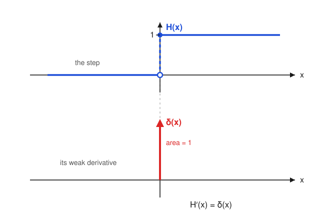

# Fourier & Harmonic Analysis · Lesson 3.2: Distributions and weak derivatives

> ⏱ ~15 min · Module 3: The Dirac delta and distributions · Builds on: [Lesson 3.1](03-01-dirac-delta-sifting.md) · Unlocks: [Lesson 3.3](03-03-fourier-transforms-distributions.md)

## Why this matters

Last lesson we used $\delta$ freely — but $\delta$ is not a function: no ordinary $f$ has $f(x)=0$ everywhere except one point yet integrates to $1$. So what *is* it, and why are we allowed to write $\int f(x)\delta(x-a)\,dx=f(a)$? The answer reorganizes all of analysis: stop asking what a thing *is* at each point, and ask instead what it *does* when you integrate it against a smooth probe. That single shift lets you differentiate a step function, assign $\delta$ a rigorous meaning, and — the payoff for us — give a Fourier transform to objects like $1$, $\cos$, and the Dirac comb that the classical integral chokes on. This is the machinery (Lesson 3.3) that finally makes the transform total.

## The idea

Think of how you actually measure a spiky or discontinuous object in the lab: you never read it at a single point, you average it against a smooth, well-behaved weight. A distribution is exactly that — **an object defined only by the weighted averages it produces**, not by pointwise values.

The smooth weights are called **test functions**. Feed a test function $\varphi$ in, get a number out. A nice function $f$ produces the number $\int f\varphi$ — its $\varphi$-weighted average. The delta produces the number $\varphi(0)$ — it reports the probe's value at the origin. Both are just "machines that eat a test function and return a number," and once you see them that way, $\delta$ stops being a mysterious infinite spike and becomes the most natural machine imaginable.

The magic trick is differentiation. We can't differentiate $\delta$ or a step directly, but we *can* push the derivative off the rough object and onto the smooth probe using integration by parts — and the probe can be differentiated forever. That borrowed derivative is the **weak derivative**, and it lets us differentiate things that have no classical derivative at all.

## The formal version

**Test functions.** Let $C_c^\infty(\mathbb{R})$ be the set of functions $\varphi:\mathbb{R}\to\mathbb{R}$ that are infinitely differentiable and **compactly supported** — meaning $\varphi(x)=0$ for all $x$ outside some bounded interval. Its support $\operatorname{supp}\varphi$ (the closure of where $\varphi\ne 0$) is bounded. These are our probes.

*In words:* a test function is as smooth as you like and switches off entirely far from the origin — so it and all its derivatives vanish at $\pm\infty$.

**Distribution.** A **distribution** $T$ is a continuous linear functional on test functions: a rule $\varphi\mapsto\langle T,\varphi\rangle\in\mathbb{R}$ that is linear ($\langle T,a\varphi+b\psi\rangle=a\langle T,\varphi\rangle+b\langle T,\psi\rangle$) and continuous (if $\varphi_n\to\varphi$ smoothly with supports in a common bounded set, then $\langle T,\varphi_n\rangle\to\langle T,\varphi\rangle$).

*In words:* a distribution is a machine that turns each smooth probe into a number, doing so linearly and without jumps.

**Every locally integrable function is a distribution.** If $f$ is integrable on every bounded interval, it acts by
$$\langle f,\varphi\rangle=\int_{-\infty}^{\infty} f(x)\,\varphi(x)\,dx.$$
The integral converges because $\varphi$ kills everything outside a bounded set. *In words:* ordinary functions are distributions in disguise — they act by integration against the probe. This is why distributions are called **generalized functions**: they extend, not replace, the functions you know.

**The delta.** The Dirac delta is the distribution
$$\langle \delta,\varphi\rangle=\varphi(0),\qquad\text{and more generally}\qquad \langle \delta_a,\varphi\rangle=\varphi(a).$$
*In words:* $\delta$ is the machine that hands back the probe's value at $0$. This is a perfectly legitimate distribution even though no function produces it — that is the whole point of enlarging our world.

**The weak derivative.** For a distribution $T$, define its derivative $T'$ by
$$\boxed{\;\langle T',\varphi\rangle=-\langle T,\varphi'\rangle\;}$$
*In words:* to differentiate the rough object, differentiate the smooth probe instead and flip the sign.

Where does the minus sign come from? Integration by parts. If $T$ came from a genuinely differentiable $f$, then
$$\langle f',\varphi\rangle=\int_{-\infty}^{\infty} f'(x)\varphi(x)\,dx=\underbrace{\big[f\varphi\big]_{-\infty}^{\infty}}_{=\,0}-\int_{-\infty}^{\infty} f(x)\varphi'(x)\,dx=-\langle f,\varphi'\rangle.$$
The boundary term vanishes **because $\varphi$ has compact support** — it is exactly $0$ far out. So the boxed formula is forced: it is the only definition that agrees with the classical derivative whenever the classical derivative exists. And since $\varphi$ is infinitely differentiable, we can repeat it: *every distribution has derivatives of every order.* Nothing is too rough to differentiate anymore.

## Picture

The Heaviside step $H$ has a jump but no classical slope at $0$. Its weak derivative is a delta spike sitting exactly at the jump — the entire "rate of change" of the step is concentrated at the instant it leaps.

## Worked examples

**Example 1 (the headline result: $H'=\delta$).** The Heaviside step is $H(x)=0$ for $x<0$ and $H(x)=1$ for $x>0$. Classically its derivative is $0$ wherever it's defined and undefined at the jump — useless. Weakly, test against any $\varphi\in C_c^\infty$:
$$\langle H',\varphi\rangle=-\langle H,\varphi'\rangle=-\int_{-\infty}^{\infty} H(x)\varphi'(x)\,dx=-\int_{0}^{\infty}\varphi'(x)\,dx.$$
Now use the fundamental theorem of calculus, and that $\varphi$ vanishes at $+\infty$:
$$-\int_{0}^{\infty}\varphi'(x)\,dx=-\big[\varphi(x)\big]_{0}^{\infty}=-\big(\underbrace{\varphi(\infty)}_{=\,0}-\varphi(0)\big)=\varphi(0)=\langle\delta,\varphi\rangle.$$
Since this holds for **every** test function, the two machines are identical:
$$H'=\delta.$$
The jump of size $1$ produced a delta of weight $1$ — precisely the picture above.

**Example 2 (differentiating the delta, and why you'd care).** Apply the boxed rule to $\delta$ itself:
$$\langle\delta',\varphi\rangle=-\langle\delta,\varphi'\rangle=-\varphi'(0).$$
*In words:* $\delta'$ is the machine that reports minus the slope of the probe at the origin. It has no pointwise meaning whatsoever, yet it is a bona fide distribution and appears all over physics — it is the idealized "dipole" (two opposite spikes an infinitesimal distance apart) and the model of a point torque on a beam. Watch the sign: it is $-\varphi'(0)$, not $+\varphi'(0)$. Iterating, $\langle\delta^{(k)},\varphi\rangle=(-1)^k\varphi^{(k)}(0)$ — each derivative flips the sign again.

## Watch out

- **You might think** a distribution has values $T(x)$ you could look up. **Actually** it only has actions $\langle T,\varphi\rangle$. "$\delta(3)=0$" is meaningless; the honest statement is $\langle\delta,\varphi\rangle=\varphi(0)$ for all probes. Two distributions are equal exactly when they act identically on every test function — that "for all $\varphi$" is how every identity in this lesson is proven.
- **You might think** the weak derivative is a different, weaker notion than the ordinary one. **Actually** it *extends* it: whenever $f$ is classically differentiable, its weak derivative is its classical derivative (that's what the boundary term vanishing buys you). "Weak" describes the test-function machinery, not a weaker conclusion.
- **You might drop the minus sign.** Don't. It is the fingerprint of integration by parts. Miss it and you'll get $H'=-\delta$ and every sign downstream in Lesson 3.3 will be wrong.
- **Compact support is load-bearing, not decoration.** It is the only reason the boundary term $[f\varphi]_{-\infty}^{\infty}$ is zero. Drop it and the definition of $T'$ leaks a boundary term and stops being well-defined.

## One-liner

> A distribution is defined by what it does to smooth probes, not by pointwise values — and you differentiate it by handing the derivative (with a minus sign) to the probe, so even a step function has a derivative: a delta at its jump.

## Problems

**P1 (🟢)** Let $r(x)=xH(x)$ be the **ramp** (equal to $x$ for $x\ge 0$ and $0$ for $x<0$). Using the weak-derivative definition and integration by parts, show that $r'=H$ in the distribution sense. (So the ramp's second weak derivative is $r''=H'=\delta$.)

**P2 (🟡)** Let $f(x)=e^{-x}H(x)$ — a decaying exponential "switched on" at $x=0$. Show that its weak derivative is
$$f'=-e^{-x}H(x)+\delta,$$
i.e. the classical derivative on $x>0$ *plus* a delta of weight equal to the jump at the origin. (This is why solving $y'+y=\delta$ gives the switched-on decay $e^{-x}H(x)$ — the Green's function of the bridge to `ode-refresher`.)

**P3 (🔴, optional)** Prove the **general jump rule**. Suppose $g$ is continuously differentiable on $(-\infty,a)$ and on $(a,\infty)$ with a jump discontinuity at $a$ of size $J=g(a^+)-g(a^-)$, and let $g'_{\mathrm{cl}}$ denote its ordinary derivative away from $a$. Show that the weak derivative is
$$g'=g'_{\mathrm{cl}}+J\,\delta_a.$$
(Example 1 is the case $g=H$, $a=0$, $J=1$, $g'_{\mathrm{cl}}=0$.)

Solutions

**P1** Test against $\varphi\in C_c^\infty$. Since $r(x)=x$ for $x\ge 0$ and $0$ otherwise,
$$\langle r',\varphi\rangle=-\langle r,\varphi'\rangle=-\int_{-\infty}^{\infty} r(x)\varphi'(x)\,dx=-\int_{0}^{\infty} x\,\varphi'(x)\,dx.$$
Integrate by parts with $u=x$, $dv=\varphi'\,dx$ (so $du=dx$, $v=\varphi$):
$$-\int_{0}^{\infty} x\varphi'\,dx=-\left(\big[x\varphi(x)\big]_{0}^{\infty}-\int_{0}^{\infty}\varphi(x)\,dx\right).$$
The boundary term vanishes: at $x=0$ the factor $x$ is $0$, and at $x=\infty$ the probe $\varphi$ is $0$ (compact support). Hence
$$\langle r',\varphi\rangle=\int_{0}^{\infty}\varphi(x)\,dx=\int_{-\infty}^{\infty} H(x)\varphi(x)\,dx=\langle H,\varphi\rangle.$$
True for all $\varphi$, so $r'=H$. Differentiating once more (Example 1) gives $r''=\delta$. $\blacksquare$

**P2** For all $\varphi$,
$$\langle f',\varphi\rangle=-\int_{-\infty}^{\infty} e^{-x}H(x)\,\varphi'(x)\,dx=-\int_{0}^{\infty} e^{-x}\varphi'(x)\,dx.$$
Integrate by parts with $u=e^{-x}$, $dv=\varphi'\,dx$ (so $du=-e^{-x}\,dx$, $v=\varphi$):
$$-\int_{0}^{\infty} e^{-x}\varphi'\,dx=-\left(\big[e^{-x}\varphi(x)\big]_{0}^{\infty}+\int_{0}^{\infty} e^{-x}\varphi(x)\,dx\right).$$
The boundary term is $\big[e^{-x}\varphi\big]_{0}^{\infty}=0-e^{0}\varphi(0)=-\varphi(0)$. Therefore
$$\langle f',\varphi\rangle=\varphi(0)-\int_{0}^{\infty} e^{-x}\varphi(x)\,dx=\langle\delta,\varphi\rangle-\big\langle e^{-x}H(x),\varphi\big\rangle=\big\langle \delta-e^{-x}H(x),\,\varphi\big\rangle.$$
Hence $f'=-e^{-x}H(x)+\delta$: the classical decay for $x>0$, plus a unit delta from the unit jump at $0$. $\blacksquare$

**P3** Split the integral at the jump and integrate by parts on each side. For any $\varphi$,
$$\langle g',\varphi\rangle=-\int_{-\infty}^{\infty} g\varphi'\,dx=-\int_{-\infty}^{a} g\varphi'\,dx-\int_{a}^{\infty} g\varphi'\,dx.$$
Left piece (boundary at $-\infty$ dies by compact support):
$$-\int_{-\infty}^{a} g\varphi'\,dx=-\Big(\big[g\varphi\big]_{-\infty}^{a^-}-\int_{-\infty}^{a} g'_{\mathrm{cl}}\varphi\,dx\Big)=-g(a^-)\varphi(a)+\int_{-\infty}^{a} g'_{\mathrm{cl}}\varphi\,dx.$$
Right piece (boundary at $+\infty$ dies):
$$-\int_{a}^{\infty} g\varphi'\,dx=-\Big(\big[g\varphi\big]_{a^+}^{\infty}-\int_{a}^{\infty} g'_{\mathrm{cl}}\varphi\,dx\Big)=g(a^+)\varphi(a)+\int_{a}^{\infty} g'_{\mathrm{cl}}\varphi\,dx.$$
Add them. The interior integrals recombine into $\int_{-\infty}^{\infty} g'_{\mathrm{cl}}\varphi\,dx=\langle g'_{\mathrm{cl}},\varphi\rangle$, and the boundary terms give
$$\big(g(a^+)-g(a^-)\big)\varphi(a)=J\,\varphi(a)=\langle J\,\delta_a,\varphi\rangle.$$
So $\langle g',\varphi\rangle=\langle g'_{\mathrm{cl}}+J\delta_a,\varphi\rangle$ for all $\varphi$, i.e. $g'=g'_{\mathrm{cl}}+J\delta_a$. Each jump contributes a delta scaled by the jump height, sitting at the jump. $\blacksquare$

## Flashback

**From [Lesson 3.1](03-01-dirac-delta-sifting.md) (sifting and scaling):** Evaluate
$$\int_{-\infty}^{\infty}\cos(x)\,\delta(3x-\pi)\,dx.$$

Solution

First normalize the argument. The scaling rule $\delta(ax-b)=\frac{1}{|a|}\,\delta\!\left(x-\tfrac{b}{a}\right)$ (a delta of unit total mass, rescaled by the stretch $|a|$) gives
$$\delta(3x-\pi)=\tfrac{1}{3}\,\delta\!\left(x-\tfrac{\pi}{3}\right).$$
Now sift at $x=\tfrac{\pi}{3}$:
$$\int_{-\infty}^{\infty}\cos(x)\cdot\tfrac{1}{3}\,\delta\!\left(x-\tfrac{\pi}{3}\right)dx=\tfrac{1}{3}\cos\!\left(\tfrac{\pi}{3}\right)=\tfrac{1}{3}\cdot\tfrac{1}{2}=\boxed{\tfrac{1}{6}}.$$
The two moving parts: the $\tfrac{1}{|a|}$ factor from *scaling*, then $\varphi$ evaluated at the root $b/a$ from *sifting*.

## Connections

- **Backward:** Lesson 3.1 introduced $\delta$ as a limit of narrowing bumps and its sifting property; here we gave it a rigorous identity — the functional $\varphi\mapsto\varphi(0)$ — and recovered sifting as its *definition* rather than a computed fact.
- **Forward:** [Lesson 3.3](03-03-fourier-transforms-distributions.md) transfers the same "push the operation onto the test function" trick to the Fourier transform, defining $\langle\hat T,\varphi\rangle=\langle T,\hat\varphi\rangle$. That is what lets us finally transform $1$, $\cos$, and the Dirac comb — the objects the classical integral of Module 2 cannot reach. Distributions are precisely what make the transform total.
- **Sideways (functional analysis):** a distribution is a *continuous linear functional* on the space of test functions — an element of its **dual space**. This is the working half of the duality machinery `functional-analysis` builds in full: test functions are the primal space, distributions are the dual, and the pairing $\langle T,\varphi\rangle$ is the duality bracket. Our weak derivative is the *adjoint* of $-\tfrac{d}{dx}$ acting on that dual.
- **Sideways (ODEs / PDEs):** the jump rule (P3) and the switched-on exponential (P2) are how `ode-refresher` Green's functions and `pdes` fundamental solutions get built — you solve a differential equation with a $\delta$ forcing, and the delta is exactly the derivative of a jump.
