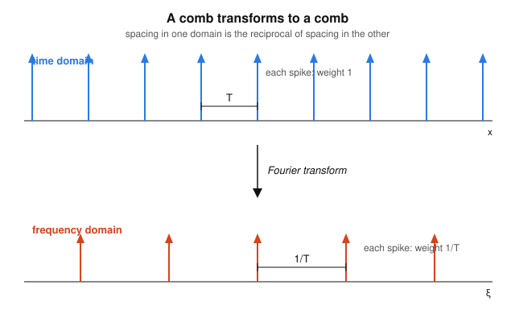

# Fourier & Harmonic Analysis · Lesson 3.3: Fourier transforms of distributions

> ⏱ ~15 min · Module 3: The Dirac delta and distributions · Builds on: [Lesson 3.2](03-02-distributions-weak-derivatives.md) (distributions, weak derivatives), [Lesson 2.2](02-02-properties-derivative-rule.md) (shift & modulation), [Lesson 2.3](02-03-convolution-theorem.md) (convolution theorem) · Unlocks: Module 4 — [Lesson 4.1](04-01-sampling-nyquist.md) (sampling & Nyquist)

## Why this matters

A pure tone — $\cos(2\pi\xi_0 x)$, a constant hum, a $60$ Hz whine — obviously has a spectrum: it's *one frequency*, a single spike on the dial. Yet the classical integral $\int_{-\infty}^{\infty}\cos(2\pi\xi_0 x)\,e^{-2\pi i x\xi}\,dx$ **diverges** — it doesn't decay, so there's nothing to integrate. The objects with the cleanest physical spectra are exactly the ones the Riemann integral can't touch.

Distribution theory fixes this by moving the transform onto a well-behaved test function, and the answer is exactly what physics demands: a spike transforms to a flat spectrum, a constant transforms to a spike, and a pure tone transforms to a pair of spectral lines. The capstone is the **Dirac comb**, whose transform is another comb — the single identity that turns "sample a signal in time" into "replicate its spectrum in frequency," which is the entire hinge of Module 4.

## The idea

In [Lesson 3.2](03-02-distributions-weak-derivatives.md) we learned the distributional trick: to define an operation on an object $T$ that's too rough to touch directly, push the operation onto a smooth test function $\varphi$ instead, using a formula that's *true for nice functions* as the definition for rough ones. Differentiation moved onto $\varphi$ with a minus sign (integration by parts). The Fourier transform moves onto $\varphi$ with **no sign change at all**.

The reason is a symmetry you can check in one line for ordinary functions. Writing $\langle f,g\rangle=\int f g$ (no conjugate — this is a bilinear pairing of a distribution against a real test function),

$$\int \hat f(\xi)\,\varphi(\xi)\,d\xi=\int\!\!\int f(x)e^{-2\pi i x\xi}\,dx\,\varphi(\xi)\,d\xi=\int f(x)\Big(\int\varphi(\xi)e^{-2\pi i x\xi}\,d\xi\Big)dx=\int f(x)\,\hat\varphi(x)\,dx.$$

Swap the order of integration and the exponential doesn't care which variable it's paired with. So $\langle\hat f,\varphi\rangle=\langle f,\hat\varphi\rangle$ — and *this* is the rule we promote to a definition. To find $\hat T$, hit the test function with the transform and let $T$ act on that.

## The formal version

**Tempered distributions (light).** For this to make sense we need $\hat\varphi$ to be a legal test function whenever $\varphi$ is. Compactly supported functions **fail** — a transform spreads support out to all of $\mathbb{R}$ — so we widen the test class to the **Schwartz functions** $\mathcal{S}$: smooth functions that, with all their derivatives, decay faster than any power of $x$ (think $e^{-\pi x^2}$). The Schwartz class is closed under the Fourier transform, so the definition below never leaves it. A **tempered distribution** is a continuous linear functional on $\mathcal{S}$ — a distribution that grows at most polynomially, so it can be paired with rapidly-decaying test functions.

*In words:* tempered distributions are exactly the rough objects tame enough to have a Fourier transform. $\delta$, constants, polynomials, $e^{2\pi i a x}$, and the comb all qualify; something exploding like $e^{x^2}$ does not.

**Definition (transform of a distribution).** For a tempered distribution $T$,
$$\boxed{\;\langle\hat T,\varphi\rangle=\langle T,\hat\varphi\rangle\quad\text{for every }\varphi\in\mathcal{S}.\;}$$

*In words:* the transform of $T$ is *defined* to be the thing that, tested against $\varphi$, gives the same number as $T$ tested against $\hat\varphi$. We never integrate $T$ itself — we always let the smooth $\hat\varphi$ absorb the transform.

Convention (fixed for the whole course): $\hat f(\xi)=\int_{-\infty}^{\infty}f(x)e^{-2\pi i x\xi}\,dx$, with inverse $f(x)=\int_{-\infty}^{\infty}\hat f(\xi)e^{2\pi i x\xi}\,d\xi$. (The angular-frequency convention $\int f(x)e^{-i\omega x}dx$ sprinkles factors of $2\pi$ through every formula below; ordinary frequency keeps them clean.)

**The two fundamental pairs.**

$$\hat\delta=1,\qquad\qquad \hat 1=\delta.$$

*Derivation of $\hat\delta=1$:* by definition and the sifting property (Lesson 3.1),
$$\langle\hat\delta,\varphi\rangle=\langle\delta,\hat\varphi\rangle=\hat\varphi(0)=\int\varphi(x)e^{-2\pi i x\cdot 0}\,dx=\int\varphi(x)\,dx=\langle 1,\varphi\rangle.$$
So pairing $\hat\delta$ against any $\varphi$ gives the same number as pairing the constant function $1$ against it: $\hat\delta=1$.

*Derivation of $\hat 1=\delta$:* similarly,
$$\langle\hat 1,\varphi\rangle=\langle 1,\hat\varphi\rangle=\int\hat\varphi(\xi)\,d\xi=\int\hat\varphi(\xi)e^{2\pi i\xi\cdot 0}\,d\xi=\varphi(0)=\langle\delta,\varphi\rangle,$$
where the middle step is *Fourier inversion evaluated at $0$*. So $\hat 1=\delta$.

*In words:* a spike contains every frequency in equal measure (flat spectrum); a constant "DC" signal is pure zero-frequency (all its weight at $\xi=0$). Each is the other's transform.

**The shifted spike.** Testing $\widehat{\delta(x-a)}$ against $\varphi$ gives $\langle\delta_a,\hat\varphi\rangle=\hat\varphi(a)=\int\varphi(x)e^{-2\pi i a x}dx$, so

$$\widehat{\delta(x-a)}=e^{-2\pi i a\xi}.$$

Its dual, from the modulation rule of [Lesson 2.2](02-02-properties-derivative-rule.md) applied to $f=1$ (whose transform is $\delta$):

$$\widehat{e^{2\pi i a x}}=\delta(\xi-a).$$

*In words:* shifting a spike in time multiplies its (flat) spectrum by a pure phase; modulating by a pure frequency $a$ shifts the spectrum to a spike sitting at $\xi=a$.

**Worked: the transform of a cosine.** Everything above assembles into the spectrum of a pure tone. Write the cosine with Euler's formula and transform term by term:
$$\cos(2\pi\xi_0 x)=\tfrac12\big(e^{2\pi i\xi_0 x}+e^{-2\pi i\xi_0 x}\big)$$
$$\widehat{\cos(2\pi\xi_0 x)}=\tfrac12\big(\widehat{e^{2\pi i\xi_0 x}}+\widehat{e^{-2\pi i\xi_0 x}}\big)=\boxed{\tfrac12\big[\delta(\xi-\xi_0)+\delta(\xi+\xi_0)\big]}.$$
Two spikes, half-weight each, at $\pm\xi_0$. The same move on $\sin(2\pi\xi_0 x)=\tfrac1{2i}(e^{2\pi i\xi_0 x}-e^{-2\pi i\xi_0 x})$ gives an **antisymmetric** pair:
$$\widehat{\sin(2\pi\xi_0 x)}=\tfrac{1}{2i}\big[\delta(\xi-\xi_0)-\delta(\xi+\xi_0)\big]=\tfrac{i}{2}\big[\delta(\xi+\xi_0)-\delta(\xi-\xi_0)\big].$$

*In words:* a pure tone is exactly two spectral lines — one at $+\xi_0$, one at $-\xi_0$. Cosine's lines are equal (even signal, real even spectrum); sine's are opposite (odd signal, imaginary odd spectrum). This is the spectrum analyzer's whole premise.

**The Dirac comb and its self-duality.** The comb is an infinite train of unit spikes spaced $T$ apart:
$$\operatorname{III}_T(x)=\sum_{n=-\infty}^{\infty}\delta(x-nT).$$
It is $T$-periodic, so it has a Fourier *series*: computing the one coefficient integral (only the spike at $0$ sits in a period) gives $\operatorname{III}_T(x)=\tfrac1T\sum_k e^{2\pi i k x/T}$. Transform each exponential with $\widehat{e^{2\pi i k x/T}}=\delta(\xi-k/T)$:

$$\boxed{\;\widehat{\operatorname{III}_T}=\tfrac1T\operatorname{III}_{1/T}=\tfrac1T\sum_{k=-\infty}^{\infty}\delta\!\big(\xi-\tfrac{k}{T}\big).\;}$$

*In words:* the transform of a comb is another comb, spaced by the **reciprocal** $1/T$ and scaled by $1/T$. (At $T=1$ it is literally its own transform.) This is Poisson summation in disguise, and the one-sentence meaning is the whole of Module 4: **periodic sampling in time (spacing $T$) forces periodic replication in frequency (spacing $1/T$).**

## Picture

Tight spacing in time means wide spacing in frequency, and vice versa — the reciprocal relation you'll cash out as the sampling theorem. Sample densely (small $T$) and the spectral replicas sit far apart (large $1/T$), leaving room before they overlap; sample coarsely and they crowd together and alias.

## Worked examples

**Example 1 (a DC offset plus a tone).** Find the spectrum of $f(x)=3+\cos(2\pi\xi_0 x)$.

Linearity of the transform plus the pairs above:
$$\hat f(\xi)=3\,\hat 1+\widehat{\cos(2\pi\xi_0 x)}=3\,\delta(\xi)+\tfrac12\delta(\xi-\xi_0)+\tfrac12\delta(\xi+\xi_0).$$
A tall spike at $\xi=0$ (the constant's zero-frequency content, weight $3$) and two half-weight spikes at $\pm\xi_0$. Reading a spectrum backwards: spikes at $0$ and $\pm\xi_0$ *are* the recipe of the signal.

**Example 2 (sampling replicates the spectrum — the reason we care).** Sampling a signal $f$ at spacing $T$ means multiplying it by the comb: $f_{\text{samp}}(x)=f(x)\operatorname{III}_T(x)$. Take its transform with the **convolution theorem** ([Lesson 2.3](02-03-convolution-theorem.md), a product becomes a convolution) and the comb identity:
$$\widehat{f\cdot\operatorname{III}_T}=\hat f*\widehat{\operatorname{III}_T}=\hat f*\tfrac1T\operatorname{III}_{1/T}=\tfrac1T\sum_{k}\hat f\!\big(\xi-\tfrac{k}{T}\big),$$
using that convolving with $\delta(\cdot-k/T)$ just shifts $\hat f$ by $k/T$ (Lesson 3.1). So sampling *copies the whole spectrum $\hat f$ and pastes it down at every multiple of $1/T$*. If $\hat f$ is wider than $1/T$ the copies overlap — that overlap is aliasing, and avoiding it is the Nyquist condition of [Lesson 4.1](04-01-sampling-nyquist.md).

## Watch out

- **$\hat\delta=1$ is the constant function, not the number $1$.** The transform of a distribution is another distribution, i.e. a function/object of $\xi$. "$\hat\delta=1$" means the spectrum is *flat at height one across all $\xi$* — a spike contains all frequencies equally. Don't read it as "$\delta$ transforms to the scalar $1$."
- **The $1/T$ in the comb identity is not decoration.** Dense sampling (small $T$) gives replicas that are far apart *and* tall (spacing and weight both $1/T$); coarse sampling gives crowded, short replicas. Drop the factor and both Poisson summation and the energy bookkeeping break.
- **Mind the sign in the modulation direction.** $e^{+2\pi i\xi_0 x}\mapsto\delta(\xi-\xi_0)$ (a *positive*-frequency spike at $+\xi_0$); $e^{-2\pi i\xi_0 x}\mapsto\delta(\xi+\xi_0)$. Swapping them flips the sine's spectrum by an overall sign — the difference between $+i/2$ and $-i/2$.

## One-liner

> On test functions the transform slides across for free ($\langle\hat T,\varphi\rangle=\langle T,\hat\varphi\rangle$), so a spike becomes flat, a constant becomes a spike, a tone becomes two lines, and a comb becomes a reciprocally-spaced comb — sampling in time is replication in frequency.

## Problems

**P1 (🟢)** Find the Fourier transform of $g(x)=4+\sin(2\pi\cdot 3\,x)$, expressed as a combination of shifted deltas. Which spike carries the constant, and where do the tone's lines sit?

**P2 (🟡)** Compute $\widehat{\delta(x-a)+\delta(x+a)}$ from the shifted-spike rule and simplify it to a single real function of $\xi$. Explain how your answer is the "mirror image" of the cosine result $\widehat{\cos(2\pi a x)}=\tfrac12[\delta(\xi-a)+\delta(\xi+a)]$ — i.e. state the duality you just witnessed.

**P3 (🔴, optional)** A signal is sampled at rate $2$ (spacing $T=\tfrac12$). (a) Write the sampling comb $\operatorname{III}_{1/2}$ and compute its Fourier transform explicitly, giving the spacing and weight of the resulting spikes. (b) Using the replication formula from Example 2, state the spectrum of the sampled signal $f\cdot\operatorname{III}_{1/2}$ and give the condition on the width of $\hat f$ under which the replicas do **not** overlap.

Solutions

**P1** By linearity, $\hat g=4\,\hat 1+\widehat{\sin(2\pi\cdot3 x)}$. Using $\hat 1=\delta$ and the sine pair with $\xi_0=3$,
$$\hat g(\xi)=4\,\delta(\xi)+\tfrac{1}{2i}\big[\delta(\xi-3)-\delta(\xi+3)\big]=4\,\delta(\xi)+\tfrac{i}{2}\big[\delta(\xi+3)-\delta(\xi-3)\big].$$
The constant $4$ lives entirely in the spike at $\xi=0$ (weight $4$). The tone's two lines sit at $\xi=\pm 3$, with opposite (imaginary) weights $\mp\tfrac{i}{2}$ — the antisymmetry marking an odd, real-valued signal.

**P2** By the shifted-spike rule $\widehat{\delta(x-a)}=e^{-2\pi i a\xi}$ and $\widehat{\delta(x+a)}=e^{+2\pi i a\xi}$, so
$$\widehat{\delta(x-a)+\delta(x+a)}=e^{-2\pi i a\xi}+e^{2\pi i a\xi}=2\cos(2\pi a\xi).$$
This is the mirror image of the cosine transform: there, a cosine *in time* transformed to a symmetric spike pair *in frequency*; here, a symmetric spike pair *in time* transforms to a cosine *in frequency*. That's Fourier duality — applying the transform twice returns the (reflected) original, so the (spike pair ↔ cosine) relation reads the same in both directions.

**P3** (a) With $T=\tfrac12$, $\operatorname{III}_{1/2}(x)=\sum_n\delta\!\big(x-\tfrac n2\big)$. By the comb identity $\widehat{\operatorname{III}_T}=\tfrac1T\operatorname{III}_{1/T}$ with $T=\tfrac12$, so $1/T=2$:
$$\widehat{\operatorname{III}_{1/2}}=2\,\operatorname{III}_{2}=2\sum_{k}\delta(\xi-2k).$$
Spikes spaced $2$ apart in frequency, each of weight $2$. (b) By the replication formula, $\widehat{f\cdot\operatorname{III}_{1/2}}=2\sum_k\hat f(\xi-2k)$: copies of $\hat f$ pasted at every even integer, scaled by $2$. The copies avoid overlap iff $\hat f$ is supported in a band narrower than the replica spacing — i.e. $\hat f(\xi)=0$ for $|\xi|\ge 1$ (total width $<2$). That "highest frequency below half the sample rate" is precisely the Nyquist condition of [Lesson 4.1](04-01-sampling-nyquist.md).

## Flashback

**From [Lesson 3.2](03-02-distributions-weak-derivatives.md) (weak derivatives):** Let $r(x)=x\,H(x)=\max(x,0)$ be the *ramp* function (zero for $x<0$, the line $y=x$ for $x\ge0$). It has a kink at the origin, so no classical derivative there. Show that its **distributional derivative** is the Heaviside step: $r'=H$.

Solution

By the definition of the weak derivative (move the derivative onto $\varphi$ with a minus sign), for any test function $\varphi$,
$$\langle r',\varphi\rangle=-\langle r,\varphi'\rangle=-\int_{-\infty}^{\infty}x\,H(x)\,\varphi'(x)\,dx=-\int_{0}^{\infty}x\,\varphi'(x)\,dx.$$
Integrate by parts, with $u=x$, $dv=\varphi'\,dx$:
$$-\int_{0}^{\infty}x\,\varphi'(x)\,dx=-\Big([x\,\varphi(x)]_{0}^{\infty}-\int_{0}^{\infty}\varphi(x)\,dx\Big).$$
The boundary term vanishes at both ends: at $x=0$ the factor $x$ is zero, and at $x=\infty$ the compactly supported $\varphi$ is zero. Hence
$$\langle r',\varphi\rangle=\int_{0}^{\infty}\varphi(x)\,dx=\int_{-\infty}^{\infty}H(x)\,\varphi(x)\,dx=\langle H,\varphi\rangle,$$
so $r'=H$ in the distributional sense. (Differentiate once more and you recover Lesson 3.2's headline: $r''=H'=\delta$ — the kink's curvature is a spike.)

## Connections

- **Backward:** this is [Lesson 3.2](03-02-distributions-weak-derivatives.md)'s "push the operation onto the test function" template applied to the Fourier transform — but with *no* sign flip, because the transform is symmetric under the bilinear pairing. It also reuses the sifting property from [Lesson 3.1](03-01-dirac-delta-sifting.md) and the shift/modulation rules from [Lesson 2.2](02-02-properties-derivative-rule.md).
- **Forward:** the comb identity and Example 2's replication formula are the engine of [Lesson 4.1](04-01-sampling-nyquist.md) (sampling and Nyquist) and feed directly into the DFT of [Lesson 4.2](04-02-dft-fft.md), where the finite comb becomes the roots of unity.
- **Sideways (signals & systems):** "a pure tone is two spectral lines" and "sampling replicates the spectrum" are the founding facts of the future signals-systems track — every spectrum analyzer and every A/D converter runs on exactly these two results.
- **Sideways (quantum mechanics):** the plane wave $e^{2\pi i a x}$ having a single sharp spike $\delta(\xi-a)$ as its transform is the extreme case of the uncertainty principle from [Lesson 2.4](02-04-plancherel-uncertainty.md) — a perfectly definite momentum (one frequency) is completely delocalized in position, the setting for the momentum eigenstates in [quantum-mechanics](../../quantum-mechanics/syllabus.md).
