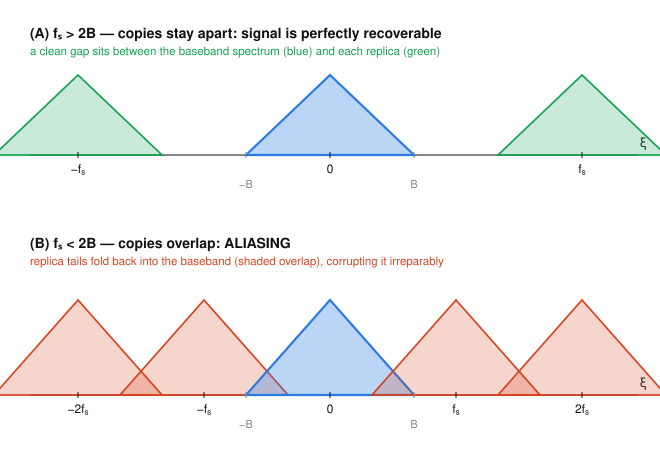

# Fourier & Harmonic Analysis · Lesson 4.1: Sampling and the Nyquist theorem

> ⏱ ~15 min · Module 4: Sampling, the DFT, and applications · Builds on: [Lesson 3.3](03-03-fourier-transforms-distributions.md) (the Dirac comb and its self-duality) · Unlocks: [Lesson 4.2](04-02-dft-fft.md) (the DFT and the FFT)

## Why this matters

Every digital recording — the audio on your phone, an MRI slice, a stock tick feed — is a continuous signal that has been *sampled*: measured only at evenly spaced instants. The miracle that makes this work is that a continuous signal can be reconstructed *exactly* from its samples, with nothing lost, provided you sample fast enough. The Nyquist–Shannon theorem tells you exactly how fast "fast enough" is, and the ugly failure mode when you don't — **aliasing**, the reason wagon wheels spin backward in old films and a 20 kHz whine can sneak into a recording as an audible tone. This is the entire foundation of the future [signals-systems](../../signals-systems/syllabus.md) course, and it is nothing more than the Dirac comb's self-duality from [Lesson 3.3](03-03-fourier-transforms-distributions.md) read as an engineering law.

## The idea

Sampling looks like it throws away almost everything — you keep a handful of dots and discard the whole curve between them. But if the signal is **band-limited** — built only from frequencies below some ceiling $B$ — then it can't wiggle arbitrarily fast between samples. A gentle curve is pinned down by dots that are close enough together; only a curve with high-frequency content could sneak an extra wiggle in between them undetected.

Here is the whole story in one picture. In [Lesson 3.3](03-03-fourier-transforms-distributions.md) we saw that sampling a signal is *multiplying it by a Dirac comb* in time, and that multiplying by a comb in time **convolves** the spectrum with a comb in frequency. Convolving with a comb just makes copies: the signal's spectrum gets **replicated**, one copy centered at every multiple of the sampling rate $f_s$.

- Sample **fast** ($f_s > 2B$): the copies land far apart with clean gaps between them. The original spectrum sits untouched in the middle — snip it out with a filter and you've recovered the signal perfectly.
- Sample **slow** ($f_s < 2B$): the copies are packed too close and their tails overlap. High frequencies from one copy pile onto low frequencies of the next. That corruption is **aliasing**, and once the copies have merged there is no filter on earth that can separate them again.

The crossover is $f_s = 2B$. That's the Nyquist rate: sample at more than twice the highest frequency present.

## The formal version

Throughout, the Fourier transform is the ordinary-frequency convention $\hat f(\xi)=\int_{-\infty}^{\infty} f(x)\,e^{-2\pi i x\xi}\,dx$, so $\xi$ is a genuine frequency in Hz (cycles per unit time). We sample at spacing $T_s$, giving sampling rate $f_s = 1/T_s$ samples per second.

**Definition (band-limited).** A signal $f$ is **band-limited to $B$** if $\hat f(\xi)=0$ for all $|\xi|>B$. The number $B$ is the **bandwidth**.

*In words:* the signal is a superposition of pure waves none of which oscillates faster than $B$ Hz — its spectrum lives entirely on $[-B,B]$.

**Sampling as multiplication by a comb.** Reading off $f$ at the instants $t=nT_s$ is the same as multiplying by the Dirac comb $\operatorname{III}_{T_s}(t)=\sum_{n=-\infty}^{\infty}\delta(t-nT_s)$:
$$f_{\text{samp}}(t)=f(t)\sum_{n}\delta(t-nT_s)=\sum_{n}f(nT_s)\,\delta(t-nT_s).$$
From [Lesson 3.3](03-03-fourier-transforms-distributions.md), the comb is (almost) its own transform: $\widehat{\operatorname{III}_{T_s}}(\xi)=\frac{1}{T_s}\sum_{k}\delta\!\left(\xi-\tfrac{k}{T_s}\right)=f_s\sum_{k}\delta(\xi-kf_s)$. Multiplication in time is convolution in frequency, and convolving with a shifted delta just shifts, so the sampled spectrum is a sum of **replicas**:
$$\boxed{\;\widehat{f_{\text{samp}}}(\xi)=f_s\sum_{k=-\infty}^{\infty}\hat f(\xi-kf_s).\;}$$

*In words:* sampling in time photocopies the spectrum, dropping one copy centered at every multiple of the sampling rate $f_s$ (and scaling all copies by $f_s$).

**Nyquist–Shannon sampling theorem.** If $f$ is band-limited to $B$ and $f_s>2B$, then $f$ is *completely determined* by its samples $\{f(nT_s)\}$, and is recovered by the **sinc interpolation** formula
$$f(t)=\sum_{n=-\infty}^{\infty} f(nT_s)\,\operatorname{sinc}\!\left(\frac{t-nT_s}{T_s}\right),\qquad \operatorname{sinc}(x)=\frac{\sin(\pi x)}{\pi x}.$$
The threshold rate $2B$ is the **Nyquist rate**; the highest frequency a rate $f_s$ can honestly represent, $f_s/2$, is the **Nyquist frequency**.

*In words:* sample faster than twice the top frequency and nothing is lost — you can rebuild the entire continuous curve from the dots by centering a sinc bump on each sample and adding them up.

**Why sinc.** When $f_s>2B$ the copies don't overlap, so the baseband copy ($k=0$) is exactly $\hat f$, isolated on $[-B,B]$. Multiply $\widehat{f_{\text{samp}}}$ by an **ideal low-pass filter** — the box that is $1/f_s$ on $[-f_s/2,f_s/2]$ and $0$ outside — and you keep only the original $\hat f$. But the inverse transform of a frequency box is exactly a sinc (Lesson 2.1, box $\leftrightarrow$ sinc), and multiplying by a box in frequency is convolving with that sinc in time. Convolving the spike train $\sum_n f(nT_s)\delta(t-nT_s)$ with a sinc drops a sinc on each spike — precisely the interpolation formula above.

**Aliasing.** If instead $f_s<2B$, the copies overlap. A pure tone at frequency $f_0$ (a spectral spike at $\pm f_0$) is replicated to $\pm f_0+kf_s$ for every integer $k$; the replica that falls into the baseband $[-f_s/2,\,f_s/2]$ is the frequency the samples *appear* to carry. That **aliased frequency** is
$$f_{\text{alias}}=\bigl|\,f_0-k f_s\,\bigr|\quad\text{for the integer }k\text{ making }|f_0-kf_s|\le \tfrac{f_s}{2}.$$

*In words:* undersample a tone and it disguises itself as a lower tone — the true frequency "folds" down into the representable band around the nearest multiple of $f_s$.

## Picture

The spectrum here is a triangle on $[-B,B]$ (any band-limited shape works). **Top ($f_s>2B$):** replicas sit in their own lanes with a clean gap $[B,\,f_s-B]$ between each pair — a low-pass filter cleanly extracts the blue baseband copy. **Bottom ($f_s<2B$):** the replicas march too close, their sloping tails cross into the baseband (the shaded overlap), and the blue original is now inseparably contaminated by its neighbors. The gap slams shut exactly when $f_s-B=B$, i.e. at $f_s=2B$.

## Worked examples

**Example 1 (find the Nyquist rate).** Telephone speech is band-limited to $B=4$ kHz. The Nyquist rate is
$$2B = 2\times 4\text{ kHz} = 8\text{ kHz},$$
so any $f_s>8$ kHz reconstructs the speech perfectly, and the maximum sampling *interval* is $T_s < 1/8000\text{ s} = 125\ \mu\text{s}$. (Real telephony samples at $8$ kHz and pre-filters to just under $4$ kHz so the strict inequality holds — the source of that characteristic "thin" phone sound.)

**Example 2 (compute an aliased frequency).** A signal is band-limited to $B=4$ kHz, but we carelessly sample it at only $f_s=6$ kHz — below the $8$ kHz Nyquist rate, so aliasing is guaranteed. Where does a tone at $f_0=5$ kHz land?

The Nyquist frequency is $f_s/2=3$ kHz, so the true $5$ kHz cannot be represented; it must fold. Test integers $k$:
$$k=1:\quad |f_0-kf_s|=|5-6|=1\text{ kHz}\le 3\text{ kHz}. \checkmark$$
So the $5$ kHz tone **masquerades as a $1$ kHz tone** in the samples. To the reconstructor it is genuinely indistinguishable from a real $1$ kHz signal — that is the danger: aliasing doesn't add noise you can hear as noise, it adds a *plausible wrong signal*. The fix is never a better reconstructor; it's an **anti-aliasing filter** that removes everything above $f_s/2=3$ kHz *before* sampling, so the $5$ kHz tone never reaches the sampler.

## Watch out

- **Nyquist rate vs. Nyquist frequency.** The **rate** $2B$ is a *sampling* speed (how fast you must sample). The **frequency** $f_s/2$ is a *signal* frequency (the highest tone a given $f_s$ can carry). They coincide only at the exact threshold. Say "sample above the Nyquist rate," not "above the Nyquist frequency."
- **The boundary $f_s=2B$ is treacherous, not safe.** Exactly at $f_s=2B$ the copies touch edge-to-edge; a tone sitting precisely at $B$ lands right on top of its own replica and cannot be recovered. The theorem needs the *strict* inequality $f_s>2B$. In practice you leave a guard band and sample noticeably above $2B$.
- **Aliasing is irreversible, and no post-processing undoes it.** Once two frequencies have summed into the same sample values the information is gone. You might think a clever filter after sampling could separate them — it can't. Anti-aliasing must happen *before* the sampler.
- **Band-limited is an idealization.** A truly band-limited signal has infinite duration (sharp spectral edges force infinitely long tails). Real finite signals are never perfectly band-limited, so a little aliasing is always present; the game is to push it below the noise floor.

## One-liner

> Sampling photocopies the spectrum at every multiple of $f_s$; keep the copies from overlapping ($f_s>2B$) and a sinc-sum rebuilds the signal exactly — let them overlap and high tones fold down into low impostors forever.

## Problems

**P1 (🟢)** A music signal is band-limited to $B=20$ kHz (the top of human hearing). (a) What is the Nyquist rate? (b) The CD standard samples at $f_s=44.1$ kHz — is that enough, and what is the Nyquist frequency it provides? (c) What is the largest sampling interval $T_s$ that still avoids aliasing?

**P2 (🟡)** A tone at $f_0=7$ kHz is sampled at $f_s=5$ kHz. (a) Derive the aliased frequency it appears as. (b) Find *another* positive input frequency below $10$ kHz that aliases to the same apparent frequency, and state in one sentence why this is exactly why an anti-aliasing filter is mandatory.

**P3 (🔴, optional)** Show that the sinc reconstruction formula genuinely passes through the samples: prove that
$$g(t)=\sum_{n} f(nT_s)\,\operatorname{sinc}\!\left(\frac{t-nT_s}{T_s}\right)$$
satisfies $g(mT_s)=f(mT_s)$ for every integer $m$. Then explain in one sentence what extra ingredient (beyond passing through the dots) the Nyquist condition $f_s>2B$ supplies — i.e. why merely interpolating the samples isn't automatically the *right* curve.

Solutions

**P1** (a) Nyquist rate $=2B=2\times 20\text{ kHz}=40$ kHz. (b) Yes: $44.1\text{ kHz}>40\text{ kHz}$, so it clears the Nyquist rate with a little guard band to spare. Its Nyquist frequency is $f_s/2=22.05$ kHz, comfortably above the $20$ kHz ceiling of hearing. (c) The interval must satisfy $T_s=1/f_s<1/(2B)=1/40000\text{ s}=25\ \mu\text{s}$. (The CD's actual interval is $1/44100\approx 22.7\ \mu\text{s}<25\ \mu\text{s}$. ✓)

**P2** (a) Nyquist frequency $f_s/2=2.5$ kHz, so $7$ kHz must fold. Test $k$:
$$k=1:\ |7-5|=2\text{ kHz}\le 2.5\text{ kHz}.\ \checkmark$$
The tone appears at $f_{\text{alias}}=2$ kHz. (Check $k=2$: $|7-10|=3>2.5$, rejected; $k=1$ is the one landing in baseband.)

(b) Any input frequency of the form $|f\pm k\cdot 5|=2$ aliases to $2$ kHz. Solving for positive $f<10$ kHz: $f=2$ (the honest one), $f=|{-2}+5|=3$, $f=2+5=7$, $f=|{-2}+10|=8$. So $3$ kHz, $7$ kHz, and $8$ kHz all collapse onto the same apparent $2$ kHz. Because a whole ladder of true frequencies produces *identical* samples, the sampler alone cannot tell them apart — the only cure is to strip everything above $f_s/2=2.5$ kHz **before** sampling, leaving at most one survivor per alias class.

**P3** Evaluate $g$ at a sample instant $t=mT_s$. Inside each term the sinc argument becomes
$$\frac{mT_s-nT_s}{T_s}=m-n,$$
an integer. Now use the defining property of the normalized sinc: $\operatorname{sinc}(0)=1$ and $\operatorname{sinc}(j)=\dfrac{\sin(\pi j)}{\pi j}=0$ for every *nonzero* integer $j$ (the numerator $\sin(\pi j)=0$). Hence $\operatorname{sinc}(m-n)=\delta_{mn}$ (the Kronecker delta: $1$ if $n=m$, else $0$), and the sum collapses to its single surviving term:
$$g(mT_s)=\sum_{n} f(nT_s)\,\delta_{mn}=f(mT_s).\ \blacksquare$$
So the sinc series interpolates the samples for *any* signal. The extra ingredient from $f_s>2B$ is band-limiting: infinitely many different curves pass through the same dots, but **exactly one** of them is band-limited to $B<f_s/2$, and the sinc sum is engineered (via the ideal low-pass filter in frequency) to produce that one. Undersample, and the "one band-limited curve through the dots" is the *aliased* impostor, not the original — the interpolation still works, it just reconstructs the wrong signal.

## Flashback

**From [Lesson 3.3](03-03-fourier-transforms-distributions.md) (Fourier transforms of distributions):** Working in the distribution sense, compute the Fourier transform of $f(x)=\sin(2\pi\cdot 3\,x)$ under the convention $\hat f(\xi)=\int f(x)e^{-2\pi i x\xi}dx$. Express the answer as a pair of Dirac deltas.

Solution

Write the sine in complex exponentials: $\sin(2\pi\cdot 3\,x)=\dfrac{e^{2\pi i(3)x}-e^{-2\pi i(3)x}}{2i}$. The transform of a pure exponential is a shifted delta, $\widehat{e^{2\pi i a x}}(\xi)=\delta(\xi-a)$ (this is $\hat 1=\delta$ from Lesson 3.3 shifted by the modulation rule). By linearity,
$$\hat f(\xi)=\frac{1}{2i}\bigl[\delta(\xi-3)-\delta(\xi+3)\bigr]=\frac{i}{2}\bigl[\delta(\xi+3)-\delta(\xi-3)\bigr].$$
Two spikes at $\xi=\pm 3$ Hz, with opposite signs and a factor of $i$ — the phase signature that distinguishes a sine from a cosine (whose transform $\tfrac12[\delta(\xi-3)+\delta(\xi+3)]$ is real and even). This "a single tone is a delta pair in frequency" fact is exactly what Example 2 leaned on: sampling replicates those spikes to $\pm 3+kf_s$, and whichever lands in the baseband is what you hear — the bridge straight into the future [signals-systems](../../signals-systems/syllabus.md) course, where every real-time spectrum analyzer is this picture made continuous.

## Connections

- **Backward:** this lesson is [Lesson 3.3](03-03-fourier-transforms-distributions.md)'s Dirac-comb self-duality cashed out — "periodic sampling in time forces periodic replication in frequency" is literally the sampling theorem. The reconstruction filter is the box $\leftrightarrow$ sinc pair from [Lesson 2.1](02-01-series-to-fourier-transform.md), and the multiply-in-time / convolve-in-frequency step is the convolution theorem of [Lesson 2.3](02-03-convolution-theorem.md).
- **Forward:** [Lesson 4.2](04-02-dft-fft.md) makes this fully discrete — once a band-limited signal is captured by finitely many samples, the DFT is the finite Fourier transform of those samples, and spectral leakage is the finite-window cousin of aliasing.
- **Sideways (signals & systems):** the anti-aliasing filter, the Nyquist rate, and sinc reconstruction are the founding trio of digital signal processing — the entire future [signals-systems](../../signals-systems/syllabus.md) course (Module 4) is built on this lesson. The wagon-wheel effect and the strobe illusion are aliasing in the wild.
