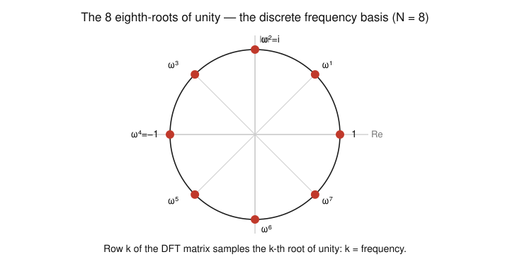
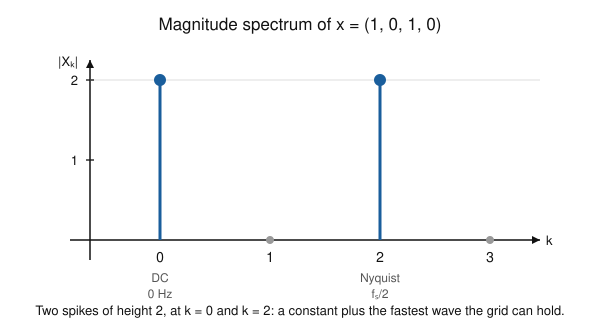

# Fourier & Harmonic Analysis · Lesson 4.2: The DFT and a taste of the FFT

> ⏱ ~15 min · Module 4: Sampling, the DFT, and applications · Builds on: [Lesson 4.1](04-01-sampling-nyquist.md) · Unlocks: [Lesson 4.3](04-03-heat-wave-equations.md)

## Why this matters

Everything so far has been a transform of a *function* — an integral over a continuum. But a computer never sees a function; it sees a finite list of samples $x_0,\dots,x_{N-1}$, the numbers Lesson 4.1 handed us. The **discrete Fourier transform (DFT)** is the honest Fourier analysis of that list: finitely many samples in, finitely many frequency amplitudes out, no integral in sight. It is what a spectrum analyzer, an MP3 encoder, and a radio-astronomy pipeline actually run — because the **FFT**, a clever way of computing the exact same DFT, turned an $O(N^2)$ chore into an $O(N\log N)$ one and made real-time spectral analysis possible. This lesson is how the continuous theory lands on real hardware.

## The idea

Take $N$ equally spaced samples of a signal, one period's worth. Ask the same question we've asked all course: *how much of each pure wave is in here?* But now there are only finitely many pure waves the samples can even distinguish — a grid of $N$ points can't tell apart a wave and a faster wave that happens to agree at all $N$ points (that was aliasing, Lesson 4.1). So there are exactly $N$ distinguishable frequencies, and the DFT reports the amplitude of each.

Those $N$ special frequencies are the **$N$-th roots of unity**: the $N$ points equally spaced around the unit circle. Wave number $k$ is the complex exponential that steps around the circle $k$ notches per sample. The DFT just measures the overlap of your data with each of these $N$ waves — a dot product, done $N$ times. That's it. The FFT is the observation that these $N$ dot products share enormous amounts of arithmetic, so you should never compute them independently.

## The formal version

Given samples $x_0,x_1,\dots,x_{N-1}$ (real or complex), the **DFT** is the length-$N$ sequence

$$X_k=\sum_{n=0}^{N-1}x_n\,e^{-2\pi i kn/N},\qquad k=0,1,\dots,N-1.$$

*In words:* $X_k$ is how much the wave that completes $k$ full turns over the $N$ samples is present in the data — the discrete analogue of a Fourier coefficient.

Write $\omega_N=e^{-2\pi i/N}$, the fundamental **$N$-th root of unity** (rotate clockwise by one $N$-th of a turn). Then $e^{-2\pi i kn/N}=\omega_N^{kn}$, and the DFT is a matrix–vector product $X=Fx$ with the **DFT matrix**

$$F_{kn}=\omega_N^{kn},\qquad F=\begin{pmatrix}\omega_N^{0}&\omega_N^{0}&\cdots\\ \omega_N^{0}&\omega_N^{1}&\cdots\\ \vdots& &\ddots\end{pmatrix}.$$

*In words:* row $k$ of $F$ is the pure wave $\omega_N^{kn}$ sampled at $n=0,\dots,N-1$; multiplying by $F$ dots your data against every one of these waves at once.

These rows are **orthogonal**. Using the finite geometric series, for integers $k,l$,

$$\sum_{n=0}^{N-1}\omega_N^{(k-l)n}=\begin{cases}N,&k\equiv l\!\!\pmod N,\\[2pt]0,&\text{otherwise},\end{cases}$$

because a non-trivial sum of all $N$ roots of unity is zero (they balance around the circle). So the $N$ sampled exponentials form an orthogonal basis of $\mathbb{C}^N$ — the discrete mirror of the orthogonal trig system from [Lesson 1.2](01-02-orthogonal-systems-projection.md). Orthogonality gives the **inverse DFT** for free:

$$x_n=\frac1N\sum_{k=0}^{N-1}X_k\,e^{+2\pi i kn/N}.$$

*In words:* rebuild the samples by adding the waves back up, each weighted by its amplitude — same sign flip and $1/N$ normalization you'd guess from the continuous inverse transform.

**Reading a spectrum.** Each $X_k$ is complex: its **magnitude** $|X_k|$ is how much of that frequency is present, its **phase** $\arg X_k$ is where that wave starts. Plotting $|X_k|$ versus $k$ is the *magnitude spectrum*; plotting $\arg X_k$ is the *phase spectrum*. If the samples came at rate $f_s$ (samples per second), bin $k$ sits at physical frequency

$$f_k=\frac{k}{N}\,f_s,\qquad k=0,\dots,\tfrac N2,$$

so bin $0$ is DC (the average), bin $N/2$ is the Nyquist frequency $f_s/2$, and bins above $N/2$ are the negative frequencies (for real data, $X_{N-k}=\overline{X_k}$ — the spectrum is conjugate-symmetric).

## Picture

Row $k$ of the DFT matrix marches around this circle in steps of $\omega_N^k$. Low $k$ crawls (slow wave); $k=N/2$ jumps halfway each step (the fastest wave, alternating $+1,-1$); higher $k$ wraps back around as the negative frequencies.

## Worked examples

**Example 1 (the 4-point DFT of $(1,0,1,0)$).** Here $N=4$, $\omega_4=e^{-2\pi i/4}=e^{-i\pi/2}=-i$. Only $x_0=1$ and $x_2=1$ are nonzero, so

$$X_k=x_0\,\omega_4^{0}+x_2\,\omega_4^{2k}=1+\omega_4^{2k}=1+e^{-i\pi k}=1+(-1)^k.$$

Bin by bin: $X_0=2,\ X_1=0,\ X_2=2,\ X_3=0$, i.e. $X=(2,0,2,0)$.

*Interpretation.* Energy sits only in bin $0$ (DC) and bin $2$ (the Nyquist frequency, $k=N/2$). That's exactly right: the sequence $1,0,1,0$ is a constant $\tfrac12$ plus a half-amplitude copy of the fastest wave $1,-1,1,-1$, and nothing else. Check with the inverse: $x_n=\tfrac14\big(2\cdot1+2\cdot e^{i\pi n}\big)=\tfrac12\big(1+(-1)^n\big)$, which is $1,0,1,0$. ✓

**Example 2 (why phase matters — one period of a sine).** Sample $\sin(2\pi n/4)$ over one period: $x=(0,1,0,-1)$. Now $x_1=1,x_3=-1$, so

$$X_k=\omega_4^{k}-\omega_4^{3k}=e^{-i\pi k/2}-e^{-i3\pi k/2}.$$

Evaluating: $X_0=0,\ X_1=-2i,\ X_2=0,\ X_3=+2i$, i.e. $X=(0,-2i,0,2i)$. The magnitude spectrum $|X|=(0,2,0,2)$ shows one frequency (bin $1$, and its conjugate partner bin $3=N-1$). But the *phase* is $\mp90^\circ$, purely imaginary — that is precisely what distinguishes a sine from a cosine at the same frequency (a cosine would have given real, positive bins). Same magnitude spectrum, different phase: the magnitude says *which* wave, the phase says *when* it peaks. If this sine's period had **not** divided $N$ evenly, its energy would have smeared across every bin — **spectral leakage** (see Watch out).

## The FFT idea (divide and conquer)

Computing $X=Fx$ directly is $N$ dot products of length $N$: about $N^2$ complex multiplications. For $N=10^6$ that's $10^{12}$ — hopeless. The **Fast Fourier Transform** exploits a symmetry. Split the samples into **even** and **odd** indices:

$$X_k=\underbrace{\sum_{m=0}^{N/2-1}x_{2m}\,\omega_N^{k(2m)}}_{\text{even samples}}+\omega_N^{k}\underbrace{\sum_{m=0}^{N/2-1}x_{2m+1}\,\omega_N^{k(2m)}}_{\text{odd samples}}.$$

The key: $\omega_N^{k(2m)}=e^{-2\pi i k(2m)/N}=e^{-2\pi i km/(N/2)}=\omega_{N/2}^{km}$. So each half is itself a **half-size DFT** — call them $E_k$ (evens) and $O_k$ (odds), each of length $N/2$. Then

$$X_k=E_k+\omega_N^k\,O_k,\qquad X_{k+N/2}=E_k-\omega_N^k\,O_k,$$

the second line because $\omega_N^{k+N/2}=-\omega_N^k$. So **one** pair of half-size DFTs produces *two* output bins at once (a "butterfly"). Recurse: solving size $N$ costs two size-$N/2$ solves plus $O(N)$ combining,

$$T(N)=2\,T(N/2)+O(N)\ \Longrightarrow\ T(N)=O(N\log N).$$

*In words:* because the even and odd sub-problems are reused for the top and bottom halves of the output, you halve the work at every level and pay only $\log_2 N$ levels — $N\log N$ instead of $N^2$. For $N=1024$: about $10^4$ operations instead of $10^6$, a hundredfold win that grows with $N$.

## Watch out

- **You might think** a high bin index means a high frequency — **but** bins past $N/2$ are the *negative* frequencies. For real data bin $N-k$ is the conjugate of bin $k$; the honest frequency axis runs $0,f_s/N,\dots,f_s/2$ and then folds back. Don't report a "signal" at bin $N-1$; it's the mirror of bin $1$.
- **You might think** a single sinusoid always shows up as one clean spike — **but** only if its frequency is an exact integer multiple of $f_s/N$ (a whole number of periods fits the window). Otherwise its energy **leaks** across neighboring bins. Multiplying the samples by a tapering **window** (Hann, Hamming) before the DFT softens the window edges and suppresses the leakage sidelobes — at the cost of slightly blurrier bins.
- **You might think** the FFT computes something *different* from the DFT, an approximation — **but** it returns the exact same $X_k$, bit for bit (up to roundoff). "FFT" is an *algorithm* for the DFT, not another transform.

## One-liner

> The DFT dots your $N$ samples against the $N$ roots of unity; the FFT just refuses to do the shared arithmetic twice, buying $N\log N$ from $N^2$.

## Problems

**P1 (🟢)** Compute the 4-point DFT of $x=(1,-1,1,-1)$ from the definition. Which bin carries all the energy, and why does that match what the sequence "looks like"?

**P2 (🟡)** (a) Roughly how many complex multiplications does the *direct* 8-point DFT need, versus a radix-2 FFT (use the estimate $\tfrac N2\log_2 N$)? (b) Write $X_k$ for an 8-point DFT in terms of the two 4-point DFTs $E_k,O_k$ of the even- and odd-indexed samples, and give the twiddle factor $\omega_8^k$ explicitly for $k=1$.

**P3 (🔴, optional)** A signal is sampled at $f_s=16$ Hz and you take $N=16$ samples. (a) What physical frequency does bin $k=3$ correspond to, and which *other* bin carries its conjugate mirror? (b) A pure $3.0$ Hz cosine gives two clean spikes; a $3.4$ Hz cosine smears across many bins. Explain in one sentence why, in terms of the bin spacing $f_s/N$.

Solutions

**P1** With $N=4$, $\omega_4=-i$ and $X_k=\sum_{n}x_n\omega_4^{kn}=1-\omega_4^{k}+\omega_4^{2k}-\omega_4^{3k}$.

- $k=0$: $1-1+1-1=0$.
- $k=1$: $1-(-i)+(-1)-(i)=1+i-1-i=0$.
- $k=2$: $1-(-1)+1-(-1)=1+1+1+1=4$.
- $k=3$: $1-(i)+(-1)-(-i)=1-i-1+i=0$.

So $X=(0,0,4,0)$: **all energy in bin $k=2$**, the Nyquist bin $k=N/2$. That's exactly right — $(1,-1,1,-1)$ *is* the fastest wave the 4-point grid can represent (it flips sign every sample), so it is pure Nyquist frequency and nothing else.

**P2** (a) Direct: $N^2=8^2=64$ complex multiplications. FFT: $\tfrac N2\log_2 N=\tfrac82\cdot 3=12$. Already a $5\times$ win at the tiny size $N=8$; the gap widens fast with $N$.

(b) Splitting even/odd indices,
$$X_k=E_k+\omega_8^{k}\,O_k\quad(k=0,1,2,3),\qquad X_{k+4}=E_k-\omega_8^{k}\,O_k,$$
where $E_k,O_k$ are the 4-point DFTs of $(x_0,x_2,x_4,x_6)$ and $(x_1,x_3,x_5,x_7)$. The twiddle at $k=1$ is $\omega_8^{1}=e^{-2\pi i/8}=e^{-i\pi/4}=\tfrac{\sqrt2}{2}(1-i)$.

**P3** (a) Bin spacing is $f_s/N=16/16=1$ Hz, so bin $k$ sits at $k$ Hz. Bin $3$ is the **$3$ Hz** component. Its conjugate mirror is bin $N-k=16-3=13$.

(b) A cosine shows a clean pair of spikes only when a whole number of its periods fits the $N$ samples, i.e. when its frequency is an integer multiple of the bin spacing $f_s/N=1$ Hz. $3.0$ Hz is exactly bin $3$; $3.4$ Hz falls *between* bins $3$ and $4$, so no single basis wave matches it and its energy leaks across all of them (spectral leakage), which a window function would tame.

## Flashback

**From [Lesson 4.1](04-01-sampling-nyquist.md) (Sampling and Nyquist):** A pure tone at $f_0=90$ Hz is sampled at $f_s=100$ Hz. (a) What is the Nyquist frequency, and is this signal properly sampled? (b) If not, what apparent (aliased) frequency will appear in the sampled data?

Solution

(a) The Nyquist frequency is $f_s/2=50$ Hz. Since $f_0=90>50$, the tone is **undersampled** — Nyquist is violated and aliasing occurs. (b) Aliases fold to $f_\text{alias}=\min_{m\in\mathbb{Z}}|f_0-m f_s|$; with $m=1$, $|90-100|=10$ Hz. So the $90$ Hz tone masquerades as a **$10$ Hz** tone in the samples — indistinguishable from a genuine $10$ Hz signal on this grid, which is exactly the ambiguity the DFT's bins inherit. This time-to-frequency discretization is the entry point to the future [signals-systems](../../signals-systems/syllabus.md) course, where sampling, the DFT, and digital filters become the working toolkit.

## Connections

- **Backward:** the orthogonality of the DFT rows is the finite-dimensional echo of the orthogonal trig system and projection picture from [Lesson 1.2](01-02-orthogonal-systems-projection.md); the inverse DFT is "reassemble from coefficients" made discrete. Aliasing (which bins can even be distinguished) is [Lesson 4.1](04-01-sampling-nyquist.md) speaking.
- **Forward:** [Lesson 4.3](04-03-heat-wave-equations.md) uses discrete/continuous Fourier modes to solve the heat and wave equations — the same "decompose into modes, evolve each independently" move, now on a PDE.
- **Sideways (functional analysis):** $\mathbb{C}^N$ with the DFT basis is the cleanest finite model of an orthonormal basis in a Hilbert space — Parseval, projection, and completeness all hold with sums instead of integrals; the full infinite-dimensional story is [functional-analysis](../../functional-analysis/syllabus.md).
- **Sideways (signals & systems):** the DFT, FFT, windowing, and spectral leakage here are the daily bread of the future [signals-systems](../../signals-systems/syllabus.md) course — digital filtering, spectrograms, and audio/image compression all run on the FFT.
