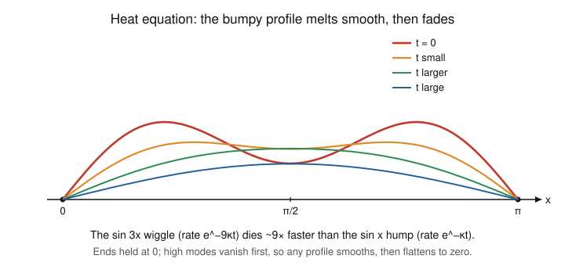

# Fourier & Harmonic Analysis · Lesson 4.3: Fourier methods for the heat and wave equations

> ⏱ ~15 min · Module 4: Sampling, the DFT, and applications · Builds on: [Lesson 1.1](01-01-periodic-functions-fourier-coefficients.md) (Fourier coefficients), [Lesson 1.4](01-04-mean-square-parseval.md) (coefficient decay ↔ smoothness) · Unlocks: nothing — this is the last lesson; the course is complete.

## Why this matters

This is the payoff. Fourier's entire method was invented to solve *one problem* — how heat spreads through a bar — and the trick he found is the reason the whole subject exists. A partial differential equation couples every point in space to every point in time; it looks hopeless. But in the right basis — the sine and cosine modes you have been computing since Lesson 1.1 — the coupling dissolves: each mode evolves on its own, by a rule you can read off in one line. Diffusion becomes "multiply mode $n$ by a shrinking exponential"; vibration becomes "let mode $n$ oscillate." Master this and you can solve the heat and wave equations on an interval, and you own the core technique — **separation of variables + eigenmode expansion** — that runs all of [pdes](../../pdes/syllabus.md), [quantum-mechanics](../../quantum-mechanics/syllabus.md), and the future [signals-systems](../../signals-systems/syllabus.md).

## The idea

Picture a metal rod of length $L$, its two ends clamped in ice at temperature $0$, some initial heat profile along it. Left alone, it will smooth out and cool to zero. The **heat equation** $u_t = \kappa\,u_{xx}$ says it in one line: the rate a point heats up ($u_t$) is proportional to how much its neighbors out-vote it — the curvature $u_{xx}$. A sharp peak has strong negative curvature, so it cools fast; a broad hump barely curves, so it lingers.

Now the magic. Suppose the profile is a single sine bump, $\sin(n\pi x/L)$. Its curvature is just $-(n\pi/L)^2$ times itself — a sine is *its own shape under two derivatives*. So the heat equation can't change the shape, only the height: a pure sine mode stays a pure sine mode and its amplitude decays exponentially. The bumpier the mode (larger $n$), the sharper the curvature, the faster it dies. That is the whole story: **decompose the initial profile into sine modes, let each one decay at its own rate, add them back up.** Fourier series isn't a tool we bolt on — it is the language the equation is already written in.

The **wave equation** $u_{tt} = c^2 u_{xx}$ (a plucked guitar string, ends pinned) is the same idea with one change: two time-derivatives instead of one. A single sine mode still keeps its shape, but now instead of decaying it *oscillates* — a standing wave, ringing forever at its own pitch. Same eigenmodes, different clock.

## The formal version

**Separation of variables.** Look for solutions of the special product form
$$u(x,t) = X(x)\,T(t),$$
one factor depending only on space, one only on time. *In words: guess that space and time can be untangled, and see what the equation forces.*

Feed this into the heat equation $u_t = \kappa\,u_{xx}$. Then $u_t = X T'$ and $u_{xx} = X'' T$, so $X T' = \kappa X'' T$. Divide by $\kappa X T$:
$$\frac{T'}{\kappa T} = \frac{X''}{X}.$$
The left side depends only on $t$, the right only on $x$; for them to be equal for *all* $x,t$ they must both equal the same constant, which we name $-\lambda$ (the **separation constant**). One PDE has split into two ODEs:
$$X'' + \lambda X = 0, \qquad T' + \kappa\lambda\, T = 0.$$

**The boundary conditions pick the modes.** Clamped ends mean $u(0,t)=u(L,t)=0$, i.e. $X(0)=X(L)=0$. The space equation $X''+\lambda X = 0$ with those Dirichlet conditions has a nonzero solution *only* for the discrete values
$$\lambda_n = \left(\frac{n\pi}{L}\right)^2, \qquad X_n(x) = \sin\!\left(\frac{n\pi x}{L}\right), \qquad n = 1,2,3,\dots$$
*In words: the only shapes that fit between two clamped ends are the sine waves with a whole number of half-wavelengths across $[0,L]$ — exactly the Fourier **sine** basis.* (Negative or zero $\lambda$ force $X\equiv 0$; check it — an exponential or a straight line can't vanish at both ends without being flat.) These $X_n$ are the **eigenmodes**; the $\lambda_n$ are the eigenvalues.

**Heat equation — modes decay.** For each mode, $T' = -\kappa\lambda_n T$ gives $T_n(t) = e^{-\kappa\lambda_n t}$. Superpose:
$$\boxed{\,u(x,t) = \sum_{n=1}^{\infty} b_n \sin\!\left(\frac{n\pi x}{L}\right) e^{-\kappa (n\pi/L)^2 t}\,}$$
where the $b_n$ are the **Fourier sine coefficients of the initial profile** $u(x,0)=f(x)$:
$$b_n = \frac{2}{L}\int_0^L f(x)\,\sin\!\left(\frac{n\pi x}{L}\right)dx.$$
*In words: expand the starting temperature in sine modes (Lesson 1.1), then damp mode $n$ by $e^{-\kappa(n\pi/L)^2 t}$.* Two things to read straight off: every mode decays ($u\to 0$, the ice wins), and the rate $\kappa(n\pi/L)^2$ grows like $n^2$, so **high modes die fastest** — any initial roughness is erased almost instantly and the profile smooths before it fades (the picture below).

**Wave equation — modes oscillate.** Same $X_n$, but now $T'' = -c^2\lambda_n T$, whose solutions are sines and cosines in time:
$$u(x,t) = \sum_{n=1}^{\infty} \sin\!\left(\frac{n\pi x}{L}\right)\Big[A_n\cos(\omega_n t) + B_n \sin(\omega_n t)\Big], \qquad \omega_n = \frac{n\pi c}{L}.$$
*In words: each mode is a standing wave that rings at frequency $\omega_n$ and never decays.* If the string is released from rest ($u_t(x,0)=0$) then all $B_n=0$ and $A_n = b_n$, the sine coefficients of the initial shape. The frequencies $\omega_n = n\omega_1$ are integer multiples of a fundamental — this is *why* a string sounds a definite pitch with overtones.

**One line of d'Alembert.** A product $\cos(\omega_n t)\sin(n\pi x/L)$ is, by the product-to-sum identity, exactly $\tfrac12\big[\sin\tfrac{n\pi(x-ct)}{L} + \sin\tfrac{n\pi(x+ct)}{L}\big]$ — each standing wave is a right-moving plus a left-moving copy of the shape. Summing over $n$ gives d'Alembert's traveling-wave form $u(x,t)=\tfrac12[f(x-ct)+f(x+ct)]$: the initial profile splits in two and rides off at speed $c$ in both directions.

## Picture

The initial profile $u(x,0)=\sin x + \tfrac12\sin 3x$ (the worked example, with $\kappa=1$) shown at four times. The $\sin 3x$ ripple decays as $e^{-9t}$ and is essentially gone by $t=0.3$; the $\sin x$ hump decays as $e^{-t}$ and coasts down slowly. Diffusion is a **low-pass filter in time**: it kills high spatial frequencies first.

## Worked examples

**Example 1 (mechanical — one mode, verify the rate).** Solve the heat equation $u_t = \kappa u_{xx}$ on $[0,L]$ with clamped ends and initial profile $u(x,0)=7\sin(4\pi x/L)$.

The initial data is already a single eigenmode, $n=4$, with $b_4 = 7$ and every other $b_n = 0$. So no integral is needed — just attach that mode's exponential:
$$u(x,t) = 7\,\sin\!\left(\frac{4\pi x}{L}\right) e^{-\kappa (4\pi/L)^2 t} = 7\,\sin\!\left(\frac{4\pi x}{L}\right) e^{-16\kappa \pi^2 t/L^2}.$$
Sanity check: at $t=0$ it reproduces the profile, and $u_t = -16\kappa\pi^2/L^2 \cdot u$ while $\kappa u_{xx} = \kappa\cdot(-(4\pi/L)^2)u = -16\kappa\pi^2/L^2\cdot u$ — they match. ✓

**Example 2 (the payoff — the boss's heat problem).** Solve $u_t = \kappa u_{xx}$ on $[0,\pi]$ with $u(0,t)=u(\pi,t)=0$ and $u(x,0)=\sin x + \tfrac12\sin 3x$, then find how long the $\sin 3x$ mode takes to decay to $1/e$ of its initial amplitude.

Here $L=\pi$, so the eigenmodes are $\sin(n\pi x/\pi)=\sin(nx)$ and the decay rates are $\kappa(n\pi/\pi)^2 = \kappa n^2$. The initial profile is *already* a finite sine series: $b_1 = 1$, $b_3 = \tfrac12$, all others $0$ — no coefficient integral required. Attach each mode's exponential:
$$u(x,t) = \sin x\; e^{-\kappa t} \;+\; \tfrac12 \sin 3x\; e^{-9\kappa t}.$$
The $\sin 3x$ mode has amplitude $\tfrac12 e^{-9\kappa t}$. It reaches $1/e$ of its start when the exponent is $-1$:
$$9\kappa t = 1 \quad\Longrightarrow\quad t = \frac{1}{9\kappa}.$$
Compare the fundamental $\sin x$ mode, which reaches $1/e$ only at $t = 1/\kappa$ — **nine times longer**. Same lesson as the picture: the wiggle evaporates, the smooth hump endures.

## Watch out

- **You might think you always need to compute coefficient integrals — but check whether the initial data is already a sine combination first.** If $u(x,0)=\sin x+\tfrac12\sin 3x$, you can *read off* $b_1=1, b_3=\tfrac12$; grinding through $\frac{2}{\pi}\int_0^\pi(\dots)\sin(nx)\,dx$ just re-derives that (and orthogonality guarantees it). Integrals are only for genuinely non-modal profiles.
- **You might think the decay rate is linear in $n$ — but it's quadratic, $\kappa(n\pi/L)^2 \propto n^2$.** Mode 10 doesn't decay 10× faster than mode 1; it decays **100×** faster. That $n^2$ is why heat smooths so violently and why a rough initial profile becomes analytic the instant $t>0$ (P3).
- **You might confuse the two clocks: $e^{-\kappa(n\pi/L)^2 t}$ (heat) versus $\cos(n\pi c t/L)$ (wave).** One time-derivative → first-order-in-$t$ ODE → real exponential → **decay**. Two time-derivatives → second-order ODE → sine/cosine → **oscillation, no decay**. The spatial factor $\sin(n\pi x/L)$ is identical; only the temporal factor differs.
- **You might expect the sine series to reproduce nonzero endpoint values — but a sine series is always $0$ at $x=0,L$.** That's a feature: it's exactly the Dirichlet boundary condition baked into the basis. If your physical ends are held at nonzero or unequal temperatures, subtract off the steady-state linear profile first, then sine-expand the remainder.

## One-liner

> In the sine basis a PDE falls apart into one ODE per mode: heat multiplies each mode by a shrinking $e^{-\kappa(n\pi/L)^2 t}$, waves let each mode ring at $\omega_n=n\pi c/L$ — solve the pieces, superpose.

## Problems

**P1 (🟢)** Solve the heat equation $u_t = \kappa u_{xx}$ on $[0,\pi]$ with clamped ends, diffusivity $\kappa = 2$, and initial profile $u(x,0)=3\sin 2x - \sin 5x$. Write $u(x,t)$, give the decay rate of each mode, and say which mode dominates the profile once $t$ is large.

**P2 (🟡)** A string of length $L$ with fixed ends and wave speed $c$ is released from rest ($u_t(x,0)=0$) in the shape of its fundamental mode, $u(x,0)=\sin(\pi x/L)$. Solve the wave equation $u_{tt}=c^2u_{xx}$ for $u(x,t)$, state the temporal period of the vibration, and use one product-to-sum step to write the standing wave as a sum of two traveling waves (the d'Alembert form).

**P3 (🔴, optional — bridge to real-analysis & smoothing)** Suppose the initial temperature profile $f$ on $[0,\pi]$ has *bounded* Fourier sine coefficients, $|b_n|\le M$ for all $n$ (true whenever $f$ is, say, bounded and integrable). Show that for every fixed $t>0$ the heat solution $u(x,t)=\sum_n b_n \sin(nx)e^{-n^2\kappa t}$ can be differentiated in $x$ any number of times term-by-term — i.e. $u(\cdot,t)$ is infinitely smooth — even if $f$ itself is jagged. (This is the heat equation's famous *instantaneous smoothing*.)

Solutions

**P1** On $[0,\pi]$ the eigenmodes are $\sin(nx)$ with decay rate $\kappa n^2 = 2n^2$. The data is already modal: $b_2 = 3$, $b_5 = -1$, others $0$. Attach exponentials:
$$u(x,t) = 3\sin(2x)\,e^{-8t} \;-\; \sin(5x)\,e^{-50t}.$$
Rates: the $\sin 2x$ mode decays as $e^{-2\cdot 2^2 t}=e^{-8t}$; the $\sin 5x$ mode as $e^{-2\cdot 5^2 t}=e^{-50t}$. Since $50\gg 8$, the $\sin 5x$ term vanishes far sooner, so for large $t$ the profile looks like $3\sin(2x)e^{-8t}$ — a slowly shrinking two-lobe sine. The slowest (lowest) surviving mode always dominates the late-time shape.

**P2** The initial shape is a single eigenmode ($n=1$), and it's released from rest so the time factor is a pure cosine (the $\sin\omega_n t$ part has coefficient $B_n=0$ because $u_t(x,0)=0$). With $\omega_1 = \pi c/L$:
$$u(x,t) = \sin\!\left(\frac{\pi x}{L}\right)\cos\!\left(\frac{\pi c t}{L}\right).$$
Check: $u_{tt} = -(\pi c/L)^2 u$ and $c^2 u_{xx} = c^2\cdot(-(\pi/L)^2)u = -(\pi c/L)^2 u$ — equal. ✓ The temporal period is the period of $\cos(\pi c t/L)$, namely $T = \dfrac{2\pi}{\omega_1} = \dfrac{2L}{c}$.

Product-to-sum, $\sin A\cos B = \tfrac12[\sin(A-B)+\sin(A+B)]$ with $A=\pi x/L$, $B=\pi c t/L$:
$$u(x,t) = \tfrac12\sin\!\left(\frac{\pi (x-ct)}{L}\right) + \tfrac12\sin\!\left(\frac{\pi (x+ct)}{L}\right).$$
A half-amplitude copy of the initial sine travels right at speed $c$, another travels left — d'Alembert's two traveling waves.

**P3** Differentiating $\sin(nx)$ term-by-term $k$ times pulls down a factor $\pm n^k$ (a sine or cosine, magnitude $\le 1$). So the term-by-term $k$-th $x$-derivative has terms bounded by
$$\left| b_n\, (\pm n^k)\, e^{-n^2\kappa t}\right| \;\le\; M\, n^k\, e^{-n^2\kappa t}.$$
Fix $t>0$. The series $\sum_{n\ge 1} M\,n^k e^{-n^2\kappa t}$ converges: the exponential $e^{-n^2\kappa t}$ beats any fixed power $n^k$ as $n\to\infty$ (e.g. by the ratio test, or because $n^k e^{-n^2\kappa t}\to 0$ faster than $1/n^2$). By the Weierstrass $M$-test the differentiated series converges *uniformly* in $x$, which justifies differentiating the original series term-by-term. Since $k$ was arbitrary, $u(\cdot,t)$ has continuous derivatives of every order — it is $C^\infty$ — no matter how rough $f$ was. The mechanism is precisely the $e^{-n^2\kappa t}$ damping crushing the high modes (echoing decay ↔ smoothness from [Lesson 1.4](01-04-mean-square-parseval.md)): the instant heat starts flowing, all roughness is gone.

## Flashback

**From [Lesson 1.1](01-01-periodic-functions-fourier-coefficients.md) (Fourier coefficients — here, an initial-condition expansion):** A rod on $[0,\pi]$ starts at the parabolic temperature profile $f(x)=x(\pi-x)$ (which conveniently vanishes at both clamped ends). Find its Fourier **sine** coefficients $b_n = \frac{2}{\pi}\int_0^\pi f(x)\sin(nx)\,dx$ — these are exactly the amplitudes you'd feed into the heat solution.

Solution

Compute $I=\int_0^\pi (\pi x - x^2)\sin(nx)\,dx$ using two standard integration-by-parts results on $[0,\pi]$:
$$\int_0^\pi x\sin(nx)\,dx = \frac{\pi(-1)^{n+1}}{n}, \qquad \int_0^\pi x^2\sin(nx)\,dx = -\frac{\pi^2(-1)^n}{n} + \frac{2(-1)^n}{n^3} - \frac{2}{n^3}.$$
Then
$$I = \pi\cdot\frac{\pi(-1)^{n+1}}{n} - \left[-\frac{\pi^2(-1)^n}{n} + \frac{2(-1)^n}{n^3} - \frac{2}{n^3}\right] = \frac{2}{n^3}\big(1-(-1)^n\big),$$
since the two $\pi^2/n$ terms cancel ($\pi\cdot\pi(-1)^{n+1}/n = -\pi^2(-1)^n/n$). Thus $I = 4/n^3$ for odd $n$ and $0$ for even $n$, giving
$$b_n = \frac{2}{\pi}I = \begin{cases}\dfrac{8}{\pi n^3}, & n \text{ odd},\\[2mm] 0, & n \text{ even},\end{cases}\qquad\text{so}\quad x(\pi-x) = \frac{8}{\pi}\sum_{n\text{ odd}} \frac{\sin(nx)}{n^3}.$$
The even modes drop out because $f$ is symmetric about $x=\pi/2$, matching the symmetry of the odd-$n$ sines. The $1/n^3$ decay reflects the smoothness of $f$ (Lesson 1.4). Quick check at $x=\pi/2$: $f=\pi^2/4$, and $\frac{8}{\pi}\sum_{k\ge0}\frac{(-1)^k}{(2k+1)^3}=\frac{8}{\pi}\cdot\frac{\pi^3}{32}=\frac{\pi^2}{4}$ ✓ (using the Leibniz-type sum $\sum(-1)^k/(2k+1)^3=\pi^3/32$). Dropped into the heat solution, this profile would evolve as $u(x,t)=\frac{8}{\pi}\sum_{n\text{ odd}}\frac{\sin(nx)}{n^3}e^{-n^2\kappa t}$.

## Connections

- **Backward:** the eigenmode amplitudes $b_n$ are nothing but the Fourier sine coefficients of [Lesson 1.1](01-01-periodic-functions-fourier-coefficients.md), and the "high modes decay fastest, so heat smooths" story is the time-dynamics face of the coefficient-decay ↔ smoothness duality from [Lesson 1.4](01-04-mean-square-parseval.md). The whole method is orthogonal projection onto eigenmodes — the projection picture of [Lesson 1.2](01-02-orthogonal-systems-projection.md).
- **Sideways (PDEs):** *separation of variables + eigenmode expansion* is the central technique of [pdes](../../pdes/syllabus.md), where it generalizes past the interval — polar/spherical domains bring Bessel functions and spherical harmonics as the eigenmodes in place of $\sin(n\pi x/L)$, but the recipe (find the eigenmodes the boundary allows, evolve each, superpose) is identical.
- **Sideways (quantum mechanics):** the same "expand in eigenmodes, evolve each by a simple time factor" move *is* the solution of the Schrödinger equation in [quantum-mechanics](../../quantum-mechanics/syllabus.md) — energy eigenstates play the role of $\sin(n\pi x/L)$, and each picks up a phase $e^{-iE_n t/\hbar}$ (an oscillation, like the wave equation) rather than a decay. The particle in a box has *literally* these sine modes.
- **Sideways (signals & systems):** reading dynamics off the spectrum — heat as a low-pass filter that kills high modes — is the language of [signals-systems](../../signals-systems/syllabus.md), where every linear time-invariant system is understood by what it does to each Fourier mode.
- **Course complete.** With this lesson the Dangerous Checklist is fully covered: you can compute series and transforms, name the mode of convergence, wield Parseval, handle the delta and distributions, sample without aliasing, take a DFT by hand — and now solve the heat and wave equations and read the physics straight off the coefficients. That was the point all along.
