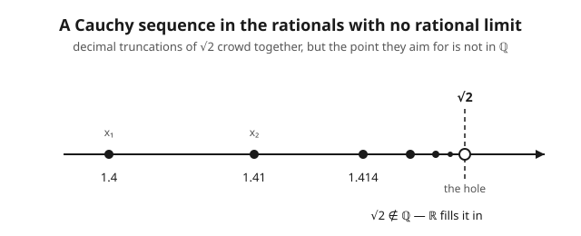

# Functional Analysis · Lesson 1.1: Metric spaces and completeness, revisited

> ⏱ ~15 min · Module 1: Metric, normed, and Banach spaces · Builds on: [syllabus](../syllabus.md) · Unlocks: [1.2 Normed and Banach spaces](01-02-normed-banach-spaces.md)

## Why this matters

Almost every theorem in functional analysis is an **existence** theorem: a differential equation *has* a solution, an operator *has* a fixed point, a Fourier series *converges to* something. You never write that something down explicitly — you construct a sequence of approximations and argue that it must have a limit. The single property that licenses "must have a limit" is **completeness**. It is the whole game: without it, your carefully built approximating sequence can march toward a target that simply isn't there, like a decimal expansion of $\sqrt2$ trapped inside the rationals. This lesson pins down what completeness is, why $\mathbb{R}$ and $C[0,1]$ have it, why $\mathbb{Q}$ doesn't, and why the *metric* — not the set — is what decides.

## The idea

A **metric space** is any set where you've agreed on a notion of distance. That's it: a set $X$ plus a rule $d(x,y)$ telling you how far apart two points are, satisfying the obvious sanity checks (distances are non-negative, symmetric, zero only for identical points, and no detour is shorter than going straight).

Now the crucial distinction. A sequence is **Cauchy** if its terms eventually get arbitrarily close *to each other* — the sequence stops spreading out. A sequence **converges** if its terms get arbitrarily close *to a specific point of the space*. These sound like the same thing, and your intuition from $\mathbb{R}$ insists they are. They are not. "The terms bunch up" is a statement about the sequence alone; "the terms approach a limit" requires the limit to actually **exist in the space**. A sequence can bunch up perfectly while the point it's bunching toward has been deleted from the space — think of the rationals crowding around $\sqrt2$, which isn't rational.

A space where this never happens — where every Cauchy sequence really does converge *to a point of the space* — is called **complete**. Complete means "no holes": every sequence that ought to converge, does. That is the property you cash in every time you assert a limit exists without producing it.

## The formal version

**Metric space.** A set $X$ with a function $d : X \times X \to \mathbb{R}$ such that for all $x,y,z \in X$:

$$
\begin{aligned}
&\text{(M1)} \quad d(x,y) \ge 0, \quad\text{and } d(x,y)=0 \iff x=y \quad(\text{identity of indiscernibles})\\
&\text{(M2)} \quad d(x,y) = d(y,x) \quad(\text{symmetry})\\
&\text{(M3)} \quad d(x,z) \le d(x,y) + d(y,z) \quad(\text{triangle inequality})
\end{aligned}
$$

In words: distance is never negative, is zero exactly when the two points coincide, doesn't care about direction, and a detour through $y$ is never shorter than going straight from $x$ to $z$.

**Cauchy sequence.** A sequence $(x_n)$ in $X$ is *Cauchy* if for every $\varepsilon > 0$ there is an $N$ such that $d(x_m, x_n) < \varepsilon$ whenever $m, n \ge N$.

In words: past some point in the sequence, every pair of terms is within $\varepsilon$ of *each other* — no target mentioned.

**Convergence.** $(x_n)$ *converges* to $x \in X$ if for every $\varepsilon > 0$ there is an $N$ with $d(x_n, x) < \varepsilon$ for all $n \ge N$.

In words: past some point, every term is within $\varepsilon$ of the *specific limit point* $x$, and $x$ is required to live in $X$.

**Completeness.** $X$ is *complete* if **every** Cauchy sequence in $X$ converges to a point of $X$.

In words: no holes — anything that bunches up has something in the space to bunch up to. A complete normed space earns the name **Banach space**, the subject of [1.2](01-02-normed-banach-spaces.md).

**Dense subset & completion.** $D \subseteq X$ is *dense* if every point of $X$ is a limit of points from $D$ (equivalently, every open ball hits $D$). The **completion** of a metric space $X$ is a complete space $\widehat{X}$ containing an isometric copy of $X$ as a dense subset; it always exists and is **unique up to isometry** (a distance-preserving bijection).

In words: every metric space sits densely inside exactly one complete space — you fill the holes with the limits of Cauchy sequences that had nowhere to go, and there's essentially only one way to do it. $\mathbb{R}$ is the completion of $\mathbb{Q}$.

## Concrete instance

**The rationals are incomplete — watch a sequence fall through a hole.** Work in $X = \mathbb{Q}$ with the usual distance $d(x,y) = |x - y|$. Build the decimal truncations of $\sqrt2$:

$$x_1 = 1.4,\quad x_2 = 1.41,\quad x_3 = 1.414,\quad x_4 = 1.4142,\quad \dots$$

Every $x_n$ is a finite decimal, hence rational — the whole sequence lives in $\mathbb{Q}$. It is **Cauchy**: for $m > n$, the two truncations agree in their first $n$ decimal places, so $|x_m - x_n| \le 10^{-n}$, which beats any $\varepsilon$ once $n$ is large. So the terms bunch up tightly.

Does it **converge in $\mathbb{Q}$?** In $\mathbb{R}$ its limit is $\sqrt2$. But $\sqrt2$ is irrational (the classic proof: if $\sqrt2 = p/q$ in lowest terms then $p^2 = 2q^2$ forces both $p$ and $q$ even, contradicting "lowest terms"). Could it converge to some *other* rational $q^*$? No: a sequence in $\mathbb{R}$ has at most one limit, and that limit is $\sqrt2 \notin \mathbb{Q}$. So the sequence is Cauchy in $\mathbb{Q}$ with **no limit in $\mathbb{Q}$** — the target fell through a hole. Therefore $\mathbb{Q}$ is *not complete*.

Fill in that hole and every other one — one new point per "orphaned" Cauchy sequence — and you get $\mathbb{R}$, the completion of $\mathbb{Q}$. The rationals sit *densely* inside it: every real is a limit of rationals (its own decimal truncations). This is not an analogy for completion; it *is* the standard construction of the real numbers.

## Worked examples

**Example 1 (mechanical — $\mathbb{Q}$ is incomplete, stated as a clean argument).** Claim: the metric space $(\mathbb{Q}, |\cdot|)$ is not complete.

*Proof.* Take $(x_n)$ = decimal truncations of $\sqrt2$ as above. (i) *In $\mathbb{Q}$:* each $x_n \in \mathbb{Q}$. (ii) *Cauchy:* given $\varepsilon > 0$, pick $N$ with $10^{-N} < \varepsilon$; for $m,n \ge N$, $|x_m - x_n| \le 10^{-\min(m,n)} \le 10^{-N} < \varepsilon$. (iii) *No rational limit:* viewed in $\mathbb{R}$, $x_n \to \sqrt2$, and limits are unique, so any limit of $(x_n)$ must equal $\sqrt2 \notin \mathbb{Q}$. A Cauchy sequence with no limit in the space witnesses incompleteness. $\blacksquare$

The completion is $\mathbb{R}$: $\mathbb{Q}$ is dense in $\mathbb{R}$, $\mathbb{R}$ is complete (this is the completeness axiom of the reals from [real analysis](../../real-analysis/syllabus.md)), and completions are unique up to isometry, so $\mathbb{R}$ is *the* completion.

**Example 2 (why you'd care — $C[0,1]$ with the sup metric is complete).** Let $X = C[0,1]$, the continuous real functions on $[0,1]$, with

$$d(f,g) = \sup_{t\in[0,1]} |f(t) - g(t)| \quad(\text{the "sup metric"}).$$

*Claim: $X$ is complete.* Let $(f_n)$ be Cauchy in this metric — "**uniformly Cauchy**." We build the limit in three moves.

1. **A pointwise limit exists.** Fix any $t \in [0,1]$. Since $|f_m(t) - f_n(t)| \le d(f_m, f_n)$, the numbers $(f_n(t))$ form a Cauchy sequence *in $\mathbb{R}$*. Because $\mathbb{R}$ **is** complete, this sequence converges; call its limit $f(t)$. Doing this at every $t$ defines a function $f$. *(Note where completeness of $\mathbb{R}$ did the heavy lifting — we asserted a limit exists without naming it.)*

2. **Convergence is uniform.** Given $\varepsilon>0$, pick $N$ so $d(f_m,f_n) < \varepsilon$ for $m,n\ge N$. Then $|f_m(t) - f_n(t)| < \varepsilon$ for all $t$; hold $n \ge N$ fixed and let $m \to \infty$, giving $|f(t) - f_n(t)| \le \varepsilon$ for all $t$ at once. So $d(f, f_n) \le \varepsilon$ — the convergence is uniform, and $f_n \to f$ *in the sup metric*.

3. **The limit is continuous.** A uniform limit of continuous functions is continuous — the **uniform limit theorem** from [real analysis](../../real-analysis/syllabus.md). So $f \in C[0,1] = X$.

The Cauchy sequence converged, in the space, to a member of the space. Hence $C[0,1]$ with the sup metric is complete. $\blacksquare$ This is the prototype Banach space and the reason uniform convergence is the "right" convergence for continuous functions.

## Watch out

- **You might think Cauchy always implies convergent** — that's the reflex from $\mathbb{R}$. But the implication holds *only in complete spaces*. In general "Cauchy" is a statement the sequence makes about itself; "convergent" additionally demands the space own a limit. $\mathbb{Q}$ and the truncations of $\sqrt2$ are the standing counterexample: bunched up, nowhere to land.
- **You might think completeness is a property of the set** — it isn't, it's a property of the **metric**. The *same set* can be complete under one distance and incomplete under another, because "how close is close" changes which sequences count as Cauchy. This is exactly what makes $C[0,1]$ complete in the sup metric but **not** complete in the $L^1$ metric $d(f,g)=\int_0^1|f-g|$ (a spike-shaped sequence squeezes to zero $L^1$-distance while its "limit" is a discontinuous step) — the contrast that drives [1.3](01-03-standard-examples-lp-c-lp.md) and Boss Problem 1.
- **You might think a space could have two different completions** — no. The completion is **unique up to isometry**: any two complete spaces that contain $X$ as a dense subset are the same space wearing different labels. Fill the holes any way you like; you always land on $\mathbb{R}$.
- **You might think completeness is preserved by homeomorphism** — it isn't. Completeness is *not* a topological invariant. The open interval $(0,1)$ and the whole line $\mathbb{R}$ are homeomorphic (via, say, $x \mapsto \tan(\pi(x-\tfrac12))$), yet $\mathbb{R}$ is complete and $(0,1)$ is not: in $(0,1)$ the sequence $1/n$ is Cauchy but its limit $0$ was evicted. Completeness sees distance; the topology only sees open sets — see [topology](../../topology/syllabus.md).

## One-liner

> Completeness is the promise that anything which *bunches up* actually *lands* — it's what lets you assert a limit exists without ever exhibiting it, and it depends on the metric, not just the set.

## Problems

**P1 (🟢)** Show that $d(x,y) = |x^3 - y^3|$ is a metric on $\mathbb{R}$. (Check M1–M3; the cube function is the whole trick.)

**P2 (🟡)** Consider $X = (0, 1]$ with the usual metric $d(x,y)=|x-y|$. Exhibit a Cauchy sequence in $X$ that does not converge in $X$, and thereby show $X$ is incomplete. What is the completion of $X$?

**P3 (🔴, optional)** Let $X = \mathbb{Q}$ again, and define $x_1 = 2$, $x_{n+1} = \tfrac{x_n}{2} + \tfrac{1}{x_n}$ (Newton's iteration for $\sqrt2$). (a) Assuming each $x_n$ is a positive rational, explain why every $x_n \in \mathbb{Q}$. (b) It is a fact that $x_n \to \sqrt2$ in $\mathbb{R}$; use this to conclude $(x_n)$ is Cauchy in $\mathbb{Q}$ but does not converge in $\mathbb{Q}$. (c) In one sentence, why does this re-prove that $\mathbb{Q}$ is incomplete *without* appealing to decimal expansions?

Solutions

**P1** Write $g(x) = x^3$, a strictly increasing bijection $\mathbb{R}\to\mathbb{R}$, and $d(x,y) = |g(x)-g(y)|$.
- **(M1)** $|g(x)-g(y)| \ge 0$ always. And $d(x,y)=0 \iff g(x)=g(y) \iff x^3 = y^3 \iff x = y$, using that $g$ is injective (cube roots are unique for reals). ✓
- **(M2)** $|g(x)-g(y)| = |g(y)-g(x)|$ since $|{\cdot}|$ is symmetric. ✓
- **(M3)** $d(x,z) = |g(x)-g(z)| = |(g(x)-g(y)) + (g(y)-g(z))| \le |g(x)-g(y)| + |g(y)-g(z)| = d(x,y)+d(y,z)$, by the ordinary triangle inequality for real numbers. ✓

All three hold, so $d$ is a metric. (General principle: pulling back a metric through *any* injective map yields a metric — injectivity is exactly what M1's "$=0\iff$ equal" needs.)

**P2** Take $x_n = \tfrac1n$ for $n \ge 1$; each $x_n \in (0,1]$. It's Cauchy: $|x_m - x_n| \le \tfrac1{\min(m,n)} \to 0$. In $\mathbb{R}$ it converges to $0$, and limits are unique, so any limit must be $0$ — but $0 \notin (0,1]$. Hence $(x_n)$ is Cauchy in $X$ with no limit in $X$, so $X$ is incomplete. The single missing point is the left endpoint, so the completion is the closed interval $[0,1]$ (it is complete — closed and bounded in $\mathbb{R}$ — and contains $(0,1]$ as a dense subset).

**P3**
(a) $x_1 = 2 \in \mathbb{Q}$. If $x_n \in \mathbb{Q}$ and $x_n > 0$, then $x_{n+1} = \tfrac{x_n}{2} + \tfrac1{x_n}$ is a sum/quotient of rationals with nonzero denominator, hence rational (and positive). By induction every $x_n \in \mathbb{Q}$.
(b) Since $x_n \to \sqrt2$ in $\mathbb{R}$, the sequence converges in $\mathbb{R}$, and every convergent sequence in a metric space is Cauchy (if terms approach a limit, they approach each other: $d(x_m,x_n)\le d(x_m,L)+d(L,x_n)$). The Cauchy property only involves distances *between terms of the sequence*, all of which are rational, so $(x_n)$ is equally Cauchy viewed inside $\mathbb{Q}$. But its only possible limit is $\sqrt2 \notin \mathbb{Q}$, so it does not converge in $\mathbb{Q}$.
(c) It exhibits a *different* Cauchy sequence with the same missing target, showing the hole at $\sqrt2$ is a genuine feature of $\mathbb{Q}$'s metric, not an artifact of how we chose to write $\sqrt2$ as a decimal.

## Connections

- **Forward — [1.2 Normed and Banach spaces](01-02-normed-banach-spaces.md):** a *norm* $\|\cdot\|$ manufactures a metric $d(x,y)=\|x-y\|$; a **Banach space** is precisely a normed space that is *complete* in that metric. Everything here is the scaffolding for that one definition.
- **Forward — [1.3 Standard examples ($\ell^p$, $C$, $L^p$)](01-03-standard-examples-lp-c-lp.md) & [1.4 finite vs. infinite dimensions](01-04-finite-vs-infinite-dimensions.md):** we'll audit which of the workhorse spaces are complete, and see the sup-metric-vs-$L^1$ contrast from "Watch out" become the central cautionary tale.
- **Forward — [3.3 Uniform boundedness](03-03-uniform-boundedness.md) & [3.4 Open mapping / closed graph](03-04-open-mapping-closed-graph.md):** the three "big theorems" of the subject all run on completeness through the **Baire category theorem** — no completeness, no big theorems.
- **Sideways — [real analysis](../../real-analysis/syllabus.md):** the completeness of $\mathbb{R}$ (the least-upper-bound / completeness axiom) and the **uniform limit theorem** are the two facts Example 2 leans on; we're now treating them as the *base case* of a much larger structure.
- **Sideways — [topology](../../topology/syllabus.md):** convergence and density are topological, but completeness is *not* — it needs the metric, as the $(0,1)\cong\mathbb{R}$ example shows. Keep the two lenses separate: topology sees open sets, completeness sees distances.
