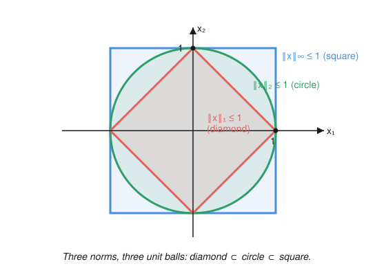

# Functional Analysis · Lesson 1.2: Normed and Banach spaces

> ⏱ ~15 min · Module 1: Metric, normed, and Banach spaces · Builds on: [1.1 Metric spaces and completeness, revisited](01-01-metric-spaces-completeness.md) · Unlocks: [1.3 The standard examples](01-03-standard-examples-lp-c-lp.md)

## Why this matters

A metric tells you how far apart two points are, but it forgets that the points might be *vectors* — things you can add and scale. Functional analysis lives on spaces where you can do both: add two functions, stretch a signal, take a linear combination of solutions. A **norm** is the length-measuring tool that respects that algebra, and once it's *complete* — every would-be limit actually lands somewhere — you have a **Banach space**, the workshop where nearly all of analysis, quantum mechanics, and optimization is actually done. This lesson builds the object; the rest of the course is what you can do inside it.

## The idea

Think of a vector as an arrow from the origin. A norm $\|x\|$ is just "how long is that arrow" — one number, always $\ge 0$, that behaves the way length should: scale the arrow by 3 and its length triples; the direct route from $0$ to $x+y$ is never longer than going $0 \to x \to x+y$ (the triangle inequality, the same shortcut principle you know from the plane).

That's the whole content of a norm: **a length function that plays nicely with adding and scaling.** The moment you have one, you get distance for free — the distance from $x$ to $y$ is the length of the arrow between them, $\|x-y\|$. So every normed space is automatically a metric space, and everything from 1.1 (Cauchy sequences, completeness, convergence) applies verbatim.

The extra word — **Banach** — is completeness dressed for a vector space. In an incomplete normed space you can write down a sequence that *should* converge (its terms bunch up arbitrarily close together) but whose limit isn't in the space, like a sequence of rationals closing in on $\sqrt2$. Banach spaces have no such holes. That single guarantee is what lets you *solve* things: build a solution as a limit of approximations and be sure the limit exists.

## The formal version

Let $V$ be a vector space over $\mathbb{R}$ (or $\mathbb{C}$). A **norm** is a function $\|\cdot\| : V \to \mathbb{R}$ such that for all $x,y \in V$ and every scalar $\alpha$:

1. **Positivity:** $\|x\| \ge 0$, and $\|x\| = 0 \iff x = 0$.
2. **Homogeneity:** $\|\alpha x\| = |\alpha|\,\|x\|$.
3. **Triangle inequality:** $\|x + y\| \le \|x\| + \|y\|$.

*In words:* (1) length is non-negative and only the zero vector has zero length; (2) scaling a vector scales its length by the same factor; (3) a sum is no longer than the sum of the parts. Here $|\alpha|$ is the absolute value (or modulus) of the scalar, and $0$ is the zero vector.

A vector space with a norm is a **normed vector space**. It becomes a metric space under the **induced metric**

$$d(x,y) = \|x - y\|.$$

*In words:* distance is the length of the difference vector. (You can check the metric axioms of 1.1 follow from the three norm axioms — e.g. the metric triangle inequality is $\|x-z\| = \|(x-y)+(y-z)\| \le \|x-y\| + \|y-z\|$.) This metric is *compatible* with the algebra: addition and scalar multiplication are continuous in it.

**Definition (Banach space).** A normed space is a **Banach space** if it is complete in its induced metric — every Cauchy sequence converges to a limit *in the space* (see [1.1](01-01-metric-spaces-completeness.md)).

**A completeness test (the series characterization).** Call a series $\sum_{n=1}^\infty x_n$ **absolutely convergent** if $\sum_{n=1}^\infty \|x_n\| < \infty$ (a sum of ordinary non-negative numbers). Then:

$$\text{a normed space is Banach} \iff \text{every absolutely convergent series converges.}$$

*In words:* completeness is exactly the guarantee that "the lengths add up to something finite" forces "the vectors actually add up to something." This is often the fastest way to *prove* a space is complete — you never touch an abstract Cauchy sequence, just control a sum of numbers.

## Picture

The **unit ball** $\{x : \|x\| \le 1\}$ is the norm made visible — all the vectors of length at most 1. On $\mathbb{R}^2$, three standard norms give three different shapes for "length $\le 1$": the $\ell^1$ norm $\|x\|_1 = |x_1| + |x_2|$ gives a diamond, the Euclidean $\ell^2$ norm $\|x\|_2 = \sqrt{x_1^2 + x_2^2}$ gives the familiar circle, and the sup norm $\|x\|_\infty = \max(|x_1|,|x_2|)$ gives a square. Same vectors, same vector space — the norm is a *choice*, and it changes the geometry of "close."

## Worked examples

**Example 1 (mechanical — verify a norm).** On $C[a,b]$, the vector space of continuous functions $f:[a,b]\to\mathbb{R}$, define the **sup norm**

$$\|f\|_\infty = \sup_{t\in[a,b]} |f(t)|.$$

Check the three axioms. First, this is finite: a continuous function on a closed bounded interval attains a maximum, so the sup is a real number.

- **Positivity:** $|f(t)| \ge 0$ for all $t$, so the sup is $\ge 0$. If $\|f\|_\infty = 0$ then $|f(t)| \le 0$ for every $t$, forcing $f \equiv 0$, the zero function. Conversely $\|0\|_\infty = 0$. ✓
- **Homogeneity:** $\|\alpha f\|_\infty = \sup_t |\alpha f(t)| = \sup_t |\alpha|\,|f(t)| = |\alpha|\sup_t |f(t)| = |\alpha|\,\|f\|_\infty$, pulling the constant $|\alpha| \ge 0$ out of the sup. ✓
- **Triangle inequality:** for each fixed $t$, $|f(t)+g(t)| \le |f(t)| + |g(t)| \le \|f\|_\infty + \|g\|_\infty$. The right side is an upper bound for $|f(t)+g(t)|$ over all $t$, so it bounds the sup: $\|f+g\|_\infty \le \|f\|_\infty + \|g\|_\infty$. ✓

The induced metric is $d(f,g) = \sup_t |f(t) - g(t)|$ — exactly the **sup metric** of [1.1](01-01-metric-spaces-completeness.md), whose convergence is uniform convergence. So $C[a,b]$ with $\|\cdot\|_\infty$ is a normed space, and (from 1.1, since uniform limits of continuous functions are continuous) it is in fact a Banach space.

**Example 2 (why you'd care — absolute convergence implies convergence in a Banach space).** Let's prove the forward direction of the series test: *if $V$ is Banach and $\sum \|x_n\| < \infty$, then $\sum x_n$ converges.*

Let $s_N = \sum_{n=1}^N x_n$ be the partial sums. For $M > N$, the triangle inequality (applied repeatedly) gives

$$\|s_M - s_N\| = \Big\|\sum_{n=N+1}^{M} x_n\Big\| \le \sum_{n=N+1}^{M} \|x_n\|.$$

Now $\sum \|x_n\|$ converges as a series of real numbers, so its tail $\sum_{n=N+1}^{M}\|x_n\|$ can be made smaller than any $\varepsilon > 0$ once $N$ is large (a convergent series of numbers has Cauchy partial sums). Hence $\|s_M - s_N\| < \varepsilon$ for all $M > N$ large: the sequence $(s_N)$ is **Cauchy**. Because $V$ is complete, $(s_N)$ converges to some $s \in V$ — which is precisely the statement that $\sum x_n$ converges. $\blacksquare$

Notice the division of labor: the triangle inequality turns vector control into number control, and completeness turns "Cauchy" into "convergent." That is the whole reason Banach spaces are the right setting for building solutions as infinite sums (power series of operators, Fourier expansions, Neumann series).

## Watch out

- **You might think** every metric comes from a norm, **but actually** a norm needs the vector-space structure plus homogeneity and the triangle inequality — a general metric has neither. The **discrete metric** ($d(x,y)=1$ if $x\ne y$, else $0$) is a perfectly good metric but comes from no norm: an induced norm would need $\|2x\| = 2\|x\|$, yet the discrete metric gives distance $1$ regardless of scale. Norms are metrics; the converse fails.
- **You might think** "normed" and "Banach" are the same, **but actually** completeness is a genuine extra ingredient. The polynomials on $[0,1]$ under $\|\cdot\|_\infty$ form a normed space that is *not* complete — a sequence of polynomials can converge uniformly to $e^t$, which is no polynomial. Same norm, a hole in the space. Banach = normed **+** no holes.
- **You might think** the norm is baked into the vectors, **but actually** it's a choice. On $\mathbb{R}^n$ the $\ell^1$, $\ell^2$, $\ell^\infty$ norms give different unit balls (the picture). In finite dimensions they all yield the *same* notion of convergence ([1.4](01-04-finite-vs-infinite-dimensions.md)) — but in infinite dimensions different norms can give genuinely different topologies, and a space can be Banach under one norm and incomplete under another.
- **You might think** axiom (1) is a technicality, **but actually** dropping just the "$=0 \Rightarrow x=0$" half gives a **seminorm** — a length function that can vanish on nonzero vectors. Seminorms are the raw material for $L^p$ spaces (where "functions equal almost everywhere" must be identified to restore axiom 1), coming in [1.3](01-03-standard-examples-lp-c-lp.md).

## One-liner

> A norm is length that respects addition and scaling; a Banach space is a normed space with no missing limits — where "the lengths sum to something finite" guarantees "the vectors sum to something real."

## Problems

**P1 (🟢)** On $\mathbb{R}^2$, verify that $\|x\|_1 = |x_1| + |x_2|$ satisfies all three norm axioms. Then compute $\|x\|_1$, $\|x\|_2$, and $\|x\|_\infty$ for $x = (3,-4)$, and confirm the ordering $\|x\|_\infty \le \|x\|_2 \le \|x\|_1$ (the nesting of unit balls, numerically).

**P2 (🟡)** Show that the "unit sphere ordering" of P1 is general: for every $x \in \mathbb{R}^n$, prove $\|x\|_\infty \le \|x\|_2$ and $\|x\|_2 \le \|x\|_1$. (Hint for the second: square both sides and compare cross terms.)

**P3 (🔴, optional)** Let $V$ be a normed space in which *every* absolutely convergent series converges. Prove $V$ is Banach. (This is the reverse direction of the series test. Given a Cauchy sequence $(y_k)$, extract a fast subsequence $(y_{k_j})$ with $\|y_{k_{j+1}} - y_{k_j}\| < 2^{-j}$, build a telescoping series, and use that a Cauchy sequence with a convergent subsequence converges.)

Solutions

**P1** *Axioms.* Positivity: $|x_1|+|x_2| \ge 0$, and it is $0$ iff both $|x_1|=0$ and $|x_2|=0$, i.e. $x=0$. Homogeneity: $\|\alpha x\|_1 = |\alpha x_1| + |\alpha x_2| = |\alpha|(|x_1|+|x_2|) = |\alpha|\|x\|_1$. Triangle: $\|x+y\|_1 = |x_1+y_1| + |x_2+y_2| \le (|x_1|+|y_1|) + (|x_2|+|y_2|) = \|x\|_1 + \|y\|_1$, using the scalar triangle inequality coordinatewise. ✓

*Values for $x=(3,-4)$:* $\|x\|_1 = 3+4 = 7$; $\|x\|_2 = \sqrt{9+16} = \sqrt{25} = 5$; $\|x\|_\infty = \max(3,4) = 4$. Ordering: $4 \le 5 \le 7$, i.e. $\|x\|_\infty \le \|x\|_2 \le \|x\|_1$. ✓ (The $\ell^\infty$ ball is largest because reaching length $1$ takes the least; correspondingly the $\ell^\infty$ *value* is smallest.)

**P2** *Claim $\|x\|_\infty \le \|x\|_2$.* Let $|x_m| = \max_i |x_i| = \|x\|_\infty$. Then $\|x\|_2^2 = \sum_i x_i^2 \ge x_m^2 = \|x\|_\infty^2$; take square roots (both sides $\ge 0$).

*Claim $\|x\|_2 \le \|x\|_1$.* Square both:
$$\|x\|_1^2 = \Big(\sum_i |x_i|\Big)^2 = \sum_i x_i^2 + \sum_{i\ne j} |x_i||x_j| = \|x\|_2^2 + \underbrace{\sum_{i\ne j}|x_i||x_j|}_{\ge 0} \ge \|x\|_2^2.$$
The cross-term sum is a sum of non-negative products, so $\|x\|_1^2 \ge \|x\|_2^2$, and taking square roots gives $\|x\|_1 \ge \|x\|_2$. ✓

**P3** Let $(y_k)$ be Cauchy. Using the Cauchy property, choose indices $k_1 < k_2 < \cdots$ so that $\|y_{k_{j+1}} - y_{k_j}\| < 2^{-j}$ for every $j$ (pick $k_j$ far enough out that all later terms are within $2^{-j}$). Set
$$x_1 = y_{k_1}, \qquad x_j = y_{k_j} - y_{k_{j-1}} \ (j \ge 2).$$
Then the partial sums telescope: $\sum_{j=1}^{J} x_j = y_{k_J}$. The series $\sum_j x_j$ is absolutely convergent, since
$$\sum_{j\ge 2} \|x_j\| = \sum_{j\ge 2}\|y_{k_j} - y_{k_{j-1}}\| < \sum_{j\ge 1} 2^{-j} = 1 < \infty.$$
By hypothesis $\sum_j x_j$ converges — say to $y$ — which means its partial sums $y_{k_J} \to y$. So the *subsequence* $(y_{k_J})$ converges. A Cauchy sequence with a convergent subsequence converges (to the same limit): given $\varepsilon$, take $j,k$ large so $\|y_k - y_{k_j}\| < \varepsilon/2$ and $\|y_{k_j} - y\| < \varepsilon/2$, then $\|y_k - y\| < \varepsilon$. Hence $y_k \to y \in V$, and $V$ is complete. $\blacksquare$

## Connections

- **Backward:** the whole metric-space toolkit — Cauchy sequences, convergence, completeness — carries over from [1.1](01-01-metric-spaces-completeness.md) through the induced metric $d(x,y)=\|x-y\|$; "Banach" is literally "complete" from 1.1 applied to a normed space. The bare notion of a vector space (basis, span, linear maps) is assumed from the [linear algebra refresher](../../linalg-refresher/syllabus.md) — a norm is the analytic layer added on top of that algebra.
- **Forward:** [1.3](01-03-standard-examples-lp-c-lp.md) populates the theory with the workhorse Banach spaces $\ell^p$, $C[a,b]$, and $L^p$; [1.4](01-04-finite-vs-infinite-dimensions.md) shows all norms on a finite-dimensional space are equivalent (so the unit-ball shapes differ but the topology doesn't) — a fact that spectacularly fails in infinite dimensions. Later, [3.1](03-01-bounded-operators-operator-norm.md) shows the operators between Banach spaces form a Banach space themselves under the operator norm — the same axioms one level up.
- **Sideways (topology):** the norm generates the **norm topology** — open sets built from open balls $\{y : \|y-x\| < r\}$ — so all the continuity and convergence machinery of [topology](../../topology/syllabus.md) applies, now with the extra rigidity that the algebra (addition, scaling) is continuous.
- **Sideways (physics):** the state space of quantum mechanics is a *complete* normed space (in fact a Hilbert space, the inner-product refinement of Module 2), and completeness is exactly what makes spectral decompositions and time-evolution limits well-defined — see the [quantum mechanics](../../quantum-mechanics/syllabus.md) track.
