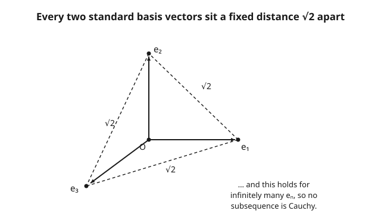

# Functional Analysis · Lesson 1.4: Finite vs infinite dimensions

> ⏱ ~15 min · Module 1: Metric, normed, and Banach spaces · Builds on: [1.3 The standard examples](01-03-standard-examples-lp-c-lp.md) · Unlocks: [2.1 Inner products and the Cauchy–Schwarz inequality](02-01-inner-products-cauchy-schwarz.md)

## Why this matters

Everything you know from linear algebra was quietly using one fact: the dimension was finite. Bounded sequences have convergent subsequences (Bolzano–Weierstrass), continuous functions on closed bounded sets attain their max (Weierstrass), and it never mattered which norm you measured with — they all agreed. Push to infinite dimensions, the home of $\ell^p$, $C[a,b]$, and every function space in quantum mechanics, and each of these quietly fails. This lesson pins down *exactly where* the break happens, because the entire later machinery of the subject — weak topologies, compact operators, the spectral theorem — exists to recover the finite-dimensional comforts we are about to lose.

## The idea

Two headline facts separate finite from infinite dimension.

**First: in finite dimensions all norms are interchangeable.** Whether you measure a vector in $\mathbb{R}^n$ with the Euclidean norm, the taxicab norm, or the max norm, the numbers differ but never by more than a fixed factor. So a sequence that converges in one norm converges in all of them; the open sets, the Cauchy sequences, the whole topology is identical. You can pick whichever norm is convenient and never worry that the choice mattered. In infinite dimensions this is simply false — different norms can disagree about which sequences converge and which spaces are complete (you saw a preview in [1.3](01-03-standard-examples-lp-c-lp.md): the sup norm and the $L^1$ norm on $C[0,1]$ are genuinely different beasts).

**Second: the closed unit ball is compact if and only if the dimension is finite.** In $\mathbb{R}^n$ "closed and bounded" means compact (Heine–Borel), so any bounded sequence has a convergent subsequence — the workhorse behind every existence proof in calculus. In infinite dimensions the closed unit ball, bounded as can be, is *not* compact: you can march off to the horizon inside it forever without ever settling down. The non-compact unit ball is the signature of infinite dimension, and once you have seen the mechanism you will recognize it everywhere.

## The formal version

Let $X$ be a vector space and recall a **norm** $\|\cdot\|$ assigns each vector a length. Two norms $\|\cdot\|_a$ and $\|\cdot\|_b$ on $X$ are **equivalent** if there are constants $0 < c \le C < \infty$ with

$$c\,\|x\|_a \;\le\; \|x\|_b \;\le\; C\,\|x\|_a \qquad \text{for all } x \in X.$$

**In words:** each norm is trapped between fixed multiples of the other, so neither can converge to zero without the other doing the same — equivalent norms induce the *same* topology and the same convergent sequences.

**Theorem (finite-dimensional norm equivalence).** On a finite-dimensional vector space, *all* norms are equivalent.

**In words:** in finite dimensions the choice of norm never changes what converges or what is open. *Why it works:* the unit sphere $\{x : \|x\|_a = 1\}$ is closed and bounded, hence compact by Heine–Borel; any other norm $\|\cdot\|_b$ is a continuous function, so it attains a positive minimum and a finite maximum on that compact sphere — those are exactly the constants $c$ and $C$. Compactness of the sphere is the whole engine, and it is precisely what disappears next.

**Theorem (Riesz).** If $M$ is a *proper closed* subspace of a normed space $X$ and $0 < \varepsilon < 1$, there exists a unit vector $x \in X$ (so $\|x\| = 1$) with $\operatorname{dist}(x, M) := \inf_{m \in M}\|x - m\| > 1 - \varepsilon$.

**In words:** in any normed space you can always find a unit vector that is "almost perpendicular" to a given closed subspace — as close to distance $1$ from it as you like. Iterating this (take $M$ = span of the vectors chosen so far) manufactures an infinite sequence *inside the closed unit ball* whose points stay pairwise at distance $> 1-\varepsilon$, so no subsequence is Cauchy.

**Theorem (Riesz's characterization of finite dimension).** The closed unit ball of a normed space $X$ is compact **if and only if** $\dim X < \infty$.

**In words:** compactness of the unit ball *is* finite-dimensionality — there is no other way to have it. One more piece of vocabulary: a space is **separable** if it contains a countable dense subset. Separability is a much weaker "smallness" than finite dimension: $\ell^p$ is separable for $1 \le p < \infty$ (finite rational sequences are dense), yet infinite-dimensional; $\ell^\infty$ is not even separable. Separable $\ne$ finite-dimensional.

## Concrete instance

The cleanest witness lives in $\ell^2$, the space of square-summable sequences with $\|x\|_2 = \left(\sum_k |x_k|^2\right)^{1/2}$. Let $e_n$ be the **standard basis vector** with a $1$ in slot $n$ and $0$ everywhere else. Each $e_n$ has norm $1$, so the whole family sits inside the closed unit ball. Now measure the gap between any two distinct ones: $e_n - e_m$ has a $+1$ in slot $n$ and a $-1$ in slot $m$, so

$$\|e_n - e_m\|_2 = \sqrt{1^2 + 1^2} = \sqrt{2} \qquad (n \ne m).$$

Every pair is $\sqrt 2$ apart — a fixed distance that never shrinks. A convergent subsequence would have to be Cauchy (its terms eventually within, say, $\tfrac12$ of each other), but no two terms of $\{e_n\}$ ever get closer than $\sqrt 2 \approx 1.41$. So $\{e_n\}$ is a bounded sequence with **no convergent subsequence**, and the closed unit ball of $\ell^2$ is *not* compact. This is Riesz's lemma made completely explicit: each $e_{n+1}$ is genuinely perpendicular to the span of the earlier ones.

## Worked examples

**Example 1 (mechanical — the unit ball is not compact).** Contrast the two settings directly.

- *In $\mathbb{R}^n$:* take any bounded sequence, e.g. points in the unit ball. Bolzano–Weierstrass guarantees a convergent subsequence — this is Heine–Borel at work, and it is why closed bounded sets are compact.
- *In $\ell^2$:* take $\{e_n\}$. Suppose some subsequence $e_{n_k}$ converged to a limit $y$. Convergent sequences are Cauchy, so for large $j,k$ we would need $\|e_{n_j} - e_{n_k}\|_2 < 1$. But that distance is exactly $\sqrt 2 > 1$ for all $j \ne k$. Contradiction — no subsequence converges.

Same word, "bounded," opposite consequences. The extra room of infinite dimension lets a bounded sequence spread out forever without piling up anywhere.

**Example 2 (two norms that disagree — equivalence fails).** On $C[0,1]$ compare the sup norm $\|f\|_\infty = \max_{t}|f(t)|$ and the $L^1$ norm $\|f\|_1 = \int_0^1 |f(t)|\,dt$. Build a *narrowing spike*: let $f_n$ be the triangular bump of height $1$ supported on $[0, 1/n]$ (linear up to $1$ at $t = \tfrac{1}{2n}$, back down to $0$ at $t = 1/n$, zero afterward). Then

$$\|f_n\|_\infty = 1 \quad\text{for every } n, \qquad \|f_n\|_1 = \tfrac12 \cdot \tfrac1n \cdot 1 = \frac{1}{2n} \xrightarrow[n\to\infty]{} 0.$$

If the norms were equivalent there would be a constant $C$ with $\|f\|_\infty \le C\,\|f\|_1$ for all $f$. Feeding in $f_n$ demands $1 \le C \cdot \tfrac{1}{2n}$, i.e. $C \ge 2n$, for *every* $n$ — impossible for a single finite $C$. The norms are not equivalent: $f_n \to 0$ in $L^1$ while staying a fixed height $1$ in sup norm. In finite dimensions no such split can occur; here it is routine.

## Watch out

- **"All norms are equivalent" is a finite-dimensional theorem — full stop.** In infinite dimensions different norms genuinely differ, and they disagree about convergence *and* completeness ([1.3](01-03-standard-examples-lp-c-lp.md): $C[0,1]$ is Banach under the sup norm but not under $L^1$). Never quote the equivalence theorem for a function space.
- **A bounded sequence need not have a convergent subsequence.** Bolzano–Weierstrass and the Weierstrass extreme-value theorem both lean on compactness of closed bounded sets, which is exactly what the non-compact unit ball destroys. This is *why* the subject later invents weak topologies and singles out **compact operators** ([4.2](04-02-compact-operators.md)) — they are the maps that drag the unit ball back to something compact and restore finite-dimensional behavior.
- **Separable is not finite-dimensional.** A countable dense subset makes a space "small enough to approximate," but $\ell^2$ is separable and still infinite-dimensional with a non-compact ball. Don't let "separable" lull you into finite-dimensional reflexes.
- **Distance $\sqrt 2$, not $2$.** The gap between $e_n$ and $e_m$ is $\|e_n - e_m\|_2 = \sqrt 2$, not $\|e_n\| + \|e_m\| = 2$; the triangle inequality is a loose upper bound here, not the actual distance.

## One-liner

> Infinite dimension is the place where the closed unit ball stops being compact and norms stop agreeing — bounded no longer buys you a convergent subsequence.

## Problems

**P1 (🟢)** For the standard basis vectors $e_n \in \ell^p$ ($1 \le p < \infty$), compute $\|e_n - e_m\|_p$ for $n \ne m$, and separately $\|e_n - e_m\|_\infty$ in $\ell^\infty$. Conclude in each case that $\{e_n\}$ has no convergent subsequence.

**P2 (🟡)** On $C[0,1]$, exhibit a sequence $g_n$ with $\|g_n\|_1 = 1$ for all $n$ but $\|g_n\|_\infty \to \infty$. Explain why this rules out any inequality of the form $\|f\|_\infty \le C\|f\|_1$ and hence shows the two norms are not equivalent. (This is the *reverse* spike to Example 2 — think tall and thin.)

**P3 (🔴, optional)** Let $M = \operatorname{span}\{e_1, \dots, e_N\} \subset \ell^2$, a finite-dimensional (hence closed) subspace. Show $\operatorname{dist}(e_{N+1}, M) = 1$ exactly. Explain how this is Riesz's lemma realized with the perpendicular vector at the *best possible* distance $1$, and how letting $N$ range reconstructs the non-compact sequence $\{e_n\}$.

Solutions

**P1** For $n \ne m$ the vector $e_n - e_m$ has entries $+1$ (slot $n$), $-1$ (slot $m$), and $0$ elsewhere. Thus

$$\|e_n - e_m\|_p = \left(|1|^p + |{-1}|^p\right)^{1/p} = 2^{1/p}, \qquad \|e_n - e_m\|_\infty = \max(1,1) = 1.$$

In every case the pairwise distance is a *fixed positive constant* ($2^{1/p}$, or $1$ for $p=\infty$) independent of $n,m$. A convergent subsequence would be Cauchy, forcing its terms arbitrarily close together — impossible when every pair stays $2^{1/p} > 0$ apart. So $\{e_n\}$ has no convergent subsequence, and the closed unit ball of each $\ell^p$ (including $\ell^\infty$) is non-compact. (For $p = 2$ this is $2^{1/2} = \sqrt2$, the Concrete instance.)

**P2** Take the *tall thin* triangular spike: $g_n$ has height $n$, supported on $[0, 2/n]$ with peak $n$ at $t = 1/n$, zero afterward. Its area is $\|g_n\|_1 = \tfrac12 \cdot \tfrac{2}{n} \cdot n = 1$ for every $n$, while $\|g_n\|_\infty = n \to \infty$. If some constant $C$ satisfied $\|f\|_\infty \le C\|f\|_1$ for all $f$, then $g_n$ would give $n = \|g_n\|_\infty \le C\|g_n\|_1 = C$, i.e. $C \ge n$ for all $n$ — no finite $C$ works. Hence there is no upper bound of $\|\cdot\|_\infty$ by a multiple of $\|\cdot\|_1$, so the two norms are not equivalent. (Example 2 killed the other bounding direction; either failure alone suffices for non-equivalence.)

**P3** Any $m \in M$ has the form $m = \sum_{k=1}^N a_k e_k$, so its entries live entirely in slots $1,\dots,N$. Since $e_{N+1}$ has its single nonzero entry in slot $N+1$, the vectors $m$ and $e_{N+1}$ occupy disjoint coordinates and

$$\|e_{N+1} - m\|_2^2 = \underbrace{\sum_{k=1}^N |a_k|^2}_{=\,\|m\|_2^2} + \underbrace{|1|^2}_{\text{slot }N+1} = \|m\|_2^2 + 1 \;\ge\; 1,$$

with equality exactly when $m = 0$. Therefore $\inf_{m \in M}\|e_{N+1} - m\|_2 = 1$, i.e. $\operatorname{dist}(e_{N+1}, M) = 1$. This is Riesz's lemma at its sharpest: the guaranteed almost-perpendicular unit vector is here *exactly* perpendicular (distance $1$, the largest possible for a unit vector, since taking $m=0$ already gives $\|e_{N+1}\| = 1$ as an upper bound). Choosing $x_1 = e_1$, then $x_2 = e_2$ at distance $1$ from $\operatorname{span}\{e_1\}$, then $x_3 = e_3$ at distance $1$ from $\operatorname{span}\{e_1,e_2\}$, and so on, rebuilds precisely the sequence $\{e_n\}$ living in the unit ball with pairwise distances $\ge 1$ — the concrete proof that the ball is non-compact.

## Flashback

**From Lesson 1.2 (Normed and Banach spaces):** Let $x = \left(1, \tfrac12, \tfrac14, \tfrac18, \dots\right)$, i.e. $x_k = 2^{-(k-1)}$ for $k \ge 1$. Compute $\|x\|_1$, $\|x\|_2$, and $\|x\|_\infty$, and check that $\|x\|_\infty \le \|x\|_2 \le \|x\|_1$.

Solution

These are geometric series. For the $\ell^1$ norm,

$$\|x\|_1 = \sum_{k=1}^\infty 2^{-(k-1)} = \sum_{j=0}^\infty \left(\tfrac12\right)^j = \frac{1}{1 - \tfrac12} = 2.$$

For the $\ell^2$ norm, square the entries first (common ratio $\tfrac14$):

$$\|x\|_2 = \left(\sum_{k=1}^\infty 4^{-(k-1)}\right)^{1/2} = \left(\frac{1}{1 - \tfrac14}\right)^{1/2} = \left(\frac{4}{3}\right)^{1/2} = \frac{2}{\sqrt3} \approx 1.155.$$

For the sup norm, the largest entry is the first: $\|x\|_\infty = 1$. So indeed $1 \le \tfrac{2}{\sqrt3} \le 2$, i.e. $\|x\|_\infty \le \|x\|_2 \le \|x\|_1$ — the nesting $\ell^1 \subset \ell^2 \subset \ell^\infty$ of [1.3](01-03-standard-examples-lp-c-lp.md), with the norms shrinking as $p$ grows. (Note $x \in \ell^p$ for *every* $p$ here, since geometric decay is summable to any power.)

## Connections

- **Backward:** this lesson is where the standard spaces of [1.3](01-03-standard-examples-lp-c-lp.md) reveal their strangeness — the $\ell^2$ basis and the $C[0,1]$ spikes are built straight from the norms of [1.2](01-02-normed-banach-spaces.md). Together with [1.1](01-01-metric-spaces-completeness.md) and [1.3](01-03-standard-examples-lp-c-lp.md), it sets up **Boss problem 1** (completeness of $C[0,1]$ under one norm but not another).
- **Forward:** the non-compact unit ball is the wound that **compact operators** ([4.2](04-02-compact-operators.md)) heal — they are exactly the maps that send the unit ball to a (pre)compact set, restoring the finite-dimensional spectral picture in [4.4](04-04-spectral-theorem-compact-self-adjoint.md).
- **Sideways (topology):** the whole argument runs on **compactness** and **Heine–Borel** — closed-and-bounded means compact only in finite dimensions. See [`topology`](../../topology/syllabus.md) for the source theory.
- **Sideways (linear algebra):** finite-dimensional **norm equivalence** is the rigorous version of the linear-algebra habit of never worrying which norm you use; contrast the finite-dimensional intuition in [`linalg-refresher`](../../linalg-refresher/syllabus.md) with how thoroughly it breaks here.
- **Sideways (physics):** quantum states live in an infinite-dimensional Hilbert space precisely so that observables like position and momentum have room to act; the non-compactness here is why [`quantum-mechanics`](../../quantum-mechanics/syllabus.md) needs the heavier spectral machinery of Modules 4–5 rather than plain diagonalization.
