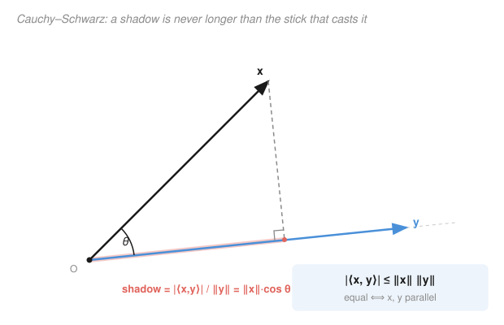

# Functional Analysis · Lesson 2.1: Inner products and the Cauchy–Schwarz inequality

> ⏱ ~15 min · Module 2: Hilbert spaces — the geometry of quantum mechanics · Builds on: [1.4 Finite vs infinite dimensions](01-04-finite-vs-infinite-dimensions.md) · Unlocks: [2.2 Orthogonality and the projection theorem](02-02-orthogonality-projection-theorem.md)

## Why this matters

A norm tells you how *long* a vector is. That's already a lot — it gave us Banach spaces in Module 1 — but it's geometrically blind: it can't tell you the *angle* between two vectors, whether they're perpendicular, or how much of one points along another. Quantum mechanics runs entirely on those missing notions: a state is a unit vector, a measurement probability is $|\langle \phi \mid \psi \rangle|^2$, and the whole formalism of bras and kets is one big inner product. This lesson adds the single extra structure — the inner product — that turns length into full geometry, and it proves the one inequality, Cauchy–Schwarz, that makes "angle" even make sense.

## The idea

Back in linear algebra the dot product $x \cdot y = \sum x_i y_i$ did two jobs at once: it measured length (via $x \cdot x = |x|^2$) and it measured *alignment* ($x \cdot y = |x||y|\cos\theta$). An **inner product** is exactly that second job, promoted to an axiom and allowed to live in any vector space — including infinite-dimensional ones like $\ell^2$ and $L^2$.

Here's the picture to hold onto. Given two vectors $x$ and $y$, shine a light straight down onto the line through $y$ and look at the shadow $x$ casts on it. The length of that shadow is $|\langle x, y\rangle|/\|y\|$. A shadow can never be longer than the stick casting it — the shadow is longest when $x$ already lies flat along $y$, and shortest (zero) when $x$ stands perpendicular. Write that single geometric fact in symbols and you get the **Cauchy–Schwarz inequality**: $|\langle x, y\rangle| \le \|x\|\,\|y\|$. Everything else in Hilbert-space geometry — angles, orthogonality, Fourier coefficients, uncertainty bounds — is downstream of this one shadow.

## The formal version

**Inner product.** On a complex vector space $H$, an inner product $\langle \cdot, \cdot \rangle : H \times H \to \mathbb{C}$ satisfies, for all $x, y, z \in H$ and scalars $\alpha \in \mathbb{C}$:

1. **Conjugate symmetry:** $\langle x, y\rangle = \overline{\langle y, x\rangle}$.
2. **Linearity in the second slot:** $\langle x,\, \alpha y + z\rangle = \alpha\langle x, y\rangle + \langle x, z\rangle$.
3. **Positive-definiteness:** $\langle x, x\rangle \ge 0$, with $\langle x, x\rangle = 0 \iff x = 0$.

*In words:* it's a way of multiplying two vectors into a number that is (1) symmetric up to a complex conjugate, (2) linear when you scale or add in one slot, and (3) never negative when you feed it a vector twice — and only zero for the zero vector.

**A convention warning, stated once and obeyed forever.** I put linearity in the **second** slot — the physicist's choice, so that in Dirac notation $\langle \phi \mid \psi\rangle$ is linear in the ket $\psi$ and conjugate-linear in the bra $\phi$. Mathematicians usually put linearity in the *first* slot instead. The two differ only by which argument carries the conjugate; every theorem below holds either way. We use the physics convention throughout this course. (Over $\mathbb{R}$ the conjugate does nothing, so both conventions collapse to the ordinary symmetric dot product.)

Note conjugate symmetry makes property 3 sensible: $\langle x, x\rangle = \overline{\langle x, x\rangle}$ forces $\langle x, x\rangle$ to be real, so "$\ge 0$" has meaning.

**Induced norm.** Define $\|x\| = \sqrt{\langle x, x\rangle}$. *In words:* length is the square root of a vector dotted with itself — the Pythagorean recipe, exactly as in $\mathbb{R}^n$.

**Cauchy–Schwarz inequality.** For all $x, y \in H$,
$$|\langle x, y\rangle| \le \|x\|\,\|y\|,$$
with equality **if and only if** $x$ and $y$ are linearly dependent (one is a scalar multiple of the other). *In words:* the inner product of two vectors never exceeds the product of their lengths, and hits that ceiling exactly when the vectors point along the same line.

**Angle and orthogonality.** Because Cauchy–Schwarz guarantees $\dfrac{\operatorname{Re}\langle x, y\rangle}{\|x\|\,\|y\|} \in [-1, 1]$, we may *define* the angle by $\cos\theta = \dfrac{\operatorname{Re}\langle x, y\rangle}{\|x\|\,\|y\|}$, and call $x, y$ **orthogonal** (written $x \perp y$) when $\langle x, y\rangle = 0$. *In words:* the inequality is precisely what makes "the cosine of the angle" a legal number instead of nonsense, so it is Cauchy–Schwarz that lets us do geometry at all.

**Parallelogram law.** Any inner-product norm satisfies
$$\|x + y\|^2 + \|x - y\|^2 = 2\|x\|^2 + 2\|y\|^2.$$
*In words:* the two diagonals of a parallelogram and its two side-pairs are locked together — the sum of the squared diagonals equals twice the sum of the squared sides. The deep fact (its **converse**) is that this identity is the *exact test*: a norm arises from some inner product **if and only if** it obeys the parallelogram law.

**Hilbert space.** A **Hilbert space** is an inner-product space that is **complete** in its induced norm (every Cauchy sequence converges — the property from [1.1](01-01-metric-spaces-completeness.md)). Without completeness you have a *pre-Hilbert* (inner-product) space; with it, the analysis works. $\ell^2$ and $L^2$ are Hilbert spaces; the sup-norm spaces $C[a,b]$ and $\ell^\infty$ are complete but, as we'll see, not inner-product spaces at all.

## Picture

## Worked examples

**Example 1 (why Cauchy–Schwarz is true — the one-parameter shadow trick).** Assume $y \neq 0$ (if $y = 0$ both sides are $0$). Positive-definiteness says that for *any* scalar $t$,
$$0 \le \|x - ty\|^2 = \langle x - ty,\, x - ty\rangle.$$
Expand using linearity in the second slot and conjugate symmetry. Take $t$ real for a moment and $x, y$ in a real space to keep the algebra clean:
$$0 \le \|x\|^2 - 2t\,\langle x, y\rangle + t^2\|y\|^2.$$
This is an upward parabola in $t$ that never dips below $0$, so it's minimized where its derivative vanishes: $t_\star = \dfrac{\langle x, y\rangle}{\|y\|^2}$ (this $t_\star$ is exactly the shadow's coefficient — the amount of $y$ inside $x$). Plug $t_\star$ back in:
$$0 \le \|x\|^2 - \frac{\langle x, y\rangle^2}{\|y\|^2}.$$
Multiply through by $\|y\|^2 > 0$ and rearrange: $\langle x, y\rangle^2 \le \|x\|^2\|y\|^2$, i.e. $|\langle x, y\rangle| \le \|x\|\,\|y\|$. **Equality** forces $\|x - t_\star y\|^2 = 0$, so $x = t_\star y$ by positive-definiteness — the vectors are linearly dependent, exactly the equality case. (In a complex space, replace $t_\star y$ by $\frac{\langle y,x\rangle}{\|y\|^2}y$; the same computation goes through with conjugates tracked.)

**Example 2 (which spaces are actually Hilbert — the parallelogram test).** The parallelogram law is a free consequence of the inner-product axioms (expand both squared norms and watch the cross terms cancel), so *every* $L^2$ or $\ell^2$ norm passes it automatically. The question is whether other famous norms do.

Take $C[0,1]$ with the sup norm $\|f\|_\infty = \max_{t\in[0,1]}|f(t)|$, and test $f(t) = 1$ and $g(t) = t$:

- $\|f\|_\infty = 1$, so $2\|f\|_\infty^2 = 2$; $\|g\|_\infty = 1$, so $2\|g\|_\infty^2 = 2$. Right-hand side $= 2 + 2 = 4$.
- $f + g = 1 + t$, max at $t=1$: $\|f+g\|_\infty = 2$, squared $= 4$.
- $f - g = 1 - t$, max at $t=0$: $\|f-g\|_\infty = 1$, squared $= 1$. Left-hand side $= 4 + 1 = 5$.

Since $5 \ne 4$, the parallelogram law **fails**, so by the converse the sup norm on $C[0,1]$ comes from *no* inner product — there is no way to define angles compatibly with it. Sup-norm spaces are Banach but never Hilbert. The same computation, done with $\ell^p$ sequences, shows $\ell^p$ and $L^p$ are Hilbert spaces **only** for $p = 2$; that single exponent is what makes $L^2$ the home of quantum mechanics and Fourier analysis.

## Watch out

- **You might think** $\langle x, y\rangle = \langle y, x\rangle$ like the real dot product, **but** in a complex space they're conjugates: $\langle x, y\rangle = \overline{\langle y, x\rangle}$. Swapping the arguments flips the sign of the imaginary part — it matters the moment your scalars are complex, which in QM is always.
- **You might think** the linear slot is a matter of taste you can ignore, **but** mixing conventions mid-calculation puts a conjugate on the wrong vector and silently corrupts every coefficient. Pick one (we use *linear in the second slot*) and never switch inside a computation.
- **You might think** every norm secretly comes from an inner product, **but** the parallelogram law is the exact gatekeeper — $\ell^p$ and $L^p$ fail it for all $p \ne 2$. Length alone does not buy you angles.
- **You might think** "inner-product space" and "Hilbert space" are synonyms, **but** Hilbert demands **completeness** on top. The rational-coefficient polynomials under the $L^2$ inner product form an inner-product space whose Cauchy sequences can escape it — a pre-Hilbert space, not a Hilbert one.

## One-liner

> An inner product is the dot product promoted to an axiom; Cauchy–Schwarz says a shadow never outruns its stick, and that single fact is what lets you speak of angles, orthogonality, and — with completeness added — a Hilbert space.

## Problems

**P1 (🟢)** In $\mathbb{R}^3$ with the standard dot product, let $x = (1, 2, 2)$ and $y = (2, 0, 1)$. Verify the Cauchy–Schwarz inequality numerically and find the angle $\theta$ between $x$ and $y$.

**P2 (🟡)** In $\ell^2$, let $x = (1, \tfrac{1}{2}, \tfrac{1}{4}, \tfrac{1}{8}, \dots)$ (so $x_n = 2^{-(n-1)}$) and $y = (\tfrac{1}{2}, \tfrac{1}{4}, \tfrac{1}{8}, \dots)$ (so $y_n = 2^{-n}$). Using $\langle x, y\rangle = \sum_{n\ge 1} \overline{x_n}\,y_n$ (real here), compute $\langle x, y\rangle$, $\|x\|$, $\|y\|$, and confirm Cauchy–Schwarz. Is equality attained? Explain geometrically.

**P3 (🔴, optional)** *(Bridge to probability.)* For real random variables $X, Y$ with finite variance and mean zero, define $\langle X, Y\rangle = \mathbb{E}[XY]$. Assuming this is an inner product on the space of such variables, write out what Cauchy–Schwarz says in terms of covariance and standard deviations, and deduce the bound $|\rho_{X,Y}| \le 1$ on the correlation coefficient. What does the equality case say about $X$ and $Y$?

Solutions

**P1** Compute the pieces. $\langle x, y\rangle = (1)(2) + (2)(0) + (2)(1) = 4$. Lengths: $\|x\| = \sqrt{1 + 4 + 4} = \sqrt{9} = 3$ and $\|y\| = \sqrt{4 + 0 + 1} = \sqrt{5}$. Cauchy–Schwarz check: $|\langle x, y\rangle| = 4$ and $\|x\|\|y\| = 3\sqrt{5} \approx 6.71$, so $4 \le 6.71$ ✓ (strict, since $x$ and $y$ aren't parallel). Angle:
$$\cos\theta = \frac{\langle x, y\rangle}{\|x\|\|y\|} = \frac{4}{3\sqrt{5}} \approx 0.596, \qquad \theta \approx 53.4^\circ.$$

**P2** These are geometric series. Inner product:
$$\langle x, y\rangle = \sum_{n\ge 1} 2^{-(n-1)}\,2^{-n} = \sum_{n\ge 1} 2^{1-2n} = 2\sum_{n\ge1} 4^{-n} = 2\cdot\frac{1/4}{1 - 1/4} = 2\cdot\frac{1}{3} = \frac{2}{3}.$$
Norms:
$$\|x\|^2 = \sum_{n\ge1} 4^{-(n-1)} = \frac{1}{1 - 1/4} = \frac{4}{3}, \quad \|x\| = \frac{2}{\sqrt3};\qquad \|y\|^2 = \sum_{n\ge1} 4^{-n} = \frac{1/4}{3/4} = \frac13, \quad \|y\| = \frac{1}{\sqrt3}.$$
Then $\|x\|\|y\| = \frac{2}{\sqrt3}\cdot\frac{1}{\sqrt3} = \frac{2}{3}$. So $|\langle x, y\rangle| = \frac23 = \|x\|\|y\|$ — **equality holds**. Geometrically it must: $y = \tfrac12 x$ (each $y_n = 2^{-n} = \tfrac12 \cdot 2^{-(n-1)} = \tfrac12 x_n$), so the vectors are linearly dependent — the shadow of $x$ *is* all of the line, angle zero.

**P3** With $\langle X, Y\rangle = \mathbb{E}[XY]$ and mean zero, $\operatorname{Cov}(X,Y) = \mathbb{E}[XY] = \langle X, Y\rangle$, while $\|X\|^2 = \mathbb{E}[X^2] = \operatorname{Var}(X) = \sigma_X^2$ and likewise $\|Y\| = \sigma_Y$. Cauchy–Schwarz $|\langle X, Y\rangle| \le \|X\|\|Y\|$ reads
$$|\operatorname{Cov}(X, Y)| \le \sigma_X\,\sigma_Y.$$
Dividing by $\sigma_X\sigma_Y$ gives $|\rho_{X,Y}| = \dfrac{|\operatorname{Cov}(X,Y)|}{\sigma_X\sigma_Y} \le 1$ — the correlation coefficient is trapped in $[-1, 1]$, which is *why* correlation is a meaningful "cosine." Equality $|\rho| = 1$ is the linear-dependence case: $Y = cX$ almost surely for some constant $c$ — the two variables are perfectly linearly related (positively if $\rho = 1$, negatively if $\rho = -1$).

## Flashback

**From Lesson 1.1 (Metric spaces and completeness):** Show that the sequence space $c_{00}$ of eventually-zero real sequences, equipped with the $\ell^2$ norm $\|a\| = \big(\sum_n a_n^2\big)^{1/2}$, is **not** complete, by exhibiting a Cauchy sequence in it whose limit lands outside $c_{00}$.

Solution

Define $a^{(k)} = (1, \tfrac12, \tfrac13, \dots, \tfrac1k, 0, 0, \dots)$ — the harmonic sequence truncated after $k$ terms, which is eventually zero, so $a^{(k)} \in c_{00}$. For $m > k$,
$$\|a^{(m)} - a^{(k)}\|^2 = \sum_{n=k+1}^{m} \frac{1}{n^2} \le \sum_{n=k+1}^{\infty} \frac{1}{n^2} \xrightarrow[k\to\infty]{} 0,$$
since $\sum 1/n^2$ converges (the tail of a convergent series vanishes). So $(a^{(k)})$ is Cauchy in the $\ell^2$ norm. Its natural limit is $a = (1, \tfrac12, \tfrac13, \dots)$, which lies in $\ell^2$ (because $\sum 1/n^2 = \pi^2/6 < \infty$) but has **no** zero entries — it is *not* eventually zero, so $a \notin c_{00}$. A Cauchy sequence with no limit inside the space: $c_{00}$ is incomplete. (Its completion is exactly $\ell^2$ — the Hilbert space this module lives in.)

## Connections

- **Backward:** the inner product is the extra structure layered on the norms of [1.2](01-02-normed-banach-spaces.md); $\ell^2$ and $L^2$ from [1.3](01-03-standard-examples-lp-c-lp.md) are precisely the $p = 2$ stars that pass the parallelogram test, and completeness is the [1.1](01-01-metric-spaces-completeness.md) condition that upgrades an inner-product space to Hilbert.
- **Forward:** orthogonality ($\langle x, y\rangle = 0$) defined here is the engine of [2.2](02-02-orthogonality-projection-theorem.md)'s projection theorem, then of orthonormal bases and Fourier series in [2.3](02-03-orthonormal-bases-fourier.md), and the inner product itself becomes the star of the [2.4](02-04-riesz-representation.md) Riesz representation theorem.
- **Sideways (quantum mechanics):** $\langle \phi \mid \psi\rangle$ *is* this inner product — states are unit vectors in a Hilbert space, transition probabilities are $|\langle\phi\mid\psi\rangle|^2$, and Cauchy–Schwarz is the inequality behind the Heisenberg uncertainty bound. See [quantum-mechanics](../../quantum-mechanics/syllabus.md).
- **Sideways (linear algebra):** this is the dot product of [linalg-refresher](../../linalg-refresher/syllabus.md) generalized — same $\cos\theta = \langle x,y\rangle/(\|x\|\|y\|)$, now legal in infinite dimensions.
- **Sideways (probability):** covariance $\mathbb{E}[XY]$ is an inner product on mean-zero random variables (P3), and Cauchy–Schwarz there is exactly the statement $|\rho| \le 1$ that correlation is a cosine. See [probability-theory](../../probability-theory/syllabus.md).
