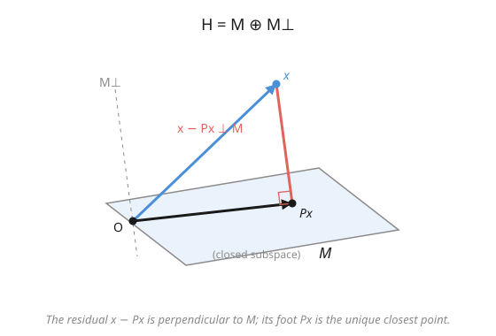

# Functional Analysis · Lesson 2.2: Orthogonality and the projection theorem

> ⏱ ~15 min · Module 2: Hilbert spaces — the geometry of quantum mechanics · Builds on: [2.1 Inner products and the Cauchy–Schwarz inequality](02-01-inner-products-cauchy-schwarz.md) · Unlocks: [2.3 Orthonormal bases and Fourier expansions](02-03-orthonormal-bases-fourier.md)

## Why this matters

"What's the closest point in this subspace to my vector?" is one question wearing a hundred costumes. Fit a line to data by least squares: you are projecting the observations onto the subspace of fitted values. Predict a random variable from partial information: conditional expectation $E[X\mid\mathcal{G}]$ is the projection of $X$ onto the subspace of things you can already see. Measure a quantum state: measurement collapses it onto an eigenspace — an orthogonal projection. Every one of these is the same theorem, and the theorem is pure geometry: **drop a perpendicular from the point to the subspace, and the foot of that perpendicular is the answer.** What makes it a *theorem* rather than a picture is that infinite dimensions can break it — unless the space is complete.

## The idea

Stand at a point $x$ off a flat floor $M$. Where on the floor is closest to you? Directly *below* — the point you'd hit dropping a plumb line straight down. The line from you to that foot is perpendicular to the floor, and any other route to the floor is longer because it picks up sideways distance you didn't need (Pythagoras charges you for it).

That is the whole content. Given a vector $x$ and a subspace $M$, the nearest point $Px$ in $M$ is the one where the leftover $x - Px$ sticks out **perpendicular** to $M$. Perpendicularity and closeness are the same fact seen twice: the residual is orthogonal *because* it's shortest, and shortest *because* it's orthogonal.

Two things can go wrong in infinite dimensions, and both are about the floor having holes. If $M$ isn't **closed** — if it has a "missing edge" you can approach but never reach — the closest point can fail to exist: you get arbitrarily near but there's nothing there to land on. And even for a genuinely closed $M$ you need the ambient space to be **complete** (a Hilbert space), so that the sequence of ever-better approximations actually converges to something. Get both, and the plumb line always lands.

## The formal version

Throughout, $H$ is a Hilbert space (a complete inner-product space, from [2.1](02-01-inner-products-cauchy-schwarz.md)) with inner product $\langle\cdot,\cdot\rangle$ and norm $\|x\| = \sqrt{\langle x,x\rangle}$.

**Orthogonal complement.** For any subset $M \subseteq H$,
$$M^\perp = \{\, x \in H : \langle x, m\rangle = 0 \text{ for all } m \in M \,\}.$$
In words: $M^\perp$ is everything perpendicular to *all* of $M$ at once. It is always a **closed subspace** — even when $M$ itself is neither closed nor a subspace — because it's an intersection of the closed sets $\{x : \langle x,m\rangle = 0\}$, one per $m$, and each is closed by continuity of the inner product.

**The projection theorem.** Let $M$ be a **closed** subspace of a Hilbert space $H$. Then for every $x \in H$ there is a **unique** point $Px \in M$ minimizing the distance,
$$\|x - Px\| = \min_{m \in M}\|x - m\|,$$
and it is characterized by orthogonality of the residual:
$$x - Px \perp M, \qquad\text{i.e.}\qquad \langle x - Px,\, m\rangle = 0 \ \text{ for all } m \in M.$$
In words: the closest point exists, there's exactly one, and it's exactly the point whose error vector is perpendicular to the subspace.

**Orthogonal decomposition.** Consequently
$$H = M \oplus M^\perp:$$
every $x \in H$ writes **uniquely** as $x = Px + (x - Px)$ with $Px \in M$ and $x - Px \in M^\perp$. In words: a closed subspace and its perpendicular complement together tile the whole space, with no overlap ($M \cap M^\perp = \{0\}$, since a vector orthogonal to itself has $\|x\|^2 = 0$).

**The projection operator.** The map $P : H \to M$, $x \mapsto Px$, is:
- **linear**;
- **idempotent**: $P^2 = P$ (projecting an already-projected point does nothing — it's already in $M$);
- **self-adjoint**: $\langle Px, y\rangle = \langle x, Py\rangle$ for all $x, y$;
- of **norm** $\|P\| = 1$ whenever $M \neq \{0\}$ (it can't lengthen a vector — $\|Px\| \le \|x\|$ by Pythagoras — and it fixes $M$, so the bound is achieved).

In words: orthogonal projection is the linear operator that keeps the $M$-part and discards the perpendicular part; $P^2=P$ *and* self-adjointness together are exactly what "orthogonal" (as opposed to slanted) means.

## Picture

## Worked examples

**Example 1 (mechanical — projecting onto an orthonormal span).** Work in $\mathbb{R}^3$ (a Hilbert space) with the usual dot product. Let
$$e_1 = \tfrac{1}{\sqrt2}(1,1,0), \qquad e_2 = (0,0,1),$$
which are **orthonormal** ($\langle e_1,e_1\rangle = \tfrac12(1+1+0)=1$, likewise $\langle e_2,e_2\rangle=1$, and $\langle e_1,e_2\rangle = 0$). Let $M = \operatorname{span}\{e_1,e_2\}$ — this is closed (every finite-dimensional subspace is). Project $x = (2, 4, 5)$.

For an **orthonormal** spanning set the projection is just the sum of coordinate-wise shadows:
$$Px = \langle x, e_1\rangle\, e_1 + \langle x, e_2\rangle\, e_2.$$
Compute the coefficients:
$$\langle x, e_1\rangle = \tfrac{1}{\sqrt2}(2 + 4 + 0) = \tfrac{6}{\sqrt2} = 3\sqrt2, \qquad \langle x, e_2\rangle = 5.$$
So
$$Px = 3\sqrt2 \cdot \tfrac{1}{\sqrt2}(1,1,0) + 5\,(0,0,1) = (3,3,0) + (0,0,5) = (3,3,5).$$
**Verify the residual is orthogonal to $M$:** $x - Px = (2,4,5) - (3,3,5) = (-1, 1, 0)$. Then
$$\langle x - Px, e_1\rangle = \tfrac{1}{\sqrt2}(-1 + 1 + 0) = 0, \qquad \langle x - Px, e_2\rangle = 0. \ \checkmark$$
The error points purely "sideways" to the subspace, as the theorem promises. (This coordinate-wise formula is exactly what [2.3](02-03-orthonormal-bases-fourier.md) turns into Fourier expansion — an ONB is just enough orthonormal axes to make $Px = x$.)

**Example 2 (why it's a theorem — existence and uniqueness of the closest point).** *Claim:* in a Hilbert space $H$, any closed subspace $M$ contains a unique nearest point to a given $x$. *Proof, powered by the parallelogram law from [2.1](02-01-inner-products-cauchy-schwarz.md).*

Let $d = \inf_{m\in M}\|x - m\|$ and pick a **minimizing sequence** $m_n \in M$ with $\|x - m_n\| \to d$. Apply the parallelogram law $\|u+v\|^2 + \|u-v\|^2 = 2\|u\|^2 + 2\|v\|^2$ to $u = m_n - x$ and $v = m_k - x$:
$$\|m_n + m_k - 2x\|^2 + \|m_n - m_k\|^2 = 2\|m_n - x\|^2 + 2\|m_k - x\|^2.$$
Rearrange for the gap between the two approximants:
$$\|m_n - m_k\|^2 = 2\|m_n - x\|^2 + 2\|m_k - x\|^2 - 4\left\|\tfrac{m_n + m_k}{2} - x\right\|^2.$$
Now the key: $\tfrac{m_n+m_k}{2} \in M$ (subspaces are closed under averaging), so its distance to $x$ is at least $d$, making the subtracted term $\ge 4d^2$. Hence
$$\|m_n - m_k\|^2 \le 2\|m_n - x\|^2 + 2\|m_k - x\|^2 - 4d^2 \xrightarrow{n,k\to\infty} 2d^2 + 2d^2 - 4d^2 = 0.$$
So $(m_n)$ is **Cauchy**. Here every hypothesis earns its keep: **completeness** of $H$ gives a limit $m_n \to Px$, and **closedness** of $M$ guarantees $Px \in M$. Continuity of the norm gives $\|x - Px\| = d$ — the minimum is attained.

**Uniqueness:** if $m, m'$ both achieve distance $d$, run the same identity with $u = m-x$, $v = m'-x$: $\|m - m'\|^2 \le 2d^2 + 2d^2 - 4d^2 = 0$, so $m = m'$. (This is strict convexity of the ball doing its job: two distinct closest points would let their midpoint be strictly closer, a contradiction.) $\blacksquare$

## Watch out

- **You might think** any subspace has a closest point, **but** it must be **closed**. In $\ell^2$, let $M$ be the finitely-supported sequences (all but finitely many terms zero) — a genuine subspace, but *not* closed. Take $x = (1, \tfrac12, \tfrac13, \dots) \in \ell^2$. Truncations of $x$ live in $M$ and approach $x$ as closely as you like, so $\inf_{m\in M}\|x-m\| = 0$, yet $x \notin M$: there is **no** nearest point. The plumb line has no floor to land on.
- **You might think** completeness is a technicality, **but** it's the load-bearing wall. The minimizing sequence is Cauchy no matter what; without completeness its limit may simply not exist in the space, and the "closest point" evaporates. Hilbert (not merely inner-product) is the hypothesis for a reason.
- **You might think** $P^2 = P$ makes $P$ an *orthogonal* projection, **but** idempotence alone only gives an oblique projection — one that projects along some slanted direction (think of casting a shadow with the sun low on the horizon). You need **$P^2 = P$ *and* self-adjoint** ($P = P^*$) for the projection direction to be perpendicular. These two conditions together are the algebraic fingerprint of orthogonal projection.
- **You might think** $H = M \oplus M^\perp$ and $(M^\perp)^\perp = M$ hold for any subspace, **but** both need $M$ **closed**. In general $(M^\perp)^\perp = \overline{M}$, the *closure* of $M$ — taking the complement twice recovers exactly the closed hull, no more.

## One-liner

> The closest point in a closed subspace is the one whose error is perpendicular to it — and in a Hilbert space that plumb line always lands, splitting $H = M \oplus M^\perp$.

## Problems

**P1 (🟢)** In $\mathbb{R}^3$ with the dot product, let $M = \{(a, b, 0) : a, b \in \mathbb{R}\}$, the $xy$-plane. Find the orthogonal projection $Px$ of $x = (3, -1, 7)$ onto $M$, identify the residual $x - Px$, and verify it lies in $M^\perp$. What is $M^\perp$ here?

**P2 (🟡)** Let $P$ be the orthogonal projection onto a closed subspace $M \neq \{0\}$. Prove the **Pythagorean split** $\|x\|^2 = \|Px\|^2 + \|x - Px\|^2$, and use it to conclude $\|Px\| \le \|x\|$ (hence $\|P\| \le 1$). Where did orthogonality enter?

**P3 (🔴, optional)** Let $M$ be a closed subspace of a Hilbert space and $P$ its orthogonal projection. Show that $I - P$ is the orthogonal projection onto $M^\perp$. (Check idempotence, that its range is $M^\perp$, and self-adjointness.) This is the operator form of "keep the perpendicular part instead."

Solutions

**P1** The $xy$-plane is spanned by the orthonormal pair $e_1 = (1,0,0)$, $e_2 = (0,1,0)$, so
$$Px = \langle x, e_1\rangle e_1 + \langle x, e_2\rangle e_2 = 3\,(1,0,0) + (-1)\,(0,1,0) = (3, -1, 0).$$
(Geometrically: just zero out the $z$-coordinate.) The residual is $x - Px = (0, 0, 7)$. Check orthogonality: $\langle (0,0,7), (a,b,0)\rangle = 0$ for every $(a,b,0)\in M$. $\checkmark$ So $x - Px \in M^\perp$, and $M^\perp = \{(0,0,c) : c\in\mathbb{R}\}$ — the $z$-axis. Indeed $\mathbb{R}^3 = (xy\text{-plane}) \oplus (z\text{-axis})$.

**P2** Write $x = Px + (x - Px)$ with $Px \in M$ and $x - Px \in M^\perp$, so $\langle Px, x - Px\rangle = 0$. Then
$$\|x\|^2 = \langle Px + (x-Px),\, Px + (x-Px)\rangle = \|Px\|^2 + 2\underbrace{\langle Px, x-Px\rangle}_{=\,0} + \|x - Px\|^2 = \|Px\|^2 + \|x-Px\|^2.$$
The cross term vanishing is precisely where **orthogonality** enters — without it Pythagoras fails and there'd be an extra $2\langle Px, x-Px\rangle$. Since $\|x-Px\|^2 \ge 0$, we get $\|Px\|^2 \le \|x\|^2$, i.e. $\|Px\| \le \|x\|$ for all $x$, so $\|P\| = \sup_{x\ne 0}\|Px\|/\|x\| \le 1$. (Equality holds because $P$ fixes any nonzero $m \in M$: $\|Pm\| = \|m\|$.)

**P3** Let $Q = I - P$.
- *Idempotent:* $Q^2 = (I-P)(I-P) = I - 2P + P^2 = I - 2P + P = I - P = Q$, using $P^2 = P$.
- *Range is $M^\perp$:* for any $x$, $Qx = x - Px$, which lies in $M^\perp$ by the projection theorem. Conversely if $y \in M^\perp$ then $Py = 0$ (its nearest point in $M$ is $0$, since $y \perp M$), so $Qy = y$ — thus $Q$ fixes $M^\perp$ and $\operatorname{ran}Q = M^\perp$.
- *Self-adjoint:* $Q^* = (I - P)^* = I - P^* = I - P = Q$, using $P^* = P$.

Idempotent + self-adjoint + range $M^\perp$ $\Rightarrow$ $Q = I - P$ is the orthogonal projection onto $M^\perp$. This mirrors the decomposition $x = Px + (I-P)x$ into its $M$- and $M^\perp$-parts. $\blacksquare$

## Flashback

**From Lesson 2.1 (Inner products and the Cauchy–Schwarz inequality):** A student claims the formula $\|x\|_\infty = \max_i |x_i|$ on $\mathbb{R}^2$ comes from an inner product. Test it with the **parallelogram law** on $u = (1,0)$ and $v = (0,1)$, and state the verdict.

Solution

An inner-product norm must satisfy $\|u+v\|^2 + \|u-v\|^2 = 2\|u\|^2 + 2\|v\|^2$. Compute in the max-norm: $u+v = (1,1)$ and $u-v = (1,-1)$, so $\|u+v\|_\infty = 1$ and $\|u-v\|_\infty = 1$, giving a left side of $1^2 + 1^2 = 2$. But $\|u\|_\infty = \|v\|_\infty = 1$, so the right side is $2(1) + 2(1) = 4$. Since $2 \neq 4$, the parallelogram law **fails**, so $\|\cdot\|_\infty$ does **not** arise from any inner product. (Only inner-product norms obey the parallelogram law — it's the exact fingerprint, and it's what powered the closest-point proof above.)

## Connections

- **Backward:** the whole proof runs on [2.1](02-01-inner-products-cauchy-schwarz.md)'s **parallelogram law** and on completeness making the minimizing sequence converge — 2.1 built the inner-product geometry; 2.2 is its first big payoff.
- **Forward:** [2.3](02-03-orthonormal-bases-fourier.md) reads Fourier expansion as projecting onto each orthonormal axis (Example 1, iterated over a full basis); [2.4](02-04-riesz-representation.md) proves the **Riesz representation theorem** by projecting onto the closed subspace $\ker f$ of a bounded functional. Self-adjoint projections return as **spectral projections** in [4.4](04-04-spectral-theorem-compact-self-adjoint.md) and [4.5](04-05-bounded-self-adjoint-spectral-theorem.md).
- **Sideways (quantum mechanics):** a measurement **collapses** a state vector onto the eigenspace of the observed value — literally the orthogonal projection $P_\lambda|\psi\rangle$ (up to normalization), and $\|P_\lambda|\psi\rangle\|^2$ is the Born-rule probability. See [quantum-mechanics](../../quantum-mechanics/syllabus.md).
- **Sideways (probability / stochastic calculus):** **conditional expectation** $E[X\mid\mathcal{G}]$ *is* the orthogonal projection of $X$ onto the closed subspace $L^2(\mathcal{G})$ of $\mathcal{G}$-measurable square-integrable random variables — the "best prediction of $X$ from the information $\mathcal{G}$" is the nearest point. That is why it inherits linearity and the tower property. See [stochastic-calculus](../../stochastic-calculus/syllabus.md).
- **Sideways (statistics):** **least-squares regression** fits $\hat\beta$ by projecting the response vector onto the column space of the design matrix; the normal equations $X^\top(y - X\hat\beta) = 0$ are exactly "residual $\perp$ subspace."
- See the [course syllabus](../syllabus.md) for where Module 2 heads next.
