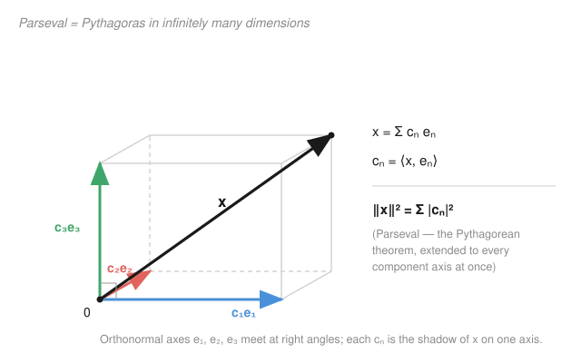

# Functional Analysis · Lesson 2.3: Orthonormal bases and Fourier expansions

> ⏱ ~15 min · Module 2: Hilbert spaces — the geometry of quantum mechanics · Builds on: [2.2 Orthogonality and the projection theorem](02-02-orthogonality-projection-theorem.md) · Unlocks: [2.4 The Riesz representation theorem](02-04-riesz-representation.md)

## Why this matters

In finite dimensions you take a basis for granted: pick axes, read off coordinates, do everything component by component. The whole engine of quantum mechanics — write a state as a superposition of energy eigenstates, and $|c_n|^2$ is the probability of measuring energy $E_n$ — is exactly this move in an *infinite*-dimensional Hilbert space. But infinity breaks the naïve picture: you can't take finite linear combinations of a countable basis and hope to reach every vector, and "the components determine the vector" stops being automatic. This lesson rebuilds coordinates for $\infty$ dimensions. The payoff is that the Fourier series you met in [pdes](../../pdes/syllabus.md) turns out to be nothing more exotic than *writing a function in an orthonormal basis* — and Parseval's identity is the Pythagorean theorem with infinitely many legs.

## The idea

An **orthonormal set** $\{e_n\}$ is a collection of unit vectors, mutually perpendicular — the $\infty$-dimensional version of coordinate axes. Given any $x$, its **coordinate along $e_n$** is the number

$$c_n = \langle x, e_n\rangle,$$

the length of the shadow $x$ casts on that axis. From [2.2](02-02-orthogonality-projection-theorem.md) you already know what this shadow *is*: $c_n e_n$ is the orthogonal projection of $x$ onto the line through $e_n$, the closest point on that axis to $x$. The Fourier coefficients are just projections, one per axis.

Now stack the projections. Add up $\sum_n c_n e_n$ and you get a candidate reconstruction of $x$. Two questions decide everything:

1. **Do the shadows overshoot?** No — the total energy in the shadows can never exceed the energy of $x$ itself. That's **Bessel's inequality**, $\sum |c_n|^2 \le \|x\|^2$, and it holds *always*, for any orthonormal set, complete or not.
2. **Do the shadows recover $x$ exactly?** Only if the axes are *enough* to span the space. When they are — when $\sum |c_n|^2 = \|x\|^2$ for every $x$ — the set is called **complete**, an **orthonormal basis**, and $x = \sum_n c_n e_n$. There's no leftover, no piece of $x$ hiding perpendicular to all your axes.

The equality $\|x\|^2 = \sum |c_n|^2$ is **Parseval's identity**, and it is literally Pythagoras: the squared length of a vector is the sum of the squares of its components — now with countably many components instead of three.

## The formal version

Let $H$ be a Hilbert space and $\{e_n\}_{n=1}^\infty$ an **orthonormal set**: $\langle e_i, e_j\rangle = \delta_{ij}$ (equal to $1$ if $i=j$, else $0$).

**Fourier coefficients and Bessel.** For $x \in H$, set $c_n = \langle x, e_n\rangle$. Then

$$\sum_{n} |c_n|^2 \;\le\; \|x\|^2.$$

*In words:* the components of $x$ carry no more "energy" than $x$ has; the projections never add up to more than the whole. (In particular $\sum |c_n|^2$ converges and $c_n \to 0$.)

**Completeness — four equivalent conditions.** The orthonormal set $\{e_n\}$ is called an **orthonormal basis** (equivalently a *Hilbert basis* or *Schauder basis*) when any one — hence all — of these hold:

- **(Parseval)** $\displaystyle \sum_n |c_n|^2 = \|x\|^2$ for every $x \in H$;
- **(Expansion)** $\displaystyle x = \sum_n c_n e_n$ for every $x$, the series converging in norm ($\big\| x - \sum_{n\le N} c_n e_n\big\| \to 0$);
- **(No blind spot)** the only vector orthogonal to *every* $e_n$ is $0$;
- **(Dense span)** finite linear combinations of the $e_n$ are dense in $H$.

*In words:* "complete" means the axes leave no direction uncovered — nothing but the zero vector is invisible to all of them, and every vector is the (infinite) sum of its shadows.

**You can always build one.** **Gram–Schmidt** turns any linearly independent set $\{v_1, v_2, \dots\}$ into an orthonormal set with the same span: subtract off the projections onto what you've already orthonormalized, then normalize,

$$u_k = v_k - \sum_{j<k} \langle v_k, e_j\rangle\, e_j, \qquad e_k = \frac{u_k}{\|u_k\|}.$$

*In words:* strip out everything $v_k$ already has in common with earlier axes, keep the genuinely new direction, scale it to length one.

**The master theorem.** Every **separable** Hilbert space (one with a countable dense subset) has a countable orthonormal basis, and is **isometrically isomorphic to $\ell^2$**: the map $x \mapsto (c_n)$ sends $H$ onto $\ell^2$ preserving norms and inner products. *In words:* up to renaming, there is only one infinite-dimensional separable Hilbert space, and it is the sequence space $\ell^2$ — coordinates turn every such $H$ into $\ell^2$.

The prototype: on $L^2[-\pi,\pi]$ with $\langle f,g\rangle = \int_{-\pi}^\pi f\,\overline{g}\,dx$, the functions $e_n(x) = \dfrac{e^{inx}}{\sqrt{2\pi}}$ for $n \in \mathbb{Z}$ form an orthonormal basis. The expansion $f = \sum_n c_n e_n$ **is** the Fourier series.

## Picture

## Worked examples

**Example 1 (mechanical → a famous sum by Parseval).** Expand $f(x) = x$ on $[-\pi,\pi]$ in the orthonormal basis $e_n(x) = e^{inx}/\sqrt{2\pi}$, then read off a numerical series.

First the norm: $\|f\|^2 = \int_{-\pi}^{\pi} x^2\,dx = \dfrac{2\pi^3}{3}.$

Now the coefficients $c_n = \langle f, e_n\rangle = \dfrac{1}{\sqrt{2\pi}}\int_{-\pi}^\pi x\,e^{-inx}\,dx$. For $n=0$ the integrand is odd, so $c_0 = 0$. For $n\neq 0$, integrate by parts (the surviving term is the boundary one, since $\int_{-\pi}^\pi e^{-inx}dx = 0$):

$$\int_{-\pi}^\pi x\,e^{-inx}\,dx = \left[\frac{x\,e^{-inx}}{-in}\right]_{-\pi}^{\pi} = \frac{2\pi(-1)^n}{-in} = \frac{2\pi i(-1)^n}{n},$$

using $e^{\mp in\pi} = (-1)^n$. Hence $|c_n|^2 = \dfrac{1}{2\pi}\cdot\dfrac{4\pi^2}{n^2} = \dfrac{2\pi}{n^2}$. Feed this into **Parseval**:

$$\|f\|^2 = \sum_{n\neq 0}|c_n|^2 \;\Longrightarrow\; \frac{2\pi^3}{3} = \sum_{n\neq 0}\frac{2\pi}{n^2} = 4\pi\sum_{n=1}^\infty \frac{1}{n^2}.$$

Solve: $\displaystyle\sum_{n=1}^\infty \frac{1}{n^2} = \frac{\pi^2}{6}.$ The Basel sum, extracted from geometry alone — Parseval is a bookkeeping identity that "the length of $x$ equals the total length of its shadows," and that bookkeeping computes a number that stumped mathematicians for a century.

**Example 2 (Gram–Schmidt → Legendre polynomials).** Orthonormalize $\{1, x, x^2\}$ in $L^2[-1,1]$ with $\langle f,g\rangle = \int_{-1}^1 fg\,dx$.

*Step 1.* $\|1\|^2 = \int_{-1}^1 1\,dx = 2$, so $e_1 = \dfrac{1}{\sqrt 2}$.

*Step 2.* $\langle x, e_1\rangle = \dfrac{1}{\sqrt2}\int_{-1}^1 x\,dx = 0$, so $x$ is already orthogonal to $e_1$. Then $\|x\|^2 = \int_{-1}^1 x^2\,dx = \dfrac23$, giving $e_2 = \sqrt{\dfrac{3}{2}}\,x$.

*Step 3.* Project $x^2$ off both: $\langle x^2, e_1\rangle = \dfrac{1}{\sqrt2}\cdot\dfrac23 = \dfrac{\sqrt2}{3}$, and $\langle x^2, e_2\rangle = 0$ (odd integrand). So

$$u_3 = x^2 - \frac{\sqrt2}{3}\cdot\frac{1}{\sqrt2} = x^2 - \frac13, \qquad \|u_3\|^2 = \int_{-1}^1\left(x^2-\tfrac13\right)^2 dx = \frac25 - \frac29 = \frac{8}{45}.$$

Therefore $e_3 = \sqrt{\dfrac{45}{8}}\left(x^2 - \dfrac13\right) = \dfrac{\sqrt{10}}{4}\left(3x^2 - 1\right)$.

These $e_1, e_2, e_3$ are the **normalized Legendre polynomials** $\sqrt{\tfrac{2n+1}{2}}\,P_n(x)$ — the same orthogonal functions that appear as Sturm–Liouville eigenfunctions in [pdes](../../pdes/syllabus.md). Gram–Schmidt on the monomials manufactures an orthonormal basis for $L^2[-1,1]$ out of thin air.

## Watch out

- **You might think** an orthonormal basis is a basis in the linear-algebra sense (every vector a *finite* combination). **Actually** that's a *Hamel* basis, and a Hilbert-space orthonormal basis is almost never one. Here "basis" means the *closed span* is all of $H$ and **infinite** sums are allowed — a Schauder/Hilbert basis. The vector $(\tfrac11,\tfrac12,\tfrac13,\dots)\in\ell^2$ uses infinitely many axes at once; no finite combination of the standard $e_n$ reaches it.
- **You might think** Parseval always holds. **Actually** *Bessel* ($\le$) always holds; *Parseval* ($=$) holds **iff** the set is complete. Drop $e_1$ from an orthonormal basis and Bessel still stands, but any $x$ with a nonzero first component now has $\sum|c_n|^2 < \|x\|^2$ — the missing axis is a permanent blind spot. Completeness is exactly the condition "no nonzero vector is orthogonal to every $e_n$."
- **You might think** $x = \sum c_n e_n$ means pointwise equality of functions. **Actually** the convergence is in **norm** (mean-square), not pointwise. The Fourier partial sums of a jump-discontinuous $f$ overshoot near the jump forever — the **Gibbs phenomenon** you saw in [pdes](../../pdes/syllabus.md) — yet still converge to $f$ in $L^2$, because the overshoot's *area* shrinks to zero even though its *height* does not.

## One-liner

> An orthonormal basis makes any separable Hilbert space into $\ell^2$: each Fourier coefficient $c_n=\langle x,e_n\rangle$ is a shadow (a projection), and completeness is the promise that $\|x\|^2=\sum|c_n|^2$ — Pythagoras with infinitely many legs.

## Problems

**P1 (🟢)** Let $\{e_1,e_2,e_3,\dots\}$ be an orthonormal set in a Hilbert space $H$, and suppose $x\in H$ has Fourier coefficients $c_1 = 2$, $c_2 = -1$, $c_3 = 3$ (and you know nothing about the rest).
(a) What is the smallest that $\|x\|^2$ could possibly be, and which inequality forces it?
(b) If in fact $\|x\|^2 = 14$ and $\{e_1,e_2,e_3\}$ is an orthonormal basis for the closed subspace $\overline{\operatorname{span}}\{e_1,e_2,e_3\}$, must $x$ lie in that subspace? Why?

**P2 (🟡)** On $L^2[0,1]$ with $\langle f,g\rangle = \int_0^1 fg\,dx$, apply Gram–Schmidt to $\{1,\,x\}$ and produce the orthonormal pair $e_1, e_2$.

**P3 (🔴, optional)** Expand $f(x) = x^2$ on $[-\pi,\pi]$ in the basis $e_n = e^{inx}/\sqrt{2\pi}$ and use Parseval to evaluate $\displaystyle\sum_{n=1}^\infty \frac{1}{n^4}$. (You may use, from the standard Fourier series of $x^2$, that $\frac{1}{2\pi}\int_{-\pi}^\pi x^2 e^{-inx}\,dx = \frac{2(-1)^n}{n^2}$ for $n\neq 0$.)

Solutions

**P1** (a) Bessel's inequality gives $\|x\|^2 \ge |c_1|^2 + |c_2|^2 + |c_3|^2 = 4 + 1 + 9 = 14$. So the smallest possible value is $\|x\|^2 = 14$, and **Bessel** is what forbids anything smaller.

(b) Yes. Write $p = c_1 e_1 + c_2 e_2 + c_3 e_3$, the projection of $x$ onto the subspace $M = \overline{\operatorname{span}}\{e_1,e_2,e_3\}$ (each term is $x$'s shadow on an axis, from 2.2). The residual $r = x - p$ is orthogonal to $M$, so by Pythagoras $\|x\|^2 = \|p\|^2 + \|r\|^2 = 14 + \|r\|^2$. Given $\|x\|^2 = 14$, we get $\|r\|^2 = 0$, i.e. $r = 0$ and $x = p \in M$. Equality in Bessel is exactly the statement "$x$ lives in the closed span of these axes."

**P2** *Step 1.* $\|1\|^2 = \int_0^1 1\,dx = 1$, so $e_1 = 1$.

*Step 2.* $\langle x, e_1\rangle = \int_0^1 x\,dx = \tfrac12$. Subtract the projection:
$$u_2 = x - \tfrac12,\qquad \|u_2\|^2 = \int_0^1\left(x-\tfrac12\right)^2 dx = \int_0^1\left(x^2 - x + \tfrac14\right)dx = \tfrac13 - \tfrac12 + \tfrac14 = \tfrac{1}{12}.$$
Normalize: $e_2 = \sqrt{12}\left(x - \tfrac12\right) = \sqrt{3}\,(2x - 1)$.

Check: $\langle e_1, e_2\rangle = \sqrt3\int_0^1(2x-1)\,dx = \sqrt3\,[x^2 - x]_0^1 = 0$ ✓, and $\|e_2\|^2 = 12\cdot\tfrac{1}{12}=1$ ✓. (These are the shifted Legendre polynomials on $[0,1]$.)

**P3** Norm: $\|f\|^2 = \int_{-\pi}^\pi x^4\,dx = \dfrac{2\pi^5}{5}$.

Coefficients $c_n = \dfrac{1}{\sqrt{2\pi}}\int_{-\pi}^\pi x^2 e^{-inx}\,dx = \sqrt{2\pi}\cdot\dfrac{1}{2\pi}\int_{-\pi}^\pi x^2 e^{-inx}\,dx$. Using the given value, for $n\neq 0$:
$$c_n = \sqrt{2\pi}\cdot\frac{2(-1)^n}{n^2}\ \Longrightarrow\ |c_n|^2 = 2\pi\cdot\frac{4}{n^4} = \frac{8\pi}{n^4}.$$
For $n=0$: $c_0 = \dfrac{1}{\sqrt{2\pi}}\int_{-\pi}^\pi x^2\,dx = \dfrac{1}{\sqrt{2\pi}}\cdot\dfrac{2\pi^3}{3}$, so $|c_0|^2 = \dfrac{1}{2\pi}\cdot\dfrac{4\pi^6}{9} = \dfrac{2\pi^5}{9}$.

Parseval, splitting off $n=0$ and pairing $\pm n$:
$$\frac{2\pi^5}{5} = |c_0|^2 + 2\sum_{n=1}^\infty \frac{8\pi}{n^4} = \frac{2\pi^5}{9} + 16\pi\sum_{n=1}^\infty\frac{1}{n^4}.$$
Then $16\pi\sum \dfrac{1}{n^4} = 2\pi^5\left(\dfrac15 - \dfrac19\right) = 2\pi^5\cdot\dfrac{4}{45} = \dfrac{8\pi^5}{45}$, giving
$$\sum_{n=1}^\infty \frac{1}{n^4} = \frac{8\pi^5}{45}\cdot\frac{1}{16\pi} = \frac{\pi^4}{90}.$$

## Flashback

**From Lesson 2.2 (Orthogonality and the projection theorem):** In $L^2[-1,1]$ with $\langle f,g\rangle = \int_{-1}^1 fg\,dx$, let $M$ be the closed subspace of constant functions. Find the orthogonal projection of $f(x) = x^2$ onto $M$, and the distance from $f$ to $M$.

Solution

$M = \operatorname{span}\{1\}$ has orthonormal basis $e_1 = \tfrac{1}{\sqrt2}$ (since $\|1\|^2 = 2$). The projection is
$$P_M f = \langle f, e_1\rangle\, e_1 = \left(\frac{1}{\sqrt2}\int_{-1}^1 x^2\,dx\right)\frac{1}{\sqrt2} = \left(\frac{1}{\sqrt2}\cdot\frac23\right)\frac{1}{\sqrt2} = \frac13.$$
So the closest constant to $x^2$ is the constant $\tfrac13$ — exactly its average value on $[-1,1]$, as projection onto the constants should be. The distance is the norm of the residual $r = x^2 - \tfrac13$:
$$\operatorname{dist}(f,M)^2 = \|r\|^2 = \int_{-1}^1\left(x^2 - \tfrac13\right)^2 dx = \frac25 - \frac29 = \frac{8}{45},$$
so $\operatorname{dist}(f,M) = \sqrt{\tfrac{8}{45}} = \dfrac{2\sqrt{10}}{15}$. (This residual is precisely the un-normalized $u_3$ from Example 2 — projecting $x^2$ off the constants is the first Gram–Schmidt step toward the Legendre polynomial $P_2$.)

## Connections

- **Backward:** each Fourier coefficient $c_n = \langle x, e_n\rangle$ is a one-dimensional orthogonal projection from [2.2](02-02-orthogonality-projection-theorem.md), and the partial sum $\sum_{n\le N} c_n e_n$ is the projection onto $\operatorname{span}\{e_1,\dots,e_N\}$ — the closest point, so the truncated series is the *best* $N$-term approximation. The inner product itself comes from [2.1](02-01-inner-products-cauchy-schwarz.md).
- **Forward:** [2.4](02-04-riesz-representation.md) uses the expansion $x = \sum c_n e_n$ to represent every bounded linear functional as an inner product; and the spectral theorem for compact self-adjoint operators ([4.4](04-04-spectral-theorem-compact-self-adjoint.md)) produces an orthonormal basis of *eigenvectors*, so that operators become "multiply the $n$-th coordinate by $\lambda_n$" — diagonalization in $\infty$ dimensions.
- **Sideways ([pdes](../../pdes/syllabus.md)):** Fourier series and Sturm–Liouville eigenfunction expansions *are* orthonormal-basis expansions — Example 2's Legendre polynomials are one such eigenbasis, and separation of variables is "expand the solution in the eigenbasis, evolve each coordinate."
- **Sideways ([quantum-mechanics](../../quantum-mechanics/syllabus.md)):** a state $\psi = \sum_n c_n e_n$ written in the energy eigenbasis has $|c_n|^2 = $ the probability of measuring energy $E_n$; Parseval $\sum|c_n|^2 = \|\psi\|^2 = 1$ is precisely "the probabilities sum to one," and completeness of the eigenbasis is what guarantees a measurement outcome exists.
- **Sideways ([linalg-refresher](../../linalg-refresher/syllabus.md)):** this is the orthonormal-basis-and-coordinates story from finite dimensions — $x = \sum \langle x,e_i\rangle e_i$ — with the sum now infinite and convergence measured in norm.
