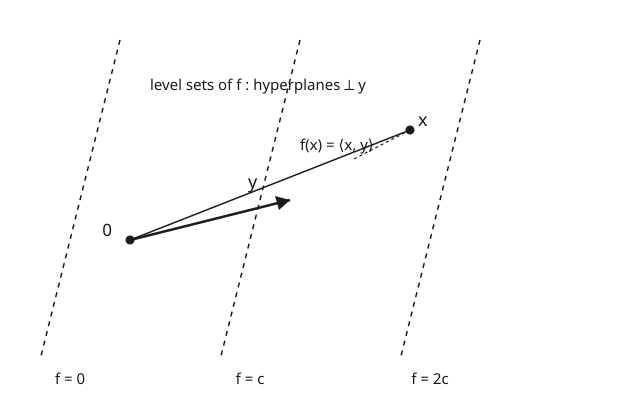

# Functional Analysis · Lesson 2.4: The Riesz representation theorem

> ⏱ ~15 min · Module 2: Hilbert spaces — the geometry of quantum mechanics · Builds on: [2.3 Orthonormal bases and Fourier expansions](02-03-orthonormal-bases-fourier.md) · Unlocks: [3.1 Bounded linear operators and the operator norm](03-01-bounded-operators-operator-norm.md)

## Why this matters

A *functional* is a machine that eats a vector and spits out a number: total energy, an expectation value, "evaluate this signal against a test pattern." In quantum mechanics every measurement amplitude $\langle \varphi | \psi \rangle$ is one of these. The Riesz representation theorem says something almost too good: on a Hilbert space, **every** (bounded) such machine is secretly just an inner product against one fixed vector. Numbers-out-of-vectors and vectors themselves are the *same information*, wearing different clothes. That single fact is what makes Dirac's bra–ket notation rigorous rather than a physicist's abuse — the bra $\langle \varphi |$ *is* a Riesz functional, and it always names a unique ket.

## The idea

Fix a vector $y$ in your space. Then $f(x) = \langle x, y\rangle$ is a linear functional — it measures "how much of $x$ points along $y$," scaled by $\|y\|$. Its level sets are the flat sheets perpendicular to $y$ (see the picture): moving *across* $y$ changes the output, moving *along a sheet* leaves it fixed.

Riesz says this is the *only* kind of bounded linear functional there is. Hand me any rule $f$ that turns vectors into numbers linearly and doesn't blow up, and I can hand you back the one vector $y$ that reproduces it as an inner product. Geometrically: a bounded functional's level sets are parallel hyperplanes, and every hyperplane has a normal direction — that normal direction (properly scaled) *is* $y$. The whole proof is just "find the normal to $\ker f$," which the projection theorem from 2.2 already lets us do.

## The formal version

A **bounded linear functional** on a Hilbert space $H$ is a linear map $f : H \to \mathbb{C}$ (or $\mathbb{R}$) with

$$\|f\| \;=\; \sup_{\|x\|\le 1} |f(x)| \;<\; \infty .$$

*In words:* $f$ is linear, and it can only stretch the unit ball by a finite factor $\|f\|$ — its **operator norm** — so nearby inputs give nearby outputs (bounded $=$ continuous for linear maps).

**Riesz Representation Theorem.** For every bounded linear functional $f$ on a Hilbert space $H$ there is a **unique** $y \in H$ with

$$f(x) = \langle x, y\rangle \quad\text{for all } x \in H, \qquad\text{and}\qquad \|f\| = \|y\| .$$

*In words:* every bounded functional is "inner product against one fixed vector," that vector is unique, and its length equals the functional's norm exactly. (Here $\langle \cdot,\cdot\rangle$ is linear in the first slot and conjugate-linear in the second — our convention from 2.1.)

**Consequence — self-duality.** The **dual space** $H^{*}$ is the set of all bounded linear functionals on $H$. Riesz gives a bijection $H \to H^{*}$, $\; y \mapsto \langle \cdot, y\rangle$, that is norm-preserving (an *isometry*) and **conjugate-linear**: $\alpha y + \beta z \mapsto \bar\alpha\,\langle\cdot,y\rangle + \bar\beta\,\langle\cdot,z\rangle$.

*In words:* $H$ and its dual $H^{*}$ are the *same* space up to a conjugation — a Hilbert space **is its own dual**. Nothing new lives in $H^{*}$ that wasn't already a vector in $H$.

## Concrete instance

Take $H = \ell^2$ and the functional

$$f(x) = \sum_{n=1}^{\infty} a_n\, x_n, \qquad \text{where } (a_n) \in \ell^2 .$$

Which vector $y$ represents it? We need $\langle x, y\rangle = \sum_n x_n \overline{y_n}$ to equal $\sum_n a_n x_n$ for every $x$. Matching coefficients: $\overline{y_n} = a_n$, so

$$y = (\overline{a_1}, \overline{a_2}, \overline{a_3}, \dots) = (\overline{a_n}) .$$

The conjugate is the whole subtlety — take it seriously and the representation is exact. Now check the norm claim. By Cauchy–Schwarz (2.1),

$$|f(x)| = |\langle x, y\rangle| \le \|x\|\,\|y\| \implies \|f\| \le \|y\| .$$

And the bound is *achieved*: feed in the unit vector $x = y/\|y\|$, giving $f(x) = \langle y/\|y\|, y\rangle = \|y\|^2/\|y\| = \|y\|$. So $\|f\| = \|y\|$ exactly — Cauchy–Schwarz is tight precisely when the input is parallel to $y$. (The $L^2$ story is identical: $f(g) = \int g\,\overline{h}$ is represented by $h$, same $\|f\| = \|h\|$.)

## Worked examples

**Example 1 (the proof — this is Boss 2).** *Every bounded linear functional $f$ on a Hilbert space $H$ has the form $f(x) = \langle x, y\rangle$ for a unique $y$.*

*Existence.* If $f \equiv 0$, take $y = 0$ and we're done. Otherwise $\ker f = \{x : f(x) = 0\}$ is a **closed** subspace (preimage of $\{0\}$ under the continuous map $f$) and it is **proper** ($f \not\equiv 0$). By the projection theorem (2.2), $(\ker f)^{\perp} \ne \{0\}$, so we may pick a unit vector $z \in (\ker f)^{\perp}$, $\|z\| = 1$. Note $f(z) \ne 0$ (else $z \in \ker f \cap (\ker f)^{\perp} = \{0\}$).

Claim: $y = \overline{f(z)}\, z$ works. Take any $x \in H$ and split it against $z$:

$$x = \underbrace{\left(x - \frac{f(x)}{f(z)}\,z\right)}_{=\,u} \;+\; \frac{f(x)}{f(z)}\,z .$$

Apply $f$ to $u$: $f(u) = f(x) - \frac{f(x)}{f(z)}f(z) = 0$, so $u \in \ker f$, hence $\langle u, z\rangle = 0$. Therefore

$$\langle x, y\rangle = \langle x, \overline{f(z)}\,z\rangle = f(z)\,\langle x, z\rangle = f(z)\left\langle u + \tfrac{f(x)}{f(z)}z,\; z\right\rangle = f(z)\cdot \frac{f(x)}{f(z)}\,\langle z, z\rangle = f(x),$$

using $\langle u,z\rangle = 0$ and $\|z\|^2 = 1$. (The conjugate in $y$ is exactly what cancels the conjugate-linearity of the second slot: $\langle x, \overline{f(z)}z\rangle = \overline{\overline{f(z)}}\,\langle x,z\rangle = f(z)\langle x,z\rangle$.) So $f = \langle\cdot, y\rangle$. ✓

*Uniqueness.* If $\langle x, y\rangle = \langle x, y'\rangle$ for all $x$, then $\langle x, y - y'\rangle = 0$ for all $x$; choose $x = y - y'$ to get $\|y - y'\|^2 = 0$, so $y = y'$. ✓

*Norm.* $\|f\| \le \|y\|$ by Cauchy–Schwarz, and $f(y/\|y\|) = \|y\|$ achieves it, so $\|f\| = \|y\|$. ✓

**Example 2 (bra–ket made rigorous).** Fix a state $|\varphi\rangle \in H$. The physicist's object $\langle \varphi |$ is by definition the machine

$$\langle \varphi | : \; |\psi\rangle \;\longmapsto\; \langle \varphi | \psi\rangle .$$

Is that a legitimate mathematical object? Yes: it is a linear functional, and it is bounded with $\|\langle\varphi|\| = \|\,|\varphi\rangle\|$ by Cauchy–Schwarz. So it *is* a member of $H^{*}$. Riesz then says every bra you can write down is $\langle\cdot, y\rangle$ for a unique $y$ — and here that $y$ is $|\varphi\rangle$ itself. Conversely every bounded functional (every valid bra) is represented by a unique ket. **Bras and kets are in perfect bijection**, which is the entire justification for treating $\langle\varphi|$ as "the same data as" $|\varphi\rangle$.

Why is the correspondence *conjugate*-linear? Because scaling a ket by $\alpha$ scales its bra by $\overline\alpha$:

$$|\varphi'\rangle = \alpha|\varphi\rangle \;\Longrightarrow\; \langle\varphi'| \psi\rangle = \overline{\alpha}\,\langle\varphi|\psi\rangle \;\Longrightarrow\; \langle\varphi'| = \overline{\alpha}\,\langle\varphi| .$$

The inner product carries a conjugate on the bra slot, so the map ket $\mapsto$ bra must undo it — this is *why* the bra is antilinear in $|\varphi\rangle$, not a separate physics postulate.

## Watch out

- **Self-duality is special to Hilbert spaces — do not expect it in a general Banach space.** For $\ell^p$ with $1 < p < \infty$ the dual is $\ell^q$ with $\tfrac1p + \tfrac1q = 1$, and $\ell^q \ne \ell^p$ unless $p = 2$. Only the inner-product geometry makes $H^{*} \cong H$; Riesz uses orthogonal projection, which a bare norm doesn't provide.
- **The map is conjugate-linear, not linear** (in the complex case). Forgetting the conjugate on $y$ — writing $y = (a_n)$ instead of $(\overline{a_n})$ — gives a $y$ that represents $\overline{f}$, not $f$. This same conjugate is exactly the antilinearity of the bra.
- **Boundedness is essential.** Unbounded linear functionals exist on infinite-dimensional $H$ (they need the axiom of choice to build) and are *not* represented by any vector — no $y$ can reproduce them, because $\langle\cdot,y\rangle$ is automatically bounded by $\|y\|$. Riesz is a theorem about $H^{*}$, the *continuous* dual.
- **$\|f\| = \|y\|$, not $\le$.** The correspondence is a genuine isometry; the norm is transported exactly, which is what lets us measure functionals by measuring vectors.

## One-liner

> On a Hilbert space every bounded functional is "inner product against one fixed vector," so $H$ is its own dual — and that vector, for the functional $\langle\varphi|$, is the ket $|\varphi\rangle$.

## Problems

**P1 (🟢)** On $\ell^2$, let $f(x) = 2x_1 - i\,x_3$ (all other coordinates ignored). Find the representing vector $y$ with $f(x) = \langle x, y\rangle$, and compute $\|f\|$.

**P2 (🟡)** On $L^2[0,1]$, let $f(g) = \int_0^1 g(t)\,t\,dt$. Find the representing function $h$ (so $f(g) = \langle g, h\rangle = \int_0^1 g\,\overline{h}$), and compute $\|f\|$.

**P3 (🔴, optional)** Let $H$ be a real Hilbert space and $f, g$ two nonzero bounded functionals with the *same* kernel, $\ker f = \ker g$. Prove $g = \lambda f$ for some scalar $\lambda \ne 0$. (Hint: represent both via Riesz and think about the normal direction to the shared kernel.)

Solutions

**P1** Write $f(x) = 2x_1 + 0\cdot x_2 + (-i)x_3 + 0 + \cdots = \sum_n a_n x_n$ with $a_1 = 2,\ a_3 = -i$, rest $0$. The representing vector is $y = (\overline{a_n}) = (2, 0, i, 0, 0, \dots)$ (note $\overline{-i} = i$). Check: $\langle x, y\rangle = \sum_n x_n \overline{y_n} = 2x_1 + x_3\overline{i} = 2x_1 - i x_3 = f(x)$. ✓ Then $\|f\| = \|y\| = \sqrt{|2|^2 + |i|^2} = \sqrt{4 + 1} = \sqrt5$.

**P2** We need $\int_0^1 g\,\overline{h} = \int_0^1 g(t)\,t\,dt$ for all $g$, so $\overline{h(t)} = t$, i.e. $h(t) = t$ (real, so no conjugate needed). Then

$$\|f\| = \|h\| = \left(\int_0^1 t^2\,dt\right)^{1/2} = \left(\tfrac13\right)^{1/2} = \frac{1}{\sqrt3}.$$

(The functional's norm is the $L^2$ norm of the function $t\mapsto t$ — you never had to work with the functional directly.)

**P3** By Riesz, $f = \langle\cdot, u\rangle$ and $g = \langle\cdot, v\rangle$ for unique $u, v \ne 0$. Their kernels are the orthogonal complements of the lines spanned by $u$ and $v$:

$$\ker f = \{x : \langle x, u\rangle = 0\} = u^{\perp}, \qquad \ker g = v^{\perp}.$$

Given $u^{\perp} = v^{\perp}$. Taking orthogonal complements (and using $(\{w\}^\perp)^\perp = \operatorname{span}\{w\}$ for a nonzero $w$ in a Hilbert space), $\operatorname{span}\{u\} = \operatorname{span}\{v\}$, so $v = \mu u$ for some scalar $\mu \ne 0$. Then $g(x) = \langle x, v\rangle = \langle x, \mu u\rangle = \mu\langle x, u\rangle = \mu f(x)$ (real scalar, so $\overline\mu = \mu$). Thus $g = \lambda f$ with $\lambda = \mu \ne 0$. ✓ Geometrically: two functionals with the same level-hyperplanes share a normal direction, and can differ only by how fast they climb across it.

## Flashback

**From Lesson 2.3 (Orthonormal bases and Fourier expansions):** In $L^2[-\pi, \pi]$ with the orthonormal system $e_n(t) = \frac{1}{\sqrt{2\pi}}\,e^{int}$ ($n \in \mathbb{Z}$), let $g(t) = 1$ (the constant function). Compute its Fourier coefficients $c_n = \langle g, e_n\rangle$ and verify Parseval: $\sum_n |c_n|^2 = \|g\|^2$.

Solution

For $n \ne 0$: $\displaystyle c_n = \int_{-\pi}^{\pi} 1\cdot \overline{e_n(t)}\,dt = \frac{1}{\sqrt{2\pi}}\int_{-\pi}^{\pi} e^{-int}\,dt = \frac{1}{\sqrt{2\pi}}\left[\frac{e^{-int}}{-in}\right]_{-\pi}^{\pi} = 0$, since $e^{\mp in\pi}$ are equal. For $n = 0$: $\displaystyle c_0 = \frac{1}{\sqrt{2\pi}}\int_{-\pi}^{\pi} 1\,dt = \frac{2\pi}{\sqrt{2\pi}} = \sqrt{2\pi}$.

So only $c_0$ survives: $\sum_n |c_n|^2 = |c_0|^2 = 2\pi$. And directly $\|g\|^2 = \int_{-\pi}^{\pi} 1\,dt = 2\pi$. Parseval holds: $2\pi = 2\pi$. ✓ (The constant function is "pure DC" — it lives entirely in the $n=0$ mode, exactly as intuition demands.)

## Connections

- **Backward:** the proof runs entirely on the [2.2 projection theorem](02-02-orthogonality-projection-theorem.md) — "$(\ker f)^\perp$ is nonzero and one-dimensional" is what hands us the representing direction $z$. The norm claim is [2.1 Cauchy–Schwarz](02-01-inner-products-cauchy-schwarz.md) with its equality case.
- **Forward:** [3.2 Dual spaces and Hahn–Banach](03-02-dual-spaces-hahn-banach.md) studies $H^{*}$ (and Banach duals) in general — and shows self-duality *fails* the moment you drop the inner product ($(\ell^p)^{*} = \ell^q$). [3.5 Adjoints of bounded operators](03-05-adjoints-bounded-operators.md) *defines* the adjoint $T^{*}$ by feeding $x \mapsto \langle Tx, y\rangle$ to Riesz — the adjoint exists only because this theorem does.
- **Sideways (quantum mechanics):** this is the rigorous foundation of Dirac's bra–ket notation. The bra $\langle\varphi|$ is the Riesz functional of the ket $|\varphi\rangle$; the ket $\leftrightarrow$ bra correspondence is the Riesz isometry, and its antilinearity is the theorem's conjugate-linearity. See [Quantum Mechanics](../../quantum-mechanics/syllabus.md).
