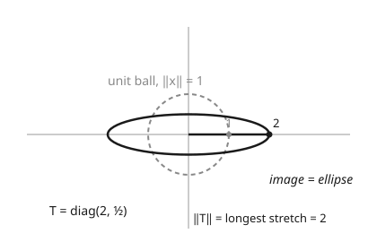

# Functional Analysis · Lesson 3.1: Bounded linear operators and the operator norm

> ⏱ ~15 min · Module 3: Bounded operators, dual spaces, and the big theorems · Builds on: [2.4 The Riesz representation theorem](02-04-riesz-representation.md) · Unlocks: [3.2 Dual spaces and the Hahn–Banach theorem](03-02-dual-spaces-hahn-banach.md)

## Why this matters

Everything you actually *do* to a function — differentiate it, integrate it, convolve it, project it onto a subspace, evolve it in time — is a linear operator between normed spaces. To do analysis with these operators (take limits, sum series of them, invert them) you need a single number that says how much an operator can amplify: its **gain**. That number is the operator norm, and the moment you have it, the space of operators becomes a normed space you can work inside — complete, with a multiplication, a genuine algebra. This lesson also delivers the theorem that quietly runs all of functional analysis: for *linear* maps, **continuous and bounded are the very same thing**.

## The idea

A linear map $T$ takes vectors to vectors. Feed it a unit vector and it hands back some vector of length $\|Tx\|$; that length is how much $T$ stretched that direction. Different directions get stretched by different amounts. The operator norm is simply the **worst-case stretch** — the largest factor by which $T$ can ever lengthen an input:

$$\|T\| = \text{the biggest } \frac{\|Tx\|}{\|x\|} \text{ can get.}$$

Picture the unit ball (all vectors of length $\le 1$). $T$ smears it into some new shape. If that shape fits inside a ball of radius $C$, then $T$ never magnifies by more than $C$ — it is **bounded**, with gain at most $C$. The smallest such $C$ is $\|T\|$. An operator is dangerous (unbounded) exactly when you can find inputs it blows up arbitrarily — the image of the unit ball spills out to infinity. Differentiation is the villain here: it multiplies high-frequency wiggles by their frequency, and frequencies have no ceiling.

## The formal version

Let $X, Y$ be normed spaces and $T : X \to Y$ linear.

**Bounded operator.** $T$ is **bounded** if there is a constant $C \ge 0$ with

$$\|Tx\|_Y \le C\,\|x\|_X \quad \text{for all } x \in X.$$

In words: $T$ magnifies length by at most a fixed factor $C$, uniformly over every input.

**Operator norm.** The smallest such $C$:

$$\|T\| = \sup_{x \ne 0} \frac{\|Tx\|}{\|x\|} = \sup_{\|x\| \le 1} \|Tx\| = \sup_{\|x\| = 1}\|Tx\|.$$

In words: the largest stretch factor $T$ achieves; the three formulas agree because scaling $x$ scales top and bottom equally. By construction $\|Tx\| \le \|T\|\,\|x\|$ always — the single most-used inequality in the subject.

**The equivalence theorem.** For a *linear* $T$, the following are equivalent: (a) $T$ is bounded; (b) $T$ is continuous; (c) $T$ is continuous at the single point $0$.

In words: for linear maps, "bounded gain," "continuous everywhere," and "continuous at the origin" are three names for one property. (We prove this in Worked Example 1.)

**The space $B(X,Y)$.** The bounded linear operators $X \to Y$ form a vector space $B(X,Y)$, and $\|\cdot\|$ above is a genuine norm on it. **Key fact:** if $Y$ is complete (Banach), then $B(X,Y)$ is complete — a Banach space — *regardless of whether $X$ is*. (This rides on the completeness machinery from [1.2](01-02-normed-banach-spaces.md).)

**Submultiplicativity.** If $S : Y \to Z$ and $T : X \to Y$ are bounded, so is $ST$, and

$$\|ST\| \le \|S\|\,\|T\|.$$

In words: gains multiply — running two operators in series magnifies by at most the product of their gains. Taking $Z = Y = X$, this makes $B(X)$ a **Banach algebra**: a complete normed space where you can also multiply (compose) operators.

## Concrete instance

Three operators on $\ell^2$ (square-summable sequences), each with its gain computed.

**Diagonal / multiplication operator.** Fix a bounded sequence $(\lambda_n)$ and set $(Tx)_n = \lambda_n x_n$. Then

$$\|Tx\|^2 = \sum_n |\lambda_n|^2 |x_n|^2 \le \Big(\sup_k |\lambda_k|\Big)^2 \sum_n |x_n|^2 = M^2\|x\|^2, \quad M := \sup_k|\lambda_k|,$$

so $\|T\| \le M$. Testing on the basis vector $e_k$ (a $1$ in slot $k$, else $0$) gives $\|Te_k\| = |\lambda_k|$ with $\|e_k\| = 1$, so $\|T\| \ge |\lambda_k|$ for every $k$, hence $\|T\| \ge M$. Therefore

$$\boxed{\;\|T\| = \sup_n |\lambda_n|.\;}$$

**Right shift.** $S(x_1, x_2, \dots) = (0, x_1, x_2, \dots)$. It just relabels coordinates, so $\|Sx\| = \|x\|$ for every $x$ — an isometry — giving $\|S\| = 1$. (Note $S$ is not surjective, yet has gain exactly $1$: bounded is about stretch, not about hitting everything.)

**Rank-one operator.** Fix vectors $u, v$ and set $Tx = \langle x, u\rangle\, v$. By Cauchy–Schwarz, $\|Tx\| = |\langle x, u\rangle|\,\|v\| \le \|u\|\,\|v\|\,\|x\|$, with equality when $x = u$. So $\|T\| = \|u\|\,\|v\|$. (Riesz from [2.4](02-04-riesz-representation.md) says *every* functional is the $\langle\,\cdot\,, u\rangle$ half of this.)

Geometrically, $\|T\|$ is the longest semi-axis of the ellipse the unit ball becomes:

## Worked examples

**Example 1 (mechanical — the equivalence theorem).** Prove that a linear $T : X \to Y$ is bounded $\iff$ continuous $\iff$ continuous at $0$.

*Bounded $\Rightarrow$ continuous.* If $\|Tx\| \le C\|x\|$, then by linearity

$$\|Tx - Ty\| = \|T(x-y)\| \le C\,\|x - y\|.$$

So $T$ is Lipschitz with constant $C$; given $\varepsilon$, take $\delta = \varepsilon/C$. Continuous (uniformly, even).

*Continuous $\Rightarrow$ continuous at $0$.* Immediate — $0$ is one of the points.

*Continuous at $0 \Rightarrow$ bounded.* Continuity at $0$ (with $T0 = 0$) applied at $\varepsilon = 1$ gives a $\delta > 0$ such that $\|z\| \le \delta \Rightarrow \|Tz\| \le 1$. For any $x \ne 0$, the vector $z = \delta\, x/\|x\|$ has $\|z\| = \delta$, so $\|Tz\| \le 1$. But $\|Tz\| = \dfrac{\delta}{\|x\|}\|Tx\|$ by linearity, hence

$$\|Tx\| \le \frac{1}{\delta}\,\|x\|.$$

That is boundedness with $C = 1/\delta$. The three properties collapse into one. $\blacksquare$

**Example 2 (why you'd care — an unbounded operator, and a tame one).**

*Differentiation is unbounded.* On $L^2[0,1]$ take the pure frequencies $e_n(x) = e^{2\pi i n x}$, each with $\|e_n\| = 1$. Differentiation $D$ gives $D e_n = 2\pi i n\, e_n$, so

$$\frac{\|D e_n\|}{\|e_n\|} = 2\pi n \longrightarrow \infty.$$

No finite $C$ bounds the gain: $D$ is **unbounded**, hence (by Example 1) **discontinuous**. This is why $D$ can only live on a *sub*space of nice functions, not all of $L^2$ — the domain question that drives all of Module 5, and the reason physical observables need care.

*The shift is tame.* By contrast the shift $S$ above has $\|S\| = 1$ — a perfectly continuous operator. Same space, opposite behavior: what matters is whether the stretch factors have a ceiling.

## Watch out

- **"Bounded" does not mean "the image is a bounded set."** A bounded operator can send unbounded inputs to unbounded outputs (the identity does). Bounded means the *gain* $\|Tx\|/\|x\|$ has a ceiling — bounded ball to bounded ball, not everything to a bounded set.
- **Continuous $=$ bounded is a theorem about *linear* maps only.** For a nonlinear function these are wildly different ($x \mapsto x^2$ is continuous and unbounded). Do not export the equivalence outside linearity.
- **The sup in $\|T\|$ need not be attained.** If $\lambda_n = 1 - 1/n$, then $\|T\| = \sup(1 - 1/n) = 1$, but no unit vector reaches gain $1$ — it is only approached. "Norm $= 1$" need not mean "some input is stretched by exactly $1$."
- **$B(X,Y)$ Banach needs $Y$ complete, not $X$.** The completeness lives in the *target*, where the Cauchy sequences of output vectors must converge. The source can be any normed space.
- **Differentiation is *the* cautionary operator.** Whenever an operator involves derivatives, suspect unboundedness — and expect to specify a domain (Module 5, and every PDE).

## One-liner

> A linear operator's norm is its worst-case stretch of the unit ball; for linear maps that gain being finite is *exactly* continuity, and with it $B(X,Y)$ becomes a Banach algebra.

## Problems

**P1 (🟢)** On $\ell^2$, let $T$ be the diagonal operator with $\lambda_n = \dfrac{n}{n+1}$. Compute $\|T\|$, and state whether the supremum is attained by any unit vector.

**P2 (🟡)** For $\varphi \in C[0,1]$, define the multiplication operator $M_\varphi : L^2[0,1] \to L^2[0,1]$ by $(M_\varphi f)(t) = \varphi(t) f(t)$. Show that $\|M_\varphi\| = \max_{t \in [0,1]} |\varphi(t)|$. (The upper bound is a one-liner; for the lower bound, concentrate $f$'s mass near a point where $|\varphi|$ is largest.)

**P3 (🔴, optional)** Let $X$ be a Banach space and $T \in B(X)$ with $\|T\| < 1$. Using submultiplicativity and completeness of $B(X)$, show that $I - T$ is invertible with $(I - T)^{-1} = \sum_{n=0}^\infty T^n$ (the **Neumann series**). This is the workhorse behind existence proofs for integral and differential equations.

Solutions

**P1** The gains are $\lambda_n = n/(n+1)$: a strictly increasing sequence $\tfrac12, \tfrac23, \tfrac34, \dots$ with supremum

$$\|T\| = \sup_n \frac{n}{n+1} = \lim_{n\to\infty}\frac{n}{n+1} = 1.$$

It is **not attained**: for each unit basis vector $e_k$, $\|Te_k\| = k/(k+1) < 1$, and any unit $x$ gives $\|Tx\|^2 = \sum \lambda_n^2 |x_n|^2 < \sum |x_n|^2 = 1$ since every $\lambda_n < 1$. The gain $1$ is approached (via $e_k$ as $k \to \infty$) but never reached — the third "Watch out" made concrete.

**P2** Let $M = \max_{t}|\varphi(t)|$ (attained at some $t_0$ since $\varphi$ is continuous on a compact set).

*Upper bound.* For any $f \in L^2$,

$$\|M_\varphi f\|^2 = \int_0^1 |\varphi(t)|^2 |f(t)|^2\,dt \le M^2 \int_0^1 |f(t)|^2\,dt = M^2\|f\|^2,$$

so $\|M_\varphi\| \le M$.

*Lower bound.* Fix $\varepsilon > 0$. By continuity there is an interval $I = [t_0 - \delta, t_0 + \delta] \cap [0,1]$ of positive length $|I|$ on which $|\varphi(t)| \ge M - \varepsilon$. Let $f = |I|^{-1/2}\,\mathbf{1}_I$ (the indicator of $I$, normalized), so $\|f\|^2 = |I|^{-1}\int_I 1\,dt = 1$. Then

$$\|M_\varphi f\|^2 = \frac{1}{|I|}\int_I |\varphi(t)|^2\,dt \ge \frac{1}{|I|}\,(M-\varepsilon)^2 |I| = (M - \varepsilon)^2,$$

so $\|M_\varphi\| \ge M - \varepsilon$. Letting $\varepsilon \to 0$ gives $\|M_\varphi\| \ge M$. Combined: $\|M_\varphi\| = M$. (This is the continuous twin of the diagonal operator — $\varphi$ plays the role of $(\lambda_n)$, and $\max|\varphi|$ replaces $\sup|\lambda_n|$.)

**P3** Submultiplicativity gives $\|T^n\| \le \|T\|^n$. Since $\|T\| < 1$, the series $\sum_{n=0}^\infty \|T\|^n = \dfrac{1}{1 - \|T\|}$ converges, so the partial sums $S_N = \sum_{n=0}^N T^n$ satisfy, for $N > M$,

$$\|S_N - S_M\| = \Big\|\sum_{n=M+1}^N T^n\Big\| \le \sum_{n=M+1}^N \|T\|^n \longrightarrow 0,$$

i.e. $(S_N)$ is Cauchy in $B(X)$. Because $X$ is Banach, $B(X)$ is complete, so $S_N \to S$ for some $S \in B(X)$. Now telescope:

$$(I - T)S_N = S_N (I - T) = \sum_{n=0}^N (T^n - T^{n+1}) = I - T^{N+1}.$$

Since $\|T^{N+1}\| \le \|T\|^{N+1} \to 0$, we have $T^{N+1} \to 0$, and letting $N \to \infty$ (composition is continuous, as $\|(I-T)(S_N - S)\| \le \|I - T\|\,\|S_N - S\|$) gives

$$(I - T)S = S(I - T) = I.$$

Hence $I - T$ is invertible with inverse $S = \sum_{n=0}^\infty T^n$. $\blacksquare$

## Flashback

**From Module 2 (Riesz representation):** On $\ell^2$ (real scalars), consider the linear functional $\varphi(x) = \sum_{n=1}^\infty \dfrac{x_n}{2^n}$. Find the vector $u \in \ell^2$ with $\varphi(x) = \langle x, u\rangle$ for all $x$, and compute the norm $\|\varphi\|$.

Solution

Reading off coefficients, $\varphi(x) = \sum_n x_n\, (2^{-n}) = \langle x, u\rangle$ with $u = (2^{-1}, 2^{-2}, 2^{-3}, \dots)$, i.e. $u_n = 2^{-n}$. This $u$ is in $\ell^2$: $\|u\|^2 = \sum_{n=1}^\infty 4^{-n} = \dfrac{1/4}{1 - 1/4} = \dfrac13$. By Riesz, a functional written as $\langle\,\cdot\,, u\rangle$ has norm $\|\varphi\| = \|u\|$ (which is also the rank-one/functional gain from the Concrete instance with $v$ scalar), so

$$\|\varphi\| = \|u\| = \frac{1}{\sqrt{3}}.$$

## Connections

- **Backward:** boundedness of $\|Tx\| \le \|T\|\|x\|$ is the norm from [1.2](01-02-normed-banach-spaces.md) doing its job in both spaces; the completeness of $B(X,Y)$ reuses [1.2](01-02-normed-banach-spaces.md)'s Banach machinery in the target. A functional (as in [2.4](02-04-riesz-representation.md)) is just an operator into the scalars $\mathbb{R}$ or $\mathbb{C}$ — this lesson subsumes Riesz.
- **Forward:** [3.2](03-02-dual-spaces-hahn-banach.md)–[3.4](03-04-open-mapping-closed-graph.md) are the four great theorems about bounded operators (Hahn–Banach, uniform boundedness, open mapping / closed graph); [3.5](03-05-adjoints-bounded-operators.md) builds the adjoint $T^*$ inside $B(X,Y)$; and Module [5.1](05-01-unbounded-operators-domains.md) confronts the unbounded operators (like $D$) this lesson exiled.
- **Sideways (linear algebra):** a matrix *is* a bounded operator between finite-dimensional spaces, and its operator norm is exactly the **spectral norm** (largest singular value) from [linalg-refresher](../../linalg-refresher/syllabus.md) — the ellipse picture here is the SVD's stretch factors.
- **Sideways (physics):** in [quantum-mechanics](../../quantum-mechanics/syllabus.md), observables are operators on a Hilbert space — but the physically central ones (position, momentum, energy) are *unbounded*, exactly like $D$, which is why domains and self-adjointness (Module 5) are not optional bookkeeping but physics.
- **Sideways (PDEs):** every differential operator in [pdes](../../pdes/syllabus.md) is unbounded for the same frequency reason as $D$ — the entire theory of weak solutions exists to tame this.
