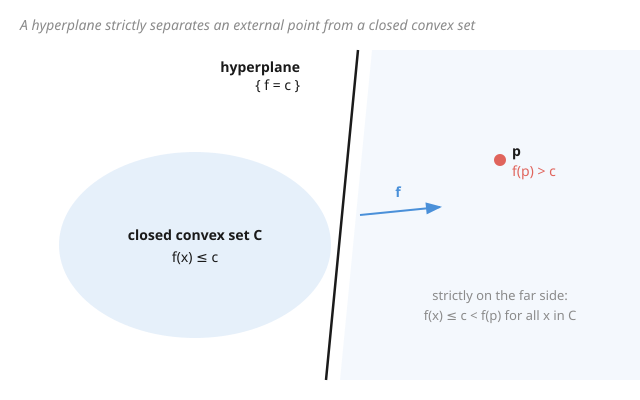

# Functional Analysis · Lesson 3.2: Dual spaces and the Hahn–Banach theorem

> ⏱ ~15 min · Module 3: Bounded operators, dual spaces, and the big theorems · Builds on: [3.1 Bounded linear operators and the operator norm](03-01-bounded-operators-operator-norm.md) · Unlocks: [3.3 The uniform boundedness principle](03-03-uniform-boundedness.md)

## Why this matters

To probe a vector you measure it — you feed it to a linear gauge and read off a number. In finite dimensions those gauges are the rows of a matrix; in an infinite-dimensional space they are the **bounded linear functionals**, and the collection of *all* of them is the **dual space** $X^*$. Two questions decide whether this idea has teeth. First: are there *enough* functionals to see everything, or could two different vectors read identically on every gauge? Second: if I have a good gauge defined only on a subspace, can I extend it to the whole space without wrecking it? The **Hahn–Banach theorem** answers both with a resounding yes, and that single guarantee underwrites duality, weak convergence, separating-hyperplane arguments in economics and game theory, and the entire "test against functionals" style of modern analysis.

## The idea

Picture a room full of measuring instruments, each one a bounded linear functional. You want the collection to be rich enough that (a) no nonzero vector is invisible — some gauge reads it as nonzero — and in fact (b) every vector $x$ has a *perfect* gauge, one calibrated so that it reads exactly $\|x\|$ while never exceeding length $1$ itself. If such perfect gauges always exist, then the norm of a vector is nothing but the *loudest reading it can produce* across all unit-strength gauges: $\|x\| = \sup_{\|f\|\le 1}|f(x)|$. Vectors and functionals become two sides of one coin.

Why isn't this automatic? Building a functional on a *subspace* is easy — you often have one for free (say, "read the first coordinate"). The hard part is enlarging its domain to all of $X$ **without letting its norm creep up**. Hahn–Banach says you always can. It is a pure existence theorem — it hands you the extension without a formula — but existence is exactly what you need to know the room of gauges is never too empty.

## The formal version

**Definition (dual space).** For a normed space $X$ over $\mathbb{R}$ or $\mathbb{C}$, the **dual** is
$$X^* = B(X,\ \mathbb{F}) = \{\,f:X\to\mathbb{F} \text{ linear and bounded}\,\}, \qquad \|f\| = \sup_{\|x\|\le 1}|f(x)|,$$
where $\mathbb{F}$ is the scalar field. *In words:* $X^*$ is the space of all continuous linear "measurements" on $X$, normed by the largest reading each produces on the unit ball. Since the scalars are complete, [3.1](03-01-bounded-operators-operator-norm.md)'s theorem that $B(X,Y)$ is Banach whenever $Y$ is applies here: **$X^*$ is always a Banach space**, even when $X$ is not.

**Theorem (Hahn–Banach, extension form).** Let $M \subseteq X$ be a subspace and $g:M\to\mathbb{F}$ a bounded linear functional. Then there exists $f\in X^*$ with
$$f|_M = g \qquad\text{and}\qquad \|f\|_{X^*} = \|g\|_{M^*}.$$
*In words:* any bounded functional on a subspace extends to the whole space with its norm **unchanged** — you gain domain for free, paying nothing in size. (More generally: if a linear functional on $M$ is dominated by a sublinear functional or seminorm $p$ on $X$ — that is, $g(x)\le p(x)$ on $M$ — the extension can be kept $\le p$ everywhere. Taking $p(x)=\|g\|\,\|x\|$ recovers the norm-preserving statement.)

**Corollary (norming functionals; $X^*$ separates points).** For every $x\ne 0$ there is $f\in X^*$ with $\|f\|=1$ and $f(x)=\|x\|$. Consequently
$$\|x\| = \sup_{\|f\|\le 1}|f(x)|,$$
and if $f(x)=f(y)$ for every $f\in X^*$, then $x=y$. *In words:* the dual is big enough to read every vector's length exactly and to tell any two vectors apart. (Proof: define $g(tx)=t\|x\|$ on the line $M=\mathbb{F}x$; it has norm $1$; extend by Hahn–Banach.)

**Theorem (Hahn–Banach, geometric / separation form).** If $C\subseteq X$ is a closed convex set and $p\notin C$, there exist $f\in X^*$ and a real $c$ with
$$\operatorname{Re} f(x) \le c < \operatorname{Re} f(p) \qquad\text{for all } x\in C.$$
*In words:* a point outside a closed convex set can be walled off from it by a hyperplane $\{f=c\}$ — the set sits entirely on one side, the point strictly on the other. This is the extension theorem re-dressed in geometry, and it is the engine behind separating-hyperplane arguments everywhere.

## Picture

## Worked examples

**Example 1 (the norming corollary, then made concrete in $\ell^p$).** First the general fact. For any $f$ with $\|f\|\le 1$, boundedness gives $|f(x)|\le\|f\|\,\|x\|\le\|x\|$, so $\sup_{\|f\|\le1}|f(x)|\le\|x\|$. Hahn–Banach supplies an $f$ with $\|f\|=1$ and $f(x)=\|x\|$, which *attains* that bound. Hence $\|x\|=\sup_{\|f\|\le1}|f(x)|$.

The theorem only promises such an $f$ exists — but in $\ell^p$ ($1<p<\infty$) we can write it down. Fix $x\ne 0$ and set
$$w_n = \frac{|x_n|^{\,p-1}\,\operatorname{sgn}(x_n)}{\|x\|_p^{\,p-1}}, \qquad f(z)=\sum_n z_n w_n.$$
Using $q=\tfrac{p}{p-1}$ so that $(p-1)q=p$:
$$\|w\|_q^q = \sum_n \frac{|x_n|^{(p-1)q}}{\|x\|_p^{(p-1)q}} = \frac{\sum_n|x_n|^p}{\|x\|_p^{p}} = 1 \ \Rightarrow\ \|f\|=\|w\|_q=1,$$
and since $x_n\operatorname{sgn}(x_n)=|x_n|$,
$$f(x)=\sum_n \frac{x_n|x_n|^{p-1}\operatorname{sgn}(x_n)}{\|x\|_p^{p-1}} = \frac{\sum_n|x_n|^p}{\|x\|_p^{p-1}} = \frac{\|x\|_p^{p}}{\|x\|_p^{p-1}} = \|x\|_p. \ \checkmark$$
So the abstract "there exists" becomes an explicit gauge — Hahn–Banach is what guarantees the same in spaces where no such formula is available.

**Example 2 (identifying a dual concretely: $(\ell^p)^*=\ell^q$).** For $1\le p<\infty$ and $\tfrac1p+\tfrac1q=1$, every $w\in\ell^q$ defines $f_w(x)=\sum_n x_n w_n$. Hölder's inequality gives $|f_w(x)|\le\|x\|_p\|w\|_q$, so $\|f_w\|\le\|w\|_q$. For the reverse, feed in the extremal vector $x_n=|w_n|^{q-1}\operatorname{sgn}(w_n)$. Then $(q-1)p=q$, so $\|x\|_p^p=\sum_n|w_n|^q=\|w\|_q^q$, i.e. $\|x\|_p=\|w\|_q^{q/p}$, while
$$f_w(x)=\sum_n |w_n|^{q-1}\operatorname{sgn}(w_n)\,w_n=\sum_n|w_n|^q=\|w\|_q^q,$$
so $\|f_w\|\ge \dfrac{f_w(x)}{\|x\|_p}=\|w\|_q^{\,q-q/p}=\|w\|_q$ (using $q-\tfrac qp=q(1-\tfrac1p)=1$). Thus $\|f_w\|=\|w\|_q$: the map $w\mapsto f_w$ is an **isometric isomorphism** $\ell^q \xrightarrow{\ \sim\ }(\ell^p)^*$. The clean Hilbert case $(\ell^2)^*=\ell^2$ is $p=q=2$ — exactly the self-duality of Riesz representation in [2.4](02-04-riesz-representation.md). But note the asymmetry at the edge: $(\ell^1)^*=\ell^\infty$, whereas $(\ell^\infty)^* \supsetneq \ell^1$ is strictly *bigger* than $\ell^1$ — so $\ell^1$ and $\ell^\infty$ are **not reflexive**, and duality is not always a mirror.

## Watch out

- **You might think** the miracle in Hahn–Banach is that an extension exists at all — **but actually** extending a functional is trivial (extend a basis, assign values anyhow). The entire content is that it extends **with the same norm**: no growth in size, no formula required. That norm-preserving clause *is* the theorem.
- **You might think** you can construct the extension explicitly — **but actually** the proof runs on Zorn's lemma (the axiom of choice), extending one dimension at a time up a maximal chain. It is fundamentally **non-constructive**; in $\ell^p$ you get lucky with a formula, in $\ell^\infty$ you generally do not.
- **You might think** any point off a set can be separated from it — **but actually** the separation form needs the set to be both **convex and closed**. Strip either hypothesis and a wall may not exist: a point in the closure can't be strictly separated, and a nonconvex set can wrap around the point.
- **You might think** every dual is a tidy mirror like Hilbert space — **but actually** $(\ell^2)^*=\ell^2$ (Riesz, [2.4](02-04-riesz-representation.md)) is the clean special case. In general duality bends: $(\ell^p)^*=\ell^q$ pairs different spaces, and $(\ell^\infty)^*$ dwarfs $\ell^1$. Reflexivity ($X^{**}=X$) is a privilege, not a law.

## One-liner

> The dual space is the room of all bounded gauges, and Hahn–Banach guarantees it is never too empty: every vector has a unit gauge reading its exact length, so $\|x\|=\sup_{\|f\|\le1}|f(x)|$ and hyperplanes can wall off any point from a closed convex set.

## Problems

**P1 (🟢)** Let $x=(1,1,1,0,0,\dots)\in\ell^p$ with $1<p<\infty$. Write down the norming functional $w\in\ell^q$ from Example 1 explicitly (give $\|x\|_p$ and each $w_n$), and verify both $\|w\|_q=1$ and $f_w(x)=\|x\|_p$.

**P2 (🟡)** Prove directly from the norming corollary that if $f(x)=0$ for **every** $f\in X^*$, then $x=0$. (This is why "test against all functionals" is a legitimate way to prove two vectors are equal.)

**P3 (🔴, optional)** Let $M\subseteq X$ be a *closed* subspace and $p\notin M$, so $d:=\operatorname{dist}(p,M)>0$. Prove there exists $f\in X^*$ with $\|f\|=1$, $f\equiv 0$ on $M$, and $f(p)=d$. (Hint: define $g$ on $M\oplus\operatorname{span}\{p\}$ by $g(m+tp)=t\,d$, bound $\|g\|$, then extend by Hahn–Banach.)

Solutions

**P1** Here $x_n=1$ for $n\le 3$ and $0$ otherwise, so $\|x\|_p=\big(1+1+1\big)^{1/p}=3^{1/p}$. By the formula $w_n=|x_n|^{p-1}\operatorname{sgn}(x_n)/\|x\|_p^{p-1}$, for $n\le 3$ we get
$$w_n=\frac{1}{3^{(p-1)/p}}=3^{-(p-1)/p}=3^{-1/q},$$
and $w_n=0$ for $n>3$. Check the norm: $|w_n|^q=3^{-1}$ for each of the three terms, so $\|w\|_q^q=3\cdot 3^{-1}=1$, i.e. $\|w\|_q=1$. And $f_w(x)=\sum_{n\le3} 1\cdot 3^{-1/q}=3\cdot 3^{-1/q}=3^{1-1/q}=3^{1/p}=\|x\|_p$. $\checkmark$

**P2** Suppose $x\ne 0$. By the norming corollary there is $f\in X^*$ with $\|f\|=1$ and $f(x)=\|x\|>0$. This is a functional with $f(x)\ne 0$, contradicting the hypothesis that every functional annihilates $x$. Hence $x=0$. (Contrapositive: a nonzero vector is always *seen* by some gauge — functionals separate points.)

**P3** Every element of $N:=M\oplus\operatorname{span}\{p\}$ is uniquely $m+tp$ with $m\in M,\ t\in\mathbb{F}$ (unique because $p\notin M$). Define $g(m+tp)=t\,d$; this is linear, vanishes on $M$ (take $t=0$), and $g(p)=d$.

*Norm $\le 1$:* for $t\ne 0$,
$$|g(m+tp)|=|t|\,d=|t|\operatorname{dist}(p,M)\le |t|\,\Big\|p-\big(-\tfrac{m}{t}\big)\Big\|=\|tp+m\|=\|m+tp\|,$$
using that $-\tfrac{m}{t}\in M$ so its distance-to-$p$ is at least $d$. For $t=0$ the inequality $|g(m)|=0\le\|m\|$ is trivial. Hence $\|g\|\le 1$.

*Norm $\ge 1$:* pick $m_k\in M$ with $\|p-m_k\|\to d$. Then $g(p-m_k)=g(p)=d$ (since $g$ kills $M$), so
$$\|g\|\ge\frac{|g(p-m_k)|}{\|p-m_k\|}=\frac{d}{\|p-m_k\|}\to \frac{d}{d}=1.$$
Therefore $\|g\|=1$. By Hahn–Banach extend $g$ to $f\in X^*$ with $\|f\|=\|g\|=1$; the extension still satisfies $f\equiv0$ on $M$ and $f(p)=d\ne0$. $\checkmark$ (This is the separation form specialized to a subspace — the functional is the annihilating hyperplane's normal.)

## Flashback

**From Lesson 3.1 (Bounded linear operators and the operator norm):** On $\ell^2$ define the multiplication operator $T$ by $(Tx)_n=\dfrac{n}{n+1}\,x_n$. Show $T$ is bounded, compute $\|T\|$, and decide whether the operator norm is *attained* (i.e. whether some unit vector $x$ has $\|Tx\|=\|T\|$).

Solution

Write $a_n=\frac{n}{n+1}$, so $0<a_n<1$ and $a_n\uparrow 1$. For any $x\in\ell^2$,
$$\|Tx\|^2=\sum_n a_n^2|x_n|^2 \le \Big(\sup_n a_n^2\Big)\sum_n|x_n|^2 = 1\cdot\|x\|^2,$$
since $\sup_n a_n=1$. Hence $T$ is bounded with $\|T\|\le 1$. For the reverse, test the standard basis vectors $e_n$ (each has $\|e_n\|=1$): $\|Te_n\|=a_n=\frac{n}{n+1}\to 1$, so $\|T\|\ge\sup_n a_n=1$. Therefore $\|T\|=1$.

It is **not attained**. If $\|Tx\|=\|x\|$ for some $x\ne0$, then $\sum_n(1-a_n^2)|x_n|^2=0$; but every coefficient $1-a_n^2>0$, forcing $x_n=0$ for all $n$, a contradiction. The supremum defining $\|T\|$ is approached along $e_n$ but never reached — a purely infinite-dimensional phenomenon, echoing 3.1's warning that the operator-norm sup need not be a max.

## Connections

- **Backward:** the norm formula $\|f\|=\sup_{\|x\|\le1}|f(x)|$ and the fact that $X^*=B(X,\mathbb{F})$ is Banach are [3.1](03-01-bounded-operators-operator-norm.md) read off with the scalar field as codomain. The clean self-dual case $(\ell^2)^*=\ell^2$ is Riesz representation from [2.4](02-04-riesz-representation.md) — Hilbert space is where duality is an exact mirror, and Hahn–Banach is the tool that keeps duality alive when the inner product is gone.
- **Forward:** [3.3](03-03-uniform-boundedness.md) leans on dual pairings — probing a family of operators by testing against functionals is precisely the "$\|x\|=\sup_{\|f\|\le1}|f(x)|$" move, and uniform boundedness turns pointwise control into uniform control through it.
- **Sideways (analysis):** the extension-and-separation machinery is the abstract backbone under many existence results in the [real analysis](../../real-analysis/syllabus.md) track — dominating a functional by a seminorm and extending is the same pattern as building measures and integrals by extending from simple pieces.
- **Sideways (economics):** the separation form is *literally* the tool behind the **Second Welfare Theorem** in [graduate microeconomics](../../grad-micro/syllabus.md) — a Pareto-efficient allocation is a point on the boundary of a convex "better-than" set, and the supporting hyperplane that separates it is the price system that decentralizes it. Same theorem, priced in dollars instead of norms.
- **Sideways (game theory):** separating and supporting hyperplanes also drive the minimax theorem and the existence of equilibria in [graduate game theory](../../grad-game-theory/syllabus.md) — convexity plus Hahn–Banach separation is the recurring skeleton of "a wall must exist between what's feasible and what's desired."
