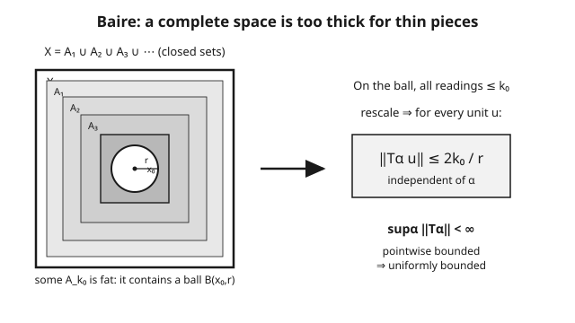

# Functional Analysis · Lesson 3.3: The uniform boundedness principle

> ⏱ ~15 min · Module 3: Bounded operators, dual spaces, and the big theorems · Builds on: [3.2 Dual spaces and the Hahn–Banach theorem](03-02-dual-spaces-hahn-banach.md) · Unlocks: [3.4 Open mapping and closed graph theorems](03-04-open-mapping-closed-graph.md)

## Why this matters

You have a whole family of operators — the Fourier partial-sum machines $S_N$, a sequence of approximations $T_n$ converging to some limit, the resolvents of a Hamiltonian at different energies. You can usually check them *one input at a time*: for each fixed vector $x$, the outputs $T_\alpha x$ stay bounded. What you'd really like is a bound that works for *all* inputs at once — a single ceiling on the operator norms $\|T_\alpha\|$. Those are wildly different-looking guarantees, and the second one seems far stronger. The uniform boundedness principle says that on a complete space they are the same guarantee. That upgrade — checking pointwise, concluding uniformly — is one of the three load-bearing theorems of the subject, and it's how you prove things *can't* work (like a continuous function whose Fourier series diverges) without ever constructing the counterexample by hand.

## The idea

Picture a family of measuring instruments $\{T_\alpha\}$. "Pointwise bounded" means: hand any single object $x$ to the whole family, and none of them reads off an infinite value — but the ceiling might depend on $x$, and might creep up as you feed in nastier and nastier objects. "Uniformly bounded" means: there's one master ceiling $M$ such that *every* instrument, on *every* unit object, reads below $M$. The second is obviously the stronger promise.

The surprise is that on a **complete** domain you get the second for free from the first. The engine is a counting-and-completeness argument (the Baire category theorem). Sort the space by how large the readings can get: $A_k$ is the set of inputs on which every instrument reads $\le k$. Pointwise boundedness says every $x$ lands in *some* $A_k$, so these closed sets cover the whole space. A complete space is "too thick" to be exhausted by countably many meagre pieces — so one of the $A_k$ must be genuinely fat, containing a whole ball. But an operator family that's uniformly bounded on a ball is uniformly bounded everywhere (rescale). That fat ball is the master ceiling.

The moral: **completeness converts local, input-by-input control into global, uniform control.** Take away completeness and the whole thing collapses.

## The formal version

First the engine.

**Baire category theorem.** Let $(X,d)$ be a *complete* metric space. Then $X$ is **not** a countable union of nowhere-dense sets. Equivalently: a countable intersection of dense open sets is dense.

*In words:* you cannot build a complete space out of countably many "thin" pieces (a nowhere-dense set is one whose closure contains no ball — it's full of holes). Something thick always leaks through. A single point at a time is thin; the whole space is thick; completeness is what forbids the paradox.

Now the theorem. Let $X$ be a **Banach space** (complete normed space), $Y$ a normed space, and $\{T_\alpha\}_{\alpha \in I}$ a family of **bounded** linear operators $T_\alpha : X \to Y$ (indexed by any set $I$, finite or not). Recall the operator norm $\|T\| = \sup_{\|x\| \le 1}\|Tx\|$ from [3.1](03-01-bounded-operators-operator-norm.md).

**Uniform boundedness principle (Banach–Steinhaus).** If the family is **pointwise bounded** —
$$\sup_{\alpha \in I}\|T_\alpha x\| < \infty \quad \text{for each fixed } x \in X$$
— then it is **uniformly bounded**:
$$\sup_{\alpha \in I}\|T_\alpha\| < \infty.$$

*In words:* if no single input is blown up by the family, then no input is — there's one finite bound $M$ with $\|T_\alpha x\| \le M\|x\|$ for every $\alpha$ and every $x$ at once. Pointwise control is secretly uniform control, on a Banach space.

**Corollary (limits stay bounded).** If $T_n : X \to Y$ are bounded and $Tx := \lim_{n\to\infty} T_n x$ exists for every $x$, then $T$ is a bounded operator and
$$\|T\| \le \liminf_{n\to\infty}\|T_n\|.$$

*In words:* a pointwise limit of bounded operators can't secretly be unbounded — the family it comes from is automatically uniformly bounded, and the limit inherits that ceiling.

## Concrete instance

**The proof idea, made visible.** For $k = 1, 2, 3, \dots$ define
$$A_k = \{\, x \in X : \|T_\alpha x\| \le k \text{ for every } \alpha \,\} = \bigcap_{\alpha} \{x : \|T_\alpha x\| \le k\}.$$
Each $A_k$ is closed (an intersection of closed sets, since $x \mapsto \|T_\alpha x\|$ is continuous). Pointwise boundedness says: for each $x$, $\sup_\alpha\|T_\alpha x\|$ is some finite number, so $x \in A_k$ once $k$ exceeds it. Hence
$$X = \bigcup_{k=1}^{\infty} A_k.$$
$X$ is complete, so by Baire *not every* $A_k$ is nowhere-dense — some $A_{k_0}$ contains a closed ball $\overline{B}(x_0, r)$. On that ball $\|T_\alpha x\| \le k_0$ for all $\alpha$. Now for any unit vector $u$, the point $x_0 + ru$ lies in the ball, so $\|T_\alpha(x_0 + ru)\| \le k_0$, and $\|T_\alpha x_0\| \le k_0$ too; subtracting,
$$\|T_\alpha (ru)\| \le \|T_\alpha(x_0 + ru)\| + \|T_\alpha x_0\| \le 2k_0 \;\Longrightarrow\; \|T_\alpha u\| \le \frac{2k_0}{r}.$$
That bound is independent of $\alpha$ and of the unit vector $u$, so $\sup_\alpha\|T_\alpha\| \le 2k_0/r$. Done — the single fat ball produced the master ceiling.

**A headline application.** Take $X = \ell^1$ and suppose $(a_n)$ is a scalar sequence such that $\sum_n a_n x_n$ converges for *every* $x = (x_n) \in \ell^1$. Each partial-sum functional $f_N(x) = \sum_{n\le N} a_n x_n$ is bounded, and pointwise the $f_N(x)$ converge, hence are bounded in $N$ for each $x$. UBP $\Rightarrow \sup_N\|f_N\| < \infty$, and $\|f_N\| = \max_{n \le N}|a_n|$, so $(a_n) \in \ell^\infty$. You've identified the sequences that pair with all of $\ell^1$ — recovering $(\ell^1)^* = \ell^\infty$ — without touching a single explicit estimate. Pointwise convergence did the work.

## Worked examples

**Example 1 (prove the corollary from UBP).** Suppose $T_n : X \to Y$ are bounded, $X$ Banach, and $Tx = \lim_n T_n x$ exists for each $x$. Show $T$ is bounded with $\|T\| \le \liminf_n\|T_n\|$.

For each fixed $x$, the sequence $(T_n x)$ converges, hence is bounded in $Y$: $\sup_n\|T_n x\| < \infty$. That is exactly pointwise boundedness of the family $\{T_n\}$. By UBP there is $M$ with $\|T_n\| \le M$ for all $n$. Linearity of the limit gives $T(\alpha x + \beta y) = \lim_n T_n(\alpha x + \beta y) = \alpha Tx + \beta Ty$, so $T$ is linear. For the norm bound, fix $x$ with $\|x\|\le 1$. Then $\|T_n x\| \le \|T_n\|$, and taking $n$ along a subsequence realizing the liminf,
$$\|Tx\| = \lim_n\|T_n x\| \le \liminf_n\|T_n\|.$$
(The middle equality uses continuity of the norm: $T_n x \to Tx \Rightarrow \|T_n x\| \to \|Tx\|$.) Taking the sup over $\|x\|\le 1$ gives $\|T\| \le \liminf_n\|T_n\| \le M < \infty$, so $T$ is bounded. $\blacksquare$

**Example 2 (a continuous function whose Fourier series diverges at a point).** This is the classic non-constructive punch of UBP. Work in $X = C_{2\pi}$, the continuous $2\pi$-periodic functions with the sup norm $\|f\|_\infty = \max_t|f(t)|$ — a Banach space. For $f \in X$, its $N$-th Fourier partial sum at $0$ is (see [`pdes`](../../pdes/syllabus.md) for the Dirichlet-kernel form of partial sums)
$$S_N f(0) = \frac{1}{2\pi}\int_{-\pi}^{\pi} f(t)\,D_N(t)\,dt, \qquad D_N(t) = \frac{\sin\!\big((N+\tfrac12)t\big)}{\sin(t/2)},$$
where $D_N$ is the Dirichlet kernel. Each $\Lambda_N(f) := S_N f(0)$ is a bounded linear functional on $X$, and a standard computation gives its norm as the **Lebesgue constant**
$$\|\Lambda_N\| = \frac{1}{2\pi}\int_{-\pi}^{\pi}|D_N(t)|\,dt = L_N \sim \frac{4}{\pi^2}\ln N \to \infty.$$
The kernel $D_N$ is not absolutely integrable in the limit — its $L^1$ norm grows like $\ln N$. Now argue by contradiction. *Suppose* every continuous $f$ had a Fourier series converging at $0$, i.e. $\Lambda_N(f) = S_N f(0)$ converged (hence was bounded in $N$) for every $f \in X$. That is pointwise boundedness of $\{\Lambda_N\}$ on the Banach space $X$. UBP would then force $\sup_N\|\Lambda_N\| < \infty$ — contradicting $\|\Lambda_N\| = L_N \to \infty$. Therefore the supposition fails: **there exists a continuous $f$ whose Fourier series diverges at $0$.** UBP hands you the counterexample's existence from the growth of the Lebesgue constants alone — you never had to build $f$. $\blacksquare$

## Watch out

- **The domain must be complete.** UBP is Baire in disguise, and Baire needs completeness. Drop it and the conclusion is false: on the incomplete space $X = $ polynomials (or finitely-supported sequences $c_{00}$) with sup norm, the functionals $T_n\big((x_k)\big) = n\,x_n$ are each bounded and pointwise bounded (any fixed sequence is eventually $0$, so $\sup_n|n x_n| < \infty$), yet $\|T_n\| = n \to \infty$. Not uniformly bounded. Completeness is the whole ballgame.
- **You might think the conclusion just re-bounds the values $\|T_\alpha x\|$.** It bounds the *operator norms* $\|T_\alpha\|$ — the strongest possible statement, giving $\|T_\alpha x\| \le M\|x\|$ simultaneously for all $\alpha$ and all $x$. That uniform-in-$x$ scaling is exactly what pointwise boundedness did *not* obviously provide.
- **Pointwise $\ne$ uniform in general.** The theorem is surprising precisely because "bounded at each point" almost never implies "uniformly bounded" for arbitrary families of functions. It's the linear structure *plus* completeness that makes the upgrade legal here. Don't expect the analogous jump for nonlinear maps.
- **Baire is the shared non-constructive engine.** The same completeness argument powers the open mapping and closed graph theorems in [3.4](03-04-open-mapping-closed-graph.md). If you're comfortable with the $A_k$-cover trick here, you already understand the machinery of the next lesson.

## One-liner

> On a Banach space, a family of operators that is bounded input-by-input is bounded all at once — completeness (via Baire) silently upgrades pointwise control to a uniform norm bound.

## Problems

**P1 (🟢)** Let $X$ be a Banach space and $\{f_\alpha\} \subset X^*$ a family of bounded functionals such that for each $x \in X$, $\sup_\alpha|f_\alpha(x)| < \infty$. Show $\sup_\alpha\|f_\alpha\| < \infty$. (This is the special case $Y = \mathbb{R}$ — state precisely which hypotheses of UBP you're using.)

**P2 (🟡)** A subset $B$ of a normed space $X$ is called **weakly bounded** if $\sup_{x \in B}|f(x)| < \infty$ for every $f \in X^*$. Assuming $X$ is a Banach space, use UBP (applied in the right space) to prove that a weakly bounded set is **norm-bounded**: $\sup_{x\in B}\|x\| < \infty$. (Hint: view each $x \in B$ as a functional on $X^*$ via $\hat{x}(f) = f(x)$, and recall $X^*$ is always complete.)

**P3 (🔴, optional)** Let $X$ be Banach and $T_n : X \to Y$ bounded operators such that $\lim_n T_n x$ exists for every $x$. Give an explicit example (with $X = \ell^2$) of such a sequence where $\|T_n\| \not\to \|T\|$, i.e. the inequality $\|T\| \le \liminf\|T_n\|$ is strict. Explain why this doesn't contradict the corollary.

Solutions

**P1** Apply UBP with $Y = \mathbb{R}$ (or $\mathbb{C}$), a normed space, and the family $\{f_\alpha\} \subset X^* = \mathcal{B}(X,Y)$ of bounded operators. The domain $X$ is Banach — this is the essential completeness hypothesis. The stated condition $\sup_\alpha|f_\alpha(x)| < \infty$ for each $x$ is precisely pointwise boundedness (since $\|f_\alpha x\|_Y = |f_\alpha(x)|$). UBP concludes $\sup_\alpha\|f_\alpha\| < \infty$. The only hypotheses used: $X$ complete, each $f_\alpha$ bounded, pointwise bound holds. $\blacksquare$

**P2** The dual $X^*$ is complete for *any* normed $X$ (a dual space is always Banach — it's the target of the operator-norm completeness argument), so we may apply UBP with $X^*$ as the Banach domain. For each $x \in B$ define $\hat{x} : X^* \to \mathbb{R}$ by $\hat{x}(f) = f(x)$; this is linear in $f$ and bounded with $\|\hat{x}\| = \|x\|$ (that norm equality is the Hahn–Banach corollary — see the Flashback). Weak boundedness says: for each fixed $f \in X^*$,
$$\sup_{x \in B}|\hat{x}(f)| = \sup_{x\in B}|f(x)| < \infty,$$
which is pointwise boundedness of the family $\{\hat{x} : x \in B\} \subset (X^*)^*$ on the Banach space $X^*$. UBP gives $\sup_{x\in B}\|\hat{x}\| < \infty$, and since $\|\hat{x}\| = \|x\|$, we conclude $\sup_{x\in B}\|x\| < \infty$. So $B$ is norm-bounded. $\blacksquare$

**P3** Let $X = Y = \ell^2$ and let $T_n$ be the "shift the mass out past coordinate $n$" projection: $T_n x = (0,\dots,0,x_{n+1}, x_{n+2}, \dots)$ (zero out the first $n$ entries). Each $T_n$ is an orthogonal projection, so $\|T_n\| = 1$ (it's nonzero and idempotent of norm 1). For fixed $x \in \ell^2$, $\|T_n x\|^2 = \sum_{k>n}|x_k|^2 \to 0$ as $n\to\infty$ (tail of a convergent series), so $T_n x \to 0$ for every $x$: the pointwise limit is $T = 0$, with $\|T\| = 0$. Thus
$$\|T\| = 0 < 1 = \liminf_n\|T_n\|,$$
strict. No contradiction: the corollary only promises the *inequality* $\|T\| \le \liminf\|T_n\|$, never equality — the operator norm is only lower-semicontinuous under pointwise (strong) convergence, and mass can "escape to infinity" so that each $T_n$ stays norm-1 while every fixed vector is eventually annihilated. $\blacksquare$

## Flashback

**From Lesson 3.2 (Dual spaces and the Hahn–Banach theorem):** Fix $x_0 \ne 0$ in a normed space $X$. Prove there is a bounded functional $f \in X^*$ with $\|f\| = 1$ and $f(x_0) = \|x_0\|$, and deduce the identification $\|x_0\| = \sup_{\,\|f\|\le 1}|f(x_0)|$. (This is the norm-recovering corollary that Problem 2 leaned on: $\|\hat{x}_0\| = \|x_0\|$.)

Solution

On the one-dimensional subspace $M = \operatorname{span}\{x_0\}$ define $g(t x_0) = t\|x_0\|$. Then $g$ is linear, $g(x_0) = \|x_0\|$, and $|g(t x_0)| = |t|\,\|x_0\| = \|t x_0\|$, so $g$ is bounded on $M$ with $\|g\|_M = 1$. By Hahn–Banach, $g$ extends to $f \in X^*$ with $f|_M = g$ and $\|f\| = \|g\|_M = 1$. Then $f(x_0) = g(x_0) = \|x_0\|$, as required.

For the identification: for any $f$ with $\|f\|\le 1$, $|f(x_0)| \le \|f\|\,\|x_0\| \le \|x_0\|$, so $\sup_{\|f\|\le 1}|f(x_0)| \le \|x_0\|$. The functional just constructed has $\|f\| = 1$ and attains $f(x_0) = \|x_0\|$, so the supremum equals $\|x_0\|$:
$$\|x_0\| = \sup_{\|f\|\le 1}|f(x_0)|.$$
This is the dual pairing "read backward" — the norm on $X$ is recovered by testing against the unit ball of $X^*$, and it's exactly what makes the canonical embedding $x \mapsto \hat{x}$ into $X^{**}$ an isometry. $\blacksquare$

## Connections

- **Backward:** the operator norm $\|T\| = \sup_{\|x\|\le 1}\|Tx\|$ being bounded is the whole conclusion — this lesson is a statement about [3.1](03-01-bounded-operators-operator-norm.md)'s norm. And completeness of the domain — the Banach hypothesis from [1.1](01-01-metric-spaces-completeness.md) — is not optional decoration; it's the Baire fuel.
- **Forward:** [3.4](03-04-open-mapping-closed-graph.md)'s open mapping and closed graph theorems run on the same Baire-category engine, so mastering the $A_k$-cover argument here pays off immediately.
- **Sideways (real analysis):** the **Baire category theorem** driving all of this is a pure metric-space fact — a complete space is not a countable union of nowhere-dense sets — proved in real analysis and reused everywhere in this module.
- **Sideways (PDEs):** the divergent-Fourier-series application is the analyst's cautionary tale about pointwise convergence — [`pdes`](../../pdes/syllabus.md) develops Fourier partial sums and Dirichlet kernels, whose $L^1$-norm growth (the Lebesgue constants) is exactly the $\|\Lambda_N\|\to\infty$ that UBP converts into a divergence theorem.
- **Sideways (quantum mechanics):** families and sequences of operators are the daily bread of [`quantum-mechanics`](../../quantum-mechanics/syllabus.md) — approximating a Hamiltonian, taking strong limits of evolution operators — and UBP is what guarantees such limits don't smuggle in unbounded behavior.
