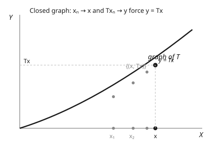

# Functional Analysis · Lesson 3.4: Open mapping and closed graph theorems

> ⏱ ~15 min · Module 3: Bounded operators, dual spaces, and the big theorems · Builds on: [3.3 The uniform boundedness principle](03-03-uniform-boundedness.md) · Unlocks: [3.5 Adjoints of bounded operators](03-05-adjoints-bounded-operators.md)

## Why this matters

Completeness is a *hypothesis you rarely have to spend*. Baire category (3.3) lets a Banach space upgrade weak-looking assumptions into strong conclusions almost for free — and this lesson is where the payoff peaks. Three theorems say: a continuous surjection is automatically *open*; a continuous bijection automatically has a *continuous inverse*; and — the one physicists lean on — an operator is *bounded* the moment its graph is *closed*, a condition that is strictly easier to check than continuity. The finale, Hellinger–Toeplitz, forces a genuinely quantum operator like momentum to abandon the whole Hilbert space and live on a smaller domain. That single fact is why quantum mechanics has "domain issues" at all — and Module 5 exists to deal with them.

## The idea

An **open** map sends open sets to open sets. That sounds like a technicality, but it's exactly what you need for an inverse to be continuous: if $T$ smears open balls into open sets, then $T^{-1}$ can't do anything violent — small outputs come only from small inputs. The **Open Mapping Theorem** says surjectivity plus continuity plus completeness *forces* this. You never have to build the openness by hand; Baire hands it to you.

The headline corollary is almost unfair. Suppose $T$ is a continuous linear bijection between Banach spaces. In finite dimensions "bijective linear map has continuous inverse" is obvious (everything is continuous). In infinite dimensions continuity is a real constraint — yet the theorem says **bijective + continuous $\Rightarrow$ homeomorphism, automatically.** You get the inverse's boundedness for free.

The **Closed Graph Theorem** repackages this into the most usable form. To prove $T$ is bounded you normally must show: *whenever $x_n \to x$, then $Tx_n \to Tx$* — you have to produce the limit of the outputs. The closed-graph condition lets you **assume the outputs already converge** to *some* $y$, and only asks you to check $y = Tx$. Assuming convergence and merely identifying the limit is a much lighter job than proving convergence from scratch — and in a Banach space it's *equivalent* to boundedness. That's the trick.

## The formal version

Throughout, $X, Y$ are **Banach spaces** (complete normed spaces) and $T\colon X\to Y$ is **linear**. "Bounded" means $\|Tx\|\le M\|x\|$ for some $M$; for linear maps bounded $=$ continuous.

**Open Mapping Theorem.** If $T\colon X\to Y$ is bounded and **surjective**, then $T$ is an **open map**: $T(U)$ is open in $Y$ for every open $U\subseteq X$.

*In words:* a continuous linear map that hits everything cannot compress an open set to something flat — it spreads open sets onto open sets.

**Bounded Inverse Theorem** (corollary). If $T\colon X\to Y$ is a bounded **bijection**, then $T^{-1}$ is bounded.

*In words:* a continuous linear bijection between Banach spaces is automatically a homeomorphism — you never have to check that the inverse is continuous.

**Closed Graph Theorem.** The **graph** of $T$ is $\Gamma(T)=\{(x,Tx): x\in X\}\subseteq X\times Y$. If $\Gamma(T)$ is **closed** in $X\times Y$, then $T$ is **bounded**.

*In words:* $T$ is bounded as soon as it passes this test — whenever $x_n\to x$ **and** $Tx_n\to y$, the limit is forced to be $y=Tx$. (Here $X\times Y$ carries the norm $\|(x,y)\|=\|x\|+\|y\|$, so $(x_n,Tx_n)\to(x,y)$ means $x_n\to x$ and $Tx_n\to y$ separately.)

Why "closed" is weaker to verify than "continuous": continuity demands you *show* $Tx_n$ converges and lands at $Tx$; closedness lets you *presuppose* $Tx_n\to y$ and only pin down $y$. All three theorems rest on Baire category (3.3) — and all three collapse if either space is incomplete.

## Concrete instance

**Hellinger–Toeplitz (this is Boss 3).** Let $H$ be a Hilbert space and let $T\colon H\to H$ be linear, **everywhere defined**, and **symmetric**:

$$\langle Tx, y\rangle = \langle x, Ty\rangle \qquad\text{for all } x,y\in H.$$

*In words:* $T$ can be moved from one slot of the inner product to the other without penalty. The claim: **any such $T$ is automatically bounded.** Symmetry is an algebraic condition — it says nothing on its face about limits or continuity — yet on a complete inner-product space it silently forces boundedness. The engine is the closed graph theorem, and the reason it applies is that symmetry lets us *identify* the limit of $Tx_n$ using the inner product, which is exactly what a closed graph asks for. We prove it in Example 1.

## Worked examples

**Example 1 (Hellinger–Toeplitz — Boss 3).** *Every everywhere-defined symmetric $T\colon H\to H$ is bounded.*

By the Closed Graph Theorem it suffices to show $\Gamma(T)$ is closed. So suppose

$$x_n \to x \quad\text{and}\quad Tx_n \to z,$$

and we must show $z = Tx$. Fix any $y\in H$ and use symmetry, then continuity of the inner product in each slot:

$$\langle z, y\rangle = \lim_{n\to\infty}\langle Tx_n, y\rangle = \lim_{n\to\infty}\langle x_n, Ty\rangle = \langle x, Ty\rangle = \langle Tx, y\rangle.$$

The first equality is $Tx_n\to z$; the second is symmetry applied to each $n$; the third is $x_n\to x$; the fourth is symmetry again. So $\langle z - Tx, y\rangle = 0$ for **every** $y\in H$. Taking $y = z - Tx$ gives $\|z - Tx\|^2 = 0$, hence $z = Tx$. The graph is closed, so $T$ is bounded. $\blacksquare$

Notice what carried the proof: we never showed $Tx_n$ converges — the closed-graph setup *gave* us its limit $z$, and symmetry let us name it. That is the whole reason to phrase boundedness through the graph.

**The physical consequence.** Read the theorem as a *prohibition*. A quantum observable is a symmetric operator (that's what makes measured values real — 2.1). Now take the momentum operator $P = -i\hbar\frac{d}{dx}$. Its spectrum is all of $\mathbb{R}$ — momentum takes arbitrarily large values — so $P$ is genuinely **unbounded** (an unbounded spectrum forces an unbounded operator; 4.1). Hellinger–Toeplitz then delivers a hard conclusion by contraposition:

$$\text{symmetric} + \text{everywhere defined} \;\Rightarrow\; \text{bounded}, \qquad\text{so}\qquad \text{unbounded} + \text{symmetric} \;\Rightarrow\; \text{not everywhere defined}.$$

Momentum **cannot** be defined on all of $H$. It must live on a *proper* domain $D(P)\subsetneq H$ — a dense subspace (functions smooth and decaying enough to differentiate and keep in $L^2$). This isn't a technical nuisance; it's a theorem-mandated fact of quantum mechanics, and it's precisely the crux Module 5 is built to handle.

**Example 2 (Bounded Inverse Theorem in action — equivalence of complete norms).** Suppose a vector space $V$ carries two norms $\|\cdot\|_1$ and $\|\cdot\|_2$, **both complete** (so $(V,\|\cdot\|_1)$ and $(V,\|\cdot\|_2)$ are Banach), and suppose one dominates the other:

$$\|x\|_1 \le C\,\|x\|_2 \qquad\text{for all } x\in V.$$

*Claim: the two norms are equivalent* — there is also a constant $c>0$ with $\|x\|_2 \le \tfrac1c\|x\|_1$, so they define the same topology.

Consider the identity map $\mathrm{Id}\colon (V,\|\cdot\|_2)\to(V,\|\cdot\|_1)$, $x\mapsto x$. It is a linear bijection, and the hypothesis $\|x\|_1\le C\|x\|_2$ says exactly that it is **bounded** (with norm $\le C$). Both spaces are Banach, so the Bounded Inverse Theorem applies: $\mathrm{Id}^{-1}\colon(V,\|\cdot\|_1)\to(V,\|\cdot\|_2)$ is bounded too, i.e. there is a $K$ with $\|x\|_2 \le K\|x\|_1$. Combining,

$$\tfrac1K\|x\|_2 \le \|x\|_1 \le C\|x\|_2,$$

so the norms are equivalent. *One inequality plus completeness buys the reverse inequality for free* — you never construct the constant $K$; the theorem guarantees it exists. (This is why, e.g., you can't put two inequivalent complete norms on the same space with one dominating the other — a common trap when comparing function-space norms.)

## Watch out

- **Both spaces must be Banach.** Every one of these theorems is powered by Baire category, which needs completeness. Drop it and they fail: the identity from $(C[0,1], \|\cdot\|_{\infty})$ to $(C[0,1], \|\cdot\|_1)$ is a bounded bijection, but its inverse is unbounded — because $\|\cdot\|_1$ is **not** complete on $C[0,1]$. Completeness isn't decoration; it's the whole mechanism.
- **The closed-graph condition looks weaker than continuity, and that's the point — not a bug.** Continuity says "$x_n\to x \Rightarrow Tx_n\to Tx$," which bundles *two* claims: that $Tx_n$ converges and that it converges to the right thing. Closedness only asks the second, *given* the first. It feels like you're proving less, yet on Banach spaces you get full continuity out. Never "simplify" a closed-graph argument by trying to also prove convergence — you'd be doing unnecessary work.
- **Closed $\ne$ bounded in general.** A *closed operator* (closed graph) is only equivalent to a *bounded operator* when it is **everywhere defined on a Banach space**. Unbounded operators like $\frac{d}{dx}$ are closed but not bounded — the escape hatch is that they are defined on a proper domain, not all of $H$, so the Closed Graph Theorem simply doesn't apply. Hellinger–Toeplitz is exactly this pincer: *everywhere-defined + symmetric* leaves no room to be unbounded, so unbounded symmetric operators must shrink their domain.
- **Symmetric does not mean bounded on its own — it means bounded only if everywhere defined.** The theorem's hypothesis "everywhere defined" is load-bearing. Forget it and you'd "prove" momentum is bounded, which is false.

## One-liner

> On Banach spaces completeness does the work: surjective-continuous is open, bijective-continuous is a homeomorphism, and closed-graph is bounded — so an everywhere-defined symmetric operator must be bounded, which banishes momentum to a proper domain.

## Problems

**P1 (🟢)** Let $T\colon X\to Y$ be a bounded linear bijection between Banach spaces with $\|Tx\|\ge m\|x\|$ for all $x$ and some $m>0$. Show directly that $\|T^{-1}\|\le \tfrac1m$. (This gives the inverse bound by hand *when you already have a lower bound* — the Bounded Inverse Theorem is the miracle that you need no such lower bound.)

**P2 (🟡)** Let $T\colon H\to H$ be a bounded operator on a Hilbert space and define $S$ on $H$ by the relation $\langle Sx, y\rangle = \langle x, Ty\rangle$ for all $x,y$ (the adjoint, previewing 3.5). Assuming $S$ is everywhere defined and linear, use the Closed Graph Theorem to show $S$ is bounded. (You may quote that $\langle\cdot,\cdot\rangle$ is continuous in each slot.)

**P3 (🔴, optional)** Let $X$ be a Banach space that is the direct sum $X = M\oplus N$ of two **closed** subspaces (every $x$ writes uniquely as $x = m+n$ with $m\in M$, $n\in N$). Let $P\colon X\to X$ be the projection $P(m+n)=m$. Show $P$ is bounded. (Hint: show $\Gamma(P)$ is closed using that $M$ and $N$ are closed.)

Solutions

**P1** Every $w\in Y$ equals $Tx$ for a unique $x = T^{-1}w$ (bijection). Apply the lower bound to that $x$:

$$\|w\| = \|Tx\| \ge m\|x\| = m\|T^{-1}w\| \;\Longrightarrow\; \|T^{-1}w\| \le \tfrac1m\|w\|.$$

Since this holds for all $w\in Y$, $\|T^{-1}\|\le \tfrac1m$. ✓ (The point of the Bounded Inverse Theorem is that in a Banach space you get *some* such bound automatically, even with no lower bound $m$ handed to you.)

**P2** By the Closed Graph Theorem it suffices to show $\Gamma(S)$ is closed. Suppose $x_n\to x$ and $Sx_n\to z$. For every $y\in H$,

$$\langle z, y\rangle = \lim_n \langle Sx_n, y\rangle = \lim_n \langle x_n, Ty\rangle = \langle x, Ty\rangle = \langle Sx, y\rangle,$$

using $Sx_n\to z$, the defining relation for each $n$, $x_n\to x$, and the defining relation once more. Hence $\langle z-Sx, y\rangle = 0$ for all $y$; take $y = z-Sx$ to get $z = Sx$. The graph is closed, so $S$ is bounded. ✓ (This is Hellinger–Toeplitz's twin — the adjoint's boundedness comes from the *same* graph argument. It's why 3.5 can take "$T^*$ is bounded" for granted.)

**P3** First, $P$ is linear: if $x = m+n$ and $x' = m'+n'$ then $x+x' = (m+m')+(n+n')$ is the unique decomposition, so $P(x+x') = m+m' = Px+Px'$ (scalars similarly). Now show $\Gamma(P)$ is closed: suppose $x_k\to x$ and $Px_k\to w$; we need $w = Px$. Write $x_k = m_k + n_k$ with $m_k\in M$, $n_k\in N$, so $Px_k = m_k \to w$. Since $M$ is closed and $m_k\in M$, the limit $w\in M$. Also $n_k = x_k - m_k \to x - w$, and $n_k\in N$ with $N$ closed, so $x-w\in N$. Thus $x = w + (x-w)$ with $w\in M$, $x-w\in N$ — this *is* the unique decomposition of $x$, so by definition $Px = w$. Hence $\Gamma(P)$ is closed and $P$ is bounded. ✓ (Uniqueness of the decomposition is what forces $Px = w$; closedness of $M,N$ is what keeps the limits inside them.)

## Flashback

**From Lesson 3.3 (The uniform boundedness principle):** Let $(f_n)$ be a sequence of bounded linear functionals on a Banach space $X$ such that for **every** fixed $x\in X$ the sequence of numbers $(f_n(x))$ converges — call its limit $f(x)$. Show that the pointwise limit $f$ is itself a *bounded* linear functional. (This is the standard "the limit of functionals is a functional" corollary — reconstruct it.)

Solution

*Linearity* is immediate from taking limits: $f(ax+by) = \lim_n f_n(ax+by) = \lim_n\big(a f_n(x)+b f_n(y)\big) = a f(x)+b f(y)$.

*Boundedness* is where uniform boundedness earns its keep. For each fixed $x$, the convergent sequence $(f_n(x))$ is bounded, so $\sup_n |f_n(x)| < \infty$ — i.e. the family $(f_n)$ is **pointwise bounded**. Since $X$ is a Banach space, the Uniform Boundedness Principle upgrades this to a **uniform** bound: there is $M$ with $\|f_n\|\le M$ for all $n$. Now for any $x$,

$$|f(x)| = \lim_n |f_n(x)| \le \limsup_n \|f_n\|\,\|x\| \le M\|x\|.$$

So $\|f\|\le M < \infty$ and $f$ is bounded. ✓ The individual bounds $\|f_n\|$ could have grown without control a priori; completeness (via Baire) is exactly what forbids that and lets the limit inherit a finite norm.

## Connections

- **Backward:** all three theorems are Baire-category machines — the same engine as [3.3 uniform boundedness](03-03-uniform-boundedness.md), and Baire itself is a completeness fact from [Real Analysis](../../real-analysis/syllabus.md). Boundedness of operators is the [3.1](03-01-bounded-operators-operator-norm.md) notion; symmetry is the inner-product structure from [2.1 inner products](02-01-inner-products-cauchy-schwarz.md).
- **Forward:** [3.5 adjoints](03-05-adjoints-bounded-operators.md) uses the closed-graph argument (P2) to know $T^*$ is bounded. The Hellinger–Toeplitz obstruction is the *entire motivation* for [5.1 unbounded operators and domains](05-01-unbounded-operators-domains.md) and [5.2 symmetric vs self-adjoint](05-02-symmetric-vs-self-adjoint.md): once an operator can't sit on all of $H$, "which dense domain?" becomes the central question.
- **Sideways (quantum mechanics):** this lesson is the reason observables like position and momentum are defined only on dense domains, not the whole state space — Hellinger–Toeplitz makes "everywhere-defined unbounded symmetric operator" a contradiction. See [Quantum Mechanics](../../quantum-mechanics/syllabus.md).
- **Sideways (PDEs):** differential operators such as $\frac{d}{dx}$ and the Laplacian are the canonical closed-but-unbounded operators — closed graph theory is exactly how one handles their domains rigorously. See [PDEs](../../pdes/syllabus.md).
