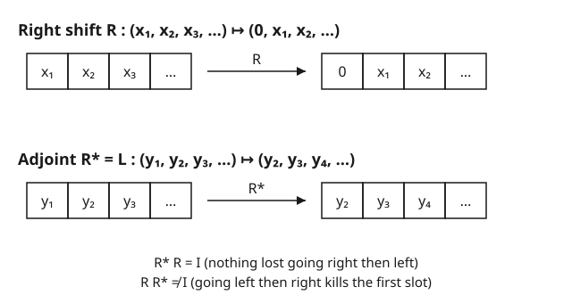

# Functional Analysis · Lesson 3.5: Adjoints of bounded operators

> ⏱ ~15 min · Module 3: Bounded operators, dual spaces, and the big theorems · Builds on: [3.4 Open mapping and closed graph theorems](03-04-open-mapping-closed-graph.md) · Unlocks: [4.1 The spectrum of an operator](04-01-spectrum-of-an-operator.md)

## Why this matters

In finite dimensions you already know this move: to transpose-and-conjugate a matrix $A$ is to build $A^*$, and the "nice" matrices — Hermitian, unitary, normal — are defined by how $A$ relates to $A^*$. That entire apparatus survives into infinite dimensions, and it is the backbone of the rest of this course and of quantum mechanics. Every observable (energy, position, momentum) is a **self-adjoint** operator; every symmetry and every time-evolution is a **unitary** one; the operators the spectral theorem can diagonalize are exactly the **normal** ones. The adjoint $T^*$ is the single construction that defines all three classes — so before we can talk about spectra (Module 4) we need to know $T^*$ exists, is unique, and behaves.

## The idea

An operator $T$ acts on vectors. But you can also watch what it does *from the other side of an inner product*: instead of asking "where does $T$ send $x$?", ask "what fixed operation, applied to $y$, would give the same number $\langle Tx, y\rangle$ for every $x$?" That operation is the adjoint $T^*$. It is $T$ "moved across the inner product."

Why must such a thing exist? Fix $y$. The map $x \mapsto \langle Tx, y\rangle$ is a bounded linear functional (linear because $T$ and the inner product are; bounded because $|\langle Tx,y\rangle| \le \|Tx\|\,\|y\| \le \|T\|\,\|y\|\,\|x\|$). By **Riesz representation** ([2.4](02-04-riesz-representation.md)) every bounded functional is inner-product-against-one-vector — call that vector $T^*y$. So $T^*y$ is *forced to exist*, one $y$ at a time, purely because functionals on a Hilbert space have nowhere to hide: they are all secretly vectors. The adjoint is Riesz applied uniformly.

## The formal version

Let $H$ be a Hilbert space, $T : H \to H$ bounded, with inner product linear in the **first** slot and conjugate-linear in the second (our convention from 2.1: $\langle x,y\rangle = \overline{\langle y,x\rangle}$).

**Definition (adjoint).** The **adjoint** $T^*$ is the unique bounded operator satisfying

$$\langle Tx,\, y\rangle \;=\; \langle x,\, T^*y\rangle \qquad \text{for all } x,y \in H.$$

*In words:* $T^*$ is whatever you must do to the second slot to undo having done $T$ to the first slot — the same number, computed from the other side.

**Existence and boundedness.** For each $y$, Riesz gives a unique $T^*y$ representing the functional $x\mapsto\langle Tx,y\rangle$; one checks $T^*$ is linear, and $\|T^*\| = \|T\| < \infty$, so $T^*$ is a genuine bounded operator. *In words:* the adjoint always exists and is exactly as big as $T$.

**Algebra of the star.** For bounded $S,T$ and scalar $\alpha$:

$$(T^*)^* = T, \qquad (S T)^* = T^* S^*, \qquad (\alpha T)^* = \overline{\alpha}\,T^*, \qquad (S+T)^* = S^*+T^*.$$

*In words:* starring twice returns you home; it reverses the order of a product (like transpose) and conjugates scalars (like complex conjugation). It is an order-reversing, conjugate-linear involution.

**The C\*-identity.** Norms interact with the star through one sharp equation:

$$\|T^*T\| \;=\; \|T\|^2.$$

*In words:* composing $T$ with its adjoint squares the norm exactly — no inequality, no constant. This single identity is the algebraic seed of the entire theory of C\*-algebras and of the spectral theorem.

**The three classes.** Define an operator by its relationship to its own star:

$$\underbrace{T = T^*}_{\text{self-adjoint}}, \qquad \underbrace{T^*T = TT^* = I}_{\text{unitary}}, \qquad \underbrace{T^*T = TT^*}_{\text{normal}}.$$

*In words:* **self-adjoint** operators are the "real" ones (they are the observables, with real spectrum — [4.4](04-04-spectral-theorem-compact-self-adjoint.md)); **unitary** operators preserve every inner product, hence all lengths and angles (symmetries and time-evolution); **normal** operators are the ones that commute with their adjoint, and they are precisely the class the spectral theorem diagonalizes ([4.5](04-05-bounded-self-adjoint-spectral-theorem.md)). Self-adjoint and unitary are both special cases of normal.

## Concrete instance

Three adjoints you should be able to write down on sight:

- **Shifts on $\ell^2$.** The right shift $R$ and the left shift $L$ are adjoints of each other: $R^* = L$ and $L^* = R$ (Worked Example 1).
- **Multiplication on $L^2$.** For $\varphi \in L^\infty$, the operator $(M_\varphi f)(t) = \varphi(t) f(t)$ has adjoint $M_\varphi^* = M_{\overline{\varphi}}$ — multiply by the complex conjugate function (Worked Example 2).
- **Integral operators on $L^2$.** If $(Tf)(x) = \int k(x,y)\,f(y)\,dy$, then the adjoint has the **swapped, conjugated kernel** $k^*(x,y) = \overline{k(y,x)}$. It is self-adjoint exactly when $k(y,x) = \overline{k(x,y)}$ — the continuous analogue of a Hermitian matrix.

The picture shows the shift pair, and the one-sided oddity that only infinite dimensions permit.

## Worked examples

**Example 1 (mechanical — the right shift's adjoint is the left shift).** On $\ell^2$, let $R(x_1,x_2,x_3,\dots) = (0,x_1,x_2,\dots)$. Find $R^*$. Using $\langle a,b\rangle = \sum_n a_n\,\overline{b_n}$:

$$\langle Rx,\,y\rangle = \sum_{n\ge 1} (Rx)_n\,\overline{y_n} = 0\cdot\overline{y_1} + \sum_{n\ge 2} x_{n-1}\,\overline{y_n} = \sum_{k\ge 1} x_k\,\overline{y_{k+1}}.$$

We want this to read as $\langle x, R^*y\rangle = \sum_k x_k\,\overline{(R^*y)_k}$. Matching the conjugated second factor coordinate by coordinate: $(R^*y)_k = y_{k+1}$, i.e. $R^*y = (y_2, y_3, y_4,\dots)$ — the **left shift** $L$. So $R^* = L$.

Now the twist. Composing them:

$$R^*R\,x = L(0,x_1,x_2,\dots) = (x_1,x_2,\dots) = x \;\Rightarrow\; R^*R = I,$$
$$RR^*\,y = R(y_2,y_3,\dots) = (0,y_2,y_3,\dots) \ne y \;\text{ in general}.$$

So $R$ satisfies $R^*R = I$ — it is an **isometry** ($\|Rx\| = \|x\|$, since $\|Rx\|^2 = \langle R^*Rx,x\rangle = \|x\|^2$) — yet $RR^* \ne I$, so it is **not unitary**. It is injective but not surjective (it misses everything with nonzero first coordinate). In finite dimensions an injective operator is automatically surjective, so this cannot happen there: **one-sided invertibility is a purely infinite-dimensional phenomenon.** ($RR^*$ is in fact the orthogonal projection onto $\{y : y_1 = 0\}$.)

**Example 2 (why you'd care — multiplication operators and self-adjointness).** On $H = L^2(\mathbb{R})$, fix $\varphi \in L^\infty$ and let $(M_\varphi f)(t) = \varphi(t)f(t)$ (bounded, with $\|M_\varphi\| = \|\varphi\|_\infty$). Compute the adjoint:

$$\langle M_\varphi f,\, g\rangle = \int \varphi(t) f(t)\,\overline{g(t)}\,dt = \int f(t)\,\overline{\,\overline{\varphi(t)}\,g(t)\,}\,dt = \langle f,\, M_{\overline\varphi}\,g\rangle.$$

Hence $M_\varphi^* = M_{\overline{\varphi}}$. Read off the classes immediately:

- **Self-adjoint** $\iff M_\varphi = M_{\overline\varphi} \iff \varphi = \overline\varphi \iff \varphi$ is **real-valued**.
- **Unitary** $\iff M_{\overline\varphi}M_\varphi = M_{|\varphi|^2} = I \iff |\varphi(t)| = 1$ a.e.

This is the analyst's diagonal matrix: $\varphi$ plays the role of the diagonal entries, "real diagonal $=$ Hermitian" and "unit-modulus diagonal $=$ unitary" carry over verbatim. In quantum mechanics the position operator is exactly $M_t$ (multiply by $t$), self-adjoint because $t$ is real — which is *why* position is an observable.

## Watch out

- **The adjoint depends on the inner product, not just on $T$.** $T^*$ is the *Hilbert-space* adjoint, defined through $\langle\cdot,\cdot\rangle$. On a Banach space with no inner product there is a different object, the **transpose** (or Banach adjoint) $T' : Y^* \to X^*$ acting on dual spaces via $(T'f)(x) = f(Tx)$. On a Hilbert space the two are related by the Riesz map but differ by a conjugation — don't conflate them.
- **$R^*R = I$ does not make $R$ invertible.** An isometry has a left inverse ($R^*$) but need not have a right inverse. "Injective" and "surjective" decouple in infinite dimensions; only a *surjective* isometry is unitary. Checking one side is not enough.
- **"Self-adjoint" is unambiguous only for bounded, everywhere-defined operators.** For **unbounded** operators (differentiation, momentum $-i\frac{d}{dx}$ — Module 5) the equation $T = T^*$ hides a domain condition: $T$ and $T^*$ must have the *same domain*, not merely agree where both are defined. A symmetric operator can fail to be self-adjoint on that technicality ([5.2](05-02-symmetric-vs-self-adjoint.md)), and the whole spectral theorem for such operators hinges on getting it right. Flag it now; here, boundedness makes it a non-issue.

## One-liner

> The adjoint is $T$ carried across the inner product — Riesz forces it to exist, the C\*-identity $\|T^*T\|=\|T\|^2$ pins its norm, and how $T$ sits against $T^*$ sorts operators into self-adjoint (observables), unitary (symmetries), and normal (diagonalizable).

## Problems

**P1 (🟢)** On $\ell^2$ let $D$ be the diagonal operator $D(x_1,x_2,\dots) = (\lambda_1 x_1, \lambda_2 x_2, \dots)$ with $(\lambda_n)$ bounded. Find $D^*$, and state exactly when $D$ is (a) self-adjoint and (b) unitary.

**P2 (🟡)** Show that if $T$ is self-adjoint then $\langle Tx, x\rangle$ is **real** for every $x \in H$. (This is why self-adjoint operators can represent measurable, real-valued quantities.)

**P3 (🔴, optional)** Prove the C\*-identity $\|T^*T\| = \|T\|^2$ for any bounded $T$ on a Hilbert space. You may use $\|T^*\| = \|T\|$ and $\|AB\| \le \|A\|\,\|B\|$.

Solutions

**P1** With $\langle a,b\rangle = \sum_n a_n\overline{b_n}$:
$$\langle Dx, y\rangle = \sum_n \lambda_n x_n\,\overline{y_n} = \sum_n x_n\,\overline{\,\overline{\lambda_n}\,y_n\,} = \langle x, D^*y\rangle,$$
so $D^*y = (\overline{\lambda_1}y_1, \overline{\lambda_2}y_2,\dots)$ — the diagonal operator with **conjugated** entries, $D^* = \text{diag}(\overline{\lambda_n})$.

(a) Self-adjoint $\iff \overline{\lambda_n} = \lambda_n$ for all $n \iff$ every $\lambda_n$ is **real**.
(b) $D^*D = \text{diag}(|\lambda_n|^2)$, so unitary $\iff D^*D = DD^* = I \iff |\lambda_n| = 1$ for all $n$. (Both hold together since diagonal operators commute.)

**P2** Since $T = T^*$, move it across the inner product and use conjugate-symmetry $\langle a,b\rangle = \overline{\langle b,a\rangle}$:
$$\langle Tx, x\rangle = \langle x, T^*x\rangle = \langle x, Tx\rangle = \overline{\langle Tx, x\rangle}.$$
A number equal to its own conjugate is real. $\blacksquare$

**P3** Two inequalities.

*Upper bound.* By submultiplicativity and $\|T^*\| = \|T\|$:
$$\|T^*T\| \le \|T^*\|\,\|T\| = \|T\|^2.$$

*Lower bound.* For any $x$ with $\|x\|\le 1$, using the defining relation of the adjoint and Cauchy–Schwarz:
$$\|Tx\|^2 = \langle Tx, Tx\rangle = \langle T^*T x,\, x\rangle \le \|T^*Tx\|\,\|x\| \le \|T^*T\|\,\|x\|^2 \le \|T^*T\|.$$
Taking the supremum over $\|x\|\le 1$ gives $\|T\|^2 \le \|T^*T\|$.

Combining, $\|T^*T\| = \|T\|^2$. $\blacksquare$

(Note the lower bound alone re-proves $\|T\|^2 \le \|T^*T\| \le \|T^*\|\|T\|$, hence $\|T\| \le \|T^*\|$; applying it to $T^*$ gives the reverse, so this argument even *contains* the fact $\|T^*\| = \|T\|$.)

## Flashback

**From Lesson 3.4 (Open mapping and closed graph theorems):** Let $T:\ell^2 \to \ell^2$ be the bounded diagonal operator $Tx = \left(\tfrac{x_1}{1}, \tfrac{x_2}{2}, \tfrac{x_3}{3}, \dots\right)$. It is injective, so an inverse $T^{-1}$ exists on its range. Is $T^{-1}$ bounded? The **bounded inverse theorem** says a bounded bijection between Banach spaces has bounded inverse — so what goes wrong here, and which hypothesis fails?

Solution

On the range, $T^{-1}y = (1\cdot y_1,\, 2\cdot y_2,\, 3\cdot y_3,\dots)$. This is **unbounded**: take $y = e_n$ (the $n$-th basis vector), which is in the range since $e_n = T(n\,e_n)$; then $\|e_n\| = 1$ but $\|T^{-1}e_n\| = \|n\,e_n\| = n \to \infty$. So $T^{-1}$ has no finite operator norm.

No contradiction with the bounded inverse theorem, because its hypothesis fails: $T$ is **not surjective onto $\ell^2$**. Its range is the dense but proper subspace $\{y : \sum_n n^2|y_n|^2 < \infty\}$ (e.g. $y_n = 1/n$ gives $y\in\ell^2$ but $\sum n^2 (1/n)^2 = \sum 1 = \infty$, so this $y$ is not hit). The theorem needs a bijection onto the *whole* Banach space; a bounded injection with non-closed range gives no guarantee, and here the inverse is genuinely unbounded. The lesson: injectivity buys you a bounded inverse only when the range is all of $Y$ (or at least closed). $\blacksquare$

## Connections

- **Backward:** the adjoint is [2.4](02-04-riesz-representation.md)'s Riesz representation applied to the functional $x\mapsto\langle Tx,y\rangle$ — it exists for no reason other than that Hilbert functionals are vectors. It acts on the bounded operators of [3.1](03-01-bounded-operators-operator-norm.md), and its boundedness is what the closed-graph circle of [3.4](03-04-open-mapping-closed-graph.md) guarantees.
- **Forward:** the spectrum ([4.1](04-01-spectrum-of-an-operator.md)) of a self-adjoint operator is **real** and of a unitary operator sits on the unit circle ([4.4](04-04-spectral-theorem-compact-self-adjoint.md)); the spectral theorem ([4.5](04-05-bounded-self-adjoint-spectral-theorem.md)) diagonalizes exactly the normal operators. The unbounded version ([5.2](05-02-symmetric-vs-self-adjoint.md), [5.3](05-03-spectral-theorem-unbounded.md)) is where the domain subtlety flagged above becomes the whole story.
- **Sideways (quantum mechanics):** observables are self-adjoint operators (real measured values, from P2), symmetries and time-evolution $e^{-itH}$ are unitary (they preserve total probability) — see [quantum-mechanics](../../quantum-mechanics/syllabus.md).
- **Sideways (linear algebra):** every identity here specializes to the conjugate transpose $A^*$ of a matrix — $T=T^*$ is Hermitian, $T^*T=I$ is unitary, and the diagonal operators of P1 are literally diagonal matrices; the [linalg-refresher](../../linalg-refresher/syllabus.md) Hermitian/unitary theory is the finite-dimensional shadow of this lesson.
