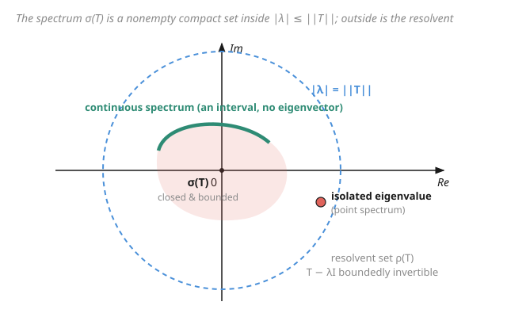

# Functional Analysis · Lesson 4.1: The spectrum of an operator

> ⏱ ~15 min · Module 4: Spectral theory · Builds on: [3.5 Adjoints of bounded operators](03-05-adjoints-bounded-operators.md) · Unlocks: [4.2 Compact operators](04-02-compact-operators.md)

## Why this matters

In finite dimensions a matrix is understood the moment you know its eigenvalues: they are the numbers $\lambda$ where $A - \lambda I$ collapses, and diagonalizing organizes everything else around them. In infinite dimensions this program *almost* works — but "eigenvalue" turns out to be too crude a tool. Perfectly reasonable operators have **no eigenvalues at all** yet clearly have "special numbers" attached to them. Multiplication by $x$ on $L^2[0,1]$ is the standard shock: it behaves like a diagonal matrix with the whole interval $[0,1]$ on its diagonal, but not a single one of those numbers is an eigenvalue. The **spectrum** is the correct generalization, and it is the object quantum mechanics actually cares about: for an observable, the spectrum *is* the set of values a measurement can return. Position has a continuous spectrum precisely because $M_x$ has no eigenvectors.

## The idea

An eigenvalue is a number $\lambda$ where $T - \lambda I$ *fails to be invertible*. In finite dimensions there is only one way to fail: the map squashes some nonzero vector to $0$ (it stops being injective), and then $\det(T-\lambda I) = 0$. Injective and surjective come as a package — lose one, lose both.

Infinite dimensions break that package apart. A linear map $T - \lambda$ can be:

- injective but not surjective (misses some vectors),
- injective with dense range but *still* not surjective (misses a "thin" set — its inverse exists on the range but is **unbounded**),
- surjective but not injective,

and these are genuinely different diseases. So instead of asking "does $T - \lambda$ have a nonzero kernel?" we ask the honest question: **is $T - \lambda I$ a bijection with a bounded inverse?** If yes, $\lambda$ is *good* (resolvent set). If it fails in *any* way, $\lambda$ is *bad* (spectrum). The eigenvalues are only the most obvious kind of bad.

## The formal version

Let $T$ be a bounded linear operator on a Banach space $X$ (think Hilbert space $H$), and $I$ the identity. Write $T - \lambda$ for $T - \lambda I$.

**Resolvent set.**
$$\rho(T) = \{\lambda \in \mathbb{C} : T - \lambda I \text{ is a bijection } X \to X \text{ with a bounded inverse}\}.$$
*In words:* the "good" $\lambda$ — those where $(T-\lambda)^{-1}$ exists as an honest bounded operator. (By the open mapping theorem [3.4], a bounded bijection *automatically* has a bounded inverse, so on a Banach space "bijection" already gives you the rest for free.)

**Spectrum.**
$$\sigma(T) = \mathbb{C} \setminus \rho(T).$$
*In words:* every $\lambda$ where $T - \lambda$ fails to be boundedly invertible, for *any* reason. This is the generalization of "set of eigenvalues."

The spectrum splits by *how* $T-\lambda$ fails:

- **Point spectrum** $\sigma_p$: $T - \lambda$ is not injective. Then some $v \neq 0$ has $Tv = \lambda v$ — a genuine **eigenvalue** with eigenvector $v$.
- **Continuous spectrum** $\sigma_c$: $T - \lambda$ is injective with *dense* range, but not surjective. *In words:* no eigenvector exists, yet you can approximate any target as closely as you like — the inverse exists on a dense set but is unbounded, so it doesn't extend.
- **Residual spectrum** $\sigma_r$: $T - \lambda$ is injective but its range is *not even dense*. *In words:* there is a whole direction the operator's outputs never approach.

**The three big facts.**

$$\sigma(T) \text{ is nonempty, compact, and } \sigma(T) \subseteq \{\lambda : |\lambda| \le \|T\|\}.$$
*In words:* the spectrum is never empty (over $\mathbb{C}$), it is closed and bounded, and it lives inside the disk of radius $\|T\|$. Sharper than that radius is the **spectral radius**
$$r(T) = \max\{|\lambda| : \lambda \in \sigma(T)\} = \lim_{n\to\infty}\|T^n\|^{1/n} \le \|T\|.$$
*In words:* the farthest-out spectral point sits at exactly $\lim \|T^n\|^{1/n}$ — computable from norms of powers, no eigenvalues needed.

**Self-adjoint bonus.** If $T = T^*$ (self-adjoint, from [3.5]), then $\sigma(T) \subseteq \mathbb{R}$: the spectrum is real. *In words:* symmetric operators can only have real "special values" — which is exactly why quantum observables (self-adjoint) yield real measurements. We exploit this fully in [4.4](04-04-spectral-theorem-compact-self-adjoint.md).

## Picture

## Worked examples

**Example 1 (continuous spectrum, zero eigenvalues — multiplication by $x$).** On $H = L^2[0,1]$ define $(M_x f)(t) = t\,f(t)$. First, $\|M_x\| = \sup_{t\in[0,1]}|t| = 1$, so $\sigma(M_x) \subseteq \{|\lambda|\le 1\}$. We claim
$$\sigma(M_x) = [0,1], \quad \text{entirely continuous spectrum — no eigenvalues.}$$

*No eigenvalues.* Suppose $M_x f = \lambda f$, i.e. $(t-\lambda)f(t) = 0$ for a.e. $t$. Since $t - \lambda \neq 0$ except at the single point $t=\lambda$ (measure zero), we get $f(t)=0$ a.e., so $f = 0$ in $L^2$. A function "concentrated at one point" is the zero vector here. So $\sigma_p = \varnothing$.

*Which $\lambda$ are in the spectrum?* $M_x - \lambda$ is multiplication by $(t-\lambda)$; its formal inverse is multiplication by $\frac{1}{t-\lambda}$.

- If $\lambda \notin [0,1]$: then $|t-\lambda|$ is bounded below by a positive constant on $[0,1]$, so $\frac{1}{t-\lambda}$ is a *bounded* function and multiplication by it is a bounded inverse. Thus $\lambda \in \rho(M_x)$.
- If $\lambda \in [0,1]$: $M_x - \lambda$ is injective (same computation as above). Its range is *dense* — any $g$ with $\frac{g}{t-\lambda}\in L^2$ is hit, and such $g$ are dense. But it is *not surjective*: the constant function $g \equiv 1$ would require $f = \frac{1}{t-\lambda}$, and $\int_0^1 \frac{dt}{(t-\lambda)^2} = \infty$, so $f \notin L^2$. Injective, dense range, not surjective $\Rightarrow$ $\lambda \in \sigma_c$.

So $\sigma(M_x) = [0,1]$, all continuous. The operator acts *exactly* like a diagonal matrix with entry $t$ at "coordinate $t$" — its spectrum is the range of the multiplier — yet the continuum of diagonal entries leaves no room for a normalizable eigenvector at any single value. (General fact: a multiplication operator $M_\varphi$ has $\sigma(M_\varphi) = \overline{\operatorname{ess\,ran}\,\varphi}$, the essential range of the multiplier.)

**Example 2 (a disk of eigenvalues — the left shift on $\ell^2$).** Define the **left shift** $L(x_1, x_2, x_3, \dots) = (x_2, x_3, x_4, \dots)$. It drops the first coordinate; $\|L\| = 1$, so $\sigma(L)\subseteq\{|\lambda|\le 1\}$.

*Eigenvalues.* Solve $Lv = \lambda v$: the equation $(v_2, v_3, \dots) = \lambda(v_1, v_2, \dots)$ says $v_{n+1} = \lambda v_n$, so $v_n = \lambda^{\,n-1}v_1$. Take $v_1 = 1$:
$$v = (1, \lambda, \lambda^2, \lambda^3, \dots).$$
This lies in $\ell^2$ iff $\sum_{n\ge 0}|\lambda|^{2n} < \infty$ iff $|\lambda| < 1$ (geometric series). So **every** $\lambda$ with $|\lambda|<1$ is an eigenvalue — an entire open disk of point spectrum. Since $\sigma(L)$ is closed and contains the open unit disk, it contains its closure; combined with $\sigma(L)\subseteq\{|\lambda|\le1\}$,
$$\sigma(L) = \{\lambda : |\lambda| \le 1\}, \quad \text{the closed unit disk.}$$
The boundary $|\lambda|=1$ is in the spectrum but *not* point spectrum: there $v=(1,\lambda,\lambda^2,\dots)$ has all entries of modulus $1$, not summable. (Contrast the **right shift** $R(x_1,x_2,\dots) = (0,x_1,x_2,\dots)$, which is the adjoint $R = L^*$ from [3.5]. It has the *same* spectrum, the closed disk, but **no eigenvalues at all**: $Rv=\lambda v$ forces $v=0$. Its open disk $|\lambda|<1$ is *residual* spectrum — the range of $R-\lambda$ isn't dense, because $\overline{\operatorname{ran}(R-\lambda)}^\perp = \ker(R-\lambda)^* = \ker(L-\bar\lambda) \neq \{0\}$.) One operator, all point spectrum; its adjoint, all residual — same disk. That is the phenomenon eigenvalues alone cannot see.

## Watch out

- **You might think the spectrum is just the eigenvalues.** In infinite dimensions $\sigma(T) \supsetneq \sigma_p(T)$ in general — the continuous and residual parts have **no eigenvectors whatsoever** (Example 1 has an entire interval of spectrum and not one eigenvalue). "Eigenvalue" is only the point-spectrum slice.
- **You might think $\lambda \in \sigma(T)$ means $T-\lambda$ isn't invertible as a map.** It means $T - \lambda$ fails to be *boundedly* invertible — three distinct failure modes (not injective / injective but not surjective with dense range / range not dense). A one-to-one $T-\lambda$ with an inverse that is merely unbounded still puts $\lambda$ in the spectrum.
- **You might think some operator could have empty spectrum.** Over $\mathbb{C}$, never: $\sigma(T)$ is *always* nonempty. The proof needs complex scalars — the resolvent $\lambda \mapsto (T-\lambda)^{-1}$ is an *analytic* operator-valued function on $\rho(T)$, and if $\sigma(T)$ were empty it would be entire and vanish at infinity, forcing $(T-\lambda)^{-1}\equiv 0$ by Liouville — impossible. This is complex analysis reaching into operator theory (see [Complex Analysis](../../complex-analysis/syllabus.md)); over $\mathbb{R}$ the claim is false (rotation has no real spectrum).
- **You might think $r(T) = \|T\|$.** Only $r(T) \le \|T\|$ in general. A nonzero nilpotent-like operator can have $r(T)=0$ with $\|T\|>0$; the spectral radius is the *sharp* bound, read off from $\lim\|T^n\|^{1/n}$.

## One-liner

> The spectrum is the set of $\lambda$ where $T-\lambda$ fails to be *boundedly* invertible — a nonempty compact subset of $\{|\lambda|\le\|T\|\}$ that generalizes eigenvalues into point, continuous, and residual parts.

## Problems

**P1 (🟢)** Let $D = \operatorname{diag}(1, \tfrac12, \tfrac13, \dots)$ act on $\ell^2$ by $D(x_n) = (\tfrac{1}{n}x_n)$. Find all eigenvalues, then determine $\sigma(D)$. (Is $0$ an eigenvalue? Is it in the spectrum?)

**P2 (🟡)** For the multiplication operator $M_\varphi$ on $L^2[0,1]$ with $\varphi(t) = t^2$, given the general fact $\sigma(M_\varphi) = \overline{\operatorname{ess\,ran}\,\varphi}$, find $\sigma(M_\varphi)$ and its spectral radius $r(M_\varphi)$. Which numbers, if any, are eigenvalues?

**P3 (🔴, optional)** Let $T$ be a bounded self-adjoint operator on a Hilbert space with $\|T\| = 3$. What is the largest possible value of $r(T)$, and what is the smallest possible diameter of $\sigma(T)$ as a subset of $\mathbb{C}$? Justify using the facts $\sigma(T)\subseteq\mathbb{R}$, $\sigma(T)$ nonempty, and $r(T)=\max\{|\lambda|:\lambda\in\sigma(T)\}$.

Solutions

**P1** $D$ is diagonal, so $De_n = \tfrac1n e_n$ for each standard basis vector $e_n$: every $\tfrac1n$ ($n=1,2,\dots$) is an eigenvalue, with eigenvector $e_n$. So $\sigma_p(D) = \{1, \tfrac12, \tfrac13, \dots\}$.

Now $0$: is it an eigenvalue? $D v = 0$ means $\tfrac1n v_n = 0$ for all $n$, so $v = 0$ — **not** an eigenvalue. But is $0 \in \sigma(D)$? The spectrum is closed, and $\tfrac1n \to 0$, so $0$ is a limit point of $\sigma_p(D)$ and must lie in the (closed) spectrum. Concretely $D^{-1}$ would be $\operatorname{diag}(1,2,3,\dots)$, which is unbounded, so $D-0 = D$ has no bounded inverse. Hence
$$\sigma(D) = \{1, \tfrac12, \tfrac13, \dots\} \cup \{0\},$$
with $0$ in the *continuous* spectrum (injective, dense range, unbounded inverse). This is the cleanest illustration that $\sigma \supsetneq \sigma_p$: a limit of eigenvalues joins the spectrum without itself being one.

**P2** The essential range of $\varphi(t)=t^2$ on $[0,1]$ is its actual range $[0,1]$ (continuous function, no null sets to discard), so
$$\sigma(M_\varphi) = [0,1], \qquad r(M_\varphi) = \max\{|\lambda| : \lambda \in [0,1]\} = 1.$$
No eigenvalues: $M_\varphi f = \lambda f$ needs $(t^2-\lambda)f = 0$ a.e., and $t^2 - \lambda$ vanishes only at $t = \sqrt\lambda$ (one point, measure zero), forcing $f=0$. So $\sigma_p = \varnothing$ and all of $[0,1]$ is continuous spectrum — same story as $M_x$.

**P3** Because $\sigma(T)\subseteq\mathbb{R}$, the spectrum is a nonempty compact subset of the real line, and $r(T) = 3$ says the point of largest modulus sits at $|\lambda|=3$, i.e. $\sigma(T)$ contains $3$ or $-3$ (or both). The *largest possible* $r(T)$ is exactly $3$: $r(T)\le\|T\|=3$ always, and it is attained (e.g. $T = 3I$ has $\sigma = \{3\}$, $r = 3$).

Smallest possible *diameter*: the diameter is $\max\sigma - \min\sigma$ (real set). To keep it small we want $\sigma$ concentrated — but it must include a point at modulus $3$ *and* be nonempty. A single point $\{3\}$ (from $T=3I$) achieves diameter $0$. So the smallest possible diameter is $\boxed{0}$, realized by $T = 3I$ (or $T=-3I$). The constraint $\|T\|=3$ pins the *radius* but not the *spread*: nothing forces two distinct spectral points.

## Flashback

**From Lesson 3.5 (Adjoints of bounded operators):** Let $R$ be the right shift on $\ell^2$, $R(x_1,x_2,\dots) = (0,x_1,x_2,\dots)$. Show directly from the adjoint identity $\langle Rx, y\rangle = \langle x, R^*y\rangle$ that $R^* = L$ (the left shift), and compute $\|R\|$ and $\|R^*\|$.

Solution

Compute the pairing on standard vectors. For $x = (x_n)$, $y = (y_n)$ in $\ell^2$,
$$\langle Rx, y\rangle = \sum_{n\ge 1} (Rx)_n\,\overline{y_n} = \underbrace{0\cdot\overline{y_1}}_{n=1} + \sum_{n\ge 2} x_{n-1}\,\overline{y_n} = \sum_{k\ge 1} x_k\,\overline{y_{k+1}},$$
reindexing $k = n-1$. For this to equal $\langle x, R^*y\rangle = \sum_k x_k \,\overline{(R^*y)_k}$ for all $x$, match coefficients: $(R^*y)_k = y_{k+1}$. That is exactly the left shift, so $R^* = L$. ✓

Norms: $\|Rx\|^2 = \sum_{n\ge1}|x_n|^2 = \|x\|^2$ (prepending a zero preserves the tail), so $R$ is an isometry and $\|R\| = 1$. And $\|R^*\| = \|R\| = 1$ (adjoints preserve norm, from 3.5). Note $R$ is *not* surjective — its range misses every vector with nonzero first coordinate — which is precisely why $R^*R = I$ but $RR^* \neq I$: an infinite-dimensional isometry need not be invertible, the very slack that makes the shift's spectrum a full disk in this lesson.

## Connections

- **Backward:** the definition of $\rho(T)$ leans on "bounded inverse," and the open mapping / bounded-inverse machinery of [3.4](03-04-open-mapping-closed-graph.md) is what lets us drop "bounded" once we know $T-\lambda$ is a bijection. The self-adjoint case $\sigma(T)\subseteq\mathbb{R}$ rests directly on the adjoint from [3.5](03-05-adjoints-bounded-operators.md).
- **Forward:** [4.2 Compact operators](04-02-compact-operators.md) and [4.4 the spectral theorem for compact self-adjoint operators](04-04-spectral-theorem-compact-self-adjoint.md) show that *tameness* (compactness + self-adjointness) tames the spectrum back into a discrete set of honest eigenvalues — the continuous spectrum disappears. [4.5](04-05-bounded-self-adjoint-spectral-theorem.md) then handles the general bounded self-adjoint case, where continuous spectrum returns and is organized by a spectral measure.
- **Sideways (quantum mechanics):** the spectrum of a self-adjoint observable is *literally its set of possible measured values*. Discrete point spectrum = quantized levels (energy of a bound electron); continuous spectrum = continuous observables like position and momentum — position is $M_x$, whose purely continuous spectrum (Example 1) is why position measurements form a continuum with no normalizable eigenstates. See [Quantum Mechanics](../../quantum-mechanics/syllabus.md).
- **Sideways (complex analysis):** the resolvent $\lambda \mapsto (T-\lambda)^{-1}$ is an analytic operator-valued function on $\rho(T)$, and the nonemptiness of $\sigma(T)$ is a Liouville argument on it — operator theory borrowing the machinery of [Complex Analysis](../../complex-analysis/syllabus.md) wholesale.
- Back to the [syllabus](../syllabus.md).
