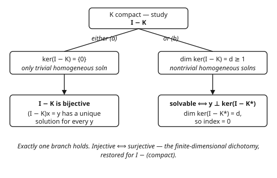

# Functional Analysis · Lesson 4.3: The Fredholm alternative

> ⏱ ~15 min · Module 4: Spectral theory · Builds on: [4.2 Compact operators](04-02-compact-operators.md) · Unlocks: [4.4 Spectral theorem for compact self-adjoint operators](04-04-spectral-theorem-compact-self-adjoint.md)

## Why this matters

In finite dimensions a square linear system $Ax = y$ obeys one iron law: $A$ is injective **if and only if** it is surjective. "The only solution to $Ax=0$ is $x=0$" and "$Ax=y$ is solvable for every $y$" are the same statement — that is why row-reduction either gives a unique answer or reveals a free parameter, never a half-and-half. In infinite dimensions this law breaks (a shift operator is injective but not onto). The **Fredholm alternative** says it is repaired for exactly the operators that matter in practice: $I - K$ with $K$ compact. That covers integral equations $f(x) - \lambda\int k(x,t)f(t)\,dt = g(x)$ — the form boundary-value problems for PDEs collapse into — so this one theorem tells you *when a boundary-value problem has a solution* and *what obstruction blocks it when it doesn't*.

## The idea

A compact operator $K$ is "almost finite-rank": it squashes the unit ball into something near-compact, so $I - K$ can only fail to be invertible in the limited, finite-dimensional ways a matrix can. Picture $K$ as a matrix with a small tail. Then $I - K$ behaves like a square matrix, and for square matrices there is no middle ground:

- **either** $I-K$ is a clean bijection — every equation $(I-K)x = y$ has one and only one solution;
- **or** the homogeneous equation $(I-K)x = 0$ has genuine nonzero solutions — but then only *finitely many* independent ones, and $(I-K)x=y$ is still solvable, just not for every $y$: you must first pass a finite checklist of orthogonality conditions.

The slogan to carry: **for $I$ − compact, "solvable for every $y$" $\iff$ "the only homogeneous solution is $0$."** Injectivity and surjectivity travel together again, exactly as in $\mathbb{R}^n$.

## The formal version

Let $H$ be a Hilbert space, $K : H \to H$ compact, and $K^*$ its adjoint (Lesson [3.5](03-05-adjoints-bounded-operators.md)). Write $\ker T = \{x : Tx = 0\}$ for the kernel (null space) and $\operatorname{ran} T$ for the range.

**Fredholm alternative.** Exactly one of the following holds.

- **(a)** $\ker(I-K) = \{0\}$. Then $I-K$ is bijective with bounded inverse, so $(I-K)x = y$ has a unique solution for every $y \in H$.
- **(b)** $\ker(I-K) \neq \{0\}$. Then $\dim\ker(I-K) = \dim\ker(I-K^*) = d$ for some finite $d \ge 1$, and
$$(I-K)x = y \text{ is solvable} \iff y \perp \ker(I-K^*),$$
i.e. iff $\langle y, z\rangle = 0$ for every $z$ solving $(I-K^*)z = 0$.

**In words:** either $I-K$ inverts cleanly like a nonsingular matrix, or it has a small finite-dimensional kernel — and in that case you can still solve $(I-K)x=y$, but only for right-hand sides $y$ orthogonal to the kernel of the adjoint. The two kernels always have the same (finite) dimension.

Two consequences worth naming. First, injective $\iff$ surjective for $I-K$: branch (a) is precisely "$\ker=\{0\}$", and it is the only branch that gives surjectivity. Second, the **index** is zero:
$$\operatorname{index}(I-K) = \dim\ker(I-K) - \dim\operatorname{coker}(I-K) = 0,$$
where the cokernel $\operatorname{coker}(I-K) = H/\operatorname{ran}(I-K)$ measures "how much of $H$ the range misses," and has dimension $\dim\ker(I-K^*)$. **In words:** every homogeneous solution you gain is paid for by exactly one solvability condition you must satisfy — the books always balance.

## Concrete instance

The natural home for all this is a **Fredholm integral equation of the second kind** on $H = L^2[0,1]$:
$$f(x) - \lambda\int_0^1 k(x,t)\,f(t)\,dt = g(x),$$
where $k$ is a given kernel function, $\lambda$ a scalar parameter, $g$ the known right-hand side, and $f$ the unknown. Define the integral operator $(Kf)(x) = \int_0^1 k(x,t)f(t)\,dt$. For $k$ square-integrable (a Hilbert–Schmidt kernel), $K$ is compact — that was the payoff of [4.2](04-02-compact-operators.md). The equation is then $(I-\lambda K)f = g$, and the Fredholm alternative governs it: for **most** $\lambda$ you are in branch (a) and can solve for any $g$; at a **discrete** set of exceptional $\lambda$ (the reciprocals of $K$'s eigenvalues) you drop into branch (b), where nonzero homogeneous solutions — **eigenfunctions** — appear and $g$ must clear an orthogonality hurdle.

## Worked examples

**Example 1 (a separable kernel makes the alternative explicit).** Solve, on $L^2[0,1]$,
$$f(x) - \lambda\int_0^1 x\,t\,f(t)\,dt = g(x).$$
The kernel $k(x,t) = xt$ is **degenerate** (separable): a product of a function of $x$ times a function of $t$. That is what turns the integral equation into a *finite* linear system. Let
$$c = \int_0^1 t\,f(t)\,dt \quad(\text{a single unknown number}).$$
Then the equation reads $f(x) - \lambda x c = g(x)$, so
$$f(x) = g(x) + \lambda c\,x.$$
The unknown function is pinned down by the one scalar $c$. Now enforce the definition of $c$ by substituting this $f$ back in:
$$c = \int_0^1 t\big(g(t) + \lambda c\,t\big)\,dt = \underbrace{\int_0^1 t\,g(t)\,dt}_{=\,G} + \lambda c\int_0^1 t^2\,dt = G + \frac{\lambda}{3}c.$$
So $c\left(1 - \dfrac{\lambda}{3}\right) = G$ — a single scalar equation, the finite system the compact operator promised. Read off the alternative:

- **Branch (a), $\lambda \neq 3$.** Then $1 - \lambda/3 \neq 0$, so $c = \dfrac{G}{1-\lambda/3}$ is forced, and $f(x) = g(x) + \lambda c\,x$ is the *unique* solution — for **every** $g$. Bijective, exactly as promised.
- **Branch (b), $\lambda = 3$.** The exceptional value: $1-\lambda/3 = 0$, so the scalar equation becomes $0 = G$. Two sub-cases.
  - The homogeneous problem ($g=0$, hence $G=0$) reduces to $0=0$, leaving $c$ **free**: $f(x) = 3c\,x$ for any $c$. So $\ker(I - 3K) = \operatorname{span}\{x\}$, dimension $d=1$ — a nonzero eigenfunction has appeared.
  - For general $g$, solvability requires $G = \int_0^1 t\,g(t)\,dt = 0$. Here $k$ is real and symmetric, so $K = K^*$ and $\ker(I-3K^*) = \operatorname{span}\{x\}$; the condition $G=0$ is exactly $\langle g, x\rangle = 0$, i.e. $g \perp \ker(I-3K^*)$ — the theorem's orthogonality checklist, made concrete. When it is met, $c$ is free and the solutions form the one-parameter family $f(x) = g(x) + 3c\,x$ — one free parameter, matching $d=1$.

Every clause of the alternative is visible in a two-line computation.

**Example 2 (drop compactness and the dichotomy dies).** Let $H = \ell^2$ and let $R$ be the **right shift**
$$R(x_1, x_2, x_3, \dots) = (0, x_1, x_2, x_3, \dots).$$
$R$ is a bounded isometry ($\|Rx\| = \|x\|$), hence **injective**. But it is **not surjective**: nothing maps onto $e_1 = (1,0,0,\dots)$, since every output has first coordinate $0$. So for $R$, injective $\ne$ surjective — the finite-dimensional law simply fails. The Fredholm alternative does **not** apply because $R$ is not of the form $I - (\text{compact})$. In fact its failure *proves* that: if $I - R$ were compact, the alternative would force $R = I - (I-R)$ to satisfy injective $\iff$ surjective, contradicting what we just saw. So $I - R$ cannot be compact — compactness is not a technical convenience here, it is exactly the hypothesis the conclusion needs. (Compare [1.4](01-04-finite-vs-infinite-dimensions.md): shifts are the standard way infinite dimensions break finite-dimensional reflexes.)

## Watch out

- **You might think** the alternative holds for any bounded operator $T$, **but actually** it needs $T = I - K$ with $K$ *compact*. Example 2's shift is the standing counterexample: injective without surjective. General bounded operators have no such dichotomy.
- **You might think** "$(I-K)x=0$ has a nonzero solution, so the equation is just unsolvable." **Actually** branch (b) equations are still solvable — for every $y$ orthogonal to $\ker(I-K^*)$. A nontrivial kernel restricts which $y$ work; it does not kill solvability.
- **You might think** the solvability condition is $y \perp \ker(I-K)$. **Actually** it is orthogonality to $\ker(I-K^{*})$ — the *adjoint's* kernel (Lesson [3.5](03-05-adjoints-bounded-operators.md)). The two kernels share a dimension but need not share vectors; they coincide only when $K$ is self-adjoint (as in Example 1).

## One-liner

> For $I$ minus a compact operator the finite-dimensional gospel returns: injective $\iff$ surjective, and when it fails it fails by a finite kernel whose price is orthogonality of $y$ to $\ker(I-K^*)$.

## Problems

**P1 (🟢)** Solve $f(x) - \lambda\int_0^1 f(t)\,dt = g(x)$ on $L^2[0,1]$ (constant kernel $k(x,t)=1$). Find the unique-solvability range of $\lambda$, the exceptional $\lambda_0$, and — at $\lambda_0$ — the eigenfunction and the solvability condition on $g$.

**P2 (🟡)** For the operator $I-K$ with $K$ compact, suppose $\dim\ker(I-K) = 2$. What is $\dim\ker(I-K^*)$, and how many independent orthogonality conditions must $y$ satisfy for $(I-K)x=y$ to be solvable? State the reasoning in one sentence using the index.

**P3 (🔴, optional)** On $\ell^2$, let $R$ be the right shift of Example 2 and $L$ the **left shift** $L(x_1,x_2,\dots) = (x_2,x_3,\dots)$, which is $R^*$. Show $L$ is surjective but not injective, compute $\dim\ker L$ and $\dim\ker L^*$, and explain why the mismatch is consistent with $L$ *not* being of the form $I-(\text{compact})$.

Solutions

**P1** Set $c = \int_0^1 f(t)\,dt$. The equation gives $f(x) = g(x) + \lambda c$. Impose the definition of $c$:
$$c = \int_0^1\big(g(t) + \lambda c\big)\,dt = G + \lambda c, \qquad G := \int_0^1 g(t)\,dt,$$
so $c(1-\lambda) = G$.
- $\lambda \neq 1$: unique $c = \dfrac{G}{1-\lambda}$, giving the unique solution $f(x) = g(x) + \dfrac{\lambda G}{1-\lambda}$ for every $g$ — branch (a).
- $\lambda_0 = 1$: exceptional. Homogeneous ($g=0$) gives $c(1-1)=0$, $c$ free, so $f(x) = c$ — the eigenfunction is the constant function $\mathbf{1}$, $\ker(I-K)=\operatorname{span}\{1\}$. The kernel is real symmetric ($K=K^*$), so the solvability condition is $\langle g,\mathbf 1\rangle = \int_0^1 g(t)\,dt = 0$. When met, $f(x)=g(x)+c$ for arbitrary $c$.

**P2** By the Fredholm alternative, $\dim\ker(I-K^*) = \dim\ker(I-K) = 2$. So $y$ must satisfy **2** independent orthogonality conditions ($y \perp \ker(I-K^*)$, a 2-dimensional space). Reasoning: $\operatorname{index}(I-K)=\dim\ker(I-K)-\dim\ker(I-K^*)=0$, so the two dimensions match, and the number of solvability constraints equals $\dim\ker(I-K^*)$.

**P3** $L(x_1,x_2,\dots)=(x_2,x_3,\dots)$. *Surjective:* given any $y=(y_1,y_2,\dots)\in\ell^2$, the vector $(0,y_1,y_2,\dots)$ (its $\ell^2$ norm equals $\|y\|$) maps to $y$ under $L$, so $\operatorname{ran} L = \ell^2$. *Not injective:* $L(1,0,0,\dots) = 0$ with input nonzero, so $\ker L = \operatorname{span}\{e_1\}$, $\dim\ker L = 1$. Its adjoint is $L^* = R$, the right shift, which is injective, so $\dim\ker L^* = 0$. Then $\operatorname{index}(L) = \dim\ker L - \dim\ker L^* = 1 - 0 = 1 \neq 0$. If $L$ were $I - (\text{compact})$ the index would be forced to $0$; the nonzero index proves it is not, so no Fredholm alternative is expected — surjective-without-injective is allowed.

## Flashback

**From Lesson 4.2 (Compact operators):** On $\ell^2$, define the diagonal operator $T(x_1, x_2, x_3, \dots) = \left(x_1, \tfrac{x_2}{2}, \tfrac{x_3}{3}, \dots\right)$, i.e. $(Tx)_n = x_n/n$. Show $T$ is compact by exhibiting it as an operator-norm limit of finite-rank operators.

Solution

Let $T_N$ be the truncation $(T_N x)_n = x_n/n$ for $n \le N$ and $0$ for $n > N$. Each $T_N$ has range inside $\operatorname{span}\{e_1,\dots,e_N\}$, so it is finite-rank (rank $\le N$). Estimate the operator norm of the tail:
$$\big\|(T - T_N)x\big\|^2 = \sum_{n>N} \frac{|x_n|^2}{n^2} \le \frac{1}{(N+1)^2}\sum_{n>N}|x_n|^2 \le \frac{1}{(N+1)^2}\|x\|^2,$$
so $\|T - T_N\| \le \dfrac{1}{N+1} \to 0$ as $N\to\infty$. Thus $T$ is a norm-limit of finite-rank operators; since finite-rank operators are compact and the compact operators are norm-closed (both from 4.2), $T$ is compact. (The diagonal entries $1/n \to 0$ is the tell: a diagonal operator on $\ell^2$ is compact exactly when its entries tend to $0$.)

## Connections

- **Backward:** the whole theorem rests on [4.2](04-02-compact-operators.md) — compactness is what makes $I-K$ behave like a finite matrix; the solvability side uses the adjoint $K^*$ from [3.5](03-05-adjoints-bounded-operators.md); and the fact that this drama is impossible in finite dimensions (where injective $\iff$ surjective is automatic) is the shift-operator lesson of [1.4](01-04-finite-vs-infinite-dimensions.md).
- **Forward:** [4.4](04-04-spectral-theorem-compact-self-adjoint.md) adds self-adjointness to compactness; the exceptional $\lambda$'s of this lesson become a genuine orthonormal eigenbasis, upgrading the alternative into a full spectral decomposition.
- **Sideways (PDEs):** boundary-value problems (e.g. $-u'' + q\,u = f$ with fixed ends) invert into second-kind integral equations $u - \lambda K u = g$ via a Green's function; the Fredholm alternative is then *the* solvability criterion, and a nontrivial homogeneous solution is an **eigenfunction** at a resonant $\lambda$ — see [pdes](../../pdes/syllabus.md).
- **Sideways (linear algebra):** this is the rescue of the finite-dimensional theorem "for a square system, injective $=$ surjective" from [linalg-refresher](../../linalg-refresher/syllabus.md) — the index-zero statement $\dim\ker = \dim\operatorname{coker}$ is the rank–nullity balance surviving into infinite dimensions, but only for $I - $ compact.
