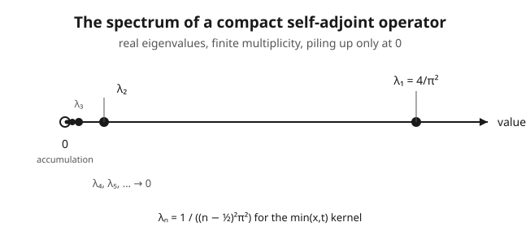

# Functional Analysis · Lesson 4.4: Spectral theorem for compact self-adjoint operators

> ⏱ ~15 min · Module 4: Spectral theory · Builds on: [4.3 The Fredholm alternative](04-03-fredholm-alternative.md) · Unlocks: [4.5 The bounded self-adjoint spectral theorem](04-05-bounded-self-adjoint-spectral-theorem.md)

## Why this matters

In finite dimensions there is one crown-jewel theorem: a symmetric (Hermitian) matrix has an orthonormal basis of eigenvectors and its eigenvalues are real. That single fact is why you can decouple coupled oscillators, why principal component analysis works, why a quadratic form has principal axes. The question that opens every serious application of this course is: **does that theorem survive when the matrix becomes an operator and the dimension becomes infinite?**

The honest answer is "not for free" — a self-adjoint operator can have *no eigenvectors at all*. But add **compactness** and the finite-dimensional dream comes back whole: a genuine orthonormal eigenbasis, real eigenvalues, an exact diagonalization. This is the theorem that makes the completeness of Fourier/Sturm–Liouville eigenfunction expansions in [`pdes`](../../pdes/syllabus.md) a rigorous statement instead of a physicist's hope, and it is the finite-multiplicity discrete spectrum you see in the bound states of [`quantum-mechanics`](../../quantum-mechanics/syllabus.md).

## The idea

Think of what a symmetric matrix does geometrically: it has perpendicular axes along which it acts by pure stretching. Off those axes it mixes coordinates; on them it is diagonal. The spectral theorem for matrices says those axes always exist and are orthogonal.

A **compact** operator (from [4.2](04-02-compact-operators.md)) is one that "almost" lives in finite dimensions: it crushes the infinite-dimensional unit ball into a set that is nearly finite-dimensional (precompact). A **self-adjoint** operator (from [3.5](03-05-adjoints-bounded-operators.md)), $K = K^*$, is the infinite-dimensional symmetric matrix. Put the two together and you get the best of both: self-adjointness forces the axes to be orthogonal with real stretch factors, and compactness forces those stretch factors to *shrink to zero* — so there is a first axis (the biggest stretch), a second, a third, marching off to zero. Countably many orthogonal axes, each a genuine eigenvector. On that basis $K$ is literally a diagonal matrix — an infinite one whose diagonal entries decay to $0$.

That decay-to-zero is the whole personality of the theorem. It is why the spectrum is *discrete* (isolated eigenvalues, not a smear), and it is exactly what fails when you drop compactness in [4.5](04-05-bounded-self-adjoint-spectral-theorem.md).

## The formal version

Let $H$ be a Hilbert space and $K : H \to H$ a **compact self-adjoint** operator ($K^* = K$).

**Spectral theorem.** There is a (finite or countable) orthonormal set $\{e_n\}$ of eigenvectors of $K$ with **real** eigenvalues $\lambda_n \ne 0$, and if there are infinitely many then $\lambda_n \to 0$. The $e_n$ form an orthonormal basis of $\overline{\operatorname{ran} K}$ (equivalently, of $(\ker K)^{\perp}$), and

$$K x = \sum_n \lambda_n \langle x, e_n\rangle\, e_n \qquad \text{for every } x \in H.$$

> In words: pick an $x$, measure how much of each eigen-axis it contains ($\langle x, e_n\rangle$, its coordinate along $e_n$), stretch that coordinate by $\lambda_n$, reassemble. That *is* $K$ — nothing hidden, an exact diagonalization.

Every $x$ splits as $x = x_0 + \sum_n \langle x, e_n\rangle e_n$ with $x_0 \in \ker K$; the sum is the [2.3](02-03-orthonormal-bases-fourier.md) orthonormal-basis expansion of the part of $x$ that $K$ can see. Each **nonzero** eigenvalue has **finite** multiplicity (its eigenspace is finite-dimensional), and $0$ is the only possible accumulation point of the eigenvalues.

**Min–max characterization (Courant–Fischer).** Suppose in addition $K$ is *positive*, $\langle Kx, x\rangle \ge 0$, and order the eigenvalues $\lambda_1 \ge \lambda_2 \ge \cdots > 0$. Then

$$\lambda_n = \max_{\substack{V \subseteq H \\ \dim V = n}}\ \min_{\substack{x \in V \\ \|x\| = 1}}\ \langle Kx, x\rangle.$$

> In words: the $n$-th eigenvalue is the best "worst-case stretch" achievable on an $n$-dimensional subspace. For $n=1$ this is $\lambda_1 = \max_{\|x\|=1}\langle Kx,x\rangle = \|K\|$ — the top eigenvalue is the operator norm. You never need to solve for the eigenvectors to bound the eigenvalues; you optimize a quadratic form over subspaces.

## Concrete instance — diagonalizing an integral operator

The theorem is abstract; here is it made completely explicit. On $H = L^2[0,1]$ define the integral operator with the "tent" kernel $k(x,t) = \min(x,t)$:

$$(Kf)(x) = \int_0^1 \min(x,t)\, f(t)\, dt .$$

This $K$ is **compact** because its kernel is continuous (Hilbert–Schmidt / uniform-limit argument of [4.2](04-02-compact-operators.md)), and **self-adjoint** because the kernel is symmetric, $k(x,t) = k(t,x) = \min(x,t)$ (the kernel-transpose criterion of [3.5](03-05-adjoints-bounded-operators.md)). So the spectral theorem applies: it must have a real orthonormal eigenbasis with $\lambda_n \to 0$. We can find them exactly.

Split the kernel at $t = x$:

$$(Kf)(x) = \int_0^x t\, f(t)\, dt + x\int_x^1 f(t)\, dt .$$

Set $Kf = \lambda f$ ($\lambda \ne 0$) and differentiate in $x$. The two boundary terms cancel and you are left with $\lambda f'(x) = \int_x^1 f(t)\,dt$; differentiate again to get $\lambda f''(x) = -f(x)$, i.e.

$$-f''(x) = \frac{1}{\lambda}\, f(x), \qquad f(0) = 0,\quad f'(1) = 0,$$

the boundary conditions falling out of the eigen-equation at $x=0$ and $x=1$. With $\mu = 1/\lambda$, the solutions of $-f'' = \mu f$ vanishing at $0$ are $f(x) = \sin(\sqrt{\mu}\,x)$; the condition $f'(1)=0$ forces $\cos\sqrt{\mu} = 0$, so $\sqrt{\mu} = (n-\tfrac12)\pi$. Normalizing on $[0,1]$ (where $\int_0^1 \sin^2 = \tfrac12$):

$$\boxed{\ e_n(x) = \sqrt{2}\,\sin\!\big((n-\tfrac12)\pi x\big), \qquad \lambda_n = \frac{1}{(n-\tfrac12)^2\pi^2}\ \longrightarrow\ 0.\ }$$

The eigenvalues $\lambda_1 = 4/\pi^2 \approx 0.405$, $\lambda_2 = 4/(9\pi^2)\approx 0.045$, $\lambda_3 \approx 0.016,\dots$ pile up at $0$ exactly as the picture shows — a discrete spectrum, each value simple.

**This is a Sturm–Liouville problem in disguise.** The differential operator $L = -\dfrac{d^2}{dx^2}$ with $f(0)=0,\ f'(1)=0$ has eigenvalues $\mu_n = (n-\tfrac12)^2\pi^2$ and eigenfunctions $e_n$. Our $K$ is precisely $L^{-1}$: the min-kernel is the **Green's function** that inverts $-d^2/dx^2$. Inverting turned an unbounded differential operator (whose eigenvalues run off to $+\infty$) into a compact integral operator (whose eigenvalues run down to $0$) — and the spectral theorem for $K$ *is* the completeness theorem for the Sturm–Liouville eigenfunctions of [`pdes`](../../pdes/syllabus.md).

## Worked examples

**Example 1 (the Boss — Mercer expansion through the min-kernel).** Expand $g(x) = x$ in the eigenbasis of $K$, and read off $Kg$.

The coordinates are $\langle g, e_n\rangle = \sqrt{2}\int_0^1 x\,\sin\!\big((n-\tfrac12)\pi x\big)\,dx$. With $a = (n-\tfrac12)\pi$, integration by parts gives $\int_0^1 x\sin(ax)\,dx = -\dfrac{\cos a}{a} + \dfrac{\sin a}{a^2}$. Here $\cos a = \cos((n-\tfrac12)\pi) = 0$ and $\sin a = (-1)^{n+1}$, so

$$\langle x, e_n\rangle = \sqrt{2}\,\frac{(-1)^{n+1}}{(n-\tfrac12)^2\pi^2}, \qquad\text{hence}\qquad x = \sum_{n=1}^{\infty} \frac{2(-1)^{n+1}}{(n-\tfrac12)^2\pi^2}\,\sin\!\big((n-\tfrac12)\pi x\big).$$

Now $K$ just multiplies each coordinate by $\lambda_n = 1/((n-\tfrac12)^2\pi^2)$:

$$(Kx)(x) = \sum_{n=1}^{\infty} \frac{2(-1)^{n+1}}{(n-\tfrac12)^4\pi^4}\,\sin\!\big((n-\tfrac12)\pi x\big).$$

Sanity check by integrating directly: $(Kx)(x) = \int_0^x t^2\,dt + x\int_x^1 t\,dt = \dfrac{x^3}{3} + x\cdot\dfrac{1-x^2}{2} = \dfrac{x}{2} - \dfrac{x^3}{6}$. So the series above is a closed form for $\dfrac{x}{2}-\dfrac{x^3}{6}$ — diagonalization delivered a nontrivial function identity for free. That decoupling of $K$ into scalar multiplications is the entire payoff of the theorem.

**Example 2 (why the eigen-structure is forced — real & orthogonal & shrinking).** Verify the three defining features, from the axioms, no computation of $e_n$ needed.

*Real eigenvalues.* If $Kf = \lambda f$ with $f \ne 0$, then using $K = K^*$ (the [3.5](03-05-adjoints-bounded-operators.md) argument),

$$\lambda \|f\|^2 = \langle Kf, f\rangle = \langle f, Kf\rangle = \overline{\lambda}\,\|f\|^2 \ \Rightarrow\ \lambda = \overline{\lambda}\in\mathbb{R}.$$

*Orthogonal eigenvectors for distinct eigenvalues.* If $Kf = \lambda f$, $Kg = \mu g$, $\lambda \ne \mu$ (both real),

$$\lambda\langle f, g\rangle = \langle Kf, g\rangle = \langle f, Kg\rangle = \mu\langle f, g\rangle \ \Rightarrow\ (\lambda-\mu)\langle f,g\rangle = 0 \ \Rightarrow\ \langle f, g\rangle = 0.$$

For the min-kernel this is just the familiar orthogonality $\int_0^1 \sin((n-\tfrac12)\pi x)\sin((m-\tfrac12)\pi x)\,dx = 0$ for $n\ne m$.

*Eigenvalues $\to 0$ (forced by compactness).* Suppose infinitely many eigenvalues had $|\lambda_n| \ge \delta > 0$, with orthonormal eigenvectors $e_n$. Then for $n \ne m$,

$$\|Ke_n - Ke_m\|^2 = \|\lambda_n e_n - \lambda_m e_m\|^2 = \lambda_n^2 + \lambda_m^2 \ge 2\delta^2,$$

so $\{Ke_n\}$ has no convergent subsequence. But $\{e_n\}$ is bounded and $K$ is compact, so $\{Ke_n\}$ *must* have a convergent subsequence ([4.2](04-02-compact-operators.md)) — contradiction. Hence $\lambda_n \to 0$. Compactness, not self-adjointness, is what collapses the spectrum toward zero.

## Watch out

- **You might think self-adjoint alone gives an eigenbasis, but it doesn't** — you need *both* hypotheses. The multiplication operator $(M_x f)(x) = x f(x)$ on $L^2[0,1]$ from [4.1](04-01-spectrum-of-an-operator.md) is self-adjoint yet has **no eigenvectors at all** (its spectrum is the whole interval $[0,1]$, purely continuous). Compactness is precisely what manufactures a discrete eigenbasis; without it you get [4.5](04-05-bounded-self-adjoint-spectral-theorem.md)'s spectral *measure* instead.
- **You might think $0$ is just another eigenvalue, but treat it carefully.** Because $\lambda_n \to 0$, the value $0$ always lies in the spectrum (as an accumulation point). It is an *eigenvalue* only when $\ker K \ne \{0\}$ — i.e. $K$ actually annihilates something. The eigenbasis $\{e_n\}$ spans $(\ker K)^\perp$, not necessarily all of $H$; the kernel is the blind spot the sum $\sum \lambda_n\langle x,e_n\rangle e_n$ silently drops.
- **You might think eigenvalues could repeat infinitely, but nonzero ones can't.** Each $\lambda_n \ne 0$ has *finite* multiplicity — an infinite-dimensional eigenspace for a nonzero eigenvalue would let compactness fail by the Example 2 argument. Infinite degeneracy is only allowed at $0$.

## One-liner

> Compact + self-adjoint = an honest infinite diagonal matrix: a real orthonormal eigenbasis with eigenvalues sliding to zero — the Sturm–Liouville completeness theorem, made rigorous.

## Problems

**P1 (🟢)** Using only the diagonalization $K = \sum_n \lambda_n\langle\cdot,e_n\rangle e_n$ with $\lambda_n = 1/((n-\tfrac12)^2\pi^2)$ and $e_n(x)=\sqrt2\sin((n-\tfrac12)\pi x)$: (a) find $\|K\|$; (b) compute $K e_3$.

**P2 (🟡)** Expand the constant function $g(x) = 1$ in the eigenbasis $\{e_n\}$, then use $K = \sum \lambda_n\langle\cdot,e_n\rangle e_n$ to obtain $(K1)(x)$ — and check your answer by computing $\int_0^1 \min(x,t)\,dt$ directly.

**P3 (🔴, optional)** Show $K$ is a **positive** operator: $\langle Kf, f\rangle \ge 0$ for all $f \in L^2[0,1]$. (Hint: verify the identity $\min(x,t) = \int_0^1 \mathbf{1}_{\{s<x\}}\,\mathbf{1}_{\{s<t\}}\,ds$ and substitute.) Then explain, via the min–max characterization, why this forces $\lambda_1 = \|K\| = 4/\pi^2$.

Solutions

**P1** (a) $\|K\|$ equals the largest $|\lambda_n|$. The $\lambda_n$ decrease in $n$, so the maximum is $\lambda_1 = 1/((\tfrac12)^2\pi^2) = 4/\pi^2 \approx 0.405$. (This is the top of the spectrum, consistent with min–max at $n=1$.)

(b) $e_3$ is an eigenvector, so $Ke_3 = \lambda_3 e_3 = \dfrac{1}{(\tfrac52)^2\pi^2}\,e_3 = \dfrac{4}{25\pi^2}\,\sqrt2\,\sin\!\big(\tfrac{5}{2}\pi x\big)$. In coordinates: the only nonzero coordinate of $e_3$ is the third one ($=1$), so $K$ multiplies it by $\lambda_3$ and leaves an eigenvector.

**P2** Coordinates: $\langle 1, e_n\rangle = \sqrt2\displaystyle\int_0^1 \sin\!\big((n-\tfrac12)\pi x\big)\,dx = \sqrt2\left[-\frac{\cos((n-\tfrac12)\pi x)}{(n-\tfrac12)\pi}\right]_0^1 = \sqrt2\cdot\frac{1}{(n-\tfrac12)\pi}$, since $\cos((n-\tfrac12)\pi)=0$ and $\cos 0 = 1$. Hence

$$1 = \sum_{n=1}^\infty \frac{2}{(n-\tfrac12)\pi}\,\sin\!\big((n-\tfrac12)\pi x\big).$$

Applying $K$ multiplies coordinate $n$ by $\lambda_n$:

$$(K1)(x) = \sum_{n=1}^\infty \lambda_n\,\frac{2}{(n-\tfrac12)\pi}\,\sin\!\big((n-\tfrac12)\pi x\big) = \sum_{n=1}^\infty \frac{2}{(n-\tfrac12)^3\pi^3}\,\sin\!\big((n-\tfrac12)\pi x\big).$$

Direct check: $(K1)(x) = \displaystyle\int_0^1 \min(x,t)\,dt = \int_0^x t\,dt + x\int_x^1 dt = \frac{x^2}{2} + x(1-x) = x - \frac{x^2}{2}.$ So the series equals $x - x^2/2$ — and indeed $(K1)(0)=0$, $(K1)'(1) = 1 - 1 = 0$, the required boundary conditions. ✓

**P3** Use $\min(x,t) = \int_0^1 \mathbf{1}_{\{s<x\}}\mathbf{1}_{\{s<t\}}\,ds$ (the integrand is $1$ exactly for $s < \min(x,t)$, and its $s$-integral is the length $\min(x,t)$). Then

$$\langle Kf, f\rangle = \int_0^1\!\!\int_0^1 \min(x,t)\,f(x)\,f(t)\,dx\,dt = \int_0^1\!\left(\int_0^1 \mathbf{1}_{\{s<x\}} f(x)\,dx\right)\!\left(\int_0^1 \mathbf{1}_{\{s<t\}} f(t)\,dt\right)ds = \int_0^1 F(s)^2\,ds \ge 0,$$

where $F(s) = \int_s^1 f(x)\,dx$ (real $f$; for complex $f$ replace $f(t)$ by $\overline{f(t)}$ and get $\int |F(s)|^2\,ds$). So $K$ is positive, and every eigenvalue is $\ge 0$ — indeed all $\lambda_n = 1/((n-\tfrac12)^2\pi^2) > 0$, confirming it. By min–max at $n=1$, $\lambda_1 = \max_{\|x\|=1}\langle Kx,x\rangle$, which for a positive operator is exactly $\|K\|$; numerically $\lambda_1 = 4/\pi^2$.

## Flashback

**From Lesson 4.3 (The Fredholm alternative):** Keep the min-kernel operator $K$ above and consider the equation $(K - \lambda I)f = g$ on $L^2[0,1]$. Using the Fredholm alternative for a compact operator, describe the solvability in two cases: (i) $\lambda = \lambda_2 = 4/(9\pi^2)$, an eigenvalue of $K$; (ii) $\lambda = 1$, which is not an eigenvalue.

Solution

The Fredholm alternative for a compact operator says: for $\lambda \ne 0$, *either* $K - \lambda I$ is a bijection (unique solution for every $g$), *or* $\ker(K-\lambda I) \ne \{0\}$ is finite-dimensional and $(K-\lambda I)f = g$ is solvable iff $g \perp \ker\big((K-\lambda I)^*\big)$. Because $K$ is self-adjoint and each eigenvalue is real, $(K-\lambda I)^* = K - \lambda I$, so the orthogonality condition is against $\ker(K - \lambda I)$ itself.

(i) $\lambda = \lambda_2$ *is* an eigenvalue, so $\ker(K-\lambda_2 I) = \operatorname{span}\{e_2\}$ is nontrivial (one-dimensional, since $\lambda_2$ is simple). We are in the second horn: $(K-\lambda_2 I)f = g$ is solvable **iff** $\langle g, e_2\rangle = 0$, i.e. $\int_0^1 g(x)\,\sqrt2\,\sin(\tfrac32\pi x)\,dx = 0$. When solvable, the solution set is $f_{\text{part}} + \operatorname{span}\{e_2\}$ — not unique, off by the eigenvector.

(ii) $\lambda = 1$ is not among the $\lambda_n$ (all $\lambda_n \le 4/\pi^2 < 1$), so $\ker(K - I) = \{0\}$. We are in the first horn: $K - I$ is a bijection and $(K - I)f = g$ has a **unique** solution for every $g \in L^2[0,1]$. (Equivalently, $1 \notin \sigma(K)$, so $K - I$ is invertible.)

## Connections

- **Backward:** this is the payoff of Module 4. Compactness ([4.2](04-02-compact-operators.md)) supplies the discrete, decaying spectrum; self-adjointness ([3.5](03-05-adjoints-bounded-operators.md)) supplies real eigenvalues and orthogonal axes; the [4.3](04-03-fredholm-alternative.md) Fredholm alternative is the "either invert or project" companion at each nonzero $\lambda$. The eigen-expansion $x = \sum\langle x,e_n\rangle e_n$ is the [2.3](02-03-orthonormal-bases-fourier.md) orthonormal-basis machinery landing on the axes the theorem produces.
- **Forward:** [4.5](04-05-bounded-self-adjoint-spectral-theorem.md) asks what survives when $K$ is self-adjoint but *not* compact ($M_x$ from [4.1](04-01-spectrum-of-an-operator.md)). The discrete sum $\sum \lambda_n\langle\cdot,e_n\rangle e_n$ becomes a continuous integral $\int \lambda\,dE(\lambda)$ against a *spectral measure* — same idea, eigenvalues smeared into a continuum.
- **Sideways ([`pdes`](../../pdes/syllabus.md)):** the min-kernel *is* the Green's function of $-d^2/dx^2$, and this theorem *is* the completeness of Sturm–Liouville eigenfunction expansions — the rigorous license to solve boundary-value problems by expanding in eigenmodes.
- **Sideways ([`quantum-mechanics`](../../quantum-mechanics/syllabus.md)):** a bound-state Hamiltonian with compact resolvent has exactly this structure — a discrete energy spectrum $E_n$ with finite-multiplicity levels and an orthonormal eigenbasis of stationary states. The "energy levels accumulate" picture and the "expand a state in energy eigenstates" move are this lesson wearing a physics hat.
