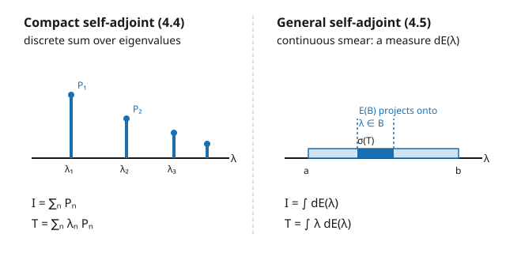

# Functional Analysis · Lesson 4.5: The bounded self-adjoint spectral theorem

> ⏱ ~15 min · Module 4: Spectral theory · Builds on: [4.4 Spectral theorem for compact self-adjoint operators](04-04-spectral-theorem-compact-self-adjoint.md) · Unlocks: [5.1 Unbounded operators and domains](05-01-unbounded-operators-domains.md)

## Why this matters

Lesson 4.4 handed you a dream: every compact self-adjoint operator has an orthonormal eigenbasis, and in that basis it is just a diagonal matrix $\operatorname{diag}(\lambda_1, \lambda_2, \dots)$. But most operators you care about are *not* compact and have *no eigenvectors at all* — the position operator $M_x$ on $L^2[0,1]$ (from [4.1](04-01-spectrum-of-an-operator.md)) is the standing example: its spectrum is the whole interval $[0,1]$, yet not a single nonzero $f$ satisfies $x\,f(x) = \lambda f(x)$. So "diagonalize it" seems hopeless. The spectral theorem rescues the dream by replacing the *sum over eigenvalues* with an *integral over the spectrum* — and its punchline is one of the great structural facts of the subject: **every bounded self-adjoint operator is, up to a change of orthonormal coordinates, multiplication by a real function.** That single sentence is the mathematical backbone of quantum mechanics, and the launch pad for the functional calculus that builds time evolution $e^{-itH}$ in [5.4](05-04-stone-theorem-time-evolution.md).

## The idea

Think about what an eigenbasis *does* for a self-adjoint operator $T$. It slices your Hilbert space into orthogonal eigenspaces, one per eigenvalue $\lambda_n$. If $P_n$ is the orthogonal projection onto the $\lambda_n$-eigenspace, then

$$I = \sum_n P_n \qquad\text{and}\qquad T = \sum_n \lambda_n P_n.$$

The first equation says the projections *partition* the identity — every vector is the sum of its pieces. The second says $T$ acts by "multiply the piece living at $\lambda_n$ by $\lambda_n$." That is diagonalization, stated without ever mentioning a basis vector.

Now watch what happens when the eigenvalues stop being isolated and smear into a continuum like $[0,1]$. There is no cleanest $\lambda_n$ to attach a projection $P_n$ to. So we do the thing calculus always does when a sum runs into a continuum: we replace the discrete tags $\{\lambda_n\}$ with a **measure**. Instead of one projection per eigenvalue, we get one projection $E(B)$ per *set* of spectral values $B$ — "$E(B)$ = the part of the space whose spectral values lie in $B$." Then the sums become integrals:

$$I = \int dE(\lambda), \qquad T = \int \lambda\, dE(\lambda).$$

The eigenbasis has dissolved into a **projection-valued measure**, and the diagonal matrix has become a "continuous diagonal." That is the whole idea; the rest is making $E$ precise.

## The formal version

**Projection-valued (spectral) measure.** A *spectral measure* on $\mathbb{R}$ for a Hilbert space $H$ assigns to each Borel set $B \subseteq \mathbb{R}$ an orthogonal projection $E(B)$ on $H$, such that $E(\varnothing)=0$, $E(\mathbb{R})=I$, $E(B_1 \cap B_2) = E(B_1)E(B_2)$, and $E$ is countably additive on disjoint sets (applied to any fixed vector).

*In words:* $E$ is a "ruler for the spectrum" — hand it any set of values $B$ and it returns the projection onto the subspace that $T$ treats like those values, with the pieces fitting together exactly like an ordinary measure (empty set → nothing, whole line → everything, disjoint sets → orthogonal pieces that add).

**Spectral theorem (integral form).** For every bounded self-adjoint operator $T$ on $H$ there is a *unique* spectral measure $E$, supported on the spectrum $\sigma(T) \subseteq \mathbb{R}$, with

$$T = \int_{\sigma(T)} \lambda \, dE(\lambda).$$

*In words:* $T$ is reconstructed by integrating the coordinate $\lambda$ against its own resolution of the identity — the exact continuous analog of $\sum_n \lambda_n P_n$.

**Spectral theorem (multiplication-operator form).** For every bounded self-adjoint $T$ there is a measure space $(X,\mu)$, a *real-valued* $g \in L^\infty(X,\mu)$, and a unitary $U : H \to L^2(X,\mu)$ with

$$U\,T\,U^{-1} = M_g, \qquad (M_g \varphi)(x) = g(x)\,\varphi(x).$$

*In words:* after rotating to the right orthonormal coordinates (that's what the unitary $U$ does), $T$ is nothing but multiplication by a fixed real function — "**every self-adjoint operator is, up to unitary equivalence, multiplication by $x$.**"

**Functional calculus.** For any bounded Borel function $f:\mathbb{R}\to\mathbb{C}$, define

$$f(T) = \int_{\sigma(T)} f(\lambda)\,dE(\lambda), \qquad\text{equivalently}\qquad U f(T) U^{-1} = M_{f\circ g}.$$

*In words:* to apply a function to the operator, apply it to the values — $f$ acts on the spectrum and $T$ inherits the result. Taking $f(\lambda)=\lambda$ gives back $T$; $f(\lambda)=1$ gives $I$; $f(\lambda)=e^{it\lambda}$ will give the unitary $e^{itT}$ in [5.4](05-04-stone-theorem-time-evolution.md).

## Concrete instance — the spectral measure of $M_x$

Take $H = L^2[0,1]$ and the position operator $(M_x f)(x) = x\,f(x)$. It is already a multiplication operator, so the multiplication-form of the theorem is trivially satisfied with $U = I$, $g(x)=x$ — this is the *prototype* the general theorem imitates. Its spectral measure is as simple as it gets: for a Borel set $B \subseteq \mathbb{R}$,

$$\big(E(B)f\big)(x) = \mathbf{1}_B(x)\,f(x),$$

multiplication by the indicator function $\mathbf{1}_B$ (which is $1$ on $B$, $0$ off it). *In words:* $E(B)$ keeps the part of $f$ living over spectral values in $B$ and deletes the rest — it is projection onto "functions supported in $B$." The picture below contrasts this continuous smear with the discrete spikes of the compact case.

## Worked examples

**Example 1 (the prototype — spectral measure and calculus of $M_x$).** On $H = L^2[0,1]$, $(M_x f)(x)=x f(x)$, with $E(B)f = \mathbf{1}_B f$.

*Each $E(B)$ is a projection.* $E(B)^2 f = \mathbf{1}_B(\mathbf{1}_B f)=\mathbf{1}_B^2 f=\mathbf{1}_B f$ since $\mathbf{1}_B^2=\mathbf{1}_B$; and $\langle E(B)f,h\rangle=\int_0^1 \mathbf{1}_B f\,\overline{h}=\langle f,E(B)h\rangle$, so $E(B)$ is self-adjoint. Idempotent + self-adjoint = orthogonal projection. ✓ Also $E([0,1])f=\mathbf{1}_{[0,1]}f=f$, so $E$ resolves the identity on $\sigma(M_x)=[0,1]$.

*The measured weight.* For any $f$,

$$\langle f, E(B) f\rangle = \int_0^1 \overline{f(x)}\,\mathbf{1}_B(x)\,f(x)\,dx = \int_B |f(x)|^2\,dx.$$

*In words:* the number $\langle f, E(B)f\rangle$ is exactly how much of $f$'s squared "mass" sits over values in $B$. If $\|f\|=1$ this makes $B \mapsto \langle f,E(B)f\rangle$ a probability measure with density $|f|^2$ — the QM measurement distribution (see Watch out).

*Recover $M_x$.* Integrating the coordinate against $E$ means: for each $x$, weight the value $\lambda=x$ by the indicator, i.e. $\big(\int_0^1 \lambda\,dE(\lambda)\,f\big)(x) = x\,f(x)$. Concretely, $\langle f,(\int\lambda\,dE)f\rangle=\int_0^1 \lambda\,d\big(\textstyle\int_0^\lambda |f|^2\big)=\int_0^1 \lambda\,|f(\lambda)|^2 d\lambda = \langle f, M_x f\rangle$, so $\int_0^1 \lambda\,dE(\lambda)=M_x$. ✓

*Functional calculus.* For continuous (or bounded Borel) $f$, $f(M_x)=\int_0^1 f(\lambda)\,dE(\lambda)=M_f$, i.e. $\big(f(M_x)g\big)(x)=f(x)\,g(x)$. Applying a function to the operator = multiplying by that function of the coordinate. This is the literal meaning of "$M_x$ is the model every self-adjoint operator copies."

**Example 2 (recovering the compact case — 4.4 lives inside 4.5).** Let $K$ be compact self-adjoint with eigenvalues $\lambda_n$ and eigen-projections $P_n$ (from [4.4](04-04-spectral-theorem-compact-self-adjoint.md), $K=\sum_n \lambda_n P_n$). Its spectral measure is *purely atomic*:

$$E(B) = \sum_{\lambda_n \in B} P_n .$$

*In words:* the ruler $E$ only "sees" the discrete eigenvalues — it puts a lump of size $P_n$ at each $\lambda_n$ and nothing in between. Check the theorem:

$$\int \lambda\,dE(\lambda) = \sum_n \lambda_n\,E(\{\lambda_n\}) = \sum_n \lambda_n P_n = K, \qquad I = \sum_n P_n = E(\mathbb{R}).$$

And the functional calculus collapses the integral back to a sum: $f(K)=\sum_n f(\lambda_n)P_n$. So $K^2=\sum_n \lambda_n^2 P_n$, and if all $\lambda_n\ge 0$, $\sqrt{K}=\sum_n \sqrt{\lambda_n}\,P_n$. The compact spectral theorem is exactly the case where the spectral measure is a sum of point masses — 4.4 $\subset$ 4.5.

## Watch out

- **You might think** a self-adjoint operator always has an eigenbasis, so "spectral decomposition" means "list the eigenvectors." **Actually** with continuous spectrum there are *no eigenvectors* — $M_x f=\lambda f$ forces $f=0$ a.e. The eigenbasis is genuinely gone, replaced by the projection-valued *measure* $E$; the sum $\sum_n(\cdot)P_n$ becomes the integral $\int(\cdot)\,dE$, and that is not optional bookkeeping — it is the only honest statement.
- **You might think** the integral form $T=\int\lambda\,dE$ is the "real" theorem and multiplication form is a footnote. **Actually** the multiplication form $UTU^{-1}=M_g$ is usually the *cleanest* thing to know: it says all the mystery of a self-adjoint operator is a change of coordinates away from "multiply by a real function." Reach for whichever form the problem wants — they carry identical information.
- **You might think** $\langle x, E(B)x\rangle$ is just an abstract number. **Actually** when $\|x\|=1$ the map $B\mapsto \langle x,E(B)x\rangle$ is a genuine *probability measure* on $\mathbb{R}$ — and in quantum mechanics it is precisely the probability that measuring the observable $T$ in state $x$ yields a value in $B$. That is the Born rule (developed in [quantum-mechanics](../../quantum-mechanics/syllabus.md)), and the spectral measure is where it comes from.
- **You might think** the functional calculus is a curiosity. **Actually** it is the engine that manufactures new operators: $f(\lambda)=e^{it\lambda}$ turns a Hamiltonian $H$ into the unitary time-evolution $e^{itH}$ (Stone's theorem, [5.4](05-04-stone-theorem-time-evolution.md)); $f(\lambda)=\mathbf{1}_{(-\infty,c]}$ builds the projections you measure with.

## One-liner

> Every bounded self-adjoint operator is multiplication by a real function in disguise: replace "sum over eigenvalues" with "integral over the spectrum against a projection-valued measure," and diagonalization survives the loss of eigenvectors.

## Problems

**P1 (🟢)** On $L^2[0,1]$ with $M_x$ and spectral measure $E(B)f=\mathbf{1}_B f$, let $g(x)=\sqrt{3}\,x$. (a) Verify $\|g\|=1$. (b) Compute $\langle g, E([0,\tfrac12])\,g\rangle$ and state its meaning as a measurement probability.

**P2 (🟡)** Using the functional calculus for $M_x$ on $L^2[0,1]$, describe the operator $e^{itM_x}$ explicitly (for fixed real $t$), and prove it is unitary. Which downstream theorem does this preview?

**P3 (🔴, optional)** Let $K$ be compact self-adjoint with eigenpairs $(\lambda_n,e_n)$, $\lambda_n=\tfrac1n$ for $n\ge 1$, the $e_n$ orthonormal. (a) Give $K^2$ and $\sqrt{K}$ via the functional calculus. (b) Determine $\sigma(K)$, and decide whether $0$ is an *eigenvalue*, an element of the spectrum, or both. Explain how this shows $\sigma$ can contain points that carry no eigenvector.

Solutions

**P1** (a) $\|g\|^2=\int_0^1 3x^2\,dx=[x^3]_0^1=1$, so $\|g\|=1$. ✓
(b) By Example 1, $\langle g,E([0,\tfrac12])g\rangle=\int_0^{1/2}|g(x)|^2\,dx=\int_0^{1/2}3x^2\,dx=[x^3]_0^{1/2}=\tfrac18$. Since $\|g\|=1$, this is a probability: measuring the observable $M_x$ (position) in state $g$ returns a value in $[0,\tfrac12]$ with probability $\tfrac18$ — the state's mass is concentrated near $x=1$ where $|g|^2=3x^2$ is largest.

**P2** Functional calculus with $f(\lambda)=e^{it\lambda}$ gives $e^{itM_x}=M_{e^{itx}}$, i.e. $\big(e^{itM_x}\varphi\big)(x)=e^{itx}\varphi(x)$ — multiply by the unit-modulus function $e^{itx}$. Unitarity: for all $\varphi\in L^2[0,1]$,
$$\|e^{itM_x}\varphi\|^2=\int_0^1 |e^{itx}|^2\,|\varphi(x)|^2\,dx=\int_0^1 |\varphi(x)|^2\,dx=\|\varphi\|^2,$$
since $|e^{itx}|=1$. So it preserves norms, and it is invertible with inverse $M_{e^{-itx}}=e^{-itM_x}$; hence unitary. This previews **Stone's theorem** ([5.4](05-04-stone-theorem-time-evolution.md)): a self-adjoint generator $H$ produces the one-parameter unitary group $e^{itH}$ of time evolution.

**P3** (a) By $f(K)=\sum_n f(\lambda_n)P_n$ with $P_n=\langle\cdot,e_n\rangle e_n$: $K^2=\sum_n \tfrac{1}{n^2}P_n$ and (all $\lambda_n>0$) $\sqrt{K}=\sum_n \tfrac{1}{\sqrt n}P_n$.
(b) The eigenvalues are $\{1/n : n\ge1\}$, which accumulate at $0$. For a compact operator on an infinite-dimensional space the spectrum is the eigenvalues together with their limit point:
$$\sigma(K)=\{1/n:n\ge1\}\cup\{0\}.$$
Each $1/n$ is an eigenvalue (eigenvector $e_n$). But $0$ is **not** an eigenvalue: $Kf=0$ means $\sum_n\tfrac1n\langle f,e_n\rangle e_n=0$, forcing every coefficient $\langle f,e_n\rangle=0$, so $f\perp\overline{\operatorname{span}}\{e_n\}$; if that span is dense (the $e_n$ form a basis) then $f=0$, so $K$ is injective and $0$ is not an eigenvalue. Yet $0\in\sigma(K)$ because $K$ is not boundedly invertible — $K^{-1}$ would send $e_n\mapsto n\,e_n$, unbounded. So $0$ is a spectral value carrying no eigenvector: exactly the phenomenon (spectrum $\ne$ eigenvalues) that forces the *measure* $E$ in the general theorem rather than a bare eigen-sum.

## Flashback

**From Lesson 4.4 (Spectral theorem for compact self-adjoint operators):** The Hermitian matrix $A=\begin{pmatrix}3&1\\1&3\end{pmatrix}$ on $\mathbb{C}^2$ is (finite-rank, hence compact) self-adjoint. Diagonalize it: find its eigenvalues, the orthogonal eigen-projections $P_+,P_-$, and write the spectral decomposition $A=\lambda_+P_++\lambda_-P_-$. Verify $P_++P_-=I$.

Solution

Eigenvalues: $\det(A-\lambda I)=(3-\lambda)^2-1=0\Rightarrow 3-\lambda=\pm1\Rightarrow \lambda_+=4,\ \lambda_-=2.$
Eigenvectors: $\lambda_+=4$ gives $(A-4I)v=\begin{pmatrix}-1&1\\1&-1\end{pmatrix}v=0\Rightarrow v_+=\tfrac{1}{\sqrt2}(1,1)$. $\lambda_-=2$ gives $v_-=\tfrac1{\sqrt2}(1,-1)$. They are orthogonal (as guaranteed by self-adjointness). The projections $P_\pm=v_\pm v_\pm^{*}$:
$$P_+=\tfrac12\begin{pmatrix}1&1\\1&1\end{pmatrix},\qquad P_-=\tfrac12\begin{pmatrix}1&-1\\-1&1\end{pmatrix}.$$
Spectral decomposition:
$$4P_++2P_-=2\begin{pmatrix}1&1\\1&1\end{pmatrix}+\begin{pmatrix}1&-1\\-1&1\end{pmatrix}=\begin{pmatrix}3&1\\1&3\end{pmatrix}=A.\ \checkmark$$
Resolution of the identity: $P_++P_-=\tfrac12\begin{pmatrix}2&0\\0&2\end{pmatrix}=I.$ ✓ This finite sum is precisely the atomic spectral measure of 4.5 with $E(\{4\})=P_+$, $E(\{2\})=P_-$.

## Connections

- **Backward:** this *is* [4.4](04-04-spectral-theorem-compact-self-adjoint.md) with the eigen-sum $\sum_n\lambda_nP_n$ upgraded to an integral $\int\lambda\,dE$ — the compact case is the atomic special case (Example 2). The continuous spectrum that forces the upgrade is the $M_x$ example from [4.1](04-01-spectrum-of-an-operator.md), and self-adjointness $T=T^{*}$ (guaranteeing real spectrum and orthogonal eigenspaces) comes from [3.5](03-05-adjoints-bounded-operators.md).
- **Forward:** [5.1](05-01-unbounded-operators-domains.md)–[5.3](05-03-spectral-theorem-unbounded.md) extend the whole apparatus to *unbounded* self-adjoint operators (position, momentum, energy) where $g$ is an unbounded function and domains matter; [5.4](05-04-stone-theorem-time-evolution.md) feeds $f(\lambda)=e^{it\lambda}$ through the functional calculus to build time evolution $e^{-itH}$.
- **Sideways (quantum-mechanics):** the spectral measure is not an analogy for physics — it *is* the physics. For an observable $T$ and unit state $x$, $B\mapsto\langle x,E(B)x\rangle$ is the Born-rule probability distribution of measurement outcomes, and the functional calculus $f(T)$ manufactures new observables from old (e.g. $H\mapsto e^{itH}$). See [quantum-mechanics](../../quantum-mechanics/syllabus.md).
- **Sideways (pdes):** solving $u_t=\mathcal{L}u$ or eigenvalue problems for differential operators is spectral decomposition of $\mathcal{L}$ — separation of variables and Fourier/eigenfunction expansions are the functional calculus $e^{t\mathcal{L}}=\int e^{t\lambda}\,dE(\lambda)$ in disguise. See [pdes](../../pdes/syllabus.md).
- **Reference:** the [syllabus](../syllabus.md) for where Module 4 sits.
