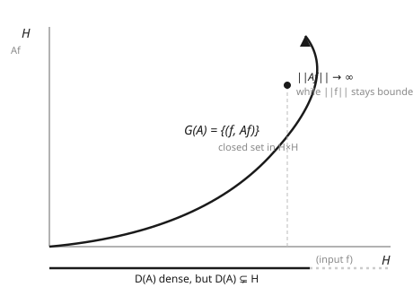

# Functional Analysis · Lesson 5.1: Unbounded operators and domains

> ⏱ ~15 min · Module 5: Unbounded operators and quantum mechanics · Builds on: [4.5 The bounded self-adjoint spectral theorem](04-05-bounded-self-adjoint-spectral-theorem.md) · Unlocks: [5.2 Symmetric vs self-adjoint](05-02-symmetric-vs-self-adjoint.md)

## Why this matters

Every operator quantum mechanics actually cares about is unbounded. Position multiplies a wavefunction by $x$; momentum differentiates it; energy is worse still. None of these is a nice bounded map $H \to H$ — differentiation turns the mild wave $e^{2\pi i n x}$ into one $2\pi n$ times taller, and $n$ has no ceiling. Module 3 built a beautiful theory for *bounded* operators (norms, adjoints, spectra), and now the physics refuses to live inside it. This lesson is the pivot: to handle unbounded operators honestly we stop asking them to be defined everywhere, hand each one a **domain**, and replace "continuous" with a new structural condition — **closed** — that survives the loss of boundedness.

## The idea

Here is the trap, and it is forced on us by a theorem we already proved. The **Hellinger–Toeplitz theorem** ([3.4](03-04-open-mapping-closed-graph.md)) says: a symmetric operator defined on *all* of $H$ is automatically bounded. Read the contrapositive slowly — if an operator is symmetric and *un*bounded, it *cannot* be defined on all of $H$. There is no such thing as an everywhere-defined unbounded symmetric operator. The unboundedness and the everywhere-definedness cannot coexist; something has to give, and it is the domain.

So an unbounded operator only makes sense as a *partial* map: it acts on a subset $D(A) \subsetneq H$, the vectors it doesn't blow up. We insist $D(A)$ be **dense** (its closure is all of $H$) — dense enough to pin the operator down and, later, to define an adjoint. The operator is genuinely the pair $(A, D(A))$: the formula *and* the set it lives on.

But if $A$ isn't continuous, how do we control it at all? The answer is to watch its **graph** — the set of input/output pairs $\{(f, Af) : f \in D(A)\}$ sitting in the product space $H \times H$. For a bounded operator this graph is closed automatically. For unbounded ones we *demand* it: $A$ is **closed** when its graph is a closed set. Closedness is the well-behavedness we keep; it's exactly enough to run limit arguments, even though $A$ is not continuous.

## The formal version

**Densely defined operator.** A linear operator $A$ on $H$ is a linear map $A : D(A) \to H$ whose domain $D(A)$ is a linear subspace of $H$ with $\overline{D(A)} = H$ (dense).

*In words:* $A$ is a partial map defined on a dense subspace, not on all of $H$ — and that subspace is part of the data.

**Bounded vs unbounded.** $A$ is **bounded** if there is $M < \infty$ with $\|Af\| \le M\|f\|$ for all $f \in D(A)$; otherwise **unbounded**.

*In words:* unbounded means no single constant controls the output size — you can find unit vectors with arbitrarily large image.

**The graph.** The graph of $A$ is $G(A) = \{(f, Af) : f \in D(A)\} \subseteq H \times H$, where $H \times H$ carries the norm $\|(f,g)\|^2 = \|f\|^2 + \|g\|^2$.

**Closed operator.** $A$ is **closed** if $G(A)$ is a closed subset of $H \times H$. Concretely: whenever $f_n \in D(A)$ with $f_n \to f$ and $Af_n \to g$, it follows that $f \in D(A)$ and $Af = g$.

*In words:* if the inputs converge *and* their images converge, the limit input is still legal and lands on the limit image — no output escapes off the edge of the domain.

**Closable operators.** $A$ is **closable** if the closure $\overline{G(A)}$ of its graph is *itself* the graph of an operator — equivalently, $f_n \to 0$ and $Af_n \to g$ force $g = 0$. That operator is the **closure** $\bar{A}$, the smallest closed extension of $A$.

*In words:* an operator is closable when you can safely "seal up" its graph without it becoming multivalued; sealing it gives the closure $\bar A$.

**Why "closed" is the right substitute for "bounded."** The Closed Graph Theorem ([3.4](03-04-open-mapping-closed-graph.md)) says an *everywhere-defined* closed operator is bounded. The escape hatch for unbounded operators is precisely that they are *not* everywhere defined: a closed operator on a proper dense domain can be — and typically is — unbounded. Closed keeps the good limit behavior; the proper domain is what lets unboundedness through.

## Concrete instance

Take $H = L^2[0,1]$ and the **momentum operator** $A = -i\,\dfrac{d}{dx}$. (The $-i$ is there so $A$ will be symmetric — that's next lesson's story; ignore it for now and think "$A$ differentiates.")

You cannot differentiate every $f \in L^2[0,1]$: most square-integrable functions aren't even continuous. So $A$ needs a domain — the natural one is

$$D(A) = \{\, f \in L^2[0,1] : f \text{ absolutely continuous},\ f' \in L^2[0,1] \,\}.$$

*In words:* the functions that have an honest derivative (in the sense that $f(x) = f(0) + \int_0^x f'$) and whose derivative is itself square-integrable. This $D(A)$ is dense in $L^2[0,1]$ — it already contains every trigonometric polynomial, and those span (from [2.3](02-03-orthonormal-bases-fourier.md)) — but it is a *proper* subset: the tent function or any function with a corner in $L^2$ but $f' \notin L^2$ sits outside it. So $A$ is densely but not everywhere defined, exactly as Hellinger–Toeplitz demands.

The picture below is the graph $G(A) \subseteq H \times H$: a closed set (nothing leaks off its edge) that nonetheless climbs without a ceiling (bounded inputs, unbounded outputs), sitting over a domain that is dense but not all of $H$.

## Worked examples

**Example 1 — momentum is unbounded (and why it needs a domain).**
On $L^2[0,1]$ use the orthonormal family $e_n(x) = e^{2\pi i n x}$, $n \in \mathbb{Z}$ (from [2.3](02-03-orthonormal-bases-fourier.md)), each with $\|e_n\| = 1$. Each $e_n$ is smooth, so $e_n \in D(A)$, and

$$A e_n = -i\,\frac{d}{dx}\,e^{2\pi i n x} = -i \,(2\pi i n)\, e^{2\pi i n x} = 2\pi n\, e_n .$$

Hence $\|A e_n\| = 2\pi |n|\,\|e_n\| = 2\pi|n|$ while $\|e_n\| = 1$. So

$$\frac{\|A e_n\|}{\|e_n\|} = 2\pi|n| \xrightarrow{\;|n|\to\infty\;} \infty .$$

No finite $M$ bounds this ratio, so **no operator norm $\|A\|$ exists** — $A$ is unbounded. And that is *precisely* why we could not have taken $D(A) = L^2[0,1]$: an everywhere-defined symmetric operator would be bounded (Hellinger–Toeplitz), contradicting what we just computed. The domain of absolutely-continuous, $L^2$-derivative functions is the honest home for $A$.

**Example 2 — momentum is closed.**
Claim: with the domain above, $A = -i\,d/dx$ is a closed operator. Suppose $f_n \in D(A)$ with $f_n \to f$ in $L^2$ and $A f_n \to g$ in $L^2$; equivalently $f_n' \to i g$ in $L^2$ (multiply by $i$). We must show $f \in D(A)$ and $Af = g$, i.e. $f$ is absolutely continuous with $f' = i g \in L^2$.

Use the Fundamental Theorem for absolutely continuous functions: since each $f_n$ is AC,

$$f_n(x) = f_n(0) + \int_0^x f_n'(t)\,dt .$$

Now take limits. $L^2[0,1] \subseteq L^1[0,1]$ (finite interval, Cauchy–Schwarz against $\mathbf 1$), so $L^2$ convergence forces $L^1$ convergence, and for each fixed $x$,

$$\int_0^x f_n'(t)\,dt \;\longrightarrow\; \int_0^x i\,g(t)\,dt ,$$

because $\big|\int_0^x (f_n' - ig)\big| \le \int_0^1 |f_n' - ig| = \|f_n' - ig\|_{L^1} \to 0$. The constants $f_n(0)$ converge too (they're the only remaining term). Passing to the limit,

$$f(x) = c + \int_0^x i\,g(t)\,dt \qquad\text{for some constant } c,$$

which exhibits $f$ as absolutely continuous with $f'(x) = i\,g(x)$ almost everywhere. Since $g \in L^2$, also $f' \in L^2$, so $f \in D(A)$ and $Af = -i f' = -i(ig) = g$. The graph is closed. ∎

So $A$ is the model citizen of this lesson: **densely defined, unbounded, and closed** — everywhere-defined it is not, and it never could be.

## Watch out

- **Unbounded $\Rightarrow$ not everywhere-defined — you *must* name a domain.** Writing "$-i\,d/dx$ on $L^2$" is not yet an operator. Hellinger–Toeplitz ([3.4](03-04-open-mapping-closed-graph.md)) forbids the everywhere-defined symmetric unbounded operator you're implicitly imagining. Specify $D(A)$ or you've specified nothing.
- **"Closed" is not "bounded," and not "continuous."** A closed operator can have $\|A f_n\| \to \infty$ for $\|f_n\| = 1$ — Example 1 does exactly that while Example 2 shows the same operator is closed. Closed controls limits *jointly* in $(f, Af)$; continuity would control $Af$ from $f$ alone, and unbounded operators flatly lack it. Don't slip from one to the other.
- **The domain is part of the operator.** The *same formula* $-i\,d/dx$ on the AC functions with $f(0)=f(1)$, versus with $f(0)=f(1)=0$, versus with no boundary condition, gives **three different operators** — different graphs, different closedness, and (Lesson 5.2) wildly different self-adjointness. This is not pedantry; it is the entire crux of the next lesson and of Boss Problem 5. Change the domain, change the operator.

## One-liner

> An unbounded operator is a *pair* $(A, D(A))$ living on a dense proper domain, and "closed graph" — not continuity — is the well-behavedness that survives when boundedness is gone.

## Problems

**P1 (🟢)** On $L^2[0,1]$, the operator $A = -i\,d/dx$ satisfies $A e_n = 2\pi n\, e_n$ for $e_n = e^{2\pi i n x}$. Show directly that there is *no* constant $M$ with $\|Af\| \le M\|f\|$ for all $f \in D(A)$, and state in one line why this means $D(A)$ cannot be all of $L^2[0,1]$.

**P2 (🟡)** Consider the **position operator** $X$ on $H = L^2(\mathbb{R})$, defined by $(Xf)(x) = x\,f(x)$, with natural domain $D(X) = \{\, f \in L^2(\mathbb{R}) : x f(x) \in L^2(\mathbb{R}) \,\}$.
(a) Exhibit one $f \in L^2(\mathbb{R})$ with $f \notin D(X)$, proving $D(X) \subsetneq H$.
(b) Show $X$ is unbounded by finding unit vectors $f_a$ with $\|X f_a\| \to \infty$. *(Hint: slide a fixed bump out to $x = a$.)*

**P3 (🔴, optional)** Show the position operator $X$ of P2 is **closed**. *(Suggestion: if $f_n \to f$ and $X f_n \to g$ in $L^2(\mathbb{R})$, pass to a subsequence converging pointwise a.e. and identify $g(x)$.)*

Solutions

**P1** Suppose such an $M$ existed. Each $e_n \in D(A)$ with $\|e_n\| = 1$ and $\|A e_n\| = \|2\pi n\, e_n\| = 2\pi|n|$. The bound would give $2\pi|n| = \|A e_n\| \le M\|e_n\| = M$ for every $n \in \mathbb{Z}$ — impossible, since $2\pi|n| \to \infty$ but $M$ is finite. So no such $M$ exists; $A$ is unbounded.

*One line:* if $D(A)$ were all of $L^2[0,1]$, then $A$ (symmetric) would be bounded by Hellinger–Toeplitz — contradicting the unboundedness just shown — so $D(A) \subsetneq L^2[0,1]$.

**P2** (a) Take $f(x) = \dfrac{1}{1+|x|}$. Then $\int_{\mathbb R} \dfrac{dx}{(1+|x|)^2} < \infty$, so $f \in L^2(\mathbb{R})$. But $(Xf)(x) = \dfrac{x}{1+|x|}$, whose modulus $\to 1$ as $|x|\to\infty$, so $|Xf|^2 \to 1$ and $\int_{\mathbb R} |Xf|^2 = \infty$. Hence $f \notin D(X)$, proving $D(X) \subsetneq L^2(\mathbb{R})$.

(b) Fix a unit bump: let $\varphi$ be any function with $\|\varphi\|=1$ supported in $[-\tfrac12,\tfrac12]$ (e.g. $\varphi = \mathbf 1_{[-1/2,1/2]}$), and set $f_a(x) = \varphi(x - a)$. Translation preserves the $L^2$ norm, so $\|f_a\| = 1$ for all $a$, and $f_a \in D(X)$ (compact support). Then
$$\|X f_a\|^2 = \int_{\mathbb R} x^2 |\varphi(x-a)|^2\,dx = \int_{\mathbb R} (u+a)^2 |\varphi(u)|^2\,du \ge \int_{\mathbb R}\big(a^2 - 2|a||u|\big)|\varphi(u)|^2\,du = a^2 - 2|a|\,c,$$
where $c = \int |u|\,|\varphi(u)|^2\,du < \infty$ is a fixed constant (bump has bounded support). As $a \to \infty$, $\|X f_a\|^2 \ge a^2 - 2c|a| \to \infty$ while $\|f_a\| = 1$. So the ratio $\|X f_a\|/\|f_a\|$ is unbounded — $X$ is unbounded.

**P3** Suppose $f_n \in D(X)$, $f_n \to f$ and $X f_n \to g$ in $L^2(\mathbb{R})$. Since $f_n \to f$ in $L^2$, some subsequence $f_{n_k} \to f$ pointwise a.e.; then $x f_{n_k}(x) \to x f(x)$ pointwise a.e. But $X f_{n_k} = x f_{n_k} \to g$ in $L^2$, so a further subsequence converges pointwise a.e. to $g$. Two a.e. pointwise limits of the same sequence agree a.e., so $x f(x) = g(x)$ almost everywhere. Since $g \in L^2(\mathbb{R})$, we get $x f(x) = g \in L^2$, hence $f \in D(X)$ and $X f = g$. The graph is closed, so $X$ is a closed operator (unbounded, densely defined, closed — the same profile as momentum). ∎

## Flashback

**From Module 4 ([4.1 The spectrum of an operator](04-01-spectrum-of-an-operator.md)):** Let $D : \ell^2(\mathbb{N}) \to \ell^2(\mathbb{N})$ be the *bounded* diagonal operator $D(x_1, x_2, x_3, \dots) = \big(x_1, \tfrac{1}{2}x_2, \tfrac{1}{3}x_3, \dots\big)$, i.e. $(Dx)_n = \tfrac{1}{n} x_n$. Find the spectrum $\sigma(D)$. Is $0$ an eigenvalue? Is $0 \in \sigma(D)$?

Solution

Each basis vector $e_n$ is an eigenvector: $D e_n = \tfrac1n e_n$, so every $\tfrac1n$ ($n \ge 1$) is an eigenvalue, hence in $\sigma(D)$. The spectrum is closed (a Module 4 fact), so it must also contain the limit point $0$ of $\{1/n\}$. Thus
$$\sigma(D) = \left\{ 1, \tfrac12, \tfrac13, \dots \right\} \cup \{0\}.$$
Is $0$ an **eigenvalue**? No: $Dx = 0$ means $\tfrac1n x_n = 0$ for all $n$, forcing $x = 0$, and $0$ is never an eigenvector. But $0 \in \sigma(D)$ anyway — $D$ is injective with dense range, yet $D^{-1}$ (which would send $e_n \mapsto n\,e_n$) is *unbounded*, so $D - 0\cdot I = D$ is not invertible in $\mathcal B(\ell^2)$. This is continuous-spectrum behavior: $0$ is a spectral value that is not an eigenvalue. (And note the shadow of this whole lesson — that would-be inverse $e_n \mapsto n e_n$ is exactly the kind of unbounded, densely-defined operator Module 5 is built to handle.)

## Connections

- **Backward — [3.4 Open mapping / closed graph](03-04-open-mapping-closed-graph.md):** Hellinger–Toeplitz *forces* the dense proper domain (everywhere-defined symmetric $\Rightarrow$ bounded), and the Closed Graph Theorem explains why "closed" only escapes "bounded" by giving up everywhere-definedness. This lesson is those two theorems read as permissions rather than prohibitions.
- **Backward — [3.1 Bounded operators](03-01-bounded-operators-operator-norm.md):** everything here is the negation of the bounded theory — no operator norm, no automatic continuity, no defined-everywhere — kept usable by the graph.
- **Backward — [4.5 The bounded self-adjoint spectral theorem](04-05-bounded-self-adjoint-spectral-theorem.md):** the spectral theorem you just built assumed boundedness; Module 5 rebuilds it for the unbounded operators of physics, starting from the domain machinery here (see [5.3](05-03-spectral-theorem-unbounded.md)).
- **Forward — [5.2 Symmetric vs self-adjoint](05-02-symmetric-vs-self-adjoint.md):** the entire distinction lives in domains — you need a dense domain even to *define* the adjoint, and the same formula on different domains is symmetric, self-adjoint, or neither. Then [5.4 Stone's theorem](05-04-stone-theorem-time-evolution.md) turns self-adjoint generators into time evolution.
- **Sideways — [quantum mechanics](../../quantum-mechanics/syllabus.md):** position $X$, momentum $-i\,d/dx$, and the Hamiltonian are the observables of quantum theory, and every one of them is unbounded — which is *why* wavefunctions live in subtle domains and boundary conditions carry physics. The domain is not bookkeeping; it encodes which states the operator is allowed to act on.
- **Sideways — [PDEs](../../pdes/syllabus.md):** differential operators like the Laplacian are unbounded, and their domains are fixed by boundary conditions (Dirichlet, Neumann) — the same "one formula, many operators via the domain" phenomenon that drives Boss Problem 5, seen from the PDE side.
