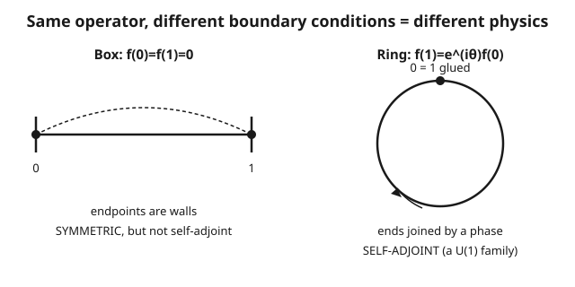

# Functional Analysis · Lesson 5.2: Symmetric vs self-adjoint

> ⏱ ~15 min · Module 5: Unbounded operators and quantum mechanics · Builds on: [5.1 Unbounded operators and domains](05-01-unbounded-operators-domains.md) · Unlocks: [5.3 The spectral theorem for unbounded self-adjoint operators](05-03-spectral-theorem-unbounded.md)

## Why this matters

Every quantum-mechanics course tells you observables are "Hermitian operators," meaning $\langle Ax, y\rangle = \langle x, Ay\rangle$. That is a lie of convenience. For the unbounded operators of real physics — position, momentum, energy — that inner-product identity is **not enough** to guarantee a real spectrum, a spectral decomposition, or well-defined time evolution. The property that actually delivers all three is strictly stronger: **self-adjointness**, which pins down not just how the operator acts but exactly *which functions it acts on*. The gap between "symmetric" and "self-adjoint" is a gap about **domains**, and it is where the physics lives: it is the difference between a particle in a box and a particle on a ring, and it is the reason momentum on a half-line is not an observable at all. This distinction is the crux of Module 5.

## The idea

Recall from [5.1](05-01-unbounded-operators-domains.md) that an unbounded operator is inseparable from its domain — you cannot even define $-i\,d/dx$ without saying which functions you'll differentiate. Now we ask a subtler question: given a densely-defined $A$, what is its *adjoint* $A^*$, and does it agree with $A$?

Here is the trap. To be **symmetric** means the "flip" identity $\langle Ax, y\rangle = \langle x, Ay\rangle$ holds for all $x, y$ that $A$ is willing to eat. To be **self-adjoint** means $A$ *equals* its adjoint $A^*$ — and $A^*$ comes with its *own* domain, the set of all $y$ for which the flip is even possible. A symmetric operator is often too *stingy* with its domain: the flip works for the vectors it accepts, but there are extra vectors $y$ that would also make the flip work, and $A$ simply refuses to accept them. Those extra vectors belong to $D(A^*)$ but not $D(A)$. So $A^*$ is a genuine *extension* of $A$ — same formula, bigger domain — and $A \neq A^*$.

Self-adjointness is the Goldilocks condition: the domain is exactly right, neither too small nor too large, so that $A$ and $A^*$ coincide **including their domains**. Getting there means choosing the correct **boundary conditions**, and — this is the punchline — there can be zero valid choices, exactly one, or a whole family. Which case you're in is decided by two integers.

## The formal version

Let $H$ be a Hilbert space and $A$ a **densely-defined** operator (its domain $D(A)$ is dense in $H$), with inner product $\langle\cdot,\cdot\rangle$ linear in the first slot.

**The adjoint.** $D(A^*) = \{\,y \in H : x \mapsto \langle Ax, y\rangle \text{ is bounded on } D(A)\,\}$, and for such $y$ the vector $A^*y$ is defined by
$$\langle Ax, y\rangle = \langle x, A^*y\rangle \quad\text{for all } x \in D(A).$$
*In words:* $y$ is in the adjoint's domain when "pairing with $y$ after applying $A$" is a bounded functional; Riesz ([2.4](02-04-riesz-representation.md)) then hands you a unique vector $A^*y$ representing it.

**Symmetric.** $A$ is symmetric if $\langle Ax, y\rangle = \langle x, Ay\rangle$ for all $x, y \in D(A)$. Equivalently, $A \subseteq A^*$: the adjoint extends $A$, so $D(A) \subseteq D(A^*)$ and the two agree on $D(A)$.
*In words:* the flip identity holds on $A$'s own domain — which forces $D(A^*)$ to be at least as big as $D(A)$, possibly strictly bigger.

**Self-adjoint.** $A$ is self-adjoint if $A = A^*$ — the actions agree **and** $D(A) = D(A^*)$.
*In words:* symmetric *plus* the domains are exactly equal; no leftover vectors sneak into $D(A^*)$.

**Essentially self-adjoint.** $A$ is essentially self-adjoint if its closure $\overline{A}$ is self-adjoint — equivalently, $A$ has a **unique** self-adjoint extension.
*In words:* $A$ is a hair too small, but there's one and only one honest way to complete it.

**Deficiency indices.** Define
$$n_+ = \dim \ker(A^* - i), \qquad n_- = \dim \ker(A^* + i),$$
i.e. the number of independent solutions of $A^* u = \pm i\,u$ that lie in $H$.
*In words:* count the eigenvectors of the adjoint at the imaginary units $\pm i$. The theorem (von Neumann): a symmetric $A$ has self-adjoint extensions **iff $n_+ = n_-$**; when equal to $n$, the extensions form a family parameterized by the unitary maps $U(n)$ between the two deficiency spaces. If $n_+ \neq n_-$, there are **none**. And $n_+ = n_- = 0$ means $A$ is already essentially self-adjoint.

Only self-adjoint operators earn the spectral theorem ([5.3](05-03-spectral-theorem-unbounded.md)), a real spectrum, and unitary dynamics ([5.4](05-04-stone-theorem-time-evolution.md)). Symmetry alone buys you none of it.

## Concrete instance — momentum on $[0,1]$

Take $H = L^2[0,1]$ and $A = -i\,\dfrac{d}{dx}$, the momentum operator. As a *formula* it is fixed; as an *operator* it is only pinned down once we name a domain, and the domain is a boundary condition on the ends of the interval.

- **Box (Dirichlet):** $D(A) = \{f : f(0) = f(1) = 0\}$. The endpoints act like impenetrable walls. This $A$ is symmetric but, we'll see, *not* self-adjoint — its adjoint imposes **no** boundary condition, so $D(A) \subsetneq D(A^*)$.
- **Ring (twisted periodic):** $D(A_\theta) = \{f : f(1) = e^{i\theta} f(0)\}$ for a fixed angle $\theta \in [0, 2\pi)$. The endpoints are *glued* by a phase — the interval becomes a circle. Each $\theta$ gives a genuinely different self-adjoint operator: a $U(1)$ worth of distinct physics.

Different boundary conditions are not bookkeeping — they *are* the choice of self-adjoint extension, hence the choice of physical system.

## Worked examples

**Example 1 (the boundary term — where the whole distinction hides).** For $f, g \in H^1[0,1]$ (once-differentiable, in $L^2$), integrate by parts. Using $\overline{-i} = i$ and $(\,f\bar g\,)' = f'\bar g + f\bar g'$:
$$\langle Af, g\rangle - \langle f, Ag\rangle = \int_0^1 (-i f')\,\bar g\,dx - \int_0^1 f\,\overline{(-i g')}\,dx = -i\int_0^1 (f'\bar g + f \bar g')\,dx = -i\int_0^1 (f\bar g)'\,dx,$$
$$\boxed{\;\langle Af, g\rangle - \langle f, Ag\rangle = -i\big[\,f(1)\overline{g(1)} - f(0)\overline{g(0)}\,\big].\;}$$
$A$ is symmetric exactly when this **boundary term vanishes** for all $f, g$ in its domain.

*Box domain $\{f(0)=f(1)=0\}$:* if $f(0)=f(1)=0$ then $f(1)\overline{g(1)} - f(0)\overline{g(0)} = 0$ automatically — for *every* $g$, with no condition on $g$ at all. So $A$ is symmetric. But now find $D(A^*)$: it is the set of $g$ making $\langle Af, g\rangle$ bounded, and since the boundary term already vanishes for *unconstrained* $g$, we get $D(A^*) = H^1[0,1]$ — **no boundary condition**. Thus $D(A) = \{f(0)=f(1)=0\} \subsetneq H^1 = D(A^*)$: the domains differ, so $A \subsetneq A^*$. **Symmetric, not self-adjoint.**

*Ring domain $\{f(1)=e^{i\theta}f(0)\}$:* now the boundary term is
$$f(1)\overline{g(1)} - f(0)\overline{g(0)} = e^{i\theta}f(0)\,\overline{g(1)} - f(0)\overline{g(0)} = f(0)\big(e^{i\theta}\overline{g(1)} - \overline{g(0)}\big).$$
This vanishes for all such $f$ iff $e^{i\theta}\overline{g(1)} = \overline{g(0)}$, i.e. $g(1) = e^{i\theta}g(0)$ — **the same condition** as on $f$. So $D(A^*) = D(A_\theta)$ exactly, and $A_\theta = A_\theta^*$. **Self-adjoint**, one operator for each $\theta$.

**Example 2 (deficiency indices — the core of Boss 5).** Solve $A^* u = \pm i\,u$, where $A^*$ acts as $-i\,u'$ on the maximal domain. From $-i u' = i u$ we get $u' = -u \Rightarrow u = e^{-x}$; from $-i u' = -i u$ we get $u' = u \Rightarrow u = e^{x}$.

*On $[0,1]$:* both $e^{-x}$ and $e^{x}$ are bounded on a compact interval, hence in $L^2[0,1]$. So
$$n_+ = \dim\ker(A^* - i) = 1 \;(\text{spanned by } e^{-x}), \qquad n_- = \dim\ker(A^* + i) = 1 \;(\text{spanned by } e^{x}).$$
Equal indices $\Rightarrow$ self-adjoint extensions exist, parameterized by $U(1)$ — precisely the circle of angles $\theta$ from Example 1. The abstract theorem and the concrete boundary condition give the **same** one-parameter family.

*On the half-line $[0,\infty)$:* now integrability at $+\infty$ matters. $e^{-x} \in L^2[0,\infty)$ (it decays), but $e^{x} \notin L^2[0,\infty)$ (it blows up). So
$$n_+ = 1, \qquad n_- = 0.$$
Unequal $\Rightarrow$ **no self-adjoint extension exists.** Physically: momentum generates spatial translation, but on a half-line you can only push in one direction before falling off the edge at $0$ — there is no unitary translation group, so momentum on $[0,\infty)$ is **not an observable**. The mismatched integers $(1,0)$ are the mathematics detecting that asymmetry.

## Watch out

- **Symmetric $\neq$ self-adjoint.** This is *the* universal physics-course error. The flip identity $\langle Ax,y\rangle=\langle x,Ay\rangle$ is symmetry; self-adjointness additionally demands $D(A) = D(A^*)$. A symmetric operator can fail to be self-adjoint purely because its domain is too small — the actions never disagree, the *domains* do.
- **A symmetric operator may have zero, one, or many self-adjoint extensions.** Don't assume completing it is possible or unique. The deficiency indices $(n_+, n_-)$ decide: unequal $\to$ none, both zero $\to$ a unique one (essentially self-adjoint), equal to $n\geq 1 \to$ a $U(n)$ family.
- **Boundary conditions *are* the choice of extension.** "Which self-adjoint extension?" and "which boundary condition?" are the same question. Box vs ring isn't a modeling footnote — it selects a different self-adjoint operator with a different spectrum, hence different allowed energies.
- **Only self-adjoint operators are observables.** The spectral theorem ([5.3](05-03-spectral-theorem-unbounded.md)) — real eigenvalues, a resolution of the identity, real measurement outcomes — requires $A = A^*$, not mere symmetry. Symmetric-but-not-self-adjoint operators can even have complex numbers in their spectrum.

## One-liner

> Symmetric means the flip identity holds; self-adjoint means it holds *and the domains match* — and the boundary conditions that force the match are the physics, decided by whether the two deficiency indices agree.

## Problems

**P1 (🟢)** Let $A = -i\,d/dx$ on $L^2[0,1]$ with the **periodic** domain $D(A) = \{f : f(0) = f(1)\}$ (the $\theta = 0$ case). Using the boundary term from Example 1, verify that $A$ is symmetric and identify $D(A^*)$. Is $A$ self-adjoint?

**P2 (🟡)** Consider $A = -i\,d/dx$ on $L^2[0,1]$ with the **too-strong** Dirichlet domain $\{f(0)=f(1)=0\}$ (the box). Its deficiency indices are $n_+ = n_- = 1$. What does von Neumann's theorem predict about its self-adjoint extensions, and how does that square with the box *not* being self-adjoint? (One sentence of interpretation.)

**P3 (🔴, optional)** For the operator $A = -\dfrac{d^2}{dx^2}$ on $L^2[0,\infty)$ with domain $\{f : f(0) = 0,\ f \text{ smooth, compactly supported}\}$, solve $A^* u = \pm i\,u$ and compute the deficiency indices $(n_+, n_-)$. Does a self-adjoint extension exist? *(Hint: solve $-u'' = \lambda u$ for $\lambda = \pm i$; keep only the $L^2[0,\infty)$ solutions, i.e. those that decay as $x\to\infty$.)*

Solutions

**P1** With $f(0)=f(1)$ and $g(0)=g(1)$, the boundary term is
$$f(1)\overline{g(1)} - f(0)\overline{g(0)} = f(0)\overline{g(0)} - f(0)\overline{g(0)} = 0,$$
so $\langle Af,g\rangle = \langle f,Ag\rangle$ and $A$ is **symmetric**. For $D(A^*)$: we need the boundary term to vanish for all $f$ with $f(0)=f(1)$. Factor $f(1)\overline{g(1)} - f(0)\overline{g(0)} = f(0)\big(\overline{g(1)} - \overline{g(0)}\big)$ (using $f(1)=f(0)$), which vanishes for all such $f$ iff $g(1) = g(0)$ — the same periodic condition. Hence $D(A^*) = D(A)$ and $A = A^*$: **yes, self-adjoint.** (This is the $\theta=0$ member of the ring family — the ordinary particle on a circle.)

**P2** Von Neumann says: since $n_+ = n_- = 1$, self-adjoint extensions *exist*, and they form a **$U(1)$ family** — exactly the twisted-periodic operators $A_\theta$ with $f(1)=e^{i\theta}f(0)$. The box operator itself ($f(0)=f(1)=0$) is **not** one of them; it is the common *symmetric restriction* sitting inside all of them, with a domain too small to equal its adjoint's. So there's no contradiction: "extensions exist" is a statement about completing the box outward to a larger, correct domain, not about the box being self-adjoint as given.

**P3** Solve $-u'' = i u$, i.e. $u'' = -i u$. The characteristic roots are $r = \pm\sqrt{-i}$. Write $\sqrt{-i} = e^{-i\pi/4} = \tfrac{1}{\sqrt2}(1 - i)$, so $r = \pm\tfrac{1}{\sqrt2}(1-i)$. The decaying (negative real part) root is $r_- = -\tfrac{1}{\sqrt2}(1-i)$, giving one $L^2[0,\infty)$ solution $u_+ = e^{r_- x}$. Hence $\dim\ker(A^* - i) = n_+ = 1$.

For $-u'' = -i u$, i.e. $u'' = i u$: roots $r = \pm\sqrt{i} = \pm\tfrac{1}{\sqrt2}(1+i)$. The decaying root is $-\tfrac{1}{\sqrt2}(1+i)$, giving one $L^2$ solution. Hence $n_- = 1$.

So $(n_+, n_-) = (1,1)$: **equal**, so self-adjoint extensions **do exist** — a $U(1)$ family, corresponding to the choice of boundary condition on $u'(0)/u(0)$ (Robin/Neumann/Dirichlet-type conditions at the origin). This is the $-\Delta$ on a half-line whose extensions are the standard boundary conditions of a Schrödinger operator on $[0,\infty)$.

## Flashback

**From Lesson 5.1 (Unbounded operators and domains):** On $H = L^2[0,1]$, let $e_n(x) = e^{2\pi i n x}$ for $n \in \mathbb{Z}$. Show that $A = -i\,d/dx$ is **unbounded** by exhibiting the failure directly on these vectors.

Solution

Each $e_n$ is normalized: $\|e_n\|^2 = \int_0^1 |e^{2\pi i n x}|^2\,dx = \int_0^1 1\,dx = 1$. Applying $A$:
$$A e_n = -i\,\frac{d}{dx}e^{2\pi i n x} = -i\,(2\pi i n)\,e^{2\pi i n x} = 2\pi n\, e_n,$$
so $\|A e_n\| = |2\pi n|\,\|e_n\| = 2\pi |n| \to \infty$ as $n \to \infty$, while $\|e_n\| = 1$ stays fixed. No constant $C$ can satisfy $\|A e_n\| \le C\|e_n\|$ for all $n$, so $A$ is **unbounded** — which is exactly why it cannot be defined on all of $H$ and why the domain question of this lesson even arises. (These $e_n$ are eigenfunctions with eigenvalues $2\pi n$: the momentum spectrum of the ring, marching off to infinity.)

## Connections

- **Backward:** this is the domain story of [5.1](05-01-unbounded-operators-domains.md) sharpened to its decisive form — the adjoint's domain, not just the operator's. For **bounded** self-adjoint operators ([3.5](03-05-adjoints-bounded-operators.md), [4.05](04-05-bounded-self-adjoint-spectral-theorem.md)) this whole lesson evaporates: bounded operators live on all of $H$, so $D(A) = D(A^*) = H$ automatically and symmetric = self-adjoint for free. The [Hellinger–Toeplitz theorem](03-04-open-mapping-closed-graph.md) explains *why* the unbounded case is unavoidable: an everywhere-defined symmetric operator is forced to be bounded, so genuinely unbounded observables **must** have a restricted domain — and then the symmetric/self-adjoint gap opens.
- **Forward:** the spectral theorem for unbounded operators ([5.3](05-03-spectral-theorem-unbounded.md)) and Stone's theorem on unitary time evolution ([5.4](05-04-stone-theorem-time-evolution.md)) both require $A = A^*$ on the nose. Self-adjointness is the entry ticket to both; symmetry gets you turned away at the door.
- **Sideways (quantum mechanics):** what physics calls a "Hermitian" observable must in fact be self-adjoint — see [quantum-mechanics](../../quantum-mechanics/syllabus.md), where the particle-in-a-box and particle-on-a-ring are the *same* momentum formula with different boundary conditions, hence different self-adjoint operators with different spectra. The half-line result is why radial momentum needs care.
- **Sideways (PDEs):** the boundary-term-vanishing computation of Example 1 is exactly how Sturm–Liouville operators are made self-adjoint in [pdes](../../pdes/syllabus.md) — choosing boundary conditions so that $\int (\mathcal{L}f)\bar g - f\overline{\mathcal{L}g}$ has no surviving boundary contribution is the identical idea, and it is what guarantees real eigenvalues and orthogonal eigenfunctions for separation-of-variables.
