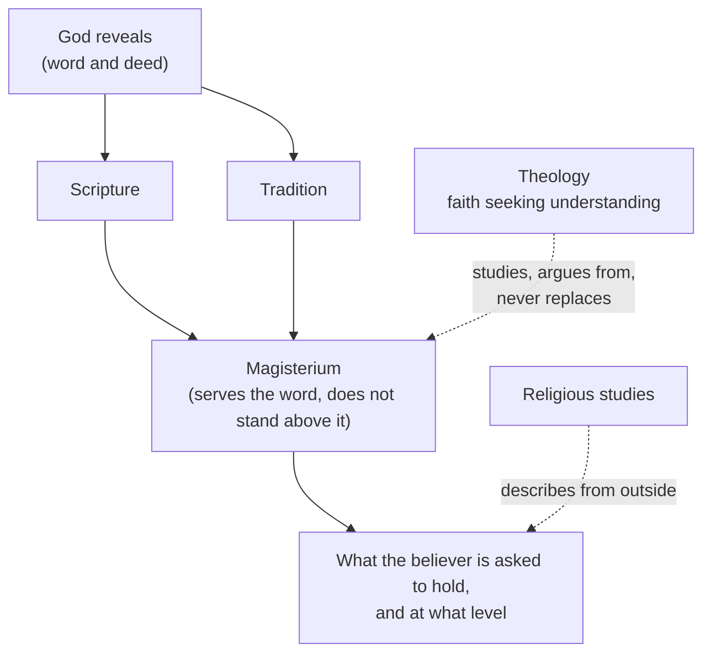

# Fundamental Theology · Lesson 1.1: What fundamental theology asks

> ⏱ ~15 min · Module 1: Revelation · Builds on: nothing — this is the first lesson · Unlocks: [1.2 Natural knowledge of God](01-02-natural-knowledge-of-god.md)

## Why this matters

Every later course in this field will mark a claim as dogma, as definitive teaching, as ordinary magisterium, or as freely disputed — and the difference decides what a Catholic owes it and what disagreeing with it would amount to. A reader who cannot tell those apart makes two opposite mistakes: treating a theologian's opinion as binding, and treating a defined dogma as one view among many. This course exists to make that reading reliable, and it starts by asking what kind of discipline is doing the reading.

## The idea

**Fundamental theology asks the prior questions.** Dogmatic theology asks what the Trinity is; moral theology asks what a good act is. Before any of that: has God spoken at all? If he has, how does that word reach me — through a book, a community, an office, all three? And when someone says "the Church teaches," how do I check what is taught, and how firmly?

Two contrasts fix the discipline:

- **Theology is not religious studies.** A historian of religion describes what Catholics believe without standing inside the claim. Theology works *from within*: it takes revelation as given and asks what follows. That is not a defect of rigor, it is a different starting point, and it is stated openly rather than smuggled.
- **Theology is not simply repeating the sources.** Anselm's phrase is *fides quaerens intellectum* — faith seeking understanding. The faith comes first and is not the conclusion; the understanding is real work, and it can go wrong, which is why the tradition developed ways to grade its own claims.

## The argument

**Aquinas's case for why revealed doctrine is needed at all** (*Summa Theologiae* I, q.1, a.1). In numbered form:

> **P1.** A person can direct their intentions and actions toward an end only if that end is known in some way beforehand.
> **P2.** The end to which humans are in fact ordered — God himself, seen as he is — exceeds what reason can reach.
> **∴ C.** That end must be made known by God's own revealing, over and above what the philosophical sciences discover.

In words: you cannot aim at a target you cannot see, and this target is past the range of unaided sight. Aquinas adds a second, humbler argument in the same article: even the truths about God that reason *can* reach would be known by few people, after a long time, and with an admixture of error — so revelation is fitting for those too. Keep the two arguments distinct; [1.2](01-02-natural-knowledge-of-god.md) turns on the difference.

**The citation conventions of this field.** The tradition argues by pointing, so reading a citation is a skill:

| Form | Points at | Example |
|---|---|---|
| Book chapter:verse | Scripture, here in the Douay–Rheims | Romans 1:20 |
| Council, session or constitution, chapter or canon | A conciliar act | Trent, Session IV; *Dei Filius*, ch. 2 |
| Document title and year | A papal or curial act | *Providentissimus Deus* (1893) |
| ST part, question, article | Aquinas | ST I, q.1, a.1 |
| DH *n* | A numbered entry in Denzinger–Hünermann, an anthology of source texts | DH followed by a number |
| CCC *n* | A paragraph of the Catechism | — |

Two of those carry a trap. **DH is an index, not an authority**: the number locates a text whose weight comes from the act itself, not from being printed in Denzinger. The **Catechism is a compendium**: it gathers teaching of very different weights into one voice, so a claim's level is fixed by the source the Catechism is summarizing, not by its appearance there. Both traps return in [4.5](04-05-reading-a-documents-weight.md).

**A first look at the ladder.** The course's centerpiece, built properly in [4.4](04-04-the-ladder-of-doctrinal-authority.md):

| Level | Sample claim |
|---|---|
| Divinely revealed, proposed as such | the bodily Assumption of Mary (defined 1950) |
| Definitive, to be held | truths necessarily connected with revelation |
| Authentic ordinary magisterium, non-definitive | most of what encyclicals teach |
| Theologically certain, common teaching | conclusions the manuals agreed on |
| Freely disputed | whether unbaptized infants who die are in limbo |

## Argument map

Fundamental theology is the study of this diagram: whether the top box happened, how the arrows work, and how to read the bottom one.

## Worked examples

**Example 1 (mechanical — reading a citation).** A footnote reads: *Dei Filius*, ch. 2 and canon 1 (Vatican I, 1870); cf. Romans 1:20.

Unpack it. *Dei Filius* is a dogmatic constitution of the First Vatican Council — so a conciliar act, the heaviest genre available. "Ch. 2" is expository: the chapter explains. "Canon 1" is the operative part: the canons attach an anathema and are where the definition bites. The scriptural cross-reference is the warrant the council itself cites, not an independent authority added by the footnote's author. Verdict: the citation points at a defined teaching, and if you want to know precisely *what* was defined, you read the canon and not the chapter — which is exactly [1.2](01-02-natural-knowledge-of-god.md)'s exercise.

**Example 2 (why you'd care — two claims, two kinds of disagreement).** Compare:

- *Mary was assumed body and soul into heavenly glory.* Defined in 1950. A Catholic who rejects it is not holding a minority theological view; they are denying something proposed as divinely revealed.
- *Unbaptized infants who die are in limbo.* Never defined. A theological opinion of long standing, discussed again in a 2007 study of the International Theological Commission, which is an advisory body and not the Magisterium. A Catholic may hold it, and a Catholic may hope otherwise.

Same grammatical form — "the Church says X" — and completely different force. The first is a claim about what God has revealed; the second is a claim about where the weight of theological opinion sits. Flattening the two is the single most common error in popular argument about Catholicism, in both directions: critics attack the tradition's opinions as though they were dogmas, and defenders sometimes defend opinions as though the faith depended on them.

## Watch out

- **You might think "the Church teaches X" is one kind of statement.** It covers at least five, and the differences are the subject of Module 4. Always ask: taught by whom, in what act, at what level?
- **You might think a DH number settles weight.** It settles *location*. Denzinger prints heretical propositions too — being in the book says nothing about being true, let alone binding.
- **You might think theology's starting inside the faith makes it unfalsifiable.** It makes its starting point explicit. Its internal discipline is severe: a claim has to be traced to a source, and the tradition grades its own conclusions, which is what the rest of this course teaches.
- **Advisory bodies are not the Magisterium.** The International Theological Commission and the Pontifical Biblical Commission advise; their studies carry the weight of the argument in them, not of an act of teaching.

## One-liner

> Fundamental theology asks the prior questions — has God spoken, how does that word reach us, and how do I tell what the Church actually teaches, and how firmly?

## Problems

**P1 (🟢) *(Exegetical.)*** For each citation, say what kind of source it points at and what you would have to read to know what is *defined* rather than explained. One sentence each.

(a) Trent, Session IV, the decree on the canonical scriptures (1546)
(b) *Providentissimus Deus* (1893)
(c) ST II-II, q.2, a.2
(d) A paragraph of the Catechism summarizing the Assumption

**P2 (🟡) *(Exegetical.)*** Three statements a Catholic might make. For each, say whether it is (i) a claim about revealed doctrine, (ii) a theological opinion, or (iii) a historical claim — and say what kind of evidence or act would settle it. 150 words or fewer.

(a) "God can be known with certainty from created things by the light of natural reason."
(b) "Efficacious grace works by a physical premotion rather than through God's knowledge of what a free creature would do."
(c) "The bishops at Trent intended to leave the 'two sources' question open."

**P3 (🔴, optional) *(Exegetical (a) · Evaluative (b).)*** An invented parish bulletin paragraph:

> "Some people claim the Church has changed its teaching. It hasn't — the Church has never changed anything. Everything in the Catechism is equally the faith: the Assumption, the Church's judgement about capital punishment, and the Pope's remarks last week on economic policy. To question any of it is to leave the faith."

(a) Name three distinct errors this paragraph makes about levels and sources. (b) A parishioner replies that the paragraph's *spirit* is right, since a Catholic should trust the Church rather than sorting teachings into tiers. In 150 words, assess that reply — any verdict, provided you say what trust actually requires and what it does not.

Solutions

**P1** *(Exegetical — strict.)*

**Must hit, strict:**
- (a) A conciliar act — the heaviest genre. To find what is *defined*, read the decree's own operative language and the canons attached to the session, not the preamble.
- (b) A papal encyclical: authentic ordinary magisterium. What it defines is normally nothing; you read it for what is taught and with what insistence.
- (c) Aquinas — a theologian, however eminent. Nothing here is defined at all; his authority is the strength of his argument and his standing in the tradition.
- (d) The Catechism is a compendium: the level is fixed by the act it summarizes (here the 1950 definition), so you go to that act.

**Wrong turns:** treating the Catechism as itself the defining act; treating an encyclical as defining doctrine by default; assuming every conciliar sentence is a definition — councils explain as well as define.

**Model answer:** (a) conciliar; read the canons. (b) papal encyclical, ordinary magisterium; read for the teaching, expect no definition. (c) a theologian; no magisterial weight as such. (d) a compendium; trace the claim to the 1950 act.

---

**P2** *(Exegetical — strict.)*

**Must hit, strict:**
- (a) Revealed doctrine — defined at Vatican I in *Dei Filius*. Settled by the conciliar act; that is [1.2](01-02-natural-knowledge-of-god.md)'s subject.
- (b) Theological opinion — the Thomist position in the *de auxiliis* dispute, which the Holy See deliberately left open. Settled by nothing at present; both schools are permitted.
- (c) A historical claim about the intentions of the council's members — settled by the conciliar records and the drafting history, not by any doctrinal act.

**Wrong turns:** calling (b) doctrine because it concerns grace, which is a doctrinal topic — the *topic* is doctrinal, the disputed thesis is not; calling (c) doctrine because it is about a council, when it is a claim about what men intended.

**Model answer:** (a) revealed doctrine, fixed by a conciliar definition; (b) a live theological opinion, deliberately left open; (c) a historical claim, settled by the acts and drafts of the council.

---

**P3** *(a) exegetical — strict; (b) evaluative — any verdict.*

**Must hit, strict (a):** any three of —
1. "The Church has never changed anything" is false as stated and not what the tradition claims; it claims continuity of doctrine, and Module 5 is about how growth and change are told apart.
2. The Catechism is treated as a flat list; it is a compendium whose entries carry the weight of their sources.
3. Three items of wildly different levels are equated: a defined dogma, a prudential judgement of the ordinary magisterium, and an off-the-cuff papal remark that is not a teaching act at all.
4. "To question any of it is to leave the faith" misstates what denial amounts to at each level — only the first carries anything like that consequence.

**Must hit, any verdict (b):** say what trust requires (that the levels are the Church's own distinctions, so honouring them *is* trusting her rather than second-guessing her) and what it does not (uniform assent to everything any churchman says). Either conclusion about the parishioner's spirit passes if that distinction is made.

**Wrong turns:** treating the paragraph as merely rude rather than mistaken; arguing about capital punishment or economic policy, which is not what was asked.

**Model answer (b), one of several:** The spirit is defensible and the execution is not. Sorting teachings by level is not a device for evading the Church; it is the Church's own apparatus, worked out in canon law and in the 1989 Profession of Faith precisely so that a Catholic knows what is owed. Trust means holding the faith as taught and giving genuine religious submission to authentic teaching. It does not mean treating a press remark as revelation — and a Catholic who did so would, oddly, be less able to say what the faith actually is.

## Connections

- **Forward:** [1.2](01-02-natural-knowledge-of-god.md) reads the first canon of *Dei Filius* word by word — the exercise Example 1 set up — and Module 4 builds the ladder this lesson only sketched.
- **Sideways:** the reconstruction discipline used in the problems is [`philosophical-method`](../../philosophical-method/syllabus.md) 1.3, used here and not retaught; the scholastic article form appears in its 4.4.
- **Where it goes:** every course in this field cites [4.4](04-04-the-ladder-of-doctrinal-authority.md) for levels, and [`thomistic-synthesis`](../../thomistic-synthesis/syllabus.md) takes up ST I q.1, which [5.4](05-04-sacred-doctrine-as-a-science.md) reads for theology's method.
