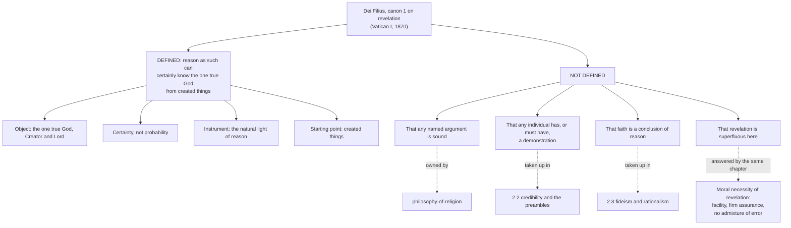

# Fundamental Theology · Lesson 1.2: Natural knowledge of God

> ⏱ ~15 min · Module 1: Revelation · Builds on: [1.1 What fundamental theology asks](01-01-what-fundamental-theology-asks.md) · Unlocks: [1.3 Supernatural revelation](01-03-supernatural-revelation.md)

## Why this matters

There is a defined Catholic dogma about what unaided human reason can reach. It is short, it is nineteenth-century, and almost everyone who invokes it misquotes it — in both directions. Atheists take it as the Church staking her faith on the success of Aquinas's proofs, so that breaking the Five Ways would break the dogma. Catholics sometimes take it as a pious flourish that commits nobody to anything. Neither survives reading the text. [1.1](01-01-what-fundamental-theology-asks.md)'s Example 1 told you the rule: the chapter explains, the canon defines. Here you do it.

## The idea

Vatican I defined a claim about a **capacity**, not about a **performance**.

Distinguish three sentences that sound alike:

1. *Human reason, as such, can attain certain knowledge of God from created things.* — the capacity claim.
2. *This particular argument from motion is sound.* — a claim about one proof.
3. *Most people have in fact reasoned their way to God.* — a claim about what humans have actually done.

Only the first is defined. The council canonized no argument, named no philosopher, and said nothing about how many people succeed. That is not evasion; it is precision. A capacity claim is about what a faculty is ordered to attain, and it is compatible with the faculty being obstructed, distracted, or badly used in almost every actual case — which is exactly what the same chapter goes on to say.

The second half of the lesson is that companion claim. Even for truths reason *can* reach, revelation is **morally necessary**: without it those truths would in fact be had by few, late, and mixed with error. That is Aquinas's second argument from [1.1](01-01-what-fundamental-theology-asks.md) — the humbler one — and the council puts it in writing.

## The argument

**The chapter.** *Dei Filius*, the dogmatic constitution on the Catholic faith of the First Vatican Council (1870), chapter 2, "On Revelation," opens (Schaff, *Creeds of Christendom*):

> "The same holy Mother Church holds and teaches that God, the beginning and end of all things, may be certainly known by the natural light of human reason, by means of created things; 'for the invisible things of him from the creation of the world are clearly seen, being understood by the things that are made.'"

The quotation inside it is Romans 1:20, which in the Douay–Rheims runs: "For the invisible things of him, from the creation of the world, are clearly seen, being understood by the things that are made; his eternal power also, and divinity: so that they are inexcusable." The chapter cites it as its own warrant. The Old Testament locus behind Paul is Wisdom 13 — "For by the greatness of the beauty, and of the creature, the creator of them may be seen, so as to be known thereby" (13:5), and the reproach of 13:9, "For if they were able to know so much as to make a judgment of the world: how did they not more easily find out the Lord thereof" — though note that the chapter as printed quotes Romans, not Wisdom. Both passages argue the same way: from the made thing to the maker, and with the conclusion that failure here is culpable.

**The canon.** The operative text, where the definition bites:

> **Canon 1 (On Revelation).** "If any one shall say that the one true God, our Creator and Lord, can not be certainly known by the natural light of human reason through created things: let him be anathema."

Word by word — four parts, and each one is doing work:

| Element | The council's words | What it fixes |
|---|---|---|
| **Object** | "the one true God, our Creator and Lord" | Not a vague ground of being, and not the whole content of faith: the God who is one, real, and our creator |
| **Certainty** | "certainly known" | Not a hunch, a hope, or a probability — certitude is claimed |
| **Instrument** | "the natural light of human reason" | Reason unaided by grace or revelation; not innate ideas, not tradition handed down, not a special interior light |
| **Starting point** | "through created things" | From effects to cause; the route runs through the world, not around it |

In words: reason, working on its own from the things God made, is able to arrive at certain knowledge that the one true God is. Deny that, and you are anathematized.

**What the canon does not say.** It never says *demonstratur* — is proved. It says *cognosci posse* — can be known. It does not say that any named argument succeeds, that any individual has a sound demonstration, or that anyone must have one to believe. Those are separate questions, and two different courses own them: whether the arguments work belongs to [`philosophy-of-religion`](../../philosophy-of-religion/syllabus.md) Module 2, and what reason has to supply before an act of faith belongs to [2.2](02-02-credibility-and-the-preambles-of-faith.md).

**The moral necessity of revelation.** The same chapter continues:

> "It is to be ascribed to this divine revelation, that such truths among things divine as of themselves are not beyond human reason, can, even in the present condition of mankind, be known by every one with facility, with firm assurance, and with no admixture of error."

Three conditions — *facility, firm assurance, no admixture of error* — are what revelation supplies for truths reason could in principle manage alone. Set that beside Aquinas: "the truth about God such as reason could discover, would only be known by a few, and that after a long time, and with the admixture of many errors" (*Summa Theologiae* I, q.1, a.1). The council's sentence is Aquinas's second argument, nearly verbatim, and it is the shared premise the two texts trade in.

And then the council does something careful:

> "This, however, is not the reason why revelation is to be called absolutely necessary; but because God of his infinite goodness has ordained man to a supernatural end..."

**Moral** necessity — needed so that it happens well, for all, reliably — is distinguished from **absolute** necessity, which attaches only to what exceeds reason altogether. That is Aquinas's *first* argument, and it is [1.3](01-03-supernatural-revelation.md)'s subject.

**Level.** Canon 1 is a canon of a dogmatic constitution of an ecumenical council, with an anathema attached: **divinely revealed and proposed as such** — the top rung, *de fide*. Denial, if obstinate, is heresy. The expository chapter is taught by the same act, but it is the canon that defines.

## Argument map

## Worked examples

**Example 1 (mechanical — run the canon on four sentences).** Which fall under the anathema?

- *"Reason left to itself can never reach certainty about God; only faith can."* — **Condemned.** This is the canon's target stated in the negative. It denies certainty and it denies the instrument at once.
- *"The Five Ways all fail."* — **Not condemned.** The canon names no argument. Someone may hold that every argument yet offered is defective while holding that reason is capable — an awkward position to defend, but not the one anathematized. This is the distinction the whole lesson turns on.
- *"I have never been able to reason my way to God."* — **Not condemned.** Autobiography. The canon is about reason's capacity, not any person's performance; the chapter itself expects that most people, in the present condition of mankind, will not get there cleanly on their own.
- *"God is known only through an innate idea, or only through a tradition handed down from an original revelation — not from creatures."* — **Condemned by the words of the canon**, which specify the instrument ("the natural light of human reason") and the starting point ("through created things"). Those two clauses were framed against nineteenth-century positions — ontologism and traditionalism — that located our knowledge of God somewhere other than in reasoning from the world. The history is [`church-history`](../../church-history/syllabus.md)'s; the reading is ours.

**Example 2 (a hard case — a later text that says more).** Pius X's Oath Against Modernism (1910), in Schaff's translation, opens:

> "I confess that God, the beginning and end of all things, can with certainty be known and proved to be by the natural light of reason from those things which are made, that is by the visible works of creation, even as a cause may be certainly proved from its effects."

"Known **and proved**." "Even as a cause may be certainly **proved** from its effects." That is stronger than the canon. Does the dogma now include demonstrability?

Sort it by act and genre, which is [4.5](04-05-reading-a-documents-weight.md)'s skill used early. The canon is a conciliar definition. The oath is a papal act imposing a formula on clergy; the requirement to take it was dropped in 1967. So: a real act of the ordinary papal magisterium, teaching something the conciliar definition does not contain in those words — and no longer in force as a discipline.

What a careful reader concludes: the defined dogma is the capacity claim. Whether "can be certainly known" already carries demonstrability, or whether the oath added it, is read differently by Catholic theologians, and you are not obliged to flatten the difference. What you may not do is cite the oath's "and proved" as though the council had defined it. Overstating a level is the error this course exists to prevent, and this is the most inviting place in Module 1 to commit it.

## Watch out

- **You might think the dogma canonizes a proof.** It canonizes a capacity. No argument — Anselm's, Aquinas's, Leibniz's — is defined, and finding one defective touches nothing.
- **You might think "can be known" means "is generally known."** The same chapter says the opposite about our actual condition, which is why revelation is morally necessary even here.
- **You might think moral necessity makes the capacity claim idle.** They answer different questions: what reason is *able* to do, and what in fact happens when it is left to itself. The council asserts both in consecutive sentences and marks the difference by refusing to call this necessity absolute.
- **You might think the chapter defines.** The chapter explains; the canon defines. Cite the canon when you are saying what is *de fide*.
- **You might think a stronger later formula upgrades the dogma.** It does not. Level travels with the act, not with the wording you happen to like best.
- **Don't confuse this with fideism's opposite error.** That reason can reach God does not make faith a conclusion of reason — [2.3](02-03-fideism-and-rationalism.md) defines against both walls.

## One-liner

> Vatican I defined that reason *can* reach the one true God from created things with certainty — not that any proof succeeds, not that anyone has one, and not that revelation is therefore optional.

## Problems

**P1 (🟢) *(Exegetical.)*** From canon 1 alone, name the four elements of what is defined — object, certainty, instrument, starting point — quoting the words that carry each. Then say which of the four rules out the claim that we know God chiefly through an inner illumination rather than from the world. One sentence per element.

**P2 (🟡) *(Exegetical.)*** For each statement, say (i) whether canon 1 condemns it, leaves it open, or is simply not about it, and (ii) what would settle it, if anything. 150 words or fewer in total.

(a) "The argument from contingency fails at its second premise."
(b) "Certainty about God's existence is available only to those who already believe."
(c) "Fewer than one person in a thousand has ever formed a sound demonstration of God's existence."
(d) "Since revelation is morally necessary for these truths anyway, reason's capacity here makes no practical difference."

**P3 (🔴, optional) *(Exegetical (a) · Evaluative (b).)***

(a) Assign a level of authority to each, and name the act that fixes it: (i) canon 1 of *Dei Filius* on natural knowledge of God; (ii) the clause "and proved to be... even as a cause may be certainly proved from its effects" in the 1910 Oath Against Modernism; (iii) the claim that Aquinas's *prima via* is a sound demonstration.

(b) An objector says the defined dogma is empty, because a capacity that may go unrealized in nearly every actual case cannot be checked against anything: whatever the record of human religious reasoning turns out to be, the dogma survives. In 150 words, assess the objection. Any verdict passes, provided you say what the capacity claim would be incompatible with.

Solutions

**P1** *(Exegetical — strict.)*

**Must hit, strict:**
- **Object:** "the one true God, our Creator and Lord" — a personal creator, one and real, not a bare first principle.
- **Certainty:** "certainly known" — certitude, not probability or reasonable hope.
- **Instrument:** "the natural light of human reason" — reason unaided by grace or revelation.
- **Starting point:** "through created things" — from effects to their cause.
- The **starting point** clause is what rules out the inner-illumination account, with the **instrument** clause supporting it; "through created things" locates the route in the world.

**Wrong turns:** quoting the chapter's "God, the beginning and end of all things" as the canon's words — that is the expository chapter, and this problem asked for the canon; treating "certainly" as modifying the instrument rather than the knowing.

**Model answer:** object — the one true God, our Creator and Lord; certainty — "certainly known"; instrument — the natural light of human reason; starting point — through created things. The fourth clause excludes the illumination account: the canon fixes the route as reasoning from creatures.

---

**P2** *(Exegetical — strict.)*

**Must hit, strict:**
- (a) **Not about it.** The canon names no argument. Settled by philosophical assessment of that argument — [`philosophy-of-religion`](../../philosophy-of-religion/syllabus.md), not by any doctrinal act.
- (b) **Condemned.** It denies the instrument: it makes certainty depend on faith rather than on the natural light. Settled by the canon itself.
- (c) **Left open** — indeed roughly what the chapter's own "few... after a long time... admixture of error" line expects. A claim about performance, settled, if at all, by history; the dogma is about capacity.
- (d) **Left open as stated, but it misreads the chapter**, which asserts both claims side by side and distinguishes moral from absolute necessity precisely so that neither cancels the other. Not a doctrinal error to weigh the practical difference; an error to infer that the council's capacity clause is idle.

**Wrong turns:** condemning (a) or (c) because they sound irreligious — neither contradicts what the canon says; treating (b) as merely a strong statement of faith's importance rather than a denial of what was defined.

**Model answer:** (a) not about it; philosophy decides. (b) condemned — it denies the instrument. (c) open; the chapter half expects it. (d) open, but it confuses capacity with actual condition, and moral with absolute necessity.

---

**P3** *(a) exegetical — strict; (b) evaluative — any verdict.*

**Must hit, strict (a):**
- (i) **Divinely revealed and proposed as such (*de fide*)** — fixed by the canon of a dogmatic constitution of an ecumenical council, with an anathema; denial, if obstinate, is heresy.
- (ii) **Authentic ordinary papal magisterium** — a formula imposed by Pius X in 1910, not a conciliar definition; the requirement to take the oath was dropped in 1967. Its stronger wording may not be quoted as the content of the conciliar definition. A candidate who notes that theologians differ over whether the council's "certainly known" already implies demonstrability is reading it well.
- (iii) **No magisterial level at all** — a theologian's argument, weighed by its own merits ([1.1](01-01-what-fundamental-theology-asks.md)), assessed in [`philosophy-of-religion`](../../philosophy-of-religion/syllabus.md).

**Wrong turns:** promoting (ii) to dogma because a pope required it under oath — a required formula is a disciplinary act carrying magisterial teaching, not a definition; demoting (ii) to "no authority" because the oath was discontinued — it was an act of teaching when made; calling (iii) at least "theologically certain" because Aquinas is Aquinas.

**Must hit, any verdict (b):** state what the capacity claim *does* exclude — for instance, that God is in principle unknowable by reason, that only faith or an innate idea or a handed-down tradition yields knowledge of him, that any knowledge reason reaches is at best probable. Then say whether excluding those is enough to make the claim contentful. Either verdict passes.

**Wrong turns:** answering only that the Church defined it, so it must mean something; conflating "hard to test empirically" with "says nothing"; arguing the merits of a particular proof, which is not what was asked.

**Model answer (b), one of several:** The objection mistakes unfalsifiable-by-headcount for empty. The claim is modal — about what reason is ordered to attain — so no census of believers refutes it, but plenty would: a demonstration that the inference from effect to cause cannot in principle terminate in a creator, or that all our God-talk is at best probable, or that knowledge of God must come from an innate idea rather than from creatures. Each contradicts the canon directly, and each has had serious defenders, which is why the canon was written in those words. What the objector is right about is the cost: the dogma buys no particular argument, and a Catholic who wants one must go and do philosophy.

## Connections

- **Backward:** [1.1](01-01-what-fundamental-theology-asks.md) set the rule — the chapter explains, the canon defines — and gave Aquinas's second argument from ST I q.1 a.1, which the chapter's "facility, firm assurance, no admixture of error" restates.
- **Forward:** [1.3](01-03-supernatural-revelation.md) takes the other half, the absolute necessity of revelation for what exceeds reason; [2.2](02-02-credibility-and-the-preambles-of-faith.md) asks what reason must actually deliver before an act of faith; [2.3](02-03-fideism-and-rationalism.md) shows this canon working as one of two walls; [4.4](04-04-the-ladder-of-doctrinal-authority.md) and [4.5](04-05-reading-a-documents-weight.md) turn Example 2's sorting into the course's central skill.
- **Sideways:** whether any argument for God succeeds is [`philosophy-of-religion`](../../philosophy-of-religion/syllabus.md)'s Module 2, which this lesson deliberately does not settle; [`thomistic-synthesis`](../../thomistic-synthesis/syllabus.md) supplies the metaphysics the Thomist route needs, and [`apologetics-foundations`](../../apologetics-foundations/syllabus.md) uses the capacity claim as the ground of its case.
