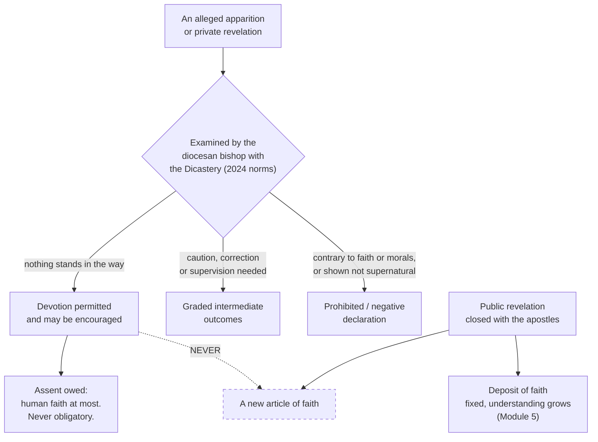

# Fundamental Theology · Lesson 1.4: Public and private revelation

> ⏱ ~15 min · Module 1: Revelation · Builds on: [1.3 Supernatural revelation](01-03-supernatural-revelation.md) · Unlocks: [2.1 The act of faith](02-01-the-act-of-faith.md)

## Why this matters

Sooner or later someone tells you that heaven has said something new — in a message from an apparition, in a mystic's diary, in a headline reading "Vatican approves apparition." You need to be able to say, without hesitating, three things: whether anything has been added to what a Catholic must believe (no), what the Church's approval actually asserted (much less than the headline suggests), and what you personally owe the message (less again). Getting this wrong in the credulous direction produces a private magisterium of visionaries; getting it wrong in the dismissive direction throws away a genuine and ancient part of Catholic life. This lesson is the course's first full exercise in its signature skill: saying exactly what an act of the Church does and does not settle.

## The idea

Two things are called "revelation," and they are not two degrees of the same thing.

**Public revelation** is God's self-communication in word and deed culminating in Christ — the thing [1.3](01-03-supernatural-revelation.md) described. It is addressed to the whole human race, it constitutes the *deposit of faith*, and the Church holds that it was completed in the apostolic age. It is the object of **divine and catholic faith**: believing it is what believing, in the theological sense, means.

**Private revelation** is a communication given to an individual — Bernadette at Lourdes, a mystic in her cell — which may be entirely genuine and may be of enormous spiritual value, but which stands outside the deposit. It is not addressed to the Church as something she must believe. Its function is pastoral: to help the faithful of some particular age live the faith they already have, more fully or more urgently.

| | Public revelation | Private revelation |
|---|---|---|
| Addressed to | the whole Church, all ages | an individual, usually for a particular time or place |
| Status | constitutes the deposit of faith | never enters the deposit |
| Closed? | yes, with the apostolic age | no — these continue |
| Assent owed | divine and catholic faith | human faith at most; never obligatory |
| Can it add a doctrine? | it *is* the doctrine | **never** |

The asymmetry in the last row is the whole lesson. Everything else follows from it.

## The argument

**The text.** Vatican II's *Dei Verbum* (1965) closes its first chapter by teaching that the Christian dispensation, as the new and definitive covenant, will never pass away, and that no new public revelation is to be awaited before the glorious manifestation of Christ (Dei Verbum 4; the Catechism restates it at CCC 66). The Catechism then addresses private revelations directly: some have been recognized by the Church's authority, but they do not belong to the deposit of faith, and their role is not to improve or complete Christ's definitive revelation but to help people live it more fully in a given period of history (CCC 67).

The scriptural anchor is the opening of Hebrews, in the Douay–Rheims:

> "God, who at sundry times and in divers manners, spoke in times past to the fathers by the prophets, last of all, In these days hath spoken to us by his Son."

The force is in *last of all*. The prophetic series was piecemeal and open; the Son is not one more instalment. Paul draws the practical consequence: "though we, or an angel from heaven, preach a gospel to you besides that which we have preached to you, let him be anathema" (Galatians 1:8) — an angel with a new gospel is ruled out in advance, which is precisely the case an apparition raises.

**The argument for closure**, in numbered form:

> **P1.** Revelation is God's self-communication, and it reaches its fullness in the Incarnate Son, who is not a message about God but God himself given (from [1.3](01-03-supernatural-revelation.md)).
> **P2.** What is full admits of no addition; there is nothing left over for God to communicate that he has not communicated in giving his Son.
> **P3.** That gift was entrusted to the apostles, who handed it on — so the deposit is fixed at the point where the apostolic generation ends.
> **∴ C.** Public revelation is closed with the death of the last apostle. Nothing after it can be a new article of faith.

In words: the reason revelation stopped is not that God ran out of things to say or lost interest. It is that he said everything when he said his Son. John of the Cross put it sharply in the *Ascent of Mount Carmel*: having given us his Son, God has, as it were, no more to say; someone who now demands a vision is asking for something already given, and asking badly.

**What closure does not deny.** Four things, all of which people mistake for denials of the doctrine:

1. **It does not deny growth in understanding.** The deposit is fixed; our grasp of it is not. *Dei Verbum* teaches that the understanding of what has been handed on grows in the Church — through contemplation, study, and the preaching of the bishops. That is the subject of Module 5, and the reason a dogma defined in 1854 or 1950 is not a nineteenth- or twentieth-century addition to the faith.
2. **It does not deny that God still acts and still speaks to individuals.** He does; that is exactly what private revelation is. Closure is about the *deposit*, not about God's silence.
3. **It does not deny new formulations.** New words for old truths — *homoousios*, transubstantiation — are not new revelation. Vincent of Lérins's test, taken up by *Dei Filius* (1870), is growth "in the same sense and the same meaning."
4. **It does not deny that the Church can define something never defined before.** Defining is recognizing what was there, not receiving something new.

The one thing it *does* deny is the modernist thesis that revelation was not complete with the apostles and continues to be constituted in the ongoing religious experience of the Church — a proposition the anti-modernist decree *Lamentabili Sane* (1907) condemned.

**What ecclesiastical approval of an apparition means.** This is where care pays. Approval, in the tradition's classic account — Prospero Lambertini, later Benedict XIV, in his great treatise on beatification and canonization — is essentially a *permission*: after examination, the Church judges that nothing in the alleged revelation is contrary to faith and morals, and that it may be published and proposed for the devotion of the faithful. The assent the faithful may then give is **human faith** — the ordinary assent one gives to credible human testimony, governed by prudence — not the divine faith owed to revelation.

Set out as two columns, because the temptation is always to slide from left to right:

| Approval **does** say | Approval **does not** say |
|---|---|
| nothing here contradicts faith or morals | that God must be believed to have spoken here |
| the phenomenon has been examined, not merely tolerated | that the alleged supernatural origin is guaranteed |
| the faithful may licitly venerate, make pilgrimage, adopt the devotion | that the faithful must accept the message |
| the associated devotion is judged spiritually wholesome | that any doctrine has been taught, added, or confirmed |

The fourth row is the one boss problem 1(c) turns on. An approved apparition can never be the *source* of a doctrine. If the message says something true about the faith, it is true because it was already revealed; the apparition adds urgency and occasion, not authority.

**The Dicastery's 2024 norms.** In May 2024 the Dicastery for the Doctrine of the Faith issued new norms for discerning alleged supernatural phenomena, replacing norms approved in 1978. Two features matter here, and I state only what the norms' general shape clearly involves:

- **The categories of judgement changed.** The older framework was built around whether the supernatural character of the event was established, not established, or established to be absent. The new norms move the ordinary outcome off that axis entirely: the normal positive result is a *Nihil obstat* — nothing stands in the way — which permits and encourages devotion **without** declaring that the phenomenon is of supernatural origin. A positive declaration of supernatural origin is not the ordinary course and is reserved to the pope. Between full permission and outright prohibition the norms provide a graded set of intermediate outcomes for cases that need correction, supervision, or caution.
- **Who judges.** The diocesan bishop investigates, but the Dicastery must concur before a determination is issued — the judgement is no longer effectively local.

Notice what did *not* change: none of these outcomes, old or new, makes a message binding in faith. The 2024 norms tighten and clarify the claim the Church makes; they do not raise it. If anything, the new framing makes the traditional doctrine legible on the face of the act: what the Church ordinarily does is authorize devotion, which is what she has ordinarily meant all along.

## Argument map

The dashed box is the one that never gets reached. Every other path is live.

## Worked examples

**Example 1 (mechanical — parsing an approval).** A diocese announces that an alleged apparition has been examined and that devotion at the site is permitted and encouraged. A pilgrim asks: "So the Church says Our Lady really appeared?"

Work it. The act is a permission attached to a judgement about content and fruits: nothing contrary to faith and morals, spiritually wholesome, proposable for devotion. Under the 2024 framework the ordinary positive judgement explicitly stops short of pronouncing on supernatural origin. So the honest answer is: the Church says nothing here will harm your faith and you may go; she has not certified the apparition as an act of God, and she has not asked you to believe it. **Level on the ladder:** the act is a disciplinary and pastoral judgement of the ordinary magisterium, not a definition of anything. Believing the apparition occurred is a matter of human faith — and a Catholic who quietly doubted it, while behaving reverently toward a devotion the Church has blessed, would be doing nothing wrong in faith.

Compare the sturdiest case available. Lourdes (1858) was recognized by the local bishop and has a Church-wide liturgical observance — about as strong as recognition gets. Even there, the proposition "Mary appeared at Lourdes" is not a dogma, and the Church has never asked for the assent of divine faith to it. If the strongest case doesn't reach that rung, nothing does.

**Example 2 (where it strains — a message with doctrinal content).** Suppose a recognized private revelation includes the statement that Christ is truly present in the Eucharist, and a devotee argues: the Church approved this apparition, so this message is now authoritative teaching.

The inference has a broken joint. Run it in two steps. *Is the proposition binding?* Yes — with the assent of divine faith. *Does it derive any of that from the apparition?* No. It was defined at Trent and belongs to the deposit; the apparition restates it. The logic runs from the deposit to the message, not the other way. That is the test to apply whenever an apparition's message sounds doctrinal: ask whether the claim stands on its own magisterial footing. If it does, the apparition is superfluous to its authority; if it does not, the apparition cannot supply the deficit. There is no third case. The genuine work private revelation does is elsewhere — making a truth already held press on a particular generation, which is a real service and not a small one.

## Watch out

- **You might think closure means God went quiet in the year 100.** It means the deposit is complete. Providence, grace, mystical experience, prophecy in the charismatic sense, and the Church's own growth in understanding all continue. Closure is a claim about the *content of faith*, not about divine activity.
- **You might think approval guarantees authenticity.** It does not, and the 2024 norms make this unusually visible: the ordinary positive outcome deliberately declines to pronounce on supernatural origin. Reading "approved" as "certified as a real apparition" is the classic overstatement.
- **You might think an approved message binds.** The most it can ask is human faith. A Catholic is free to be unpersuaded by any private revelation whatever, and no one has ever been required to accept one. (The corresponding excess in the other direction — treating a devotion the Church has blessed as fair game for contempt — is a failure of prudence and charity, but it is not a failure of faith. Keep the two categories separate.)
- **You might think "the Church has not approved it" means "the Church has condemned it."** Non-recognition is not condemnation, and a negative judgement about the phenomenon is a different act again from a judgement that something in it is contrary to faith. Three distinct outcomes, three distinct meanings.
- **Careful with "the Church has never changed anything."** Development is real and is Module 5's subject. Closure of revelation and immobility of formulation are different claims, and only the first is doctrine.

## One-liner

> The deposit closed with the apostles, so nothing later can be added to it — which is why an approved apparition earns your devotion at most, and never your faith.

## Problems

**P1 (🟢) *(Exegetical.)*** For each statement, say whether the closure of public revelation denies it, and in one sentence why.

(a) The Church's understanding of the deposit can deepen over the centuries.
(b) A twentieth-century mystic received a genuine communication from God.
(c) The Church could, in principle, define a dogma in the twenty-second century.
(d) Revelation is continually constituted anew in the religious experience of believers.

**P2 (🟡) *(Exegetical.)*** A diocese recognizes an apparition and permits public devotion at the site. Three claims are now made. For each, state the level of authority it carries, cite the kind of act that fixes that level, and say what assent is owed. 150 words or fewer.

(a) "The Blessed Virgin appeared at this place."
(b) "Nothing in the reported messages is contrary to faith or morals."
(c) "The messages call for prayer for the conversion of sinners — which is therefore now part of what Catholics must believe."

**P3 (🔴, optional) *(Exegetical (a) · Evaluative (b).)*** A newspaper headline reads: **"Vatican approves Marian apparition after 40-year inquiry."** The article's first line adds that "the Church has now confirmed that the visions were genuinely supernatural."

(a) Say precisely what a reader is entitled to conclude from an ordinary positive judgement under the current norms, and identify the specific overstatement in the article's first line. (b) A friend replies that this is pedantry: if approval never certifies authenticity and never binds anyone, then it says nothing at all, and the Church may as well not bother. In 150 words, assess the reply — any verdict, provided you state what the act positively accomplishes and what it withholds.

Solutions

**P1** *(Exegetical — strict.)*

**Must hit, strict:**
- (a) **Not denied.** The deposit is fixed, understanding of it grows — *Dei Verbum* teaches this explicitly, and it is Module 5's subject.
- (b) **Not denied.** That is private revelation, which continues; closure concerns what enters the deposit, not whether God communicates with individuals.
- (c) **Not denied.** Defining is recognizing what is already contained in the deposit, not adding to it; 1854 and 1950 are the standing examples.
- (d) **Denied.** This is the modernist thesis that revelation was not complete with the apostles, condemned in *Lamentabili Sane* (1907), and it is the precise claim closure excludes.

**Wrong turns:** answering (c) "denied" on the ground that a new dogma would be new revelation — it confuses the act of defining with the content defined; treating (b) as denied because private revelation "is revelation too," which is exactly the equivocation the lesson separates.

**Model answer:** (a) no; (b) no; (c) no; (d) yes — only (d) touches the deposit.

---

**P2** *(Exegetical — strict.)*

**Must hit, strict:**
- (a) **Not a doctrinal claim at any magisterial level.** It is a judgement about a historical event, and the recognizing act is a pastoral and disciplinary permission, not a definition. Assent owed: none in faith — human faith at most, governed by prudence. Under the current norms an ordinary positive judgement does not even assert supernatural origin.
- (b) **A judgement of the authentic ordinary magisterium on content** — negative in form (nothing contrary to faith and morals) and within the bishop's competence, with the Dicastery concurring. It merits the respect owed to an authentic pastoral judgement; it is not definitive and defines nothing.
- (c) **The inference is wrong.** Prayer for the conversion of sinners is already part of Christian life and binds on its own footing; the apparition adds no authority to it. Nothing becomes "part of what Catholics must believe" by appearing in a private revelation — that is the one thing approval can never do.

**Wrong turns:** assigning (a) any magisterial weight because a bishop issued it — the genre of the act is permission, not teaching; treating (b) as a positive endorsement of the messages' truth, when it is a clearance, not a certification; missing that (c) is a level error rather than a factual error about the message's content.

**Model answer:** (a) no doctrinal level; permission, not definition; human faith at most. (b) authentic ordinary magisterium, non-definitive; religious submission to the judgement as such. (c) false as an inference — the duty stands on the deposit, not on the apparition, and private revelation never adds to what must be believed.

---

**P3** *(a) exegetical — strict; (b) evaluative — any verdict.*

**Must hit, strict (a):** the reader may conclude that the phenomenon was examined; that nothing in it was found contrary to faith or morals; that devotion is permitted and may be encouraged. The reader may *not* conclude that the Church has certified the visions as supernatural in origin, nor that anyone is bound to accept the messages. The article's overstatement is "confirmed that the visions were genuinely supernatural" — an ordinary positive judgement under the 2024 norms is precisely a judgement that nothing stands in the way of devotion, and does not pronounce on supernatural origin; a declaration of supernatural origin is exceptional and reserved to the pope.

**Must hit, any verdict (b):** name what the act *does* accomplish — a public judgement that the content is safe, which protects the faithful from a live danger (messages that in fact contradict the faith, and there have been many); the licit organization of a cult, pilgrimage and liturgical life at a site; and a channel for episcopal oversight of something that would otherwise proceed unsupervised. Name what it *withholds* — any guarantee of authenticity and any obligation of faith. Either verdict on the friend's "says nothing at all" passes, provided both sides of that ledger are stated.

**Wrong turns:** treating (b) as settled by (a); arguing about whether some particular apparition is genuine, which is not what was asked; concluding that because approval does not bind, the Church's judgement is merely permissive in the sense of indifferent — a clearance of content is a substantive finding.

**Model answer (b), one of several:** The reply confuses "asserts less than you thought" with "asserts nothing." The act makes three real assertions: this has been examined, its content will not damage your faith, and you may build a devotional life on it. That is exactly what a pastor is for, and it is falsifiable — the Church has judged otherwise in plenty of cases. What it withholds is a guarantee of the event and a claim on your faith, and it withholds them because it has nothing to give there: the deposit is closed, and the Church cannot manufacture an article of faith out of a vision. Modesty about the supernatural claim is the price of honesty about the doctrinal one.

## Flashback

**F1 (🟡) *(Exegetical.)*** *Dei Filius* (Vatican I, 1870) teaches that God, the beginning and end of all things, can be known with certainty by the natural light of human reason from created things, and attaches a canon to it. For each of the following, say whether it follows from that teaching, and in one clause why.

(a) Anyone who reasons carefully will in fact come to know God.
(b) At least one philosophical argument for God's existence is sound.
(c) Someone who holds that human reason is in principle incapable of reaching God contradicts a defined teaching.
(d) Since reason can reach God, revelation about God is unnecessary.

Solution

**Must hit, strict:**
- (a) **Does not follow.** The definition is about reason's *capacity*, not about what people in their actual condition achieve — capacity is compatible with widespread failure.
- (b) **Does not follow** as a defined matter. The council defined that God can be known by the light of reason; it did not canonize any particular proof or oblige anyone to hold that some given argument succeeds.
- (c) **Follows.** That is the position the canon is aimed at; denying the capacity is denying what was defined.
- (d) **Does not follow**, and the same chapter says the opposite — revelation is morally necessary even for truths within reason's reach, so that they may be known by all, readily, with firm certitude and without error.

**Wrong turns:** collapsing "can be known" into "is proved," which is the whole trap; reading the moral necessity of revelation as a concession that reason cannot in fact reach God, which would contradict the canon.

## Connections

- **Backward:** [1.3](01-03-supernatural-revelation.md) established revelation as God's self-communication culminating in Christ; this lesson draws the boundary that fullness implies, and [1.2](01-02-natural-knowledge-of-god.md)'s capacity-versus-achievement distinction is the same discipline applied to reason.
- **Forward:** [2.1](02-01-the-act-of-faith.md) analyses the divine faith that only public revelation can ask for — the contrast with the human faith of this lesson is the cleanest way into it. [4.4](04-04-the-ladder-of-doctrinal-authority.md) and [4.5](04-05-reading-a-documents-weight.md) turn the level-reading done here into the course's general instrument, and Module 5 ([5.1](05-01-vincent-of-lerins.md), [5.2](05-02-newmans-theory-of-development.md)) takes up the growth in understanding that closure does not deny.
- **Sideways:** the Marian apparitions as devotional and institutional history, and the content of the Marian dogmas, belong to [`ecclesiology-and-mariology`](../../ecclesiology-and-mariology/syllabus.md); the modernist crisis as an event belongs to [`church-history`](../../church-history/syllabus.md); objections that Catholic devotional practice amounts to additions to the gospel are argued out in [`apologetics-catholic-claims`](../../apologetics-catholic-claims/syllabus.md).
