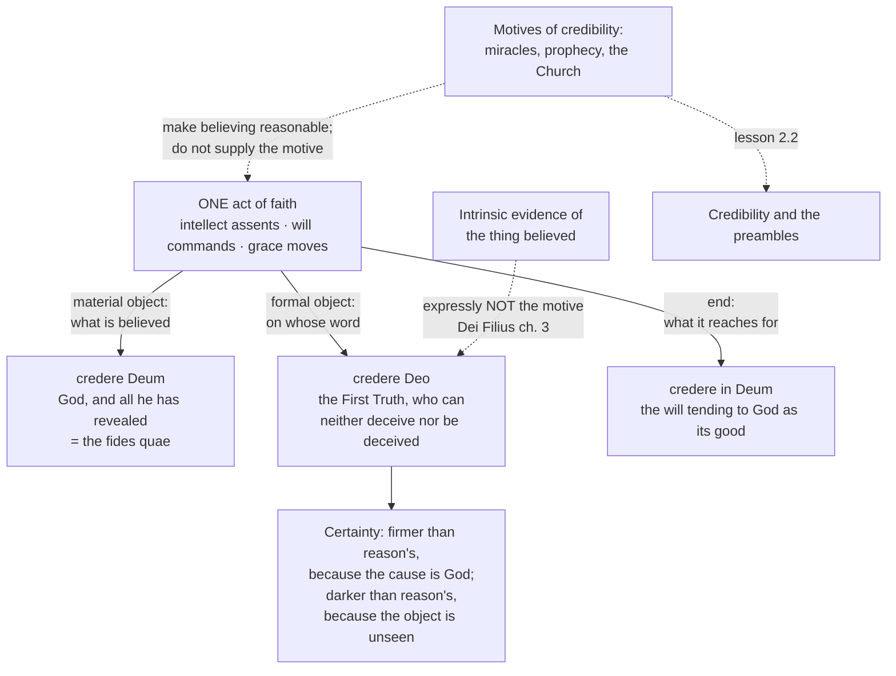

# Fundamental Theology · Lesson 2.1: The act of faith

> ⏱ ~15 min · Module 2: Faith and reason · Builds on: [1.4 Public and private revelation](01-04-public-and-private-revelation.md) · Unlocks: [2.2 Credibility and the preambles of faith](02-02-credibility-and-the-preambles-of-faith.md)

## Why this matters

Module 1 asked whether God has spoken. Suppose he has. What exactly is a person doing when they take him at his word? The answer decides everything downstream: whether faith is a well-supported hunch that better evidence could overturn, whether doubt is a failure of nerve, whether a person can be *asked* to believe at all. Get the analysis wrong in one direction and faith becomes a conclusion you reason your way into — in which case it is only as good as your last argument. Get it wrong in the other and it becomes a leap in the dark that no one can be blamed for refusing. The Catholic account runs between those, and it does so by being very precise about one thing: **why** the believer assents.

## The idea

Four questions, and the whole doctrine is their answers.

1. **Object** — *what* is believed? God, and everything he has revealed.
2. **Motive** — *why* is it believed? Because God, who can neither deceive nor be deceived, has said it. Not because the thing itself is evident.
3. **Certainty** — *how firmly*? More firmly than a conclusion you reasoned your way to — even though you cannot see the thing believed.
4. **Freedom** — *is it up to you*? Yes. The intellect is not compelled, so the assent is commanded by the will, which grace moves and which can refuse.

Points 2 and 3 are the ones that look wrong at first. If I cannot *see* the thing, how can I be *more* certain of it than of something I worked out myself? The answer is that certainty here is being measured on the side of the cause, not on the side of my grip on it. A fact learned from an infallible witness is more securely grounded than one I inferred myself, even though I understand my own inference better. Faith is the case where the witness is God.

Two Latin tags keep the discussion straight, and the distinction goes back to Augustine:

- ***fides qua*** — the faith **by which** one believes: the act, and the virtue that produces it.
- ***fides quae*** — the faith **which** is believed: the content, the articles, what the Creed lists.

This lesson is mostly about *fides qua*; Modules 3 and 4 are about how you find out what belongs to the *fides quae*.

## The argument

The doctrine in its defining text: the First Vatican Council's dogmatic constitution *Dei Filius* (1870), chapter 3, "Of Faith." Quoted in the translation printed in Philip Schaff's *Creeds of Christendom*.

> "Since man is wholly dependent on God, as upon his Creator and Lord, and created reason is absolutely subject to uncreated truth, we are bound to yield to God, by faith in his revelation, the full obedience of our intelligence and will."

*In words:* faith is not one more opinion I form; it is an act of submission owed to God, and it engages both the mind and the will.

> "And this faith, which is the beginning of human salvation, the Catholic Church professes to be a supernatural virtue, whereby, with the inspiration and help of God's grace, we believe those things which he has revealed to be true, not because of the intrinsic truth of the things viewed by the natural light of reason, but because of the authority of God himself who reveals them, and who can neither be deceived nor deceive."

*In words:* this is the definition. Faith is a **supernatural virtue** (not a natural skill; it is given). It works **by grace** (not by unaided effort). Its content is **what God has revealed**. And the clause everything turns on: the reason for assenting is **God's authority**, *not* the intrinsic truth of the things as reason can see it. Two believers can hold the same proposition; only the one holding it on God's word is exercising faith.

> "Further, all those things are to be believed with divine and Catholic faith which are contained in the Word of God written or handed down, and which the Church, either by a solemn judgment, or by her ordinary and universal magisterium, proposes for belief as having been divinely revealed."

*In words:* the object, specified. Not private impressions, and not everything any churchman says — what is contained in Scripture or Tradition *and* proposed as revealed, in either of two ways. This single sentence is the seed of the whole ladder in [4.2](04-02-infallibility-and-its-conditions.md) and [4.4](04-04-the-ladder-of-doctrinal-authority.md).

> "Wherefore, faith itself, even when it does not work by charity, is in itself a gift of God, and the act of faith is a work appertaining to salvation, by which man yields voluntary obedience to God himself, by assenting to and co-operating with his grace, which he is able to resist."

*In words:* freedom. "Voluntary," "co-operating," "able to resist" — the assent is a free act. Grace moves it; grace does not override it. Note also "even when it does not work by charity": faith can survive in someone whose life has gone badly wrong. It is then real faith, and dead — Aquinas calls it *lifeless* faith (ST II-II, q.4, a.4), and Trent, in its decree on justification, teaches that faith is not necessarily lost with charity.

The canons attached to the chapter fence this in from both sides. They condemn the claim that divine revelation cannot be made credible by outward signs and that one should be moved to faith by inner experience alone — that is fideism, and it is ruled out. And they condemn the claim that the assent of faith is not free but is necessarily produced by the arguments of human reason — that is rationalism, and it is ruled out too. Both errors get their own lesson in [2.3](02-03-fideism-and-rationalism.md).

**Aquinas's analysis of the act** (*Summa Theologiae* II-II, English Dominican Province translation). Aquinas takes Augustine's definition — to believe is "to think with assent" (q.2, a.1) — and locates faith between two neighbours. **Science** assents because the object is seen; **opinion** assents without firmness, still fearing the opposite. Faith has the *firmness* of science and the *unseenness* of opinion. Because what is believed is not seen, the intellect is not compelled by its object, so something else must settle it. That something is the will:

> "To believe is an act of the intellect assenting to the Divine truth at the command of the will moved by the grace of God." (q.2, a.9)

*In words:* the intellect does the assenting, the will does the commanding, and grace does the moving. Three agents, one act — and this is why faith can be meritorious, and why unbelief can be culpable: a free act is the kind of thing that can be praised or blamed.

**The three relations** (q.2, a.2). Aquinas notices that Latin lets you say "believe" three ways, and that each picks out a different aspect of the same single act:

| Formula | Picks out | The act, described that way |
|---|---|---|
| *credere Deum* — "to believe a God" | the **material object** — what is believed | God, and everything believed because it is referred to him |
| *credere Deo* — "to believe God" | the **formal object**, the motive — on whose word | the First Truth, to which one adheres and for whose sake one assents to whatever one believes |
| *credere in Deum* — "to believe in God" | the **end** — what it moves toward | the will tending toward God as its good |

*In words:* one act, three angles. *Credere Deo* is the load-bearing one: it names the **motive**, and it is the same thing *Dei Filius* means by "the authority of God himself who reveals." *Credere in Deum* is the act as perfected by charity, reaching for God rather than merely registering that he spoke.

**Certainty** (q.4, a.8). Aquinas asks whether faith is more certain than the intellectual virtues and answers by splitting the question: on the part of its **cause**, faith is more certain, since its cause is divine truth while theirs is human reason; on the part of the **subject**, it is less certain, since its matters are above the human intellect. *In words:* the ground is firmer, the grip is looser. That is not a fudge — it is exactly why a believer with rock-solid faith can also feel darkness, and why feeling certain is not the same thing as the certainty the doctrine is talking about.

## Argument map

The two dashed lines are the lesson. Evidence of the thing itself is *excluded* as the motive; credibility is *admitted*, but it does a different job — it shows that believing is not reckless, without being the reason one believes. Untangling those two is [2.2](02-02-credibility-and-the-preambles-of-faith.md).

## Worked examples

**Example 1 (mechanical — running the analysis on a clean case).** A Catholic says: "I believe that God is three persons in one divine nature."

- **Object.** A truth about God's inner life, proposed as revealed and defined by the early councils. *Credere Deum*: it is believed because it is referred to God.
- **Motive.** Not "because the arithmetic of persons and natures works out." Nobody has an argument from natural reason that establishes it, and *Dei Filius* would exclude that as the motive even if somebody did. It is believed because God revealed it — *credere Deo*.
- **Certainty.** Greater than the speaker's certainty about any conclusion she has personally reasoned out, because the ground is God's truthfulness. And yet she cannot see how it is so. Firmer ground, dimmer view.
- **Freedom.** Nothing in the proposition compels her intellect. Her assent is commanded by her will, moved by grace, and she could withhold it — which is why it is an act she can be responsible for.

Notice what the analysis is *not* doing: at no point did it argue for the doctrine. The four heads describe the structure of the believing, not the case for what is believed.

**Example 2 (a hard case — where the analysis strains).** Take instead: "God exists." Vatican I teaches that this can be known with certainty by the natural light of reason from created things ([1.2](01-02-natural-knowledge-of-god.md)). It is also revealed, and Christians believe it. So is believing it an act of faith or a piece of natural knowledge?

Aquinas's answer is sharp and uncomfortable: **one and the same person cannot, at the same time, see a thing and believe it** (ST II-II, q.1, a.5). Assent moved by a proof you actually possess is not assent moved by God's authority; the motives are different, so the acts are different. What follows:

- A person who holds a sound demonstration is, in that respect, *knowing*, not believing.
- The same truth may be *believed* by someone else who has no such proof — most people, most of the time. Aquinas grants this explicitly when he says that what can in itself be demonstrated may be accepted as a matter of faith by someone who cannot grasp the proof (ST I, q.2, a.2 ad 1).
- Truths of this overlapping kind get a name — the **preambles** of faith. They sit at the seam between the two orders.

The strain is real, and the tradition knows it: exactly *how* the same person's rational grounds and graced assent fit together is the disputed "analysis of faith," and it is the subject of [2.2](02-02-credibility-and-the-preambles-of-faith.md). What matters here is that the strain shows up only because the motive, not the content, is what individuates the act.

## Watch out

- **You might think faith is a conclusion with a low confidence score.** Then its motive would be the evidence for the thing, and *Dei Filius* rules exactly that out, by name. A faith held that way would be revisable by the next argument — which is what the council's language about God's authority is designed to exclude.
- **You might think certainty means feeling sure.** Aquinas's split is the antidote: firmer *in its cause*, weaker *in the subject*. Spiritual dryness, difficulty and unresolved questions are compatible with the certainty being claimed. The doctrine is about what the assent rests on, not about the believer's mood.
- **You might think freedom of assent means faith is arbitrary.** Free does not mean groundless. The very same chapter that calls the assent voluntary insists that God joined exterior proofs to the interior help of the Spirit, precisely so that the obedience of faith would be in harmony with reason.
- **Don't overstate what is defined.** *Dei Filius* chapter 3 and its canons carry the highest level: divinely revealed, proposed as such. The *scholastic analysis* — the three relations, the will commanding the intellect, the cause-versus-subject account of certainty — is Aquinas's, and it is common teaching in the tradition, not a magisterial act. Reporting Aquinas's apparatus as though the Church had defined it is the characteristic error of this lesson.
- **Don't collapse *credere in Deum* into sincerity.** It names the will's movement toward God as an end, not warmth of feeling — and *Dei Filius* is explicit that faith is still faith even when charity is gone.

## One-liner

> Faith is the intellect assenting, at the will's command and under grace, to what God has revealed — and it assents because God said it, not because it can see that it is so.

## Problems

**P1 (🟢) *(Exegetical.)*** For each sentence, say which of *credere Deum*, *credere Deo*, or *credere in Deum* it most directly expresses, and say why in one clause. Then say which of the three carries the **motive** of faith.

(a) "I hold the resurrection to be a fact because the God who cannot lie has testified to it."
(b) "What I believe is God, and whatever is bound up with him."
(c) "My believing is a reaching out to him, not a filing away of facts."

**P2 (🟡) *(Exegetical.)*** Assign each claim its level on the ladder, name the act or source that fixes it, and say what assent is owed. 150 words or fewer.

(a) The motive of faith is the authority of God revealing, not the intrinsic truth of the things believed as reason sees it.
(b) The act of faith is one act bearing three relations to its object, named *credere Deum*, *credere Deo* and *credere in Deum*.
(c) The assent of faith is free.
(d) How the believer assents to God's authority without reasoning in a circle.

**P3 (🔴, optional) *(Exegetical (a) · Evaluative (b).)*** An invented paragraph from a discussion board:

> "I came to faith by weighing the evidence. The historical case for the resurrection convinced me it happened, so I believe it. If the evidence turned against it tomorrow, I'd turn with it. Anything else is dishonesty dressed up as devotion."

(a) Using *Dei Filius* chapter 3, say which head of the analysis this misplaces, and quote or paraphrase the clause of the chapter that rules it out. One or two sentences. (b) The writer replies that Vatican I itself demands exterior proofs of revelation, so his position is the council's own. In 150 words, assess the reply — any verdict, provided you distinguish the motive of faith from the grounds of credibility and say what the exterior proofs are actually for.

Solutions

**P1** *(Exegetical — strict.)*

**Must hit, strict:**
- (a) *credere Deo* — "to believe God." The clause "because the God who cannot lie has testified" gives the formal object: assent on the testimony of the First Truth.
- (b) *credere Deum* — "to believe a God." It names the material object, what is believed: God and what is referred to him.
- (c) *credere in Deum* — "to believe in God." It names the end: the will tending toward God as its good.
- The **motive** is carried by *credere Deo*, and by that alone. It is the same thing *Dei Filius* calls "the authority of God himself who reveals."

**Wrong turns:** picking *credere in Deum* as the motive because it sounds the most personal — it names the end, not the reason for assenting; treating the three as three different acts, when Aquinas is explicit that they are one act under three relations (ST II-II, q.2, a.2).

**Model answer:** (a) *credere Deo*, testimony; (b) *credere Deum*, content; (c) *credere in Deum*, end. The motive is *credere Deo*.

---

**P2** *(Exegetical — strict. This is the lesson's level-of-authority problem; overstating any level is an error.)*

**Must hit, strict:**
- (a) **Divinely revealed and proposed as such** — defined by *Dei Filius* ch. 3 (Vatican I, 1870), with the canons on faith attached to it. Assent owed: theological faith; obstinate denial would be heresy.
- (b) **Not a magisterial teaching at all.** It is Aquinas's analysis (ST II-II, q.2, a.2), taken up as common scholastic teaching — at most the fourth rung, "theologically certain / common teaching." Assent owed: the respect due a strong theological consensus, no more. A Catholic may analyse the act with different apparatus.
- (c) **Divinely revealed and proposed as such** — *Dei Filius* ch. 3 calls the assent voluntary and resistible, and a canon on faith condemns the contrary claim that the assent is necessitated by rational argument. Assent owed: theological faith.
- (d) **Freely disputed among Catholics.** This is the "analysis of faith," open between the schools ([2.2](02-02-credibility-and-the-preambles-of-faith.md)). Assent owed: none beyond the strength of the argument; taking a side is all that denial amounts to.

**Wrong turns:** promoting (b) to defined doctrine because it appears in every manual and is used by magisterial documents — being *used* is not being *defined*; demoting (c) to a theological opinion because freedom of assent sounds like a philosophical thesis rather than a revealed one.

**Model answer:** (a) and (c) are *de fide*, fixed by *Dei Filius* ch. 3 and its canons, and owed theological faith. (b) is Aquinas's, common teaching at most, owed only the deference due a consensus. (d) is freely disputed and owes nothing beyond the evidence.

---

**P3** *(a) exegetical — strict; (b) evaluative — any verdict.*

**Must hit, strict (a):** it misplaces the **motive**. The writer's reason for assenting is the intrinsic evidence of the thing, which chapter 3 excludes in so many words: we believe "not because of the intrinsic truth of the things viewed by the natural light of reason, but because of the authority of God himself who reveals them." The third sentence makes it unmistakable — an assent that tracks the evidence is an assent whose motive *is* the evidence.

**Must hit, any verdict (b):**
- State the distinction precisely: the **motive** (why one assents — God's authority) is not the **grounds of credibility** (what shows that believing is a reasonable thing to do). The chapter affirms both; it assigns them different offices.
- Say what the exterior proofs are for: chapter 3 has God join them to the interior help of the Spirit so that the obedience of faith should be in harmony with reason — they establish the *credibility* of the revelation, not the truth of each revealed mystery, and a mystery believed on God's word is not thereby made evident.
- Concede what the writer gets right: the council is on his side against fideism; wanting reasons is not a vice, and the canons condemn those who say revelation cannot be made credible by outward signs.

**Wrong turns:** dismissing the writer as a rationalist without engaging his correct point that the council demands proofs; or conceding his whole position on the strength of that point, which drops the "not because of the intrinsic truth of the things" clause entirely. Arguing the historical case for the resurrection — not what was asked.

**Model answer (b), one of several:** The reply is half right, and the half it misses is decisive. Vatican I does demand exterior proofs, and it condemns those who would move people to faith by inner experience alone. But it gives the proofs a specific office: to make the revelation *credible*, so that the obedience of faith is in harmony with reason. They show that believing God here is not reckless. They are not what the believer believes *on*. Chapter 3 says so in one clause — not the intrinsic truth of the things, but the authority of God who reveals. So the writer's first sentence is unobjectionable and his third is not: an assent held hostage to the evidential balance has the evidence as its motive, and is therefore, on this analysis, something other than the act of faith — however honest, and however well-evidenced.

## Flashback

**F (🟡) *(Exegetical.)*** From [1.3 Supernatural revelation](01-03-supernatural-revelation.md): revelation is God's self-communication, given in deeds and words together, and not merely the handing over of a list of true sentences. Yet today's lesson says what is believed with divine faith has definite content — the *fides quae*, specified by *Dei Filius* as what is contained in Scripture or Tradition and proposed as revealed.

In 100 words or fewer: explain why those two are not in competition, and name one thing that is lost if revelation is treated as *only* a set of propositions, and one thing lost if it is treated as *only* a personal encounter carrying no content.

Solution

**F** *(Exegetical — strict on the two losses; the reconciliation can be phrased several ways.)*

**Must hit, strict:**
- The reconciliation: God communicates *himself*, and does so through events and through words that interpret them; propositions are how that self-communication becomes something a community can hold, hand on and be wrong about. Content is the form the encounter takes for creatures who know by judging, not a rival to it.
- **Lost if propositions only:** the personal term — what is reached is a set of truths rather than God himself. Today's lesson names the casualty precisely: *credere in Deum*, the will's movement toward God as its end, has nothing to move toward.
- **Lost if encounter only:** anything to be handed on, tested, or defined — no *fides quae*, so nothing the Church could propose for belief, and nothing a creed could state. It also removes what God's authority would be authority *for*.

**Wrong turns:** treating the two as a choice to be made, when the tradition holds both; describing the encounter-only view as simply modern error rather than saying what it fails to preserve.

**Model answer:** They are not rivals because God gives himself in deeds and words at once: the deeds without the interpreting word are mute, and the word without the deeds is an abstraction. Propositions are how a self-communication gets held and handed on. Propositions only: faith terminates in statements rather than in God, and *credere in Deum* loses its object. Encounter only: nothing can be handed on or proposed for belief, so there is no *fides quae*, and God's authority has nothing definite to vouch for.

## Connections

- **Backward:** Module 1 established that God has spoken and how public revelation closes; [1.4](01-04-public-and-private-revelation.md) fixed what counts as the deposit, and *Dei Filius*'s clause about what is "contained in the Word of God written or handed down" is that same deposit seen from the believer's side.
- **Forward:** [2.2](02-02-credibility-and-the-preambles-of-faith.md) takes the two dashed lines of the argument map — credibility and the preambles — and shows how faith is reasonable without being demonstrated; [2.3](02-03-fideism-and-rationalism.md) works out the two errors the canons of chapter 3 were written against.
- **Sideways:** the sentence on what must be believed "either by a solemn judgment, or by her ordinary and universal magisterium" is the root of [4.2](04-02-infallibility-and-its-conditions.md) and the first rung of the ladder in [4.4](04-04-the-ladder-of-doctrinal-authority.md). Whether "God exists" can be *proved* is not asked here and belongs to [`philosophy-of-religion`](../../philosophy-of-religion/syllabus.md); Aquinas's account of the virtues and of the will commanding the intellect is developed in [`thomistic-synthesis`](../../thomistic-synthesis/syllabus.md).
