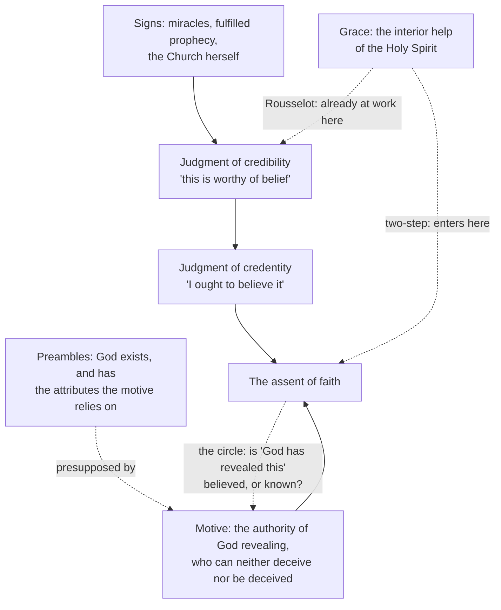

# Fundamental Theology · Lesson 2.2: Credibility and the preambles of faith

> ⏱ ~15 min · Module 2: Faith and reason · Builds on: [2.1 The act of faith](02-01-the-act-of-faith.md) · Unlocks: [2.3 Fideism and rationalism](02-03-fideism-and-rationalism.md)

## Why this matters

[2.1](02-01-the-act-of-faith.md) left a hard edge. Faith assents on the authority of God revealing, *not* because the thing believed is evident — and its certainty outruns any argument the believer could give. So what stops it from being a leap in the dark? The Catholic answer turns on a distinction almost no public argument about religion bothers to make: you can have excellent evidence about the **messenger** while having none at all about the **message**. Get that distinction and two slogans collapse at once — "faith is belief without evidence," and the pious "just believe, don't ask." Both assume that the only evidence that could matter is evidence of the thing believed.

## The idea

Two questions that sound like one:

1. **Is this doctrine evident?** Take the Trinity. No — and if it were, you would know it rather than believe it. Faith by definition lacks *intrinsic* evidence, evidence of the thing itself.
2. **Is it reasonable to accept it on the word of the one who says it?** That is a different question, with evidence of its own: evidence that God has spoken here.

Ordinary testimony has the same shape. Your doctor tells you what your blood panel shows. You cannot see it, cannot check the assay, and would not know what to look at. Your grounds are not biochemical; they are credentials — training, track record, the fact that she has no reason to lie. You believe the claim on the strength of the witness. Faith is that structure with the witness being God, which is why the tradition treats the credentials question as the serious one.

Two pieces of vocabulary carry the whole lesson. The credentials are the **motives of credibility**. The truths reason can reach that faith leans on without containing are the **preambles of faith** (*praeambula fidei*).

## Source

Vatican I, *Dei Filius* (1870), chapter 3, in the public-domain translation printed in Schaff's *Creeds of Christendom*:

> "Nevertheless, in order that the obedience of our faith might be in harmony with reason, God willed that to the interior help of the Holy Spirit there should be joined exterior proofs of his revelation; to wit, divine facts, and especially miracles and prophecies, which, as they manifestly display the omnipotence and infinite knowledge of God, are most certain proofs of his divine revelation, adapted to the intelligence of all men."

> "The Church by itself, with its marvelous extension, its eminent holiness, and its inexhaustible fruitfulness in every good thing, with its Catholic unity and its invincible stability, is a great and perpetual motive of credibility, and an irrefutable witness of its own divine mission."

The same chapter adds that "the assent of faith is by no means a blind action of the mind," while insisting that "no man can assent to the Gospel teaching, as is necessary to obtain salvation, without the illumination and inspiration of the Holy Spirit." Hold both halves; the disputed question below is about how they fit.

And Aquinas, *Summa Theologiae* I, q.2, a.2, ad 1 (English Dominican Province translation):

> "The existence of God and other like truths about God, which can be known by natural reason, are not articles of faith, but are preambles to the articles; for faith presupposes natural knowledge, even as grace presupposes nature, and perfection supposes something that can be perfected. Nevertheless, there is nothing to prevent a man, who cannot grasp a proof, accepting, as a matter of faith, something which in itself is capable of being scientifically known and demonstrated."

## The argument

**(1) Credibility is not evidence of the thing believed.** The motives of credibility bear on *whether God has spoken*. They never make a mystery evident. In words: the signs point at the messenger and say *trust him*; they do not show you what he is telling you. So the believer's position is not "I have proof of the Trinity" but "I have reason to think the one who tells me this is who he says he is, and he cannot deceive."

**(2) The signs are real signs, and reason can read them.** Chapter 3 names three kinds: miracles, fulfilled prophecy, and the Church herself. The canons attached to the chapter put teeth in it — the third anathematizes holding that divine revelation cannot be made credible by exterior signs, and that men should be moved to faith by private interior experience alone; the fourth, holding that miracles are impossible or that the divine origin of the Christian religion cannot rightly be proved by them.

*Level:* this is the strongest genre there is — a dogmatic constitution of an ecumenical council, with anathemas. But read the modal verbs, exactly as in [1.2](01-02-natural-knowledge-of-god.md). What is defined is that revelation **can** be made credible by exterior signs, and that miracles **can** rightly prove. Nothing here canonizes a particular apologetic argument, and nothing here says the signs compel — a further canon of the same chapter defends the *freedom* of the assent, which cuts the other way.

**(3) The preambles are presupposed, not believed.** "Not articles of faith, but preambles to the articles." The list varies by author; its core is God's existence and the attributes that make his word worth anything — above all that he knows all things and can neither deceive nor be deceived, which is the very hinge the motive of faith turns on. Many authors add the possibility of revelation and of miracles, and the recognizability of the fact of revelation; there is no defined list.

Two misreadings die on Aquinas's second sentence. A preamble is **logically** prior, not **biographically** prior: no one has to finish a philosophy course before being allowed to believe, and the man who cannot follow a proof may hold the very same truth by faith. And a preamble is not a lesser article — it is a different job. Faith presupposes it the way grace presupposes nature.

**The manuals' two steps.** The scholastic treatises set the machinery out as a sequence: from the signs, reason reaches the *judgment of credibility* ("this is worthy of belief"), then the *judgment of credentity* ("I ought to believe it"), and then the will, moved by grace, commands the assent, which rests on God's authority alone.

**The disputed question: the analysis of faith.** Here is the knot the whole scheme has to untie.

> **P1.** I assent to *p* because God has revealed *p*.
> **P2.** So my assent requires that "God has revealed *p*" be secured somehow.
> **P3.** If I hold *that* by faith, its motive is God's authority revealing — the very thing being secured. Circle.
> **P4.** If I hold it by reason alone, my faith is only as firm as a piece of human argument.
> **∴ C.** Either faith is circular or it is not certain in the way [2.1](02-01-the-act-of-faith.md) says it is.

Nobody in the tradition accepts the conclusion; the schools differ over which premise to break. Two resolutions, at full strength:

| | **Two-step (neo-scholastic Thomist)** | **"Eyes of faith" (Rousselot)** |
|---|---|---|
| Source | the manuals; Ambroise Gardeil, *La crédibilité et l'apologétique* (1908) | Pierre Rousselot, "Les yeux de la foi," *Recherches de science religieuse* (1910) |
| Move | P3 fails: the credibility judgment is a *condition* of faith, reached by reason, not an act of faith — so no circle | P2's "somehow" is wrong: the light of grace is not applied after the signs are read, it is what makes them legible; sign and assent are one act |
| Where grace enters | moving the will to command the assent, and giving the assent a firmness the argument did not supply | in the perception itself — like seeing why a proof works, or recognizing a face, rather than inferring it |
| Certainty's surplus | from the light of faith, not from the strength of the motives | there is no surplus to explain; the act was never an inference with a measurable strength |
| Strongest objection | if the credibility judgment is at best morally certain and the assent is unconditional, calling the gap "grace" names the problem rather than solving it — and few believers have ever run this apparatus | if the signs are only legible under grace, in what sense are they "adapted to the intelligence of all men," and what is apologetics doing? The unbeliever's failure to see becomes unfalsifiable |

Rousselot's essay was attacked hard on publication — by Stéphane Harent and Hippolyte Ligeard among others — and defended by him in reply. It was never condemned and never adopted.

*Level: freely disputed.* The Magisterium has fixed the **data** any analysis must save — faith is supernatural, free and certain; the exterior signs are real and knowable; the assent is not blind. It has not adjudicated the **analysis**. A third route, Newman's *Grammar of Assent* (1870), is worth knowing: converging probabilities, none demonstrative, can yield unconditional assent through what he calls the illative sense — an account of how ordinary certitude works that both camps have raided.

## Argument map

Everything undisputed is a solid arrow. The dispute is entirely about where the grace box attaches, and whether the dashed loop at the bottom is a vicious circle or an artifact of chopping one act into two.

## Worked examples

**Example 1 (clean case — sorting a claim into the right box).** A student says: *"I believe in the Resurrection because the historical evidence for the empty tomb is strong."*

Diagnose. He has stated a motive of credibility and called it the motive of faith. On the Catholic account the historical evidence bears on whether God has spoken here; the motive of the assent is God's authority. Three consequences follow immediately. First, his sentence is a perfectly good answer to *"why is it reasonable for you to believe?"* and a wrong answer to *"on whose word do you believe?"* — so this is a confusion, not an error of fact. Second, if a historian tomorrow weakened the empty-tomb argument, faith would not thereby be refuted, since it never rested there — though credibility would be dented, and he would owe himself an accounting. Third, and most usefully: if his certainty really is faith's certainty, it exceeds what the historical argument licenses, and that surplus is exactly what the disputed question is about. He has walked into the analysis of faith without noticing.

**Example 2 (hard case — where the Church-as-sign strains).** Vatican I's second passage is the interesting one, because it is a sign made of history, and history is public.

It strains in two directions. *Against:* the sign is read off the Church's holiness, unity, extension, fruitfulness and endurance — and any honest reader of church history can produce counter-instances by the volume. The traditional reply is that the sign is the persistence of those properties across twenty centuries *and through* her members' failures, not the moral record of any one generation: a claim about a whole rather than an episode, which makes it slower and weaker evidence than a miracle, and correspondingly harder to fake or to stage. *For rigour:* this is a cumulative case of precisely the kind [`philosophical-method`](../../philosophical-method/syllabus.md) 2.4 formalizes — several items of modest individual weight, where the live question is whether they are independent of one another, and where the counter-instances enter as evidence on the other side rather than as mood.

Now the discipline this course is for. The council teaches that the Church **is** a great and perpetual motive of credibility. It does not legislate how strong the inference comes out for a given inquirer, it does not rank the three kinds of sign, and it does not settle whether the counter-instances defeat the case. Whether the argument actually works is [`philosophy-of-religion`](../../philosophy-of-religion/syllabus.md)'s question, and arguing it out against objectors is [`apologetics-catholic-claims`](../../apologetics-catholic-claims/syllabus.md)'s. Seeing the shape of the claim, and refusing to read more into the text than is there, is ours.

## Watch out

- **You might think the two slogans are opposites.** "Faith is belief without evidence" and "faith has plenty of evidence" make the same mistake — that only evidence of the thing believed counts. State it precisely: faith lacks intrinsic evidence of what is believed and claims extrinsic evidence that it is revealed.
- **Don't inflate what the canons define.** They define that revelation *can* be made credible by exterior signs, and that miracles *can* rightly prove. They do not certify any particular apologetic argument, and they do not make the signs coercive.
- **Preambles are not an entrance exam.** Logical priority, not biographical. Aquinas's own sentence permits the man who cannot grasp the proof to hold the same truth by faith.
- **The technical category is narrower than "whatever brought me here."** The beauty of a liturgy or a grandmother's patience can be an occasion or a disposition; the motives of credibility in the strict sense are the public signs the chapter names. Both can be real without being the same thing.
- **The Rousselot debate is not orthodoxy versus laxity.** Both camps defend both data points — faith is supernatural, and faith is reasonable. Treating either side as the Church's teaching is the exegetical error here.

## One-liner

> Faith never sees the thing it believes; what it can see are the messenger's credentials — and the open question is whether reason reads those credentials first and grace assents after, or grace is what lets them be read at all.

## Problems

**P1 (🟢) *(Exegetical.)*** For each statement, say whether it concerns (i) the **motive of faith**, (ii) a **motive of credibility**, or (iii) a **preamble of faith**, with one clause of justification. One sentence each.

(a) "God can neither deceive nor be deceived."
(b) "The Church's unity of doctrine across twenty centuries witnesses to her divine mission."
(c) "I hold the Assumption to be true because God, who revealed it, is truthful."
(d) "God exists and is the creator of all things."
(e) "The prophets foretold what only God could have known."

**P2 (🟡) *(Exegetical (a)–(b) · Evaluative (c).)*** Work from the *Dei Filius* passages quoted above.

(a) State in one sentence of the form "X **can** …" what the chapter and its canons actually define about the exterior signs, then name two stronger claims a careless reader takes away that are *not* defined.
(b) The claim "the Church herself is a great and perpetual motive of credibility" — what act fixes its weight, and what is the difference between where it appears and where the anathemas are? (Recall the chapter-versus-canon distinction from [1.1](01-01-what-fundamental-theology-asks.md).)
(c) A critic objects that the Church-as-sign argument is circular: you must already trust the Church to read her history as holy rather than as ordinary. In 150 words or fewer, assess it — any verdict passes — saying what the argument needs from the historical record and whether that requirement can be stated in terms an outsider could check.

**P3 (🔴, optional) *(Exegetical (a) · Evaluative (b).)***

(a) State the circularity problem in the analysis of faith in three sentences: the assent, what it requires, and the fork.
(b) Pick either the two-step account or Rousselot's. In 150 words or fewer, present it accurately and then give the strongest objection **to the one you picked** — not to the other. Close with one sentence naming the level of authority this question carries and what that means for how the argument had to be conducted.

Solutions

**P1** *(Exegetical — strict.)*

**Must hit, strict:**
- (a) **Preamble** — a divine attribute reason can establish. Credit also for noting that it is the specific attribute the motive of faith leans on; the point of the preambles is precisely that they hold up the motive without being part of what is believed.
- (b) **Motive of credibility** — the Church herself, the third sign named in chapter 3.
- (c) **Motive of faith** — the formal motive, the authority of God revealing.
- (d) **Preamble** — Aquinas's own example in ST I, q.2, a.2, ad 1, and the truth Vatican I says reason can reach ([1.2](01-02-natural-knowledge-of-god.md)).
- (e) **Motive of credibility** — prophecy, named in the chapter alongside miracles.

**Wrong turns:** calling (b) or (e) the motive of faith because they are the reasons a believer would *give* — a reason for credibility is not the motive of the assent; calling (c) a motive of credibility because it names a doctrine; calling (d) an article of faith, when Aquinas explicitly calls it a preamble — though the same sentence allows someone who cannot follow the proof to hold it by faith, which is a nuance, not a correction.

**Model answer:** (a) preamble, and the one the motive depends on; (b) motive of credibility; (c) motive of faith; (d) preamble; (e) motive of credibility.

---

**P2** *(a)–(b) exegetical — strict; (c) evaluative — any verdict.*

**Must hit, strict (a):** the defined content is a capacity — divine revelation **can** be made credible by exterior signs, and miracles are possible and **can** rightly prove the divine origin of the Christian religion. Two of the following count as the undefined stronger claims: that some particular apologetic argument is sound; that the signs compel assent, or that anyone who examines them must believe (the freedom of the assent is defended in the same chapter's canons); that any given reported miracle has in fact been established; that the three kinds of sign rank in some order.

**Must hit, strict (b):** the act is *Dei Filius*, a dogmatic constitution of an ecumenical council (Vatican I, 1870) — the heaviest genre. The sentence about the Church stands in the **chapter**, which teaches; the **canons** are where the anathemas attach and where the defined core is most sharply drawn. So: conciliar teaching of the highest genre, with the strictly defined kernel in the canons on exterior signs and miracles. An answer that flattens the chapter and the canons into one thing, or that downgrades this to a theological opinion or "what the Catechism says," is wrong.

**Must hit, any verdict (c):** state the circle precisely — which properties are being read (holiness, unity, extension, fruitfulness, stability) and by whose standard; then say what the argument requires from the record and whether an outsider could check it (public, datable features: continuity of doctrine, geographical spread, endurance, holiness recognizable by standards the outsider already holds). Name the counter-instances as evidence on the other side rather than as atmosphere. Either verdict passes.

**Wrong turns:** deciding whether the argument *succeeds* and treating that as the exegetical answer — that question is [`philosophy-of-religion`](../../philosophy-of-religion/syllabus.md)'s; treating the council as having defined that the inference works for every inquirer; assuming a cumulative case is automatically weak, without asking about independence ([`philosophical-method`](../../philosophical-method/syllabus.md) 2.4).

**Model answer (c), one of several:** The objection has a real target but overshoots. The argument needs the properties to be legible under descriptions an outsider already accepts — that a body has held the same creed across twenty centuries, that it spread without a state to carry it at first, that it has kept producing people whom even its critics call holy. Those are checkable, and the critic can contest them on the record; that is what makes this a sign rather than a mood. Circularity would bite only if the properties had to be described in already-theological terms. What the objection does establish is that the *weighing* is not neutral: how much a long, imperfect endurance counts for depends on priors, and the items are not obviously independent of each other.

---

**P3** *(a) exegetical — strict; (b) evaluative — any verdict.*

**Must hit, strict (a):** (i) the assent of faith rests on the authority of God revealing; (ii) it therefore requires that "God has revealed this" be secured; (iii) the fork — secure it by faith and the motive is invoked to establish the condition of its own use, which is circular; secure it by reason alone and faith's firmness is capped by the strength of an argument, which contradicts the certainty claimed for it.

**Must hit, any verdict (b):**
- Present the chosen account accurately: the two-step, that the credibility judgment is a rational *condition* rather than an act of faith, grace moving the will and giving the assent its firmness; Rousselot's, that grace is what makes the signs legible, so that perceiving the sign and assenting are one act rather than two inferential steps.
- Give the strongest objection **to that same account**: against the two-step, the gap between a morally certain judgment and an unconditional assent, with "grace" naming the gap rather than closing it, plus the phenomenological complaint that almost no believer has ever run the sequence; against Rousselot, that signs legible only under grace sit badly with "adapted to the intelligence of all men," that apologetics loses its addressee, and that the unbeliever's failure to see becomes unfalsifiable.
- Name the level: **freely disputed**. The Magisterium fixed the data — faith is supernatural, free and certain, and the exterior signs are real, knowable and not coercive — and left the analysis open. So the argument has to be made on its merits; a citation cannot settle it, and neither school may be presented as the Church's teaching.

**Wrong turns:** citing *Dei Filius* as though it decided between the schools; treating Rousselot as condemned, or as the modern Catholic position; aiming the objection at the account you did not choose (the commonest way to dodge this problem); calling the question "freely disputed" and then arguing as if only one side were permitted.

**Model answer (b), one of several:** Rousselot's. The manuals treat grace as arriving after the evidence is in, which forces them to explain how a probable judgment supports an unconditional assent. Rousselot refuses the sequence: the light of faith is what lets the signs be seen *as* signs, the way a proof's force is seen rather than inferred — one act, so no circle and no gap. The strongest objection is that this makes the signs invisible to exactly the people Vatican I says they are adapted to, "the intelligence of all men"; apologetics then addresses no one, and an unbeliever's failure to be convinced is explained in a way nothing could contradict. Level: freely disputed — the Church defined the data any account must save, not the account — so this had to be argued, not cited.

## Flashback

**F (🟡) *(Exegetical.)*** From [1.4](01-04-public-and-private-revelation.md). A diocesan newspaper reports that the bishop has concluded his investigation of reported apparitions at a shrine in the diocese and has authorised public devotion there. A reader draws three conclusions. Say for each whether it follows, in one clause each.

(i) Catholics of that diocese are now bound in faith to hold that the Virgin appeared at the shrine.
(ii) The messages reported at the shrine now form part of the deposit of faith, so a Catholic who ignores them is ignoring revelation.
(iii) If the messages had contained a genuinely new doctrine, that would have been a reason for caution rather than a credential.

Solution

**Must hit, strict:**
- (i) **No.** Approval permits and commends; it does not propose the apparition as divinely revealed, and the assent given to even an approved private revelation is not the assent of theological faith.
- (ii) **No.** Public revelation closed with the apostolic age. Private revelation does not add to or complete the deposit; at most it helps the Church live what she already has, at a particular time.
- (iii) **Yes.** Precisely because public revelation is closed, a claimed *new* doctrine counts against a phenomenon rather than for it.

**Wrong turns:** reading episcopal approval as a doctrinal act of the kind Module 4 will grade; sliding from "not binding in faith" to "the Church says it did not happen," which approval plainly does not say; dismissing private revelation as worthless, when the tradition treats approved revelations as genuine aids.

**Model answer:** (i) no — approval is permission and commendation, not a proposal of something as revealed; (ii) no — the deposit closed with the apostles, and private revelation supplements nothing; (iii) yes — novelty of doctrine is a warning sign, not a credential. The Dicastery's 2024 norms, treated in [1.4](01-04-public-and-private-revelation.md), deliberately moved the ordinary outcome of such a process away from any declaration that a phenomenon is supernatural.

## Connections

- **Backward:** [2.1](02-01-the-act-of-faith.md) fixed the motive of faith; this lesson supplies the credentials that keep it from being arbitrary. The "can be known" trap is the same one [1.2](01-02-natural-knowledge-of-god.md) sprang, and the chapter-versus-canon reading is [1.1](01-01-what-fundamental-theology-asks.md)'s.
- **Forward:** [2.3](02-03-fideism-and-rationalism.md) is this lesson's two evidences collapsing in opposite directions — fideism denying the signs can be read, rationalism demanding evidence of the mystery itself. [2.4](02-04-fides-et-ratio.md) takes up the partnership positively, and [4.4](04-04-the-ladder-of-doctrinal-authority.md) is where "freely disputed" gets its precise sense.
- **Sideways:** whether the arguments actually work — miracles, the evidential force of the Church — belongs to [`philosophy-of-religion`](../../philosophy-of-religion/syllabus.md) and, against objectors, to [`apologetics-catholic-claims`](../../apologetics-catholic-claims/syllabus.md). The odds-form weighing of a cumulative case is [`philosophical-method`](../../philosophical-method/syllabus.md) 2.4, used here and not retaught.
