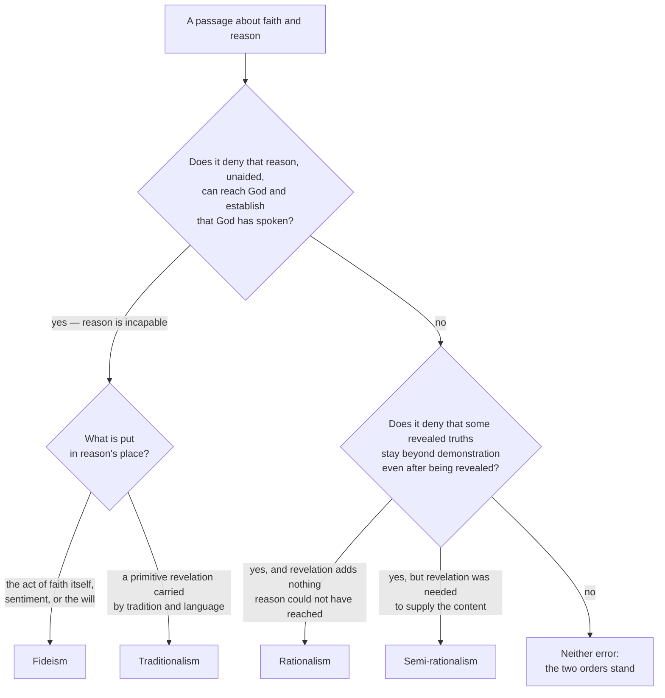

# Fundamental Theology · Lesson 2.3: Fideism and rationalism

> ⏱ ~15 min · Module 2: Faith and reason · Builds on: [2.2 Credibility and the preambles of faith](02-02-credibility-and-the-preambles-of-faith.md) · Unlocks: [2.4 *Fides et Ratio*](02-04-fides-et-ratio.md)

## Why this matters

You will read a paragraph about faith and science this week — in a bulletin, a comment thread, a book review — and you will have the vague sense that something in it is off without being able to say what. This lesson gives you the *what*: two errors with opposite shapes, each of which the Church defined against, and a test you can run on a piece of prose in about thirty seconds. The test earns its keep in both directions. It catches the pious paragraph that has quietly denied reason can do anything, and it catches the confident paragraph that has quietly promised reason can do everything — and, just as often, it clears a paragraph that merely *sounds* like one of them.

## The idea

Faith and reason can be mismatched in exactly two directions, and the Church's position is not a compromise between them but a claim that both misdescribe what is actually there.

- **Reason overreaches.** *Rationalism*: unaided reason is enough, so revelation is either superfluous or is really just reason's own content arriving by another route. *Semi-rationalism* is the subtler version, and the one nineteenth-century Catholic theologians actually fell into: revelation is granted — we needed God to tell us about the Trinity — but once told, a properly trained reason can *demonstrate* it. Revelation becomes a delivery mechanism for truths that are not, in the end, mysterious.
- **Reason underreaches.** *Fideism*: reason cannot establish that God exists or that God has spoken, so faith has to rest on something else — the act of believing itself, religious sentiment, the will, the authority of the believing community. *Traditionalism*, the nineteenth-century French form, gives that "something else" a specific shape: our knowledge of God comes from a primitive revelation handed down through society and language, and unaided reason contributes nothing.

The Catholic position holds two things at once, and the whole difficulty is that each is easier to assert alone. Reason really can reach God and really can establish that God has spoken — so faith is not a leap. And the truths God speaks really do exceed reason — so faith is not a conclusion. Two orders of knowledge, neither collapsing into the other.

## The argument

**The double order of knowledge** (*Dei Filius*, ch. 4, Vatican I, 1870). The council teaches that there is "a twofold order of knowledge, distinct both in principle and in object" — and both halves of that phrase are doing work.

> **Distinct in principle**, that is, in source: in one order we know by natural reason, in the other by divine faith. *In words: the two differ in how you get there.*
>
> **Distinct in object**, that is, in content: besides what reason can attain, there are mysteries hidden in God which cannot be known unless God reveals them. *In words: the two also differ in what is there to be got. Revelation is not a shortcut to conclusions reason could have reached the long way.*

Miss the second half and you have semi-rationalism: the orders differ only in route, and the destination is common ground. Miss the first half and you have fideism: there is no second route, because the first one goes nowhere.

**No real conflict, and the reason given.** The same chapter teaches that faith and reason can never genuinely disagree — and the argument matters more than the slogan:

> **P1.** The same God both reveals mysteries and gives the human mind its light of reason.
> **P2.** "God cannot deny himself, nor can truth ever contradict truth."
> **∴ C.** A real contradiction between a truth of faith and a truth of reason is impossible; an apparent one means something has been misread.

In words: the guarantee is theological, not empirical. It is not the claim that every apparent clash has been cleared up, or that clearing one up is easy. The council names where apparent clashes normally come from: either a dogma has been misunderstood and stated other than the Church means it, or somebody's opinion has been dressed up as a finding of reason. That is a diagnostic instruction, not a promise of comfort.

**What reason may and may not do with a mystery.** The council's chapter grants reason three real offices and withholds a fourth. Reason, illumined by faith and inquiring soberly, can reach *some* understanding of the mysteries — by analogy with what it naturally knows, by the connection of the mysteries with one another, and by their connection with our final end — and that understanding is genuinely fruitful. What reason cannot do is perceive a mystery the way it perceives a truth that is its own proper object. Aquinas puts the negative half sharply (*Summa Theologiae* I, q.1, a.8): against someone who denies revelation altogether, there is no arguing *to* the articles of faith; one can only answer his objections. And since faith rests on infallible truth, "the arguments brought against faith cannot be demonstrations, but are difficulties that can be answered."

So reason's licence regarding mysteries is: **defend, illustrate, answer — never prove.** Those three verbs are the middle position in miniature, and a passage that adds a fourth verb, or subtracts all four, is one of the two errors.

**Levels, marked.** The double order and the impossibility of real conflict are taught by an ecumenical council in a dogmatic constitution, with canons attached to the chapter; a claim that all the dogmas of faith can be understood and demonstrated by a properly trained reason from natural principles falls under them, so the existence of mysteries strictly so called is at the top rung — **divinely revealed, proposed as such**. That reason can know God with certainty from created things is likewise defined, in the canon [1.2](01-02-natural-knowledge-of-god.md) reads word by word; that canon is the flank that faces fideism, exactly as the chapter-4 canons are the flank that faces rationalism. The expository chapter's teaching on reason's three offices is conciliar teaching but not itself a definition. Aquinas has no magisterial weight as such; he is cited here for the strength of the distinction, which the council's own language tracks.

The particular nineteenth-century censures — which author, which act, which year — belong to [`church-history`](../../church-history/syllabus.md). What matters here is that the Holy See acted repeatedly, in the decades before Vatican I, against *both* families at once: against German authors who held that reason could demonstrate the mysteries once revealed, and against French authors who held that reason unaided could establish nothing about God. The council's two flanks are the settled form of those interventions. Notice the pattern, because it recurs: the Church condemned the two errors as a pair, which is itself evidence that she took the middle position to be a single claim rather than a cautious average of two.

## Argument map

The diagnostic. Run a passage through two gates, in this order.

**How to run it on prose, mechanically.**

1. Underline every clause that *assigns or denies a power* — "cannot", "can only", "proves", "is nothing but", "no more than", "merely", "all that", "once you see it you must admit".
2. Ask of each underlined clause which gate it speaks to: reason's reach *before* faith (gate 1), or the status of mysteries *after* revelation (gate 2).
3. **The deciding sentence is the one making the strongest modal claim about a power** — not the one with the most religious or the most scientific vocabulary. Tone is not a gate.
4. If no clause denies a capacity at either gate, the verdict is *neither*. Pious language is not fideism and confident language is not rationalism.

| Position | Reason's reach before faith | Mysteries after revelation | Motive of assent | Tell-tale sentence |
|---|---|---|---|---|
| Rationalism | sufficient for everything | none — there is nothing reason could not have reached | the evidence itself | "Revelation only confirms what any honest thinker already knows." |
| Semi-rationalism | insufficient to *discover* the mysteries | demonstrable, once revealed | the demonstration | "Given the doctrine, reason can show it had to be so." |
| Fideism | cannot establish God, or that God has spoken | untouchable by reason in every respect | the act of faith itself; sentiment; the will | "No argument has ever been able to show that God exists." |
| Traditionalism | incapable unaided | held on the authority of what is handed down | the primitive tradition | "We know God only because the race was told and has passed it on." |
| **Catholic position** | **reaches God; establishes credibility** | **defended, illustrated, never proved** | **the authority of God revealing** | **both halves asserted in the same paragraph** |

## Worked examples

**Example 1 (mechanical — a clean case).** An invented op-ed paragraph:

> "Catholics are sometimes embarrassed about the Trinity, and they shouldn't be. Yes, the doctrine had to be revealed; no philosopher would have arrived at it. But that is a fact about our history, not about the doctrine. Once the terms are properly defined, the necessity of three persons in one nature can be demonstrated from the nature of love itself, and a serious thinker who grasps the demonstration cannot withhold assent. What is still called a mystery is simply a proof most people have not been shown."

Gate 1: nothing here denies reason's reach; the paragraph is, if anything, enthusiastic about it. Pass. Gate 2: "can be demonstrated", "cannot withhold assent", "simply a proof most people have not been shown" — three clauses denying that the mystery remains beyond demonstration. But the paragraph *grants* revelation and says it was needed ("no philosopher would have arrived at it"). Verdict: **semi-rationalism**, not rationalism, and the deciding sentence is the one beginning "Once the terms are properly defined". Note what did *not* decide it: the opening concession sounds orthodox and is orthodox; the error arrives two sentences later. Note also the damage the last sentence does to the act of faith — if the mystery is a proof, the motive of assent is the proof, and belief on the authority of God revealing has quietly been replaced.

**Example 2 (why you'd care — the hard case that isn't an error).** Another invented paragraph:

> "I have never met anyone argued into the faith. The arguments are fine as far as they go, and I can run through them, but they have never been what did it for anyone I know. Faith is a gift; God gives it or he doesn't, and no proof compels it. When I pray I am not concluding anything."

Run the gates. Gate 1: does any clause deny that reason can reach God or establish credibility? "The arguments are fine as far as they go, and I can run through them" concedes the capacity outright. "No proof compels it" is a claim about what arguments *achieve in people*, not about what reason *can establish* — and the Catholic position agrees with it, because the assent of faith is free and graced, not extracted by a demonstration. Pass. Gate 2: nothing about mysteries being demonstrable. Verdict: **neither error**, despite a thoroughly fideist-sounding tone.

Now change five words. Replace the second sentence with: *"The arguments prove nothing, and nobody has ever shown that God exists."* Same tone, same piety, and now the paragraph denies at gate 1 exactly what the canon [1.2](01-02-natural-knowledge-of-god.md) reads defines — not that some particular proof works, but that God *can* be known with certainty by the natural light of reason. That is the fideist sentence, and it is one clause long. This is why the diagnostic looks at modal verbs and not at atmosphere: the two paragraphs read almost identically aloud.

## Watch out

- **You might think fideism means holding that faith is a gift of grace.** It doesn't — that *is* Catholic teaching. Fideism denies reason's **capacity**; it is not the observation that arguments rarely convert anyone. Denying that argument is *sufficient* is orthodox; denying that reason is *able* is the error.
- **You might think "faith is above reason" means faith can be against reason.** The council's chapter says the opposite in the same breath: above, and therefore never in real conflict, because one God authors both.
- **You might think a mystery is a contradiction we agree not to look at.** A mystery exceeds reason's grasp; a contradiction violates it. If a doctrine were genuinely contradictory, the no-conflict teaching would be violated, not satisfied — which is why "defend and answer objections" is real work and not a courtesy.
- **You might think "we can't prove it" means "we have no reasons."** The motives of credibility from [2.2](02-02-credibility-and-the-preambles-of-faith.md) are reasons for believing that God has spoken; they are not evidence of the thing believed. Collapsing that distinction in one direction gives you rationalism, in the other fideism.
- **Don't call every rationalist a semi-rationalist.** The line is whether revelation is granted at all. Someone who says revelation was never needed is a rationalist; someone who says it was needed and is now surpassed is a semi-rationalist.
- **Don't overstate what the no-conflict teaching delivers.** It is a claim about truth, not a guarantee that a given clash has a ready answer. Saying "there can be no conflict, so the difficulty must be bogus" skips the work the council actually assigns.

## One-liner

> Rationalism says reason can do everything and fideism says it can do nothing; the Church says reason reaches God and establishes that he has spoken, and then defends, illustrates and answers — but never proves — what he says.

## Problems

**P1 (🟢) *(Exegetical.)*** For each claim, say at what level it stands and what fixes it there — defined by a canon of *Dei Filius*, taught in an expository chapter of that constitution but not defined, or a theologian's position carrying no magisterial weight as such. One sentence each.

(a) There exist mysteries hidden in God which unaided reason cannot know.
(b) God can be known with certainty by the natural light of human reason through created things.
(c) Reason illumined by faith can reach a fruitful understanding of the mysteries by analogy and by their connection with one another.
(d) Against someone who denies revelation entirely, one can only answer his objections, not prove the articles.

**P2 (🟡) *(Exegetical.)*** Run the diagnostic on this invented paragraph. Give a one-line verdict — rationalist, semi-rationalist, fideist, traditionalist, or neither — then quote the sentence that decides it and say which gate it fails. 150 words or fewer.

> "Science and religion answer different questions and can never collide, because religion isn't in the business of knowledge at all. It is a way of living, a posture of trust. Asking whether God exists is like asking whether a symphony is true — the question misfires. Believers who try to argue for God's existence have already conceded too much to their opponents, and every such argument has failed anyway. What we have is the tradition we were raised in, and it is enough."

**P3 (🔴, optional) *(Exegetical (a) · Evaluative (b).)*** Another invented paragraph, this one from a popular apologetics blog:

> "People say faith is a leap. Nonsense. The evidence for the Resurrection is overwhelming — the empty tomb, the witnesses, the transformation of the apostles. Weigh it honestly and the conclusion is forced; anyone who has looked at the case and still doesn't believe is simply not reasoning well. That is all faith is: the reasonable verdict on the evidence."

(a) The paragraph passes gate 1 comfortably. Say precisely what it gets wrong anyway, naming the sentence and the gate, and say which element of the act of faith it has displaced. (b) The blogger replies that his paragraph is doing apologetics, not theology — he is meeting unbelievers where they are, and it would be perverse to open with "you cannot be argued into this." In 150 words, assess the reply: any verdict passes, provided you say what the apologist may claim for the evidence and where the claim would have to stop.

Solutions

**P1** *(Exegetical — strict. Overstating a level is an error.)*

**Must hit, strict:**
- (a) **Defined.** Vatican I attached canons to the chapter on faith and reason, and the denial — that all dogmas can be understood and demonstrated by trained reason from natural principles — falls under them. So the existence of strict mysteries is divinely revealed and proposed as such.
- (b) **Defined**, by the canon on revelation that [1.2](01-02-natural-knowledge-of-god.md) reads. Note what is defined: that God *can* be known, not that any particular proof succeeds.
- (c) **Taught in the expository chapter, not defined.** Conciliar teaching of real weight; the chapter explains, the canons bite. Calling this a dogma is the overstatement the problem is looking for.
- (d) **A theologian's position** — *Summa Theologiae* I, q.1, a.8. Aquinas's standing in the tradition is enormous and his weight here is still the weight of his argument.

**Wrong turns:** promoting (c) to defined status because it sits in a dogmatic constitution — councils explain as well as define; demoting (a) to "common teaching" because the word "mystery" sounds soft; treating (d) as settled because the council's chapter says something compatible with it.

**Model answer:** (a) defined, by the canons on faith and reason; (b) defined, by the canon on revelation; (c) conciliar teaching, expository, not defined; (d) Aquinas — no magisterial weight as such.

---

**P2** *(Exegetical — strict.)*

**Must hit, strict:**
- Verdict: **fideist**, with a traditionalist tail.
- The deciding sentence is "Believers who try to argue for God's existence have already conceded too much to their opponents, and every such argument has failed anyway" — it denies reason's capacity at **gate 1**. ("Asking whether God exists is like asking whether a symphony is true" also fails gate 1, by denying the question is one of knowledge at all; either citation passes if the gate is named correctly.)
- The closing sentence — the tradition we were raised in "is enough" — is the traditionalist move: what reason cannot supply, inherited transmission does.
- Say why the opening is *not* what decides it: "science and religion answer different questions" is close to the double order of knowledge and is unobjectionable on its own. The error is the reason the paragraph gives for the distinction.

**Wrong turns:** calling it rationalist because it invokes science; letting the respectful opening tone acquit it; naming "religion isn't in the business of knowledge" as merely modest rather than as a denial that faith has an object to be known.

**Model answer:** Fideist, shading into traditionalism. The deciding clause is that every argument for God's existence has failed and that believers who attempt one concede too much — that denies at gate 1 what Vatican I defined, that God can be known with certainty by natural reason. The non-overlap opening is not the problem; the ground offered for it is, since it strips faith of any object to be known and leaves inherited tradition carrying the whole weight.

---

**P3** *(a) exegetical — strict; (b) evaluative — any verdict.*

**Must hit, strict (a):** the failure is at **gate 2**, in "Weigh it honestly and the conclusion is forced" together with "That is all faith is: the reasonable verdict on the evidence." The paragraph makes the evidence the **motive of assent**, so what it describes is a conclusion of historical reasoning, not the act of faith, whose motive is the authority of God revealing ([2.1](02-01-the-act-of-faith.md)). It also makes the assent compelled, which removes faith's freedom, and it turns the motives of credibility from [2.2](02-02-credibility-and-the-preambles-of-faith.md) into evidence of the thing believed. The shape is rationalist even though the content is apologetic and pious.

**Must hit, any verdict (b):** state what the apologist legitimately claims — that the credibility of revelation can be established by reason, that believing is not rash, that evidence genuinely bears on whether God has spoken — and state where the claim must stop: short of making the evidence the motive of assent, and short of making unbelief simply an error in reasoning. Either verdict on the reply passes if that boundary is drawn.

**Wrong turns:** acquitting the paragraph because its conclusion is true and its intent is good; calling it fideist because it is devotional in tone; arguing about the historical evidence for the Resurrection, which is not what was asked.

**Model answer (b), one of several:** The reply is half right and the half it misses is the one that matters. An apologist may argue hard for credibility — that is precisely what the preambles and the motives of credibility are for, and refusing to argue would concede the fideist's premise. What he may not do is finish the job, because "the evidence forces it" describes an act with the wrong motive; the believer assents to God, on God's authority, with reasons that make the assent responsible rather than reasons that make it unavoidable. The fix costs him one sentence, not his argument: the case shows that believing is reasonable, and the believing itself is still free, still graced, and still directed at God rather than at the case.

## Flashback

**F (🟡) *(Exegetical.)*** From [2.1](02-01-the-act-of-faith.md). Three invented sentences from a parish adult-education handout:

(a) "Her faith carried her through that year."
(b) "The faith teaches that Christ is true God and true man."
(c) "He believed the doctrine because the Church, which he trusted, taught it."

For (a) and (b), say whether "faith" names *fides qua* or *fides quae*. For (c), say what the sentence gives as the motive of assent and whether, as written, it states the motive of the act of faith. Three sentences total.

Solution

**Must hit, strict:**
- (a) *Fides qua* — the act or virtue by which she believes.
- (b) *Fides quae* — the content believed, the faith as a body of truth.
- (c) The motive as written is the Church's trustworthiness, which is a motive of credibility, not the motive of the act of faith. The motive of faith is the authority of God revealing; the Church proposes the truth and is a ground for holding that God has spoken. The sentence is not false, but it stops one step short.

**Wrong turns:** reading (a) as *fides quae* because it could be paraphrased "her religion"; declaring (c) simply wrong rather than incomplete — the Church's proposing is a real and necessary part of the account.

## Connections

- **Backward:** [2.2](02-02-credibility-and-the-preambles-of-faith.md) supplied the distinction this lesson runs on — credibility versus evidence of the thing believed — and [2.1](02-01-the-act-of-faith.md) supplied the motive that both errors displace. [1.2](01-02-natural-knowledge-of-god.md) holds the canon that gate 1 tests against; [1.3](01-03-supernatural-revelation.md) holds mysteries strictly so called, which gate 2 tests against.
- **Forward:** [2.4](02-04-fides-et-ratio.md) takes the same middle position a century later and turns it into a positive programme — philosophy's legitimate autonomy, and what theology needs from it. The chapter read here ends by citing Vincent of Lérins on growth "in the same sense and the same meaning", which is where [5.1](05-01-vincent-of-lerins.md) starts.
- **Sideways:** whether any particular argument for God's existence succeeds is [`philosophy-of-religion`](../../philosophy-of-religion/syllabus.md)'s question, not this course's — Vatican I defined a capacity, not a proof. [`apologetics-foundations`](../../apologetics-foundations/syllabus.md) does the arguing that P3 declines to do, under the constraint P3 identifies. The nineteenth-century cases and the acts that closed them belong to [`church-history`](../../church-history/syllabus.md).
