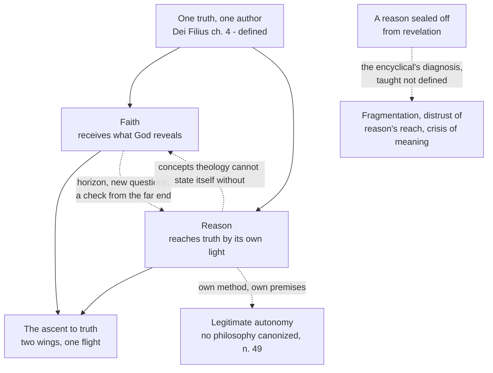

# Fundamental Theology · Lesson 2.4: *Fides et Ratio*

> ⏱ ~15 min · Module 2: Faith and reason · Builds on: [2.3 Fideism and rationalism](02-03-fideism-and-rationalism.md) · Unlocks: [3.1 Inspiration](03-01-inspiration.md)

## Why this matters

[2.3](02-03-fideism-and-rationalism.md) gave you the fences: the Church condemned fideism on one side and rationalism on the other, and held that faith and reason belong to two distinct orders of knowledge which cannot really conflict. Fences tell you where not to go. *Fides et Ratio* is the positive programme — the document you will actually be handed when someone asks what the Church says about faith and philosophy, and the one most often misquoted in both directions.

It is also the best live exercise this course has in its signature skill. Here is a pope making *philosophical* judgements in an encyclical: about what modern culture has lost, about what philosophy must recover, about one thirteenth-century friar. A reader who treats those judgements as definitions overstates them. A reader who treats them as a private opinion piece understates them. Getting it right requires knowing exactly what an encyclical is and what it asks — which is the whole of Module 4 in miniature.

## The idea

**The encyclical.** *Fides et Ratio*, "on the relationship between faith and reason," was issued by John Paul II on 14 September 1998 and addressed to the bishops of the Catholic Church. It opens with the image the document is famous for: faith and reason are like two wings on which the human spirit rises toward the contemplation of truth. Everything else unpacks that picture.

Notice what the image says and what it does not. It says there is **one** ascent and **one** truth at the top — not a religious truth alongside a rational truth. It says that a bird with one wing does not fly half as well; it does not fly. What it does not say is that the two wings are interchangeable, or that faith is just reason with extra confidence. Revelation has a primacy of *content* — it gives what reason could not have found. Philosophy has an autonomy of *method* — it proceeds by argument, from its own starting points, and no encyclical relieves it of that.

**The level of authority — settle this first.** An encyclical is an act of the **authentic ordinary magisterium**, non-definitive: rung three of the ladder this course builds in [4.4](04-04-the-ladder-of-doctrinal-authority.md). It asks religious submission of intellect and will, graded by the document's character, its wording and how insistently the teaching is repeated. It does not define. So *Fides et Ratio* contains claims of two quite different weights, and telling them apart is the reading skill:

- **Doctrine it repeats.** That God can be known by the light of natural reason, that the two orders of knowledge are distinct, and that there can be no real conflict between faith and reason — all of that was defined at Vatican I in *Dei Filius* (1870). It carries the weight of the 1870 act, not of the 1998 one.
- **Judgements it makes.** That modern philosophy has largely abandoned the question of truth; that our culture suffers a crisis of meaning; that a philosophy sealed off from revelation drifts in characteristic directions; that Aquinas is the model of the right relationship. These are the encyclical's own, at ordinary-magisterium level. They are taught, not defined — and a Catholic philosopher who thinks the diagnosis is overdrawn in some particular respect is not denying an article of faith.

## The argument

**The core claim, in numbered form:**

> **P1.** God is the author both of the light of reason and of what he reveals, and truth does not contradict itself.
> **P2.** Therefore reason cannot, rightly used, arrive at anything that contradicts revelation — and revelation, rightly understood, cannot require reason to abdicate. *(This is the defined teaching of* Dei Filius *ch. 4, restated.)*
> **P3.** Philosophy nevertheless has its own methods, principles and starting points; revelation does not supply its premises.
> **P4.** But reason is in fact wounded and situated — it works inside a history and a culture, and it can lose its nerve or its range.
> **∴ C.** Philosophy keeps its autonomy and is better off within the horizon revelation opens, because revelation puts questions to reason it would not otherwise press, and rules out blind alleys from the far end.

In words: nobody is asking philosophers to argue from scripture. The claim is that a reason working with revelation in view is asking bigger questions and is warned off certain dead ends — and that a reason that walls revelation out tends, over time, to shrink.

**"The Church has no philosophy of her own."** The encyclical states it flatly: the Church has no philosophy of her own and canonizes no one philosophy in preference to others (n. 49). Two reasons stand behind it. Revelation is not itself a philosophical system, so binding the faith to a system would make it hostage to that system's fortunes. And the Magisterium's competence here is chiefly **negative and discerning**: it can judge that a philosophical position is incompatible with revealed truth — the encyclical presents this as a service to truth, not an intrusion — without thereby endorsing a rival system. Saying "not that" is not the same act as saying "this one."

**Aquinas — the sentence to get exactly right.** In the same document that canonizes no philosophy, the encyclical devotes a section to Aquinas (nn. 43–44) as the enduring model: in him reason's autonomy and faith's primacy are held together rather than traded off, and the Church has consistently proposed him as a master of thought and a model of how to do theology. The Church's law backs this on the formation side — Vatican II's decree on priestly training directs that seminarians learn to penetrate the mysteries of salvation with Aquinas as their teacher (*Optatam Totius* 16, 1965), and the Code of Canon Law carries a parallel norm for seminary studies; the modern impulse goes back to Leo XIII's *Aeterni Patris* (1879).

Hold the two together precisely:

| The encyclical does | The encyclical does not |
|---|---|
| Propose Aquinas as a master and a model of method | Oblige Catholics to hold the theses of any Thomist school |
| Ask that he be studied, and require it in priestly formation | Make agreement with him a test of orthodoxy |
| Say his synthesis shows what the right relation looks like | Declare his philosophy the Church's philosophy — n. 49 still stands |
| Welcome other philosophical traditions | Welcome them unconditionally: they must be compatible with revealed truth |

The recommendation is strong and it is a recommendation. Formation norms bind a *curriculum* — what must be taught and studied — not a set of propositions everyone must believe.

**Three stances of philosophy toward revelation** (the encyclical's own map, in its chapter on the interaction of philosophy and theology):

| Stance | What it is | Status |
|---|---|---|
| Philosophy wholly independent of revelation | The ancients' project, and much of modern philosophy: reason working entirely on its own | Legitimate; its autonomy is real, and its historical limits are part of the encyclical's argument |
| "Christian philosophy" | Not an official system, but philosophy done where faith has purified reason and put questions to it — creation from nothing, the person, sin, evil, the meaning of history | A circumstance, not a school |
| Philosophy in the service of theology | Supplying theology with the concepts it needs to state and understand what is revealed | The classical *ancilla* role, freely given, not coerced |

**The diagnosis, and what philosophy is asked to recover.** The encyclical's reading of the modern intellectual scene: knowledge has fragmented into specialisms with nothing to unify them; reason has lost confidence in its capacity to reach truth as such and settles for what is useful, verifiable or agreed; and the result is a crisis of meaning, in which the one question people cannot stop asking — what is all this for — is the one philosophy has stopped answering. Its closing chapter names currents to avoid rather than persons: eclecticism, historicism, scientism, pragmatism, nihilism. The three requests it makes of philosophy follow directly: recover the **sapiential** dimension (a search for ultimate meaning, not only for technique); recover confidence that reason **can reach truth**, not merely opinions; and recover genuinely **metaphysical range** — the ability to move from what appears to its foundation.

**The circle.** Theology needs philosophy for its own concepts: you cannot state "one person in two natures" without a metaphysics of person and nature, and a theology that refuses philosophy does not thereby become purer, it becomes unable to say what it means. Philosophy in turn gains from revelation a horizon and a set of questions. The encyclical describes the relation as circular — each gives the other something it cannot generate alone — and that is not a vicious circle, because the two are giving different things.

## Argument map

The solid arrows are defined doctrine. The dotted arrow at the bottom is the encyclical's own judgement — and the difference between the two kinds of arrow is what Example 1 makes you read.

## Worked examples

**Example 1 (mechanical — assigning the weight).** Four claims a reader might take from the encyclical. Where does each one's weight come from?

- *There can be no real conflict between faith and reason.* Taught here, **defined in 1870**. The encyclical restates it; the level comes from *Dei Filius*, and a Catholic who denied it would be contradicting a conciliar definition, not an encyclical.
- *The Church canonizes no philosophy.* A statement of the Church's own practice and policy, made in an encyclical. Not a definition, but not a contestable diagnosis either — it is the Magisterium reporting what it does, and it is confirmed by the fact that it has never done otherwise.
- *Contemporary culture suffers a crisis of meaning.* A **prudential and diagnostic judgement**, authentic ordinary magisterium. Religious submission is owed: take it seriously, let it weigh. A Catholic philosopher may still argue that some part of the diagnosis misreads, say, analytic philosophy, and remain in good standing.
- *Aquinas is the model.* A **recommendation**, reinforced by a formation norm. Binds what seminaries teach; does not bind what anyone must hold.

Four sentences in one document, four different kinds of weight. That is normal, and reading for it is [4.5](04-05-reading-a-documents-weight.md)'s entire subject.

**Example 2 (where it strains — the analytic philosopher).** A Catholic philosopher works in a broadly analytic style: formal semantics, careful argument, no continental vocabulary, no Aquinas in the footnotes. He thinks the "crisis of meaning" story is a caricature of his discipline, which in his view has been doing metaphysics with more rigour than at any time since the Middle Ages. Has he defied the encyclical?

Work it through. **No** — and n. 49 is exactly why: no system is canonized, so no style of philosophy is prescribed. The encyclical welcomes philosophical traditions it did not itself grow from, on one condition — compatibility with revealed truth. What would actually put him in conflict is narrower and sharper: holding that reason is in principle incapable of reaching truth about God, or that a proposition can be true in philosophy and false in theology, both of which Vatican I already excluded. Religious submission asks something real of him even so: he has to engage the encyclical's concern rather than wave it off, and if he thinks the diagnosis misfires he owes an argument, not a shrug.

And notice the move he cannot make. He cannot say the Magisterium has no business judging philosophical matters at all — the encyclical asserts that competence explicitly, as a negative discernment in service of the truth. The autonomy it grants is genuine and it is not sovereignty.

## Watch out

- **You might think the encyclical made Thomism obligatory.** It says in so many words that the Church canonizes no philosophy (n. 49). The opposite error is just as common: it does not treat Aquinas as one option among equals either. Both halves, or you have misquoted it.
- **You might think "two wings" means faith and reason are symmetrical.** One flight, one truth — but revelation supplies content reason could not reach, and reason supplies a method revelation does not override. The image is about needing both, not about their being the same kind of thing.
- **You might think an encyclical defines.** Encyclicals normally define nothing. This one restates defined doctrine and adds non-definitive teaching, and conflating the layers is the classic overstatement — see [4.3](04-03-religious-submission.md).
- **You might think autonomy means answerable to nothing.** The autonomy is methodological. The claim that philosophy could reach a truth contradicting revelation is precisely what *Dei Filius* denied, and the encyclical does not reopen it.
- **The diagnosis names currents, not people.** Eclecticism, scientism, nihilism and the rest are described as tendencies. Reading the document as a condemnation of named living philosophers is reading in something that is not there.
- **"Christian philosophy" is not a system.** It names a circumstance — reason working where faith has already put questions to it — and the encyclical is careful that it not be heard as an official school.

## One-liner

> Faith and reason are two wings of one ascent to one truth: philosophy keeps its own method and no system is canonized, yet a reason with revelation in view asks larger questions than a reason without it.

## Problems

**P1 (🟢) *(Exegetical.)*** For each statement, say whether *Fides et Ratio* teaches it, and if so whether its weight comes from the encyclical itself or from an earlier act the encyclical repeats. One sentence each.

(a) There can be no real disagreement between faith and reason, since God is the author of both.
(b) Catholic philosophers are obliged to work within the Thomistic system.
(c) The Magisterium may judge that a philosophical position is incompatible with revealed truth.
(d) Contemporary culture suffers from a crisis of meaning which philosophy has a duty to address.

**P2 (🟡) *(Exegetical (a) · Evaluative (b).)*** (a) In one sentence each, state what n. 49 denies and what the encyclical's treatment of Aquinas nevertheless asserts, phrased so that the two do not contradict. (b) A philosopher replies that they cannot really be held together: singling out one thinker as *the* model just is canonizing his system, whatever the document says. In 150 words or fewer, assess the objection — any verdict passes, provided you say what "model" would have to mean for the two claims to be consistent, and name one fact about the Church's actual practice that bears on it.

**P3 (🔴, optional) *(Exegetical (a) · Evaluative (b).)*** An invented column in a philosophy department newsletter:

> "Rome has finally conceded the point. The 1998 encyclical grants philosophy its autonomy and admits that the Church has no philosophy of her own — an admission, incidentally, that overturns Leo XIII. So a Catholic philosopher may now argue for anything he pleases, including that reason is incapable of any truth about God, and the Magisterium's only remaining role is to stay out of the way."

(a) Name three things this paragraph gets wrong, at least one of which must be an error about a level of authority or about the *scope* of what the encyclical grants. (b) The writer replies that any surviving power to declare a philosophical position incompatible with the faith is itself a limit on autonomy, so the "autonomy" on offer is empty. In 150 words or fewer, assess.

Solutions

**P1** *(Exegetical — strict.)*

**Must hit, strict:**
- (a) Taught, but the weight is borrowed: defined at Vatican I in *Dei Filius* (1870). The encyclical restates it.
- (b) **Not taught, and denied** — the encyclical says the Church canonizes no philosophy (n. 49). Aquinas is proposed as a master and model, and required in priestly formation, which binds a curriculum rather than a set of theses.
- (c) Taught by the encyclical itself, as a negative discernment in service of the truth; it is a claim about the Magisterium's competence, not a definition.
- (d) Taught by the encyclical itself, at authentic ordinary magisterium level — a diagnostic and prudential judgement, non-definitive, owed religious submission.

**Wrong turns:** crediting (a) to the encyclical, which overstates the 1998 document and understates the 1870 one; treating (d) as though it bound like (a); reading (b) as true because seminarians are required to study Aquinas — the requirement is about study, not assent.

**Model answer:** (a) taught, weight from *Dei Filius*; (b) false, and the encyclical says the opposite; (c) taught by this document, non-definitive; (d) taught by this document, non-definitive, religious submission owed.

---

**P2** *(a) exegetical — strict; (b) evaluative — any verdict.*

**Must hit, strict (a):** n. 49 denies that the Church has a philosophy of her own or prefers one system as *the* Church's; the Aquinas sections assert that he is proposed as a master of thought and a model of the right *relation* between faith and reason, and is prescribed for formation. The reconciliation is in the object: exemplary method and required study versus obligatory doctrinal content.

**Must hit, any verdict (b):** say what "model" must mean for consistency — a pattern of how to hold reason's autonomy and faith's primacy together, rather than a list of theses to be affirmed. And cite one fact about practice: for example, that the Church has never censured a Catholic philosopher merely for rejecting a Thomist thesis, or that the encyclical explicitly welcomes other philosophical traditions on condition of compatibility, or — pressing the other way — that formation law names one teacher and no other, which is a real thumb on the scale. Either verdict passes.

**Wrong turns:** arguing about whether Thomism is *true*, which is not the question; treating the tension as dissolved just because the document asserts both (that the author says they are compatible is not an argument that they are); ignoring the formation norms, which are the strongest evidence for the objection.

**Model answer (b), one of several:** They are consistent, but only just. "Model" has to be read as a model of method — a demonstration that autonomy and primacy can be held at once — and the encyclical's own conduct supports that reading: it commends Aquinas while inviting philosophical traditions he never saw, subject to compatibility with revelation. What keeps the tension alive is the law: naming one teacher for every seminary is not neutrality, and the honest description is a strong pedagogical preference stopping deliberately short of a doctrinal requirement. That a Catholic may reject Thomist theses without any censure is the test, and it comes out on the side of consistency.

---

**P3** *(a) exegetical — strict; (b) evaluative — any verdict.*

**Must hit, strict (a):** any three of —
1. **Scope error.** The autonomy granted is methodological — philosophy's own methods and premises. It is not a licence to hold anything; the encyclical states a condition, compatibility with revealed truth.
2. **The specific example is excluded.** That reason cannot reach truth about God is not an open option: Vatican I defined that God can be known with certainty by the light of natural reason, so this is a defined teaching, not a matter the encyclical left free.
3. **Level/role error.** The claim that the Magisterium's only role is to stay out of the way contradicts the document, which asserts a competence to judge philosophical positions incompatible with the faith.
4. **"Overturns Leo XIII" is false.** The encyclical stands in continuity with *Aeterni Patris* (1879) and commends Aquinas in the same breath as denying that any system is canonized. Also, an encyclical is not the kind of act that overturns doctrine; and "Rome has finally conceded" implies a reversal where the document presents continuity.

**Must hit, any verdict (b):** state the objection precisely (a freedom bounded from outside is not autonomy); then make the move either side must make — distinguish a limit on *method* from a limit on *conclusions*, and say which one the encyclical imposes. Note what the constraint actually rests on: the claim that truth is one, so an exclusion from the side of revelation is not an external veto if the premise holds. Any verdict passes if the distinction is drawn and the premise identified.

**Wrong turns:** conceding the whole point because a constraint exists — every discipline excludes conclusions it has reason to think false; or dismissing the objection by repeating that the document grants autonomy, which is the thing in dispute.

**Model answer (b), one of several:** The reply trades on an ambiguity. Autonomy in any discipline means governing your own method, not being guaranteed in advance that no result of yours will ever be judged false from outside. Physics is autonomous and still answerable to experiment. On the encyclical's premise — one truth, one author — revelation functions like a second body of evidence rather than an external veto, so a philosophy contradicting it is being told it has gone wrong, not being told to stop thinking. That premise is where the real argument is, and the writer has skipped it. The concession worth making is that this is only as convincing as the premise: to someone who denies that revelation is evidence at all, the constraint will look exactly like a veto.

## Flashback

*(From [2.2](02-02-credibility-and-the-preambles-of-faith.md) — credibility and the preambles of faith.)*

**F1 (🟡) *(Exegetical.)*** A student says: "I worked through the historical and philosophical case for Christianity, concluded it was more likely true than not, and on that basis I made an act of faith. So my faith is about eighty percent certain — it can't be firmer than the case that produced it." In 100 words or fewer: (a) what has his investigation actually established, and what has it not? (b) What does the act of faith rest on, if not the strength of his case — and why does that let his assent be firmer than his evidence?

Solution

**Must hit, strict:**
- (a) The investigation establishes **credibility** — that this revelation is worthy of belief and that believing is not a leap in the dark. It does not establish the truth of the things believed; the mysteries remain non-evident, which is why the assent is faith and not sight.
- (b) The act of faith rests on the **authority of God revealing** — that is its motive. Because the motive is God's own truthfulness rather than the weight of a human argument, the assent can be firmer than the reasoning that led up to it; the certainty of faith is not the certainty of the preliminary case.

**Wrong turns:** saying the case for credibility proves the articles of faith, which collapses faith into a conclusion of reason (the rationalist side of [2.3](02-03-fideism-and-rationalism.md)); or saying the case is therefore irrelevant, which is the fideist side. Credibility is required and is not the motive.

**Model answer:** His work established that the revelation is credible, not that its content is evident — it cleared the way rather than doing the believing. The assent itself rests on God's authority as the one revealing, so its firmness comes from that motive, not from the percentage. Eighty percent is a fair report of his argument and a category mistake about his faith.

## Connections

- **Backward:** [2.3](02-03-fideism-and-rationalism.md) fenced the two errors; this lesson is the positive programme inside the fence, and the defined doctrine it leans on — the double order of knowledge — is the one you read there in *Dei Filius* ch. 4.
- **Forward:** Module 3 cashes in the "theology needs philosophy" claim immediately. [3.1](03-01-inspiration.md) has to say that God and a human writer are *both* true authors of one book, and that sentence is unstatable without a metaphysics of principal and instrumental causality. Then [4.3](04-03-religious-submission.md) and [4.5](04-05-reading-a-documents-weight.md) take this encyclical as their standing worked example of what an encyclical asks and how to read its weight.
- **Sideways:** the arguments for God that this lesson deliberately does not run belong to [`philosophy-of-religion`](../../philosophy-of-religion/syllabus.md); Aquinas's actual metaphysics and method to [`thomistic-synthesis`](../../thomistic-synthesis/syllabus.md); the philosophical formation John Paul II himself brought to this document — phenomenology worked together with a Thomist frame — to [`phenomenology-and-personalism`](../../phenomenology-and-personalism/syllabus.md). The reconstruction discipline used in P1 and P3 is [`philosophical-method`](../../philosophical-method/syllabus.md) 1.3, used and not retaught.
