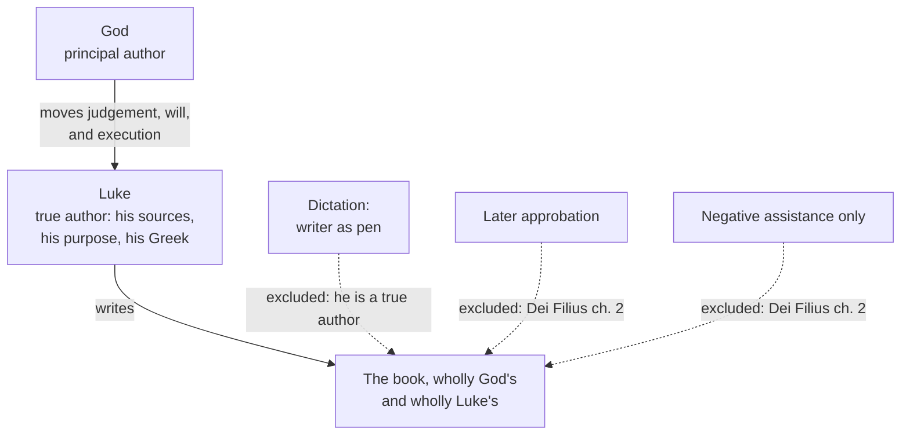

# Fundamental Theology · Lesson 3.1: Inspiration

> ⏱ ~15 min · Module 3: Scripture and Tradition · Builds on: [2.4 *Fides et Ratio*](02-04-fides-et-ratio.md) · Unlocks: [3.2 Inerrancy](03-02-inerrancy.md)

## Why this matters

Module 2 asked how the word of God reaches a mind. Module 3 asks how it reaches a page. Say "the Bible is inspired" out loud and most people hear one of two things: God dictated it, or the Church later stamped it. The Catholic doctrine is neither, and its actual shape — two authors, each of them a *real* author of the same words — is what decides how you read a biblical sentence, what you may say about an error in it, and why the next lesson on inerrancy is difficult rather than obvious. Get the doctrine of inspiration wrong and every argument downstream of it goes wrong in the same direction.

## The idea

**God is the author of the sacred books. The human writer is also the author of his book. Both fully, neither by halves.**

That is the whole doctrine, and the reason it needs explaining is that the two halves look like they compete. If God is really the author, the human writer shrinks to a pen. If the human writer is really the author — with his research, his sources, his Greek, his purposes, his limits — then God's authorship seems to shrink to endorsement. The tradition refuses both shrinkages. Luke's preface, in which he tells Theophilus that he has looked into everything carefully and decided to write an orderly account, is not an embarrassing intrusion of the human into a divine book. It is what inspiration looks like from the inside.

Three words get confused constantly, and separating them is half the lesson:

- **Revelation** — God makes known a truth. Content arrives.
- **Inspiration** — God moves a man to write, so that what is written is God's own word. A book arrives.
- **Canonicity** — the Church recognizes a book as inspired and puts it in the rule of faith. A list arrives. ([3.3](03-03-the-canon-as-defined.md) owns this one.)

They come apart in every direction. Much of what is inspired was never revealed: the author of a historical book may have learned his facts the ordinary way, by asking. Much that was revealed was never written: the apostolic preaching handed on is [Tradition](03-04-tradition.md), not Scripture. And a book is not inspired *because* the Church listed it — the list records a fact it did not create.

## The argument

**The defining text.** Vatican I, *Dei Filius* (1870), ch. 2, in Schaff's translation:

> "These the Church holds to be sacred and canonical, not because, having been carefully composed by mere human industry, they were afterward approved by her authority; nor merely because they contain revelation with no mixture of error; but because, having been written by the inspiration of the Holy Ghost, they have God for their author, and have been delivered as such to the Church herself."

In words: the council states the doctrine by ruling out two cheaper accounts before giving its own. It is not *approbation* (a human book the Church later blesses) and not *mere absence of error* (a book God simply kept clean). It is authorship. The canon attached to this chapter anathematizes anyone who refuses the books as sacred and canonical or denies that they are divinely inspired — so this is **defined dogma**, and Trent had already said, of the Old and New Testaments together, that one God is the author of both (Session IV, 1546).

**The claim in numbered form:**

> **P1.** God moves the sacred writer — his understanding of what to write, his will to write it, and his execution of the writing.
> **P2.** What is produced under that motion is therefore God's own word, not merely a true word about God.
> **P3.** The motion does not suspend the writer; he acts as what he is, a free and intelligent cause, with his own knowledge, sources, style, and purpose.
> **∴ C.** The same sentences are wholly God's and wholly this man's, at different levels of causality.

P1's three-part structure is Leo XIII's in *Providentissimus Deus* (1893): paraphrasing, God so moved and assisted the writers that they rightly grasped what he intended, willed faithfully to set it down, and expressed it in fitting words with unfailing truth. Notice that this covers intellect, will, and the actual labour of composing — inspiration is not a flash at the start but an influence over the whole act.

**Instrumental causality** is the traditional account of how P1 and P3 can both hold. God is the *principal* cause of the book; the writer is the *instrumental* cause. The point of the distinction is that an instrument really does something, and does it in its own manner — a brush and a chisel used by the same artist produce different works because they are different instruments. The sacred writer is what the scholastics call a living and free instrument: his manner *is* his own intelligence and freedom, so the book bears his mind and not only God's. This is why Paul argues like Paul and Luke like a Greek historian, and why that fact is a datum of the doctrine rather than a problem for it.

**The background model is prophecy.** Aquinas treats prophecy in the *Summa Theologiae* II-II (the treatise at qq.171–174), and two of his moves carry straight over. First, prophetic knowledge is not one thing: sometimes God supplies new representations to the prophet, and sometimes only the *light* by which he judges rightly about things he already knows or has seen by ordinary means. That is exactly the space needed for an inspired writer who did his own research — the divine gift can be a light of judgement applied to ordinary material. Second, the prophet does not always grasp the full import of what he says; the instrument need not comprehend everything the principal agent is doing through it. Aquinas states the principle behind all of this elsewhere, flatly: "the author of Holy Writ is God" (ST I, q.1, a.10).

## The case: four accounts of a single page

Take one page — the opening of Luke's Gospel — and run four accounts of inspiration over it.

| Account | What it says about the page | Status |
|---|---|---|
| **Dictation / stenography** | Luke wrote down words given to him; the preface's research is decorative | Never the Church's teaching; excluded by Vatican II's insistence that the writers were true authors |
| **Subsequent approbation** | Luke wrote a human book; God or the Church later adopted it | Excluded in so many words by *Dei Filius* ch. 2 |
| **Negative assistance** | God merely prevented Luke from erring | Excluded by the same text: "not merely because they contain revelation with no mixture of error" |
| **Instrumental causality** | God moves Luke's judgement, will and pen; Luke researches, selects, arranges, writes his own Greek; the result is God's word in Luke's idiom | The traditional account, and the one the defining texts fit |

One caution about vocabulary. Older texts use the word *dictating* — Trent speaks of traditions dictated by the Holy Spirit — and it does not mean stenography. In that idiom "the Spirit dictating" names the *source* of what is said, not the *method* by which it got onto the page. Read the word as an authorship claim and you will not manufacture a contradiction between Trent and Vatican II.

**Dei Verbum 11 (1965) is the modern statement.** Paraphrasing, since the conciliar text is under copyright: the council teaches that the books of Scripture, whole and entire with all their parts, were written under the inspiration of the Holy Spirit and so have God as their author and were handed on as such to the Church; that in composing them God chose human beings and used them with their own faculties and powers, so that, with God acting in and through them, they as **true authors** committed to writing everything and only what he willed. The phrase "true authors" is doing deliberate work: the council takes the older dogma of divine authorship and, in the same sentence, refuses to buy it at the price of the human writer.

## Worked examples

**Example 1 (the clean case — sorting one book).** Luke tells Theophilus: "It seemed good to me also, having diligently attained to all things from the beginning, to write to thee in order, most excellent Theophilus" (Luke 1:3, Douay–Rheims). Sort what is going on.

- *Inspired?* Yes — the whole book, including the preface, is written under the divine motion.
- *Revealed?* Not, on the face of it, the contents of the preface. Luke says he got his material from those who were eyewitnesses from the beginning; a fact learned by inquiry is not thereby a fact God disclosed to him. Inspiration does not require revelation as its raw material; it requires God's motion over the act of writing.
- *Whose sentence is it?* Both authors', entire. God's, because he moved Luke to write it and willed exactly this; Luke's, because the decision to research, the judgement that an orderly account was wanted, the address to a patron, and the polished Greek of that opening period are all his.
- *What does the Church add?* By listing Luke among the canonical books, she recognizes what was already true of it. She does not make it inspired, any more than a registrar makes a child.

**Example 2 (the hard case — where it strains).** The author of 2 Machabees ends his book by apologizing for it: "And if I have done well, and as it becometh the history, it is what I desired: but if not so perfectly, it must be pardoned me" (2 Machabees 15:38, Douay–Rheims). A few verses earlier he has explained that his book is a condensation of somebody else's five-volume work, and that abridging is exhausting.

On a dictation model this is unintelligible: God does not dictate an apology for his own prose, and does not need an epitome of Jason of Cyrene. On the instrumental account it is exactly what the doctrine predicts. The writer's limitations are *his*, and they survive inspiration, because inspiration moves an instrument rather than replacing one. God willed a book with a human author who worked from a source, felt the strain, and said so — and that sentence is inspired Scripture, not an unfortunate leftover.

Notice the strain, though, and do not paper over it: if the human writer's judgement and purposes are genuinely his, then what the book *asserts* is the assertion of a man writing a particular kind of book in a particular century. That is not an escape hatch invented to dodge embarrassment; it follows from the doctrine of authorship itself, and it is the entire problem of [3.2](03-02-inerrancy.md). Inerrancy is a claim about what is asserted, so you cannot say what is guaranteed until you can say what the author was doing — which is why the modern documents send you to literary genre and to the writer's intention before they send you to the truth of a sentence.

## Watch out

- **You might think inspiration means God told the writer things.** That is revelation. Inspiration is a motion to write; its content may have been learned by interview, copied from a chronicle, or remembered from childhood. "Inspired" is a claim about the book's authorship, not about how its facts were acquired.
- **You might think the Church's approval makes a book inspired.** *Dei Filius* rules this out in the very sentence that defines the doctrine. Recognition is not conferral — and the difference is what makes [3.3](03-03-the-canon-as-defined.md) a lesson about a defined fact rather than about a committee.
- **You might think "inspired" is a degree word.** In Catholic usage it is not: a book is inspired or it is not, and there are no more and less inspired books in the canon. (Whether some passages matter more than others is a different axis entirely — the hierarchy of truths, [4.5](04-05-reading-a-documents-weight.md).)
- **Do not promote the theory to the dogma.** That God is the author and the human writers are true authors is taught by councils. That the mechanism is instrumental causality, with divine motion on intellect, will and executive faculties, is the traditional theological *account* of the dogma — powerful, dominant, and genuinely open to revision. Catholic theologians have proposed other frameworks, and have argued for a century about how much of the composition history — editors, redactors, communities — the charism covers. Marking that account as *de fide* is the classic overstatement here.
- **Don't let "dictating" in an older text mean stenography.** See the caution above.

## One-liner

> Inspiration means God is the author of these books *and* the men who wrote them are their authors too — so the human writer's research, style and limits are not interference with the doctrine; they are the doctrine working.

## Problems

**P1 (🟢) *(Exegetical.)*** Using the *Dei Filius* passage above, answer in one sentence each: (a) which two accounts of inspiration does the text explicitly exclude, and what words exclude each? (b) What positive reason does it give for calling the books sacred and canonical? (c) What does the final clause — that the books were delivered as such to the Church — imply about the Church's role?

**P2 (🟡) *(Exegetical.)*** For each item, say whether it is an instance of **revelation**, of **inspiration**, of **both**, or of **neither**, in one line each. 150 words or fewer overall.

(a) Luke interviews eyewitnesses and writes his Gospel.
(b) A prophet receives a vision from God and never writes anything down.
(c) The apostles preach the resurrection orally and their preaching is handed on in the Church.
(d) A theologian writes a true and profound book about the Trinity.
(e) The author of 2 Machabees abridges a five-volume history he did not write.

**P3 (🔴) *(Exegetical (a) · Evaluative (b).)***

(a) Assign a level of authority to each claim, name the act or source that fixes it, and identify the one item that is not a doctrinal claim at all:
&nbsp;&nbsp;(i) God is the author of the books of Scripture.
&nbsp;&nbsp;(ii) The human writers of Scripture were true authors.
&nbsp;&nbsp;(iii) Inspiration operates by God's use of the writer as a free instrument, moving intellect, will and executive powers.
&nbsp;&nbsp;(iv) Luke wrote his Gospel before the year 70.

(b) An objection: "If God moves the writer's judgement and his will so that he sets down everything and only what God wants, then calling him a true author is a courtesy. The instrument account is dictation with better manners." In 150 words or fewer, assess it — any verdict — saying what work the instrument distinction is actually doing and what would count as evidence for or against it.

Solutions

**P1** *(Exegetical — strict.)*

**Must hit, strict:**
- (a) **Subsequent approbation** — "not because, having been carefully composed by mere human industry, they were afterward approved by her authority"; and **mere freedom from error / negative assistance** — "nor merely because they contain revelation with no mixture of error." The word *merely* is what does the excluding in the second: the council is not denying that Scripture is free of error, it is denying that this is what inspiration consists in.
- (b) They were written by the inspiration of the Holy Spirit and therefore **have God for their author**. Authorship, not approval and not protection.
- (c) The books were *delivered* to the Church already possessing this character. So the Church receives and recognizes; she does not confer inspiration — which is the hinge of [3.3](03-03-the-canon-as-defined.md).

**Wrong turns:** reading the second exclusion as a denial of inerrancy (it denies that inerrancy *exhausts* inspiration); treating "canonical" and "inspired" as synonyms in this sentence, when the sentence is precisely explaining what grounds the first in the second.

**Model answer:** The text excludes approbation-after-the-fact and mere absence of error, in the "not because… nor merely because…" clauses; it grounds canonicity in divine authorship through the Spirit's inspiration; and by saying the books were handed over to the Church as such, it makes the Church a recognizer rather than a maker of inspired books.

---

**P2** *(Exegetical — strict.)*

**Must hit, strict:**
- (a) **Inspiration** (and the finished Gospel of course contains revealed truths, but Luke's acquisition of the material is by inquiry, not disclosure). Accept "inspiration, with revealed content among its matter"; do not accept "both" if the reason given is that a Gospel must be revealed because it is Scripture.
- (b) **Revelation** only — no book, so no inspiration in the scriptural sense.
- (c) **Revelation**, handed on; not inspiration, because inspiration in this sense terminates in a written text. This is Tradition, [3.4](03-04-tradition.md).
- (d) **Neither.** Truth about God, even excellent truth reached under grace, is not the charism of scriptural inspiration. The ordinary use of "inspired" for a great book is not this word.
- (e) **Inspiration** — and the clearest case that inspiration does not require revealed raw material.

**Wrong turns:** answering "both" for everything scriptural, which flattens the distinction the problem is testing; calling (d) inspiration on the strength of the English word; denying (b) is revelation because nothing came of it publicly — reception, not publication, is what makes it revelation.

**Model answer:** (a) inspiration; (b) revelation; (c) revelation handed on, not inspiration; (d) neither; (e) inspiration.

---

**P3** *(a) exegetical — strict; (b) evaluative — any verdict.*

**Must hit, strict (a):**
- (i) **Divinely revealed and defined** — Vatican I, *Dei Filius* ch. 2 with its canon; Trent Session IV says one God is the author of both Testaments. Denial by a Catholic would be heresy in the technical sense.
- (ii) **Taught by an ecumenical council** in a dogmatic constitution (Dei Verbum, 1965), and long the common teaching of theologians before that. It is not a new definition, and nobody disputes it; the accurate answer marks it as conciliar teaching that must be held, without claiming a solemn definition of 1965 that did not occur. Saying "definitive" and saying "authentic conciliar teaching" are both defensible; claiming it was *defined in 1965* is not.
- (iii) **Theological account, not doctrine.** The dominant and traditional explanation, rooted in Aquinas on prophecy and elaborated by later theologians; alternatives are permitted. Calling it *de fide* is the error the lesson flags.
- (iv) **Not a doctrinal claim at all** — a historical question about a date, settled by evidence and argument, and owned by [`new-testament`](../../new-testament/syllabus.md). No magisterial act fixes it.

**Wrong turns:** promoting (iii) to dogma because it appears in every manual; demoting (i) to "common teaching" because the word *inspiration* sounds like a theological term of art; treating (iv) as doctrine because it concerns a book of the Bible — the topic is scriptural, the claim is chronological.

**Must hit, any verdict (b):** state the distinction precisely — the instrument acts, and acts *in its own manner*, so the account predicts that the writer's own knowledge, sources, purposes, idiom and limits appear in the text, whereas dictation predicts they do not; then say what would test it. Any conclusion passes if the prediction and the test are both named.

**Wrong turns:** answering by asserting the doctrine ("the Church teaches he is a true author, so he is") rather than engaging the objection; conceding that "everything and only what God willed" leaves the human author no room, without noticing that the objection needs a further premise — that a cause is real only if it is unmoved — which would make no creature a real cause of anything.

**Model answer (b), one of several:** The objection is answerable, and the answer costs something. The instrument distinction is not a softening of dictation but a claim about levels: God's causality is not one more item on the page's list of causes, competing with Luke's for room, but the reason Luke's own causality operates at all. That claim earns its keep by predicting what a dictation model cannot — Greek that varies by writer, sources cited, an abridger apologizing for his abridgement, a writer who did not fully grasp what he was saying. Evidence against it would be a page with no human fingerprints whatever, or an argument that "everything and only what God willed" is inconsistent with genuine freedom. The second is the real front, and it is the general problem of grace and free will rather than a problem about books.

## Flashback

**From Lesson 2.3 (fideism and rationalism):** an invented preface to a Bible study guide.

> "The believer should not be asking whether the evangelists can be reconciled with each other or with the historians. Scripture is the word of God; to take up the tools one would use on any other book is already to have set oneself over it. And what reason cannot verify — the miracles, above all — the believer simply accepts, because faith begins precisely where evidence gives out."

(a) Diagnose the passage: fideist, rationalist, or neither, and name the sentence that decides it. (b) State the principle from 2.3 that the passage denies, and say in one line why this lesson's doctrine of inspiration makes the passage's advice not merely wrong but backwards. 120 words or fewer.

Solution

*(Exegetical — strict.)*

**Must hit, strict:**
- (a) **Fideist.** The deciding sentence is the second — that using ordinary critical tools on Scripture is by itself an act of presumption. It puts reason and faith in competition for the same ground, which is the fideist move. The third sentence ("faith begins where evidence gives out") is a *symptom*: on the Catholic account, faith's motive is God's authority, not a shortage of evidence, and credibility is established before the assent rather than replaced by it.
- (b) It denies the **double order of knowledge** and the consequence the Church draws from it — that since the same God is the author of reason and of faith, no genuine conflict between them is possible, so an apparent conflict is a reason to look harder, not to stop looking.
- The reversal: because the human writer is a **true author**, working in a genre, from sources, in a language and century, examining the book with historical and literary tools is not an intrusion on its divine authorship — it is how you find out what its divine author, working through that man, actually asserted.

**Wrong turns:** calling it rationalist because it mentions verification (the passage refuses verification, it does not demand it); naming the first sentence as decisive, when on its own it could be innocent editorial advice about scope; arguing about whether the Gospels *can* be harmonized, which is not what was asked.

**Model answer:** Fideist; sentence two decides it, by treating ordinary critical reading as an act of presumption. It denies the double order of knowledge — one God authors both, so no real conflict is possible, and apparent conflict calls for better work in both. Backwards, because inspiration includes a true human author, so genre, sources and intention are the route to what God asserts, not an obstacle placed in front of it.

## Connections

- **Forward:** [3.2](03-02-inerrancy.md) asks what follows about Scripture's *truth* — and everything there turns on "what the human author actually asserted," which is this lesson's dual authorship pressed for its consequences. [3.3](03-03-the-canon-as-defined.md) takes up the recognition side, and [3.4](03-04-tradition.md) the word that was handed on without being written.
- **Sideways:** the actual practice — genre, sources, redaction, the formation of the books — belongs to [`old-testament`](../../old-testament/syllabus.md) and [`new-testament`](../../new-testament/syllabus.md); this course supplies only the doctrine they presuppose. The prophecy material sketched here is Aquinas's, and [`thomistic-synthesis`](../../thomistic-synthesis/syllabus.md) owns his account of instrumental causality and of how divine and created causes can both be total causes of one act.
- **Where it goes:** the level-assignment habit from P3 is built properly in [4.4](04-04-the-ladder-of-doctrinal-authority.md), and the dual-authorship structure returns in [5.2](05-02-newmans-theory-of-development.md), where a doctrine's growth in the Church's understanding raises the same question — whose act is it? Protestant and Orthodox accounts of Scripture's authority are argued out in [`apologetics-catholic-claims`](../../apologetics-catholic-claims/syllabus.md); they appear here only where a Catholic definition was framed against them.
