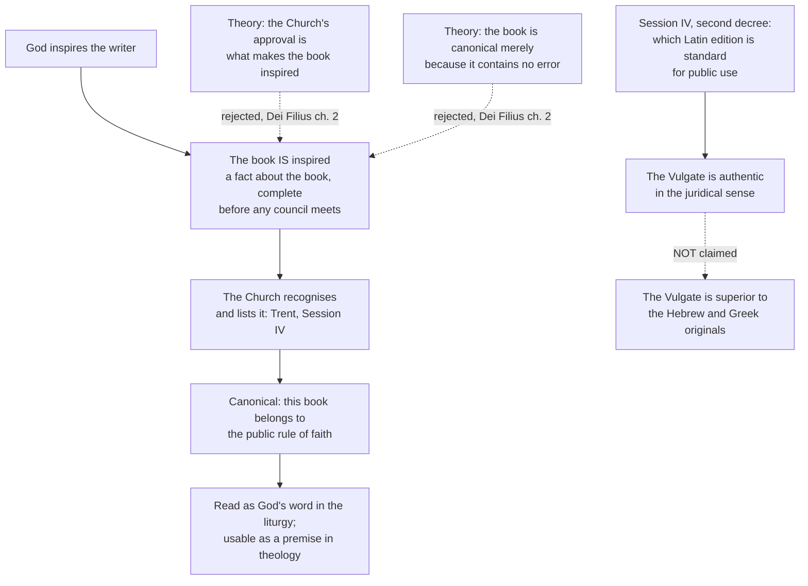

# Fundamental Theology · Lesson 3.3: The canon as defined

> ⏱ ~15 min · Module 3: Scripture and Tradition · Builds on: [3.2 Inerrancy](03-02-inerrancy.md) · Unlocks: [3.4 Tradition](03-04-tradition.md)

## Why this matters

The last two lessons said what Scripture *is* — God and a human writer both truly authoring ([3.1](03-01-inspiration.md)), and what follows for its truth ([3.2](03-02-inerrancy.md)). Neither tells you *which books*. That question is answered by an act, not by an argument: a council produced a list. And around that act cluster the two most common misreadings in the whole field — that the Church's approval is what made the books inspired, and that the same session declared the Latin Vulgate better than the Hebrew and Greek it was translated from. Both are false, both are believed by people on every side of the argument, and correcting them is exactly the level-reading skill this course exists to build.

## The idea

**Inspiration is a fact about a book. Canonicity is the Church's authoritative recognition of that fact, and the book's consequent place in the rule of faith.**

Hold the two apart. A book is inspired the moment God inspires it: that is done and finished before any council meets. Canonicity adds nothing *inside* the book. What it adds is public and juridical: this book, on this list, is one the Church reads as God's word in her liturgy, and one a theologian may cite as a premise without further argument. The list is the difference between "I judge this text inspired" and "the Church holds this text to be inspired."

That distinction is what makes the Church's act intelligible rather than absurd. A body that could *make* a book inspired by voting would be claiming to legislate about the past. A body that *recognises* inspiration is doing something quite different — bearing witness to what it received.

## The argument

**1. The Council of Trent, Session IV (8 April 1546), decree on the canonical scriptures.** The session issued two decrees; this is the first. In summary, it does three things:

> **(a)** It states that the council receives and venerates all the books of the Old and New Testament, "seeing that one God is the author of both" — and, in the same breath, the unwritten traditions, with an equal affection of piety and reverence.
> **(b)** It then prints the list, book by book, from the five books of Moses through the Apocalypse of John. Forty-six Old Testament books and twenty-seven New.
> **(c)** It binds: anyone who does not receive "the said books entire with all their parts, as they have been used to be read in the Catholic Church, and as they are contained in the old Latin vulgate edition" falls under the penalty the decree attaches — the council's standard anathema, the formula that marks a definition rather than an exhortation.

In words: here is the list; take it whole; and this is being defined, not recommended. Clause (a)'s second half — the traditions — is the subject of [3.4](03-04-tradition.md) and is deliberately left alone here.

Two features of the list repay attention. First, **it has no second rank.** Tobit and Judith and Wisdom and Sirach and Baruch and the two books of Maccabees stand in one undifferentiated enumeration with Genesis and Isaiah. The label *deuterocanonical* — "second canon" — is a post-Tridentine convenience for books whose reception took longer, and it marks a fact about history, not a lower grade of scriptural authority. How those books came to be disputed, from the Septuagint through Jerome and Augustine to the eve of the council, belongs to [`old-testament`](../../old-testament/syllabus.md) 6.1 and is not retold here.

Second, **"entire with all their parts"** is not padding. It reaches inside books: the Greek portions of Daniel and of Esther are covered by that phrase, so a Bible that printed Daniel without them would not be printing the canonical Daniel. The clause exists because the disputed material was not always a whole book.

**2. The same session's second decree, on the edition and use of the sacred books.** This is where the Vulgate appears, and it is a different kind of act:

> The old and vulgate edition, approved by long usage in the Church, is to be "in public lectures, disputations, sermons and expositions, held as authentic," and no one may presume to reject it "under any pretext whatever."

In words: in the Latin Church's public life, argue from this text. It is a ruling about which Latin edition is the standard one — juridical authenticity, the sense in which a notary's copy is "authentic." It is not a comparative judgement about Latin against Hebrew and Greek, and it does not say the translation is free of defects. The decisive internal evidence is in the very same decree, which orders that Scripture, and especially this edition, be "printed in the most correct manner possible" — you do not order the correction of a text you have just declared flawless. The corrected printing eventually appeared as the Clementine edition of 1592. Three and a half centuries later *Divino Afflante Spiritu* (1943) said the point outright: Trent's authenticity is juridical, not critical, and scholars should work from the original languages.

**3. Vatican I, *Dei Filius* ch. 2 (1870), on why those books are held canonical.** The chapter reaffirms Trent's list and then says why the Church holds it (Schaff's translation):

> "These the Church holds to be sacred and canonical, not because, having been carefully composed by mere human industry, they were afterwards approved by her authority; nor merely because they contain revelation, with no mixture of error; but because, having been written by the inspiration of the Holy Ghost, they have God for their author, and have been delivered as such to the Church herself."

In words: the Church did not confer anything. She received books that already had God for their author, and said so.

Notice what is being ruled out. The two rejected accounts — **subsequent approbation** (a purely human book that ecclesiastical approval later elevates) and **negative inspiration** (a book that counts as canonical merely because God kept error out of it) — were both floated by *Catholic* theologians. The chapter is not scoring a point against Protestants; it is closing off two in-house theories that made the Church's act do too much work in the first case and too little in the second. That is why the distinction matters practically: if approval made books inspired, the Church's authority would stand *above* the word rather than under it, and every later claim about the Magisterium as servant of the word ([4.1](04-01-the-magisterium.md)) would collapse.

**One foil, named once.** Trent's decree was framed against the shorter Old Testament list adopted by the Reformers, which set the disputed books apart from the canon proper. That is the position the definition answers. Whether it answers it well — the evidence, the arguments, the reply — is argued out in [`apologetics-catholic-claims`](../../apologetics-catholic-claims/syllabus.md), not here.

## Argument map

And the same session read as a levels problem, which is the form the exam questions take:

| Claim | Where it is made | Level |
|---|---|---|
| The enumerated books are sacred and canonical | Session IV, first decree | Divinely revealed and proposed as such — dogma, *de fide* |
| They must be received entire with all their parts | Session IV, first decree | Same act, same level |
| The old Vulgate is held authentic in public lectures, disputations, sermons and expositions | Session IV, second decree | A binding disciplinary decree of an ecumenical council — law, not a doctrinal definition, and modifiable as law |
| The Vulgate contains no error in faith and morals | Not stated in these words | Commonly drawn from the decree by theologians; a common theological reading, not a definition |
| The Vulgate renders any given verse better than the Hebrew or Greek | Nowhere | Not taught at all |
| How the list came to be what it is | Nowhere | Not addressed — a historical question the decree presupposes rather than answers |

## Worked examples

**Example 1 (mechanical — sorting four claims by what settles them).** A reading list gives you: (i) *Judith is inspired Scripture.* (ii) *The Greek portions of Daniel are Scripture.* (iii) *A Latin theology faculty should dispute from the Vulgate.* (iv) *Jerome doubted some of these books.*

(i) Defined at Trent, and denying it obstinately would be heresy — it is proposed as divinely revealed. (ii) Same act and same level, carried by "entire with all their parts" rather than by the enumeration, since Daniel is on the list either way. (iii) The second decree: a law about public use, binding as discipline when enacted and since modified in practice. Different decree, different kind of claim, different consequences for a dissenter. (iv) A historical claim about a Father's opinion, settled by reading Jerome — and true, which is why nobody should be startled by it. The council defined what the Church holds; it did not claim that every Father had always held it, and [`old-testament`](../../old-testament/syllabus.md) 6.1 works through the record.

**Example 2 (where it strains — the overstatement, and what survives correcting it).** An apologetics post: "Trent declared the Vulgate authentic, so Catholics hold that Jerome's Latin is the inspired text and that appeals to the Hebrew are a Protestant move."

Three things have gone wrong. *Authentic* has been read in its modern English sense of "genuine, original" rather than its juridical sense of "this is the official copy"; the decree has been silently promoted from discipline to doctrine; and inspiration has been transferred from the original composition to a translation of it, which no Catholic document teaches.

But now the harder half, which the correction must not lose: the decree still says something. It says a Latin theologian in 1550 could not evade a text by announcing that the Latin mistranslated it — the standard for public disputation was fixed, precisely so that argument could proceed on a shared text. That is a real and rather sensible claim. It is also, being law rather than dogma, exactly the sort of claim the Church can and did later adjust: *Divino Afflante Spiritu* sent exegetes back to the originals without touching a single defined truth. Correcting an overstatement and conceding the claim's actual force are the same operation.

## Watch out

- **You might think Trent invented the list.** It ratified one. The same enumeration had been given at Florence in 1442, and before that in North African councils of the late fourth century. What was new in 1546 was the solemn, universally binding form — and the anathema.
- **You might think "deuterocanonical" means "second-class."** It records that these books' reception was contested longer. In the decree there is one list and one status.
- **You might think the Church's approval is what makes a book Scripture.** *Dei Filius* ch. 2 forecloses it, and the two theories it forecloses were Catholic ones. Recognition, not conferral.
- **You might think Session IV is one decree.** It is two, and they do different jobs at different levels. The famous rule against interpreting Scripture contrary to the sense the Church has held, and against the unanimous consent of the Fathers, is in the *second* decree — and belongs to [3.4](03-04-tradition.md).
- **You might think the definition settles the history.** It does not touch how the books were collected, who disputed them, or why. A defined conclusion and an unexamined historical route are perfectly compatible, and pretending otherwise is the fastest way to lose an argument you could have won.

## One-liner

> Inspiration is God's act on a book; canonicity is the Church's recognition of it and the book's place in the rule of faith — and "authentic," in the Vulgate decree, is a word from law, not from textual criticism.

## Problems

**P1 (🟢) *(Exegetical.)*** For each claim, say (i) whether Trent's Session IV settles it and in which of its two decrees, and (ii) what level it carries. One sentence each.

(a) The book of Judith is sacred and canonical.
(b) The Greek portions of the book of Esther are Scripture.
(c) The Vulgate is to be used as the standard text in public disputations.
(d) The Vulgate renders Genesis 3:15 more accurately than the Hebrew does.

**P2 (🟡) *(Exegetical.)*** Re-read the sentence quoted from *Dei Filius* ch. 2 in "The argument." Name the two accounts of canonicity it rejects, and for each say what the Church's approval would have been doing if that account were true. Then state what follows, on the chapter's own account, about a book that is in fact inspired but appears on no list. 150 words or fewer.

**P3 (🔴, optional) *(Exegetical (a) · Evaluative (b).)*** An invented study-Bible note:

> "The Catholic canon was created at Trent in 1546, when the Council added seven books to the Bible and declared its Latin translation superior to the Hebrew and Greek. Catholics are therefore bound to hold that the Vulgate is the inspired text."

(a) Name three distinct errors, and for each say what the decrees actually do. (b) A Catholic reader replies that "recognise" is too weak a word for what Trent did, since before the decree the status of these books was genuinely unsettled in practice, and afterwards it was not — so the Church's act conferred something real, namely a public juridical status, even if it did not confer inspiration. Assess that reply in 150 words or fewer. Any verdict passes, provided you say what *Dei Filius* ch. 2 forecloses and what it leaves a description of the act free to add.

Solutions

**P1** *(Exegetical — strict.)*

**Must hit, strict:**
- (a) Yes — the first decree, by name in the enumeration. Divinely revealed and proposed as such: dogma, *de fide*, with an anathema attached.
- (b) Yes — the first decree, but carried by "entire with all their parts" rather than by the enumeration, since Esther is listed either way. Same level as (a).
- (c) Yes — the *second* decree, on the edition and use of the sacred books. A disciplinary decree of an ecumenical council: binding as law, not a doctrinal definition, and modifiable as law (as later practice and *Divino Afflante Spiritu* show).
- (d) No. Neither decree makes any comparative textual claim; "authentic" is juridical. Not taught at any level.

**Wrong turns:** putting (c) in the first decree, or giving it the same level as (a) — the session's two decrees are the whole point; answering (b) by citing the enumeration alone, which does not distinguish a whole book from its parts; treating (d) as merely "not defined" when it is not taught at all.

**Model answer:** (a) first decree, defined dogma. (b) first decree, same level, via "entire with all their parts." (c) second decree, disciplinary law of a council, not doctrine. (d) settled nowhere; the decree's "authentic" is juridical and makes no claim about Latin against Hebrew.

---

**P2** *(Exegetical — strict.)*

**Must hit, strict:**
- Rejected account 1: **subsequent approbation** — the books are the product of human industry alone, and ecclesiastical approval is what raises them to Scripture. Approval would then be *constitutive*: the Church makes a merely human book into God's word.
- Rejected account 2: **canonicity as mere absence of error** — the books count because they contain revelation with no admixture of error. Approval would then be a *certification of contents*, a quality check, with inspiration doing no work.
- What the chapter affirms instead: the books were written under the inspiration of the Holy Spirit, have God for their author, and were delivered *as such* to the Church.
- Consequence: such a book is inspired already; it is not Scripture-in-the-making awaiting a vote. What it lacks is not inspiration but the Church's public recognition — and so its place in the rule of faith, which is what the list supplies.

**Wrong turns:** treating either rejected view as a Protestant position (both were Catholic theories); saying the chapter teaches that the Church's act does nothing — it denies that the act confers *inspiration*, which is not the same as denying that the act does anything.

**Model answer:** The chapter rejects (1) that the books are human works later elevated by the Church's approval, which would make approval constitutive, and (2) that they are canonical merely for containing revelation without error, which would reduce approval to a certification of contents. It affirms instead that they were written by the Holy Spirit's inspiration, have God as author, and were handed to the Church already such. So a genuinely inspired book that appears on no list is still inspired: God's act is complete. What it lacks is the Church's public witness to that fact, and therefore its standing in the rule of faith — which is precisely what canonicity names and what a conciliar list confers.

---

**P3** *(a) exegetical — strict; (b) evaluative — any verdict.*

**Must hit, strict (a):** any three of —
1. "Created at Trent" / "added seven books": the first decree ratifies a list already given at Florence in 1442 and in the fourth-century African councils, and the enumeration has one rank with nothing marked as an addition. What was new was the binding solemn form.
2. "Declared its Latin translation superior to the Hebrew and Greek": the second decree declares the Vulgate *authentic* for public lectures, disputations, sermons and expositions — a ruling about which Latin edition is standard, with no comparative claim about the originals. The same decree orders a corrected printing.
3. "Bound to hold the Vulgate is the inspired text": no document teaches that a translation is inspired. Inspiration attaches to the composition of the books.
4. The note collapses two decrees of different kinds — a definition of doctrine and a disciplinary ruling — into one act.

**Must hit, any verdict (b):** state what *Dei Filius* ch. 2 forecloses (approval is not what makes a book inspired, and canonicity is not reducible to certified freedom from error), and then say what remains open for a description of the act — whether "recognise" alone captures the conferral of a public, juridical, binding status. Either conclusion passes: that "recognise" is adequate because the status follows from the fact recognised, or that a fuller description needs two verbs, one for the fact witnessed and one for the standing conferred.

**Wrong turns:** answering (b) by repeating (a); treating the reply as heterodox because it uses the word "confer," when the defined point concerns what is conferred (not inspiration), not the word; arguing the Protestant case for the shorter canon, which is neither part's question and belongs to [`apologetics-catholic-claims`](../../apologetics-catholic-claims/syllabus.md).

**Model answer (b), one of several:** The reply survives, with one correction. *Dei Filius* forecloses exactly one thing: that ecclesiastical approval is what makes a book inspired, or that canonicity reduces to certified inerrancy. It says nothing against the observation that the decree changed a book's standing in the Church's public life, since that standing is a juridical fact, not a property of the text. So the honest description takes two verbs: the council *recognises* what God did, and in recognising it *establishes* the book in the rule of faith, with the consequences that follow — read as God's word in the liturgy, citable as a premise without argument. "Recognise" alone is not wrong, only elliptical; it names the ground and omits the effect.

## Flashback

**F1 (🟡) *(Exegetical.)*** From a student paper:

> "Luke opens his Gospel by saying he investigated everything carefully and consulted those who were eyewitnesses from the beginning. So that prologue is Luke's own work, a historian's preface, rather than God's word — the inspired material starts afterwards."

Name the error in terms of the account of authorship in [3.1](03-01-inspiration.md), and say in one sentence what that account requires us to say about Luke's research. 100 words or fewer.

Solution

**Must hit, strict:**
- The paper treats divine and human authorship as competing shares of a text, so that whatever is visibly the human writer's must be subtracted from God's. The doctrine holds both as true authors of the whole — not two part-authors of separate portions.
- The human writer is a true author, not a passive recorder: his research, purposes, sources and style are genuinely his, and dictation accounts of inspiration are rejected precisely because they deny this.
- So Luke's investigation is not evidence against inspiration but an instance of it: God is the principal author working through a real human cause acting in its own way, and the prologue is as inspired as anything that follows.

**Wrong turns:** conceding the split and arguing the prologue is inspired "too" as a separate claim; defending inspiration by minimising the research, which trades one error for the dictation error.

**Model answer:** The error is treating authorship as divisible — as if what Luke did, God did not. Both are true authors of the whole text, so the human writer's evident work is not a subtraction from inspiration but the way inspiration operates: God as principal author through a real instrumental cause that acts according to its own nature. Luke's investigation is therefore part of the inspired composition, and the prologue is Scripture on exactly the same terms as the rest.

## Connections

- **Backward:** [3.1](03-01-inspiration.md) said what makes a book Scripture; this lesson says how we know *which* books, and the two must not be run together — that confusion is the substance of P2.
- **Forward:** [3.4](03-04-tradition.md) takes up the clause this lesson set aside, on the unwritten traditions received with equal affection of piety, and the second decree's rule of interpretation. The level-assignments made here are the pattern generalised in [4.4](04-04-the-ladder-of-doctrinal-authority.md), and the discipline-versus-doctrine distinction behind the Vulgate decree is the core skill of [4.5](04-05-reading-a-documents-weight.md).
- **Sideways:** the historical formation of the canon — Septuagint, Qumran, Jerome against Augustine, the African councils, Florence, Luther — is [`old-testament`](../../old-testament/syllabus.md) 6.1, with the New Testament's side in [`new-testament`](../../new-testament/syllabus.md); the argument with the Reformers' shorter list is [`apologetics-catholic-claims`](../../apologetics-catholic-claims/syllabus.md); Trent as an event belongs to [`church-history`](../../church-history/syllabus.md).
