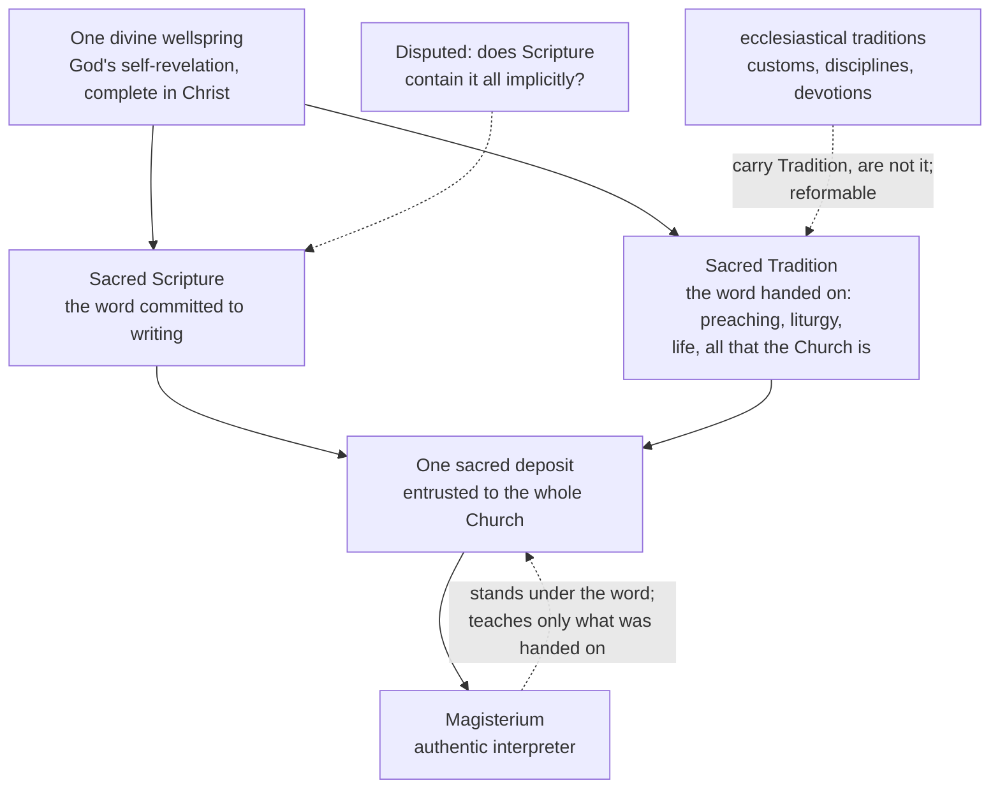

# Fundamental Theology · Lesson 3.4: Tradition

> ⏱ ~15 min · Module 3: Scripture and Tradition · Builds on: [3.3 The canon as defined](03-03-the-canon-as-defined.md) · Unlocks: [4.1 The Magisterium](04-01-the-magisterium.md)

## Why this matters

You have just watched the Church draw up a list of books and call them God's word. Ask the obvious question: on what authority, and from where did she know? Not from the books — no book in the canon contains the canon. Something already carried the faith before the list existed, and that something is what this lesson is about. It is also where the word "tradition" does more damage than any other word in theology, because it names two completely different things: a defined dogma and the parish's altar flowers. Learning to tell them apart is the whole lesson, and it decides in advance how you will read Module 4 — because a Magisterium that *invents* and a Magisterium that *hands on* are different institutions.

## The idea

**Tradition with a capital T is not a body of extra information.** It is the living transmission of the whole of what the Church is and what she believes — her doctrine, her worship, her life — handed from the apostles to their successors and from one generation to the next (Dei Verbum 8, paraphrased). It is a *handing over*, not an archive: what is transmitted is the gospel itself, in a community that preaches it, prays it, and lives it.

**Traditions with a small t are customs, disciplines and devotions.** Latin in the Roman Rite. Friday abstinence in its particular form. Celibacy for Latin-rite priests. The Rosary. These grow up inside the Church, often carry Tradition faithfully, and can be reformed or dropped — and some of them have been. Confusing the two produces both a bad conservatism (defending a discipline as though the faith hung on it) and a bad progressivism (arguing that because disciplines change, doctrine must too).

Two more fences before we go on:

- **Tradition is not a second revelation.** Public revelation closed with the apostles ([1.4](01-04-public-and-private-revelation.md)). Tradition transmits what was given; it does not add to it.
- **Tradition is not a second book.** There is no locked cabinet of unwritten apostolic sayings. Tradition lives in the Church's actual life — liturgy, creeds, the Fathers, the practice of prayer.

This whole architecture was articulated against a rival principle: the Reformers' *sola scriptura*, that Scripture alone is the rule of faith. That is the foil Trent's decree was framed against, and it is named here only as a foil — arguing it out belongs to [`apologetics-catholic-claims`](../../apologetics-catholic-claims/syllabus.md).

## Source

Trent, Session IV (1546), the decree concerning the canonical scriptures, in Waterworth's 1848 translation:

> …seeing clearly that this truth and discipline are contained in the written books, and the unwritten traditions which, received by the Apostles from the mouth of Christ himself, or from the Apostles themselves, the Holy Ghost dictating, have come down even unto us, transmitted as it were from hand to hand; (the Synod) following the examples of the orthodox Fathers, receives and venerates with an equal affection of piety and reverence, all the books both of the Old and of the New Testament—seeing that one God is the author of both—as also the said traditions, as well those appertaining to faith as to morals, as having been dictated, either by Christ's own word of mouth, or by the Holy Ghost, and preserved in the Catholic Church by a continuous succession.

The same decree closes with an anathema against anyone who does not receive the books entire with all their parts and who shall "knowingly and deliberately contemn the traditions aforesaid."

## The argument

**What the decree establishes.** Read it as four claims:

1. **The gospel is the source.** Promised by the prophets, promulgated by Christ, commanded to be preached by the apostles. *In words: the thing being transmitted is one, and it is Christ's own preaching.*
2. **It reaches us in two modes.** Written books *and* unwritten traditions. *In words: the apostolic preaching arrived by two routes, one of them a text.*
3. **Both are received with equal affection of piety and reverence.** *In words: a Catholic does not treat the handed-on faith as a lesser, optional supplement to the Bible.*
4. **Contempt for the traditions is anathematized.** *In words: this is not an exhortation, it is binding — rejecting apostolic Tradition as such puts you outside the Church's faith.*

All four are taught at conciliar weight. Note what the equality is *of*: piety and reverence — the attitude owed. The decree does not say the two modes are equal in extent, and that is exactly where the argument starts.

**The "two sources" question.** Grant everything above; one question remains open. Is every revealed truth found somewhere in Scripture, or are some found only in Tradition?

| | **Partim–partim** ("partly–partly") | **Material sufficiency** |
|---|---|---|
| Claim | Revelation is divided: some truths are in Scripture, others in Tradition alone | Scripture contains every revealed truth, at least implicitly; Tradition is its authentic interpreter and the guarantor of its sense |
| Tradition's role | Supplies content Scripture lacks | Unfolds and secures content Scripture holds in germ |
| Strongest point | Some dogmas have no explicit scriptural statement at all; and Scripture nowhere delivers its own canon | "Contained in" governs both nouns in Trent's sentence, and the Fathers habitually argue every doctrine *from* Scripture |
| Pressure point | Risks making Tradition a second revelation, which no Catholic account allows | Must explain what "implicitly" can bear before it means nothing |

**The drafting history.** An earlier draft of the decree is recorded as reading that the truth is contained *partly* in the written books and *partly* in unwritten traditions; the promulgated text replaced "partly–partly" with a plain "and." The acts of the council also record objections from the floor to putting traditions on a level with Scripture. Historians of the council standardly read that change as the council declining to settle the question — not as a decision for either side. A mid-twentieth-century argument (associated above all with J. R. Geiselmann) pressed the change further, as evidence that Trent positively left room for material sufficiency; that stronger reading was itself contested, and the contest is still live.

**Where the level sits: this is a freely disputed question** — the bottom rung of the ladder. A Catholic may hold either view. Saying "Trent defined two sources of revelation" is an overstatement of level, and it is graded here as an error.

**Dei Verbum 9–10 (Vatican II, 1965; paraphrased).** Section 9: Scripture and Tradition are bound closely together, flow from the same divine wellspring, and move toward the same end; both are to be received with equal devotion and reverence. It adds a sentence that both parties have to reckon with — that the Church does not draw her certainty about everything revealed from Scripture alone. Section 10: the two make up a single sacred deposit of the word of God, entrusted to the whole Church; the office of authentically interpreting that word belongs to the living teaching office; and that office **stands under the word, not over it** — listening to it, guarding it, teaching only what has been handed on.

That last clause is the hinge of Module 4. Dei Verbum is a dogmatic constitution, the council's heaviest genre; but Vatican II defined no new dogma, so its sentences carry the weight of what they restate. The servant-not-master principle restates something the tradition has always held, and [4.1](04-01-the-magisterium.md) takes it up directly.

Did *one wellspring* settle the dispute? No — and this is the standard reading, not a dodge. The council chose language that both schools could sign, exactly as Trent had.

## Argument map

Three arrows, three lessons: the solid ones are doctrine, the dotted one from the Magisterium is the limit on its power, and the dotted one from the bottom left is the distinction this lesson exists to teach.

## Worked examples

**Example 1 (mechanical — running the distinction).** The Roman Rite's Mass was normally celebrated in Latin for many centuries; after Vatican II it is normally celebrated in the vernacular. Has Tradition changed?

Sort the elements. *That the Church celebrates the Eucharist in obedience to Christ's command, and that the Mass is what the Church says it is* — apostolic Tradition, untouched. *That the rite is in Latin* — an ecclesiastical tradition of the Latin Church, venerable, and by its own nature reformable by the authority that established it; the Eastern Catholic churches never had it. The change is real and it is at the level of discipline. Verdict: Tradition did not change; a tradition did. Notice the test that did the work — ask what authority established the practice and what it would take to change it. Anything a council or a pope can alter by an act of governance was never in the deposit.

**Example 2 (where it strains — the Assumption).** In 1950 Pius XII defined, in *Munificentissimus Deus*, that Mary was assumed body and soul into heavenly glory, and defined it as **divinely revealed** — the top rung. But no text of Scripture states it. So what was the definition drawing on? The bull argues from the Church's faith and liturgy, from the consent of the Fathers and theologians, and from Mary's place in the mystery of redemption.

Now watch both schools handle it, at full strength. *Partim–partim*: this is the clean case — a revealed truth held on Tradition's testimony, with no scriptural statement to appeal to. *Material sufficiency*: the doctrine is implicit in what Scripture does say about Mary and about the victory over death in Christ, and Tradition is what made the implication visible; "contained implicitly" is doing real work, not a formality — the same work it does when Nicaea confesses the Son to be of one substance with the Father in a word Scripture never uses.

Neither reading is ruled out by any act of the Magisterium, and the definition itself does not adjudicate between them. That is what a freely disputed question looks like when you stop being nervous about it: two accounts of *how* the Church knows something both sides hold as dogma.

## Watch out

- **You might think Trent defined two sources of revelation.** It did not. It named two modes of transmission and required equal reverence for both. The extent question was left where the drafting change left it — open.
- **You might think "equal affection of piety and reverence" means Tradition and Scripture are the same kind of thing.** The equality is of the reverence owed, not of nature. Scripture is inspired; Tradition is not called inspired.
- **You might think "the Church has always done it this way" is an appeal to Tradition.** Usually it is an appeal to a tradition, and it may be a good prudential argument. Whether a practice belongs to the deposit is a question with an answer, and the answer is not settled by how old the practice feels.
- **You might think the Magisterium is a third source.** Dei Verbum 10 rules that out explicitly: it interprets the deposit and teaches only what has been handed on. A pope who announced a genuinely new revelation would be doing something the office has no power to do ([1.4](01-04-public-and-private-revelation.md), [4.1](04-01-the-magisterium.md)).
- **You might think material sufficiency is a Protestant concession.** It is not *sola scriptura*: it holds that Scripture's sense is not accessible apart from the Tradition and the Church that carry it. The two theses differ over the rule of faith, not just over contents.

## One-liner

> Tradition is the handing on of the whole gospel in a living Church, not a second book — Trent bound you to revere it and deliberately left open whether Scripture already contains all of it.

## Problems

**P1 (🟢) *(Exegetical.)*** For each item, say whether it belongs to apostolic **Tradition** or is an **ecclesiastical tradition** that could be changed, and give the one-clause reason.

(a) Priestly celibacy in the Latin Church
(b) The confession that the Son is of one substance with the Father
(c) The Church's knowledge of which books belong to the canon
(d) A parish's Friday evening devotion to an approved apparition

(e) Which of (a)–(d) is Trent's phrase "unwritten traditions" about? One sentence.

**P2 (🟡) *(Exegetical (a) · Evaluative (b).)*** Using the Source passage above:

(a) Quote the words that decide whether Trent taught *partim–partim*, and state one thing the decree settles and one thing it leaves open.
(b) Is Scripture materially sufficient? Argue either side in **150 words or fewer**, and deal with the sentence in Dei Verbum 9 about the Church not drawing her certainty about everything revealed from Scripture alone.

**P3 (🔴, optional) *(Exegetical.)*** An invented catechism handout:

> "Tradition is the Church's second source of revelation, defined at Trent: it holds the doctrines God chose not to put in the Bible. That is why the Pope can define new doctrines when the age requires them. And since our customs are part of Tradition, the way we have always done things here cannot be changed either."

Name the three distinct errors and correct each in one sentence. For one of them, say whether the claim is *false*, *overstated as to level*, or *a disputed question presented as settled* — and say which. 150 words or fewer.

Solutions

**P1** *(Exegetical — strict.)*

**Must hit, strict:**
- (a) Ecclesiastical tradition — a discipline of the Latin Church, established and alterable by Church authority; the Eastern Catholic churches ordain married men, which is the proof it is not doctrine.
- (b) Apostolic Tradition — the content of the faith, defined at Nicaea; the *word* is a fourth-century formulation, the thing confessed is not.
- (c) Apostolic Tradition — Scripture contains no list of its own books, so the canon is known through the Church's reception of the apostolic preaching ([3.3](03-03-the-canon-as-defined.md)).
- (d) An ecclesiastical tradition, and a devotion at that — private revelation binds no one ([1.4](01-04-public-and-private-revelation.md)), and the parish could stop tomorrow without loss to the faith.
- (e) (b) and (c). Trent's "unwritten traditions" are the apostolic ones — received from Christ or the apostles and handed down — not customs.

**Wrong turns:** calling (b) an ecclesiastical tradition because *homoousios* is not a biblical word — that confuses the formula with what it confesses; calling (c) a tradition of the small sort because the list was settled late, which confuses when a thing was defined with when it was true; treating (a) as doctrine because it is ancient and universal in the West.

**Model answer:** (a) tradition, disciplinary. (b) Tradition, doctrinal. (c) Tradition — Scripture cannot supply its own table of contents. (d) tradition, devotional. (e) (b) and (c) only.

---

**P2** *(a) exegetical — strict; (b) evaluative — any verdict.*

**Must hit, strict (a):** the deciding words are "contained in the written books, **and** the unwritten traditions" — the conjunction, where the draft had "partly … partly." Settled: that the gospel reaches us by both modes, and that both are received with equal affection of piety and reverence (with an anathema on contemning the traditions). Left open: whether some revealed truths are in Tradition alone — the extent question. Credit for adding that the equality asserted is of reverence, not of extent.

**Must hit, any verdict (b):** state the thesis precisely (Scripture contains every revealed truth at least implicitly; Tradition is its authentic interpreter, not a supplement). Handle the Dei Verbum 9 sentence one of two ways, explicitly: either read it as epistemological — the Church's *certainty* comes from Scripture-with-Tradition, which says nothing about where the content lies — or read it as material, and then say what that costs the sufficiency thesis. Acknowledge that the question is freely disputed, so the argument is for a position, not against a heresy.

**Wrong turns:** arguing against *sola scriptura* instead of the question asked — material sufficiency is not *sola scriptura*, and the confusion wastes the whole answer; claiming Trent or Vatican II settled it; treating "implicitly" as unlimited without saying what would count as too thin.

**Model answer (b), one of several):** Scripture is materially sufficient. Trent's "contained in" governs both nouns, and the Fathers argue every doctrine from Scripture even when the argument needs the Church's reading to work. Dei Verbum 9's sentence is about certainty, not content: the Church could not know with certainty that Scripture teaches the Assumption, or which books are Scripture at all, from the text alone — Tradition supplies the assurance and the sense. That is compatible with every revealed truth lying implicitly in the text. The cost is real: "implicitly" must mean more than "not contradicted," and the honest test is whether the Fathers actually made the scriptural argument. Where they did not, the *partim–partim* reading is stronger, and this remains a freely disputed question.

---

**P3** *(Exegetical — strict.)*

**Must hit, strict:** the three errors —
1. "A second source of revelation… doctrines God chose not to put in the Bible" — stated as defined at Trent, it is **a disputed question presented as settled**: Trent's draft said "partly–partly" and the promulgated text says "and." (The stronger form — Tradition as a *separate revelation* — is false outright on any Catholic account, since public revelation closed with the apostles.)
2. "The Pope can define new doctrines" — **false**. Dei Verbum 10: the teaching office stands under the word and teaches only what has been handed on. A definition proposes what was already revealed; it does not add.
3. "Our customs are part of Tradition… cannot be changed" — **false**, and the lesson's central confusion: parish customs are traditions, reformable by the authority that permits them.

**Wrong turns:** listing "it's too confident" as an error — the problem asks for errors of content; conceding error 1 too easily by declaring material sufficiency the Catholic position, which repeats the handout's mistake in the opposite direction.

**Model answer:** (1) Trent named two modes of transmission and left the extent question open — the handout takes a side in a free dispute and calls it a definition. (2) Nothing can be defined that was not handed on; the Magisterium serves the word, it does not receive new revelation. (3) Customs are traditions, not Tradition, and are changeable by the authority that established them. Error (1) is a disputed question presented as settled.

## Flashback

**F1 (🟡) *(Exegetical.)*** From [3.2](03-02-inerrancy.md). A study-group leader says: "Vatican II fixed inerrancy. Since Dei Verbum says Scripture teaches the truth God wanted written down for the sake of our salvation, the Bible's historical and scientific statements are simply outside the doctrine."

(a) Name the two readings of that clause. (b) Say which part of the sentence is settled teaching and which part is disputed among Catholic theologians. (c) Name the 1893 encyclical that taught inerrancy without restriction, and say in a clause what it claimed. **120 words or fewer.**

Solution

**Must hit, strict:**
- (a) The **restrictive** reading: the salvation clause limits what is asserted without error to matters bearing on salvation. The **non-restrictive** reading: the clause states the purpose and formality under which everything in Scripture is asserted, not a subset of its content — all Scripture's genuine assertions are true.
- (b) Settled: that Scripture teaches, firmly, faithfully and without error, the truth God willed put there for our salvation. Disputed: which reading of the clause is right — so the leader has taken one side of a live dispute and reported it as the council's settled meaning.
- (c) *Providentissimus Deus* (Leo XIII, 1893): inspiration extends to all of Scripture, and it is not permissible to confine inspiration to some parts or to concede that the sacred writer erred.

**Wrong turns:** treating the restrictive reading as condemned — it is held by serious Catholic theologians; forgetting that determining what a passage *asserts* is prior to asking whether it is true, which is where genre does its work.

## Connections

- **Backward:** [3.3](03-03-the-canon-as-defined.md) is the same decree of Trent, read for the canon; this lesson reads the clause immediately before it. [3.1](03-01-inspiration.md) explains why only one of the two modes is called inspired.
- **Forward:** [4.1](04-01-the-magisterium.md) builds on Dei Verbum 10's servant clause; [4.4](04-04-the-ladder-of-doctrinal-authority.md) is where "freely disputed" gets its full definition and its assent.
- **Sideways:** [5.1](05-01-vincent-of-lerins.md) and [5.2](05-02-newmans-theory-of-development.md) ask how something implicit becomes explicit without becoming something else — the question Example 2 leaves standing. [`patristics`](../../patristics/syllabus.md) supplies the Fathers whose actual practice both schools appeal to, and [`apologetics-catholic-claims`](../../apologetics-catholic-claims/syllabus.md) argues the case against *sola scriptura* that this lesson only named.
