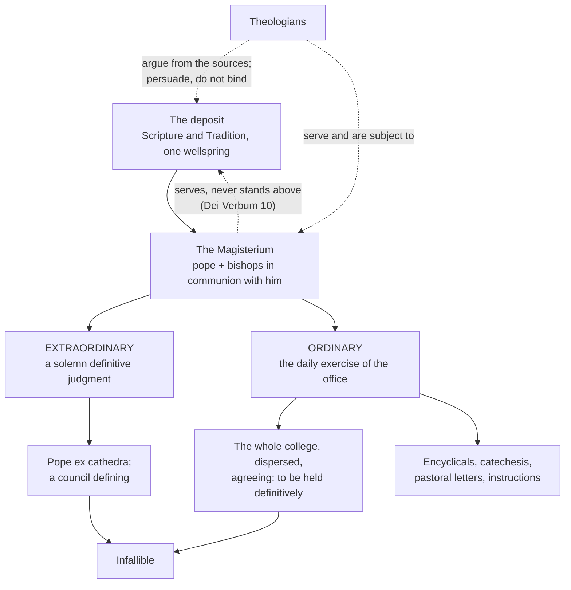

# Fundamental Theology · Lesson 4.1: The Magisterium

> ⏱ ~15 min · Module 4: The Magisterium and the ladder of authority · Builds on: [3.4 Tradition](03-04-tradition.md) · Unlocks: [4.2 Infallibility and its conditions](04-02-infallibility-and-its-conditions.md)

## Why this matters

Module 3 ended with a promise and a limit. The promise: there is an office charged with interpreting the deposit authentically. The limit: that office stands *under* the word it interprets. Now the practical question — when somebody says "the Church teaches X," which act are they pointing at, and how much does that act weigh?

You cannot answer it without a grid. Almost every argument about Catholic doctrine that goes badly goes badly here: an encyclical gets promoted to a definition, a bishop's letter gets treated as though it bound the universal Church, a papal remark to journalists gets treated as an act of teaching — or, in the other direction, something genuinely taught infallibly gets waved away because "it was never defined." This lesson builds the grid. [4.2](04-02-infallibility-and-its-conditions.md) uses it to check infallibility, [4.3](04-03-religious-submission.md) to say what assent is owed, and [4.4](04-04-the-ladder-of-doctrinal-authority.md) to turn it into the ladder every other course in this field cites.

## The idea

**The Magisterium is an office, not a body of opinion.** It is the charge to teach in Christ's name, held by the pope and by the bishops in communion with him — the college with the pope as its head, never the college apart from him. Two consequences, both easy to lose.

It is an *office*, so its authority does not track the learning or intelligence of the man holding it. A bishop who has read nothing since seminary teaches authentically in his diocese; a brilliant theologian who has read everything does not teach authentically at all, because that is not what a theologian does. The charism is attached to the function of guarding the deposit, not to anyone's qualifications.

And it is a *teaching* office, so its object is fixed in advance. Dei Verbum 10 (Vatican II, 1965, paraphrased): authentically interpreting the word of God, written or handed on, has been entrusted to the living teaching office, which exercises its authority in the name of Jesus Christ — and that office is **not above the word of God but serves it**, listening to it devoutly, guarding it reverently, expounding it faithfully, and drawing from the one deposit everything it proposes for belief as divinely revealed.

That is a constitution in the legal sense: it grants a power and bounds it. The power is to interpret with authority. The bound is that there is nothing to interpret except what was handed on ([1.4](01-04-public-and-private-revelation.md): public revelation closed with the apostles). A Magisterium that could originate doctrine would be a second wellspring, and [3.4](03-04-tradition.md) showed why no Catholic account allows one.

**The word "authentic" is a trap in English.** *Magisterium authenticum* does not mean "genuine, as opposed to forged." It is the vocabulary of law: an *authentic interpretation* of a statute is one given by an authority competent to bind, as against a private or scholarly reading, however good. So authentic magisterium means **authoritative** teaching — carrying the office's power to oblige. You met the same Latin word in the same register one module ago, when Trent called the Vulgate *authentic* for public use ([3.3](03-03-the-canon-as-defined.md)).

Keep the consequence in view, because it is the most useful thing in this lesson: **authentic does not mean infallible.** Most authentic teaching is not infallible. It still obliges — that is [4.3](04-03-religious-submission.md) — but differently, and to a different degree.

## The argument

Two axes classify every magisterial act. They are independent, which is why they form a grid rather than a line.

**Axis 1 — the mode: extraordinary or ordinary.**

1. **Extraordinary** = a **solemn definitive judgment**: a pope defining *ex cathedra*, or an ecumenical council defining. *In words: the Church stops, formally settles a question, and says so in words designed to be unmistakable — classically a canon with an anathema attached ([1.1](01-01-what-fundamental-theology-asks.md)).*
2. **Ordinary** = everything else the office does, day after day: encyclicals, conciliar teaching that does not define, catechesis, preaching, pastoral letters, curial instructions issued with papal approval. *In words: the normal running of a teaching office, which mostly does not proceed by handing down verdicts.*

Note the proportion: extraordinary acts are rare, and if you only know how to read definitions you cannot read the Church's teaching at all. Note too that "extraordinary" attaches to the *act*, not the organ — an ecumenical council is the solemn organ par excellence, and Vatican II defined nothing new, so its constitutions teach in the ordinary mode and carry the weight of what they restate ([3.4](03-04-tradition.md)).

**Axis 2 — the extent: universal or particular.**

3. **Universal** = the act is that of the pastors of the whole Church: the pope teaching the universal Church, or the college of bishops with its head — **gathered** in council, or **dispersed** across the world in their own sees.
4. **Particular** = a single bishop teaching his own diocese, an episcopal conference teaching its territory, a regional or plenary council. Real teaching authority, genuinely binding on those subject to it, and limited in reach.

Slow down over the dispersed case in (3). The bishops of the world do not have to be in the same room to be teaching as a college — which is not a loophole but the ordinary condition of an episcopate gathered in council perhaps once a century and teaching every Sunday in between.

**Where the axes cross: the sentence that does the work.** Vatican I, *Dei Filius* ch. 3 (1870), in the translation in Schaff's *Creeds of Christendom* — the same sentence you read in [2.1](02-01-the-act-of-faith.md), now for a different reason:

> "Further, all those things are to be believed with divine and Catholic faith which are contained in the Word of God written or handed down, and which the Church, either by a solemn judgment, or by her ordinary and universal magisterium, proposes for belief as having been divinely revealed."

*In words: there are two routes by which something becomes dogma, and only one of them is a definition.* A council defining is the first. The whole episcopate, scattered through the world, agreeing in teaching one doctrine as divinely revealed and to be held, is the second — and it produces the same result with no document, no session, no anathema. Lumen Gentium 25 (Vatican II, paraphrased) gives the second route's conditions: the bishops, even dispersed, teach infallibly when they preserve the bond of communion among themselves and with the successor of Peter, teach authentically on a matter of faith or morals, and **agree on one position as definitively to be held**.

This is the combination that surprises people. **Ordinary and universal teaching can be infallible without any definition ever having been made.** Most of what every Christian has always believed is in this category — that God is to be worshipped, that killing the innocent is wrong. No council defined them because no one denied them hard enough to require it. A definition is a response to a crisis, so its absence is evidence about the history of controversy, not about the level of the teaching. [4.2](04-02-infallibility-and-its-conditions.md) works the conditions properly, including the rule that keeps this from becoming a licence to claim infallibility for anything.

**Magisterium and theologians: two authorities, different in kind.** A theologian has real authority, and the tradition has always said so; the medieval schools spoke of two chairs, the pastor's and the master's. The difference is not rank on one scale but *what makes the authority work*:

| | **Magisterium** | **Theologians** |
|---|---|---|
| Source of authority | Office: a commission to teach in Christ's name, the charism attached to the function | Competence: mastery of the sources and the quality of the argument |
| What it produces | Acts that bind, at a gradable level | Arguments that persuade; a consensus that carries real weight |
| How it can fail | By overreaching — teaching what was not handed on | By being wrong, which is normal and correctable |
| Settles a doctrinal question? | Yes, by acting | No, on its own |

Neither can do the other's job. The Magisterium does not settle questions by out-arguing theologians; theologians do not settle them by out-voting the Magisterium. *Donum Veritatis* (1990), an instruction of the Congregation for the Doctrine of the Faith, is the modern document on the relation — theology's work as seeking understanding of what is believed, its service to the Magisterium, and the hard case of a theologian with genuine difficulties over a non-definitive teaching. That case, and the difference between difficulty and dissent, is [4.3](04-03-religious-submission.md).

## Argument map

The grid the rest of the module runs on:

| | **Universal** (pastors of the whole Church) | **Particular** (one bishop, one conference, one region) |
|---|---|---|
| **Extraordinary** (a solemn definition) | A pope defining *ex cathedra* (1854, 1950); the canons of an ecumenical council — Trent Session IV, *Dei Filius*. **Infallible.** | **Empty, and necessarily so:** a definitive judgement for the whole Church can only come from the whole Church's pastors, so no single bishop, regional council or conference has the power to define. |
| **Ordinary** (the daily exercise) | (i) The dispersed college agreeing that a doctrine is to be held definitively — *the* "ordinary and universal magisterium," **capable of being infallible with no document at all**. (ii) A pope's own teaching of the whole Church: encyclicals, exhortations, audiences. Authentic; **not** infallible by that fact. | A bishop's pastoral letter or catechesis; a conference's doctrinal declaration, authentic magisterium only under the conditions of *Apostolos Suos* (1998) — broadly unanimity, or a qualified majority with review by the Holy See. Authentic; **never** infallible. |

The two entries in the bottom-left cell are *not the same thing*, and sliding from (ii) to (i) is the commonest overstatement in the whole subject. An encyclical is universal in address — the pope writes to the whole Church — and that does not make it an exercise of the ordinary *and universal* magisterium in the technical, infallibility-bearing sense of *Dei Filius*, which is about the agreement of the episcopate.

## Worked examples

**Example 1 (mechanical — one teacher, three acts, three classifications).** Everything below is done by the same man, the pope. Classify each.

- *A series of Wednesday general audience catecheses on the Psalms.* Ordinary, universal in address. Authentic teaching of the universal pastor, at the low-insistence end of the genre scale; nothing is defined.
- *An encyclical letter on the moral limits of economic life.* Ordinary, universal in address. Authentic teaching in a heavy genre, heavier again if it repeats what his predecessors taught — repetition and manner of speaking are among the signs of the mind of the Magisterium ([4.3](04-03-religious-submission.md), [3.2](03-02-inerrancy.md)). Still not a definition, and not infallible on that account.
- *In 1950, in* Munificentissimus Deus, *Pius XII defines that Mary was assumed body and soul into heavenly glory.* Extraordinary, universal. A definition *ex cathedra* proposing a truth as divinely revealed — top rung, and one of only two papal acts universally agreed to be *ex cathedra* ([4.2](04-02-infallibility-and-its-conditions.md)).

The moral: **the organ does not fix the mode.** "The pope said it" tells you who taught, and therefore the extent; it tells you nothing about whether the act was a definition. You have to look at what the act does.

**Example 2 (where it strains — infallibility with no definition).** In 1994 John Paul II issued *Ordinatio Sacerdotalis*, an apostolic letter, declaring that the Church has no authority to confer priestly ordination on women and that this judgement is to be definitively held by all the faithful. An apostolic letter is an ordinary-magisterium genre. So: is the teaching infallible, and if so, how? Follow the acts, because the temptation is to round the case off.

- In 1995 the Congregation for the Doctrine of the Faith, replying to a formal question and with the pope's approval, stated that the teaching requires definitive assent, being founded on the written word of God, constantly preserved and applied in the Tradition, and **set forth infallibly by the ordinary and universal magisterium**. So the claim is not that the 1994 letter defined anything; it is that the teaching was *already* infallible by the second route in *Dei Filius* ch. 3, and the letter confirms it.
- In 1998 the CDF's doctrinal commentary accompanying *Ad Tuendam Fidem* listed the teaching among its examples of truths **to be held definitively** — the second paragraph of the Profession of Faith, the rung of definitive teaching rather than of what is proposed as divinely revealed ([4.4](04-04-the-ladder-of-doctrinal-authority.md)).
- A number of Catholic theologians, Francis Sullivan among them, argued that the conditions for ordinary-universal infallibility had not been *shown* to be met in this case, whatever the teaching's own merits, since establishing the agreement of the whole episcopate is a demanding historical task.

Where that leaves you: the teaching is to be definitively held, stated plainly and repeatedly; **how** it is infallible and **which** rung it occupies is what theologians argue about, and the 1995 and 1998 texts are themselves read differently on the point. The disciplined answer states all three items and collapses them neither into "it's a dogma" nor into "it was never defined, so it's an opinion" — opposite level errors, both graded as errors here. And notice what the case does to the grid: the classification of the *document* (apostolic letter, ordinary) and the level of the *teaching* came apart entirely, because the doctrine may have a history older than the document that confirms it.

## Watch out

- **You might think "authentic" means "genuine."** It means authoritative — competent to bind — in the same legal register as Trent's "authentic" Vulgate ([3.3](03-03-the-canon-as-defined.md)). And authentic teaching is usually *not* infallible.
- **You might think an encyclical is an exercise of the ordinary and universal magisterium.** It is ordinary, and it is addressed to the universal Church, and those two facts do not add up to the technical term, which names the agreement of the dispersed episcopate. The conflation manufactures infallibility out of genre, and is the error [4.2](04-02-infallibility-and-its-conditions.md) spends its length preventing.
- **You might think "it was never defined" settles anything.** By *Dei Filius* ch. 3 there are two routes to dogma and only one is a definition. Definitions answer crises; their absence is a fact about controversy, not about doctrine.
- **You might think a council always teaches extraordinarily.** Vatican II defined nothing new, and said as much; its constitutions carry the weight of what they restate. "Conciliar" is about the organ, "extraordinary" about the act.
- **You might think an episcopal conference is a level of the Magisterium in its own right, or that a curial dicastery teaches on its own authority.** A conference is particular, and its doctrinal declarations are authentic magisterium only under set conditions (*Apostolos Suos*, 1998); a dicastery's instruction carries the authority the pope gives it, which is [4.5](04-05-reading-a-documents-weight.md)'s reading skill.
- **You might think the pope's every utterance is an act of teaching.** A press-conference remark, a private letter, a book published under his own name as a private theologian: none are magisterial acts, and treating them as such is [1.1](01-01-what-fundamental-theology-asks.md)'s parish-bulletin error in a new costume.

## One-liner

> The Magisterium is the office of teaching in Christ's name, held by the pope and the bishops with him and bounded by a deposit it serves and cannot add to — and every act it performs is extraordinary or ordinary, universal or particular, with the ordinary-and-universal cell able to be infallible without a definition ever being written.

## Problems

**P1 (🟢) *(Exegetical.)*** Place each act on the grid — **extraordinary or ordinary**, **universal or particular** — in one sentence each.

(a) The canons on justification promulgated by the Council of Trent, Session VI (1547).
(b) An encyclical letter of a reigning pope on the moral evaluation of warfare.
(c) A pastoral letter from the bishop of a single diocese instructing his people on the same subject.
(d) The bishops of the world, each in his own see, concurring in teaching that direct killing of the innocent is always gravely wrong and is to be definitively held.
(e) One cell of the grid has no instances. Name it and say in one clause why it must be empty.

**P2 (🟡) *(Exegetical (a) · Evaluative (b).)*** Using the sentence quoted from *Dei Filius* ch. 3 in "The argument":

(a) Name the two routes by which a truth comes to be believed with divine and Catholic faith, and state what follows for a Catholic who argues: "Show me the definition, or it isn't dogma." Be precise about what the sentence does and does not settle.
(b) A critic presses further: an infallibility with no defining act is unfalsifiable, since any claimed instance can be defended by asserting that the bishops agreed, and nobody has counted. Say what the objection gets right and what resources a Catholic account has for answering it. **150 words or fewer**, any verdict.

**P3 (🔴, optional) *(Exegetical.)*** An invented paragraph from a theology blog:

> "The most respected sacramental theologian alive holds a chair at a pontifical university and his textbook is used in half the seminaries in the world. When he says the Church teaches X, that settles what the Church teaches — he knows the sources better than anyone. Meanwhile some bishop with no doctorate has issued a pastoral letter for his diocese saying the opposite. He isn't a scholar, so his letter carries no weight; and anyway a single diocese can't bind anyone, so it's just an opinion too. Two opinions, and the better-qualified man wins."

Name the distinct errors — there are at least three — and correct each in one sentence. Then say, in one further sentence each: what the professor's judgement would have to be joined to in order to settle a doctrinal question, and what the bishop's letter actually does and for whom. **150 words or fewer.**

Solutions

**P1** *(Exegetical — strict.)*

**Must hit, strict:**
- (a) **Extraordinary, universal.** An ecumenical council's canons are solemn definitive judgements, with the anathema formula that marks a definition rather than an exhortation.
- (b) **Ordinary, universal.** An encyclical is a day-to-day genre of the teaching office, addressed by the universal pastor to the whole Church. Authentic teaching; not a definition, and not infallible on account of the genre.
- (c) **Ordinary, particular.** A diocesan bishop teaches authentically for those entrusted to him; the reach is his diocese, and no pastoral letter is ever infallible.
- (d) **Ordinary, universal** — and this is the technical "ordinary and universal magisterium" of *Dei Filius* ch. 3 and Lumen Gentium 25, the case that can be infallible with no document at all, because the three conditions (communion, authentic teaching on faith or morals, agreement that it is to be held definitively) are all present.
- (e) **Extraordinary and particular.** Empty because a solemn definition for the whole Church can only be the act of the whole Church's pastors — the pope, or the college with its head; no single bishop, regional council or conference has the power to define.

**Wrong turns:** calling (b) infallible because it is papal and addressed to everyone — the error the grid exists to prevent; calling (d) extraordinary because it is infallible, which confuses the mode of the act with the certainty of the teaching; calling (d) merely "ordinary" without noticing that the concurrence of the whole episcopate is what makes it universal; saying the empty cell is empty "because it has never happened," which is a historical claim where the answer is a claim about power.

**Model answer:** (a) extraordinary, universal. (b) ordinary, universal in address, authentic, not infallible. (c) ordinary, particular. (d) ordinary and universal in the technical sense — infallible without a definition. (e) extraordinary-and-particular; defining for the whole Church is beyond a particular authority's competence.

---

**P2** *(a) exegetical — strict; (b) evaluative — any verdict.*

**Must hit, strict (a):**
- Route 1: a **solemn judgment** — a definition by a pope *ex cathedra* or by an ecumenical council.
- Route 2: the **ordinary and universal magisterium** — the college of bishops with the pope, dispersed through the world, proposing the truth as divinely revealed and to be held.
- Both routes propose the same thing at the same level: divinely revealed, to be believed with divine and Catholic faith. The sentence therefore refutes "show me the definition or it isn't dogma" directly — the demand assumes route 1 is the only route.
- Say what the sentence does *not* settle: it does not tell you how to establish, in a contested case, that route 2 has actually been travelled. Naming a route is not the same as supplying a test, and the test is [4.2](04-02-infallibility-and-its-conditions.md)'s business.

**Must hit, any verdict (b):** state the objection at its real strength — the conditions are about the agreement of a scattered body, so verifying them is a historical and empirical task nobody has performed exhaustively. Then name at least one resource the account actually has: that the conditions are stated and therefore checkable in principle (communion, authentic teaching on faith or morals, agreement that it is definitively to be held); that the tradition's own rule is that nothing counts as infallibly taught unless that is clearly established, which puts the burden on the claimant rather than the doubter; or that the ordinary evidence is the constant and unanimous witness of the liturgy, catechesis and the Fathers, not a poll. Either verdict passes.

**Wrong turns:** answering (b) by asserting that the Holy Spirit guarantees it, which concedes the objection's point about checkability rather than meeting it; treating (a) as if route 2 produced a *lower* level than route 1 — both propose a truth as divinely revealed; arguing about a particular contested teaching instead of the structural question asked.

**Model answer (b), one of several:** The objection is right that no one has canvassed the world's bishops, and that a claim of ordinary-universal infallibility is therefore an argued historical claim, not a certificate. But it is checkable in principle, because the conditions are stated: communion, authentic teaching on faith or morals, and concurrence that the doctrine is to be held definitively. The evidence is the ordinary evidence of what the Church has universally taught, prayed and catechised — thin for a novel thesis, overwhelming for the prohibition of killing the innocent. And the tradition's own rule places the burden on whoever claims infallibility, not on the person who doubts. That does not make disputed cases easy; it makes them arguable, which is what the objection denied.

---

**P3** *(Exegetical — strict.)*

**Must hit, strict:** the errors —
1. **The theologian's authority is taken to be magisterial.** It is authority of a different kind: competence and argument, not office. No degree of eminence produces an act of teaching in Christ's name.
2. **The bishop's authority is made to depend on scholarship.** The charism attaches to the office, not to the man's qualifications; a bishop with no doctorate teaches authentically and a professor with three does not.
3. **"Particular" is read as "non-binding."** A diocesan pastoral letter is authentic magisterium for that diocese, and religious submission is owed to it by those entrusted to him ([4.3](04-03-religious-submission.md)) — limited reach is not zero weight.
4. **The two are placed on one scale and compared** ("two opinions, the better-qualified man wins"). They are not competitors; neither can perform the other's function.

**Wrong turns:** replying that theologians have no authority at all — they have real authority, and *Donum Veritatis* (1990) describes the role; concluding that the bishop is therefore *right* about the substance, which the problem never asks and the classification cannot decide.

**Model answer:** The blog confuses two kinds of authority. The professor's rests on competence: his arguments persuade, and a strong theological consensus carries genuine weight, but nothing he concludes is an act of teaching in the Church's name. The bishop's rests on office, which is why his lack of a doctorate is irrelevant. "Particular" bounds the reach of his letter, not its force: for his own faithful it is authentic magisterium asking religious submission. The professor's judgement would settle the question only if joined to a magisterial act — it can inform, prepare and argue for one, and cannot substitute for it. And the bishop's letter binds his diocese, and nobody else's, which is a limit and not a dismissal.

## Flashback

**F1 (🟡) *(Exegetical.)*** From [3.3](03-03-the-canon-as-defined.md). A publisher's Catholic Bible does two things: it gathers Baruch, Sirach, Tobit, Judith, Wisdom and the two books of Maccabees into a separate section headed *"Deuterocanonical books: received later by the Church and of secondary authority,"* and it prints Daniel ending at chapter 12.

(a) For each of the two choices, say what in Trent's Session IV it runs against, and at what level that teaching sits. (b) The section heading contains one historically accurate clause and one claim about status. Separate them. **120 words or fewer.**

Solution

**Must hit, strict:**
- (a) **The separate section with a lower grade** runs against the first decree's enumeration, which is one undifferentiated list with no second rank: these books stand with Genesis and Isaiah. Level: divinely revealed and proposed as such — dogma, with an anathema attached. **Daniel ending at chapter 12** drops the Greek portions and runs against "entire with all their parts," the clause that reaches inside books precisely because the disputed material was not always a whole book. Same decree, same level.
- (b) Accurate: that the reception of these books was contested longer — *deuterocanonical* records a fact about history. A claim about status, and false: "of secondary authority." The decree knows one list and one status.

**Wrong turns:** treating the layout as a mere editorial convenience when the heading makes a doctrinal claim; saying the Greek portions of Daniel are covered by the enumeration, when Daniel is listed either way and it is "entire with all their parts" that does the work; assigning the second point a lower level than the first because it concerns part of a book rather than a whole one.

## Connections

- **Backward:** [3.4](03-04-tradition.md) supplied the servant clause of Dei Verbum 10 that bounds this whole office, and [3.3](03-03-the-canon-as-defined.md) supplied the juridical sense of *authentic* that the phrase "authentic magisterium" uses. [2.1](02-01-the-act-of-faith.md) quoted the *Dei Filius* sentence read here for its second half.
- **Forward:** [4.2](04-02-infallibility-and-its-conditions.md) takes the ordinary-and-universal cell and asks when its conditions are actually met, and what the *ex cathedra* conditions are; [4.3](04-03-religious-submission.md) asks what is owed to everything in the grid that is not infallible, and takes up *Donum Veritatis* on the theologian; [4.4](04-04-the-ladder-of-doctrinal-authority.md) converts the grid into the ladder; [4.5](04-05-reading-a-documents-weight.md) adds the genre-reading skill for instructions, exhortations and catechisms.
- **Sideways:** the papacy as an institution, and the history behind the 1870 definition, belong to [`ecclesiology-and-mariology`](../../ecclesiology-and-mariology/syllabus.md); the councils as events to [`church-history`](../../church-history/syllabus.md); the case against the whole structure, argued out, to [`apologetics-catholic-claims`](../../apologetics-catholic-claims/syllabus.md). Aquinas's ranking of the authorities a theologian may argue from is [5.4](05-04-sacred-doctrine-as-a-science.md), and [`thomistic-synthesis`](../../thomistic-synthesis/syllabus.md) takes it further.
