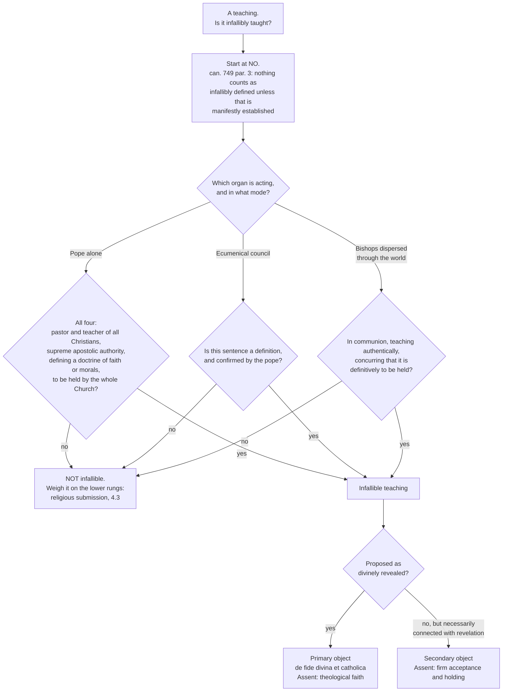

# Fundamental Theology · Lesson 4.2: Infallibility and its conditions

> ⏱ ~15 min · Module 4: The Magisterium and the ladder of authority · Builds on: [4.1 The Magisterium](04-01-the-magisterium.md) · Unlocks: [4.3 Religious submission](04-03-religious-submission.md)

## Why this matters

No word in Catholic theology is overused like this one. In popular argument the pope is infallible full stop — so every papal sentence is unchallengeable, and every papal mistake refutes Catholicism. Both halves of that are wrong, and they are wrong in the same way: they treat infallibility as a property of a *person*, permanently switched on, when the Church teaches it as a property of certain *acts*, under conditions she herself states in writing.

This is the lesson where you stop arguing about infallibility and start checking it. By the end you should be able to take any teaching act — a bull, an encyclical, a conciliar canon, a curial response, a press remark — and run a short, public, four-step test on it, and then say the answer most of the time, which is *no, and here is the condition that fails*. That negative answer is not a concession. It is the doctrine working as designed.

## The idea

**Infallibility is a negative charism with a narrow scope.** It is a divine protection *from error* in a definitive act of teaching. It is not inspiration: no new revelation is given, and the pope or council receives no private illumination. It is not impeccability: it says nothing about the holiness, prudence or competence of the man. It does not promise the best possible wording, the wisest timing, or a complete treatment of the question. It promises one thing — that when the Church commits herself definitively on faith or morals, the proposition she commits to is not false.

**It belongs to the Church, and the pope and the bishops exercise it.** *Pastor Aeternus* is careful about this: it says the Roman Pontiff possesses *that* infallibility with which Christ willed his Church to be endowed. So this is not a second charism layered on top of the Church's; it is the Church's own, exercised through an organ. That is why [3.4](03-04-tradition.md)'s servant clause still holds here — the Magisterium stands under the word and teaches only what has been handed on ([Dei Verbum 10](03-04-tradition.md)). A definition proposes what was already revealed. It cannot add.

**Three organs can exercise it**, and only the first two are what people picture:

1. **The pope, defining *ex cathedra*.**
2. **An ecumenical council, defining**, together with and under its head.
3. **The bishops dispersed through the world**, concurring in one teaching as definitively to be held — the *ordinary universal magisterium*. No council, no ceremony, no document with a definition in it. This is the one almost everyone forgets, and it does most of the real work.

And there is a fourth thing, which is the lesson's safeguard: **a default of "no."** Nothing counts as infallibly defined unless that is clearly established. Everything below is a test you have to *pass*, not a presumption you enjoy.

## Source

Vatican I, *Pastor Aeternus* (1870), the definition, in the public-domain translation printed in Schaff's *Creeds of Christendom*:

> …we teach and define that it is a dogma divinely revealed: that the Roman Pontiff, when he speaks ex cathedra, that is, when in discharge of the office of pastor and doctor of all Christians, by virtue of his supreme Apostolic authority, he defines a doctrine regarding faith or morals to be held by the universal Church, by the divine assistance promised to him in blessed Peter, is possessed of that infallibility with which the divine Redeemer willed that his Church should be endowed for defining doctrine regarding faith or morals; and that therefore such definitions of the Roman Pontiff are irreformable of themselves, and not from the consent of the Church.

How the council came to say this — the drafts, the minority bishops, the politics of 1870 — belongs to [`ecclesiology-and-mariology`](../../ecclesiology-and-mariology/syllabus.md) and [`church-history`](../../church-history/syllabus.md). Here we take the text as it stands and ask what it requires.

## The argument

### The four conditions, as the text states them

Read the definition as a conjunction. All four must hold; any one failing means the act is not *ex cathedra*.

1. **He speaks "in discharge of the office of pastor and doctor of all Christians."** *In words: he is acting as universal shepherd and teacher — not as a private theologian publishing a book, not as the bishop of one diocese instructing his own flock, not as head of a state.* The office has to be the one in use.
2. **"By virtue of his supreme Apostolic authority."** *In words: he is putting the full weight of the Petrine office behind it, not merely his considerable personal standing.* This is normally visible in the act's own language.
3. **He "defines a doctrine regarding faith or morals."** *In words: he settles a question — puts an end to it — and the matter is faith or morals.* Two traps here. "Define" does not mean "give a definition of"; it means to determine definitively. And the subject matter is restricted: not physics, not politics, not history as such.
4. **The doctrine is "to be held by the universal Church."** *In words: the whole Church is bound, not a country, an order, or a generation.*

The definition then states the effect: such definitions are **"irreformable of themselves, and not from the consent of the Church."** *In words: the act is complete when it is made; it does not wait on a later ratification by the bishops or the faithful to become binding.* That clause was aimed at Gallicanism, the position that a papal definition took effect only once the episcopate had consented. It does not mean the Church is bypassed — the pope defines *the faith of the Church*, from the deposit she carries. It means the force of the definition does not hang on a subsequent vote.

### Which acts have actually met all four

**The two that nobody contests:** *Ineffabilis Deus* (Pius IX, 1854), defining the Immaculate Conception, and *Munificentissimus Deus* (Pius XII, 1950), defining the bodily Assumption of Mary.

Beyond those two, **which other papal acts in history qualify is disputed among Catholic theologians.** Various earlier acts are argued for by some and denied by others, and there is no magisterial list. A lesson that handed you a longer list would be handing you one school's opinion as fact. So: two uncontested, the rest an open question of theological judgement — and notice that the *scarcity* is the point. The charism is invoked rarely, which is why the checklist matters more than the list.

### Councils

**An ecumenical council's definitions are infallible.** A council is ecumenical when it is convoked or accepted by the pope and its acts confirmed by him; the college of bishops never acts apart from its head. When such a council defines a doctrine of faith or morals for the whole Church, the same protection applies — this is the collegial form of the extraordinary magisterium.

But **not every sentence of a council is a definition.** Trent's canons, with their anathemas, define; the chapters that precede them expound and argue. Vatican II is the sharpest case: it was a genuine ecumenical council and it defined no new dogma, choosing a pastoral rather than a definitional mode, so its sentences carry the weight of whatever they restate — which is often very great, and sometimes not a definition at all ([4.5](04-05-reading-a-documents-weight.md)).

### The ordinary universal magisterium

*Lumen Gentium* 25 (Vatican II, 1964; paraphrased). The bishops do not have to be gathered in one place to teach infallibly. When the bishops **dispersed throughout the world**, while **maintaining the bond of communion among themselves and with the successor of Peter**, **teaching authentically on a matter of faith or morals**, **concur in one judgement as the one to be held definitively** — that teaching is infallible.

Four conditions again, and they are worth memorising as a set: *dispersed, in communion, teaching authentically, concurring that it is definitive.* The last one does the heavy lifting. It is not enough that all the bishops happen to believe something, or teach it, or would agree if asked. They must concur in proposing it **as definitively to be held** — as a matter on which the Church is committed, not as sound doctrine she currently teaches.

This is the ordinary mode, and it is where most dogma actually lives. That the Resurrection happened, that murder is gravely wrong, that there are seven sacraments — many of these were held infallibly long before any council said so. But it is also **far harder to verify than an *ex cathedra* act.** A papal definition is a dated document you can read. Establishing concurrence among the world's bishops, and that they proposed the teaching *as definitive*, is a historical argument that can be done badly. Which is exactly why the next paragraph exists.

### The safeguard against inflation

The 1983 Code of Canon Law, canon 749 §3, lays down a rule of interpretation: **no doctrine is understood to be infallibly defined unless that is manifestly established.** (Paraphrased; the canon is short and its force is entirely in "manifestly.")

Read it as a burden of proof. The default answer to "is this infallible?" is **no**, and the burden falls on whoever claims otherwise — including on whoever claims it via the ordinary universal magisterium, where the temptation to argue loosely is greatest. Doubt resolves downward, not upward.

Notice that this cuts against two opposite inflations:

- **Maximalist inflation.** Treating every papal utterance, or every strongly-worded encyclical, as irreformable. The canon forbids it: absent manifest establishment, it is not a definition.
- **Minimalist deflation.** "If it isn't infallible, it isn't binding, so I may ignore it." The canon says nothing of the kind. Non-infallible authentic teaching still asks for religious submission of intellect and will — the whole subject of [4.3](04-03-religious-submission.md). Infallibility is the ceiling of the ladder, not its floor.

### Primary and secondary objects

Infallibility has two objects, and they attract different assent.

| | **Primary object** | **Secondary object** |
|---|---|---|
| What it covers | Truths divinely revealed — contained in the word of God written or handed on | Truths not revealed, but so necessarily connected with revelation that the deposit could not be faithfully guarded or expounded without them |
| Proposed as | Divinely revealed, to be believed | Definitively to be held |
| Assent owed | Theological faith (*de fide divina et catholica*) | Firm acceptance and holding |
| Ladder rung ([4.4](04-04-the-ladder-of-doctrinal-authority.md)) | 1 | 2 |
| Denying it is | Heresy, if obstinate (can. 751) | Rejecting a doctrine of the Church (can. 750 §2) — not heresy as such |

The standard examples of the secondary object in the manual tradition are **dogmatic facts** — for instance that a particular man is truly pope, or that a particular council is ecumenical, which the Church must be able to settle or she could not identify her own acts — and the **canonisation of saints**, though whether a canonisation is infallible is itself argued by theologians rather than settled. The 1998 doctrinal commentary accompanying *Ad Tuendam Fidem* works through examples of this second category; [4.4](04-04-the-ladder-of-doctrinal-authority.md) reads it directly.

Two errors to avoid right now. The secondary object is not a second, weaker infallibility — the protection is the same; what differs is that the truth is not proposed as *revealed*, so what is owed is firm holding rather than faith. And a teaching being on the secondary object does not make it minor: it makes it connected rather than revealed.

## Argument map

Where this sits on the classification grid [4.1](04-01-the-magisterium.md) set up:

| The act | 4.1's grid | Infallible? |
|---|---|---|
| Pope defining *ex cathedra* | extraordinary · universal | Yes, when all four conditions hold |
| Ecumenical council defining | extraordinary · universal | Yes, of its definitions — not of everything it says |
| Bishops dispersed, in communion, concurring that a teaching is definitive | ordinary · universal | Yes |
| An encyclical addressed to the whole Church, teaching without defining | ordinary · papal, universal in *address* | **No** — and this row is the single most common confusion |
| A bishop, or a conference, teaching its own territory | ordinary · particular | No |

The fourth row deserves the bold. "Ordinary universal magisterium" is a technical name for the *body of bishops* concurring, not for "the pope teaching the whole Church in his ordinary way." An encyclical is universal in who receives it and ordinary in mode, and it is still not what *Lumen Gentium* 25 is talking about in that clause.

Now the checklist itself, as a flow you can run:

Every arrow out of a diamond that reads "no" lands in the same box, and most real acts land there. That is the shape of the doctrine.

## Worked examples

**Example 1 (mechanical — a clean run).** *Munificentissimus Deus*, Pius XII, 1 November 1950, defining that Mary, at the end of her earthly course, was assumed body and soul into heavenly glory. Run the four conditions. (Modern papal documents are paraphrased here, not quoted — the translations are under copyright.)

1. *Pastor and teacher of all Christians?* Yes. The bull is addressed to the whole Church and the act is framed as the exercise of the universal teaching office.
2. *Supreme apostolic authority?* Yes, and explicitly: the operative sentence invokes the authority of Christ, of the apostles Peter and Paul, and the pope's own — the standard solemn formula, which is the evidence for this condition rather than a magic phrase that creates it.
3. *Defining a doctrine of faith or morals?* Yes. It uses the verbs of definition — pronounces, declares, defines — and settles a disputed-in-form question. The matter is a truth about Mary, squarely faith.
4. *To be held by the universal Church?* Yes, and the bull attaches a consequence for anyone who would deny it.

Verdict: *ex cathedra*, one of the two uncontested cases. Now the second half of the checklist. The bull defines the doctrine as **divinely revealed** — so this is the primary object, rung 1, and what is owed is theological faith. Note what the bull argued *from*, since this is where [3.4](03-04-tradition.md) reappears: the Church's faith and liturgy, the consent of the Fathers and theologians, Mary's place in the mystery of redemption. No new revelation arrived in 1950. The charism protected a judgement about what had been handed on.

**Example 2 (where it strains — a claim of infallibility with no definition).** *Ordinatio Sacerdotalis*, John Paul II, 1994, on the reservation of priestly ordination to men. Run the same checklist and watch it behave differently.

Conditions 1, 2 and 4 look satisfied: the letter is addressed to the whole Church, invokes the ministry of confirming the brethren, and states that the teaching is to be definitively held by all the faithful. Condition 3 is the interesting one. The document itself **does not define**; it declares that the Church has no authority in the matter and that the judgement is to be held definitively. That is a declaration *that a teaching is already definitive*, which is a different act from defining it.

So what fixes the level? In 1995 the Congregation for the Doctrine of the Faith responded to a formal question, saying the teaching belongs to the deposit of faith and has been set forth infallibly by the **ordinary universal magisterium** — that is, by route 3, not route 1. In 1998, the doctrinal commentary accompanying *Ad Tuendam Fidem* discussed the teaching under the heading of truths to be **definitively held** — the second paragraph of the Profession of Faith, which is the secondary object's home.

Those two documents pull in different directions on one question: is this taught as *divinely revealed* (rung 1, faith) or as *definitive* without being proposed as revealed (rung 2, firm holding)? Catholic theologians read the pair differently, and the syllabus for this course names it as a live case for [4.4](04-04-the-ladder-of-doctrinal-authority.md). What is *not* open: that it is an *ex cathedra* definition — it is not, on the documents' own account — or that it is merely non-definitive ordinary teaching, which both documents exclude.

This is the checklist doing its best work. It does not hand you a verdict here. It tells you exactly which box the dispute lives in, which is what distinguishes an argument from a shouting match.

## Watch out

- **You might think infallibility means the pope can't be wrong.** It means that a definition meeting the four conditions is not false. A pope can be wrong about history, science, policy, the state of his own diocese, and — outside a definitive act — theology. The doctrine says nothing about his private opinions and nothing about his personal holiness.
- **You might think infallibility means new revelation.** The opposite. Public revelation closed with the apostles ([1.4](01-04-public-and-private-revelation.md)), and the Magisterium serves the word rather than standing over it ([3.4](03-04-tradition.md)). A definition can only propose what was handed on.
- **You might think you can spot an *ex cathedra* act by a formula.** There are no magic words. The solemn formula is strong *evidence* that conditions 2 and 3 are met, but the conditions are about what the act does. Conversely, strong language alone — "we firmly teach," "we utterly reject" — does not make a definition.
- **You might read "ordinary universal magisterium" as "the pope's everyday teaching."** It names the bishops of the world concurring. This is the error the grid table above exists to kill.
- **You might treat "the bishops all teach it" as enough.** Concurrence in the teaching is not concurrence that it is *definitive*. Most of what all the bishops teach is authentic ordinary magisterium, rung 3.
- **You might read "irreformable… not from the consent of the Church" as "against the Church."** It denies that a definition needs subsequent ratification. It does not detach the pope from the faith of the Church he defines from; the 1854 definition, for one, was preceded by a formal consultation of the world's bishops.
- **You might think a formula, once defined, can never be expressed better.** Irreformable applies to the truth defined, not to the perfection of its wording; the Church has said that dogmatic formulas are historically conditioned in expression while remaining true — which is [5.2](05-02-newmans-theory-of-development.md)'s territory, not a loophole.
- **Overstating a level is the error this course grades hardest.** "The pope infallibly taught X" with no act to point at is a claim you have to withdraw under canon 749 §3, however confident you are that X is true.

## One-liner

> Infallibility is a protection from error attaching to specific acts under stated conditions — pope defining *ex cathedra*, council defining, or the world's bishops concurring that a teaching is definitive — and the default answer, unless it is manifestly established, is no.

## Problems

**P1 (🟢) *(Exegetical.)*** For each act, say whether all four *Pastor Aeternus* conditions are met, and if not, name the **one** condition that most clearly fails. One clause of reason each.

(a) A pope writes to the bishops of a single country instructing them on the formation of seminarians in their territory.
(b) A pope, in an encyclical addressed to the whole Church, teaches at length on the morality of an economic practice, urging it strongly, and proposes nothing as definitively to be held.
(c) A pope, answering a journalist's question on a flight, gives his view on a contested moral question.
(d) A pope, addressing the whole Church and invoking the authority of Christ, of the apostles Peter and Paul, and his own, pronounces, declares and defines a doctrine concerning the Blessed Virgin as divinely revealed and to be believed by all the faithful.
(e) Which canon of the 1983 Code tells you what to conclude when you genuinely cannot tell — and what does it require?

**P2 (🟡) *(Exegetical (a)–(b) · Evaluative (c).)*** The ordinary universal magisterium.

(a) List the four things that must hold of the bishops' teaching for *Lumen Gentium* 25's ordinary-universal clause to apply.
(b) Say why this route is harder to verify than an *ex cathedra* act, and what canon 749 §3 does to a *claim* that something is infallible by this route.
(c) A theologian argues: "Since the ordinary universal magisterium can teach infallibly with no document, no date and no definition, no Catholic can ever establish that a teaching is *not* infallible. The canon 749 §3 safeguard is therefore empty — it protects nothing." Assess in **150 words or fewer**. Any verdict.

**P3 (🔴, optional) *(Exegetical.)*** Supposing each claim below is infallibly taught, say whether it would fall under the **primary** or the **secondary** object, and what assent follows on the ladder.

(a) The Son is of one substance with the Father.
(b) That the man elected in a particular conclave is truly the pope.
(c) That the Church has no authority to confer priestly ordination on women.

For (c), say why the answer is contested and name the two documents that pull in different directions. **120 words or fewer.**

Solutions

**P1** *(Exegetical — strict.)*

**Must hit, strict:**
- (a) Fails condition 4 (and arguably 1): the doctrine is not proposed to the **universal Church** — this is a particular act, addressed to one territory. Ordinary, particular on 4.1's grid.
- (b) Fails condition 3: no **definition**. Strong teaching is not definitive teaching; the act settles nothing. This is authentic ordinary magisterium, rung 3, and it still asks for religious submission ([4.3](04-03-religious-submission.md)).
- (c) Fails condition 1 (and 2, and 3): an interview is not an exercise of the office of pastor and teacher of all Christians engaging supreme apostolic authority. It is not a teaching act at all in the technical sense.
- (d) All four met — this is the shape of a solemn definition (compare the 1854 and 1950 acts).
- (e) Canon 749 §3: no doctrine is understood to be infallibly defined unless that is **manifestly established**. Doubt resolves to "not infallible"; the burden is on the claimant.

**Wrong turns:** calling (b) infallible because an encyclical is a heavyweight genre — genre is not mode ([4.5](04-05-reading-a-documents-weight.md)); calling (c) *ex cathedra* because a pope said it and the subject was morals; concluding from (a)–(c) that those teachings are therefore not binding, which is the deflationary error the lesson warns against. Naming a condition other than the one that most clearly fails is not wrong if the reason given is sound — but (b) must be diagnosed as a failure of *definition*.

**Model answer:** (a) fails 4 — particular, not universal. (b) fails 3 — teaches without defining. (c) fails 1 — not an act of the universal teaching office. (d) all four met. (e) can. 749 §3 — infallible definition must be manifestly established, otherwise not.

---

**P2** *(a)–(b) exegetical — strict; (c) evaluative — any verdict.*

**Must hit, strict (a):** the bishops (i) dispersed throughout the world, (ii) maintaining the bond of communion among themselves and with the successor of Peter, (iii) teaching authentically on faith or morals, (iv) concurring in one judgement **as definitively to be held**. Full credit requires (iv) stated as being about *definitiveness*, not just about agreement.

**Must hit, strict (b):** an *ex cathedra* act is a dated, readable document; establishing the ordinary-universal route is a historical argument about what the world's episcopate taught and with what intention, which has no single text to point at. Canon 749 §3 therefore places the burden on the one asserting infallibility: absent manifest establishment of the concurrence *and* its definitive character, the teaching is not to be treated as infallibly taught.

**Must hit, any verdict (c):** restate the objection precisely (it targets verifiability, not truth); say what can. 749 §3 actually does — it sets a default and a burden of proof, so an unestablished claim of infallibility fails rather than standing; and say what would count as establishing concurrence (catechisms, conciliar and papal teaching over time, the constant practice and preaching of the episcopate, a formal response of the Holy See). Either conclusion passes: that the safeguard holds because the burden falls on the claimant, or that it is weak because an unfalsifiable *possibility* of infallibility does real rhetorical work even under the canon.

**Wrong turns:** answering as though the objection denied that the ordinary universal magisterium can be infallible — it does not; treating the canon as a statement about which doctrines are true rather than a rule of interpretation; conceding that because verification is hard, the route is not a real one.

**Model answer (c), one of several:** The objection mistakes a rule of interpretation for a detection procedure. Canon 749 §3 does not promise you can prove a negative; it says the affirmative claim fails unless manifestly established. So the practical question is never "can I rule infallibility out?" but "has anyone carried the burden?" — and for the vast majority of teachings nobody has tried. What is fair in the objection: the route has no single dated act, so the argument is historical and can be run tendentiously in either direction, and a maximalist can keep a claim alive indefinitely without ever meeting the standard. What answers it: the Church herself has, on occasion, asked and answered the question formally, which is what "manifestly" looks like in practice.

---

**P3** *(Exegetical — strict.)*

**Must hit, strict:**
- (a) **Primary object** — a truth divinely revealed, defined at Nicaea and proposed as revealed. Assent: theological faith; rung 1; obstinate denial is heresy.
- (b) **Secondary object** — a dogmatic fact, not revealed, but so connected with revelation that the Church must be able to settle it in order to identify her own acts at all. Assent: firm acceptance; rung 2.
- (c) **Contested.** The 1995 CDF response says the teaching belongs to the deposit of faith and has been set forth infallibly by the ordinary universal magisterium, which points to the primary object; the 1998 doctrinal commentary accompanying *Ad Tuendam Fidem* treats it under truths to be definitively held, the second paragraph of the Profession of Faith, which points to the secondary object. So the level between rungs 1 and 2 is genuinely argued; what is settled is that it is taught as at least definitive.

**Wrong turns:** calling (c) an *ex cathedra* definition — neither document is one, and *Ordinatio Sacerdotalis* declares rather than defines; calling (c) non-definitive ordinary magisterium, which both documents exclude; treating the secondary object as a weaker kind of infallibility rather than a different kind of object.

**Model answer:** (a) primary — revealed, defined, held by faith. (b) secondary — a dogmatic fact, held firmly but not by theological faith. (c) contested between primary and secondary: the 1995 response points to the deposit of faith, the 1998 commentary to definitive holding. Not *ex cathedra*, and not merely authentic ordinary teaching.

## Flashback

**F1 (🟡) *(Exegetical.)*** From [3.4](03-04-tradition.md). A blog post argues:

> "Vatican II settled the Scripture-and-Tradition question. Dei Verbum says both flow from one divine wellspring and that the Magisterium stands under the word of God, not over it. So a definition may only restate what Scripture already says in so many words — anything beyond that would be the Magisterium standing over the word."

(a) What does the servant clause of Dei Verbum 10 actually forbid, and what does it leave permitted? (b) What did the "one wellspring" language of Dei Verbum 9 settle, and what did it deliberately leave open? (c) What level does that left-open question sit at, on the ladder? **120 words or fewer.**

Solution

**Must hit, strict:**
- (a) It forbids the Magisterium *adding* to the deposit or ruling over the word — it teaches only what has been handed on, listening to it and guarding it. It permits authentic interpretation, and it permits defining something that is in the deposit without being in Scripture *verbatim* — otherwise Nicaea's "of one substance" would itself be forbidden, since the word is not in Scripture.
- (b) Settled: Scripture and Tradition flow from one divine source, form a single deposit, and are received with equal devotion and reverence. Left open: whether every revealed truth is contained at least implicitly in Scripture — the material-sufficiency question, which the council declined to decide, as Trent had before it.
- (c) **Freely disputed** — the bottom rung. Either view may be held.

**Wrong turns:** treating "one wellspring" as a decision for material sufficiency (that is one reading of the drafting, not the council's act); confusing the servant clause, which limits the Magisterium's *power*, with a rule about which words a definition may use; forgetting that the post's conclusion would condemn Nicaea.

## Connections

- **Backward:** [4.1](04-01-the-magisterium.md) supplied the extraordinary/ordinary and universal/particular grid that the table above populates. [3.4](03-04-tradition.md) supplied the servant clause that keeps a definition from being a new revelation, and [1.4](01-04-public-and-private-revelation.md) the closure of public revelation that makes it impossible.
- **Forward:** [4.3](04-03-religious-submission.md) takes the "no" box — everything that failed the checklist — and asks what is owed to it anyway. [4.4](04-04-the-ladder-of-doctrinal-authority.md) turns the primary/secondary distinction into the full ladder with its canons and the 1989 Profession of Faith, and settles the *Ordinatio Sacerdotalis* case as a worked example. [4.5](04-05-reading-a-documents-weight.md) supplies the genre reading this lesson leaned on.
- **Sideways:** [5.2](05-02-newmans-theory-of-development.md) handles how a formula can be irreformable in its truth and historically conditioned in its expression. [`ecclesiology-and-mariology`](../../ecclesiology-and-mariology/syllabus.md) owns the papacy as an institution, the history of the 1870 definition, and the content of the Marian dogmas used here only as examples; [`church-history`](../../church-history/syllabus.md) owns Vatican I as an event; [`apologetics-catholic-claims`](../../apologetics-catholic-claims/syllabus.md) argues the doctrine against the Orthodox and Protestant objections this lesson does not raise.
