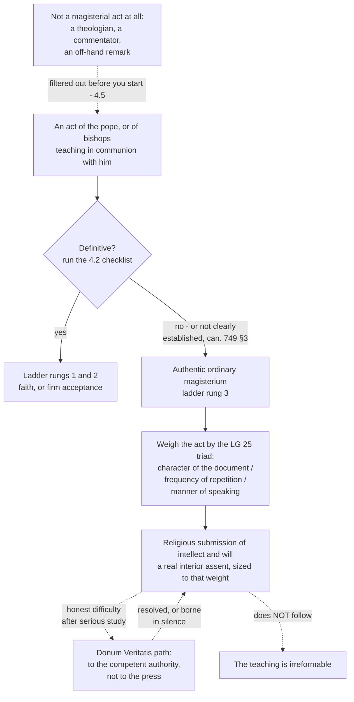

# Fundamental Theology · Lesson 4.3: Religious submission

> ⏱ ~15 min · Module 4: The Magisterium and the ladder of authority · Builds on: [4.2 Infallibility and its conditions](04-02-infallibility-and-its-conditions.md) · Unlocks: [4.4 The ladder of doctrinal authority](04-04-the-ladder-of-doctrinal-authority.md)

## Why this matters

[4.2](04-02-infallibility-and-its-conditions.md) handed you a checklist and, if you ran it honestly, a surprise: almost nothing passes. Solemn definitions are rare events; teachings infallibly proposed by the ordinary universal magisterium are more numerous but hard to establish, and the law forbids you to presume one (can. 749 §3). So what happens to everything else — the encyclicals, the doctrinal instructions, the bishops' teaching, the settled positions no one ever bothered to define?

That residue is not a remainder. It is the bulk of what the Church actually teaches, and the category is routinely botched in both directions. One party hears "not infallible" and concludes "an opinion, then." The other hears "the pope taught it" and concludes "irreformable, then." This lesson is the middle, which is where you will spend the rest of your theological life.

## The idea

**Below infallibility, the Church still asks for your mind.** Non-definitive teaching by the pope and the bishops in communion with him is owed *obsequium religiosum* — a **religious submission of will and intellect** (Lumen Gentium 25, 1964, paraphrased; restated in law at can. 752).

Two fixed points define the whole territory, and every serious position has to hold both:

1. **It is a real assent, not a policy of outward quiet.** The demand reaches the intellect — you are being asked to adhere to the judgment, not merely to refrain from contradicting it in public. A person who keeps silent while privately holding the teaching in contempt has not given religious submission; he has given manners.
2. **It does not make the teaching irreformable.** The assent rests on the authority of the teaching office, not on the motive of faith (God revealing), so it does not carry infallibility with it. Teaching at this level can be corrected, and some of it has been.

Most confusion here is an attempt to drop one of the two because holding both feels unstable. Holding both is the doctrine.

Three fences before we go on:

- **It is not an act of faith.** Canon 752 says so in as many words: not an assent of faith, but a religious submission of intellect and will. Denying it is therefore not heresy ([4.4](04-04-the-ladder-of-doctrinal-authority.md)).
- **It is owed to bishops too,** not only to Rome — bishops teaching in communion with the head of the college are authentic teachers for the faithful entrusted to them (can. 753).
- **It is not one setting.** The submission owed is graded by how the teaching is given, which is the next section.

## The argument

**The text.** Lumen Gentium 25 (Dogmatic Constitution on the Church, 1964), paraphrased, argues in four steps:

1. Bishops teaching in communion with the Roman Pontiff are to be respected by all as witnesses to divine and Catholic truth; the faithful are to adhere to their own bishop's teaching on faith and morals with a religious submission of soul. *In words: the ordinary, everyday teaching of your bishop is a magisterial act and is not optional.*
2. This religious submission of will and intellect is to be shown in a special way to the authentic magisterium of the Roman Pontiff **even when he is not speaking** *ex cathedra*. *In words: the absence of a definition does not put the teaching outside the reach of the duty.*
3. It is shown by reverently acknowledging his supreme teaching authority and sincerely adhering to his judgments **according to his manifest mind and will**. *In words: what you owe is calibrated to what he actually intends by this act, not to the loudest reading of it.*
4. That mind and will are known chiefly from **the character of the document**, from **the frequent repetition of the same doctrine**, and from **the manner of speaking**. *In words: there is a procedure for reading the weight off the act, and here it is.*

State the triad carefully: Lumen Gentium gives these three as signs **of the Roman Pontiff's mind** in a particular act, and theologians extend them — uncontroversially — as the general rule for weighing any authentic non-definitive teaching. What the triad is *not* is a test for infallibility (see Watch out).

| Sign | Question it answers | Heavier | Lighter |
|---|---|---|---|
| **Character of the document** | What genre is this, and what does the office use it for? | an encyclical; a doctrinal instruction approved by the pope; a doctrinal paragraph of a conciliar constitution | an address to a visiting group; a preface; a letter of encouragement; an interview |
| **Frequency of repetition** | How settled is this in the Church's actual teaching? | taught by several popes across decades, taken up by bishops in their own teaching | said once, never resumed |
| **Manner of speaking** | How firmly is it put, and what does the text say about its own standing? | a doctrinal reason given; the constant teaching invoked; the matter declared to be held, or no longer open | exhortation, illustration, a prudential recommendation for a moment |

**Humani Generis (Pius XII, 1950)** presses the point against one specific evasion: the claim that encyclicals do not of themselves demand assent, since the pope is not there exercising his supreme teaching power. The encyclical answers, in substance (paraphrased; the passage sits in its section on the authority of the ordinary magisterium):

- What popes set forth in encyclicals is taught by the **ordinary magisterium**, of which Christ's word to the apostles holds: *"He that heareth you, heareth me"* (Luke 10:16, Douay–Rheims). Assent is owed.
- Usually what an encyclical inculcates already belongs to Catholic doctrine on other grounds — so it is often restating, not innovating, and some of its weight comes from the source restated.
- **The sharp clause:** if the popes, in their acts, deliberately pass judgment on a matter until then disputed, the matter can no longer, according to their mind and will, be held to be a question open to free discussion among theologians.

That is the most misused sentence in this part of theology, so be exact. It says a disputed question can be **closed** by an act of the authentic ordinary magisterium. It does not say the closing act is a definition, that it is infallible, or that it is irreversible — it is a claim about the mind of the teaching office, and the office that closed a question this way can reopen it the same way. What it forecloses is the move "no definition, therefore still an open question."

**Donum Veritatis (CDF, 1990)**, the Instruction on the ecclesial vocation of the theologian, approved by John Paul II, works the doctrine out from the inside — by the office, for the people likeliest to feel the strain. Paraphrased:

- **The vocation.** The theologian serves the Church's faith by seeking understanding of revelation, inside the communion the Magisterium guards. He is not to constitute a **parallel magisterium**.
- **The concession that makes the rest honest.** Interventions in the prudential order — judgments bound up with circumstances and the state of a science — have at times proved conditioned by their moment and have later needed correction. The Instruction says this itself; it is not a critic's charge.
- **Difficulty.** A theologian may, after serious study, have difficulties with a non-definitive teaching — about its timeliness, its form, or even its content. That is a foreseeable and legitimate condition, not an act of rebellion.
- **What he does with it.** He brings the difficulty to the competent authority, in a spirit that wants it resolved rather than won; his objections can genuinely contribute. He does not present his own view publicly as the Church's teaching, and he does not use the mass media as a means of pressure. If it persists, he is to hold his peace, pray, and trust that truth will prevail — and the willingness to submit loyally on matters of themselves not irreformable is to be the rule.
- **Dissent, treated differently.** What is ruled out is not difficulty but *public opposition organized as a campaign*: media leverage, numbers marshalled as though a count of theologians or of the faithful were a theological argument (a misuse of the sense of the faithful, [5.3](05-03-the-sensus-fidei.md)), a claimed **right** to dissent modelled on civil freedom of opinion. The difference is not how strongly you disagree — it is whether you are addressing the Church's teachers or applying force to them.

**What is genuinely open.** Everything above is settled. The limits of the assent are not, and two schools of Catholic theologians divide:

| | **Strict reading** | **Conditional-assent reading** |
|---|---|---|
| The claim | Assent is owed, full stop. There is no right of non-assent; an inability to assent is a state to be suffered and worked through, never a position one holds. | The assent is real but intrinsically conditional — owed *unless* serious study makes it impossible for a competent person, who then withholds interior assent and keeps respectful public silence (the manuals' *silentium obsequiosum*). |
| Best evidence | Canon 752 commands submission positively and tells the faithful to avoid what is out of harmony with the teaching; *Donum Veritatis* makes loyal submission the rule and grants no right to dissent. | A teaching that can contain error cannot demand an assent that error would turn into sin; the older manualists taught this openly; *Donum Veritatis* concedes that such interventions have needed correction. |
| Pressure point | If assent is unconditional, what work is "not irreformable" doing? | A right to withhold is easy to claim and hard to audit; it risks making private judgment the real magisterium. |

Their agreement is more useful than their dispute: assent is the **default**; the burden lies entirely on the one who cannot give it; the honest attempt to understand the teaching on its own terms comes first and is obligatory; public campaigning is out on either reading; and none of this touches defined or definitive teaching, where non-assent is [4.4](04-04-the-ladder-of-doctrinal-authority.md)'s much shorter story.

A related squabble is about the word. *Obsequium* has been rendered "submission" and, by some, "respect" or "due deference"; "submission" is standard and is what the Code's English carries. The noun-fight is a decoy: whichever word you use, you still have to hold both fixed points, and no translation does that work for you.

## Argument map

The two dotted edges out of the assent node are the lesson. One is the legitimate exit and it leads back; the other is the inference everybody makes and it is invalid.

## Worked examples

**Example 1 (clean — running the triad).** Subsidiarity: that a higher association should not absorb what a lower one can do for itself. It appears in *Quadragesimo Anno* (Pius XI, 1931), is taken up by later popes in their social encyclicals, and is restated by bishops' conferences in their own social teaching.

Run the signs. *Character:* encyclicals — the genre popes use for doctrinal teaching to the whole Church; high. *Frequency:* repeated across pontificates and absorbed into the ordinary teaching of bishops; high. *Manner:* stated as a principle with a reason drawn from the nature of society, not as a recommendation for 1931; high.

Verdict: a firmly proposed teaching of the authentic ordinary magisterium, owed substantial religious submission. Now the discipline: that is **rung 3**, not rung 1. Nobody has defined subsidiarity, it is not proposed as divinely revealed, and a Catholic who concluded after serious study that the principle is misformulated would not be a heretic — what he *would* be doing is exactly the disputed question above. Note also where the submission bites hardest: on the principle, not on its application to a particular housing bill, which is a prudential judgment several steps further down.

**Example 2 (where it strains — Humani Generis on polygenism).** The same encyclical that laid down the rule applied it. Treating the origin of the human body by evolution as a question open to research conducted with care, *Humani Generis* went on to say that the faithful cannot embrace the opinion that after Adam there existed true men on earth not descended from him, because it is not apparent how such a view can be reconciled with what the sources of revelation and the Church's acts teach about original sin — a sin truly committed by one man and passed to all.

Sort this carefully, because three different things are stacked in it:

- **The dogma of original sin** (Trent, Session V, 1546) — defined, top rung, untouched by anything in this example.
- **The reason given** — that polygenism is not seen to be reconcilable with that dogma. This is a theological judgment about a relation between two claims, and it explicitly turns on what was apparent.
- **The act itself** — the authentic ordinary magisterium of a pope in an encyclical, deliberately judging a matter then disputed. On the encyclical's own principle, that closed the question to free discussion. It did not define anything.

So: is it still closed? Catholic theologians differ, and the disagreement is real. One side holds that an authentic act closing a question stays closed until the same authority says otherwise, and none has; the other holds that a judgment resting explicitly on what was *not apparent* reopens when a reconciliation becomes apparent. Both grant the dogma of original sin entirely; what they argue about is the standing of a rung-3 act seventy-five years on. P2 asks you to take a side.

## Watch out

- **You might think "not infallible" means "not binding."** The commonest error in this material. Canon 752 attaches a positive duty — submit, and take care to avoid what is out of harmony with the teaching — to teaching nobody claims is infallible.
- **You might think religious submission is external silence.** It is an assent of intellect and will. If saying nothing satisfied it, *Donum Veritatis* would not have needed a page on the theologian who genuinely cannot assent.
- **You might think that because assent is owed, the teaching must be true.** The mirror error, and the one that produces disillusioned Catholics. Assent here is given on the authority of the teaching office, the office is not exercising infallibility, and the teaching remains reformable. Both halves, always.
- **You might use the triad as a test for infallibility.** Frequent repetition is a sign of how *firmly* something is proposed, not evidence of an infallible act of the ordinary universal magisterium — which has its own conditions ([4.2](04-02-infallibility-and-its-conditions.md)) and which can. 749 §3 forbids you to presume. "Taught by four popes, therefore infallible" is an overstatement of level and is graded here as an error.
- **You might think *Donum Veritatis* forbids theologians to disagree.** It contemplates difficulty about timeliness, form and content, and tells the theologian to raise it. What it refuses is the campaign: media as pressure, the petition as proof, a right of dissent borrowed from civil politics.
- **You might treat every papal utterance as authentic magisterium.** An interview, a homily aside, a book published by a pope as a private theologian — reading the genre is [4.5](04-05-reading-a-documents-weight.md)'s job, and it comes logically before this lesson's question.
- **You might forget the document's own level.** *Donum Veritatis* is a CDF instruction — authentic ordinary magisterium, non-definitive. The text that tells you what religious submission is, is itself owed religious submission, not faith.

## One-liner

> Below infallibility the Church still asks for your mind and not merely your manners — a real assent, sized to the character, the repetition and the wording of the act, and still, on both sides of the assent, a teaching that could be corrected.

## Problems

**P1 (🟢) *(Exegetical.)*** For each act, name which of Lumen Gentium 25's three signs tells you most about its weight, and say in one clause how heavy a submission that indicates.

(a) A doctrinal principle stated in a papal encyclical and restated in encyclicals by the next two popes.
(b) A single sentence on a disputed moral question in a papal address to a visiting pilgrimage group.
(c) An instruction from a Roman dicastery, approved by the pope, which states that a named question is no longer to be treated as open.

(d) Which of (a)–(c), if any, establishes that the teaching in question is infallible? Name the canon that decides this and state what it requires.

**P2 (🟡) *(Exegetical (a) · Evaluative (b).)*** On *Humani Generis* (1950):

(a) State the two things it teaches about assent to what popes set forth in encyclicals — including what it says happens to a matter the popes deliberately judge — and then state one thing its principle does **not** establish about such a teaching.
(b) Is the question of polygenism still closed? Argue either side in **150 words or fewer**. Say what the act of 1950 was at the level of authority, what the dogma of original sin requires independently of it, and what would have to be shown for your answer to be wrong.

**P3 (🔴, optional) *(Exegetical.)*** An invented open letter, circulated by a group of Catholic theologians:

> "The teaching is admittedly not infallible. It therefore binds no one, and we have said so publicly. Three hundred and twelve Catholic theologians have now signed this letter, which is itself the clearest evidence that the sense of the faithful has moved; we have released it to the press so that Catholics may know the truth about the state of opinion. Until Rome answers us we shall teach the contrary position in our faculties as the responsible Catholic view. In our parishes, naturally, we shall say nothing about the matter at all."

Identify the one move in this paragraph that *Donum Veritatis* does contemplate, and name three that it does not, correcting each in a clause. Then name the distinction the last sentence gets backwards. **150 words or fewer.**

Solutions

**P1** *(Exegetical — strict.)*

**Must hit, strict:**
- (a) **Frequency of repetition** (character of the document also supports it — encyclicals are the doctrinal genre). Repetition across pontificates indicates a firmly proposed teaching of the authentic ordinary magisterium; substantial religious submission.
- (b) **Character of the document.** An address to a particular group is a light genre; the submission owed is real but slight, and the sentence is likelier restating something with weight elsewhere than adding weight of its own. Credit for saying you would go looking for where else it is taught.
- (c) **Manner of speaking.** The text declares its own effect on the state of the question — the *Humani Generis* move. Heavy submission; the question is closed to free discussion.
- (d) **None of them.** Canon 749 §3: no doctrine is understood to be infallibly defined unless that is clearly established (manifestly evident). Closing a question to free debate is an act of the authentic ordinary magisterium, not a definition, and the silence of the canon runs in favour of the lower reading.

**Wrong turns:** treating (a) as infallible teaching by the ordinary universal magisterium because it was repeated — repetition is a sign of firmness, not a condition of infallibility; treating (b) as worthless because the genre is light (the duty attaches to the act, the triad only sizes it); reading (c) as a definition because it uses forceful language.

**Model answer:** (a) frequency — firmly proposed, heavy submission; (b) character — light genre, light weight; (c) manner — the text closes the question, heavy submission; (d) none, per can. 749 §3, which requires that an infallible definition be clearly established.

---

**P2** *(a) exegetical — strict; (b) evaluative — any verdict.*

**Must hit, strict (a):** (i) What popes set forth in encyclicals is taught by the **ordinary magisterium** and assent is owed — the excuse that the pope is not there exercising supreme teaching power fails; credit for the scriptural warrant ("He that heareth you, heareth me," Luke 10:16) or for the point that encyclicals usually restate doctrine already held on other grounds. (ii) A matter until then disputed, when the popes deliberately pass judgment on it, may **no longer be held to be a question of free discussion among theologians**. Does **not** establish: that the teaching is infallible, defined, or irreformable — it is an act of the authentic ordinary magisterium, and the same authority could judge otherwise.

**Must hit, any verdict (b):** name the act's level — authentic ordinary magisterium, non-definitive, rung 3; distinguish it from the **defined dogma of original sin** (Trent, Session V), which neither side may touch and which no answer here puts at risk; engage the encyclical's own stated reason, that the reconciliation was not apparent; and state a defeater — what would have to be shown for your answer to be wrong (e.g. a later magisterial act reopening or reaffirming the matter; or a demonstration that the dogma as defined does in fact require descent from one).

**Wrong turns:** calling the polygenism passage a definition, or saying it is *de fide* — the classic overstatement of level; concluding that because it is not infallible it never bound anyone, which contradicts the encyclical's own principle two paragraphs earlier; arguing about biology instead of about the standing of the act; treating "no longer open to free discussion" as equivalent to "defined."

**Model answer (b) — one of several:** Still closed. The 1950 act was authentic ordinary magisterium, not a definition — but on its own principle that is enough to remove a matter from free theological discussion, and removal of that kind lapses when the authority that made it says so, not when individual theologians judge the reason outdated. The reason given was that the reconciliation with original sin was not apparent; even granting that some reconciliations have since been proposed, whether any of them preserves a sin truly committed by one man and transmitted to all is precisely the judgment reserved to the Magisterium. I would be wrong if a magisterial act of comparable weight had reopened the question, or if the encyclical's phrasing were read as a caution about a then-current hypothesis rather than a judgment on the matter. The defined dogma of Trent stands either way.

---

**P3** *(Exegetical — strict.)*

**Must hit, strict:**
- **Contemplated:** having and stating a difficulty with a non-definitive teaching, including about its content — *Donum Veritatis* foresees exactly this, and the letter to Rome is the right channel.
- **Not contemplated (any three):** (1) "Not infallible, therefore binds no one" — can. 752 attaches religious submission to teaching that is not infallible; (2) releasing the letter to the press — the Instruction refuses the use of mass media as a means of pressure on the Magisterium; (3) treating 312 signatures as evidence of the sense of the faithful — a count of theologians is not a theological argument, and the *sensus fidei* is not an opinion poll ([5.3](05-03-the-sensus-fidei.md)); (4) teaching the contrary position in the faculties as the responsible Catholic view — that is presenting a private conclusion as the Church's teaching and constitutes the parallel magisterium the Instruction names.
- **Backwards:** the last sentence. The Instruction's silence is silence in *public opposition* while the difficulty is worked out with the competent authority; here the campaign is public and the silence is reserved for the parish — the pastoral care where honest teaching is actually owed. The letter has inverted which audience gets the restraint.

**Wrong turns:** listing the tone as an error rather than the moves; conceding the first sentence's premise and arguing only about tactics; calling the signatories heretics — non-definitive teaching is not the object of faith, and refusing it is not heresy ([4.4](04-04-the-ladder-of-doctrinal-authority.md)).

**Model answer:** Contemplated: the difficulty itself, raised with Rome. Not contemplated: the inference from "not infallible" to "binds no one," which can. 752 blocks; the press release, which uses media pressure on the Magisterium; the signature count, which mistakes a tally for the sense of the faithful; and teaching the contrary view as the responsible Catholic position, which is a parallel magisterium. Backwards: *Donum Veritatis* asks for public restraint and honest recourse to authority; this letter campaigns publicly and goes quiet exactly where the faithful are being taught.

## Flashback

**F1 (🟡) *(Exegetical.)*** From [4.1](04-01-the-magisterium.md), on the word *authentic* and on who teaches with what kind of authority. A parish study guide contains these four sentences:

> "Our bishop's letter on migration is only *authentic* teaching, so it is his personal opinion and carries no weight. Fr. Kessler's dogmatics textbook, by contrast, is used in seminaries everywhere, so it has the authority of the Church behind it. When the two conflict, follow the textbook — the theologian is the expert. Anyway, the bishop was speaking to his own diocese, so nothing he said can bind anyone."

(a) The guide misuses the word *authentic*. Say what the term means in this context and what the first sentence's inference gets wrong. (b) Correct the guide's account of the theologian's authority, naming what kind of authority a theologian does have. (c) The last sentence contains one true clause and one false conclusion — separate them. **150 words or fewer for all three.**

Solution

**Must hit, strict:**
- (a) **Authentic** here is a term of office, not of sincerity or of certainty: it means the bishop teaches with the authority Christ gave the office, competent to bind those in his care. The guide slides from "not infallible" to "personal opinion," which drops the whole middle category — a bishop's non-definitive teaching to his own faithful asks for religious submission of intellect and will (Lumen Gentium 25; can. 752-753).
- (b) A theologian has real authority of a **different kind**: competence, sources and argument, tested by other scholars. Wide adoption of a textbook measures its usefulness, not a share in the teaching office. When the two genuinely conflict, the bishop teaches and the theologian does not — though a theologian may raise a difficulty in the manner this lesson describes.
- (c) **True:** the bishop's act is particular, addressed to his own diocese, and does not bind the universal Church. **False:** that it therefore binds no one — it binds precisely those to whom he is the authentic teacher.

**Wrong turns:** reading *authentic* as "genuine" or "verified"; treating the theologian's expertise as a rival magisterium (this lesson's "parallel magisterium" error, arriving early); concluding from the particularity of the act that assent is optional for the diocese itself.

## Connections

- **Backward:** [4.2](04-02-infallibility-and-its-conditions.md) supplied the checklist whose failures land here, and can. 749 §3 is the rule that keeps the failures from being quietly promoted. [3.4](03-04-tradition.md) gave the servant-not-master clause that explains why even heavy non-definitive teaching cannot be a new revelation.
- **Forward:** [4.4](04-04-the-ladder-of-doctrinal-authority.md) fixes rung 3 in the full ladder and says precisely what withholding religious submission is, next to heresy and to rejecting definitive doctrine. [4.5](04-05-reading-a-documents-weight.md) turns the triad's first sign into a working skill — genre by genre — and is the lesson that keeps you from applying today's question to an in-flight interview.
- **Sideways:** [5.3](05-03-the-sensus-fidei.md) explains why a count of the faithful is not the argument P3's letter took it for. [`moral-theology`](../../moral-theology/syllabus.md) and [`catholic-social-teaching`](../../catholic-social-teaching/syllabus.md) are where most rung-3 teaching actually lives, and where the distinction between a principle and its prudential application does its hardest work; [`ecclesiology-and-mariology`](../../ecclesiology-and-mariology/syllabus.md) takes up the teaching office as an institution rather than as a source of assent.
