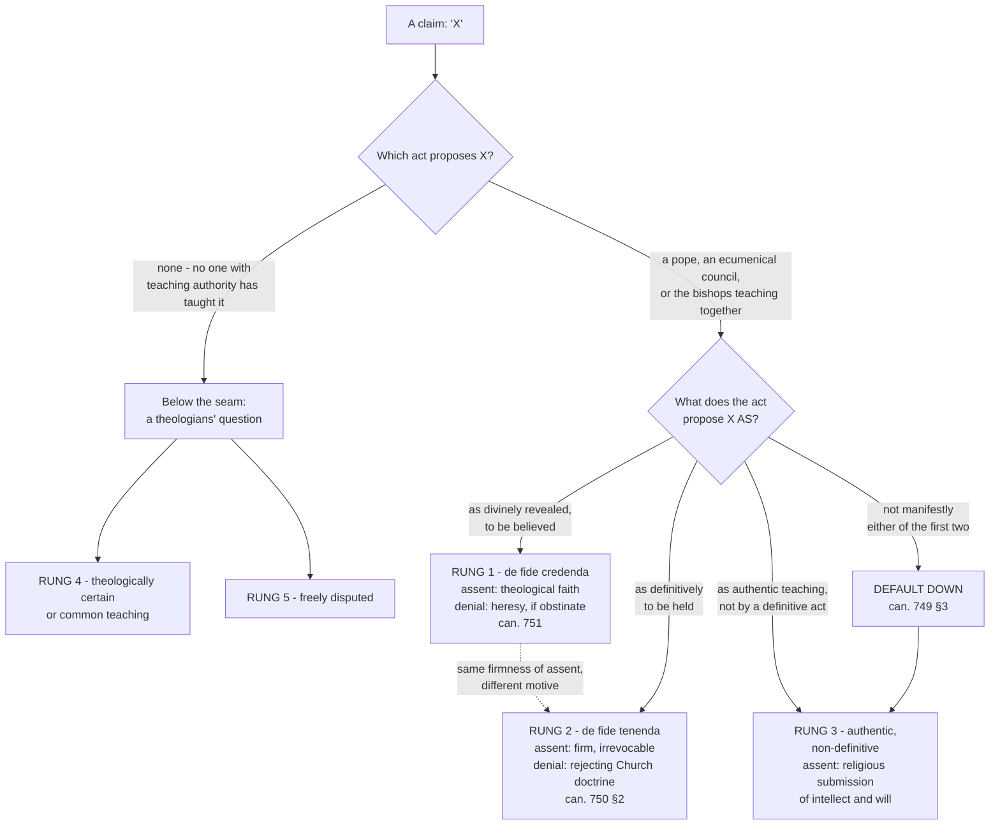

# Fundamental Theology · Lesson 4.4: The ladder of doctrinal authority

> ⏱ ~15 min · Module 4: The Magisterium and the ladder of authority · Builds on: [4.3 Religious submission](04-03-religious-submission.md) · Unlocks: [4.5 Reading a document's weight](04-05-reading-a-documents-weight.md)

## Why this matters

This is the lesson every other course in this field cites. From here on, whenever a lesson marks a claim *de fide*, or definitive, or freely disputed, it is using the procedure built here — and the mark is only worth something if the procedure is reliable in your hands, not just in the author's.

The procedure has one cardinal virtue and one cardinal sin. The virtue: it lets you say exactly what a Catholic owes a given claim, and exactly what denying it would amount to, instead of the two useless answers ("everything binds" and "nothing binds but the Creed"). The sin is **overstatement** — promoting a claim to a rung its act never reached. Overstatement is not piety. It makes the faith unreadable, and it is the mistake this lesson spends most of its length preventing.

## The idea

**The ladder grades acts, not topics.** This is the whole trick, and almost every error comes from forgetting it. "The Eucharist" is not at a level; *the bread and wine are changed into the body and blood of Christ* is at a level, because a council proposed that sentence in a particular way. So you never ask "how important is this?" You ask: **which act proposed this, and what did that act propose it as?**

Three modes of proposal are available to the Magisterium, and they come to us already enumerated. The **Profession of Faith** issued in 1989 — the formula sworn by those taking office in the Church — ends with three paragraphs after the Creed, and the three are not stylistic variation. Paraphrased:

1. *With firm faith I believe everything contained in God's word, written or handed on, which the Church proposes to be believed as divinely revealed — whether by a solemn judgment or by the ordinary and universal magisterium.*
2. *I firmly accept and hold each and every thing definitively proposed by the Church concerning faith and morals.*
3. *I adhere with religious submission of will and intellect to what the Roman Pontiff or the college of bishops teach when exercising their authentic magisterium, even when they do not intend to proclaim it by a definitive act.*

Believe · hold · adhere. Three verbs, three rungs. Everything below those three rungs is not a lower grade of magisterial act; it is **no magisterial act at all**, and is graded by theologians instead. That is why the ladder has a seam in it after rung 3.

## The argument

### The ladder

| Level | Example | Assent owed | Denial is |
|---|---|---|---|
| **1.** Divinely revealed and proposed as such (*de fide divina et catholica*): solemnly defined **or** taught infallibly by the ordinary universal magisterium | the hypostatic union (Chalcedon); the Immaculate Conception (1854) | theological faith | heresy, if obstinate (can. 751) |
| **2.** Definitive teaching, to be held: truths connected with revelation, including dogmatic facts | reserved priestly ordination (*Ordinatio Sacerdotalis*, 1994) | firm acceptance and holding | rejecting the doctrine of the Church (can. 750 §2), not heresy as such |
| **3.** Authentic ordinary magisterium, non-definitive | the principle of subsidiarity (*Quadragesimo Anno*, 1931) | religious submission of intellect and will, graded by the document's character, frequency and wording | not heresy; responsible non-assent is possible but has conditions (*Donum Veritatis*) |
| **4.** Theologically certain / common teaching | many conclusions of the manuals | the respect due to a strong theological consensus | theological rashness or error, in the manuals' censures |
| **5.** Freely disputed among Catholics | Thomist vs Molinist accounts of grace; the fate of unbaptized infants | none beyond the evidence | taking a side |

Now rung by rung.

**Rung 1 — proposed as divinely revealed.** The act says, in effect: *this belongs to what God has revealed, and the Church puts it to you as such.* Two routes reach it, and they are equally sufficient. A **solemn judgment** — an ecumenical council's definition, or a papal definition meeting the conditions checked in [4.2](04-02-infallibility-and-its-conditions.md). Or the **ordinary and universal magisterium**: the bishops throughout the world, in communion with the pope, concurring in proposing one teaching as definitively to be held. The second route is the one people forget, and forgetting it produces the most common overstatement's mirror image — "it was never defined, so it isn't dogma," which is simply false. Dogma does not require a definition. Assent here is **theological faith**: the believer holds it because God, who cannot deceive, has revealed it. Obstinate denial or obstinate doubt of such a truth, after baptism, is what canon law calls heresy (can. 751) — note *obstinate*, and note *after baptism*; the word is a canonical term with conditions, not a synonym for "badly wrong."

**Rung 2 — proposed as definitively to be held.** The act says: *this is not itself part of revelation, but the deposit cannot be guarded or expounded faithfully without it, so the Church settles it irrevocably.* The truths here are connected to revelation either by **logical necessity** (they follow from a revealed truth) or by **historical necessity** — the class the tradition calls **dogmatic facts**, such as the legitimacy of a particular papal election or of a given ecumenical council. You cannot hold that a council taught with authority while holding that the council may never have been validly celebrated.

The 1983 Code had a canon for rung 1 and a canon for rung 3, and nothing for the middle. That gap is what **Ad Tuendam Fidem** (John Paul II, 1998) closed: it inserted a new **can. 750 §2** stating that everything definitively proposed by the Magisterium concerning faith and morals must be firmly accepted and held, and that one who rejects such propositions sets himself against the doctrine of the Catholic Church. It amended the corresponding penal canon to match. Issued the same year, the **CDF's Doctrinal Commentary on the concluding formula of the Professio fidei** explains the three paragraphs and supplies worked examples.

The commentary makes one point that is easy to miss and does more work than anything else in this lesson: **the firmness of assent owed at rungs 1 and 2 is the same.** Both are full and irrevocable. What differs is the *motive* — at rung 1 the assent rests on faith in God's own authority revealing; at rung 2 it rests on faith in the Holy Spirit's assistance to the Magisterium — and, consequently, the canonical description of denial. So "only rung 2" is never a way of saying "less binding."

**Rung 3 — authentic, non-definitive.** The act teaches with real authority but does not close the question. Most encyclical teaching lives here. What is owed is **religious submission of intellect and will** — a genuine interior adherence, not mere silence — and it is graded: the character of the document, how often the teaching is repeated, and the manner of speaking are the signs of the mind of the Magisterium, which is [4.3](04-03-religious-submission.md)'s subject. *Donum Veritatis* (1990) is where the conditions for a theologian's responsible difficulty and the limits of dissent are set out. Denial is not heresy, and a non-definitive teaching can in principle be refined later — but "non-definitive" is not "optional."

### The seam: why rungs 4 and 5 are a different kind of thing

Rungs 4 and 5 are **theological notes**: labels *theologians* attach to propositions, describing how securely the proposition follows from the sources. The manual tradition (Ott is the convenient reference) ran a whole scale — *de fide*, *fidei proxima*, *theologice certa*, *sententia communis*, *sententia probabilis* — with matching censures running the other way (heretical, erroneous, rash). The top of that scale is fixed by magisterial acts and simply coincides with rungs 1 and 2. Rungs 4 and 5 are **the part of the scale that no magisterial act reaches**.

Which is why they do not rank strictly against rung 3. The two are answers to different questions:

- Rungs 1–3 answer: **what did the Magisterium do, and in what mode?**
- Rungs 4–5 answer: **how strong is the theological inference, given that the Magisterium has not acted?**

So "this is only rung 4, and rung 4 is below rung 3, so I owe it less than an encyclical" is a malformed sentence. The correct statement is: *no magisterial act proposes it, so no magisterial assent is owed; what is owed is the respect due to a strong theological consensus, and departing from it is rash rather than disobedient.* And the two scales can swap places in practice — a proposition the manuals called theologically certain may be far better argued than a passing line in an encyclical, while still binding no one.

The seam is crossable in one direction. *Humani Generis* (1950) noted that when the popes deliberately pronounce on a matter hitherto disputed, it ceases to be a free question for theologians. A rung-3 act moves a claim off rung 5.

### The procedure

Given a claim, in this order:

1. **Find the act.** Who proposed it — pope, ecumenical council, the bishops teaching together — and in what document? If no one with teaching authority proposed it, stop: you are at rungs 4–5, and the question is which.
2. **Ask what the act proposes it AS.** As divinely revealed and to be believed? As definitively to be held? As authentic teaching not intended as definitive? Read the operative sentence, not the surrounding exposition.
3. **Read off the assent and the denial** from the table.
4. **If step 2 is not clear, default DOWN.** Canon 749 §3: no doctrine is understood to be infallibly defined unless that is manifestly established. Ambiguity in the act is resolved against the higher rung, never for it.

Step 4 is the anti-overstatement rule and the reason the procedure is trustworthy. It also means "I can't tell" is a legitimate output — it just has a floor attached.

## Argument map

The dashed edge is the commentary's point, and it is the one most often lost: rungs 1 and 2 differ in *why* you hold it, not in *how firmly*.

## Worked examples

**Example 1 (mechanical — two claims at the same rung by different routes).**

*Claim A: Christ is one person in two natures, divine and human, without confusion and without division.*

Step 1, the act: the Council of Chalcedon (451), an ecumenical council, in its definition of faith. Step 2, the mode: a solemn judgment proposing the doctrine as the faith of the Church, against Eutyches and Nestorius. Step 3: **rung 1**; assent is theological faith; obstinate denial after baptism is heresy (can. 751) — and indeed the Christological heresies are where the word gets its shape. Step 4 is not needed; the mode is manifest.

*Claim B: the inspired Scriptures are free from error.*

Step 1 gives a pile of acts, not one: Trent, *Dei Filius*, *Providentissimus Deus* (1893), *Dei Verbum* 11 — and no new definition in any of them. A student running the procedure carelessly stalls here: "never solemnly defined, so it is not dogma." Step 2 is the fix. Ask not *was it defined* but *is it proposed as divinely revealed*, and the answer is yes — the bishops and popes have concurred without interruption in proposing it as belonging to God's word about God's word. The manuals mark it *de fide* ([3.2](03-02-inerrancy.md)), and the 1998 commentary's examples place the absence of error in the inspired sacred texts under the **first** paragraph of the Profession. **Rung 1, by the ordinary universal magisterium.**

Two things to take from the pair. First, **the route does not change the rung**. Second, notice what is *not* thereby settled: the **scope** of inerrancy — what the clause *for the sake of our salvation* in *Dei Verbum* 11 restricts — is freely disputed, at rung 5, while the doctrine itself sits at rung 1. A doctrine's level says nothing about the level of any particular reading of it. That distinction is a third of the skill.

**Example 2 (the hard case — where the procedure strains, and honestly cannot be forced).**

*Claim: the Church has no authority to confer priestly ordination on women.*

Step 1, the act: *Ordinatio Sacerdotalis*, an apostolic letter of John Paul II (1994). Its operative sentence does not say "I define"; it says he declares that the Church has no such authority and that this judgment is to be **definitively held** by all the faithful. Two later acts bear on it:

- The **CDF's response to a doubt (1995)** states that the teaching requires definitive assent, since — being founded on the written word of God and constantly preserved and applied in Tradition — it has been **set forth infallibly by the ordinary and universal magisterium**.
- The **1998 doctrinal commentary** lists it among its examples under the **second** paragraph of the Profession of Faith.

Step 2 is where it strains, because those two point in subtly different directions. The commentary's own framework says second-paragraph truths are connected with revelation but *not* proposed as revealed — yet the 1995 response calls the teaching founded on the written word of God and infallibly taught by the very organ that, under the first paragraph, is one of the two ways a truth is proposed as divinely revealed. So:

- **The rung-2 reading.** The classification is the CDF's own and is explicit: the commentary sorts it under paragraph two. "Founded on the written word of God" describes the teaching's ground, not the mode in which it is proposed; and the operative verb in 1994 is *held* (*tenenda*), the second paragraph's verb, not *believed*. Canon 749 §3's discipline applies: absent a manifest proposal as revealed, do not promote.
- **The rung-1 reading.** If the ordinary and universal magisterium has taught it infallibly and it is founded on the written word of God, the material conditions of the first paragraph appear to be met, and the commentary's placement records the Church's current qualification rather than foreclosing a later determination — the commentary itself allows that a truth held definitively may afterwards be defined as divinely revealed.

**Both readings are held by Catholic theologians in good standing, and this lesson does not settle it.** What you must not do is report either as simply *the* level.

What the procedure *does* deliver, unambiguously, is everything that matters practically:

- The claim is **at least rung 2**. It is not rung 3, not an open question, and not a disciplinary rule — a Catholic who treats it as debatable has misread all three documents.
- **The assent owed is identical on either reading** — full and irrevocable — by the commentary's own equalizing point.
- The live difference is the *motive* of assent and the *canonical description* of denial: heresy under can. 751, or setting oneself against the doctrine of the Church under can. 750 §2.

That is what a well-run disputed case looks like: the disagreement located precisely, and everything outside it stated without hedging.

## Watch out

- **You might think infallible means defined.** The ordinary and universal magisterium teaches infallibly without any definition. "Never defined" is not an argument for anything.
- **You might think undefined means open.** Between "defined dogma" and "free opinion" sit rungs 2 and 3, which is most of what the Church actually teaches.
- **You might think rung 2 means "less binding than rung 1."** It means a different motive for the same firmness. Save "less binding" for rung 3, where it is true.
- **You might think "the Catechism says so" fixes a level.** The Catechism is a compendium; every claim in it keeps the weight of the act it summarizes, and a summary cannot raise or lower that. This is [4.5](04-05-reading-a-documents-weight.md)'s main business.
- **You might think rung 4 is just below rung 3.** They answer different questions and are not strictly ordered. Say *what* is owed, not *how much*.
- **Heresy is a technical word.** Can. 751 requires **obstinate** denial or doubt of a rung-1 truth, **after baptism**. An honest mistake, an unsettled mind, or a non-Catholic's disagreement is not what the canon describes.
- **Do not confuse the ladder with the hierarchy of truths.** *Unitatis Redintegratio* 11's point is that revealed truths differ in their nearness to the foundation of the Christian faith. That is an axis of *centrality*, not of authority; the Trinity and the Assumption are both rung 1 and are not equally central. [4.5](04-05-reading-a-documents-weight.md) keeps the two apart.
- **A level is not a verdict on importance, and never a conversation-ender.** It tells you what kind of disagreement you are in — which is the beginning of the argument, not a substitute for it.

## One-liner

> Find the act, ask what it proposes the claim *as*, read off the assent — and when the act is not manifest, default down.

## Problems

**P1 (🟢) *(Exegetical.)*** For each claim, run steps 1–3: name the act, give the rung, and say what a Catholic who denied it would be doing. One sentence each. Do not use any claim's subject matter to decide — use its act.

(a) The bread and wine are changed into the body and blood of Christ. *(Trent, Session XIII, 1551, decree with attached canons.)*
(b) This particular ecumenical council was legitimately celebrated. *(A dogmatic fact; the 1998 commentary's own class of example.)*
(c) A teaching set out once, at length, in a papal encyclical, which the encyclical neither defines nor says is to be held definitively.

**P2 (🟡) *(Exegetical (a) · Evaluative (b).)*** An invented forum post:

> "People keep saying the Church 'teaches' X. But it's never been defined by a council or declared ex cathedra, so it's just the current opinion of the bureaucracy. And frankly Y is in the same boat — the manuals all agreed on it for centuries, which tells you it was theological consensus, not doctrine. Consensus isn't authority. Until someone defines these, I'm free."

(a) Name the three distinct errors about levels this paragraph makes, and for each say which step of the procedure it skips. (b) The poster replies that his rule at least has the virtue of never overstating a level, which the lesson says is the cardinal sin. In 150 words or fewer, assess that defence — any verdict, provided you say what the procedure's own safeguard against overstatement actually is and how it differs from his rule.

**P3 (🔴, optional) *(Exegetical (a), (c) · Evaluative (b).)*** An invented operative sentence from a hypothetical papal document:

> "This doctrine belongs to the deposit entrusted to the Church, has been handed down without interruption, and must be held by all the faithful."

(a) Which rung does this sentence, by itself, establish — and which words are doing the work? (b) In 150 words or fewer, say what a reader would need to find, in this document or elsewhere, to justify placing it at the rung above; and what step 4 requires if that evidence is not found. (c) A commentator writes that since the sentence says the doctrine "belongs to the deposit," it is *ipso facto* proposed as divinely revealed. Say what that argument confuses.

Solutions

**P1** *(Exegetical — strict. Overstating any rung is an error.)*

**Must hit, strict:**
- (a) Act: a solemn judgment of an ecumenical council, with canons — the canons are the operative part ([1.1](01-01-what-fundamental-theology-asks.md)). **Rung 1**, proposed as divinely revealed. Obstinate denial after baptism is heresy (can. 751).
- (b) Act: not the council's own teaching but a truth the Church holds definitively as a dogmatic fact — connected with revelation by historical necessity. **Rung 2.** Denial is rejecting a doctrine to be held definitively (can. 750 §2); it is not heresy as such, because the fact is not itself revealed.
- (c) **Rung 3**, authentic ordinary magisterium, non-definitive. Owed: religious submission of intellect and will, graded by the document's character, frequency and manner of speaking ([4.3](04-03-religious-submission.md)). Denial is not heresy; responsible difficulty has conditions (*Donum Veritatis*), and withholding assent outright is a real failure, not a permitted option.

**Wrong turns:** putting (b) at rung 1 because councils are weighty — the rung tracks *this claim's* mode of proposal, not the dignity of the body it concerns; putting (c) at rung 4 or 5 because nothing was defined — an encyclical *is* a magisterial act, so the claim never crosses the seam; treating (a) as rung 2 because the topic is sacramental rather than credal.

**Model answer:** (a) conciliar definition with canons — rung 1; denial is heresy if obstinate. (b) a dogmatic fact held definitively — rung 2; denial sets one against the doctrine of the Church, without being heresy. (c) authentic non-definitive teaching — rung 3; religious submission is owed.

---

**P2** *(a) exegetical — strict; (b) evaluative — any verdict.*

**Must hit, strict (a):** three of —
1. **"Not defined, so not doctrine."** Skips step 2: the question is the *mode of proposal*, not whether a definition exists. The ordinary and universal magisterium can propose a truth as divinely revealed, reaching rung 1 with no definition anywhere.
2. **"Just the current opinion of the bureaucracy."** Skips step 1: it declines to identify the act at all. If a pope or the college of bishops taught it in an authentic act, rung 3 at minimum is engaged, whatever one thinks of the office-holders.
3. **"Consensus isn't authority, so Y binds no one."** Collapses the seam. Rungs 4–5 are answers to a different question than rungs 1–3, so "only consensus" does not place Y below an encyclical; and if the manuals' consensus was in fact the bishops concurring in proposing Y as to be held definitively, it was never rung 4 to begin with — which is exactly the case that has to be checked, not assumed.
4. (Also creditable) **"Until someone defines these, I'm free."** Treats rungs 2 and 3 as nonexistent — the binary the whole ladder exists to replace.

**Must hit, any verdict (b):** state the procedure's actual safeguard — **step 4**, canon 749 §3: where the mode is not manifest, resolve downward, to the *adjacent* rung. Then say how the poster's rule differs: his default is not "one rung down" but "off the ladder entirely," which is not caution about the mode of an act, it is refusal to look for the act. Any conclusion about whether his defence has some merit passes if that contrast is drawn.

**Wrong turns:** arguing about the merits of X or Y, which were deliberately left unspecified; conceding (b) on the grounds that "understating is safer than overstating" without noticing that understating rung 1 to rung 5 is itself an error of the same kind, in the other direction — the procedure is not biased toward the low end, it is biased toward the *evidenced* end with a tie-break.

**Model answer (b), one of several:** The defence borrows the right worry and draws the wrong rule from it. Canon 749 §3 does say that where an act's mode is not manifest, you do not read it as a definition — but that is a tie-break between adjacent rungs, applied after step 1 has identified an act. The poster applies it before step 1 and to the whole ladder: because no definition exists, nothing binds. That is not caution, it is a different claim about what the Magisterium is, and it produces errors as large as the overstatements it fears — a rung-1 truth taught by the ordinary universal magisterium ends up filed as opinion. Avoiding one cardinal sin by committing its mirror image is not a virtue.

---

**P3** *(a), (c) exegetical — strict; (b) evaluative.*

**Must hit, strict (a):** **Rung 2.** The operative words are **"must be held by all the faithful"** — *held*, the verb of the Profession's second paragraph, and the phrase that makes the proposal definitive. "Belongs to the deposit" and "handed down without interruption" state the teaching's *ground*; "without interruption" is a claim about transmission. Nothing here says it is proposed *to be believed as divinely revealed*, which is what rung 1 requires.

**Must hit (b), any verdict:** name what would be needed — language proposing it as **divinely revealed** or **to be believed** (the first paragraph's verb), an explicit definition, or a clear statement that the bishops throughout the world have concurred in proposing it *as revealed* rather than merely as to be held. And state step 4: if that is not found, canon 749 §3 governs and the claim stays at rung 2 — with the note that the assent owed is unchanged either way, so nothing practical hangs on the promotion.

**Must hit, strict (c):** it confuses the **object** with the **mode of proposal**. A truth can be connected with the deposit — required in order to guard and expound it faithfully — without being proposed as itself revealed; that is precisely the category the second paragraph and can. 750 §2 exist to name. "Belongs to the deposit" is also looser than "is contained in the word of God as revealed," and a document's own loose phrase cannot do the work of an operative one.

**Wrong turns:** reading "handed down without interruption" as invoking the ordinary universal magisterium — it describes Tradition's continuity, not the concurrence of the bishops now in proposing it; treating the sentence as rung 3 because it is "only" an apostolic document, when the verb *held* has already made it definitive; deciding the rung from how grave the subject sounds.

**Model answer:** (a) Rung 2 — "must be held by all the faithful" is the definitive proposal, and nothing proposes the doctrine as revealed. (b) You would need first-paragraph language — proposed as divinely revealed, or to be believed — or a definition; absent that, can. 749 §3 keeps it at rung 2, and the assent owed does not change. (c) It slides from *what the doctrine is about* to *how the act proposes it*; a truth connected with the deposit is exactly what rung 2 covers.

## Flashback

**F1 (🟡) *(Exegetical.)*** From [4.2](04-02-infallibility-and-its-conditions.md). An invented objection:

> "Vatican I says a papal definition is 'irreformable of itself, and not from the consent of the Church.' So the pope's private judgment overrides the whole Church, and he can put a new doctrine into the faith by fiat. Infallibility is a licence to invent."

(a) What was that clause actually aimed at, and what does it therefore claim? (b) Name the two features of the charism, as *Pastor Aeternus* itself describes it, that make "a licence to invent" a misdescription — and for each, say which words of the text carry it. **120 words or fewer.**

Solution

**Must hit, strict (a):** the clause is aimed at **Gallicanism** — the position that a papal definition took effect only once the episcopate had subsequently consented to it. It claims that the act is complete when made and does not wait on a later ratification. It does *not* claim that the pope defines apart from the Church's faith, or against the bishops; it settles *when the act binds*, not *where its content comes from*.

**Must hit, strict (b):** two of —
1. **Infallibility is the Church's own charism, exercised through an organ, not a second charism belonging to the man.** The text says the Roman Pontiff possesses **"that infallibility with which the divine Redeemer willed that his Church should be endowed"** — *that* one. So it cannot put him over against the Church whose charism it is.
2. **It is a negative protection, not inspiration.** The text speaks of **"the divine assistance promised to him in blessed Peter"** — assistance preserving a definitive act from error. No new revelation is given, so there is nothing to invent *with*; a definition proposes what was already in the deposit ([3.4](03-04-tradition.md)'s servant clause).
3. (Also creditable) **"Defines a doctrine regarding faith or morals"** restricts the matter — the charism does not reach physics, politics or history as such.

**Wrong turns:** answering that the objection fails because popes rarely define — true but irrelevant, since the objection is about what the doctrine permits, not how often it is used; reading "not from the consent of the Church" as "without the Church's faith," which is the objection's own conflation repeated back; treating the clause as making the pope superior to an ecumenical council, a question the sentence does not address.

## Connections

- **Backward:** [4.1](04-01-the-magisterium.md) identified the teaching acts, [4.2](04-02-infallibility-and-its-conditions.md) supplied the conditions this lesson's step 2 checks at rung 1, and [4.3](04-03-religious-submission.md) is the whole content of rung 3's assent — the ladder is those three lessons put into one procedure.
- **Forward:** [4.5](04-05-reading-a-documents-weight.md) supplies step 1's missing half — how a document's genre bears on what it is likely doing — and separates the hierarchy of truths from this ladder. [5.1](05-01-vincent-of-lerins.md) and [5.2](05-02-newmans-theory-of-development.md) ask the next question: how a claim can move *up* the ladder over time without the faith having changed.
- **Where it goes:** every Catholic Theology course cites this lesson for levels — [`christology`](../../christology/syllabus.md) and [`trinity-and-god`](../../trinity-and-god/syllabus.md) for conciliar dogma, [`moral-theology`](../../moral-theology/syllabus.md) and [`catholic-social-teaching`](../../catholic-social-teaching/syllabus.md) for the rung-3 cases where the reading is hardest, and [`theology-of-debt`](../../theology-of-debt/syllabus.md) for usury, where the level of the medieval teaching is the whole question.
- **Sideways:** [`apologetics-catholic-claims`](../../apologetics-catholic-claims/syllabus.md) argues the ladder against the objection that it is a device for retreating; that argument is not made here, where the ladder is simply described from within.
