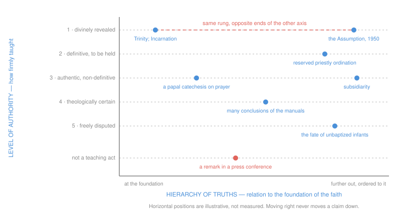

# Fundamental Theology · Lesson 4.5: Reading a document's weight

> ⏱ ~15 min · Module 4: The Magisterium and the ladder of authority · Builds on: [4.4 The ladder of doctrinal authority](04-04-the-ladder-of-doctrinal-authority.md) · Unlocks: [5.1 Vincent of Lérins](05-01-vincent-of-lerins.md)

## Why this matters

[4.4](04-04-the-ladder-of-doctrinal-authority.md) gave you the rungs. This lesson is the part you actually use: a document lands in front of you — an exhortation, a note from a dicastery, a paragraph of the Catechism, a headline about something the pope said on a plane — and you have to say what weight it carries before you can say anything else about it. Almost every public argument about "what the Church now teaches" is really a misreading at this step, and the misreadings run in both directions: people inflate a press conference into doctrine, and they deflate a definitive teaching into an opinion because it arrived in a letter rather than a council.

The lesson has a spine, and it is the error that catches the best-read people: **the hierarchy of truths is not a level of authority.** It answers a different question entirely. Get the two axes separated here and you will never make the mistake again.

## The idea

Three claims, and the rest of the lesson is their working out.

**1. Genre is evidence, not verdict.** Each genre has a typical range, but nothing in the Church's practice makes the label decisive. One of the weightiest papal teachings of recent decades arrived in an *apostolic letter*, the lowest-sounding genre on the list. Genre narrows your search; the operative sentence closes it.

**2. The Catechism is a compendium, not a source.** It restates what Scripture, the councils, the Fathers and the popes already teach, and footnotes them on nearly every doctrinal page. Its entries therefore keep the weight of the sources they summarize — which differs from paragraph to paragraph, though the typeface does not. "The Catechism says so" locates a claim; it never grades it.

**3. Theological notes are not magisterial acts.** *De fide*, *theologice certa*, *sententia communis* — the manuals' labels are theologians' testimony *about* where a claim stands. Excellent testimony, often; still testimony, checked against the acts and not the other way round.

And then the axis problem. When *Unitatis Redintegratio* says truths differ in their relation to the foundation of the faith, it is not saying some are less firmly taught — it is saying they sit at different distances from the center, the Trinity and the Incarnation at the foundation and everything else ordered to them. A truth can be as firmly taught as anything in the faith and still stand well out from the center. Confusing the two axes is this lesson's target.

## The argument

### The genres, and what each typically carries

| Genre | What it is | Typically carries | The catch |
|---|---|---|---|
| **Dogmatic constitution** (council) | the heaviest conciliar genre; sets out doctrine as such | doctrine at whatever level the teaching itself has; older councils defined in this form | Vatican II defined no new dogma, so *Lumen Gentium* and *Dei Verbum* carry the weight of what they restate — which is often very high |
| **Pastoral constitution** (council) | doctrinal principles applied to a concrete historical situation | the principles at their own weight; the applications are prudential | *Gaudium et Spes* carries an explanatory note saying "pastoral" means it rests on doctrine and applies it — not that it contains none |
| **Decree, declaration** (council) | a decree reorders some area of Church life; a declaration states the Church's mind on a question | usually authentic ordinary magisterium | *Dignitatis Humanae* is "only" a declaration and contains a weighty doctrinal teaching; genre did not cap it |
| **Apostolic constitution** (pope) | the heaviest papal genre; used for law, for structures, and for the two uncontested definitions (1854, 1950) | anything up to a solemn definition | most of them are administrative — erecting dioceses, reforming the Curia |
| **Encyclical letter** (pope) | a circular letter to the bishops and usually to the whole Church | authentic ordinary magisterium, non-definitive by default | *Humani Generis* (1950) warns that when a pope deliberately passes judgment on a hitherto controverted matter, theologians may no longer treat it as open — and an encyclical can carry more still (Example 2) |
| **Apostolic exhortation** (pope) | usually gathers up a synod; aimed at practice | authentic ordinary magisterium, much of it prudential application | "exhortation" does not mean "optional" — but much of the content is judgment about how to act, which is not a doctrinal rung |
| **Apostolic letter** (pope) | the catch-all papal letter | anything from an honorific to a definitive teaching | *Ordinatio Sacerdotalis* (1994) is an apostolic letter. This row is why genre cannot be the verdict |
| **Motu proprio** | not a genre of content at all — a mode of issuing, "on his own initiative," almost always legislative | law | **not a doctrinal rung.** *Ad Tuendam Fidem* (1998) was an apostolic letter given motu proprio, and its work was to add a paragraph to canon 750 and adjust the matching penal canon |
| **Instruction** (dicastery) | clarifies laws and determines how they are applied (Code of Canon Law, can. 34) | the weight of the doctrine it restates, plus binding force in practice; it cannot derogate from law | an instruction that quotes a dogma is not thereby making dogma, and its own practical rules are changeable by the authority that made them |
| **Declaration, note, responsum** (dicastery) | the doctrinal office answering a question or stating the Church's position | the weight of the teaching it certifies, plus the papal approval it carries | approval *in forma specifica* makes the act the pope's own; ordinary approval (*in forma communi*) leaves it the dicastery's. Check which |
| **Address, homily, audience catechesis** (pope) | the pope teaching in person | at its heaviest, authentic ordinary magisterium at its lightest grade | no definition is ever made this way. Publication in the *Acta Apostolicae Sedis* is one sign theologians read as intent to teach |
| **Interview, press conference, private letter, preface** | conversation | **not a teaching act of the kind the ladder grades**, whatever its interest | not a slight — it is what the genre is. A pope answering a reporter is not engaging the office, and reporting him as though he were is the commonest overstatement in circulation |

A bishops' conference teaches authentically in its own territory; its documents are not acts of the universal magisterium.

### The procedure

Four steps, in this order. Do not skip to the fourth.

1. **Source.** Who is teaching, in what capacity? A pope alone; a pope with the bishops (a council, or the bishops dispersed but agreeing — the ordinary universal magisterium); a dicastery, and with which grade of papal approval; a bishops' conference; or a consultative body (the International Theological Commission and, since 1971, the Pontifical Biblical Commission are advisory, not magisterial — their documents carry the weight of their arguments).
2. **Genre.** Read the label, use the table, and write down a *range*, not a number.
3. **The operative sentence.** Find the actual verb. This is where the answer is.
4. **The rung.** Assign it from 4.4's ladder, say what assent is owed, and if the level is argued among theologians, say so and give both readings. The default when the evidence is thin is the **lower** rung: the Code makes the principle explicit for infallibility — nothing is to be understood as infallibly defined unless that is manifestly established (can. 749 §3) — and the same caution governs the rest of the ladder.

The verbs, roughly:

| Operative language | Reads as |
|---|---|
| "we declare, pronounce and define"; a canon closing with *anathema sit* | a definition — rung 1, or rung 2 if the object is a truth connected with revelation rather than revealed |
| "to be held definitively by all the faithful" | rung 2 |
| "the Church has always taught"; "must be firmly accepted and held" | an appeal to the ordinary universal magisterium — now check whether the appeal is *established* or merely asserted |
| "we teach," "we declare," with the authority engaged, especially if repeated across documents | rung 3 at its heaviest, and evidence toward rung 1 or 2 if the bishops concur |
| "we exhort," "we encourage," "it is fitting," "the Church cannot but" | pastoral or prudential; no rung |
| "inadmissible," "not to be permitted," "the faithful are asked to" | very often a judgment about practice — and a judgment about practice can rest on a doctrinal principle without itself being one |

### The other axis: the hierarchy of truths

**The ladder** answers: *how firmly is this taught, by what act, and what assent does it ask?*

**The hierarchy of truths** answers: *how does this truth stand to the foundation of Christian faith?* *Unitatis Redintegratio* (Decree on Ecumenism, 1964), section 11, paraphrased: Catholic theologians engaged in dialogue should remember that there exists an order or "hierarchy" of truths of Catholic doctrine, since the truths vary in their relation to the foundation of the Christian faith. Read where it stands — a passage about how doctrine is to be *expounded and compared* in ecumenical work. The same section insists the whole doctrine be set out clearly and warns against a false irenicism that blurs its meaning. It is an instruction about order of exposition, not a licence to hold less.

So the axes are independent. The bodily Assumption is defined dogma — the top rung, denial of which is heresy — and it stands a long way out from the foundation, which is exactly why *Munificentissimus Deus* argues for it from Mary's place in the mystery of redemption rather than from itself. The Incarnation is the same rung and *is* near the foundation. Moving right on the second axis never moves a claim down the first.

### The manuals' notes and censures

Below and alongside the magisterial rungs, the manual tradition graded claims with **theological notes**, and graded the errors opposed to them with **censures**. Ludwig Ott's *Fundamentals of Catholic Dogma* is the standard reference for how the tradition labelled things; his scale, in descending order, runs roughly:

| Note | Means | Opposed censure |
|---|---|---|
| *de fide* (*de fide definita* when defined) | revealed and proposed as such | heretical |
| *fidei proxima* | held by theologians generally as revealed, never finally proposed as such | proximate to heresy |
| *theologice certa* | not revealed itself, but so tightly connected to revelation that denying it endangers a revealed truth | erroneous in theology |
| *sententia communis* | in itself a free question, but held by theologians generally | temerarious — theologically rash |
| *sententia probabilis*, *bene fundata*, *pia*, *tolerata* | supported, well-founded, pious, or merely tolerated opinion | usually none |

Two things to hold onto. First, the vocabulary is genuinely old and was used by the Magisterium itself — *Auctorem Fidei* (1794) condemned the propositions of the Synod of Pistoia with a list of censures applied to them collectively, leaving theologians to sort out which censure fell on which proposition. Second, and decisively: **a note is a theologian's judgment about the acts, not one of the acts.** It is evidence, it can be stale, and where Ott's note and a magisterial act disagree, the act wins. This is why 4.4's ladder keeps rungs 4 and 5 off the strict ordering: they are qualifications, not exercises of the teaching office.

## The two axes

The dashed coral line is the whole lesson. Two claims, one rung, opposite ends of the other axis — and no amount of travel to the right pulls either one downward.

## Worked examples

**Example 1 (mechanical — running the procedure).** *Ordinatio Sacerdotalis* (1994) and the question of women's ordination. Run the four steps.

*Source:* the pope, teaching the whole Church. *Genre:* an **apostolic letter** — the catch-all, and on genre alone you would guess something light. Range: anything. *Operative sentence:* John Paul II declares (paraphrasing the Latin) that the Church has no authority whatsoever to confer priestly ordination on women, and that this judgment is to be **definitively held** by all the Church's faithful. Two things in that sentence do the work: the verb is not "define," and "definitively held" is the rung-2 formula from the second paragraph of the 1989 Profession of Faith. *Rung:* at least rung 2.

Now the part you must not smooth over. The CDF's 1995 *responsum ad dubium* said the teaching belongs to the deposit of faith and has been set forth **infallibly by the ordinary and universal magisterium** — infallibility with no definition in sight, arriving through a dicastery's reply rather than through the letter itself. The CDF's 1998 doctrinal commentary on the Profession of Faith then lists it among the examples under the **second** paragraph. So: infallibly taught, and classified with the definitive truths rather than the revealed ones — and whether it is best placed at rung 1 or rung 2 is argued by Catholic theologians in good standing. Report that; do not collapse it either way.

What the case teaches: the genre label told you nothing, the operative sentence told you almost everything, and the last refinement came from a different document, in a different genre, from a different source.

**Example 2 (where it strains — the Catechism and the death penalty).** Someone opens the Catechism to 2267, reads that capital punishment is inadmissible, and concludes that the Church has dogmatically defined it. Work it.

*Is the Catechism the source?* No. It is a compendium, promulgated by *Fidei Depositum* (1992) as a sure norm for teaching the faith — a reliable statement of what the Church holds, assembled from Scripture, the councils, the Fathers and the popes, with footnotes pointing at each. The proof is in the file's own history: **the paragraph was changed.** In 2018 Francis approved by rescript a new text calling the death penalty "inadmissible," and the CDF sent bishops a letter presenting the change as an authentic development in continuity with prior teaching. A source of revelation does not get edited; a summary does. So the question is never "what does the Catechism say" but "what is this paragraph summarizing, and at what weight was *that* taught."

*So what is the weight?* The act behind the paragraph is papal teaching of the authentic ordinary magisterium — rung 3, asking religious submission of intellect and will ([4.3](04-03-religious-submission.md)). Whether the new formulation is a legitimate development or stands in tension with the prior teaching is argued among Catholic theologians right now, and the moral substance belongs to [`moral-theology`](../../moral-theology/syllabus.md) and [`catholic-social-teaching`](../../catholic-social-teaching/syllabus.md), not here. The structural lesson is what belongs here: the Catechism's uniform typeface flattens rungs that are not flat. Two paragraphs on facing pages can be a Chalcedonian dogma and a prudential application, and nothing on the page tells you which — except the footnotes, which is why they are there.

*The neighbouring case, for contrast.* In *Evangelium Vitae* (1995) — an **encyclical**, the genre whose default is non-definitive — John Paul II three times used a solemn formula, confirming teachings on the killing of the innocent, on abortion and on euthanasia by his own authority in communion with the bishops, and pointing at the ordinary universal magisterium as the ground. He did not say "define." Many theologians read those passages as infallible teaching by the ordinary universal magisterium; others hold that the deliberate choice of "confirm" over "define" leaves them short of a definition. Same direction as Example 1: the genre's default was the wrong answer, and the operative sentence is where the argument lives.

## Watch out

- **You might think "the Catechism says so" settles a claim's level.** It settles that the claim is Catholic teaching. The level is whatever the footnoted source carries — and the paragraph can be revised, as 2267 was.
- **You might think "it's only an exhortation / an instruction / a note" means it can be ignored.** Genre sets a typical range, not a ceiling and not a floor. Read the sentence. Equally, a genuinely prudential application stays prudential however weighty its neighbours in the same document.
- **You might think a motu proprio is a heavy doctrinal act.** It is a mode of issuance, almost always legislation, and not on the ladder at all.
- **You might think an interview or an in-flight remark changes what the Church teaches.** It is not a teaching act of the kind the ladder grades — which cuts both ways: it is also not evidence that the pope has departed from anything.
- **You might think a low place in the hierarchy of truths means a lower level of authority.** This is the lesson's target error. *Unitatis Redintegratio* 11 concerns a truth's relation to the foundation of the faith and the order in which doctrine is expounded. A dogma far from the center is still a dogma, denied at the cost of heresy; the same section forbids softening doctrine for a dialogue partner.
- **You might think Ott's note is the Church's verdict.** The notes are the theologians' apparatus — useful, often excellent, not magisterial, and sometimes overtaken by later acts. When note and act disagree, the act wins.
- **You might think "Vatican II was pastoral, so it taught nothing binding."** The council defined no new dogma — a real and important fact — but it does not follow that its constitutions teach nothing. Their doctrinal statements carry the weight of what they restate, and as acts of the supreme authority's ordinary magisterium they ask at minimum religious submission ([4.3](04-03-religious-submission.md)).

## One-liner

> Source, then genre, then the operative sentence, then the rung — and never mistake how far a truth stands from the foundation of the faith for how firmly the Church teaches it.

## Problems

**P1 (🟢) *(Exegetical.)*** For each, name the **typical** weight the genre carries, and name the **one thing** you would look at next to fix the actual level. One clause each.

(a) A dogmatic constitution of the Second Vatican Council
(b) An instruction from a dicastery on the celebration of a sacrament
(c) An apostolic letter issued *motu proprio* that reorganizes an office of the Curia
(d) A papal general audience catechesis
(e) A pope's answer to a journalist on a return flight
(f) A paragraph of the Catechism

**P2 (🟡) *(Exegetical (a) · Evaluative (b).)*** An invented parish bulletin insert, written for this problem:

> "Vatican II taught a hierarchy of truths, which means the Church herself distinguishes core doctrines from peripheral ones. The Trinity and the Resurrection are core. The Marian dogmas are peripheral — the Council placed them lower — so they ask less of us, and in conversation with our Protestant neighbours we can honestly set them aside as secondary."

(a) Name the confusion the insert makes, say what *Unitatis Redintegratio* 11 actually concerns, and correct each of the three claims that follow from the confusion. Be exact about the Assumption's level and what denying it would amount to.
(b) The hierarchy of truths was stated for ecumenical work. Does recognizing that a dogma stands far from the foundation change what a dialogue partner would have to accept for full communion? Argue either way in **150 words or fewer**, and state one thing the hierarchy of truths certainly does *not* license.

**P3 (🔴, optional) *(Exegetical.)*** A fictional document, invented for this problem: the (fictional) *Note on the Pastoral Care of Catechumens in Mixed Marriages*, issued by a dicastery, approved by the pope in the ordinary way, whose two key sentences read:

> "The Church has always held, and holds definitively, that baptism is necessary for salvation in the manner set forth by the Council of Trent. Pastors are therefore asked to ensure that preparation is not delayed beyond one year."

(a) Run the four steps on **each** sentence separately and give each a rung (or say why it has none). (b) Name two changes to the document that would raise the level of the first sentence, and say why each would work. (c) A friend replies: "Ott marks that as *de fide*, so the Note is dogma." Say in one sentence what Ott's label does and does not establish. **150 words or fewer** for (b) and (c) together.

Solutions

**P1** *(Exegetical — strict.)*

**Must hit, strict:**
- (a) The council's heaviest genre; doctrine at the level of what it restates — but Vatican II defined no new dogma. **Next:** the operative sentences, and what earlier act each one is restating.
- (b) Clarifies and applies law (can. 34); binding in practice; the doctrine it quotes keeps its own prior weight. **Next:** whether a given sentence is restating doctrine or laying down a practical rule that the same authority could change.
- (c) Legislative, not doctrinal — a motu proprio is a mode of issuance and this one has no rung at all. **Next:** nothing on the ladder; if it also teaches, that teaching is graded on its own.
- (d) At most authentic ordinary magisterium, at its lightest; no definition is made this way. **Next:** whether the pope is engaging his teaching authority on a doctrinal point (publication in the *Acta Apostolicae Sedis* is one sign) or preaching and applying.
- (e) Not a teaching act of the kind the ladder grades. **Next:** whether the content corresponds to something he has taught in an actual teaching act — that document, not the remark, is what you weigh.
- (f) Whatever its source carries; the Catechism is a compendium. **Next:** the paragraph's footnotes.

**Wrong turns:** grading (c) as heavy because "motu proprio" sounds solemn; grading (e) at rung 3 because the pope said it — capacity, not identity, is what fixes the rung; giving (f) a single uniform level.

---

**P2** *(a) exegetical — strict; (b) evaluative — any verdict.*

**Must hit, strict (a):** the insert collapses the **two axes** — it reads a statement about a truth's *relation to the foundation of the faith* as a statement about *how firmly it is taught*. *Unitatis Redintegratio* 11 belongs to a passage on how Catholic doctrine is to be expounded and compared in ecumenical dialogue; the same section requires the whole doctrine to be presented clearly and warns against a false irenicism. Then the three corrections: (i) "the Council placed them lower" — no rung was assigned; it named an order of relation, not of authority; (ii) "ask less of us" — the Assumption was defined in 1950 as divinely revealed, rung 1, asking theological faith, and obstinate denial would be heresy (can. 751); (iii) "set them aside as secondary" — the section cited forbids exactly that. Credit for noting that "peripheral" is a fair description on the *second* axis and says nothing on the first.

**Must hit, any verdict (b):** distinguish the axes before answering; say what UR 11 governs (exposition and comparison); and whichever way you go, state that nothing taught at rung 1 becomes optional for full communion, since full communion is communion in the faith. If you argue "yes, it changes something," say what — the *order* of presentation, which truths are taken up first, what can be deferred in a conversation without being denied. If you argue "no," say what that costs: the passage would then do very little work, and you owe an account of what the council meant it to do.

**Wrong turns:** answering (b) by ranking the Marian dogmas as less true; treating the hierarchy of truths as a Vatican II novelty invented for convenience rather than as an ordering claim about doctrine; concluding from (a) that ecumenical dialogue may not set any order of exposition at all — the passage explicitly commends one.

**Model answer (b), one of several:** Recognizing that a dogma stands far from the foundation changes the order of the conversation, not its terms. Full communion is communion in the faith, and the Assumption is rung 1: it is proposed as divinely revealed, and obstinate denial is heresy. So nothing on the ladder is discounted. What the hierarchy of truths licenses is starting where the foundation is — the Trinity and Christ — and showing the Marian dogmas as they were actually defined, in their dependence on the mystery of redemption, rather than presenting them first as isolated claims. That is a real difference in method, and *Unitatis Redintegratio* 11 commends it. What it certainly does not license is offering a dogma as negotiable, which the same section rules out when it forbids obscuring the true meaning of doctrine.

---

**P3** *(Exegetical — strict.)*

**Must hit, strict (a):**
- **Sentence 1.** *Source:* a dicastery, with ordinary papal approval (*in forma communi*) — so the act remains the dicastery's, not the pope's own. *Genre:* a note — the doctrinal office stating a position. *Operative language:* "has always held, and holds definitively" — an appeal to the ordinary universal magisterium plus the rung-2 formula, and it points back to Trent. *Rung:* the note does not create the level; it **certifies** one. The teaching's own weight is whatever Trent's act gave it, which the note is asserting rather than establishing — so check Trent. The note itself adds the authority of the dicastery's approved judgment, at rung 3.
- **Sentence 2.** Same source and genre. *Operative language:* "pastors are asked to ensure" plus a one-year rule — a disciplinary direction about practice. *Rung:* **none.** It is binding as a practical directive from competent authority, and the same authority can change it tomorrow; it is not on the ladder.

**Must hit, strict (b), two of:** approval *in forma specifica*, which would make the act the pope's own rather than the dicastery's; issuance by the pope himself in a genre where the authority is engaged; an operative sentence in the defining form ("we declare and define") rather than a report of what is held; a conciliar act; documented concurrence of the bishops, which is what turns an *assertion* of the ordinary universal magisterium into an established one.

**Must hit, strict (c):** Ott's label is a theologian's judgment about where a claim stands, not a magisterial act — it is evidence pointing you at the acts to check, and it cannot make a dicastery's note into dogma.

**Wrong turns:** grading sentence 1 by the note's genre rather than by the teaching it certifies; giving sentence 2 a rung because it sits in a doctrinal document; treating "approved by the pope" as automatically making the document a papal act — the grade of approval is the whole question.

## Flashback

**F1 (🟡) *(Exegetical.)*** From [4.3](04-03-religious-submission.md). A parish study group is reading a papal document that teaches at the third rung — authentic, non-definitive. Two members react:

> **Ana:** "Religious submission means I have to be personally convinced it's true. I've studied it and I'm not. So I either fake assent or I leave."
> **Ben:** "It's non-definitive, so it's the pope's opinion. I'll file it with the other opinions."

(a) Say what is wrong with each, and name what is actually owed. (b) A theologian with a serious, reasoned difficulty after study: what does the Church's own instruction on the theologian's vocation permit him to do, and what does it exclude? (c) Religious submission is an act of *what* — intellect, will, or both — and what does that distinction buy you? **120 words or fewer.**

Solution

**Must hit, strict:**
- (a) **Ana** treats assent as a report on her present conviction; what is owed is *obsequium religiosum* — a religious submission of intellect and will (Lumen Gentium 25), which includes the duty to adhere sincerely, to make the teaching one's own so far as one can, and to avoid setting oneself against it — not a claim to have already been persuaded, and not a demand that she pretend. **Ben** misreads "non-definitive" as "non-binding": a lower rung changes the *kind* of assent owed, not whether any is owed. The amount is graded by the document's character, the frequency of the teaching, and the manner of speaking.
- (b) *Donum Veritatis* (1990): he may study the difficulty, seek its resolution, and **make his difficulties known to the Magisterium**, in the appropriate way; he may not turn the difficulty into public opposition — dissent organized as pressure on the Magisterium through the media is what the instruction excludes. Credit for adding that he may withhold internal assent in a genuinely conscientious case while continuing to research.
- (c) **Both** — intellect and will. That is what makes Ana's dilemma false: the will's part is a genuine docility and readiness to adhere, which can be given honestly by someone whose intellect is not yet persuaded, without either pretence or departure.

**Wrong turns:** collapsing religious submission into "obedience in practice, disagreement in private" — it asks something of the intellect too; treating any withholding of assent as heresy, which confuses the rungs; supposing a theologian's difficulty is itself dissent.

## Connections

- **Backward:** [4.4](04-04-the-ladder-of-doctrinal-authority.md) built the ladder; this lesson is how you find the rung from the paper in front of you. [4.2](04-02-infallibility-and-its-conditions.md) supplies the default rule that governs step 4 (can. 749 §3), and [4.1](04-01-the-magisterium.md) supplies step 1 — who can teach, in what capacity. [3.4](03-04-tradition.md)'s treatment of Dei Verbum is the clean case of a dogmatic constitution carrying the weight of what it restates.
- **Forward:** Module 5 needs this skill before it can work. [5.1](05-01-vincent-of-lerins.md) and [5.2](05-02-newmans-theory-of-development.md) ask whether a change is growth or corruption, and that question is unanswerable until you have fixed the level of the earlier statement and the later one — which is step (c) of the module's boss problem, and the reason 4.5 comes first.
- **Sideways:** every Catholic Theology course cites this pair. [`moral-theology`](../../moral-theology/syllabus.md) and [`catholic-social-teaching`](../../catholic-social-teaching/syllabus.md) supply most of the hard cases (the death penalty, religious liberty, usury — the last of them in [`theology-of-debt`](../../theology-of-debt/syllabus.md)); [`ecclesiology-and-mariology`](../../ecclesiology-and-mariology/syllabus.md) owns the Marian dogmas this lesson used only as plotted points; [`church-history`](../../church-history/syllabus.md) supplies the councils as events; and [`apologetics-catholic-claims`](../../apologetics-catholic-claims/syllabus.md) is where the objection "your own documents contradict each other" gets argued rather than sorted.
